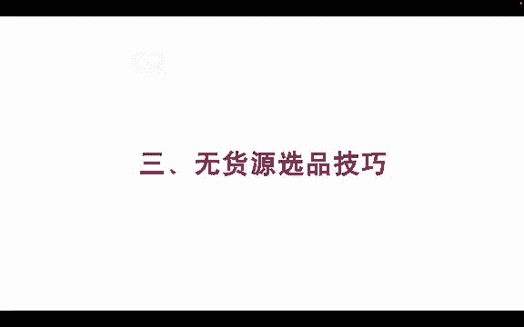
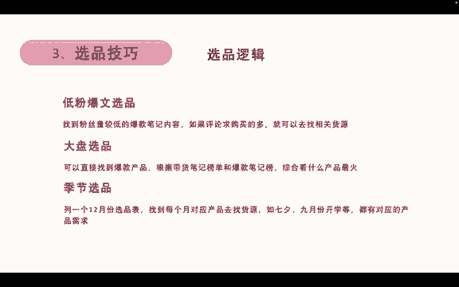
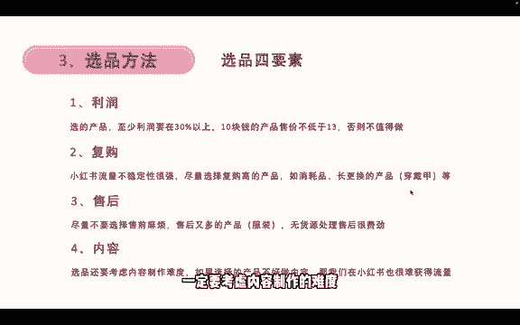

# 【2024版小红书体运营教程】全B站最良心的小红书开店运营教程！小红书体开店 起号真的快，赶快点赞收藏起来 - P6：6.小红书爆款选品技巧 - 小袁运营 - BV1Px48eQEai

我们再来看下无货源的选品技巧，无货源的选品逻辑呢有第一个叫低粉爆文，选品，就是找到粉丝量比较低的爆款笔记来做内容，如果说他的评论里面求购买的很多，那么我们就可以去找相关的货源对吧。

因为这个品他是报在产品那里嘛，我们就可以找到相关货源，然后第二个呢叫大盘选品，就直接找到爆款的产品，比如说杯子，我直接找到杯子的这个品类，然后我再根据带货笔记本跟爆款笔记本，看看哪一款杯子最火。

或者说哪一个服装最火，那么我们找到最火的去找货源对吧，这也是大盘选品的方式，第三个呢叫季节性选品，我们列一个12月份的选品表，然后对应每个月份找到呃，就是找到每个月对应的产品去找会员，比如说七夕的礼物。

9月份的开学礼物书包，他们都有对应的产品和需求对吧，我们就可以找到这一次产品去做。

那具体的选品方法呢，有几个工具可以选择，工具的话，我们使用灰豚数据和新猩红，还有产小红这些都可以，我个人是比较推荐辉腾数据，因为辉腾数据新物可以白嫖几天的时间，足够用了，灰豚数据的话，看左边的这个图。

我们打开灰豚数据的官网，找到笔记，查找里面的笔记榜单，咳，我们在笔记榜单里面找到中间的低粉报文版，再找到自己想要卖的类目，比如说时尚配饰好，那我们就能找到配时尚配饰类的低温报文版，我们就来看到。

我们筛选近三天的时尚配饰类的低粉豹纹，然后看第二个它就有一个呃小小的包，这小小的包，那么这一个配饰就是跟产品相关，我们就可以找到这么一个包来卖对吧，然后第二种呢叫笔记榜单，我们找到笔记榜单。

然后带货笔记榜直接找到时尚类的带货笔记，然后这一个像这种项链，这一个小项链呢，它就是在带货笔记本里面做的比较好的，就数据比较好，卖的比较好的产品，那么我们也可以去模仿他找一样的选品。

那这就是低粉豹纹和带货笔记本的做法，那这里有个比较关键的地方，就找产品的时候，尽量的去避免手工定制类的产品，和大品牌的产品，因为手工定制类的你找不到货源，因为这是他自己个人做的个人定制的手工博主。

个人自己就是创造的这个产品，所以你是没有办法找到货源的大品牌产品呢，呃比如说我们做手机对吧，手机你想要卖华为手机，那肯定是你说要拿大品牌授权对吧，所以这种大品牌产品你也是不好去做的。

所以我们要避免这两个问题，那么选品还有四个要素，选品的方法里面还有四个要素，第一个利润，我们选的产品，至少利润要保证在三30%以上，比如说我们十块钱的产品，十块钱成本的产品售价不能低于13块。

否则的话这个品就不值得我们去做，因为你还要考虑你的人工，还要考虑额有可能会产生的售后等问题，所以我们尽量的利润要保持在30%以上，第二个呢叫复购，因为小红书的流量不稳定性很强，我可能这一篇笔记报了。

但是我不能保证每一篇笔记都报对吧，所以我们尽量的去选择一些高复购的产品和，比如说像消耗品和长期更换类的产品，比如穿戴甲内衣啊这些，那么他在你这买过之后，他很可能还会倒回来再买，比如说穿戴甲带了半个月。

到一个月左右就不稳了，那他就需要换新的，那很可能会找回我们这一家，然后再买一个新的，所以我们要找做有复购的一些产品，然后第三个呢就不要去选择一些售前麻烦，又售后又多的产品，比如说像服装。

当然这里举的例子是服装，但服装还是比较好做的一个品啊，所以可以只是举了这么个例子，售后很多，因为服装为什么说售后多呢，特别是女装，女装的产品，它是非常容易出单，非常容易爆单的。

但是呢他的退货率也非常的高，正常的女装退货率有50%左右，就是卖100单会退掉50单，所以这个我觉得是非常麻烦，对于无货源来说非常麻烦的一个事情，甚至有一些质量差的，他能达到70%。

80%的退货就卖100件，退掉70件，那这种产品也没有办法去做，做特别累对吧，而且无货源处理这些东西的时候是非常费劲的，然后前面这三个额利润复购和售后，是几乎所有电商平台都会教你的选品三要素。

但是呢别人不会告诉你的是，如果你是做抖音，做小红书，做内容电商平台，第四个要素他们几乎不会告诉你，但是是非常非常关键的要素，就是内容，我们选品的时候还要考虑内容制作的难度对吧。

如果说我们选的产品你不好做内容，那你怎么在小红书上获得流量呢对吧，如果说你一个男生，你想要做内衣的产品，那你是很难拍摄内容的对吧，你只能做摆拍的那种，然后你自己不好去做内容，但是如果说女生去做的话。

她很可能做内容更比你更容易，他能卖的也比你更多，特别是穿戴甲这种穿戴甲如果是男生去做的话，你很难获得流量，你很难拍，因为穿戴甲它需要戴在手上才好看，如果你摆拍的话，它可能不是很好看对吧。

那如果女生去做这个的话，她能获得流量的概率比你更大，她能卖爆的概率也比你更大，所以我们在选品的时候。

