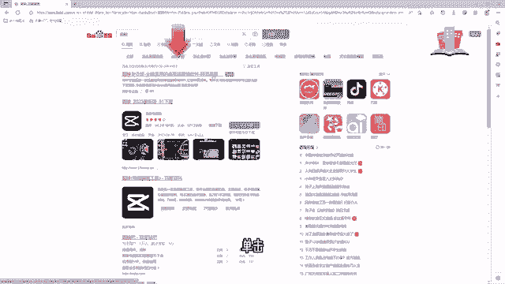
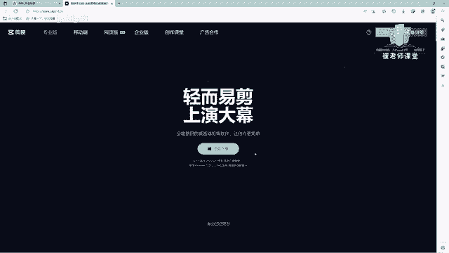
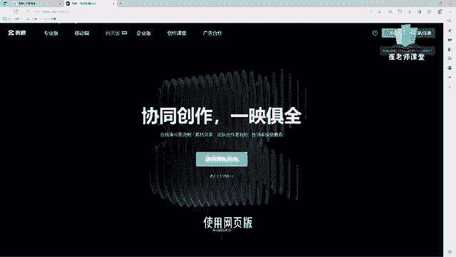
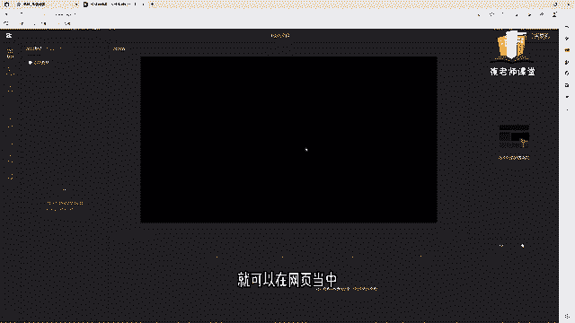
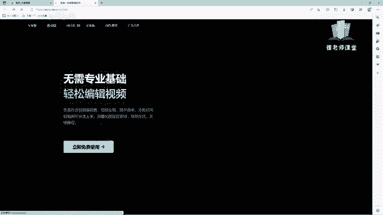
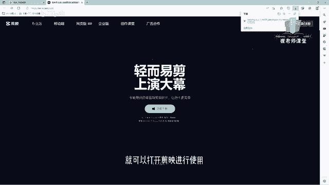

# 【2024版小红书体运营教程】全B站最良心的小红书开店运营教程！小红书体开店 起号真的快，赶快点赞收藏起来 - P7：5.剪映下载安装 - Sathenay - BV1uqHreLEER

我们来讲一下剪映的下载以及安装，首先选择浏览器，双击打开，在这里呢我强烈推荐大家使用百度网进行搜索，网址是3W点百度点com，在搜索栏当中呢输入剪映在上方的位置，大家可以看到有官网的提示。

我不推荐大家使用其他的渠道进行下载，或者是第三方的网站进行下载，因为剪映专业版呢，本身就是一款免费的视频剪辑软件，在官方网站下载呢，能够保证它的稳定性以及安全性，单击就打开了剪映专业版的官方网页。

在上方菜单栏的区域呢，我们可以看到有专业版，专业版呢其实也就是我们所说的电脑版的剪映，可以进行单机下载。

另外呢还有移动端，移动端呢就是我们所说的手机的app，可以进行下载，另外呢还有网页版，如果你因为时间的关系或者是空间的关系，没有办法下载专业版或者使用移动端，那么我们就可以使用网页版。

进行快捷的进行视频剪辑工作，选择下面立即免费使用，就可以在网页当中直接进行视频剪辑的操作。

另外呢还有企业版创作课堂广告合作，在这里我们不多做介绍，我们选择专业版，选择立即下载，如果您使用的是Mac电脑呢，其实也是相同的，我们选择立即下载进行下载，等待下载完毕进行安装，下载完成之后呢。

我们打开下载后的安装包，选择运行，在这里呢就来到了剪映的安装界面，选择立即安装，安装之后呢，选择立即体验就可以打开剪映进行使用。

第一次打开检验的时候，它会进行环境检测，检测完成之后呢，我们就可以进行正常使用，OK能够确定电脑可以流畅的运行，我们选择确定就打开了剪映的工作界面，当然在安装之后呢，它会在桌面上创建一个快捷方式。

