# 【2024版小红书体运营教程】全B站最良心的小红书开店运营教程！小红书体开店 起号真的快，赶快点赞收藏起来 - P7：5.小红书平台规则逻辑（2） - 快乐稳定发挥 - BV1AbtoebEjX

大家好，今天给大家分享的是小红书，全方位分享的第四大课啊。

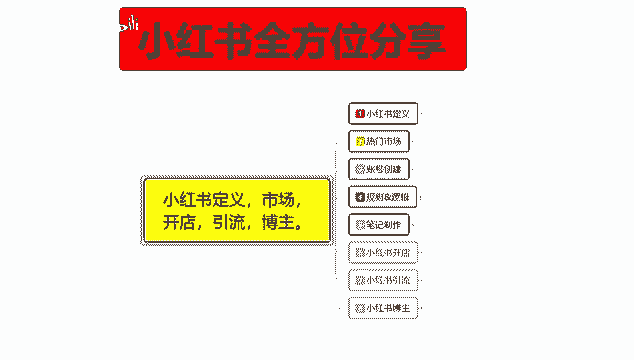

规则逻辑的第二部分内容，上节课呢是给大家讲了一个推荐规则，和一个被推的核心逻辑，这一节的话是推荐推牛的一个规则啊。

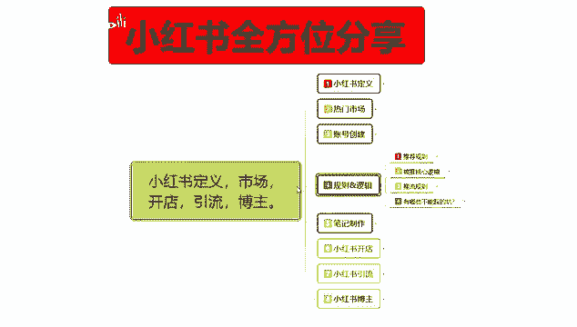

就是小红书怎么给你获得更多的一个流量曝光。

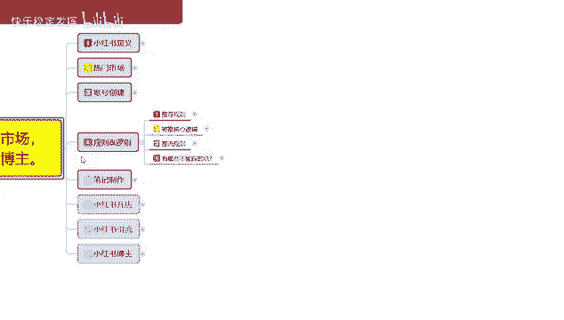

推流规则里面的话，其实就是一个推荐规则和被推核心逻辑，我们其实把它只是整整体啊属性分开了，让大家了解一下啊，第一个呢是发现流量，第二个呢是搜索流量，往后面呢是打开率，互动率和速度所结果。

这个是一个整体的。

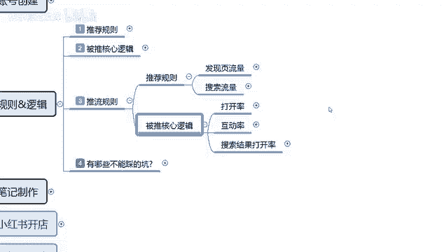

你如果说要把那个流量持续放大的话，那你这些属性的话。

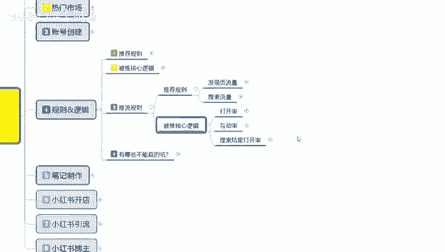

你都要需要去了解，首先呢是发现流量。

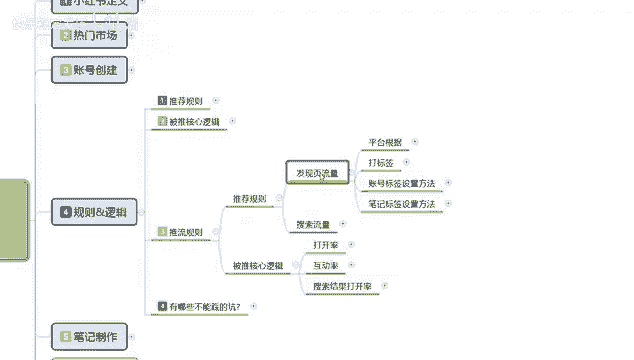

发现流量里面啊，发现页的一个整体流量的话，他是平台根据账号标签，笔记标签，然后设置的一个话题和重复关键词进行排序的，第二个呢是打标签，推送给同领域的小部分人观看，然后呢他观看以后的话。

里面的一个转发评论收藏点赞越多，推荐的人呢也就越多，第三个呢是账号标签设置方式，就是说如何给自己的账号和笔记打上精准标签，让平台精准推广，其实这个也是比较好了解的，首先呢就是说多看和自己同领域的内容。

然后增加用户标签，入住入住的新账号啊，感兴趣的内容选项，同领域的一个，这个就是说你我们推荐流量的时候，就是前期呃，上前面几节课给大家讲解那个账号创建的时候，这里面的话有一些那个标签内容属性。

就是做这个推荐流量的，如果说你不做这个账号创建，里面的那个同行的数据去观摩的话，那你就不会有这些东西，你比方说打标签，账号标签测试方法，笔记标签测试方法，这三个点你都不会有。

那也就是说平台给你的账号基础权重，曝光量的话也就在500左右，你做了这个属性，你你把这些属性做完以后的话，基本上曝光量应该都是在1000到2000左右，然后你后续的一个笔记，点击率超过11%以后。

就是给你1000到2000，曝光以后，你大概有200到300个小眼睛以后的话，你就会进入下一层级，他这个小红书基础曝光流量，它里面还是有层级划分的啊，这个你们一定要弄清楚啊。

所以说你一定要把这几个内容把它了解清楚啊，你不能说是觉得账号创建，把账号创建放在那，然后其他的不做就可以了，他这个里面包含的内容是很多的，你账号前期创建呃，你包括你的一个社区规划，社区规划是什么意思呢。

把你放到同类型的一个人群里面去啊。

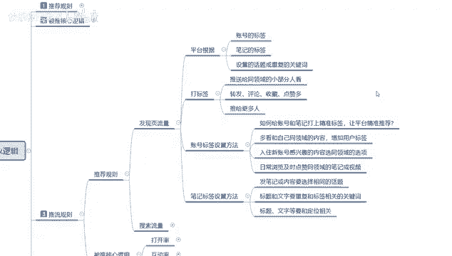

上节课给大家讲的那个被推核心逻辑里面。

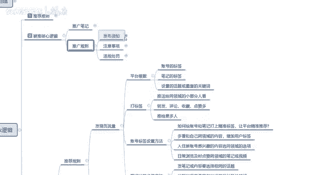

有一个色气血社区的一个行为规范，就是这个意思，你不能跨社区的去操作，那我们在创建账号的时候，你也要把自己的社区给选定好，你不能说你前期选定社区的时候，你前面直接选了个女装。

然后你去卖化妆品肯定是不行的啊，你已经跨社区了，因为你的账号选定的时候，账号创建初期你就是选择的女装，那你就只能去做女装，懂我意思吧，你账号如果说你前期选择的是做引流，做博主去推荐。

去发那种开心类的一个广告的，你到后续了做的差不多了以后，然后你去发美妆，发女装之类的笔记的话，系统不认可你的，他给你的一个流量数据的话是非常少的，就说你已经跨跨社区，跨行业去操作了啊，系统小红书。

它平台的它是靠系统运营的，他的系统不认可你，那就不会给你更多的流量和曝光，导致你整个账号权重下降，懂我意思吧，而且会遭到管家的警告，超过20%以后的话，管家警告以后，你这个账号基本上就废掉了啊。

封号的，所以一定要把这些东西给弄清楚，我们在发现流量里面的话，就是说它平台是根据账号的标签，笔记的标签，然后设置的话题重复的关键词，这四个点来判定你的账号在哪一社区群体，然后我们通过打标签账号设置。

然后呢笔记标签设置方式，通过这三个方式把这些账号设置好以后，去发笔记，他才会给我们推流，就是给你技术曝光量，不然的话我们是没有技术曝光量的，后面这个标签账号设置方法的话。

就是说啊多看自己的同行领域就可以，然后呢笔记是标签设置方法的话，就是把笔记或者内容选择要相同的一个话题，就是你的话题不能超纲啊，只能在这一个范围之内去进行推广，然后呢标题和文字重复。

和标签相关的一个关键词，就是你比方说你发服装的，那你的关键词就是女装短袖T恤短裤对吧，内衣等等跟服装有关的关键词才可以，你不能说是今天天气呃，今天天气不错嗯，然后的话呃穿着什么什么出门或者等等之类的。

和你的产品关系不大的那种吸引用户的啊，比方说嗯这里面的话，你其实你去看小红书里面的那个推流，你看别人的一个关键词做法的话，其实很好理解的，就说你一定要包含你的关键词，然后去发放笔记。

他给你的流量是更多的，你如果说用那种，大家快看这是什么等等，就是不包含你产品的主关键词进去的话，那你的流量曝光的话，最少会减少30%到40，本来有1000的技术曝光量。

最后可能只有600的一个技术曝光量，600的技术曝光量，你要达到1000基础曝光量的一个点击率，最少有20%，到25%的一个点击率，也就是两接近200到300的一个小眼睛数量，你的这个笔记才能做爆。

你的难度是相当于难度系数直接翻了一倍啊，你的笔记才有数据才会推广给更多的人，所以说有时候的话笔记标签设置的方式，这里面的标题和文字重复啊，一定要和你的账号设置，和你发的图片内容要有关联性。

如果说没有的话，那你相当于先把自己剁一刀，然后再去通过关键词吸引更多的访客，点击率要达到20%，接近30%才可以，这个呢大家首先要了解啊，这个还只是发现页流量的一个数据量啊，这里面还有搜索流量。

搜索流量的话，它比较适合我们在小红上面去做店好吧，额搜索流量的话，我会，这个怎么说呢，就说搜索流量的话，你们了解一下就可以，因为如果说你在小红书上面，你自己要去做电脑啊，你可以了解一下。

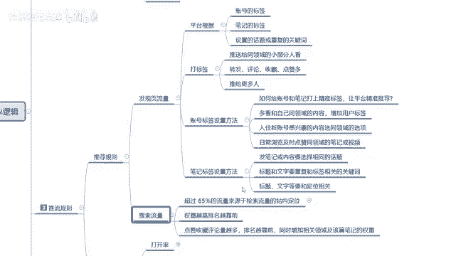

如果说你不做电脑的话，其实搜索流量对你没有太大的一个作用。

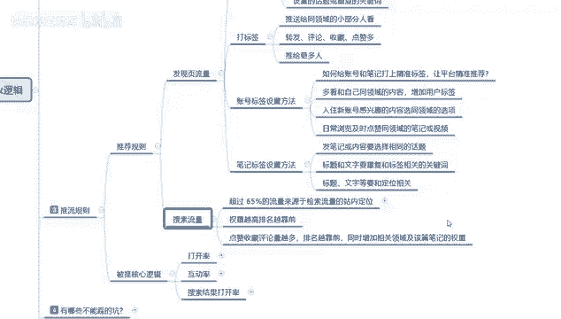

搜索流量里面，超过五六十五%的一个流量来源，与检测搜索流量的一个站内定位，什么意思呢，就是说超过65%的流量来源，他都是小红书系统，经过筛选以后，觉得你的呃笔记内容不错，已经升段了。

就是说已经有一定的基础数据量了，然后或者说是你刚发的，然后你的账号平均的嗯，你之前发的一个笔记，已经获得过比较高的一个曝光点击，然后的话你发同样的一个内容，别人用户新用户去搜索同类的一个关键词。

搜索到你以后，然后经过排名竞争系统的话，有65%是随机匹配，35%是排名竞争进行分配的。

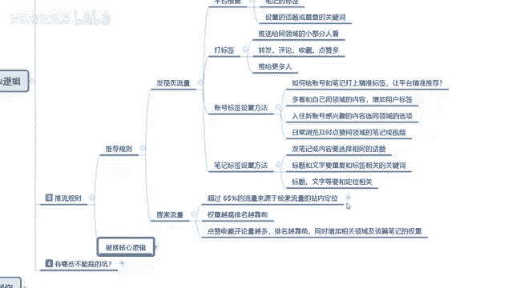

这个里面的话它的一个搜索的话是默认提示词，然后搜索发现热门搜索，补充联想关键词和热门关键词，靠这几个排名去操作的，这里面65%的流量来源，基本上都是在这四个词汇里面，剩下35%的话是排名，是整体。

你的笔记排名和你账号排名来进行划分的，这65的话是呃默认提词，然后的话发现搜索补充联想关键词，热门关键词，就是我们在那个放大镜里面输入关键词以后，它下面那些联想词，它占比流量比例的话是65%。

他这65的来源就是靠关键词排名，和你造化排名去做搜索的，然后呢你的排名权重越高，排名也就越高，前获得展示曝光的机会也就越高，同样的你的整个账号权重不够，就是我们前面你的发现。

你页流量和你的账号技术权重不匹配的话，你基本上不会去进入到搜索流量排名阶段，你也就是说你在搜索流量里面的话，除非别人拿全关键词出去搜索你的产品，不然的话你是没有任何曝光的，基本上你就放弃了。

这接近65%的一个搜索检测来源，剩下35%里面一个是商品，一个是商品关键词啊，和你们没什么太大关系的，然后这个里面的话额权重越高，排名越高越靠前，他是靠哪几个点，第一个是点赞，收藏评论量越多。

你的排名也就越靠前，同时增加相关领域及该篇笔记的一个权重，比如说你要把综合属性全部做好以后的话，系统才会给你更高的一个权，综合属性，你如果说做不到位的话，那你整体去属性它就会偏低啊，他就不会给你排名。

给你展示曝光，基础的话，额就是给你提升属性，你也提升不上去，最多给你一两百的一个曝光量，那一两百个曝光量，你在搜索里面啊，你做商品的话，可能还有那么一单两单的一个转换，但是如果说你要是做引流的话。

一百一两百两百的一个搜索引流曝光，你想把这帮人引出去，难度系数有点高啊，做商品还做搜索流量，做商品的话还好，如果说你做搜索流量，做引流，做网红的话，那难度就比较大了啊，搜索流量的话，它适用于商品啊。

不适用于去做网红啊，做博主之类的，做引流也不好。

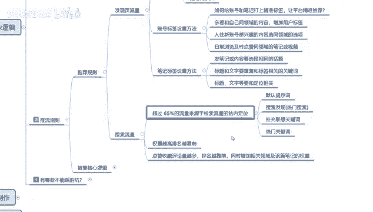

做，引流的话，你基本上都是做发行一页的一个流量，让大家了解一下小红书的一个推荐的一个规则，好吧，这节课呢就给大家分享到这，下一节课呢给大家分享一下。

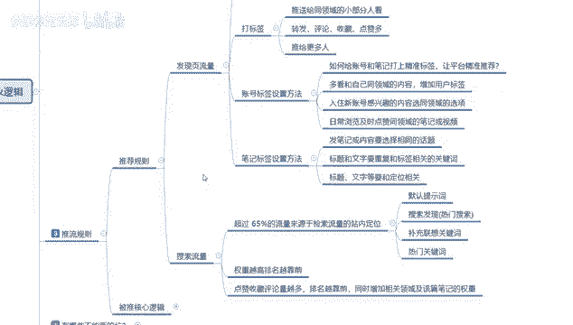