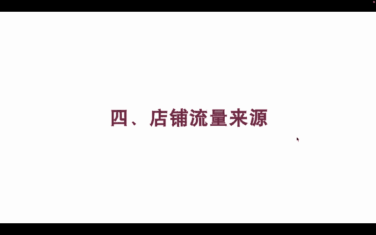
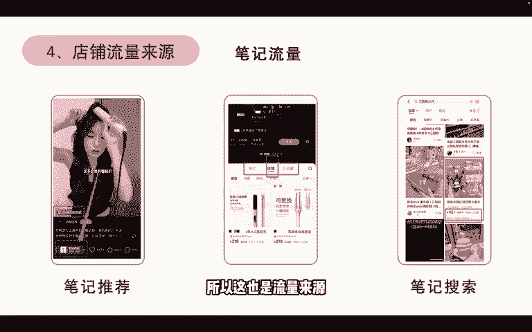
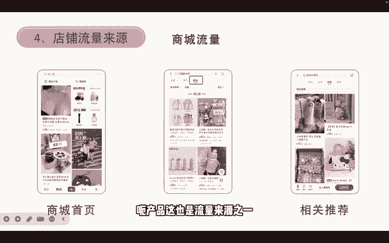
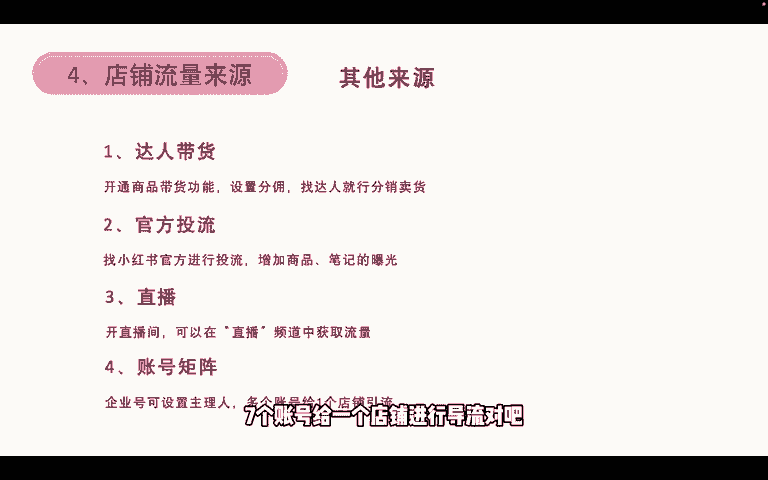

# 【2024版小红书体运营教程】全B站最良心的小红书开店运营教程！小红书体开店 起号真的快，赶快点赞收藏起来 - P7：7.小红书店铺流量来源 - 小袁运营 - BV1Px48eQEai

我们再来看一下店铺的流量来源，第一个店铺流量来源就是笔记推荐，比如说我们刷到这个笔记之后，他左下角就会挂着一个链接对吧，我们就可以从这里面进去产品，然后第二个是个人主页就进，如果说我只刷到笔记。

然后进入个人主页的话，我可以点开这个店铺，然后看到其他的产品对吧，这是第二个流量来源，第三个是笔记搜索，比如说我搜索369水杯，好搜索产品的这个关键词，那我刷的时候。

他除了会给我推荐带这个关键词的笔记外，他还会推荐带这个关键词的产品，那这一个就是产品，所以这也是流量来源。

还有商城的商城的流量是，我们打开小红书首页首页，然后第二栏叫购物，打开购物，这里面也能看到我们的产品是吧，还有商城商城搜索，比如我们搜索关键词的时候，我们不选择笔记，我们选择商品，那这也是流量来源之一。

还有就是相关推荐，比如说我点开某一个产品，我划到最底下之后，他会给我推荐与这个产品相关的一些额产品。

这也是流量来源之一，还有其他的来源，向达人带货，我们可以开通商品带货功能，这个只有企业号能开，就是个人企业，个体企业号跟企业的企业号才能开通，然后我们设置好分佣，找达人帮我们分销卖货就可以了。

跟我们抖音做直播卖货是一个道理，然后第二个呢叫官方投流，我们可以找小红书官方进行投流，增加商品和笔记的曝光，然后第三个呢是做直播，我们在直播间，我们可以开个直播间，然后在直播的频道中获得额外的直播流量。

然后第四个就是账号取证，一个企业号，个体的和企业的都算一个企业号，可以设置多个账号处理的，比如说一个企业号可以设置三个个人主理人，和三个企业主理人，那也就是说一共有七个店铺给一个店铺。

