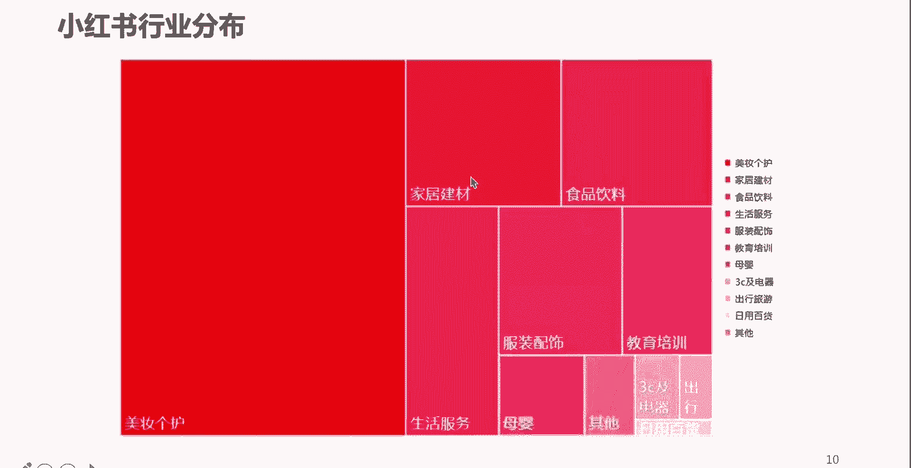
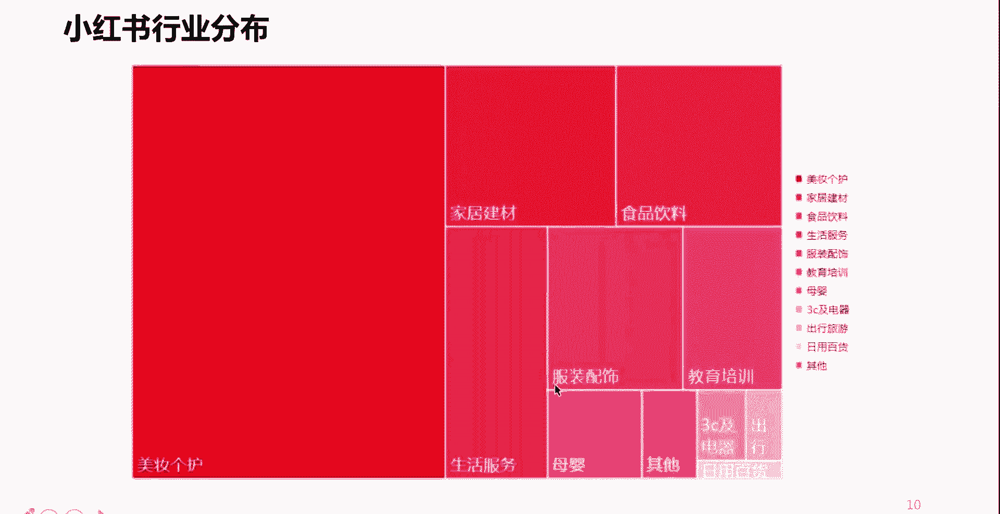
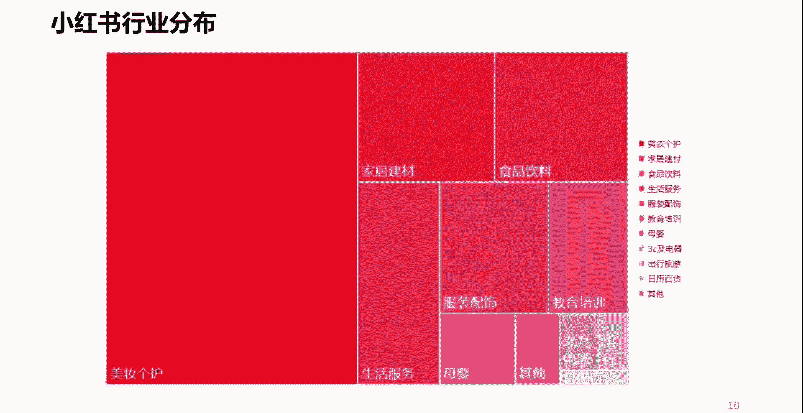
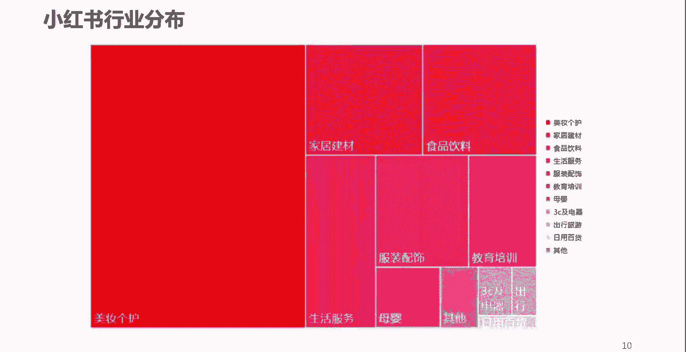

# 【2024版小红书体运营教程】全B站最良心的小红书开店运营教程！小红书体开店 起号真的快，赶快点赞收藏起来 - P7：P6小红书的内容类别 - Sathenay - BV1ajsJecEJB

那么再往下，我们看一下小红书的主要内容的一个分布啊，你比如说占到了半壁江山的啊，占到了半壁江山的还是美妆客户，所以这也就不难看出，为什么小红书的主要用户是年轻的女性了是吧，好第二个是家居建材类的是吧。

包括食品饮料类的，然后还有什么呢，生活服务啊。

服装配饰，这也是一个大类啊，这也是常见的哈，包括教育培训啊，像其他的呢也有一些啊这些，所以大家在做小红书的时候呢，也可以积聚啊，基于这样一个内容的分布啊，内容的比重啊去考虑啊，去考虑一下。

是否涵盖了你所在企业的一个什么呢，业务类型或者是商品的一个类比啊，所以说我们知道做小红书，或者我们在任何一个平台上去做运营，必须得考虑这个平台的主流的用户，都喜欢什么样的内容。

因为每个平台都有每个平台的特征，对于每个平台的用户的喜好，对吧嗯这个你是不可更改的啊。

不可更改的，所以说呢一定程度上呢，我们要去借着这样一个东西，去做我们自己企业的一些哎电商，或者做我们个人想做的一些有意思的，或者是优质的内容好。

