# 【2024版小红书体运营教程】全B站最良心的小红书开店运营教程！小红书体开店 起号真的快，赶快点赞收藏起来 - P7：第6节：小红书爆款封面和标题拆解 - 听风的歌日记 - BV1mmvDeiENW

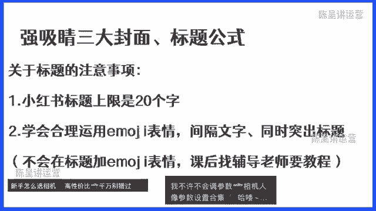

接下来我们再来讲一下爆款的封面拆解，爆款的封面拆解的话也是非常重要的，因为大家知道封面比标题还要重要，因为色彩更加的鲜艳，它比标题还要突出，那这里的话大家一定要注意一个问题啊。

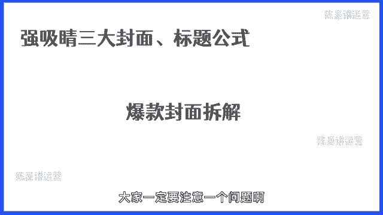

就是不管你做任何一个流量渠道，想要通过任何一个渠道来进行流量的获客，都离不开一个非常非常非常重要的底层逻辑，打开率，打开率的前提是什么呢，就是要具有吸引力的封面图，为什么是封面图。

因为封面因为人眼对色彩更敏感，而封面也是用户能够第一时间快速助力，注意到你的很核心的这样一个展现的东西，所以说封面就可以说是用户对你的第一印象，那怎么来制作一个戏精的封面图呢。

这里的话给大家提供三个很重要的，封面的知识点，然后呢再给大家去提一下。

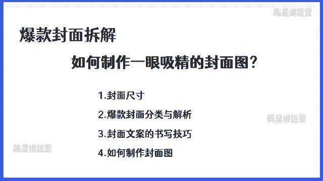

关于制作封面的这样一个事情，那首先我们要先讲一个关于封面尺寸的问题，很多的同学啊，我发现有很多的同学，包括我之前带的一些徒弟，在刚开始不懂这个封面标题是吧，做标题，做封面都是完全乱做的。

就是有的封面做的很大，有的封面呢做的也很小，结果上传到小红书里面，发布笔记之后，整个封面都有点看不下去啊，非常的痛苦。

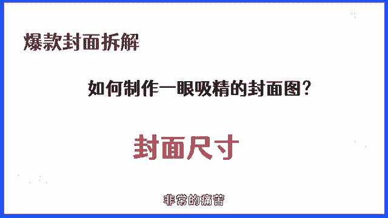

那怎么来做呢，所以说这里的话，首先大家知道封面尺寸，在小红书里面到底有什么影响，那我们在这个图上面可以看到，这个图上面我们会发现有几个，我用红色框框标出来的，这每一个笔记它的尺寸大小是不一样的。

那大家会发现长方形的是最长的，它的整个曝光度和整个吸引人的，这样一个点也是最大的，相反像这种长方形比较小对吧，他就更没这么容易让人被，更没有这么容易让别人快速的看得到，所以说尺寸它的重要性就在于。

尺寸对于我们的曝光会起到很大的一个帮助，那尺寸一般包括什么呢，这里的话给大家讲一下，小红书的小红书三个核心尺寸，首先第一个尺寸就是它的四比三的尺寸，四比三呢就是我们所谓的横屏，横屏的效果图。

就在这样一个图上，大家可以看到另外一个是三比四，三比四呢就是属于长方形，长方形的话相对于横屏来讲，它会更加的长一点，正方形呢相对来讲它就比较小，所以说我们可以看到小红书的尺寸，它一共就只有三个三比四。

也就是竖屏横屏，还有就是这样一个正方形，那知道这个以后，我们来看一下这三种尺寸，分别在我们的笔记里面会长什么样子，那首先我们可以看到最左边，最左边的话它就是一个长方形，这就是四比三的横屏。

那这边的话中间这个是一比一，就是个正方形，那相对来讲的话，三比四的这一个竖屏，它就会比其他两者要更突出更大对吧，所以说这是尺寸的一个区别，那这里的话我们更加建议大家。

我们做的所有的图都要选择三比四的尺寸，因为三比四它是长方形，比起其他两个来讲的话更大，更容易展现我们想要展现出的内容啊，所以这里的话强烈推荐三比四尺寸，讲完之后呢，我们接下来讲一讲关于封面的一些分类。

那封面的话一共会分成两种，一种是聚合型的封面，我们也把它叫做拼图封面，另外一种呢叫做爆款单图。

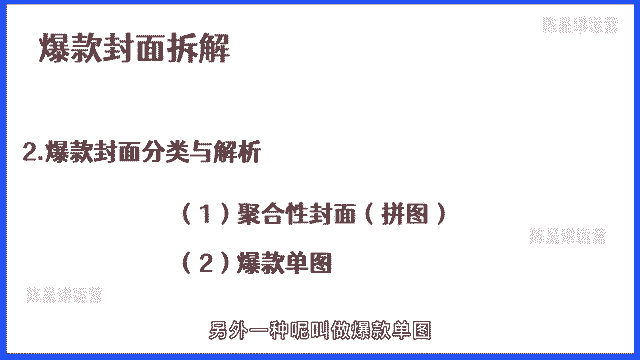

那我们从第一个聚合封面来讲，聚合封面它的特点是什么呢，从视觉的角度来讲，它会给人的感觉是内容非常的丰富，会增加用户点击的欲望，那像这种所谓的聚合型封面，一般来讲用的比较多的地方就是合集。

还有一个就是对比图，我们来给大家举几个例子。

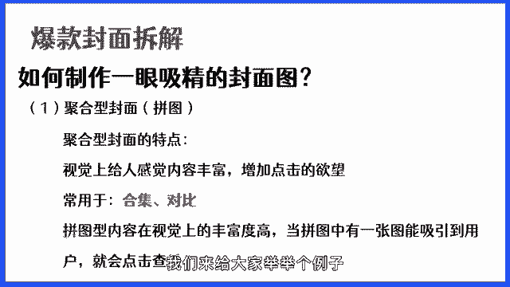

大家看一下啊，上述的这几张图呢全都是属于聚合类的封面，大家有没有发现这几个封面的特点在哪里，是不是它是有一个一个的图片拼凑在一起的，那这拼凑在一起的图片，是不是给我们的感觉就是内容特别的多啊。

各位同学对不对，这其实就是聚合型封面，它最大的优势，因为它从整个视觉的角度能够让我们看到，能够让我们觉得丰富度非常高，并且呢如果说用户看到我们这一个封面上，其中有一张图如果吸引到了他，他就会点击啊。

所以说它是一个非常好的视觉效果，对我们来说也是一种参考，那当然我们刚才看的是这种合集类的，我们再来看一下对比类的这样一个聚合类封面。

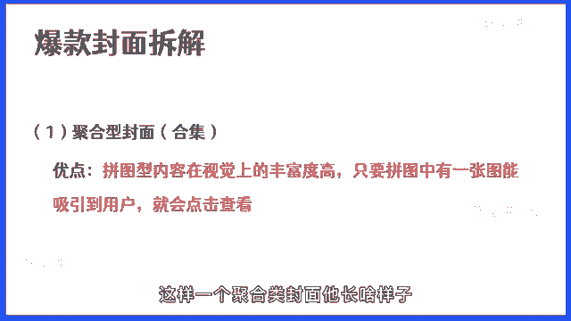

它长啥样子啊，这个的话应该大家在小红书里面，经常都能看得到对吧，就是两者的对比，那比如说像减肥前，减肥后对吧，像化妆前化妆后，像这样一些赛道，他都会喜欢用对比图，那在这上面的话，我们举了一个摄影的例子。

大家也能看得到对吧，它的整个区别在哪里，其实就是前后的反差，能够在一张图上面快速的能看到，能够看得到对吧，所以说它的优点是什么呢，它的优点就是它的前后对比反差非常的明显。

也能够提升用户点击的欲望和想法对吧。

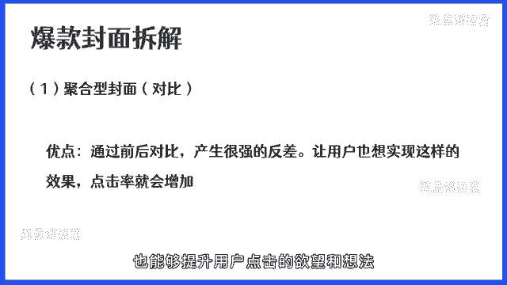

点击率就会因此而增加，那这里的话值得注意的是，不管你是用的拼图还是对比图，一定要注意的是，你选用的拼图风格一定要一致，不然看起来会非常非常的杂乱，会导致用户会看不清楚，会导致用户眼花缭乱。

根本就分不清楚你的内容的重点，第二个呢就是多张图片进行拼图，图片的文字一定要醒目，因为只有这样才能吸引用户的注意力，因为你的拼图上的色彩和内容特别的多，所以说你的文字如果说不够醒目，那就会出现内容。

傻傻用户看不清楚对吧，刚才给大家举的这几个例子，其实就是很好的一个案例。

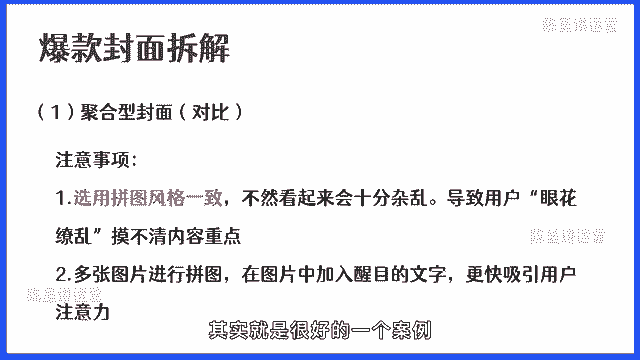

讲完这个聚合型的封面之后呢，我们接下来讲一下爆款单图。

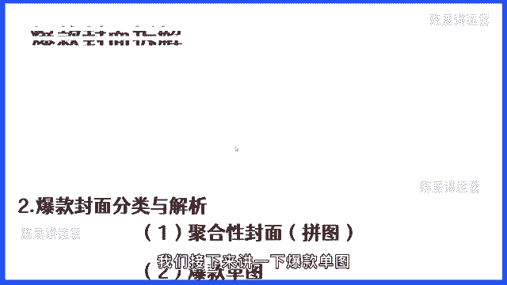

那爆款单图呢也是小红书里面用的比较多的，那比如说我们看一下常见的几种单图的样式，比如说你看它里面就会包括了从左到右，全都是属于一张图片，然后呢在上面加了一些元素，加了一些文字，当然爆款单图的话。

它的整个核心的点其实就在于它需要通过需求，需要通过刚需的选题加组合标题来进行，突出它的整个单图的优势，那我们来看一下单图它最大的一个优点在哪里，首先第一个单图它可以通过结合用户群的特点。

来进行一个主选题的一个制作，所以你会发现经常有一张图片上面，它会有一个很大的一个文字标题，这个标题其实就是迎合用户的需求，把用户最大的痛点，把它放到最显眼的地方，然后呢再把一些相关热度的一些内容。

包括就是对这一个大标题的一个修，饰的一些关键词，小标题放进去，而这种点击率，点赞率，收藏率都会高于一般的单一选题，就是说你的一个选题，你的一个选题下面还有一到两个，两到三个相关的高通点的选题的话。

就会让你的整个封面变得更加的吸引人一点，这是关于单图的一个优势，那我们来举一个例子给大家看一下。

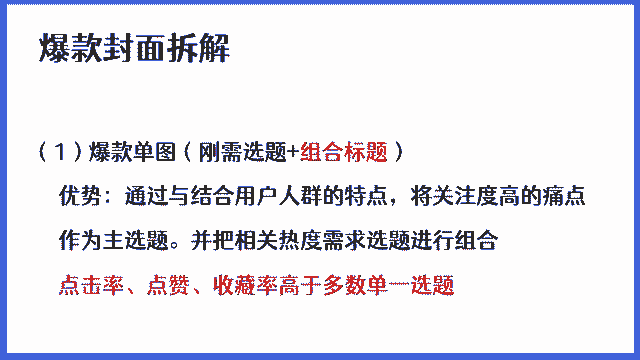

举个例子啊，首先如果说我们要做一张单图，那我们的产品是摄影的课程，我们的用户群呢都是一群初学，初学摄影的新手小白，那他们的痛点需求包括什么，第一个他可能是一个零基础，想要学习摄影，他不知道怎么学。

他想要方法，第二个呢他对于相机，镜头构图等基础知识的入门，它是很需要的，还有呢就是他可能对于一些学习方法，对于这一些东西也很感兴趣，那当我们在做选题的时候，其实也是在做用户需求和痛点的分析对吧。

在这里的话我们先提一下，那我们的主选题可能就会包括什么呢，例如零基础学摄影经验总结，那我们可以组合的选题就包括了学习网站，app分享，还有电子书，那我们来看一下一些具体的案例。

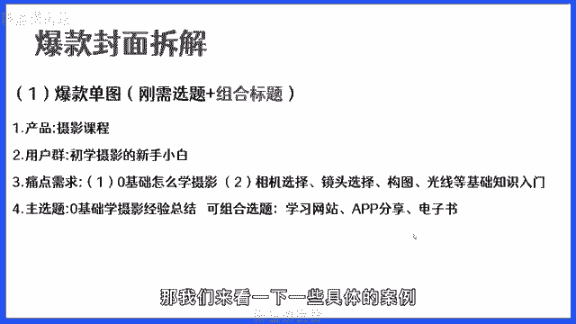

这里的话给了大家三个案例，这三个案例呢其实都是属于，零基础学摄影的主选题，那大家可以看到这一个主选题，他们的背景样式，其实都是摄影师或者唯美的一些拍摄的作品，那他们的排版呢也有一个共性，是什么。

共性背景图简洁好看，一眼就能够看得到重点，然后呢他们采取的这样一个标题的方式，内容的这样一个方式，就是七天速成和12天学摄影，都是用的这种系列更新的这种方式，来进行主选题的这样一个包装。

标题的这样一个设计，那它们里面都会有一些小的标题，例如干货预告适合什么样的人群，还有这篇笔记的特点，那像这一些关键词的话，都是来修饰它的这个封面，能够让这个封面变得更加有吸引力一点。

这是关于单图的一第一种单图就是刚需选题，叫组合型选题，然后再讲另外一种爆款单图的一个形式，就是高密度的信息展现或者纯文字，那像这种呢比较适合用一些例如像考研啊，像比如说像摄影的一些知识类的分享啊。

像这样的内容是比较适合这种高密度，文字比较多的这样一些爆款单图的，那这种笔记大家可以看到上面的这几个案例啊，这几个案例它的特点是什么，大家有没有发现你通过这几个案例。

你就能快速知道它的内容主要讲的是什么，都是一些非常专业的内容对吧，比如说你像前这几个里面的内容，我们就可以看到，因为它很直观，它就是一张单纯的文字比较多的一张图，那它的特点就包括了如下这几个点。

首先第一个我们可以看到用户清晰。

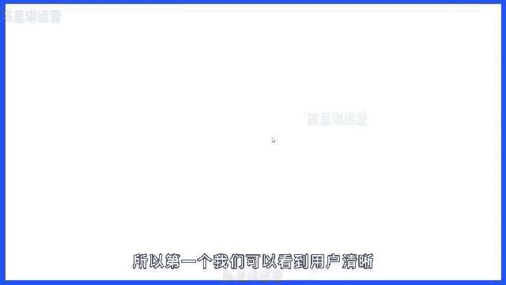

就是我们可以通过单图，可以看到这个笔记的内容方向，第二个呢我们可以通过他发的内容，能够感觉能够体会到能够体现博主的专业度，还有就是它的信息密度，第三个呢，像这种类似于爆款单图的这种，文字型的封面的话。

它一般都用作于一些专业的干货的分享，那相比于单图，还有就是加包括文字的话，它有个很大的一个优点，就是它的信息量更直观，因为它打开的时候信息就全部展现了，没有打开，在你看到它的时候。

信息量就已经很直观的出现了，那在这里的话，对于爆款单图就会有一个注意事项的点。

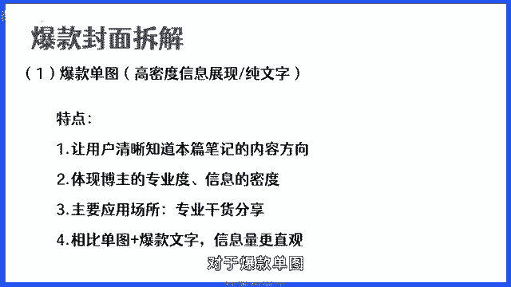

大家需要注意，首先第一个单图它比起多图来讲的话，他的创作成本比较低，你只要通过若干个关键词，就可以把这样一个笔记的重点内容告诉他了，这就是纯文字的爆款单图，它很大的一个优点。

第二个呢就是首页的关键词需要足够的吸引人，因为你的内容大部分都是文字，那你的最大的这个主题的文字，就必须要尽可能的吸引人，这样的话才能够去点，才能够去激发用户打开这一篇笔记的欲望。

但是也要注意的就是因为文字多，但是呢不能因为文字，导致它的整个内容过于密密麻麻的，这样的话不光会影响到美观，也会影响到用户，第一眼看到你这个笔记的印象，可能就会导致用户能不能点击你的。

这样一个很重要的一个原因，那这里的话我们就把爆款的一些，两个封面的类型给大家简单的讲了一下，大家的话自己要去课后稍微吸收一下，那这里呢值得大家注意的是啊。

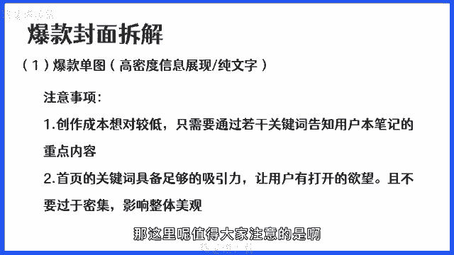

有一个值得大家注意的一个点，首先第一个你做的封面，你的文字和你的封面的元素一定要契合，你所做的这一个主题一定要契合，不要就是你的封面的内容和你的封面的标题，和你的图片完全互相独立开，没有任何的关联。

这样是非常不好的，另外一个呢就是大家在图片里面，不管是单图还是拼图里面，添加文字还是元素的时候，一定要注意摆放的位置，尽可能的保证整体的风格，还有就是这个内容和图片的协调性，封面标题封面的协调性。

第二个呢就是整体内容的封面，尽可能的要一致性，你要保证比如说你的字体，你的字体是你的大字体是比较方的，那你的复字体，你其他的小标题的字体，你一定要用它类似的，不要用不同的字体。

这样的话比如说你上面的主字体是方的，你下面的字体是圆的，这样的话就不好，这样的话你的整个封面就会看起来很别扭。

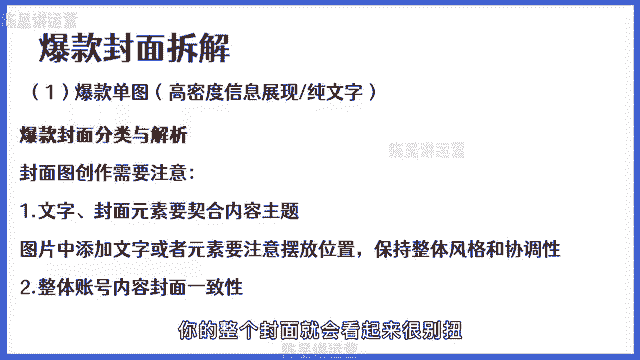

会影响到它的美观度的，然后这里的话给大家看一些，比较好的成功案例啊，这几个成功案例呢就是大家可以学习一下的，当然包括我们自己，日常在进行爆款的分析的时候，我们也会看到很多的一些爆款封面图。

而我们要做的就是，把这些爆款的封面图进行总结，然后呢拿来吸收它，拆解它，把它作为我自己学习或者我自己做账号的时候，我要用起来的一个很重要的一个核心点，那讲完这样一个封面的一个拆解了之后呢。

那我们接下来要讲的就是，封面文案的一个书写技巧，封面的文案它有什么作用呢，我们来看一个案例。

大家就知道了啊，这里的话给大家五秒钟的时间，我想问一下大家看到这上面的这两张图，你能不能迅速地反映出来，第一张图它到底要讲什么，第二张图它到底讲什么，如果说你在五秒钟之内你不能回答出来。

那就说明了这就是没有，这就是封面文案写的不好会导致的一个问题，你看左边那张图，我什么都没有对吧，可能给你十秒钟，给你一分钟，你都不一定看得出来，所以说封面文案它的作用是什么，首先第一个封面文案。

它最主要的第一个作用就是，我们要通过具体的文字，去迅速吸引用户的注意力，第二个要迅速的让用户知道，我们这篇笔记的主题是什么，放大用户去点击我们的欲望，让用户快速的去点击我们，这是封面文案非常重要的点。

你的选题选得再好，你是通过什么东西表达出来的，除了标题就一定是封面的文案，所以说封面的文案它的文字非常要值得值，非常值得大家注意，如果说你没有一个好的这样一个文案，可能你的整个点击率就会受到大幅度下滑。

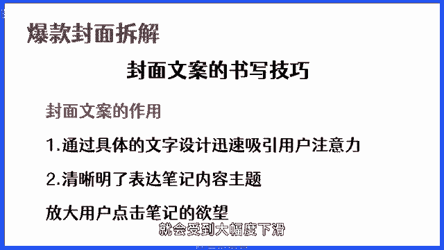

那我们来看一下，像这种文字做的比较好的一些爆款的封面，他们是什么样子的，你看像这种的话，它就是属于连载式的对吧，敢不敢用30天把小红书做起来，第一天，第五天，第12天等等等等。

像这种他是小红书里面非常火的一种连载型的，像这种呢，特别适合我们做的一些教育类或知识类的，这样一个产品，比如说不管是做摄影，还是说你做具体的一些教育相关的，你都可以用这种类似于30天，七天，21天。

120天等等，像这种方式来进行一个连载，这样做的好处是什么，这样做的好处就是我们通过这种连载的方式，能够增加用户的粘性，因为用户往往的他对我们的单一内容，如果说感兴趣的话，他可能就会持续的去关注我们。

它就会持续的对我们的内容进行消费，他可能看到你的第一篇内容，他可能会点击进去看相关的第二篇内容，或者是当你更新了一篇内容，你后面的内容没更新的时候，他可能就会关注你啊，这是连载式的这样一个标题。

它非常重要的，那连载式的标题呢。

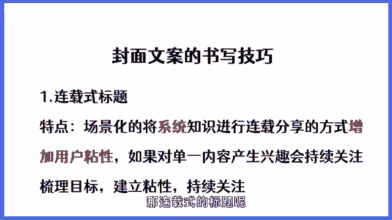

它的一个模板给大家一个，就首先第一个是时间，第二个是目标导向，也就是你立的flag，你要通过这一个时间解决什么问题，第三个就是具体的内容，比如说从零学习摄影，这就是属于选题，那不同的类目，不同的产品。

你的主选题也是不一样的，所以这一个地方你直接放你的选题就可以了，然后我们再看下一个封面文案。

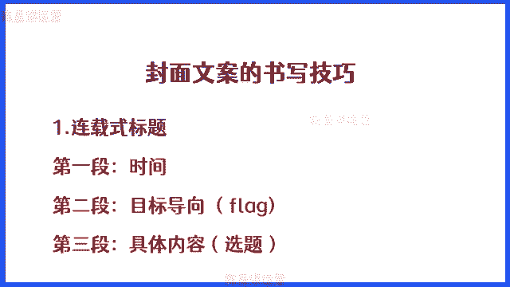

下一个封面文案呢大家可以看到啊，这里的话就会有一种，比如说自学三个月，副业五位数，零基础如何自学画画，27岁上班族，存款68万，靠这五个无痛存钱法，37岁存350万，无痛存钱，聊聊我的两份收入。

大家有没有发现像这样一类的标题，他是属于什么，它是不是属于场景化的代入，具体的结果来引入出他的解决方案呢，建立你对这个内容的期待感啊，那我们来看一下是不是这样，首先自学三个月，副业收入五位数。

这是不是通过一个场景，一个自学三个月的一个场景，然后告诉你，我通过这三个月自学画画的，这自学三个月通过副业赚到了五位数，而这五位数而通过这样一个结果告诉你对吧，零基础自学画画也可以达到这样一个效果。

包括这个27岁上班族存款68万对吧，也是一样的，他为什么能在27岁的时候，在上班的期间能够存款68万，因为他全靠这五种存钱的方法，你看是不是通过场景带入具体的目标，或者具体的结果。

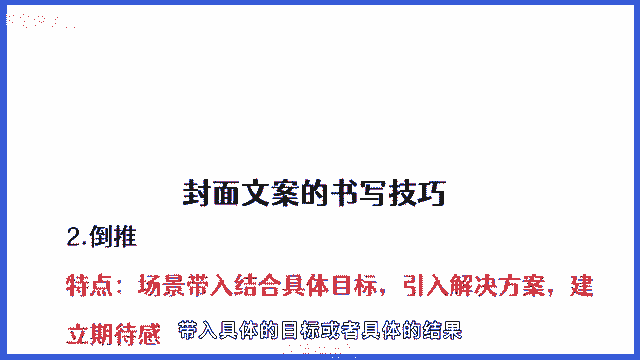

然后引出解决方案，而它的解决方案就是它的选题，也就是他今天的主要内容。

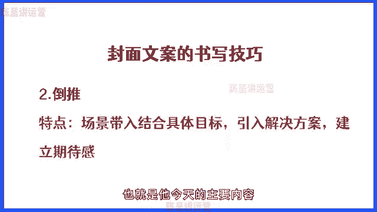

所以说这就是倒推，那倒推的这种方法我们怎么来用呢，给大家一个公式，首先倒推的第一段目标人群加场景，就是你想要的目标用户，或者你希望这个目标用户的一个具体的动作，加具体的场景，比如说你想要你。

比如比如说你是做绘画相关的内容的，比如说你是做插画的产品的，那你的目标用户就是想学插画的，那你的场景呢可以是自学插画，或零基础学插画三个月，像这种是属于场景具体的结果，比如说通过这样一个自学。

通过这样一个学习画画，拿到一个什么结果，这个结果一定是用户想要的，用户感兴趣的，而这个结果如果说不是用户感兴趣的，不是你目标用户的需求点，它就不会有吸引力，然后呢再告诉他达到这个结果。

是因为我掌握了什么，我运用了什么，我采用了什么方案，而这个东西就是你选题所做的内容，所以说你的痛点的解决方案是放在最下面的，而这一个点其实是从结果倒推出来的啊。

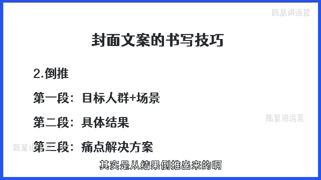

这是我们倒推法的一种核心的用法，那我们再往下看这种五个证书，拿钱拿到手软，再加自在家自学才艺app，十个暑假特托宾优秀，45个批发网站空闲赚点零花钱，你看这个是什么，这个是不是有点像推理啊。

就是当你掌握了具体的证书软件能力，资料方法，你就能够达到一个预期的结果，你拿到了这五个证书，你你拥有这五个证书，你就可以拿到拿钱手软，你如果说在家里面在拿，你如果说在家里面自学才艺。

用这十个app在暑假就可以变得更优秀，如果说你拥有了这45个批发网站，就能让你在空闲的时间赚到零花钱，你看那像这种呢就是属于典型的推理型，典型的推理型的是这样一个封面文案。

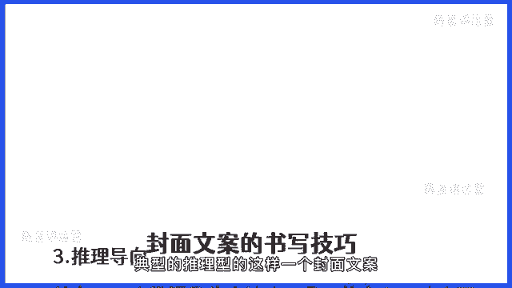

那我们来总结一下推理型它的特点是什么，用户关注具体的方法或者能力，然后呢通过这个能力能够建立一个预期的结果，就是你告诉他你能够达到一个什么结果。

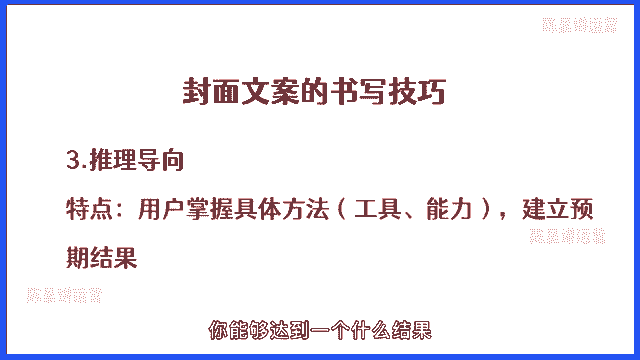

那它的一个公式是什么呢，首先掌握某某工具，这个工具或者技巧对吧，然后呢就是目标的结果。

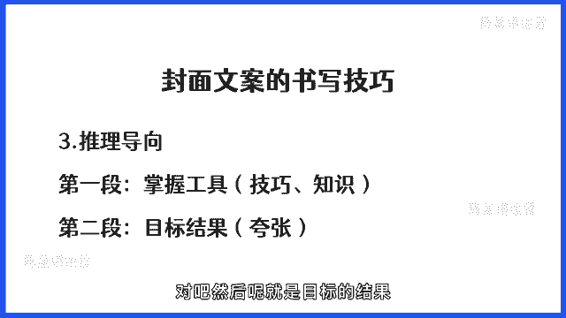

目标结果就是夸张，我们再来看一个，这里的话我们来看一下这三张图，不自信女孩必看的十部电影，从自卑到自信，我做从自卑到自信，我只做了五件事，表达力很差的女生，建议疯狂做这几件事情。

这种像什么这种是不是有点像痛点潜质，比如说我不自信，这是不是一种痛点，我很自卑，那从自卑到自信，我做了这五件事情，我的表达力很差，你看这种是属于什么，这种是不是有点像痛点前置啊对吧，他把痛点放在最前面。

通过这种方法引起我们需要的目标用户的注意，然后呢再告诉他这个痛点的解决方案，就是我给你的这一套方法，或者说这五件事情，或者你看了这几部电影你就可以了，所以说像这种的话就是属于典型的痛点前置。

痛点前置的特点，就是通过痛点引发用户的注意力，并且为他提供解决方案啊，这种的话他是用的比较多的小红书，里面很多的大型的这样一个粉丝的博主，他们都喜欢用这种方法，因为这种方法很容易吸引用户的眼光。

所以这种痛点啊大家一定要学会去把握，而痛点是什么，其痛点它就是我们的需求，所以大家为什么讲到这节课，讲到这个地方的时候，我们回过头还是要讲一下，就是需求，还有选题，选题背后就是痛点啊。

各位你一定要知道选题的重要性，同时一定要试着去理解他的痛点，也就是用户对什么东西很关，很关心，什么东西是用户一定要解决的问题，用户关注的是什么，你只有了解这个，你才能够把痛点前置这一个玩法。

玩到一个很好的一个效果，那痛点前置的一个那痛点前置的一个啊公式呢，选第一个人群加痛点，那为什么是人群加痛点，因为我们在做这样一个痛点的时候，肯定是人群要和兔联挂钩，不是谁都有表达力不强的这样一个需求。

或者是说你的目标用户肯定不是谁都是嘛，对不对，所以你的人群一定是你的目标人群，你目标人群的痛点，那这个痛点怎么解决呢，就是你提供的这样一个方法或者这个技巧啊，这个的话就是我们痛点前置这一个。

文案的一个书写技巧，然后呢我们再来看一个这个是什么呢，我们来看一下啊，记忆力暴涨，背书过目不忘睡觉记忆法，还有一个就是如果如何背书过目不忘，90%的清北学霸亲测可用，亲测有效学生党必看。

然后还有一个什么，从数学，数学从60分提到数学，从60分提到130家，靠的就是这个错题，本来我们来看一下这个是什么，这个就很有意思了，它跟之前我们讲的内容还不一样，它是什么。

它是把预期的结果放到了最前面，然后呢对此引出了解决方案，比如说GD暴涨，记忆力暴涨，那它的前提是什么呢，那就是掌握了这一套过目不忘的睡觉记忆法，如何能够记，如何能够背书过目不忘，因为你这你一定要看。

因为这个内容一定能，因为这个内容就能解决你背书过目不忘的问题，那你如果说想提分怎么办，很简单，这个措辞本就能够帮你去提分，提到130分，所以大家看这种的话，就是属于典型的效果签字啊。

就是把你去给用户的这样一个效果，你告诉了他对吧，然后呢引入这样一个解决方案啊。

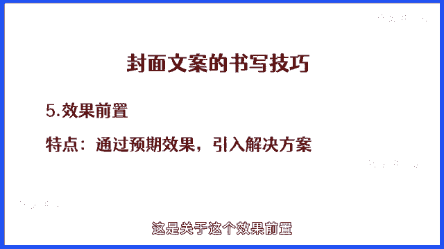

这是关于这样一个效果前置，那效果前置怎么用呢，我们来看一下第一段效果，第二段方法技巧，第三段人群，我们把这三个东西结合在一起，我们就可以把这样一个内容给做出来了，好吧。

这个的话就是关于我们整个封面的文案，在这一块我们所讲到的内容。

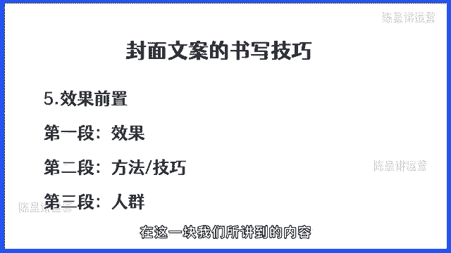

然后呢最后就是关于制作封面，那制作封面呢，这里我给大家推荐的软件有这几个，首先我强烈推荐大家使用稿定设计嗯，我们所有的伙伴，我们内部的员工基本上都不用PS，因为搞定设计能解决PS，解决得了。

包括PS解决不了的所有的问题，当然如果说你会PS的话，你也可以用PS啊，PS的话会用也能解决很多问题，还有呢就是黄油相机啊，美图秀秀啊，醒图啊，这种APP也可以用啊，也是非常不错的。

但是呢如果你对这些东西都不是很熟，那么搞定设计，我建议大家一定要开通这个会员，一个会员一个月才十几块钱啊，而且搞定设计呢，它有海量的这样一个小红书模板，不需要你有任何的设计基础。

你都能够轻松设计出爆款的图片，另外呢就是因为这个内容的话，在课程里面讲可能不是很方便，因为这个内容可能比较多，那我接下来会单独的录制，搞定设计的这样一个视频，会教大家制作各种我们现目前会用得到的封面。

他是怎么做的，包括内页怎么做，当然除了这样一个录播之外呢，我也会给大家做一些直播，来专门给大家做一些图片的一个辅导，教大家怎么去做出一个爆款的图片好吧，然后今天内容比较长啊，希望大家能够好好去吸收。

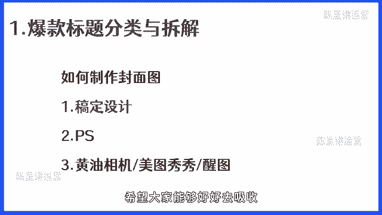

如果说有什么问题一定要在群里面问我，或者说一定要问一下你的助理老师好吧。

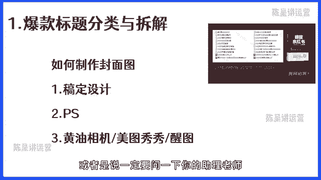

我也希望就是说接下来的课程，我们能够一起把小红书运营这件事情，能够把它越做越好，能够带着大家具体拿到我们的结果好吧。

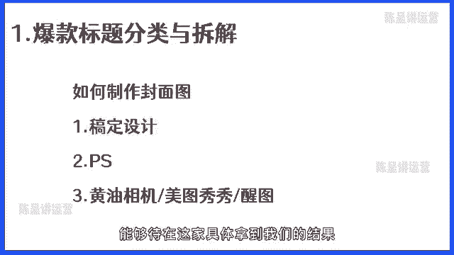