# 【2024版小红书体运营教程】全B站最良心的小红书开店运营教程！小红书体开店 起号真的快，赶快点赞收藏起来 - P8：6.小红书平台规则逻辑（3） - 快乐稳定发挥 - BV1AbtoebEjX

大家好，今天给大家分享的是小红书全方位分享的，第四大课时规则逻辑的一个内容，今天呢给大家讲第三节的一个内容。

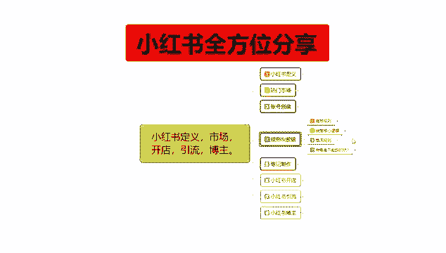

基本上可以把这一大节课给讲完啊。

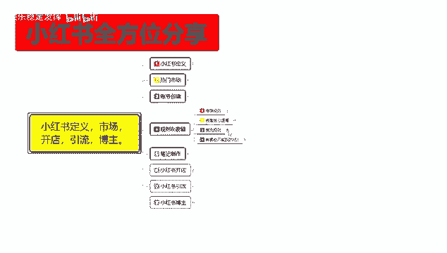

上节课呢已经给大家把那个推荐规则，已经给大家讲了，然后呢是被推的一个核心逻辑。

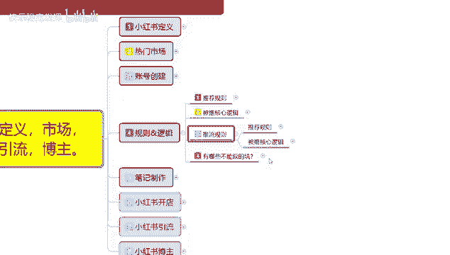

和有哪些坑不能踩呃，被推的一个核心逻辑的话，其实是很好理解的。

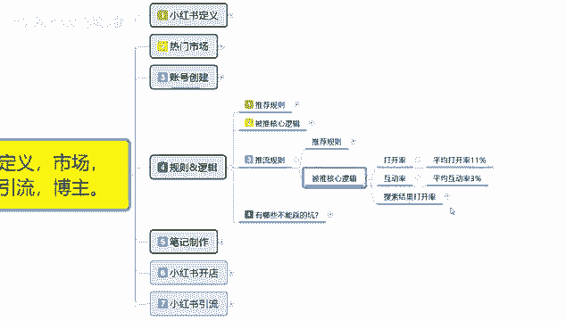

这个里面的话呃，打开率互动率和搜索结果打开率的话，它整体占比你达标以后，你就有可能进入下一个阶段啊，只要你的数据量能保持在这个范围以内，一篇文章，两篇文章，三篇文章。

基本上三篇文章能保持在这个数据量以内，你就可以进入下一个阶段，第一个是打开率，打开率是什么呢，你的小红书比一推广出去以后，比方说系统的话，它默认给了你1000个技术曝光量，你的平均打开率就是小红书。

我们打开以后，它界面上面显示了四个笔记，四个笔记里面就有你的产品，他会给你1000个曝光，那有11个人观看，你的平均打开率就是11%，哦应该说是100亿，100亿是个小眼睛。

你就有百分之百分之11的一个点击率，达标以后，他会进入到互动率环节，平均互动率的话是3%，也就是110个，平均点击，里面有三个用户在你的笔记里面进行了评论，你就可以进入第二个环节啊。

互动率互动率结束以后的话，他会按照搜索结果和打开率，在搜索结果中点击率它占比是比较高的啊，先看点击率占比，然后看互动率占比，互动率占比，然后给你排综合排名，你同类型的就是你在你们自己的社区范围内。

同类型的笔记比例偏高，他就会给你推广更多的一个流量，这个就是被推的一个核心逻辑，但是整体里面的话，这个里面还有额点击互动收藏，点赞分享啊，他这个都是包含这个这个里面的，但是你要是被推流的规则。

你想获得更多的一个流量，后三点的话，其实暂时对你没什么用啊，你只是说升层级的时候获得更高的评分，做搜索的时候有用，正常的话，你只需要看点打开率和互动率就可以了，也就是点击率和互动率，点击率平均在11%。

互动率保持在3%以上，也就是你的每篇笔记下面最少有3~4个评论，有110~150往上的一个小眼睛，你的笔记才算是一个完美的笔记，就是系统会给你推荐更多的流量，如果说你连基础属性都达不到的话。

那你后续的笔记的话最多维持三天，然后这个笔记就不会给你再带来任何的一个，引流或引流效果。

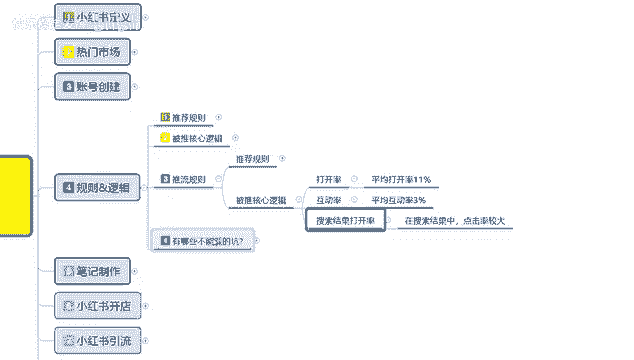

这个是推理规则，然后呢最后一点呢是有哪些坑不能踩。

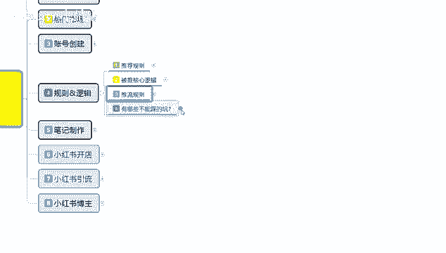

就是说我们小红书上面啊。

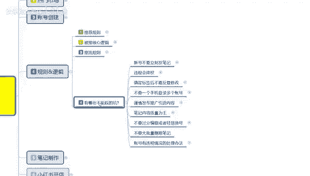

你了解整个小红书以后，有些东西是碰都不能碰的啊，你碰了以后的话，你后续想去再再去操作的话，你想把你的账号权重把他给归正过来，难度比较高，如果说你的账号没有基础权重，我建议大家是建个新号。

把原来的账号注销，然后建个新号，按照这种模式再去操作，都比你之前的账号权重要高得多啊，第一个呢就是新号不要立刻发笔记，除了你刚开始创建账号，测试账号有没有权重的时候发一篇，那个呃自己的就是入驻小红书类。

类似于入驻小红书的那个呃，自然笔记获得大概有50个左右的小眼睛，这个账号就基本上没问题，后续的话你没有养号之前就不要发笔记了，号养好以后再去发笔记，第二个呢是违规会降权，笔记推荐排名受影响。

第三个呢就是说确定标签后不要反复修改，你标签确定好以后的话，你不要去进行修改，不要不要说反复修改了，就是不要去修改你的标签，定完以后就定完了，你后续再去修改标签的话，你的整体流量会被限流。

第四个呢就是说不要一个手机登录多个账号，一个手机的话就是一机一卡一张号，然后谨慎发布推广引流的一个内容，谨慎处理留言私信和联系方式，这个的话后续我都会教给大家，因为这里面的话就相当于我前面给大家讲的啊。

一样啊，你这里面的话用微信其他方式，你如果说私信里面去聊的话，每天最多发三个，每天最多发三个，发五个是极限，你发多了以后的话，你这种账号整体权重会降低的3~5天吧，基本上你这个号就死掉了。

也就是说你一个账号，你把他呃忙陆陆续续用一个星期，两个星期的时间把账号全部设置完以后，有人加你咨询你，然后的话你把他引流到其他地方的话，3~5天，最多用3~5天，你这个号就没用了，基本上就是直接封号了。

然后笔记内容质量为王是什么意思呢，就是说阅读量少，可能是笔记质量问题，让账号整体权重变低，就是你自己的笔记没有做好，笔记有问题，跟你的账号权重其实是没有什么太大关系的，笔记数据差距离太大。

建议优化笔记内容质量，然后呢发问前检查你自己没放违规词，就这三个点了解一下，有些时候是你自己的笔记发出去以后，你有觉得自己没什么小眼睛，但是有技术曝光，小眼睛不多，那是你自己的笔记没有做好。

而且你账号权重，账号权重没有问题的情况下，就是你笔记没有做好，如果说账号权重有问题的情况下，就是你账号的问题，看你自己怎么去分类，自己去筛查一下，然后发文前检查自己有没有那个违规词。

那就是自己的那个笔记里面涉及违规词，不让发啊，后续的内容啊，不要过分编辑或者说是轻易换号，多次编辑会被强权，偶尔评论或笔记未违规问题的话，他是不大的呃，不要轻易换号是什么意思呢。

你本来账号有一定基础权重的，但是前期有些数据你没做好，你比方说你有两两三千，三五千的一个粉丝量的话，你就没必要换换号了啊，你只是需要把自己的权重拉回来就行啊，因为有些朋友以前可能会对小红书了解一下。

然后自己去发一下，但是感觉没什么效果，然后现在想重新去学，然后的话有些那个账号有属性，有全装，其实这种账号能操作，他比你创建新号的话要好一点，要比你创建信号，自己再去编辑数据的话，要好好一点。

因为你已经有一部分的用户群体了，隔一段时间，基本上像这种号两个月也不登录，基本上就相当于是属于新号，但是你上面又有粉丝，又有用户，你然后再重新去设置你的账号的，怎么说呢，就是设设置你账号的一个社区。

你把社区设置好以后的话，再去观察你所要推广的内容，按照之前的步骤重新做就可以了，账号权重可以拉回来，因为基本上两个月到三个月的话，小红书系统会把你设置成那个流失用户，流失用户你两个月以后登录。

你就是就是一个新号，但是你有基础权重，小红书给你保留的基础权重，你再按照之前的这种方式去做，那你的账号权重就回来了，也就是七天到十天左右，你的账号权重就回来了，那你就相当于多了3000粉丝啊。

粉丝而且还不会流失，然后呢就是说不要大批量的删除笔记，比方说你要换号，你之前的笔记内容和我现在想发的内容不一样，也不要去删啊，留在账号里面没有什么太大关系了，删除以后的话，那你之前的那个点赞收藏之类的。

它会消失掉，也就是说你这个你把它删掉以后的话，你的那个平白无故损失了3000粉丝，没必要啊，然后账号有违规的情况，处理方法的话就是说继续用该账号，但需要一周以上的一个养权重时间，就说违规不严的话。

可以继续养，违规严重的话，那时间就翻倍，内容不算好，粉丝量不多，建议的话就说直接重新换号就可以了，你有个什么几百个粉丝的那种的话，你直接换号就行了，小红书上面你弄个几百粉丝，其实非常简单的啊。

粉丝过千你就不要轻易的换号了。

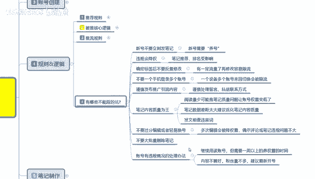

这个呢就是整个规则逻辑的一整套课啊。

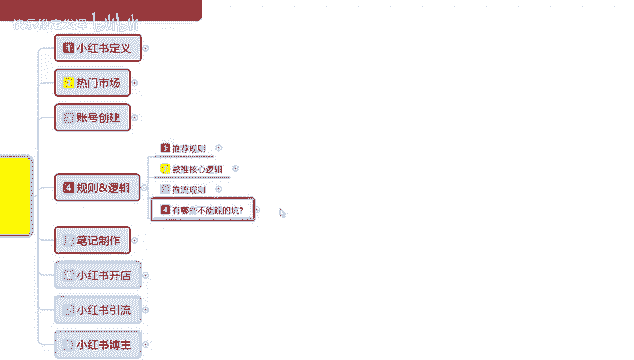

第四大节给大家分享完了。

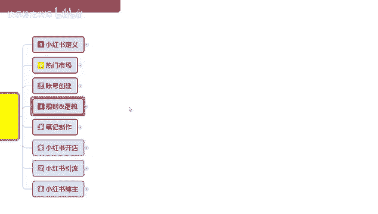

下一节呢给大家介绍一下，小红书最重要的一个内容，笔记制作，怎么去把笔记运用好。

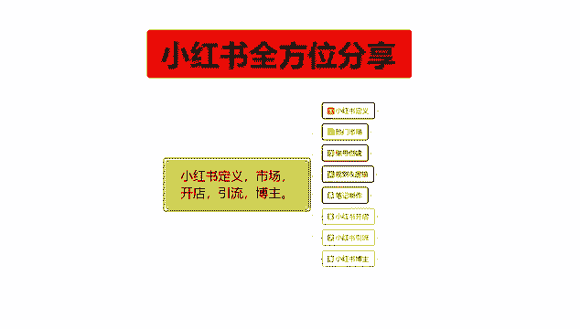