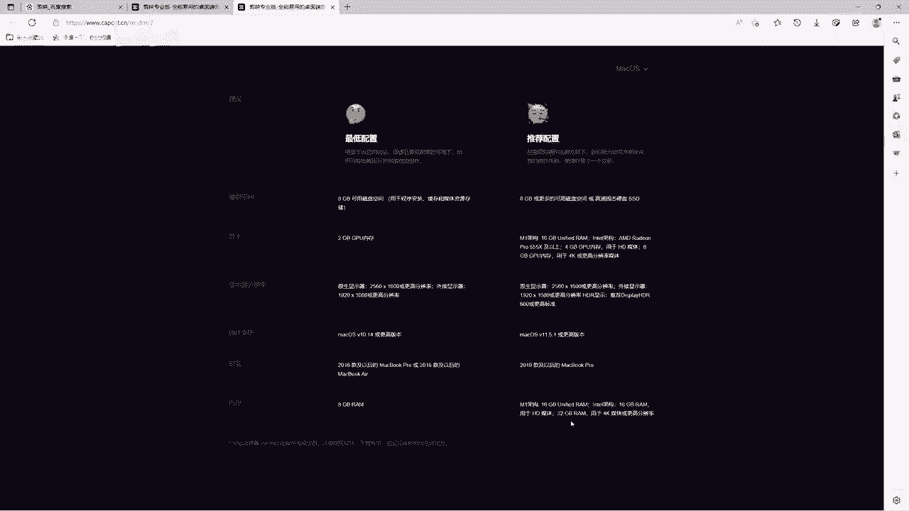

# 【2024版小红书体运营教程】全B站最良心的小红书开店运营教程！小红书体开店 起号真的快，赶快点赞收藏起来 - P8：6.查看电脑配置 - Sathenay - BV1uqHreLEER

OK和大家聊一下剪映需要的最低配置，大家可以在官网当中呢。

在这里选择查看推荐配置，单击之后呢，就可以查看当前的最低配置，以及推荐配置的一些详细的一些参数，我们也可以在这里切换Mac版本来进行查看，看一下当前自己使用的电脑是否适配，我们先以windows为例。

首先呢是硬盘啊，大于8GB，这肯定不说了，肯定都是大于8GB的，有的是好几T的，对不对，然后还有显卡，这个显卡呢大家可以看一下，是否和自己的电脑是否适配啊，尤其是你是老的机型，看看是否达标。

然后是显示器的分辨率啊，还有操作系统最低使用win7处理器啊，就是CPU，然后六代啊或者是更新款的CPU，以及AMD的这个1000系列，大家需要看一下是否能够适配成功啊，然后内存的话需要注意啊。

最低的话需要8GB啊，如果你是4GB的话，可能会带不起来，也有可能会在剪辑视频当中呢会变得很不流畅，然后声卡的话，大致的话因为剪映不太需要不吃声卡呃，声卡的话大家可以简单了解一下，然后推荐的配置呢。

就是能够流畅的使用剪映的这个配置呃，首先win10和win11，然后这个需要八代的英特尔net，还有AMD的3000系列啊，内存呢需要注意啊，16GB以及32GB，现在2023年啊。

开始往标配32GB上走了，当然你最近买的电脑应该完全没问题，然后呢用于4K的这个媒体，就是更高的分辨率，更高的清晰度，能够达到视频的更清晰的效果，如果你的配置过低的话，你可能导出的时间就需要很长的时间。

紧接着是Mac电脑，重点需要注意的是，在这里可以查看一下机型啊，就是你当前的Macbook pro是否达到最低配置的机型，然后呢内存嗯以及呢推荐的配置啊，就是一九款以后的pro都很支持啊。

剪映的一些视频剪辑工作。

