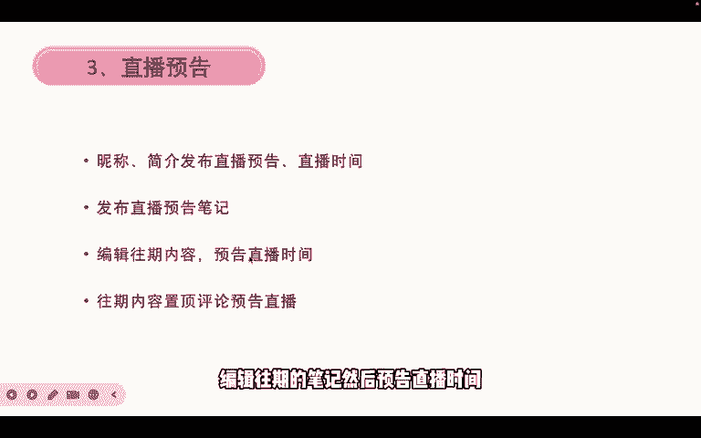
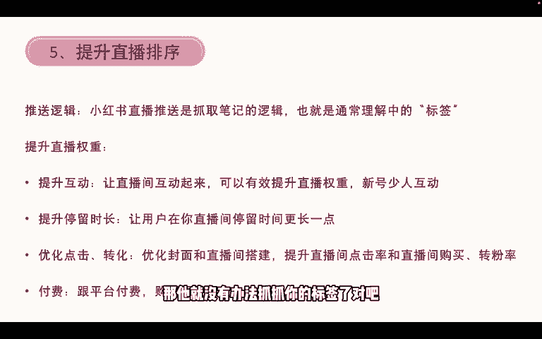
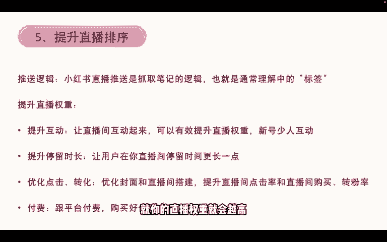

# 【2024版小红书体运营教程】全B站最良心的小红书开店运营教程！小红书体开店 起号真的快，赶快点赞收藏起来 - P8：8.店铺直播 - 小袁运营 - BV1Px48eQEai

那我们再来看一下店铺直播，直播第一个流量的爆点是在8月份，9月份，10月份，这三个月其实都是流量爆点，包括11月份双11，都是一个比较大的流量爆点，因为8月份的时候，小红书是讲了一个词叫买手时代来临。

买手时代以来就他开了个额百万买手计划，那我们个人店铺的话，我们可以打造买手的人设，做成买手店铺呃，之后我会专门录制一期呃，跟大家分享一下怎么样去做买手，以及什么样才算是一个小红书买手。

我会专门录制一期视频来跟大家讲一下，而企业店铺的话，我们可以做店铺直播和买手纯优直播来结合，把我们的产品打包，然后第二个叫做低成本直播与抖音的卷，上天的直播间不同，小红书的直播间人员配置没有抖音那么多。

也不需要通过付费去做人启动，因为如果我们在抖音做的话，做直播的话，你不投流，基本上他就不会给你流量对吧，就很难获得自然流，但是如果说我们在小红书的话，小红书我不需要投流，也能够获得流量。

因为他首先他前面会给我推荐，那么其次我的笔记也能给我的直播间，带来流量是吧，然后第三个呢就是小红说基本没有打价格战的，这一个说法，很少打价格战的商家，就各个价位都有用户能接受，而且用户在小红书购买购物。

更倾向于为博主本人买单，比如说买手的对吧，你能给我找到适合我自己的产品，那我就愿意多花一部分钱，让你就从你这里去购买，这是它的一个特点，当然了，你不能够说赚的特别多对吧，只要价格合适的话都是可以的。

然后直播的流程是这样子，首先我们企业号要先开通直播，也没什么条件。

就只要你去点开通就可以了，然后第二个我们要先去直播，就是商家管理后台，找到直播的入口，再建立一个直播计划，建立直播计划的时候，我们需要添加商品，就你这一场直播需要卖的商品我们添加进来。

然后在直播直播工具里面配置一些优惠券。

在这些弄好之后，我们就可以去开播了，那开播我们可以搭建一个简易的，简易版本的直播间，我们直播设备用手机就可以了。

使用流畅像素高清我们就可以做，然后第二个一个手机支架，手机支架就能固定一个直播拍摄角度对吧，然后还有一个收音设备，收音设备不是必须，但是有收音设备的话，比没有收音设备要更好，还有呢补光灯。

如果说光线不够充足的话，会导致你的直播间看起来就是暗暗沉沉的，就不好看，还有手机散热器最好是购买一个，因为手机直播时间长了之后会发热，特别严重，会导致你手机特别卡，然后不流畅。

所以我们要尽量的备一个手机散热器，还有背景板，我们也可以去安排一个背景板。

就是你的直播背景，那复杂版的直播间搭建呢。

我们画面就需要更加的专业像摄像。

然后高清DV脚架绿幕，然后货架还有导播台这些东西我们都要准备，然后呢，可能需要准备个专业声卡或者多角度的补光灯，还有我们直播间的灯光。

可能都要专业的去设计一下，以及直播需要带提示器，就多一个直播设备，就比较多个设备来搭建一个直播间。

还有直播，第三个呢我们需要发布直播预告，就是我们在设计好了直播间之后，开播前我们还要发布直播预告，在昵称里面我们可以设置一个，比如说呃我叫三金对吧。

三金是我的昵称，那三金昵称后面加个括号，每晚九点直播啊。

假设啊每晚九点直播，那每天晚上九点就是我的直播时间，简介呢也可以写上我每天晚上九点直播对吧，嗯就是写上一个直播时间，那第二种直播预告呢叫发布直播预告的笔记。

就是我这一篇笔记都是预告，我每天晚上九点都要直播，或者说我双11晚上九点需要直播。

那这一个直播预告的笔记我们可以发布，发布完了之后，用户是可以预约这个直播的，用户预约直播之后，而在你开播前半个小时会给他弹一个消息。

说你已经开播了，那他就会他很可能会点击消息进来看你直播间。

还有第三种呢叫编辑往期的笔记，然后预告直播时间就是比以往爆火的笔记。

我们可以重新编辑一下，或者说呃把设置好的直播预告之后，关联一下往期的笔记，那其他就过往你报过的笔记，然后现在还能获得流量的话，用户也能够从你的笔记里面，直接预告你的直播间。

然后第四个是往期内容置顶评论，预告你的直播就是我们发布一个置顶评论。

说额某某月某日，然后晚上八点我需要我要在小红书开播，那大家可以预约一下，那这种也是可以做的。

然后小红书直播有一个非常重要的特点，叫笔记和直播联动，叫笔直联动，创建优质的笔记吸引粉丝关注，然后粉丝关注账号之后，直播间会推送给粉丝，然后我们直播间再开启卖货，这是非常关键的一个步骤。

所以我们要开直播间，要直播间获得更大流量的。

我们就需要做更多的优质笔记对吧。

所以小红书的一个推送逻辑呢，是抓取笔记的逻辑，也就是通常理解中的标签。

那我们怎么去提升笔记权重呢。

呃我们先来再讲一下这个推送逻辑吧，对就是小红书推送逻辑抓取笔记。

就是如果说我们呢没有发过笔记，零粉开播，那他就没有办法抓抓你的标签了对吧。

因为你零粉你没有任何标签。

那他把你直播间推送给谁，不知道，他也不知道，所以他能给你下推，然后谁点击进去，他就慢慢的给你打标签，所以零粉开播是不太建议，那刷粉丝有用吗。

刷粉丝也没有用，因为呃你刷的粉丝。

他们的标签是非常乱的，他给你推荐的人群也是非常乱的。

所以我们要开直播的话，还是要先做爆款笔记，就是你要开服装的直播对吧。

你就拼命的发传达类的笔记，吸引一些穿搭的人群。

再来开服装的直播，这是比较好的一个方式，那提升权重的话，我们可以让直播间互动起来呃，可以直播间越多人互动，就你的直播权重就会越高。

咳所以如果我们是新号的话，就基本没有人跟你互动，因为给你推荐的人都是比较乱的。

他们不会愿意跟你互动。

然后第二个叫提升停留时长，让用户在你的直播间里面停留的时间更长一点。

就是我们可以用福袋的方式去吸引人，让别人停留。

还有我们一定要优化点击和转化，优化封面和直播间搭建。

这是非常重要的，可以提升直播间的点击率，和直播间的购买转粉率。

还有最后一个叫付费跟平台购买流量。

购买一个好的位置，然后这里面我额笔记封面这一块。

我直播间封面这一块，我再补充一个点。

就是如果我们要额开启一个直播间的话，我们一定要设置一个直播间的封面。

因为小红书的直播间推荐跟抖音那种会不一样，抖音那是如果打开直播间，他是沉浸式的浏览。

沉浸式的推荐就是上滑上滑上滑，然后就给你推荐不同直播间对吧。

但是小红书不一样，然后说我们打开直播频道以后，他也是跟笔记一样，两列的信息流，然后让你去刷直播间，所以给别人吸引别人的第一视角就是你的封面。

如果你的封面不好，那即使他给你曝光。

别人不愿意点进去，那你的直播间也不会有流量，所以这是非常重要的。

