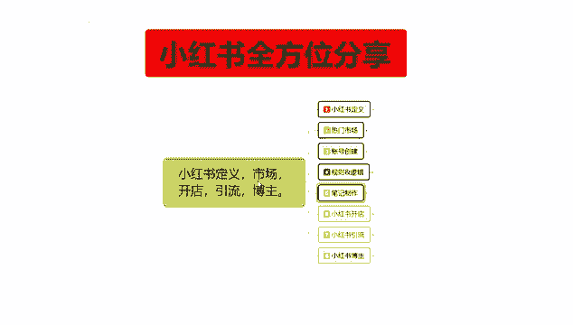
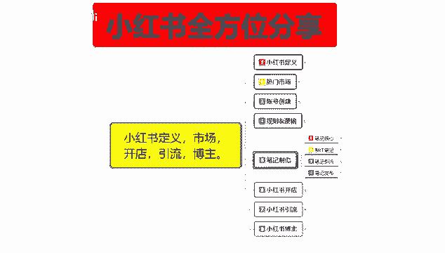
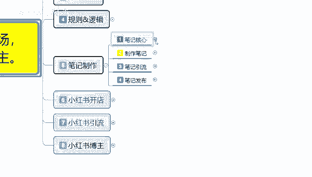
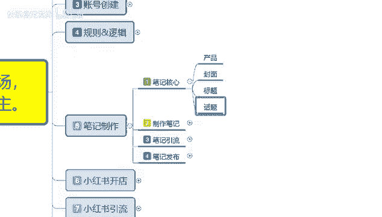
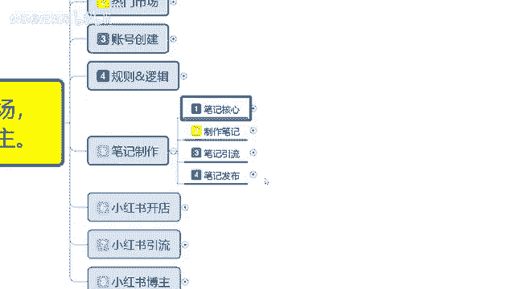
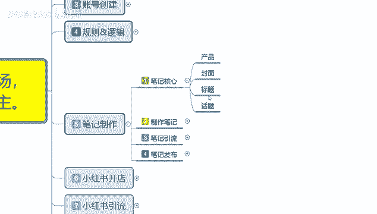
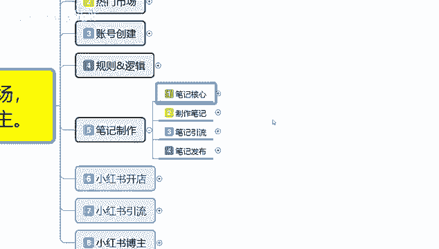

# 【2024版小红书体运营教程】全B站最良心的小红书开店运营教程！小红书体开店 起号真的快，赶快点赞收藏起来 - P9：7.小红书新账号笔记制作（1） - 快乐稳定发挥 - BV1AbtoebEjX

大家好，今天给大家分享的是小红书全方位整体分享的，第五大课时笔记制作啊，笔记制作这节课的话，它的整体内容往后续包括开店引流和博主，他们的内容都是比较大的啊，包括这个笔记制作，它都是多段可视。

而不是像上面的呃，定义市场和账号创建，这几个的话，其实归纳总结起来它是非常简单的，就是小红书的一个技术入门，你到后面笔记制作开始，往后续的话，你包括小红书开店引流博主，他的整体内容的话都是非常多的。

我会分多个课时给大家进行讲解，但是这个的话还是第五大课时。

笔记制作的一个内容。

我们先了解一下啊，笔记制作，我在这里呢是给大家把它分成四个点，第一个呢是笔记核心，第二个呢是制作笔记，第三个是笔记引流，第四个呢是笔记发布，这四个点笔记核心是什么呢，笔记最重要的几个点是什么。

笔记制作制作笔记的一个内容方式和方法，笔记引流引流笔记的一个做法，最后呢是笔记发布，就是我们笔记发布它里面包含的一些技巧。

首先我们了解一下笔记核心是什么，产品封面标题和话题四个点，这四个点里面产品啊，你做小红书，做商品，那你就有产品，你不做商品就没有产品，那你就是封面，标题和话题这三个点，如果说你做商品宣传。

那你这里面就包含产品，那这四个点里面最重要的是什么，最重要的是封面和话标题，产品和话题这两个点的话，其实它不重要，他是后续给你加分的，前期最重要的两项是封面和标题，你的一个小红书笔记核心封面做不好。

你的标题就没有太大作用，你的标题做不好，你的封面做好了以后，你的点击率就上不来，他们两个是互动的，缺一而不可，小红书的整体核心怎么说呢，就说小红书笔记的一个核心，我们打开手机的话。

你在小红书上面会很显示很多内容，不管我们怎么去搜索啊，第一个展示的永远都是图片效果，就是封面懂我意思吧，就是说我们先看小红书的话，你不管怎么去看小红书，打开的第一要义基本上都是封面，封面，最后就是标题。

看完封面看标题，你的封面图片效果还不错，那你就获得了接近70%的一个核心数据，标题占核心数据的30%，也就是点击率，光看到你的图片以后，他还要看你的标题，然后再考虑点不点进来。

所以说这个就是小红书笔记制作的一个核心，有封面，有标题才是一个完整的小红书，你封面做的再好，你标题不行，那你吸引不到一个点击率，你的图片做的太差，你的标题做的还可以。

那你基本上别人看见你的图片就没有兴趣了，两者缺一不可，它们是互互相的，是一个整体啊，这个呢算不上，我们整个小红书笔记的一个核心呢，其实他不算啊，你封面标题过后的话，其实还有刚刚我们计算的话。

就是说计算的是整个小红书核心，展示类目和点击，它只是我们产品最基础，点击的就是你的笔记制作完成，由最基础的一个基础核心点，所以说叫笔记核心是封面和标题之后，你笔记里面被用户点进去以后，里面还有关注收藏。

转发评论，对不对，还有四个选项，那它涉及到的是什么呢，有商品就是在商品里面啊，对你的商品进行评价，或者对你的笔记内容进行评价，如果说你没有商品，那它对你进行评价和展示和吸引的内容是什么，话题。

这个先封面标题做好以后，然后上你的话题，我们先不管你有没有产品啊，你在小红书上面，你是想开店，做网红也好啊，开店直接卖货也好，你做博主也好，你做引流也好，那话题排第三位。

你的话题就是吸引用户的一个细流程时间，你的话题，如果说完美解释了用户所想看到的一个答案，那他会对你进行收藏点赞，转发评论区里面，如果说你的互动机遇，互动率高了以后，还有互动加成，互动加成的话。

他是加你的百分比，你的话题里面的点赞收藏，那个是加评分，这个里面的话我们把它结合以后的话，就是封面加标题，等于展示和点击产品爆款的必备啊，条件，封面加标题等于展示和点击话题加产品引导。

就是说你在话题里面带入了产品引导，你如果说有商品就是产品引导，如果说你没有商品，那你就是内容引导也是一样的，只是说产品引导的话，在这个地方你可以把产品把它划分为啊，我们所推广的一个内容。

你比方说引流内容或者说是搞笑内容，它都属于你的所推广的方式，只是产品内容不同而已，所以说话题加产品，那等于用户购买，或者说是你的一个账号的基础价值，有没有给用户带来一个情绪价值，他也在这个分范围以内。

我们需要整体结合以后，做好我们的一个分享，或者说是你去做店或者说做分享啊，做引导，这个呢才是笔记核心封面标题，话题加引导它整体流量计算公式的话，就是看到加点击等于点击等于什么呢，封面加标题。

看到等于第一波流量推流，加之后点击的一个反馈，然后的话系统会给你更高的曝光和展示，整体来说的话爆款基础第一要点就是说封面图，封面图的话就是呃打个比方给你们小红书，你一笔一发放出去以后。

你根据你的账号基础设定的话，小红书会给你1000的基础曝光量，以1000基础曝光量为基数，点1000个展示点击比例的话，点击100下就是10%，正常的话上午一节课给大家讲的时候，也给大家说过。

点击量达到11%，他会给你推广更多的流量，1000个展示里面点击率5%，也就是50个点击，那你的一个属性点就会下降，就是没有超过11%的数据量，那么平台系统，它只会给你三天的一个展示曝光机会。

3年以后收集你这个笔记的综合性属性内容，如果说你的点击率在三天以内，就已经超过11%了，那你的排名就会上升，如果说你在三天以后超过11%，那你的产品就是三天之后，他不会再不会再给你继续推流了。

因为你第一个时间段过了，第二个，你的笔记推广整体效果不好，笔记内容不够吸引人，笔记封面和标题有问题啊，这个就是笔记的整体核心。

而我们了解笔记完，了解完笔记核心以后的话。

我们最先要做的其实是什么，封面标题做好以后，你然后去做话题，然后做引导，你这个引导里面可以往商品上面引导，也可以往你自己想宣传的内容去引导，你把这四个点了解清楚以后。

你的笔记核心了解你后续才能去制作笔记，才知道自己的笔记应该先做什么后做什么，也就是说这些给大家分享的是，让大家了解你在小屋上面，你去做笔记推广的时候，你要先做封面，再做标题，标题和封面做完以后。

然后再去做话题，话题做完以后再去做引导，这才是一个完美的一个笔记，好吧。

因为时间关系的一个原因，那这节课呢就给大家分享到这，下一节课的话。

