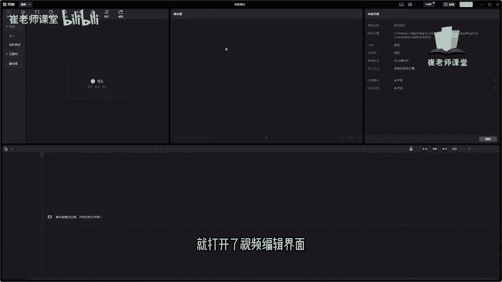
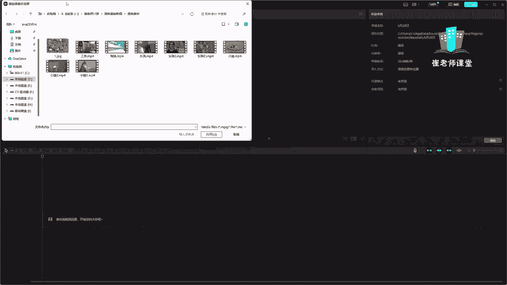
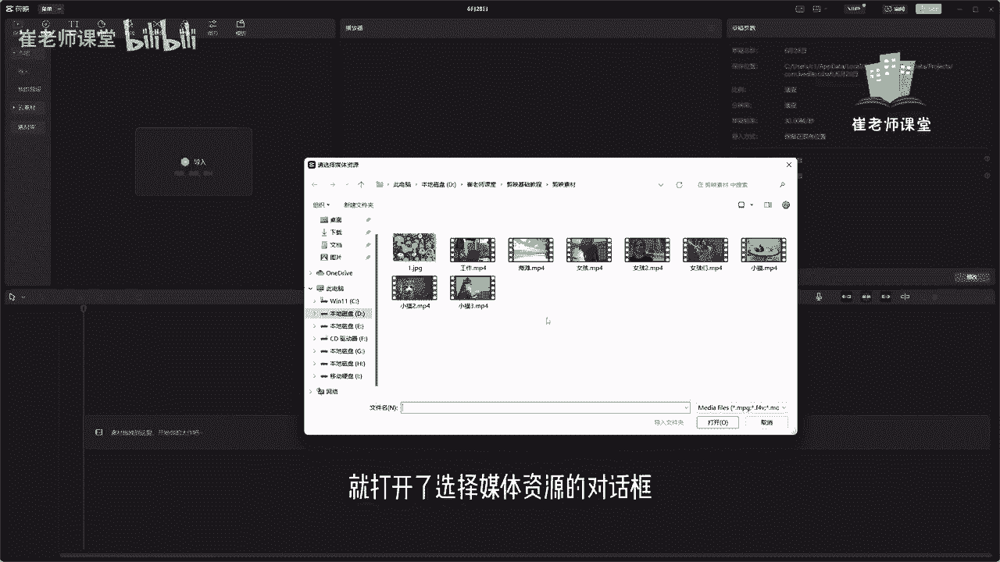
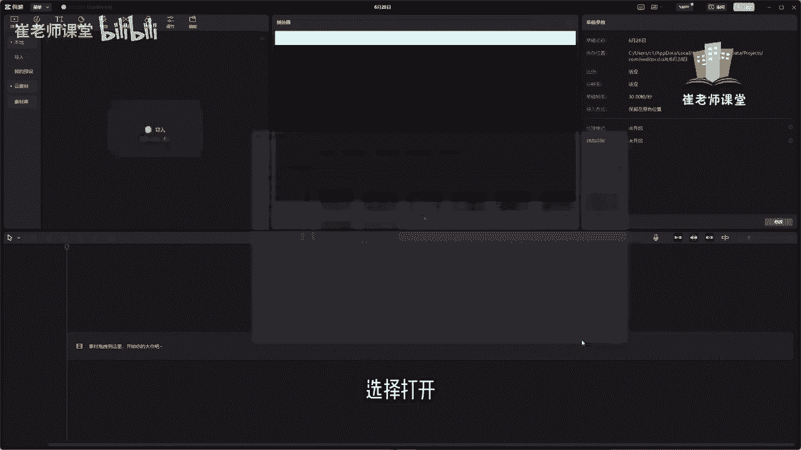
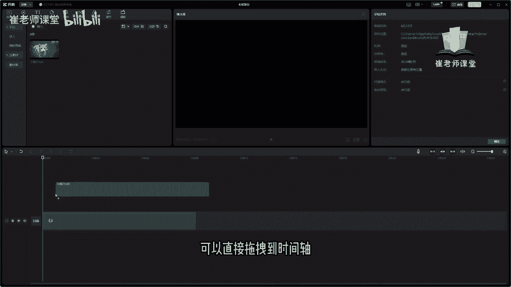
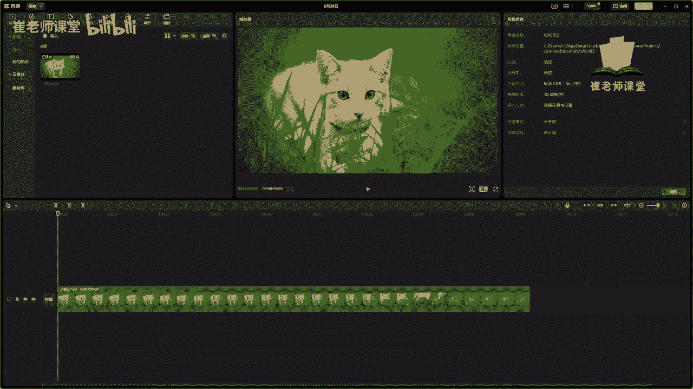

# 【2024版小红书体运营教程】全B站最良心的小红书开店运营教程！小红书体开店 起号真的快，赶快点赞收藏起来 - P9：7.首页界面解析 - Sathenay - BV1uqHreLEER

安装了剪映专业版之后呢，可以双击桌面上的快捷方式来进行打开，首先映入眼帘的呢是首页界面，我们重点讲一下这个首页界面，在首页界面中呢，我们可以创建新的视频剪辑项目，可以单击开始创作。

同时呢也可以对已有的剪辑项目进行重新命名，删除等基本操作，如何创建与管理剪辑项目呢，选择开始创作单机就打开了视频编辑界面。

我们可以在这里选择导入，单击就打开了选择媒体资源的对话框。

选择当前想要进行编辑的素材，选择打开。

就将当前素材呢导入到了素材库中，可以直接拖拽到时间轴。

这样就完成了当前素材的调用，如何返回首页界面呢，可以在菜单当中呢单击可以选择返回到首页。

也可以呢直接选择这个叉号啊，也可以回到当前的首页界面，回到首页界面之后呢，就可以看到刚刚创建的剪辑项目，被存放到剪辑草稿箱中，大家可以在这里单击，有个三个小点的这个按钮啊，可以对当前的项目进行操作。

首先有上传重命名，复制草稿，剪辑快传删除等一些基本操作，上传呢是你登录抖音账户之后呢，可以上传到云空间，如果你在另一台电脑上面，登录相同的账户之后呢，可以进行下载，重新可以对当前视频进行剪辑。

还有呢重命名可以单击进行修改名称，我建议大家应该保持一个良好的习惯，就是将自己剪辑好的视频都要进行重命名，方便下次进行修改的时候能够及时找到，也可以呢进行复制草稿，单击之后呢。

它会创建一个当前项目的副本，也可以呢，如果当前项目不想要了，可以对其进行删除，可以单击删除，也可以呢，使用快捷键空格键或者删除键来进行删除。

