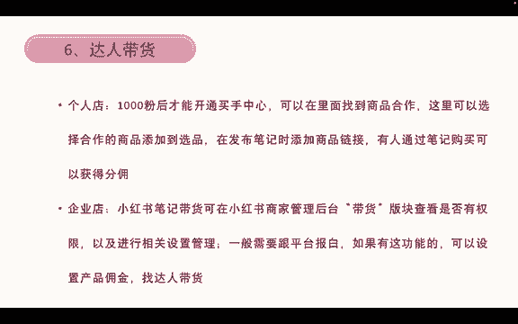
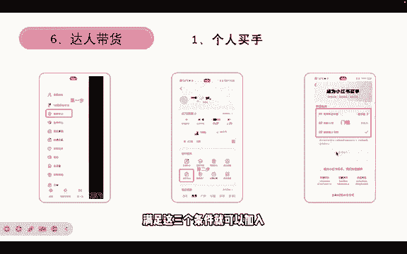
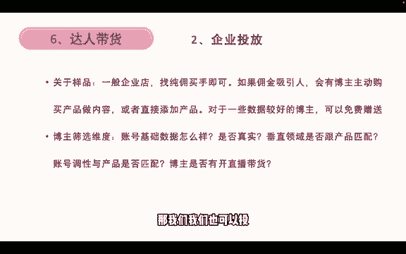
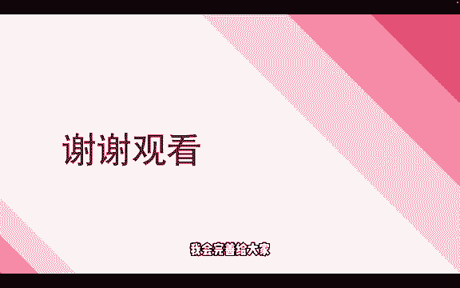

# 【2024版小红书体运营教程】全B站最良心的小红书开店运营教程！小红书体开店 起号真的快，赶快点赞收藏起来 - P9：9.小红书买手带货 - 小袁运营 - BV1Px48eQEai

再看下达人带货，个人店的话，有1000粉丝才能开通买手中心，然后可以在里面找到商品合作，这里可以选择呃自己合作的商品，然后添加到选品发布笔记时，就可以添加商品链接，有人通过笔记购买就可以获得分优。

个人店呢如果你达到1000粉丝之后，你既能卖自己的产品对吧，你既可以卖自己的产品，又能够卖选品中心的产品，就是既能分销，又能卖自己的产品，这是个人店才有的，那如果是企业店呢。

不管是个体企业还是企业的企业店，就不能够帮别人卖了，但是呃小红书笔记带货，可以在小红书的商家后台，那你带货板块，那你看是否开通，以前呢是内测，那现在呢他是全量开放。

只要你是个体或者企业和企业店都能够开通，然后在里面就可以进行一些设置，之前是要跟平台报吧，但现在不用了，那我们设置好了之后，设置好了佣金就可以找达人帮你带货，所以个人店跟企业店不同。

在这里个人店1000粉丝之后，可以帮企业店带货对吧，企业的产品带货，那企业店呢就可以让，让那些1000粉丝以上的博主，他们只要开通了买手，他们就可以帮我挂链接，帮我卖产品对吧，然后我再给他一些佣金。

所以这是两个不同的方式，个人买手的开通步骤，在这里先点创作中心，然后再点这个创作中心里面的METR中心，然后再看看自己有没有达到这个门槛，第一个是否完成实名认证，第二个你的年年龄是否大于或等于18岁。

然后第三个你的粉丝能不能大于1000，满足这三个条件就可以加入小红书买手。

然后个人买手如果你加入了买手之后，再重新点到买手中心，这里就会有直播选品跟笔记选品，那么我们点开笔记选品，这里就会有一系列的产品给你选择，我们比如说选中这一个锅，那我们就可以添加到选品中心。

添加到选品中心之后，我们就可以编辑笔记，编辑笔记，在发布的时候，这里关联关联商品，我们点击关联商品，这里就可以去选择一些商品，就我们添加到选品选品里面的商品去选择，然后就可以挂到这里，只要有人购买了。

我们就能获得佣金，然后关于一些企业投放的问题，如果说一般的企业店，要找纯用买手的话就可以了，就不用说去呃，再一次付费的去找买手，如果佣金吸引人，也会有博主主动购买产品来做内容。

或者说直接添加商品来做内容，然后对于一些素质比较好的博主，我们可以免费赠送一些样品来给他，比如说他的粉丝有1万多个，然后你的产品100来块钱对吧，那你就可以免费赠送一个产品给他，跟他讲。

你能不能帮我发一篇呃，买手笔记就带货笔记，那这种方式也是可以的，那如果说100块钱里面，你有40%都是分给博主的，那很可能有一些博主他会呃，自己花钱购买你的产品，然后再来发布单位笔记，当然了。

前提是你这个产品在小红书上卖的很棒，那就会有就会有买手会这么做啊，如果是一些很冷门的产品，那也不会有买，有不会有博主主动购买的，那我们如果说要筛选一些博主的话，可以参考这几个维度。

第一个账号的基础数据怎么样，好不好对吧，账号基础数据，它的互动，他的点赞高不高，然后第二个是这个数据是否真实真实，是不是刷的，我们要判断一下，然后垂直领域与产品是否匹配，就是如果说我不是服装的。

那我只推给一些，只需要一些穿搭或者服装，时尚类相关的买手对吧，如果你是电子类的或者说食品类的，那我就不投你了，你去申请我也不要对吧，唉账号调性与产品是否匹配，如果说一些日常分享低客单的产品。

然后你的客单价比较高的，那这种账号调性也是不匹配的，还有就是博主是否开直播带货，如果说他开了直播带货的话，我是建议我们就选它比较好，如果没开的话，但是笔记数据特别好，那我们我们也可以投。

然后以上就是这一节公开课的所有内容，然后之后我会再完善一下买手的内容和店铺，产品，就是笔记制作的一些内容，我会完善给大家好。

谢谢大家的观看。