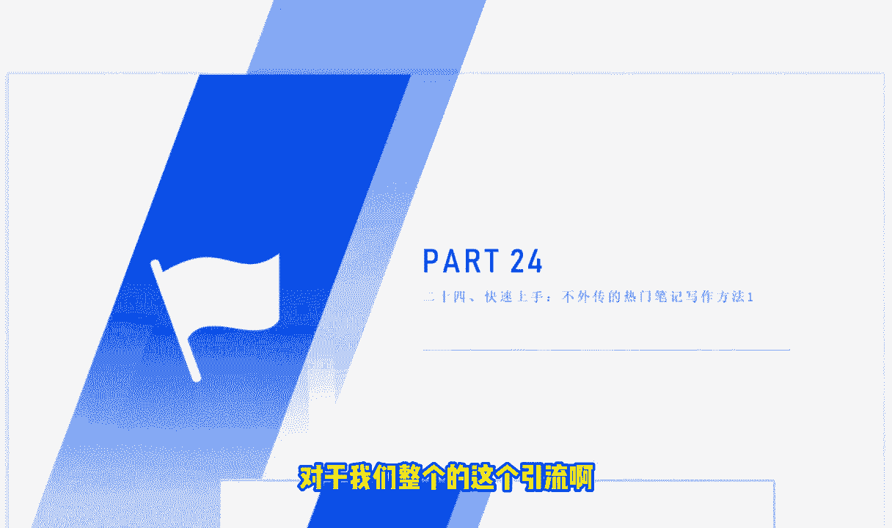
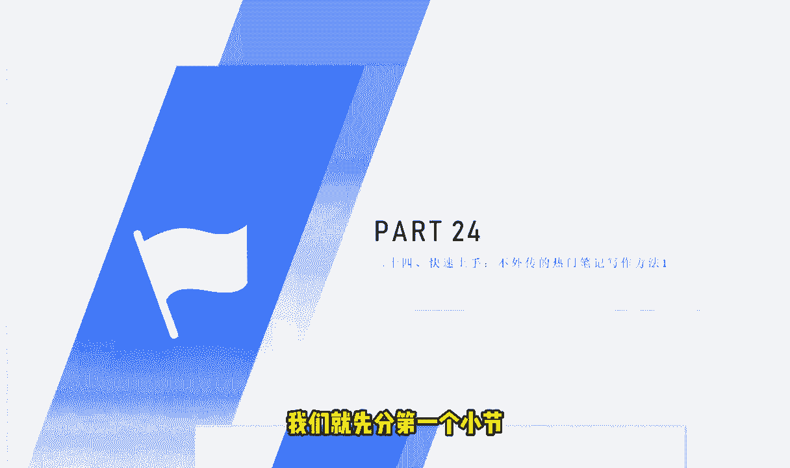

# 【2024版小红书体运营教程】全B站最良心的小红书开店运营教程！小红书体开店 起号真的快，赶快点赞收藏起来. - P26：第27节：小红书爆款笔记之，不外传的热门笔记写作方法！一（可快速上手） - 青衫肆故人 - BV1Y1VaezENt

今天呢这第24节课呢，我们和大家讲解的是快速上手，不外传的热门笔记写作方法，那么我们大家都知道这个小红书的笔记呢，对于我们整个的这个引流啊。

或者说变现来说还是非常重要的，写好这个小红书笔记呢也是很多人的一个想法，那么今天这节课呢我们就先分第一个小节。

就是跟大家讲解一下，这个小红书标题的一个写法，那么大家都知道啊，这个小红书的这个主要的一个流量来源的话呢，主要是有三个渠道啊，一个是搜索框，还有一个是那个对外的一个展现。

还有就是你的这个笔记的一个曝光量，那其实这三个渠道的话呢，真正有用的一些这个渠道还是来，还是来源于说别人的一个搜索量，那别人搜索通过这个搜索框去搜索，我们的时候呢。

哪些流量或者说哪些因素影响的是比较大的呢，这里啊我给大家总结了有三个点，那第一个点的话呢，有40%的一个影响力呢，就是我们的标题，第二个呢就是我们的主图，那剩下来的这个20%呢。

则则是我们剩下来的这个内容占比，那为什么这个标题和主图，它的这个他的这个重要性有这么大呢，因为我们大家都知道我们在看这个小红书，是小红书的时候呢，啊肯定是先搜索，搜索完了之后呢。

因为我们搜索出来有很多结果，我们是看不见里面的内容的，我们只能够第一眼看到的是对方的这个起的标，题和这个主图的一个内容，如果说你的主图或者说你的标题，不能够在三秒钟之内去吸引别人的话呢。

别人很快就能够把这个内容给划走了，所以说呢我们也是会错过很多的这样的一个啊，时机，就是说我们的这个内容，或者说我们的这个里面的一些配图呢，其实是非常次要的，我们最主要的呢还是这个标题。

那标题的话呢标题和主图啊，其实他占了80%的一个一个分量，为什么呢，下面我们来看一下，就比如说现在我给大家看到的这个啊，我们现在看到的这个情况，那大家可以看一下，我们现在看到的这个情况呢。

它就是我们小红书这个点赞，或者说流量比较大的这两个笔记，那这两个笔记大家可以看一下，有什么样的一个特点，就是它非常夸张的，非常夸张的，在主图里面呢，或者说在标题里面呢，写了年入百万的一个秘密啊。

包括这个第二个呢所写的是，原来年入百万这么简单啊，大家可以看到啊这样的一个内容啊，包括配包括配图，配了这样的一个主图的话呢，它也是能够非常的吸引人的，那主要呢大家后面再写这样的一些这个标题。

或者说配图的时候，主要是遵循哪些的一些优点呢，或者说遵循哪些的这个写法呢，这里啊就不得不说，不得不说到我们要具备的一个技能，就是说我们要善于挖掘人性的一个弱点，那什么叫挖掘人性的一个弱点呢。

就比如说我们现在看到的这个标题，就是他非常夸大的啊，夸大的去宣传了这样的一个东西，但是呢其实夸大的话呢，它并没有违反我们小红书里面的一些规则，其实这个也是没有关系的，就比如说我们可以总结一下。

人性的弱点是有哪些呢，比如说有这个猎奇类的，好奇类的对吧，好色类的，或者说有的人是比较贪的，像像如果说这个标题的话呢，是针对于比较贪的，对面怎么可能是一年轻松年入上百万呢，哪有那么多轻松的事情。

对不对啊，包括说有一些比较懒的人，或者说呢喜欢爱装的人，那么这种人呢，他是非常喜欢迎合这样的一个标题的，所以说我们在做这个小红书内容的时候呢，可以结合这样的一些人性的弱点，我们去起这样的一些标题。

包括呢这个封面图的一个配图嗯，那大家可以看一下这个封面图的话呢，包括这里面的这个标题啊，他很很很他很明显的就是利用了人性的弱点，就是主要是一个列级，包括一个贪的这样这样一个弱点。

那结合你所在的这个行业呢，同样你也可以根据这样的一些特点呢，去设计好你的这个标题，那么取标题呢还有一些其他的方法是什么呢，就是我们可以在这个小红书，或者说其他的这个知乎平台里面去学习，我们同行。

那么按照我们的这些关键词呢去筛选一些文章，筛选文章的时候啊，大家很可能比如说我是做这个女女女性服装的，或者说我是做这个美妆的，或者说我是做这个化妆品的，那么我们在跟同行学习的时候。

或者说筛选的一些文章的时候，筛选这些笔记的时候，我们有一些什么样的这个标准呢，首先大家要注意啊，我们筛选出来的这些文章的话呢，第一点一定是能够去吸引你去点开的啊，打个比方，我们搜到了这样的一个文章。

那我非那我已经被他的标题，或者说被他的这个前前半段，这个描述已经吸引到了，我真的想进去看一下他到底是怎么去写的，或者说我对的，我对这个内容非常好奇，对吧啊，那这个是第一点能够吸引你去点开的，那第二点呢。

就是你觉得他这篇文章呢是非常精彩的啊，非常精彩的，所以说我们就可以去跟别人去学习，这样的一个内容，那么我们为什么要跟同行去学习呢，或者说我们为什么要觉得以这样的一个标准，来要求自己呢，其实也非常简单啊。

啊就比如说我们可以想象一下，我们自己在做这一行的时候，或者说我们在做这个这一个额栏目，或者说做这一个类目的时候，我们已经很做了很长时间了，但是还有同行写出优秀的文案。

能够把我们这样这样的一个不是小白的人，也想能够吸引进去看的话，所以说他的这个表达能力还是非常厉害的，或者说他的这个文案呢还是非常好的，我们大家呢是值得学习的一个地方，那么最后一点呢。

就是我们为什么要向同行去学习呢，啊大家有想过这个问题吗，实际上我们看到的一些同行啊，它不仅仅是表面上的这种同行，那大家可以大家可以认真的去思考一下，就比如说这样的一个账号，你觉得他是一个个人。

他是一个普通的个人在做这样的账号吗，有可能不是的，对不对，有可能是一个团队，或者说是一个专业的公司，或者说做了很多年网络营销的一个公司在做的，那我们跟别人去学习的话呢，实际上是把别人那边一个团队。

或者说一个公司，整个很优秀的东西全部学习过来，这样子的话呢，就能够去提高我们相应的一个技术水平，所以说我们这个是我们为什么要向同行学习的，原因啊，就是我们看到这样的账号的话。

这样的账号呢不仅仅是一个个人，或者说不仅仅是一个简单的一个小白，他有可能在他在他的背后是一个团队，或者说是一个做了很多年的怎么样的一个公司，所以说他是值得我们去学习的，好的，那关于今天这节课呢。

