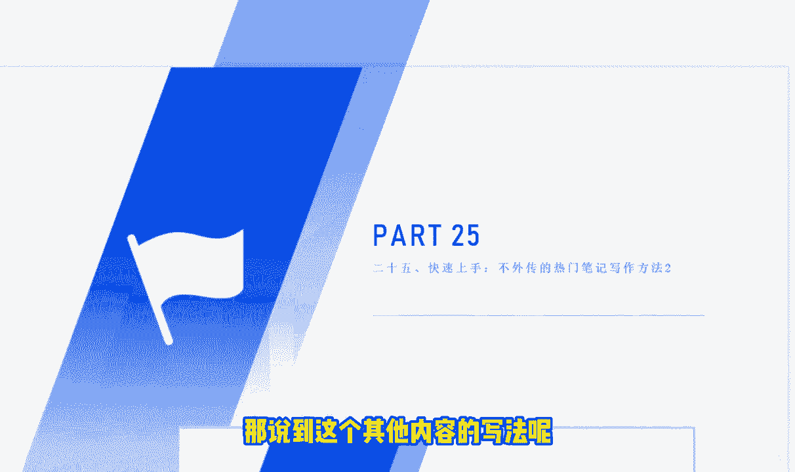
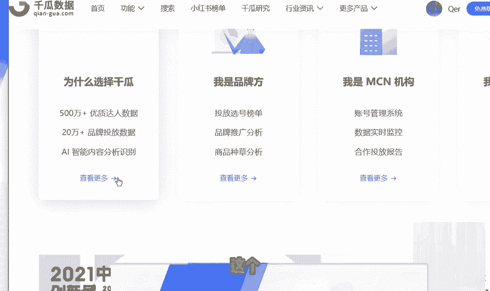
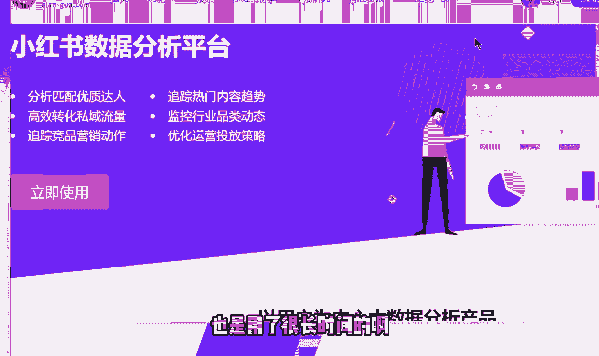
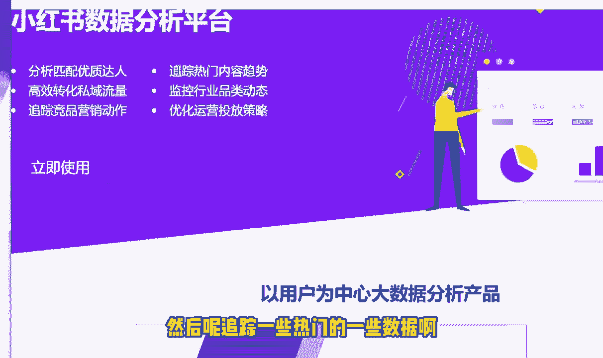
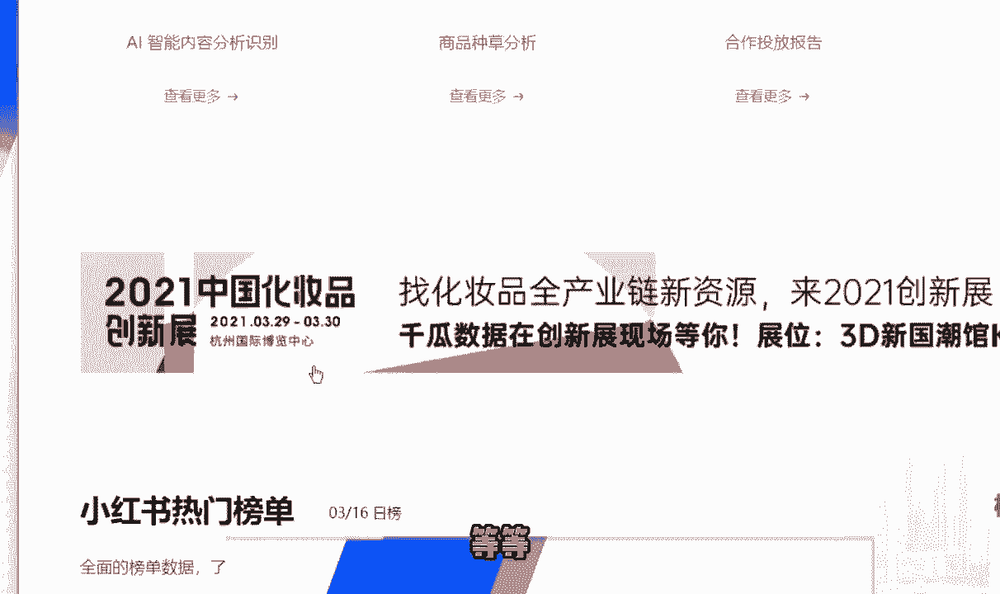
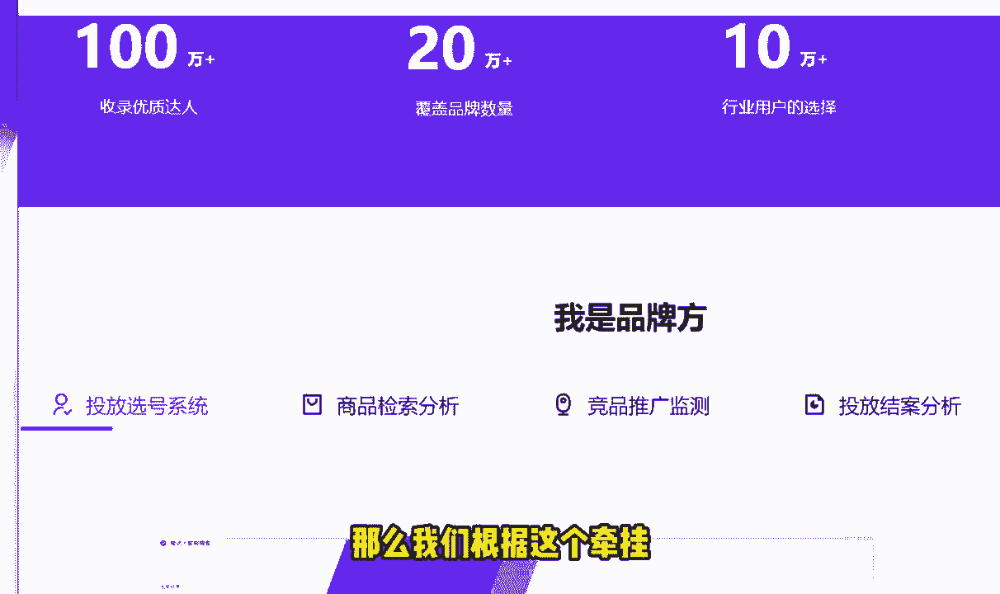
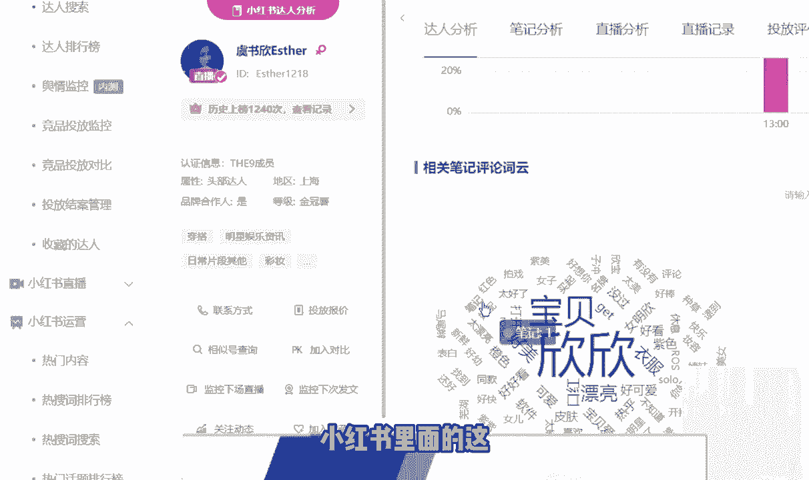

# 【2024版小红书体运营教程】全B站最良心的小红书开店运营教程！小红书体开店 起号真的快，赶快点赞收藏起来. - P27：第28节：小红书爆款笔记之，不外传的热门笔记写作方法！二（可快速上手） - 青衫肆故人 - BV1Y1VaezENt

今天的第25节课呢，我们和大家讲一下这个笔记的一些，其他内容的一些写法，那说到这个其他内容的写法呢。

我今天呢主要是想和大家分两个大块去讲啊，首先第一个大块呢就是我们的这个内容，如何去确立呢，很多人在写这个小红书内容的话呢，首先不知道怎么样去确立这个内容，那么今天呢我们就主要分这五个小步骤。

来和大家确立一下这个标题，包括呢我们里面的这个营销的一个内容，就是笔记的主要的内容，那么首先第一点就是我们要确定一个领域啊，比如说你确定你做的是哪个领域，你到底是做的美妆的，还是说做的护肤品。

还是说做的母婴类的产品对吧，一定要去确认，那我在之前的课程里面呢也说的非常多了，如果说我们不能够确定这样的一个领域的话呢，那是会导致我们账号的一个垂直度降低的，账号垂直度降低的话呢。

是会导致又一系列的问题，比如说官方不去不去给你推荐啊，或者说你的粉丝会经常的流失啊，包括你的这个会形成一个恶循环，恶性循环就是你的粉丝越来越不喜欢你的内容，那你的那你的这个内容的话呢。

就越来越不会被官方去推荐，那么第二个呢，就是我们的这个关键词的一个梳理啊，比如说你要做这个行业的话，那你到底是要有哪些关键词是和你相关的，那在之前的课程里面呢，我教我教了大家呢去用了这个百度的这个啊。

百度的这个工具，包括爱站网，包括我们的这个啊5118，包括我们的这个百度指数，大家可以根据这些关呃，关键词的这个工具呢去查询，那么今天这节课呢，我们也不去去赘述这个东西了。

之前的课程呢我们说的非常详细了，根据你的这个行业，可以去梳理出很多关键词的一个东西，很多关键词的一个排行，大家把这些关键词的排行呢用好，就能够非常大的去发挥里面的一个作用了，那么第三步呢。

就是我们可以去搜集同行的一些案例，那收集同行案例的时候呢，可能有人就会说了，我天天在小红书里面搜，我又看不到同行的一些数据，那怎么办呢，啊其实也非常简单啊，我们给大家今天推荐了一个工具啊。

就是我们的这个牵挂，可以看到。

这个就是我今天给大家推荐的一个工具叫牵挂，牵挂数据的话呢也是非常好用的，也是用了很长时间的。

呃，他的这个数据的话呢有什么样的一个优势呢，就比如说我们可以看到里面有一些小红书的，这个分析的一些平台，比如说可以分析分析匹配优质的一些达人。

然后呢追踪一些热门的一些数据啊，包括比如说有一些品牌方的一些投放等等。

这里面的话呢有很多，包括呢有一些这个榜单，那么我们根据这个牵瓜到底是怎么去选呢。

下面我们来详细的和大家说一下，那接着我们往下说，那搜集同行的这些案例，搜集好了之后呢，我们就可以通过这些案例呢进行内容的筛选，那内容筛选呢完了之后呢，我们就可以整理成自己的这个内容，然后呢进行发布了。

那这里的话呢，我们就用这个牵挂来和大家去演示一下啊，清关的话呢，我们在左边的这个栏目里面呢，你可以看到有很多很多的这些的一个功能啊，包括你的这个热词的一个排行榜，热词的一个搜索榜。

笔记收录收录的这个查询的一些功能啊，这里呢今天呢就主要和大家讲解的这个功能呢，就是笔记收录的这个查询，那笔记收录查询的话呢，比如说你后面有没有这个啊，你后面比如说在发布了一些笔记之后呢，你有个担心对吧。

你到底这个，你到底这个比例有没有被官方收录呢，我们就可以利用牵挂里面的这个功能啊，就是笔记收录查询去进行查询，那有一些热门内容，包括热词排行榜呢，这个就不给大家看了，这里面主要用哪一个呢。

就是这个达人的搜索，反正搜索的话呢，就比如说我们可以按这个昵称搜索，或者说按其他的笔记内容进行搜索啊，比如说我们去搜索那个美妆，啊这个是要付费的，我们按这个昵称搜索吧，其实差不多的那昵称搜索的话呢。

它搜索出来的一些其他的一些这个属性啊，就比如说有这个做彩妆的，有做护肤的，有做一些这个母婴的，包括呢有一些美式饮品的等等，那这里面呢还有一些这个服饰搭，服饰的一些穿搭，这些的这个分类属性的话呢。

大家可以根据自己的一些数据，自己的一些需求呢去进行筛选，那包括我们可以看到有一些达人的这些属性，他到底是不是官方号，或者说品牌号，或者说他是不是这个头部的达人，那我们就可以看到它。

这里面呢是有一些很多的这个数据的，包括呢有一些这个达人的一些对比啊，比如说我们可以看到这是排名比较靠前的，排名比较靠前的，那牵挂的这个数据的话呢，相关数据这个网站的话呢，如果大家有需求的话。

可以根据自己的实际需求呢，去在这个淘宝上去找一下这个开通的，开通的这个渠道，那淘宝上的这个费用呢还是非常的划算的，那有了这样的一个功能的话呢，比如说我们随便点击一个人的这个，看他的一个详情页。

我们就能够看到他发布的一些这个数据，包括呢他发布笔记的一些这个分类，包括笔记的一些详情啊，还有他一些笔记的一些这个详细的一些类型，你看比如说他的这个笔记这个评论的一个词云，这这个词语的话呢。

就是这些这些词呢出现的一个频率，那我们用好这个工具的话呢，是能够很好的去帮助我们掌握小红书里面的。

这个数据的一个参数的，那说完了这个切额这个牵挂的一个使用呢，我们在最后呢和大家说一下，这个整理内容的一个方面了，整体内容的话呢，我在之前的课程里面也和大家讲过了，主要就是看我们会利用一个总分。

总的结构去写这样的一个内容，那这个内容的话呢其实它并不是很难写，或者说你觉得很难写的话呢，那我建议你可以看一下之前的内容，今天这节课呢我们就不再去反复的说这，反复的说这一点了，那么最后的话呢。

我们要说一下这个其他的一些注意事项，其他注意事项的话呢，首先第一点要和大家说的，就是，我们的字数呢，尽量是控制控制在12~18个字之内，那么第二点呢就是我们的这个标题里面，要多带一些这个符号进行美化。

因为我们大家都知道这个小红书里面的话呢，女性的流量还是非常多的啊，如果说你去带一些美化的话呢，还是能够去很好的去吸引他们的一些眼球的，那么第三点呢，就是我们可以去带上一些具体的一些数据。

这样子的话呢有一些真实感，就比如说在上一节课里面，我给大家发的那个一个截图对吧，百万啊这样的一个数字，或者说呢有这么样一个详细的一个数字，那看起来的话呢，别人还是会以为还是会很去幸福的。

所以说大家在加这个标题里面的，这个文字的时候呢，可以加上咱们的这个数字，好的。