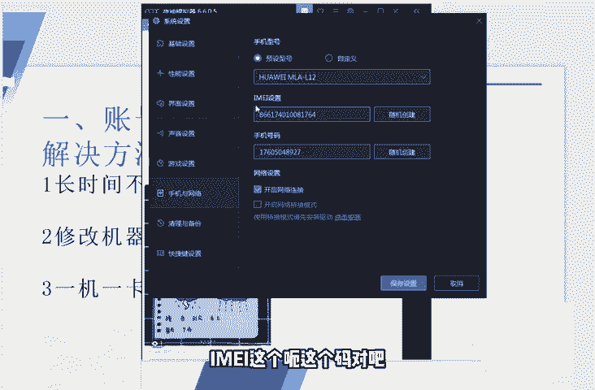

# 【2024版小红书体运营教程】全B站最良心的小红书开店运营高阶教程合集！小红书体开店 起号真的 - P10：第9节：新手必看，小红书账号运营8大避坑指南！ - 移动光-标 - BV1uf42117re

今天这节课呢我们来和大家讲一下小红书的一个避坑指南。一般大家在做小红书的时候呢，都会遇到的同样的8个坑。这8个坑呢其实也是非常普遍的一个现象。就包括我们有的学员在做这个项目的时候呢。

也会遇到同样类型的问题。今天的话呢就统一把所有的问题我们都整理一下啊，然后和大家一个一个来看一下这些到底是啊哪些该注意的地方。首先第一个呢就是大多数人大多数人会遇到的一个问题，就是账号注册的一个问题。

呃，有的人注册账号的话呢。可能发了半年或者是好几个月的好几个月的那个小红书的笔记。但是这个笔记呢一直没有流量，一直没有排名，一直没有这个相关的一些数据。那遇到这种问题是怎么办呢？

它其他的操作也都是也都是正常的那我这边建议的话呢，就是大家可以看一下你的这个账号的一一个问题了，包括账号注册的一个问题啊，包括手机的这个问题首先我们来说一下这个解决方法吧。

那很长时间不用的这个小红书号呢，你如果超过3个月的号，如果不用的话呢，那我建议你就不要去使用了。最好的话呢是自己重新注册一个。这样子的话呢是比较好的。然后呢。嗯，还有的这个人呢。

就比如说我之前可能封过在这个手机上封过一个号，对吧？那我又在这个手机上面去注册了这个小红书的账号，这样子的话呢也是不行的。因为小红书已经识别到了你的这个机器的一些参数，就像我之前和大家在那个。

应该是第二节课说的吧。对吧他会它会记录我们这个手机的各个硬件参数，主板号码呀、手机串码呀等等。它这些东西都会记住。那如何避免到这些问题呢？呃，大家可以在电脑上安装一个雷电模拟器，就跟我一样。

安装一个雷电模拟器或者是夜神模拟器。像我安装的就是这个夜神的模拟器。看过我公开课的这个朋友呢也应该知道这些模拟器到底是怎么去下载的。啊，就是你可以去在百度上下载一个。

比如说我这边今天讲课给大家用的这个是夜神的模拟器啊，在点击这个齿轮之后呢，点击这个齿轮之后呢是设置，然后这里面有一个性能设置，对吧？你可以调一下它的性能，然后分辨率呢调成调成这个手机版的对吧？

然后我这边呢是调成一个分辨率是比较大的，呃，然后呢。

在这个里面呢手机型号啊，包括这个串码，它都是可以去随机生成的啊，包括这个号码都可以去随机创建的。大家都可以看一下。你把预设型号。对吧这里面有很多的手机型号，我们通过这种方法去注册这个一个型号的话呢。

是啊是比较好的。是注册这个小红书账号的话呢，是比较好的。这样子的话呢就可以去避免掉我们手机设备不多的一个问题。你看它这边可以设计设置这个手机的型号RMEI这个呃，这个码，对吧？

然后手机号码包括网络定位啊等等，都是可以去调整的啊，就比如说我们这个账号定位在上海，对吧？定位在上海。

大家可以看一下定位在上海，然后我的这个啊这个账号呢，它就是一直是在这个。啊，上海看到了吗？这个地方有个上海。啊，大家如果啊如果方便的话呢，可以用这个方法去注册一个新的账号。注册好了之后呢。

我们就可以把这个账号退出来啊。退出来之后呢，我们如果正常要使用这个账号的话，我建议大家的话呢还是要去使用EG一卡一号。最好有条件的话，当然是使用EG一卡一号了，就是。一个一个手机只登录一个小红书账号。

上面这个手呃这个账号呢只连接这个手机流量啊，否则的话呢是大概率会被判定为营销号的。这些点呢大家都要去注意一下。呃，然后还有一点呢呃说到第二点，这个坑呢就是啊以前呢我们我们呢也遇到过。

就是最好大家不要去公布自己的账号去给别人。比如说你去加到了一些这个互粉互赞的一些QQ群啊，或者是微信群，或者说有一些发布这样需求的一些网站，一些贴吧里面，对吧？你去发布这样的信息。

这个其实呃有一点不太好是什么呢？就是说。你刚开始这个账号做做的不行的时候，那可能别人不会去掩馋你，或者说不别人不会去背地里给你去放冷枪，对吧？那当你这个账号慢慢做好的时候呢。

别人就会恶意的去给你刷这个数据。比如说我知道你的这个小红书账号了，就对吧？我就给你一篇笔记，我花个，比如说10块钱50块钱给你多刷一点这个。啊，点赞，但是呢收藏和那个评论什么都不刷，我就光给你刷刷点赞。

那这个时候呢我们的账号就会遇到一个问题，就会被限流嘛。官方官方就认为这个账号作弊了，对吧？但是官方但是你这个时候去申诉的话，跟官方说，你说这不是我刷的这是别人恶意去这个去刷的这个东西好像好像也说不清。

对吧？一次两次的还可以，但是如果时间多了的话呢，官方也是不太会承认这个东西的。所以说大家最好不要在一开始的时候呢，就把我们小红书的账号呢去给别人去看，对吧？因为这样子的话会防止别人给你去刷这个数据。

恶意的去刷这个数据，时间长了的话呢，呃，有些东西是说不清楚的。呃，第三点呢就是随意的去删改你的笔记。大家这边要记住啊，没有违规的，没有违规的这个前提下，就不要去删除你的笔记。

否则的话呢啊我们的这个笔记账号是会是会掉权重的。因为。因为这个系统就觉得很奇怪，对吧？你好不容易发篇发了一篇笔记，内容呢可能有一些偏差，或者可能有一些写的不太好。

但是好歹还是和这个领域和这个关键词有关系了，对吧？你不停的去删改它那。呃，这个平台呢小红书平台就觉得你可能是个营销号，对吧？这个账号发完了这个领域又删掉了，又发另一个领域去了。

所以说啊它会导致你的这个笔记去限流。还有我建议大家不要去修改我们的笔记，为什么呢？因为你去修改你的笔记的话，你发现你这边笔记发下去的这个流量啊，包括各种参数不太理想。但是这个时候你去修改你的笔记的话呢。

😊，也有一个问题，难道你修改的就一定是对的吗？或者说你修改了这篇笔记之后，你就一定会比你第一次发的这个笔记效果好吗？我看都是不太见得的对吧？所以说大家在遇到这个笔记数据不太理想的时候呢。

不要去随意的去删改笔记啊，哪怕你觉得可能我现在发的笔记和我之前之前的这个笔记风格不太一样，或者说讲的内容都不太一样啊，这些也都没有关系，这些也都没有关系，总之呢不要去随意的去删改我们的笔记。呃。

第四点呢就是很多人也会去做的一个错误的一个事情啊，就是呃。就是频繁的去发这些种种草的这些笔记。我们可以看一下，一般的像这种比较好的这种小红书的账号呢，他们如果是真的是啊真的是这个营销号的话。

你反而做的有些事情就不能像营销号，对吧？你可以多分享一些这个心得呀，一些干货呀，就比如说使用各种化妆品的一个心得，一个内幕一种趋势，啊，包括你使用的一种干货。你你可能觉得这些素材去哪里找的很多呀。

网上百度上或者说别的化妆品的那个别的化妆品的一些论坛，或者说贴吧都能找到相关的一些文章，或者说心得或者说干货，这里面都很多的对吧？啊，我们就可以去把这些东西呢去稍微修改一下，变成我们自己的。

而不要去老是发一些这个啊老是发一些中草笔记。因为本身发这个中草笔记的话呢，就涉嫌有这种营销的这种行为，对吧？我们可以给大家看一下。啊，像像这个你可以发一些周边的。比如说比如说我定位在上海。

就可以发一些和上海上海这个地方有关系的一些东西，对吧？吃喝吃喝玩乐对吧？都可以。我们来看一下别人是怎别人是怎么发的。啊，很少，对吧？粉丝他的像这个人，他的他的这个小红书笔例就。比较不错，对吧？

货赞与收藏达到了4。9万。但是我们可以看一下，他仅仅就发了4篇4个笔记，四个笔记的话啊这两篇都是比较高的。呃，一个是分享的什么壁纸。羽毛的壁纸没有任何的营销行为，就是分享一些心得和干货。大家可以看到。

对吧就是分享的这个壁纸。啊，然后。对吧他分享的你看这种照片，加上这种啊。滤镜的这种照片对吧？也是没有也是没有什么东西的。对不对？这个是种草的一个推荐，大家可以看一下，偶尔的去发一个种草的推荐。

而且写的是非常认真的。好，我这个软件有点卡。好，总之呢和大家看了那个刚才的那个账号，大家也应该知道了。就是我们在小红书上面去引流是可以的，但是呢不要去多发啊种草笔记，一定要去适当的去加一些这个啊。

你的心得，你的干货，对吧？基本上我觉得比较好的一个合适的一个比例呢是。是1比3。什么意思呢？就是说我们每发一篇这个种草笔记的话，大约你就要发三篇相关的心得呀，或者干货呀，或者是生活类的这种文章。

这个大家一定要注意一下。那么第五点呢，是很多人会去盲目的去分发分发的这些内容。因为小红书的这个平台，大家有的人可能是第一次接触这个平台，但是我还要说的比较详细一点，就是小红书的平台呢。

绝大多数的这个用户呢是比较年轻的女性群体，他们大多数呢是集中在1二一二线城市。所以说呃有一些博眼球，或者说在别的平台上呃觉得很火的一些东西就不要往这个小红书上面去搬了。小红书上面比较欢迎的内容。

大家也看到了，是心得干货，对吧？种草的分享等等。这种文章，包括同城的吃喝玩乐这种文章是小红书是非常欢迎的。那比如说我们在搬运一些这个快手啊，或者说一些恶搞的这种这种元素这种文章，这种视频上去的话。

小红书呢是。啊，小红书是不会不会很欢迎的，这这里面会导致我们账号异常的。所以说大家这边要注意一下，就是内容优先。我们的内容到底是贴合哪些东西的。我们的内容主要是来讲一些种草、干货心得。

包括分享这种经验的，以这种内容为优先，不要去随便转载其他平台不相干的那种风格的那种文章。呃，说到第六点呢，就是不要去使随便使用别人的这个相关的一些素材。呃，如果我们这个如果我们使用了这个素材里面呢。

就像我之前和大家说的，可以去在这个淘宝或者天猫的买家秀里面找一些图片过来用，那个是没有什么关系的。但是呢不要去用一些有版权的一些素材。这里面大家一定要注意一下，因为最近。

最近各个方面对于这个版权呢抓的还是比较紧的。嗯，所以的话呢所以说的话呢。就包括一些呃品牌啊，他们请的这些模特啊啊，我们要用他们的这些照片的时候呢。也要注意一下。

如果大家想要用到这些模特或者是素材的这种照片，可以去哪里找呢？可以去找一些这个国外的一些人物，或者说去百度上搜一些无版权可商用的这种素材的网站也是很多的。这里面呢也就不和大家去演示了。

这里面啊关于这个版权的问题，大家注意一下。还有一个呢就是呃很多人不知道小红书里面的一些规则。其实规则的话在第一课我说的也是比较详细了。对吧哪些东西该发哪些东西不该发。发的这个笔记里面呢。

很多人有的人就是比较想引流引流的时候呢，引流的这个心情比较急切，对吧？想快速的去加人。当然我知道这种心情呢是可以理解的。但是我们啊必须要做好这个度的一个把控。就比如说我们素材里面呃，我们的这个。

笔记里面不要去加上兼职抽奖这些啊这些关键词，对吧？转发诱导。因为我说了，小红书是严禁诱导用户的。如果发现的话，那是呃处罚是很严重的，就会导致我们账号被封号，对吧？包括这个素材的呃太暴露啊，对不对？呃。

特别是有的人卖一些这个女性的内衣，或者说做一些丰胸的产品。那这样的这个素材呢，就不要的不要去太暴露一些，一定要注意一下，还有呢就是。呃，诱导别人去给你这篇笔记去点赞呀，包括你叫别人剁手买买买啊。

连这个也是不允许的。大家要注意一下。因为你如果提到这个买买买的话，那就是涉及到涉嫌去诱导别人去购买这个东西也是不行的。所以说大家在这个写笔记的时候呢，一定要注意到这些东西呢是不可以去触碰的。

如果你对你的笔记里面的一些违规词，或者说一些营销词不太确定的话呢，可以去看回头看一下第一课。第一课里面我给到了那两个检测的网址也是非常重要的。

大家可以用那个检测网址呢去检测一下到底你的文章里面有没有相关的违规的一些词语。好，下面我们说的最后一点呢，就是大家注意的呢是重发笔记。有的人觉得我的这个笔记写的很好嗯，不管是选题也好，关键词选取也好。

标题也好，正文也好，或者说关键词出现的这个频率也好，等等等等，我都做的非常到位了。但是发了之后还不是很火。那我是不是有这个必要去重发这个笔记呢？实际上实际上我在这边建议大家呢是啊最好不要去重发重发笔记。

因为你去重发笔记的话呢，会有一个问题啊，会被判定为去是会被判定为抄袭的。因为小红书它的它的这个逻辑很奇怪。如果你的这篇这篇笔记这个文章发出去了之后呢，它是有概率是被小红书收录的，这个大家也应该知道。

对吧？如果说你的文章被收录了之后呢，你再去重新去发，把这篇文章删掉了，然后再重新发的这又发了一遍这个文章，他就很可能判定你是抄袭的。之前你发的这个文章啊，所以说小红书这个逻辑呢还是很奇怪的。

跟其他的这个平台不太一样，所以说为了避免这样的事情发生的话呢。嗯，哪怕不火的话也不要着急。因为我们我说了，我们这个小红书的账号呢，它不可能说靠其中一一篇笔记，或者说一两天的一个积累。

就能达到一个比较不错的一个呃这个货赞或者说收藏的一个效果。这些东西呢都是需要慢慢去积累的。不可能说我们单单靠几篇文章，或者说几天几天的时间就能达到那么样一个程度，对吧？呃，把这个小红书账号养成呢。

它是一个日积月累的一个一个过程。所以说大家在做这个小红书笔记的时候呢，也不要太去着急。好了，那本次的这个分享呢一共是啊一共是8个啊8个做小红书，做小红书这个账号，8个坑的，也就和大家分享到这里。

