# 【2024版小红书体运营教程】全B站最良心的小红书开店运营高阶教程合集！小红书体开店 起号真的 - P7：第6节：小红书种草笔记写作4大步骤！新手必学 - 移动光-标 - BV1uf42117re

我们这节课呢来讲解一下小红书系列的第二课笔记速成、小红书、种草笔记四大步骤啊，所有产品都适用的一个方法。在讲解在讲解本次这个本小节课之前呢，首先要和大家达成一个共识。

那就是很多人在做小红书这个平台的时候呢，绝大多数的用户还是喜欢在这个小红书的平台上面呢去发现和分享一些好物。所以所以说在呃我分析小红书这个平台这么长时间呢，我认为小红书的话是。

主要的一个主旋律呢是种草笔记啊，也也就是说呃大家不要去写一些无关的一些那种主题那种话题。而且呢小红书这个平台呢，它本身也是去推荐大家去写这种种草笔记的啊。

所以说我认为种草笔记的话是小红书的一个主一个主旋律。只要你去掌握小红书的种草笔记的玩法。那后面做的一些事情呢都是水到渠成的。比如说你去引流啊，比如说你去变现，比如说你去做推广等等都是非常方便的。

为什么很多人说做到做到最后发现。啊，我我这个引流比较难，或者说我变现比较难。其实问题就是出现在了你笔记的一个。呃，一个风格上面，一个内容的一个方向的上面啊，这里再跟大家达成一个共识。

就是说我们最好是在小红书上面写的笔记是种草类型的。好的，说到种草类型的话呢，那很多人就会理解很多人呢就通常写着写着就变成硬广了。因为我们之前在这个抖音上也发现。一些这个好物的推荐的视频。

大家可能会发现啊，这个文章或者这个视频做出来之后就感觉非常像硬广。你说的每一句话都像是为在这个都像是在为这个商品去做宣传，去做推广。好像每一句话都离不开这个东西似的。那我们该如何规避成这样的一个问题呢？

今天的这节课呢来呃来和大家主要的就是说一下这个问题。也就是我们如何规避到这个问题，把我们小红书写出来的这个笔记尽量的不要像这个硬广一样。这节课呢主要是分成四个小步骤来和大家去讲解这个种草笔记的一个。啊。

一个一个书写。Yeah。那么首先第一点呢，就是建议大家去做的一个步骤呢，就是去找到一个相关的一个素材。我这边给大家分呃分门别类的四种类型的素材图片。这种素材图片呢。

我主要是分成一个产品图、效果图、细节图和使用图产品图呢主要是一啊2到3张，效果图的话呢是1到2张。细节图的话呢是1到2张，使用图的话呢是1到4张。通过这通过这些图片呃。

从不同的角度去展示这个商品这个产品它的一些卖点。你就可以根据这些商品这些产品去把每一个卖点啊每一个亲身的感受都可以去写出来。首先就是一个产品图，对吧？这个东西长什么样子是吧？然后是效果图。

这个东西用起来到底是什么样子？啊，细节图就是就是从各个各个角度，各个方位，各个不同的使用场景。我们来看一下这张图片的一个样子，对吧？那最后一张呢最后一种图片呃，图片的这个素材图片的样式呢。

我把它叫做使用啊，使用图。就是说我们亲身亲身经历的过程中，在用这个。商品用这个产品呢。同时的一些的这个照片。那为了给大家做一个详细的分类呢，因为有的有的有的大家可能做的是不同种类的一个行业。

就比如说呃可能有的人是卖的口红啊，可能有的人卖的是这个衣服啊。他就像比如说这个卖的衣服的话，他就没有使用图，对吧？它就是一个产品图，或者说一个效果图啊，没有说使用这个这一点的对吧？

那所以说我下面给大家列了一张表格呢，就是有些如果说你是做的这个大类的类目的话呢，那里面的一些图片是可以不用到的。就比如说如果你做的是服装的话，那细节图和使用图都可以不用去发。

只要留着这个产品图和效果图也就可以了。那如果说你是做母婴的话呢，最好还是把这四种图片全部都带上。啊，如果你是做电器类的呢，还是的把这四类全部都带上。但是如果是你是做食品或者是做美妆的话呢。

那后面的两种两种图片就可以不用去带了，使用图和效果图啊，基本上可以就可以不用去带了。因为呃这个产品图和细节图都已经把后面这两个呢都包含进去了。这个呢大家一定要注意一下，我在这里面已经标了这个横线的啊。

这里面是不需要找这种找到这种图的。那么如何去找到对应的这种这些图片呢，其实也很简单。这里给大家推荐一个渠道，那就是我们的。那就是我们的这个淘宝。啊，比如说我们现在想卖一款这个泡脚桶，对吧？打个比方。

那我们就可以在这些天猫店或者是淘宝店里面去找到这些产品图啊，产品图肯定都是有的对吧？那那些使用图和那个呃效果图到哪里去找呢？都是有在这种呃好评里面啊，就是这个评价里面都有一些带图的，大家可以看一下。

这些都是使用的图片。

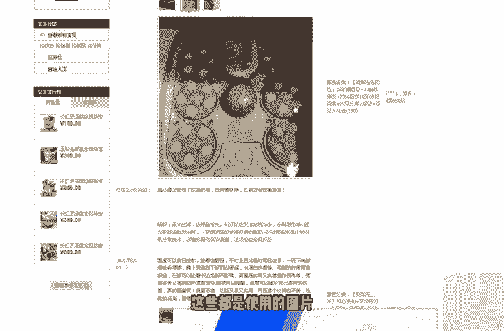

啊，实实际上就是一些买家秀了，对吧？大家可以整合一下，整合一下这些图片呢啊做一个分类。然后呢，我们去写作的时候呢，就可以根据这些图片去写。啊，这里面都是有一些买家秀的。对吧这个是相当于就是细节图嘛。

对吧？有一些追评的，大家可以看一下，有一些追评的追评的话呢，就是使用效果图了。好，第一步呢，如何去找素材？那我们这个呢也就和大家说到这里了。下面和大家说的呢是如何去写这个文案。写文案的话呢。

也自然是包含了两部分。其中一部分呢是如何去正确的写这个标题。另外一部分呢是如何正确的写好我们的正文。啊，里面的内容内容到底是如何正确的去书写？呃，这里呢我给大家举了个案例啊。

我们首先来看一下如何正确的写标题，或者说标题应该怎么样去写的更好一些。左边这个部分呢是原来的一些标题，右边这个部分呢是优化的一些标题，大家可以看一下，那原标题我给大家念一下。

男朋友挑选的圣诞礼物蒸汽足浴盆，对吧？那我们可以把这个标题优化成什么样子了呢？无需倒水的蒸汽足浴浴盆。男朋友挑选的对吧？啊，包括这个护肤精油也是的，秒杀卡诗的护肤精油，对吧？

原标迪士终于拥有了这个樱花粉蒸汽锅。那优化过来的标题呢，我们加上了这个词，终于拥有了这个少女心爆棚的樱花粉蒸汽锅。实际上大家应该可以发现。我们加的这个红色的这个字呢，应该是这款商品的一个卖点的一个词。

对吧？就比如说樱花粉的这个蒸汽锅，对吧？它大部分应该是一个是一个女孩子使用的一个商品，对吧？那我们可以加上少女心爆棚嘛，是吧？呃，一般的我们来看呢这个蒸汽足浴盆的话。比如说他现在突出的一些卖点。

可能是先进的，不需要倒水，对吧？啊，或者说多少小时恒温打个比方，对吧？我们就可以把这个卖点突出在这个标题里面。啊，这点呢大家一定要注意一下。标题的话呢可以优化成这样的去写。啊。

那下面我们再来和大家说一下这个里面的正文里面的内容到底是怎么样去写呢？如果说文章的里面到处都是卖点的话。那看起来就非常像硬广了，对吧？也不会也就不会得到小红书的推荐和收录。

就像我们之前看到的这个标题一样，如果你的文章里面到处都是这个卖点的话呢，那可能对你的文章正文来说内容来说的话呢，就会出现不太好的一个事情。就是你写着写着就感觉啊，你是你是硬是来推广这个商品的对吧？

所以说那我们怎么样去啊怎么样去。来来写这个文章的一个步骤呢，我这里给大家画了一个图，大家可以看一下。这里呢就是我建议大家去按照这个步骤去写的。啊，首先呢我们最好是要从自己的一个经历去切入。

去切入来写这个东西。然后呢去找到这个商品的这个产品的一个缺一个痛点，自己的一个痛点，同类商品的一个缺点。再根据这些痛点和这些缺点，我们来引入自己所推广的这个商品，对吧？然后呢，最后加上个人的一个感受。

这样子的话呢。啊，通过这么这么几个步骤。通过这么几个步骤去写这篇文章的话呢，那文章的层次感也好啊，逻辑也好啊，都是非常不错的。那对应的每这四个步骤，每一个步骤该如何去书写呢？这里面和大家说一下。

也很简单，就比如说如何从自己的精历去切入来写这个文章的一个开头，对吧？啊，要写要写成。我建议大家呢要写成啊，我这应该是我怎么样怎么样，对吧？不要把自己放在一个专家和一个商家的角度去写。

对吧就比如说我们哦我们还是拿那个足浴盆来和大家举例吧。对吧。一般的人写这种文章应该啊会说什么很多女生。到了冬天，脚都非常的冷，对吧？啊，其实最好的一个角度是什么呢？应该说应该以第一人生去写。

或者说写一下自己自己的一个经历，对吧？比如说啊我是一个女生，我到了冬天，脚就非常的冷，从来没有暖和过，对吧？这样子的话呢，它就有一种代入感，很亲切的很生动的一个代入感。

如果你一开始就把自己的这个定位占成了一个专家，或者是占成了一个商家的话，那别人就觉得你这个是来推销的对吧？没有站在一个第三第三方一个客观的角度去看待这个问题。好，那我们下面要讲的呢是痛点和缺点这方面。

痛点和缺点这方面呢。写的越详细越具体越好，但是呢不需要去写多，不需要去很多。但是呢一定要是去描写清楚。就比如说我们呃这还是拿这个泡脚桶来作为例子的话。

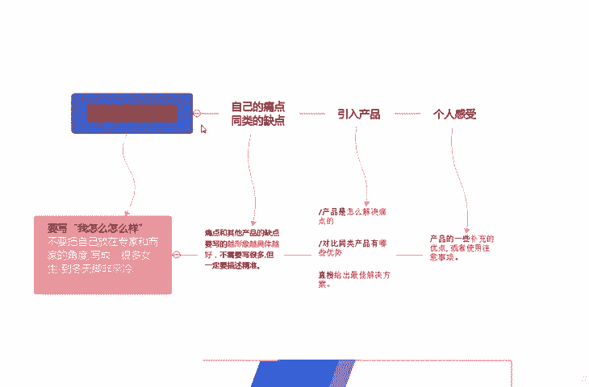

比如说我们一般可以在这上面会发现。这个泡脚桶它啊它的一些这个。

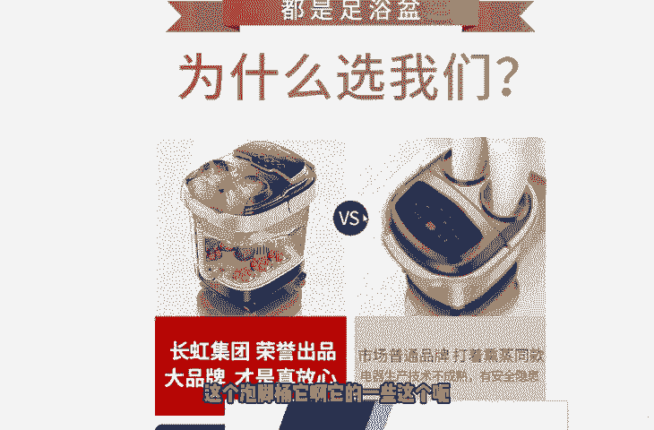

呃。对比你看到了吗？为什么去选我们？实际上就是这个是产品的一个对比嘛。啊本店的这个商品和别人家的这个商品。嗯，别人家的这个商品是。

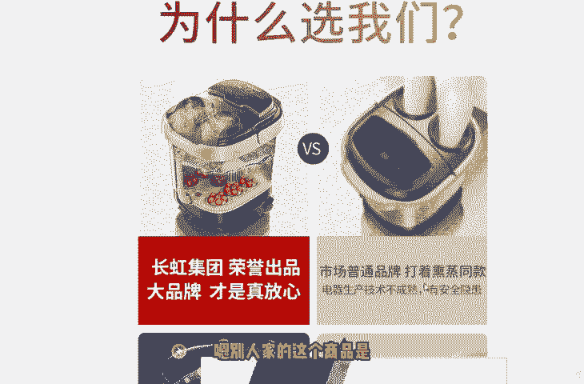

有安全隐患。残留尾货或者说是老款O型的熏针口，容易这个刮伤小腿，对吧？但是我们家的这个新款专门是为亚洲人的这个腿型设计的，伸缩伸缩自自如，对吧？这种就是痛点的一个比较。还比如说我们来看一下这个足浴盆。

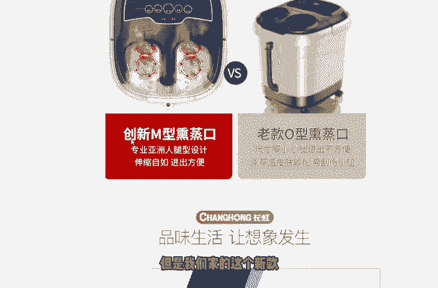

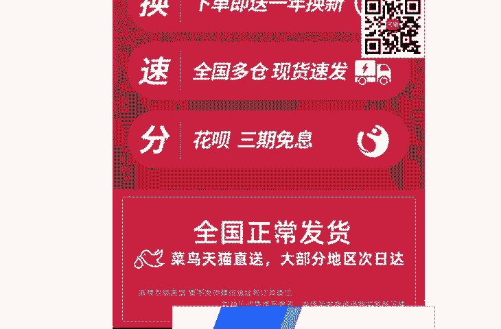

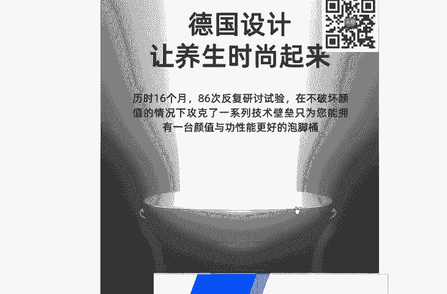

啊，一键启动，就比如说别家的这个商品，别家的产品没有一键启动，还需要不停的调调调了很多按钮，对吧？我才能去用得上。

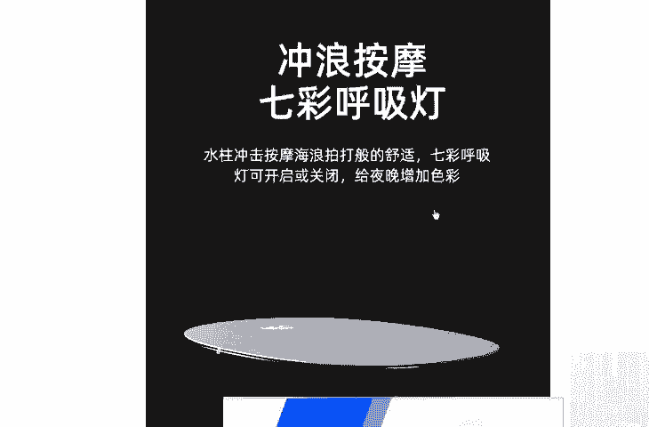

啊，水电分离，别家的没有水电分离，对吧？

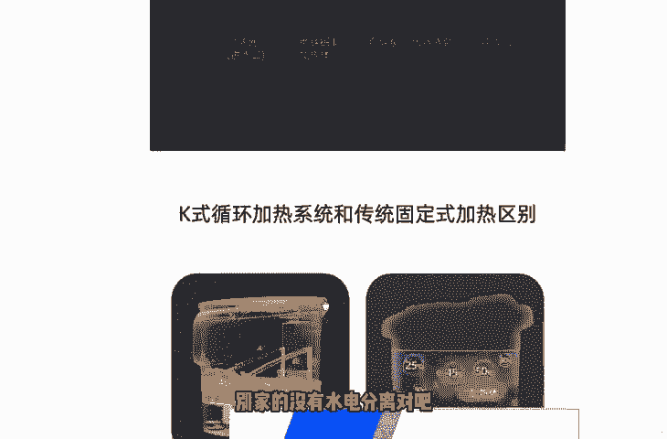

还有这个呃循环式加温和固定式加温。那别人的别人的这个产品可能是一个固热固固固定式的一个加温，导致水温不均匀。但是我们家最新的这个产品是K式循环加温，水温均匀啊等等。这样子的话呢，我们按照这种啊。

我们按照这种痛点或者是缺点去写的话呢，尽量的把别人的这个描别人的这个缺点的，或者是痛点呢去描述清楚就可以了。好，然后有了这个痛点和缺点，也就是说有了这个有了需要改善的这些缺点之后呢。

我们就可以对入对应的去引入我们自己的一个产品。对吧我们自己的这个产品，那可以从哪些地方来写这个呃写这些点呢？那很简单我给大家列出了这个三点。第一点呢就是我们这个产品是怎么样解决这个痛点的？

第二点呢是对比同类的产品啊，我们又比别人多哪些优势，对吧？第三点呢，直接是给出一个决啊一个最佳的一个解决方案。大家再可以看一下，我们再找一个。😊，啊，再找一个对吧？比如说这种按摩啦、水电分离啦，对吧？

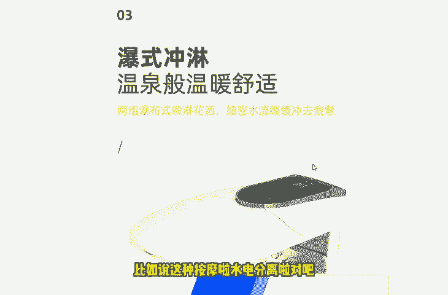

爆铺是冲灵吗？啊。啊，水很深，很节能，一键启动。记忆智能记忆。

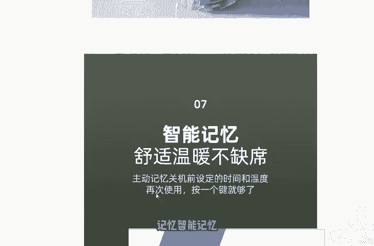

防电磁干扰国家标准对吧？啊，这里面还有一些其他的一些这个呃这些理由啊，这些这个大家都可以去看一下。😊。

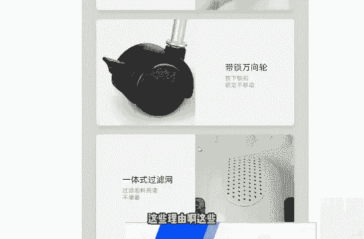

好，针对于这些东西来说的话，我们就可以引入自己的产品。然后呢把自己产品的一些优点去写出来，直接给出这种最佳的解决方案，对吧？好了，那这个呃正文的最后一步是写的什么呢？是写的一个个人感受。

就是我们在最后补充性的来写一下这个产品的一些啊补充性的优点啊，包括使用的一些注意事项啊，就比如说你可以去问一下这些卖家啊，我们要卖这种商品的时候，那最后对吧？最后有一些什么样的这个注意事项啊。

比如说怎么去保养它呀，对吧？啊，比如说我长时间不用该怎么办呀，对不对？等等这些小的注意事项呢，你可以去稍微的去问一下那这样子的话呢，我们的一篇文章正文里面的这个文章架构呢也就很完善了啊。

从这个逻辑顺序去看的话呢，也是非常不错的。好了，这个就是正文的书写的一个流程。那这个下面呢我再和大家去讲一下，我们去如何去找产品的一个核心卖点。包括呢如何去寻找一个。呃，一些痛点。

如何发现其他商品的一些缺点。这里面呢，其实在刚才演示的时候呢，我就和大家说的比较详细了。我们可以通过天猫店、淘宝店等等等等。这些店家，因为他们这些店家呃，是直接直接的去推这些商品呢。

所以说他们对于他们自己商品的一个呃一个就是自信的一个程度，或者说对于市场的一个考量是比我们要成熟的多的。我们直接可以参考他们的一些个这些个建议啊，大家可以多看啊，多看一些。

甚至说你可以去问一下这个淘宝的这个客服，对吧？你家的这个商品凭什么要比别人家的好，对不对？那他这些客服呢都是很呃，就是很容易告诉你的这些答案呢。啊，包括一些这个呃一个这个这个商品。

这个行业里面普遍存在的一个缺点。就比如说我们还是以这个泡脚桶为例，足浴足浴盆为例的话，它比如说普遍之前存在的一个问题是什么，对吧？比如说没有那个。刚才那个是怎么说来着啊，没有一个就是那个。

叫什么不适合亚洲人的腿型，大家还记得吗？就经常容易刮伤，那这个是不是一个普遍性的一个问题，对吧？啊，所以说我们就可以针对于这些缺点，这些痛点啊，包括我们自己商品的一个核心卖点去写这样的一些文章。好了。

这个呢是关于写这个文案，就是文案标题和正文的一个内容。我们下面来看一下做图片的一个要求。啊，其实做图片的话呢主要是分为两种图片啊。小红书里面的这个笔记呢主要是分为两种两种图片，一个是封面图片。

还有一个呢是文章的一个配图。配图的话呢啊封面图的话呢，那就很简单了，对吧？是一张图片，一张图片的话呢。这个里面呢最好是出现啊产品的一个图片，然后呢加上一些文字啊，加上一些特效啊等等等等。

这里面我给大家推荐的呢是使用这个黄油相机或者是美图秀秀来处理这个我们的这个手图。大家可以看一下美图秀秀可能大家都应该知道，但是黄油相机是什么，不知道。啊，黄油相机的话。

黄油相机的话也是一个非常不错的一个相机啊，它的滤镜都很漂亮的，包括它这里面能给文字去加上一个正版的一些字体，包括一些这个其他的一些呃模板啊等等。呃，反正呢是很现在很流行的一个照片的一个处理的一个软件。

大家可以用这个用这个APP呢去去处理一些这个照片。虽然呢有些功能是付费的，但是基本上免费的这些功能呢，足够我们去使用了啊，美图秀秀，那我们就更不用说了，对吧？啊，然后说到这个配图的话呢。

就尽量是5到8张。嗯，5到8张的一个配图就可以了。好了，当我们这个配图做完了之后呢，最后一步呢其实就是检查工作了。检查工作呢啊再和大家说一下，也就是检查一些这个文字的一些错别字啊，一些敏感词。

我们在第一课也已经说的很详细了，对吧？啊，去检查这些东西。适当的去换行文字呢不要去太密集啊，然后呢适当的话呢这个表情符号要多一些，这样子的话就显就显得我们的这个呃文字呢会更加生动一些。

然后再检查一下我们的图片有没有去带一些水印和二维码。那这里面呢我就暂停一下，给大家看一篇这个示范性的一篇文章。啊，这里呢给大家看一下我找到的一篇文章。也就是一篇这个笔记了。

这个笔记呢写的还是还是非常不错的。首先呢它的图片大家可以看一下首图对吧？啊，加的这些标签啊，包括这个顺序啊都是很不错的。后面的这个配图呢，你看有详细的一些个介绍啊，有详细的一些介绍。

关键的呢是我想借用它的这个文字的这个部分。第一呢是文字，对吧？适当的去换行。大家可以看一下，干性干性肌肤、油性肌肤、混合性肌肤，它这里面是有用的换行的，不是那种眉毛连着胡子的那种感觉，对吧？啊。

首先人家这样看起来不是很累，看起来很有条理，对不对？啊，第二个呢适当的可以去多用一些表情。比如说这个星星啊，打了勾呀，后面的这些表情符号，小猴子呀，对吧？啊，这里面有个什么问号呀，对吧？

这些都是非常不错的啊，非常不错的。这样的话呢可以显得这篇文章比较生动，对吧？啊，基本上按照这种要求写出来的这种笔记呢都是非常不错的。所以说大家可以去看一下我找出来的这篇呃这个笔记的一个一个样子。好了。

我们再和大家回顾一下。本节课呢也讲了这么长时间了。和大家讲的呢是笔记速成速成的一个一个写法，对吧？首先第一点呢，我们最少要做一张这个封面首图和一张配图。首图呢需要加上一些文字。配图的话呢。

可以加上文字或者是打上标签。这两张图的话呢，最好是包含产品图和效果图。如果有细节图和使用图的话，会使你的笔记加分，也会增加你笔记的一个权重。啊，第二点呢那就是标题的这个创作呢要写明产品的一个特点。

或者是商品的一个卖点。这里面呢一定要去加进去。这样子的话就会凸显你商品的一个与众不同啊。第三点呢也就是我们文章的一个正文部分。如果按照以下的这个格式来写的话呢啊也就是我之前投屏的这个。对吧从自己的经历。

然后到自己的痛点啊，然后再引入这个产品，再写最后的个人感受。按照这个步骤去写的话呢啊也是非常不错的。

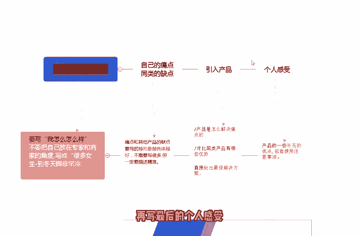

这样子这种格式来写的话呢啊它就是显得你的文章呢非常有的条理，非常有层次感，也非常有逻辑，对吧？一层一层意思下来了。好，然后做完这些东西之后呢，最后呢去检查一下你的这个文啊这篇文章的一个敏感词。

敏感图案或者是二维码。那我们这样子的话呢，经过四个步骤就可以去完美的写出一篇属于我们自己的这个小红书的笔记了。好的，那本节课呢也就和大家分享到这里。

