# 【2024版小红书体运营教程】全B站最良心的小红书开店运营高阶教程合集！小红书体开店 起号真的快，赶快点赞收藏起来 - P1 - bi张天琪 - BV1cZVxeTErh

还有谁。要说最近什么项目最火，那必须要提到小红书电商。最近几个月呢，几乎整个互联网都在讨论小红书电商。我关注的几个商业博主啊，包括一些付费社群都在讨论他。我朋友圈月入5位数甚至6位数的比比皆是。

这个项目在年初的时候，我其实就有让团队跟进测试，我还在市面上买了一些课程学习，到现在单人单店一个月能做个一两万块吧。今天我就用一个视频详细的给大家拆解一下，就是小红书电商到底怎么玩。

我会把整个小红书电商的流程，包括一些注意点，比如怎么开店，怎么选品，怎么做流量，一次性给大家讲清楚，你甚至都不用再去看别的相关视频和培训啊，你就跟着我的视频去按住做骥，就足够你在这个事情上开始盈利了。

视频的结尾呢我还会给大家准备一份资料，里面有我找的课程啊，对你运营小红书电商呢会有很大的帮助。有需要呢直接去拿就可以了。言归正传啊，整个项目的逻辑啊，其实也非常简单，它就三件事，第一个呢开店。

第二个选品，第三个流量。我们一个一个来讲，先说开店。呃，开店其实没什么好说的。那，首先就是打开小红书，然后点击左上角的菜单图标，再选择创作中心，然后点击更多服务这个选项，选择店铺，点击立即入住就可以了。

你就按他官方要求的提交资料入住就行了。我居然看到有人把小红书开店包装成一个项目拿出来卖。居然还有不少人买，这也是很奇特。这里跟大家说一下，小红书店铺的两种形式，个人店和企业店。

其中个人店有两种分别是个人店和个体工商户店，个人店只需要身份证加1000保证金就可以开通了。个体工商户呢还要多一个营业执照，企业店呢就多一点，企业店有三种呃，有包括那个普通的企业店有专卖店和旗舰店。

企业店都需要营业执照，而且还要缴纳600个年费。我们刚开始运营小红书电商的时候，你直接选择个人店就可以了。我们实测下呀，企业店和个人店一样，平台并没有对企业店有什么流量倾斜。唯一的区别是个人店。

你只能开一家，而一份营业执照，你可以开三个店，你一个店如果都没做好，你开再多的店都是没有用的。而且小红书电商啊，我觉得是。

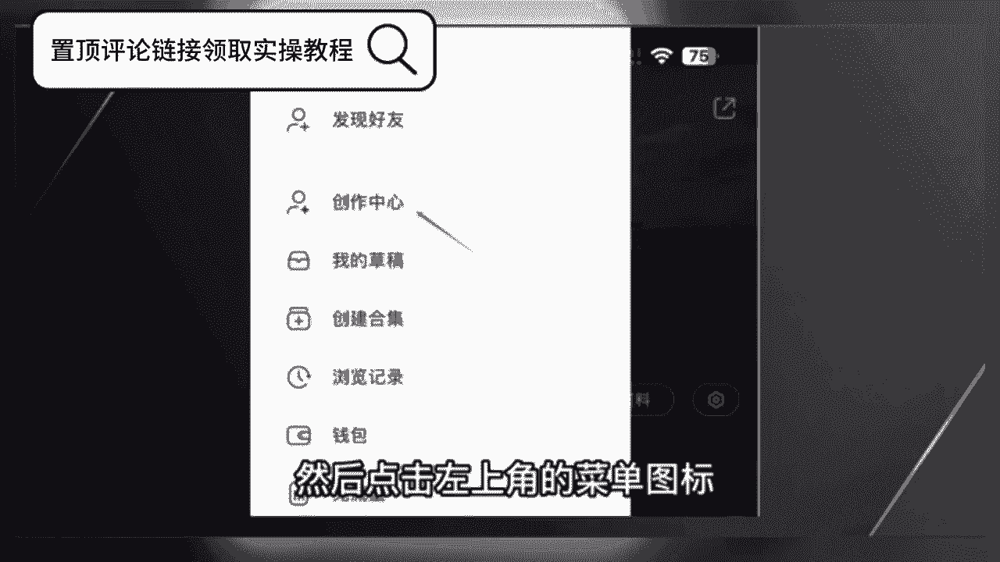

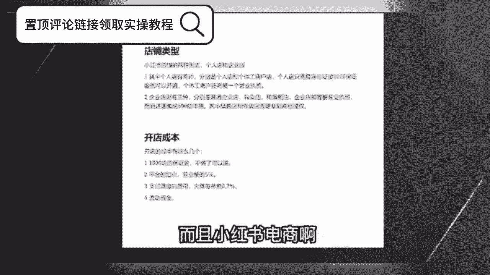

适合店群形式去做的。这是因为小红书的流量机制，它的电商自然流占比非常低。那你付再多的店再多的货有什么用呢？所以只要你看到有博主跟你讲什么小红书店群，我都觉得是在扯淡。小红书是要做矩阵的啊。

但不是店铺矩阵，而是账号矩阵。这个后面的流量获取那里，我会跟大家细说，开店的成本呢有这么几个。第一个就是1000钱的保证金啊，不做了可以退。第二个呢是平台的扣点营业额的5%。第三个呢是支付渠道的费用。

大概呢每单是0。7，第四个就是自己的流动资金啊，一开始大家做呢可以有无货源的方式去做？对资金要求也不高。你刚开始呢准备个20003000块完全够了。呃，开完店以后呢，我们下一步就是选品。

我们应该在小红书上卖什么呢？选品其实也简单。在其他平台上的爆款大概率在小红书上也能报。目前小红书呢，我是推荐三个渠道进行选品的。第一个是通过某东某宝上面找那种小红书平台调性的爆款产品。呃。

身边有做电商的朋友，他自己在某宝的店铺卖爆款，搬到小红书上。第一篇笔记就开始。第二篇笔记单量就已经破百了。第二个呢是通过某音的那个精选联盟。你在某音的精选联盟排行榜，你可以看到现阶段哪些品卖的好。

只要符合小红书用户调性的产品，直接搬运测试就可以了。第三个就是某多多的这个销量排行榜选择适合小红书的类目排行榜，从中选择相应的爆品搬运到小红书。整个选品的逻辑，就是我们要利用市场来帮助我们选品。

而不是自己在那瞎想，我们要借助大卖家的选品能力来弥补自己选品上的不足。所以我们只要判断一个东西啊，就是这些排行榜上的爆品是否跟小红书的人群有匹配的可能，如果有我就搬过来测一下，对吧？

相当于是借助了别人的能力来帮我们自己选品，这样反而是最快，而且是最稳妥的选品方式，肯定比你瞎测成功率要高很多。然后等你这个产品上架以后呢，就到了最重要的环节了。我们应该如何获取流量。

小红书它是个种草平台。你店铺九成以上的流量啊，都是来自你发发的笔记。这就是为什么我之前说小红书不要铺店群，而要做账号矩阵，尽可能多的发笔记好流量。它的通路就是。用户通过你的笔记然后对你推的产品产生兴趣。

然后到达你的店铺完成购买，你堆一堆店铺，对吧？你铺一堆店铺一就还不如多发笔记，多发几篇笔记的这个效果好。所以怎么在小红书上发笔记，对吧？就是你小红书电商是否成功的关键。小红书这个平台，你直接发硬广。

我觉得效果非常差，对吧？本来小红书的这个用户群体认知就比较高，你直接发广告没有办法获得信任的啊，更不要提转化了，你发笔记的时候，一定要用一个素人的角度，你知道吧？就是用户的角度去切入。

站在用户的角度去做种草内容，而不是官方视角，这才是真正有效的。呃，这种种草笔记怎么做，其实也很简单，就是去各大平台的商品评论里找。比如某音某宝某东的商品买家秀找到好看的素材，你直接copy下来用嘛。

对吧？文案呢在买家评价上去做修改。这些买家的评价呢就是商品用户的使用体验，天然的适合用来做这个中考笔记，而且可以说是取之不尽了啊。然后呃当你单个账号的SOB跑通了是吧？我们就可以开始举阵引流了啊。

通过批量上小红书账号批量发布笔记。给我们的店铺来引流来放大。那基本上整个小红书的电商的运营啊，就是我上面分享的这些外面不管多少钱的培训啊，000块也好，000块、1万块也好，其实就是这些东西。

有些培训可能还没有讲的清楚啊。根据上面几个点，我给大家准备了一份资料，里面包括了小红书账号的起号运营的方法，以及一份小红书电商的视频课程。你如果打算经营小红书电商，你也不用看别的东西，就跟着这份资料走。

足够你开始盈利了。有需要的啊，点赞加关注，在评论区回复红书电商，我分享给你。😊，🎼要有自信啊，你是最好的，知道吗？😊，🎼说一个利润大到吓人的小生意啊，不是很体面，但是呢很赚钱啊。

2024年的马上就要到了大家接下来几个月要多赚1到3万块钱的话，那一定要把我下面说的这个行业呢去做起来啊，好吧，而且呢都是风口啊，就算做不好呢，你好好听一下，也可以养一下自己的商业嗅觉啊。大家呢要记住。

就是所有的富人他跨越阶级都是因为踩中了风口。所以说呢你只要顺着风口去干啊，哪怕说你只干个几年都很有可能赚到普通人一辈子的工资的钱啊。那所以说接下来5年呢，有哪些方向会成为风口呢？

那跟大家说一个词啊叫做自由职业者，就是呢现在一个新的趋势啊，意思就是说呢哪怕你在家里你都能够做到一个养家糊口的生意啊，只需要一部手机或者是说一台电脑，每天呢花上2到3个小时的碎片化。🎼间你就可以赚到钱。

算是一个小成本的项目啊，它的市场需求性强，客户粘性高啊，最重要的呢是一个零成本的运营模式啊，不需要店铺装修和人员工资。对这些高昂的硬性条件啊。那么我现在呢就把这个步骤，一五1十的分享给大家。

那么首先呢我们只需要打开我们的一个小红书，然后点击我的选择右下角的一个三个杠。我们找到这个创作中心。然后呢，这里面有一个点击更多服务。我们点击什么呢？点击这个开通店铺，这里有个新人开店权益。

咱们可以零粉就能开通。点击这个立即开店。然后呢，咱们选择选择个人店，因为咱们只需要上传咱们的身份证就可以去开店了，而且不需要一个营业执照的，明白吗？点击下一步。然后呢这里面有很多选项，咱们选择电商商品。

然后点击经营类目。这的话呢，我个人建议你们选母婴用品了。因为呢小红书的用户群体呢，女性偏多，所以说咱们使用女母婴用品。然后呢咱们这边用这个家居确认。😊，OK这边是让我们咱们就先交1000块钱的保证金。

咱们这边呢可以先先不交，咱们可以后期赚到钱之后，再去交这个保证金，也是没有任何问题的，明白吗？好，紧接着下一步。😊，然后呢，只需要上传我们的一个身份证就可以了，明白吗？然后们点击点击提交就可以了。

那提交完之后呢，咱们还要去给他去上架一个产品，咱们点击这个卖手合作，咱们剪辑笔记选品。找到我们需要卖的一个商品，因为咱们用的是母婴母婴。在这里面呢找的这种佣金比例比较多的一个产品，咱们可以随便找一个。

比如说咱们这个纸巾。😊，然后点击选品就可以了。选完品之后呢，咱们去发布笔记头给它挂上就可以了。后续咱们去发布咱们母婴的一个视频之后呢，咱们点击这个轩添加商品，点击这个我们刚刚选的这个佣金为R的一个纸巾。

😊，🎼然后点击下一步，然后咱们点进去发布视频，这时候有播放，比如员下单，这容有一份收益，明白吗？呃了，那实操呢到这里就结束了。那么只要有用户刷到我们这个视频，从我们所挂的链接里你去下单啊。

你在后台呢就有佣金赚了。那一单呢，你赚个三五块钱啊，10百单，你就赚个三五百块。那如果说一个月你每天都坚持去发的话，哪怕说你只要报一个视频报一万单，你一个月呢也能够有三五万的一个利润啊。

哪怕说你视频都不报啊。那么呢也会有几条数据还可以的，一个月呢搞个几千块钱的零花钱也是不难的。所以说呢大家一定要把视频保收藏保存下来啊，然后呢赶紧照着去行动起来。那么具体的一个操作流程呢。

我已经整理了一份详细的资料啊。那如果说有朋友需要的话呢，那就在评论区。🎼评论3个6或者是学习。这条视频是小红书实战系列的第三章节，也是目前B站上面小红书内容的天花板，希望提升自己变现效率的。

希望当下快速起号的，一定要认真看完这条视频。今天我们主要有四个学习目标分别是什么？第一个呢是我们了解账号拆解的5个维度。就是我们看到一个好的账号之后，因我们要怎么去拆解呢？

我经常会发现就是说其实我跟你们的区别在哪里？就是我的眼睛比你们看的更细，我能看到比你们更深的一些东西。

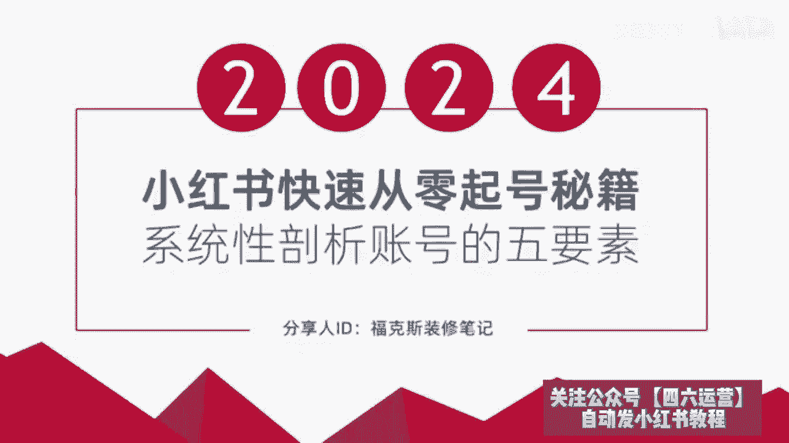

所以这是第一个学习目标。第二学习目标呢就是你们通过今天的学习之后，对账号有自己的一个判断思路。第三个呢就是能够感受出不同账号，不同维度的一个水平差异，以及最后你们能够明确自己现有的一个运营优势。

在接下来的创作过程中去发光发亮。

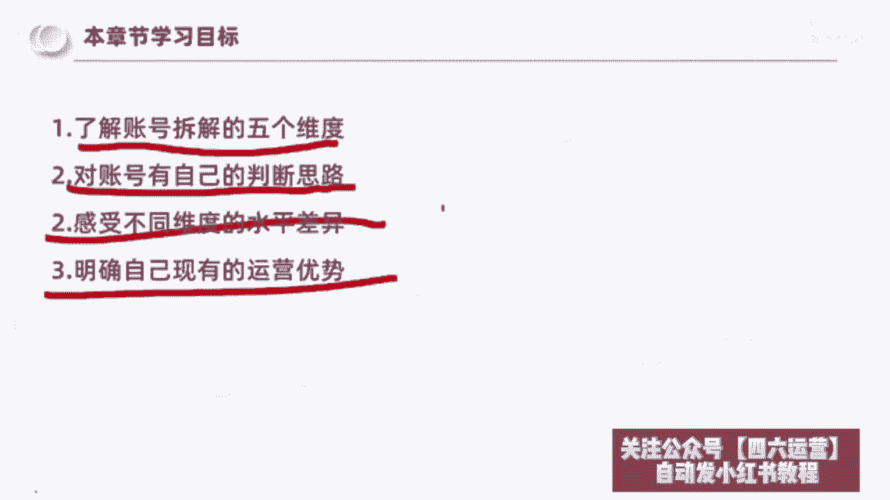

那么首先我们直接进入第一个章节，就是如何拆解一个账号。

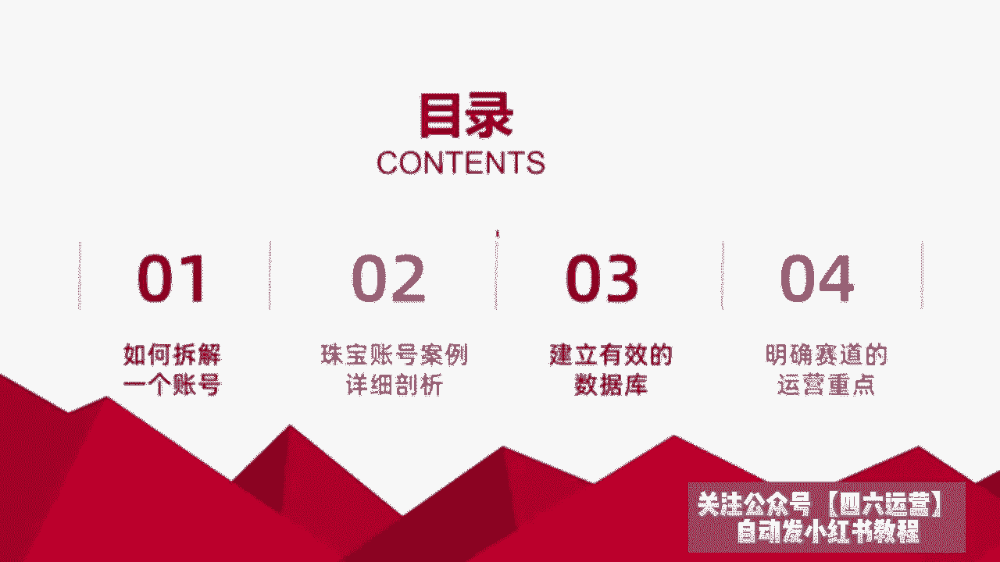

我们要知道一点，就是拆解账号是为了汲取经验。也就是说什么？它其实是拿到结果的一个关键动作啊，大部分的情况下，我们讲找对标拆爆款，你能不能把账号拆明白啊，决定了你拿到结果的一个速度和效率。

如果说你看不懂别人优秀的账号怎么做的那基本上的话你很难及时拿到一个结果啊，包括很多人他就发笔记，对吧？几十个小眼睛，一直几十个小眼睛，其实就是他压根就没看懂你账号怎么做起来的。所以说整个拆解的过程中呢。

我们就是可以从竞品账号中呢去博采重裁，汲取他们的有效经验。那么拆解账号之前呢，我想先跟大家梳理一下，我们去做小红书的账号，它有哪一些变现的策略。首先啊内容创作常见的变现形式有哪些呢？大家能够想到的对吧？

比如说我们有电商带货，我们可以通过挂链去去卖产品。第二个我们可以接广告。第三个呢，我们可以引流到思域去做成交。第四个呢我们还可以通过一些平台的奖励政策去变现。那么不同的变现形式，它有什么区别。

究竟在赚谁的钱，我们来看几个案例。第一个案例，我们来看一下叫哇塞小毛，它呢就是发的这个在马路斑马线上拍的这个饰频的一个笔记啊，发了很多，然后我们来看一下这个能不能点击啊。🎼大家声音应该也能听到啊。

它就是很简单的一个产品的展示，去把这个账号做起来，这是第一个账号。第二个账号我们来看一下，那么他发的是一个银质的一个视频，95银卖价290，然后点赞收藏啊，评论啊，包括有一些数据。

那我们可以看到在这个购物车呢售价290啊，已售的数量呢账号也是290，这是第二个账号。那么第三个账号我们看一下它是一个很精致的一个手，然后展示了一个链子。

然后就讲到了它怎么样去用低成本的方式去在冬天保护自己的一个手。然后这边是妮维雅的一个链接。对于四个账号，那么他呢是一个将要旅行的一个账号啊，但是我们可以发现，就是说他呢有一些这个活动啊。

就是说他其实发的内容是根据平台的活动来的。所以这四个账号我们再拉到一起对比的话，我想跟大家说一个什么事情呢？就是其实我们每一个人包括来直播间的每一个小伙伴们，你们挣钱来方是不同的。

你们跟赚取钱人的身份和关系是不同的。那么第一个账号他卖的是19。8块的饰品，他其实在赚取的钱，他赚的是陌生人的钱，对吧？我们买1个19。8块的一个东西，不需要说我有多喜欢你，我有多信任你吧。

是不是只要我喜欢就会买。而第二个账号他把银饰卖到290块钱，有没有人知道这个290的银饰，它的毛利润有多少，你能猜一下。这款290的银饰，你们猜一下毛利有多少，34是56是7080的。猜一下。

我告诉大家啊，这个银饰的毛利应该有50到70，50到70的毛利一般是有60到70。那这种账号你能赚到陌生的钱吗？不太容易啊，因为这个款它只要一爆，就有很多人去超去返。所以如果你要找便宜的，一定能找得到。

但是还是会有290个人去愿意买，花290去买一个这个产品。那么他其实赚的谁的钱赚的是粉丝的钱。🎼那么第三个是吧，我们很明显的知道啊，这是一个品牌国际品牌。所以呢它赚的是品牌方的钱。那么第四个账号哈。

它是100多万的粉丝，流量很大，所以它其实可以做一些平台的活动去赚平台方的钱。所以说拆账号前，其实我们先要思考它的账号是用什么样的一个变现策略，为什么？因为每个账号，它赚钱的收益来源是不同的。

也就决定了它账号的运营侧重点是不同的。那我们能够怎么去分类呢。所以说如何去拆解一个账号。这里啊，我直接是从5个维度进行了一个拆解。因为大家的都是有基础的，所以我呢就会讲的快一点。

如果说你们觉得有点跟不善，你们就在评论区告诉我说，咱们放慢一点，好不好？这个就是我去拆解一个账号，我自己总结梳理出来的5个方向。但是我们会发现这5个方向，不管是内容能力，流量能力。

行业深度运营思路还是营销能力，它都围绕着。中心中心是什么？是他这个账号的账号定位。那我们来分别拆解一下这5个维度对应的一些能力。那么在尖尖上面，它对应的能力是什么？是内容创作能力。

那在我们小时候语文考试的时候，命题作文其实就已经能够初步体现我们的内容创作能力，对不对？因为命题作文，我们语文考试最后大家所看到的题目是一样的。比如说我们今天讲五一啊。

我的五一是怎么过的那我们往往都能够在90分的考试时间内把作文写出来，而且大于等于800字，是不是？所以我们在那个时候就已经能够感知出是否自己有快速理清故事结构，写出高分卷的能力。如果说你有的话。

那你其实是有一个创作天赋的那这个时候可能有的小伙伴就想了，那付老师我语文成绩不好那怎么办？告诉大家没关系，为什么？因为我们在内容平台进行创作。跟我们B卷考试不同，它是开卷的。

所以我们如果掌握了借鉴的技巧，这个创作难度就会降低很多很多。所以在内容能力这一块，那我们再去拆解一下。我把内容创作能力这里啊我还细分了啊5个能力。对应的。比如说目标客群的匹配度。

那比如说我们今天要做一个账号，是吸引想做小红书的人，那比如说像我对吧？我不教小白不交宝妈，不交副业，对吧？我是愿意帮助真正能够在小红书有机会赚到钱的人去提升能力，然后把大家吸引到这里来。

大家一起去交流去成长。那么如果说我的目的是不吸引小白，对不对？是吸引真正专业的人，有能力的人优秀的人，那我吸引的人都是一些小白来说大哥带在我，那这个目标客群是不是就不匹配，对吧？那同样的。

比如说我们卖的这个视频是高端视频是一万的客单，但是你的客户都是吸引的预算都是有几百个客户，所以他就目标客群不匹配，这个是内容创作能力。那第二个呢就是你的内容获客效果，这句话怎么理解啊。

我给大家觉得很实在的。就是有一个有一个客户，有一个客户，他是做那个在澳大利亚做工程机械的。那么像这种产品啊，它其实是会分前中后。举个例子，什么叫前中后呢？就是按照用户的购买时间。比如说你去思考一下啊。

就是比如说某某某挖掘机如何就是说如何这个如何涂机油。🎼那你觉得这样的内容是用户在购买前会去看的，还是说他已经是购买后才会去看这些东西。那对应的对吧？比如说像装修，对吧？

比如说我们去研究这个比如说我们汽车行业吧，比如说汽车行业可能跟大家接近一点，就比如说保时捷的车内保时捷的这些按钮对应是什么样的一个功能。那这样的一篇笔记是准备买保时捷的人会去看，还是说已经买了保时捷的。

他才去看，因为仪表盘那么多按键，对不对？每个按键对应什么功能啊，以及这个保时捷的一些使用小技巧，这些东西是不是他购买后才会去看的？所以那这个东西跟内容获客效果有什么区别呢？

就是如果说你的目标是在小红书上获取准备购车的用户，那么你去发你就一定要意识到你这个内容性的是准备购车的，还是已经购车的。那准备购车的用户什么样的内容能吸引他？比如说比如说假设它是一个。🎼长沙的用户对吧？

我在长沙啊，那湖南新能源汽车购贴补贴，那最新的一个5月购车补贴力度很大。哎，那你如果想购车，你时候就对这个东西感兴趣了。所以有一些内容是能够获取到意向客户的。有一些其实是已经消费完的客户。

所以这里要考虑到内容的获客效果。不是说你吸引到啊对汽车感兴趣的，这个就叫获客了。那同样的我们再去判定一个账号的内容创作能力的时候，还要去看它的一个内容制作形式，对吧？它是图片还是视频还是Vlog啊。

还是life夫的一个动图，还要我们去评估它的一个内容制作成本，有的制作成本很低，可能合下来10块钱一条视频一张图文啊，有的一看这条视频制作周期至少是跨了一个月。

可能时间成本各方面加起来大几千甚至有的视频可以做到几万块钱。同样的还涉及到你的一个内容选题方向。那么这是内容创作能力上面。那么第二个就是流量获取能力。什么叫流量获取能力呢？第一个我们讲获取的叫泛流量。

对不对？那么第二个我们讲的就是一个精准流量啊，精准流量。那么刚刚啊其实也就讲到了，就是你能不能获取到准备，对吧？沿着你的消费节点。准备购车的一个用户和准备搞装修的一个用户，这个才叫精准流量。

同样的啊什么是半流量。这个大家比较容易理解。那流量获取能力对应的啊，其实还有什么？还有会跟标题相关啊，它的标题它的封面，它的选题的运营其实都会相关啊，那么第三个能力什么？是营销心智能力。

特别是做高客单的，一定要对这个能力有很充分的理解，那营销心智能力，这里我觉得啊它有两个建立，第一个叫认可度的建立，第二个叫信任度的建立，什么叫认可度，就是你是否专业，比如说你们今天在听我的分享，对吧？

你们会对我福克斯有一个标签啊，比如说0到100分，那我的专业程度，你们认为有多少分，对吧？6070290啊，这是一个行业的认可度。但是当你们认可我之后。他等于信任嘛，他不等于信任，为什么？

因为有一些人他可能也有能力，但是他的变现形式或者说变现方法其实是呃比较不韭菜的。所以说那我们还涉及到一个什么，就是信任度的建立。那0到100分，对吧？你们对我的信任度有几分。

所以我们去做高客单的消费的时候，比如说我要去买一辆车，一辆二手车。那我通过这个视频去看这个账号，我觉得他非常了解这个行业啊，非常知道怎么去看一辆车。但是我觉得这个商家他偷奸耍滑，就他的言语之中。

或者说他的表情，就是让我觉得他是一个尖商。那这种情况下，我们会愿意找他去加微信，去他那里买车嘛，是不是不会？所以营销性智，有两个，第一个是要建立用户对你的认可度，第二个是要建立用户对你的信任度。

那么除此之外，还涉及到一个很重要的事情就是产品卖点的可视。化和产品卖点的可信度。那么这里呢我在建材行业有一个案例啊，有一个商家案例，他做的事情什么呢？就是同样是装地暖。那它的能耗使用下来是会比别人低的。

比如说在长沙地区，可能如果你普通装业套地暖，一个季度3个月使用下来的费用可能是50006000块钱。但是它可以做到3000块钱以内啊，就正常100多平的房子。那么问题来了，你是这么说的。

但是现在消费者对于商家而言，他天生有信任度吗？他其实天生是带着质疑去沟通的那这个时候我们已经有了这个产品的卖点，对吧？就是这个卖点就是同样是装地暖，它的能耗比别人低。但是这一句话是打不动用户的。

我们如何让用户信的，就涉及到你要把这个卖点的可视化和可信度。那么这里大家思考一下，如果今天你们面临的是这样一个商家，你们会怎么去解决这两个问题。那我再给大家讲一下什么样的一个商家背景啊。

就是在湖南长沙有一个商家啊，他是做暖气地暖的。然后呢，大部分同行一个冬天使用下来的暖气费用呢是5000到600，就是一个月大概2000块钱，而它可以把费用做到1000块钱以内，一个冬天就3000块钱。

它的使用费用比同行低。那么基于这个卖点，我们怎么样去把它可视化和监立可信度呢？你们思考一下，我喝口水啊，我给大家讲解一下啊，给大给你们看一下呃，我是怎么去做的？

因为我们讲的是一个月的费用能够控制在差不多1000块钱以内，对不对？我既要解决可视化，又要解决可信度。那么接下来我给你们看的这个素材呃，就是基本上这一条素材帮这个删掉的成交率。

就客户成交率至少是提升了20%。那么这条素材是什么？就是我选取了一户房间。然后呢，充了1000块钱燃气啊，大家其实可以看到就是我箭头的这个位置，左上角这张图，它的燃气值是33初始值是3。

那么这个燃气表充了多少钱呢？充了1000块钱的费用，所以我就让这个燃气表一直跑，对吧？就我把电暖开起来。然后我们看1000块钱花完之后过了多少天。你只充了1000块钱，是不是意味着他画完这个表就停了。

好，那为了我们去增加它的可信度，对不对？因为用户可能会质疑啊，那你这个燃气我怎么知道你开了没开呀，对吧？我怎么知道你这个是不是有的房间开了，有的房间没开。

所以呢我就把各个房间客餐厅、书房、主卧儿童房和衣帽间都架了摄像头，而且我是就是24小时每一秒都记录了，连系记录了35天，而且为了防止他们去质疑说啊，你你是开了部分房间有的没开。

所以你会发现每一个这个画面中，我都有一个这个燃气啊，都有一个这个温度仪来向你证明啊这个燃气其实它是在一直开着一直使用的。所以包括你们可以看到在视频变化的过程中，它是不是有黑天和白夜的一个交错。

那么这个时候你们作为一个用户。对吧我让你看到了这样的一个视频和数据。并且我告诉你说，这一个视频你如果有质疑的话，每一天我都可以调24小时的录像给你看啊。你要看任何一天，任何一秒，我调给你。

我想问一下大家能不能解决用户的质疑，回答用户的质疑啊。事实上，没有用户，他要去看这个调这个录像。那我是不是解决了卖点的可视化和卖点的可信度？我充分站在用户不信任的情况下，找出了更多证明的方法。好。

那接着又涉及到了一个什么营销流程。我告诉大家，这样一条视频，这样一个素材，对吧？我们花了一个月的时间做做拍摄，又花了将近呃一个星期的时间做压缩，对吧？压缩到5分钟。我想问一下大家。

我应不应该发在小红书上面，你们思考一下。如果你是商家，你用了一个这么牛逼的素材，你发不发小红书，你们可能会发啊。但是我告诉大家啊，这条素材至今是没有发到小红书上面的。为什么啊？

因为我们涉及到一个营销流程。因为这条视频对于用户的震撼是很强的。所以我需要的是在账号过程中啊，像这种实体商家成交。在账号过程中，我只需要让他做到对商家有意愿有好感，愿意加到微信上面来，然后通过微信到店。

他做到店铺里再去看到这样一条视频的时候，是不是这种震撼感和冲击感就来了。那这个时候我们再去谈谈和签单，是不是属于他对一个好感度提速，对商家好感度急速拉升的时候去签单。反之。

如果说我把这条视频直接发布到小红书上面，他看到的时候，他也会觉得很牛逼。但是他加到微信之后，到店之后，他没有这种震撼感啊，他没有这种强烈的认可度加分了，那么当场签单的这种意愿。

是不是就不如前面的那种做法，这有点像什么？有点像我们去旅游的时候，比如我跟你说啊极光很好看，那么是我告诉你极观很好看，但是你没有看过实物，然后你到了北极，你看到了极关，那个时候你是很震撼的。

但是如果我提前啊我作为一个导游，我把极关的视频发给你看。我说兄弟，你看这个极关多好看啊，我们明天晚上去看极关。然后你第二天晚上你看到的极关和这视频一样，你是不是就没有那种很惊喜的感觉了啊。

它是一个的道理。所以我说营销心智的能力，还涉及到营销流程的设计。还涉及到什么选题方向，因为不同的选题对用户的一个感受是不同的。那么接着我们讲第三个第四个维度啊，就是行业钻研的深度。

有些东西它其实是一个表层的理解。比如说我们讲小红书啊，有人说我们要淘宝款，我们要拆解账号，是不是？这就是行业的一个表层。那么深层的理解。像我刚刚跟你们讲，我怎么样去帮一个实体商家拉伸。

吸引金融客户去拉伸用户签单的一个认可度，那么你们是不是能够感受到这种深层的理解，对营销深层的一个理解，对用户深层的理解。所以这就是行业端业的深度不同，它就会有不同的体现。以及什么？

你不同对行业的深度理解不同。你的产品的优化也会不同啊。如果你越了解产品，你就越能够越了解这个行业越了解用户，你就能够优化产品，我举一个很实在的例子，以前我们的厨房啊，我告诉大家是60厘米深啊。

60厘米深，冰箱是多少呢？冰箱是65厘米。所以一般大部分老房子家里的冰箱是比厨房的。要突出来的。但是在23年，美的推出了一款叫这个超薄冰箱，它就是解决这个问题，就是冰箱和橱柜能够在同一平面上了。

那么这个其实就是要对用户和行业有理解啊，你就会优化反下来优化你的产品。同样的，基于行业深度的不同，你还能够去优化你的成交流程啊。行业深度的理解不同。

也会直接对你这个对你这个行业的客户心理的理解也是不同的啊，这里就不跟大家去具体展开。那再回到最后一个板块，我们去拆解账号，还涉及到什么？就是账号的一个运营思路啊，运营思路。第一。

你能看到它的多少运营细节。第二，它的变现模式啊，你能不能推演出来，它用的是什么样的变现模式。第三，他获客的钩子是什么啊？比如说最常见的钩子，我们讲叫直钩，什么叫直钩啊，就是我有什么什么资料啊。

然后你加我可以领资料，这个叫直钩，那对应的还有什么办法，就是我通过内容去，让你认可我啊，我不翻任何的资料，我就是让你觉得我牛逼啊，我专业，我值得信任，你自然而然想加我，那对应的他的这个能力是不同的啊。

或者肯定是更强的。包括啊账号运营水平的一个判断。所以你们会发现啊整个账号，我们如果。

要去做系统拆解的话，是可以拆到这五个方向的。那么接着我们进实操啊，我们来看一下珠宝账号的一个案例的详细布习。

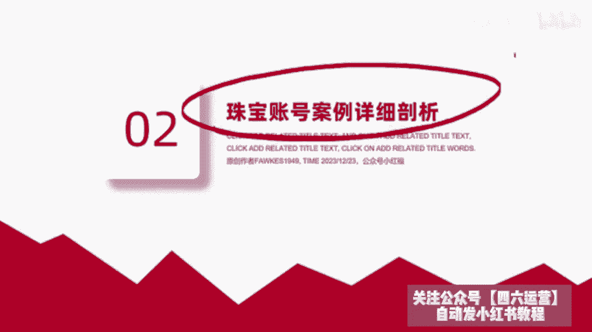

首先我想问大家一个问题啊，在做账号财礼前的一个思考。一年内的新账号与三年内的老账号有什么区别？这个问题其实之前也跟大家提到过这个知识点，就我们去拆解一年内的新账号和三年的老账号有什么区别？就是老账号。

它其实早几年运营的过程中，它是有平台红利存在的，过早的一些获取流量的方式，获取客户的方式。其实它可能当下已经失效了。比如说他们去搞这些红黑板啊，做美妆的，想要弄一些红黑板啊。

把一些自己要卖的品牌和知名的品牌翻到红版，然后再翻一份黑板啊，这个东西可能在两三年前是有效的。但是到今天没效了。两个原因。第一，平台打压这种笔记拉财的笔记。第二，用户他看作麻木了。

他知道你在你在这么去套路它啊。所以说老账号它有一些这个方法是失效的。而新账号意味着什么？新账号能够快速做起来，意味着他获取流量和客户的方法是单向有效的。所以这是大家在拆解账号中候尤其要注意的。

很多我感觉我跟你们说，30%的人会犯这个错误，就是给我看对标账号一看，我就看这种已经5万粉10万粉做了好几年的账号了。那凡是你把它作为你唯一的研究账号的时候，那你真的是会有点惨啊，这种老账号可以研究。

可以学习，但不能只研究他这种老账号，他有些办法是失效的。那我问一下大家啊，我不说珠宝人，就是基于你们现在在做的赛道，或者说你未来想做的赛道，我刚刚讲的5种能力，你觉得你应该着重关注这个账号的什么能力？

在评论区告诉我好吧，你们现在在做的赛道，或者说你即将想做的账号，赛道这5个能力，你觉得你最应该关注哪个能力？觉得是内容创作的能力打内容，觉得是流量获取能力打流量，觉得是营销新的能力打营销。

觉得是行业钻研深度，就打行业，觉得是账号运营思路的大运营。还有人问没有对标账号怎么做啊，没有对标账号就做不起来。我开了我开个空调，有点热，没有对标账号就没法做，你就会走很多的弯路啊。

大部分人认为是运营的能力啊，O那我接着往后去看。来先看第一个账号啊，先看第一个账号，运营思路是吧？好，那今天到最后给大家补一下运营思路的东西。第一个我们来看一下这个账号叫可燃冰啊，它是一个手啊。

这个手是不是很漂亮。

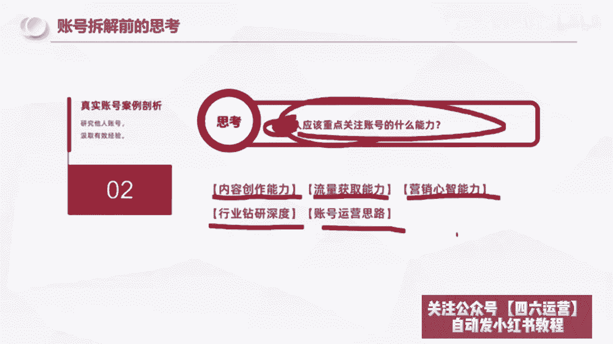

那我问一下大家，这个账号的优势在哪里？你们在脑子里想一下吧，就是这个账号是怎么做起来的，我来看一下他的笔记啊，尝试一下心中是今天的手打几分啊，下面是平安扣，他的评论趋势哇，下面好好看，求什么牌子啊，问。

可以换你个手吗？啊，好喜欢姐姐的手，姐姐可以多拍点手的姿势，让我画画做参考嘛？啊，太绝了，我好喜欢。这个账号的优势是什么能力？优势是什么优势？是流量获取的能力，对不对？它通过手能够获取到流量。

但是它的流量是什么？是放流量，是不是？所以这个账号的优势是流量获取的能力。通过手那么这个账号呢，我们来看一下这个账号是23年9月开始运营的。然后在他23篇笔记的时候，他就做到了6000粉丝啊。

然后这个数据我们来看一下啊，一开始其实也就是几十个赞啊，但是后面它基本上稳定到了小几百来看一下它的一个笔记详情，就是它设计的一款小戒指啊，一个平安扣加开口借圈。然后这个笔记的评论区呢。

他置顶了这么一条评论，就是感谢大家喜欢啊，一直以为水瓶座喜欢的东西很天马行空。但没想到这个设计居然这么多姐妹都喜欢啊，我已经在找料子了。如果遇到合适的，我会再做这个款式。但是我没办法预知时间和品质。

如果啊大家能够有耐心的话，喜欢的话，你可以在评论区啊，可以等一等我，然后这个评论区就是墩墩啊，墩墩蹲墩蹲。我想问一下大家。这个账号看到这个的时候，有没有似曾相似的运营手法？

我当时是不是有一篇就是洗红套装的笔记告诉大家，我觉得未来双双十一之后会出一款性价比很高的这个喜红套装啊，然后就有很多人在那边蹲，他是不是一样的。所以这个账号他其实是在运营手法上面啊。

在运营手法上面是有自己的一个理解的？那么再看第三个账号，这个账号啊，它是干什么的呢？它是做这个一个很有个性的设计啊，我们来看一下，你会发现这个手镯它是不是玉加黄金啊，我们看这张图更清晰，就黄金家玉啊。

黄金家玉，它其实是一个什么逻辑啊，他不是说他把产品设计成这样的。他是有一些用户，他可能在佩戴手镯的过程中不小心把手镯摔碎了。那么这个时候是不是就不能戴了，而且很可惜。

但是有一些手镯其实它是很有纪念意义的，可能是妈妈送的，可能是外婆送的很珍贵啊，那他就思考到这个用户。痛点。然后呢，他通过3D工艺把这种摔碎的手镯跟金精饰做结合，然后帮你做一个手作恢复。听到这里的时候。

你们有没有觉得他这个设计和想法非常的棒。如果说咱们有一个真正很心疼的镯子摔碎了，用这样的收复方式，大家愿不愿意接受，是不是愿意？所以这个账号它其实从22年12月才开始勤更新的啊。

然后24篇笔记也涨了1600多个粉丝。但是我们会发现什么？我们会发现他是懂什么的，他是懂用户的，他是懂用户的，他发现一个很小的一个细分需求。那我们再看一下这篇笔记是22年12月份的一个笔记。

讲的就是玉镯修复啊，那么这篇笔记有一个什么特点呢？就是我们会发现他的评论区从23年1月1号的客户到23年9月啊，这个可是22年发的一个笔记啊，那我们会发现什么？就是其实哪怕你是一个超细分的赛道需求。

平台都能够给你匹配精准的客户。我们来看这个账号叫miss晶静。那这个账号呢，它是23年5月开始运营的111篇笔记做到了4000多的粉丝。我们来看一下它是一个偏什么的，它是一个偏搭配形式。

是不是他的签名是S啊，然后处理人，好物分享家珠宝经定师。我们来看一下他的一个笔记，他这里呢放了放了几款啊配饰。然后呢，他在问啊，就是如果是你来配长裙，你会选择哪一组搭配。然后评论区就是当然是图三绝美啊。

然后怎么卖啊？然后图二图二啊，图三询价。那我想问一下大家啊，你们刚刚那么多人说希望提升运营的这个方法。那么他运营他用这个账号，他这篇笔记用了什么样的运营手法去引导互动啊，是不是求助，对不对？

姐妹们帮我选择一下1234啊，就这个账号。来，我们再来看一下下一个账号啊，我们把它叫做玩版啊，那这个账号呢也是23年9月才开始运营的70篇笔记做了300粉丝。那这个账号其实他最开始的数据啊。

跟大家是很相似的啊，像大家这个账号一开始就是两个点赞，9个点赞，两个点赞，6个点赞啊，非常的相似，大部分人去发笔记，一开始就是这样，那么他是什么时候这个数据开始起来的呢？他是发了这。

这条啊有点蕾丝的一个手链的时候，那么再往后你会发现啊这篇数据。这篇数据这一篇数据，包括它置顶的这个1。7万的点赞的数据，现在的手链做的这么好看，不要命了。他是怎么样把账号做起来的？

他其实是抓到了一个用户喜欢的风格，对不对？蕾丝风格。所以。所以说我们在去拆解一个账号的时候啊，我们要去get到它的点，他到底怎么做起来的。所以像这个账号他其实是没那么懂运营的。

但是他知道我要不断的尝试它的优势在于什么？在于他有一条数据相对突出的时候，64个点的时候，他捕捉到了用户可能对这种方向感兴趣。然后他不断的尝试啊，然后把这个账号拉起来了。那我再看这个账号。

这个账号是FIORI啊，有没有做珠宝的。我告诉大家这个账号的客单是大几万啊，甚至十几万的客单，应该是我们今天看的账号的给客单最高的。那么它是22年11月开始运营的账号，99篇笔记，3200粉丝。

我们可以看到啊，这个账号，它就是简单的把手和产品的展示出来。然后呢，我们再看一下它这个一篇笔记啊。比如说这篇笔记拍卖级的品质9克拉的红宝石啊，有烧的缅甸的。但是你会发现啊，这篇笔就是23年4月发布的。

然后23年10月份他告诉大家说这一款已经卖掉了。然后呢，这篇也是一样的啊，一下子又又已售了啊已瘦了。所以基本上他的这个账号可以在。就是说3到6个月的周期把产品卖掉。那他是怎么样去建立专业度与信任度的呢？

大家还记得吧？就是在最开始我跟大家讲过，如果你要做高客单的情况下，是一定要去考虑如何建立专业度和信任度的。但是在这个账号的笔记中啊，我们是不是没有发现什么太多的异常，他就是展示他的珠宝。

而且还mel是不是很神奇？那我们再回到它的主页，我们看一下啊，它这里是顶层审美极致工业主理人F米米雅。那我们看一下米米娅这个账号他发了一些什么内容。咪米娅的这绍，他发的是啊顶层审美极致工业。

美国宝石学院GIA各平台同名啊，咨询还是个这个账号他发的什么东西？就是从2017年开始，他就在分享马尔代夫的一个奢华的生活啊，告诉你，我是一个精致的女性，然后呢，她在220年开始去进修珠宝行业。

他把自己去考取美国宝石学院香港分校的一个学位啊，甚至到后面去从舒富比艺术学院啊，去进修整个的一个成长的过程记录了下来。那么这个时候是不是这个人设就很真实了，对吧？我从17年开始。

我就是一个能够在马尔代夫随便玩的一个人，对吧？去越南去日本玩，我本身就很有钱很有品质。然后你又可以看到我19年，对吧？因为对珠宝的喜好啊，我去进修了这个行业，而且是去的专业的学校，然后再到不同的。

再到舒富比的艺术学院去。二次进修，所以本他这个账号就让你觉得哎这个人他像骗子吗？不像吧，他是不是第一，他是核心的吧，他不是骗子吧，他是真实的人，而且他是有这个成长路线的人。那他专不专业呢？

他的专业度是怎么证明的，是吧？他是通过不同的学习和进修和拿到这种学位来向你们证明的，所以这个账号，他就是通过主理人的一个账号去建立的专业度和信任度。那我们再来看这个账号。

这个账号是今天应该是最牛逼的一个账号。这个账号是叫水晶国度啊，水晶国度它是23年11月开始运营的，22面比例8000粉。为什么我说他牛逼呢？先看数据，2万赞的情况下增加了8000粉，转粉率是多少。

40%，非常恐怖。你们再看一下之前这个账号的转粉率是多少。这个320011。73200，这个转粉率不到20%十几。这个账号呢10%。但是他做到了40%的转粉率。那么这个时候我们就要思考为什么啊。

一旦你们看到这种转粉率特别高的，你们就要去思考为什么它为什么能够比其他的账号更吸引用户关注呢？我们来看一下它的定位是什么，它的定位是宝藏水晶全品类供应链。那他的目标是什么？他的目标是什么？

是卖给想要买水晶的个体嘛？还是说想做水晶生意的商家，他是做B端做批发的，对不对？做商家的，给商家供货的。那我们来看一下他发了哪些内容，他置顶的这篇笔记是全球的水晶工厂，好多海外水晶都来自这里。

还记得我跟你说的吧？怎么去建怎么去建立你的这个可信度怎么去建你的专业度，他通过这么多货柜的这个货柜的一个展示来向你展示我有真实的工厂，我有这么多的产品啊，同样的，他还写了什么内容。你们去思考一下。

如果说你是一个要做水晶的人，要在海外做水晶的人。怎么样去把这个产品卖到7倍以上的价格，你感不感兴趣？我不讲你做水晶吧，哪怕你做服装，我们如何把30块钱的服装卖到200，感不感兴趣？你做教育的对吧？

我如何把300块钱的课程卖到3000，你感不感兴趣？所以他教了人家运营知识，以及什么水晶视频日出500单的英文话术。我要教你话术。如果你要做to C的生意，我把话术也告诉你。

还告诉你英文话术是不是这些商家想看的啊，以及年入年过千万GV的水晶独立站，他用了哪些手法，所以你会发现他的内容是围绕着他的目标用户群体，就是想在海外卖水晶的商家，做全方位的内容输出。

我先是证明我有货源啊。然后我告诉你怎么去做独立站，怎么样去做话术，怎么样去跟客户讲这些能量，把水晶卖出更高的溢价，是不是都是这个客户群感兴趣的话题。所以我说为什么他能够有到40%的转款率。

是因为他非常的了解用户和内容。那我再看这个账号也有点意思啊，这个号叫lady我们把那个lady。他呢是23年1月开始运的账号，掌握了首部的流量密码。其实最开始呢他的这个手是很正常的啊，就正常的一个手。

O给给你们看一下啊。他最开始就是正常的一个人的手，但是呢数流量不咋好。然后呢，当他把手弄成这样的时候。弄成这样的时候，有点像什么，有点像僵尸，是不是它的流量就开始起来了。

所以他后面就把手都弄的跟个僵尸一样。但是你会发现它的流量特别大啊，但是这种流量是半流量还是均准流量？是不是相对泛一点的流量？所以啊然后他还干了一个什么事情呢？就是香港一级圆头珠宝批发商。

然后他有一个明码标价号啊，艾特这个小号。来，我们来看一下他的明码标价号，明码标价号啊，他一个手带三个戒指，一个手带三个戒指。但是你们会发现啊，在他的封面图里面，他并没有去标明这个戒指的价格。

我问一下大家为什么那些希望提升自己运营能力的小伙伴告诉我为什么他一个明码标价的账号，他不去直接在主页去标明这个价格呢？他点进去对不对？如果说一个明码标价号在封面你就已经标了价格了，他觉得他买不起啊。

超过他预算了，他是不是根本就不会点了。所以这个东西就是为了什么？在他的视角就是为了提升点击率，你只有点进去翻后面的页，你才能够看到价格啊。那我们再看这个账号NA的账号啊。

它是00粉丝16000的点赞100的4000啊，分之多少不到30%，但是也2几大于25%啊也很高了，是不是那这个账号呢是23年4月份开始运营的56篇笔记4300粉丝，我们来看一下他的数据。

最开始就是很正常的，跟大家的思场都一样，对吧？我把手拿出来，我把戒止30秒去拍，然后一看惨不忍睹，8个点赞，22个点赞啊，这些点赞有很多，肯定是在他粉丝已经起来之后再拉动的数据。

所以他当时去发这些的时候，其实应该也就是几个赞，但是后来哎当他把这个像这样的时候调成这样的时候，他的数据开始起来了，5960020800对吧？从870，你会发现这过渡从最开始一个非常正常的手。

但是流量不吸引人到他用了一点点。小小的调色或者说色调处理是82个点赞，然后705个点赞。然后他把这个处理加的更强了，然后达到了几百个点赞。所以这个账号真的账号数据优化起来的。

是不是可以理解为他找到了一种变的一种调色模板啊，通过这个调色的模板去把这个账号给相对把数据拉起来啊，其实他有一个小号，他有一个小号叫裸石鉴赏relax这个号。那么在这个号里面呢。

我们会发现啊他的数据都很正常，要很普通，平平无奇。不但四个赞7个赞。那我问一下大家，他为什么要单独开一个裸石鉴赏号呢？喜欢思个怎么运营的小伙伴问一下大家，他为什么要单独开个裸石鉴赏号。

是不是因为因为这种珠宝，他其实是客单相对比较高的，相对一个大的宝石可能三五万啊，甚至超过1万啊，几十万的都有。那么他性的用户并不是都能够消费得起这些运的用户，所以接的客单可能是平均几万块钱。

而这些裸石的客单就会相低一些啊，小几千啊，或者说1万左右。所以他单独开一个裸实的账号，不是为了卖高客单，他是为了向下兼容，向下兼容，提升他这个粉丝的一个成交率。GMV这个账号叫石蓝珠宝，非账好有点特点。

他最开始呢也是啊数据很一般，7个赞10个赞啊。然后他有一天发了个猫猫喵喵啊，喵喵，然后把宝石放在前面，上班的模特又饿又困。然后这一个笔例是多少数据呢是108的点赞。然后呢，他就把猫猫当模特。哎。

90多的点赞，60多点赞100200啊，101000。我想问一下他他是怎么样把流量做起来的？他是不是给这个。产品给一个普通平平无奇的一个产品，找了一个模特，是不是找了一个模特。但是啊我跟你说。

这个账号我后面感觉不对，为什么不对啊？我但你们如果手机看了，你们可能有点吃力。电脑看的话可能清晰一点，就是太好看了，多少钱好好看，好喜欢啊，这个多少钱多少钱。

🎼然后这个这个第二个笔记平论也是好喜欢这个戒指，好美的戒指，太好看了，想拥有啊。第三面笔记也是太好看了，多少钱，这个怎么买好好看啊。第四个笔记下面也是猫猫好好看，戒指，好喜欢问价啊。这个戒指怎么出。

我非常需要。我想问一下大家。当你们看到这些评论的时候，这个账号到底是不是能够精准获克的账号，能还是不能？思考一下，我告诉大家，这个账号有问题啊。当然你们手机屏幕小的情况下，或者说你们横屏的话。

不一定能看到啊。就是我发现这些说好好看，多少钱的账号，它的头像名字都是一样的。这个这个这个是同一个账号，这个这个这个这个是同一个账号，这个这个这个是同一个账号。

就是实际上这些看似都是客户的评论全部都是来自于福建和广东的IP做出来的。所以这个账好两种情况，第一，老板被运营忽悠了。🎼第二种，老板被代运营公司忽悠了，所以这个账号它其实是不能够获取到精准客户的账号。

但是如果你们在研究的过程中，你就仅凭它的评论出现了啊，多少钱好想买这样的批量评论，你认为这个方法是有效的。然后你去按照它的方式去用猫做模特去拍，那恭喜你就被他带到了沟里去了。

所以咱们做账号一定要系统性的拆解，把眼睛看细一点啊。很多时候你们就是说你们的一个成功的速度，真的就是取决于你们对账号拆解和研究的速度，你少走少踩坑，你就走直径。那么第三个我们来讲一下。

就是怎么样去建立有效的一个数据库。因为我们开始讲到有这么多的内容，对不对？有我们要去可以去研究它的内容创作能力，流量获取能力，营销心智能力，还业专优深度以及账号运营速度等等等等啊，这些内容我跟你说。

你们今天肯定消化不完啊，包括我啊也是不断的去梳理，才能够把这些东西给列出来的。所以说你们可以回头反复去看啊，当然了，这个东西也不一定是完全啊最全的啊，它可能还能往下加，可能还能往下加。

那这个东西大家都可以有自己的一个想法啊，但是我觉得大致划分这5个方向是没问题的。那么在我们接着拆解账号的这个过程中呢，我们还是回归到我们要去建自己的一个数据库。啊，因为什么？

因为优秀的账号就可以作为自己的一个对标账号，那我们怎么去做收集和运用的啊，在最开始我跟你们去分享我的内容创作方法论，12字证言的时候，我就讲到过，对吧？找对标拆爆款多尝试要坚持。那么拆爆款这里拆完了。

我们就要建数据库，那数据库怎么去建了啊，这里再跟大家摸索一遍，就是几种方法，第一个方法就是关注10到20个值得学习的对标账号。定期我们去翻看它的账号主页是否有一些报文出现。如果有的话。

剩下的答铁可以跟它做相似，或者说做结合的内容。第二个呢就是说小红书去建立至少3个。

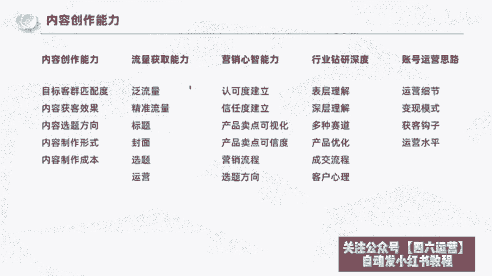

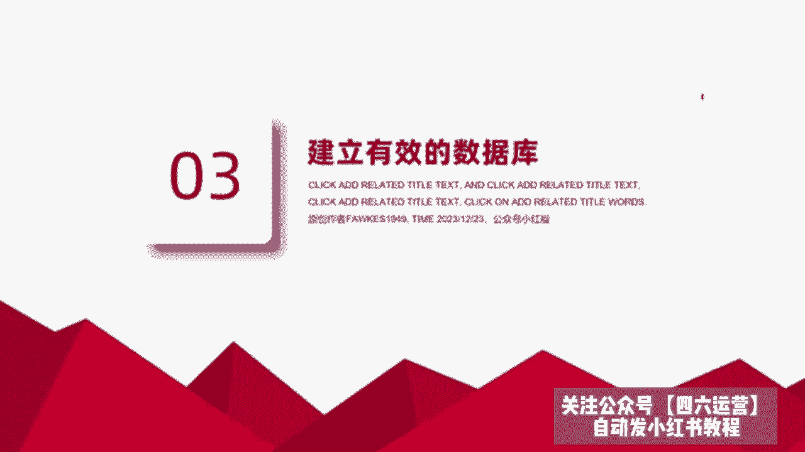

文件夹分别是对应的标题灵感封面样式和选题方向。然后呢，我们将日常刷到的笔记有收获者进行分类和收藏。那么第三个啊就是可能适合团队。比如说你们有一个团队在做这个事情啊，公司的话。

那么你们是可以在小红书的右上角啊去创建一个群聊啊。然后呢，比如说你建立的这个群，就是啊优秀封面分享群。那么大家都可以在这个群里去分享优秀的封面啊。然后这样的话有一个好处，就是未来你的公司招了新的运营。

他进到这个群里，他也是可以看到历史消息的啊，这是一个好处。好，第四个就是大家在做这个账号的过程中啊，要明确自己账号赛到的一个运营重点。

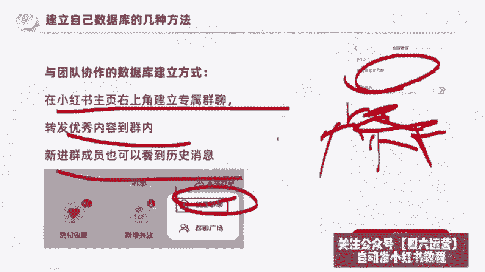

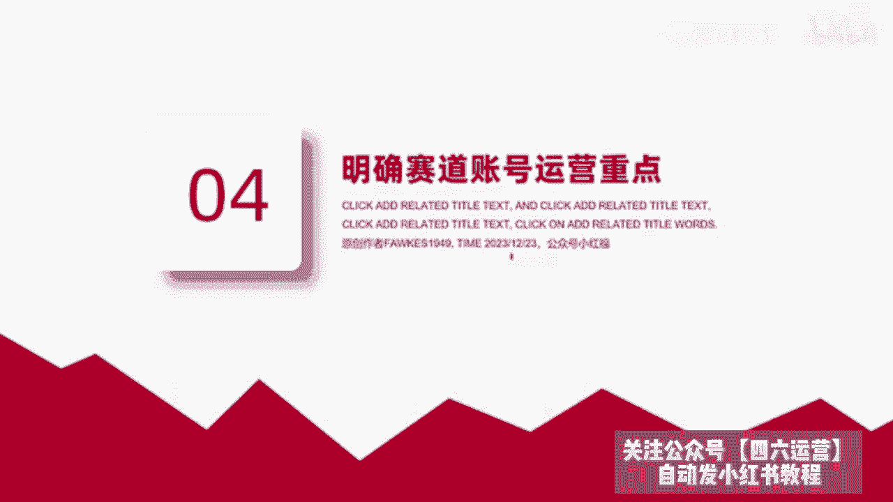

那么我们刚刚所讲到的去拆解账号的5个维度，它围绕的一个中心是什么？这个中心是不是就是账号的定位？那什么是账号定位？其实我觉得也就是五个方向了，就是用什么样的一个表达形式。从什么角度去创作内容。

吸引什么样的客户，卖什么样的产品，跟什么对手竞争。尤其是卖什么样的产品，这一个点，其实我不管你做什么行业，我觉得大概也就是三个方向。要么我们卖的就是高品质的对吧？比如说快递的话，我们对应的就是顺丰。

我贵，对不对？好，要么我们就是性价比啊，那可能中通申通啊，性价比，那什么是价格优，对吧？就是价格最便宜的。比如说极速，你卖珠宝，它是这么分，你卖汽车它也是这么分啊，你卖食品，它也是这么分。

那基本上很多赛道都可以这么分，对吧？包括你去做这种服装的对吧？我做品质的，我的版型好，面料好啊，或者说我是做性价比的啊，或者我的就是便宜啊，它就是三个维度，你擅长的一个还有是什么？你跟什么对手竞争。

竞争难度的一个分析啊。我们去做一个行业，做一个赛道，还是要对对手有一个客观的评估。当你在做调研的时候，你发现每个人都好厉害，那么恐怕这个赛道咱就不太好做啊。因为从筛选项目的逻辑里啊，有一个常识，对吧？

就是很多人告诉你，我们要选。选高客单高毛利，高复购是不是啊？听上去好有道理，客单要高，对吧？比如说一单1万啊，高毛利1万能赚7000啊，完了还能高复购半年买一次。有没有这样的项目啊，有，但是轮得到你嘛？

你能做的最好嘛？所以就是越优秀的项目，里面的人才就越多。所以说你们再去做账号做上账号选择的时候，还是要把你的这个竞争难度做分析。你是全国市场竞争，还是全球市场竞争还是本地市场竞争。这个要去思考的。好。

那我们再回到我们开始看到的一些账号啊，比如说这个大猪小猪。我们在对应它的账号定位，它是用什么样的表达形式，图片对不对？那么他是从什么角度去创作的内容？产品的实拍展示和产品的合体展示。

他吸引什么客户就是小百元的翡翠。所以他看似他做的是翡翠，但是他其实把翡翠饰品化小百啊，不是几千就是小几百就能买到的东西，他卖什么样的产品，就是价格优的饰品，对不对？把翡翠卖到几百块，它跟什么就是竞争。

全国竞争，那他的竞争对手是翡翠吗？仅仅只是翡翠吗？它其实竞争对手是饰品，对不对？那饰品那么多的情况下，它作为一个翡翠的饰品是不是就有它的独特性和差异化了。对啊。

像这个账号我觉得就是说它的内容能力我觉得三颗星，营销能力三颗星，运营思路，五颗星啊，五颗星。行业深度三颗星，流量能力四颗星。所以我们在去做账号研究的时候，其实你可以去就我们所未讲的取长补短。

就是每个账号其实都有值得学习的地方。但是你首先得知道它的优势到底在哪里，比如说你们觉得说自己的短板式运营的思路上面，那我们就去找到一些运营比较好的账号，然后去看他用的哪些手法，不管你是做什么行业。

你引导收藏的，引导点赞的引导评论的，它都是有固定的套路可循的。所以我们可以去做一个收集。那么像这个账号啊，像这个NAR是这个账号，他用什么样的一个形式，图片加视频啊，它是有图片视频的。

从什么角度放到内容，它就是很简单的产品实拍的一个展示，它吸引什么样的客户，一个账号吸引中上品质的财宝，一个账号吸引的是评价裸实的客户卖什么样的产品卖一些国外的奢华款加裸视跟什么对手竞争，跟全国竞争啊。

他卖裸狮的话呢，就是跟其他宝石商人。那么像这个账号。他的内容能力我给三颗星，营销能力两颗星，为什么流量能力四颗星啊，为什么营销能力两颗星？因为我是不是跟大家反复强调过，我们如果做高客单的产品销售。

我们需要建立什么？需要建立我们的用户对我们的认可度，用户对我们的信任度。但是他的账号两个账号都没有。他没有任何一天去建立。就是说用户认可多信任度的笔记。

所以我说他的营销能力是偏弱的那他最强的这个账号体现在哪里？在流量获取能力啊，它通过这种模板化的这种色调的调升方式啊，获取了一个相对稳定的一个流量，是吧？它是这个优势。那么接着这个账号啊。

就是我们看到的最高客单的，能够把几万甚至上十万的保石6个月在小红书上卖掉的。那么它是用什么样的表达形式，图片加视频从什么角度上这种产品实拍，新手么购物中高端在什么产品。

它其实是中高端财宝理论性价比跟什么都有竞争，它其实是全球竞争。因为它本身小红书就有全球的用户，然后他自己的IP就是全国在到处挑的，所以它是全球竞争。那么这个账号牛逼，我觉得在哪？营销能力，对不对？

他通过这个主理人的账号，把他的这种人设认可度和这种专业组给你拉满了。然后呢，他的内容能力啊，四颗星啊，行业深度、流量能力，其实流量能力也没有拉满，对不对？运营思路也没有说呃很多的运营细节。

比如说引导评论啊，引导互动啊这议你都没看到啊，但是他怎么样去立人设建立人认可度的信任度啊，他是很强的。所以说啊再回到这5个点上，就是一个账号，我们是可以去看到它的5种能力的。

每种能力又对应的有很多的子能力。那么你们在创作的过程中，你们缺是什么啊？所以说就是要咱们就要基于自身的产品定位需要重点提升什么能力？如果说你的产品就是卖19。9块的视频，低一客单的，你赚的是陌生的钱。

那么这种这种营销能力啊，它是没那么重要的。你不需要人家对你的认可度？反之啊如果说你做高客单的这个营销能力就比较重要的。那同样的啊，那么你们要重点提升什么能力啊？像刚刚我在问的过程中。

更多的大家讲到的是这个运营的能力。那么你们就去思考对吧？运营有哪些细节啊，它怎么样去提升。

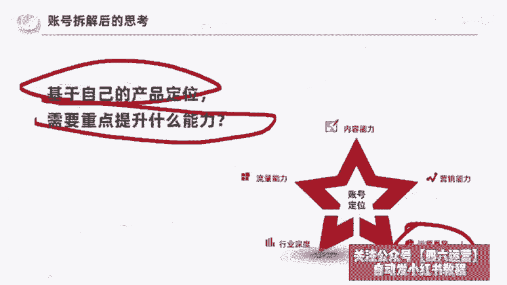

那么今天的分享整题就到这里，那么大家有什么问题可以在评论区我们来沟通。然后呢，我跟大家讲一个产品的一个预热。因为我的志向很明确，我就要做一家咨询公司。但是说在接下来我会去做一个产品，叫做封面标题。

封面标题的一个提升的一个训练营。为什么我要去做这个事情啊？就是为什么我不认可那种4980的东西啊，我要去做这种封面标题的训练营呢？是因为4980的这种陪跑，他看似很信引任，对吧？他告诉你怎么做内容。

他告诉你怎么做思域，他告诉你怎么找供应链的到底怎么产品。但是你觉得4980通过一个月或者两位的实践，你真的能把这些技能学会嘛，真的能够都掌握到自己身上并且赚到钱嘛。其实95%的人是做不到的。

5%的人能做到，他也不是因为通过这门课他做到的是他本身基本能力就很强，这是我个人比较排斥这种4980陪跑的原因。他其实落地性比较差。那为什么我要去做这个封面标题的训练营呢？是因为我在实际操作的过程中。

我知道在小红书的这个平台相同的一篇笔记，我们通过封面的不同的选择，或者说通过标题的优化，提升它的吸心率。这个流量实际上是有可能翻10倍的，这个是真实的案例啊，就是一篇笔记。

它就是可能10个点赞10个收藏，它用的是比如说B做封面，但是用了A做封面之后，它这个流量确确实实翻了10倍啊，这个是有实力的。那么在我自己做福克斯专修笔记这个账案过程中，我也有这样的优化动作。

就是我发了一篇笔记之后，我觉得哎这个数据没有达到我想要的那我换一个封面起来了啊，包括这个事情我干了很多次，很多商家我都给了这样的一个建议。他都看到的效果。所以我觉得封面标题这种专项的训练。

是能够真真正正帮助大家获得流量提升的。所以我想去做这个事情。那么我去做这个事情，我还会做一个什么动作呢？就是我会去简化你们把封面做好的一个难度就是目前市面上有两种做封面的方式，第一种是什么？

就是很多博主，他不是学设计出身的，所以他就会用这种美图秀秀也好，或者说搞定设计也好等等啊，他就教你们用一些简单的图片加一些文字去做封面，这是一类博主啊，这种就是呃手机软件类的博主。

还有一类其实像我这一类的，我是什么？我是因为我是学设计出身的，所以我是会用电脑软件，会用PS的。所以对于我而言，意味着什么？市面上的任何一篇笔记，任何一张封面图，只要我觉得我喜欢。

我一定能百分百把它复刻出来。所以我能做很多你们做不了的封面，相信在你们的过程中，在你们自己创作过程中，你们也遇到这样的问题，就是我可能知道有一些封面，它数据很好，我也能找到它是爆款。但是我做不出来呀。

我只能用这些手机软件去做，所以这里就卡住了，是不是？所以我想通过这个封面标题训练营去把一些爆款的封面或者模板。那么我会做一些PS的模板，就是电脑版的，我已经我会把这些爆款封面，它模板化。

同样的啊也会有一些封面，它通过手机如果能做的，把它手机模板化。所以说我的这个封面标题训练营，我会干什么？大概我目前的设定是这样子的，就是啊21天的一个直播加79天的这个陪伴啊，等于100天的服务。

那么这个100天我干些什么事情呢？首先会有六场的直播课去跟你们讲封面的。一个原理啊，封面标题的拆解，标题的原理和标题的拆解提升。这些讲完之后，第五节课我会教你们怎么样去套这个电脑的模板做模板训练。

第六节课我来讲手机的模板怎么去套怎么去使用，所以基本上就是把封面和标记的原理给你们讲透，方法给你们讲透，再把一些比较好的封面给你们模板化啊，让你们可以创造出超越自己现有能力的一些东西。

那么在这个过程中呢，我还会去做一些什么事情呢？就是会针对你们的行业啊，比如说你们有意向，对吧？你觉得这个事情好像听的很不错，确实是你们单项要用的。那么你们可以加我报名，这个我会限额啊，我大概会限20人。

因为我去做这个事情其实也不是完全奔着赚钱去的。因为这个东西的定价，我大概会定到呃999，就是专门的封面标题训练营定到999。当然如果要定一个原价的话，我觉得可能是1688。那么我想帮这20人干什么事情。

就是做我刚刚所说的，就是提升封面和标题的理解。因为确实像如说他这个封面标题太深了，以及去给你们生产电脑的模板和属机的模板，让你们能够创造出超越现有水平的封面。

也就意味着说我觉得是能够至少是百分之七八十的人都能够看到自己的流量是有提升的啊，这个流量提升好的情况下，比如说我们从500到5000差的情况下，我觉得也可以。

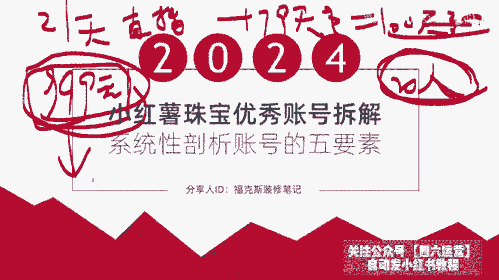

到500到700800或者1000这样的一个提升。因为还有一些方法也会给到你们。但是我想告诉大家啊，我希望是什么样的人，就是我是筛选制的啊，我不是说你有钱你就能来报，我是筛选制的，我要什么样的人。

后不要什么样的人。我要的人是你觉得说哎这个东西它是你需要的对吧？你现在急需提升这个封面和标题能力。你觉得我的运营，我的内容其实都O了。只是说有些封面我就实做不出来啊。第一个，你认可这个学习方向。

第二个呢就是你还是需要自己有这种拆解账案的能力和分析的能力啊，你要自己去有一个优化的意识。那么第三个就是我希望你们明白啊，我们去做的这个是封面标题的专项训练。那么在接下来的79天陪伴当中。

我们围绕着就是封面和标题，到时候我们会有一个小群。但是在这个群里我们就不聊其他的相关的东西啊，我们就围绕着封面标题去了，聊其他的就聊散了，聊乱了啊，这是三个点。那什么样的人呢？

我觉得呃就是说是呃不适合这个训练营的，就是你希望说就是呃随便就是前面的六节直播课，你都不想听，我不想学任何的封面原理，我也不想学任何的标题技巧，我就想着说老师你给我一个模板。

我套了之后流量就直接就能报啊，就能翻别翻翻多少倍啊，这种就是躺着的规范的那这个不适合你啊。因为再好的一个封面模板，他其实也要对应到你们去用，你知道用什么样的标题啊，去调整你的新行词。

所以说这个模板加上我跟你们的逻辑，它是一整套体系的。好吧啊，对会对我还是会我会给你们去布置作业，还会去给你们去做这个你们的作业的一个拆解和优化。当然这个就是部分的作业的优化啊。

它不是说每一个都给你们去做，所以我是很严谨的去做一个训练营。那么这个训练营我希望做到什么程度呢？我希望做到的是全行业的天花板。而且我有信心做到这个天花板，为什么？因为我告诉大家。

在这么多讲小红书的老师里面，真正学设计毕业的没几个人，我是正儿八经学设计毕业的，所以我能够做出任何我看中的封面，而且我能把它模板化，这是我的先天优势，是我从高中开始学美术到四年大学所掌握的知识积累。

这是别人不可能能给你的。所以大部分95%的老师都只能教你去套一些简单的模板，而我能够把这件事做好。所以我希望要做就做到天花板。第二个就是对会教PS但是我教的不是说整个PS你怎么去设计。

而是教你如何用PS去套这个模板，就是比如说我给了一个模板给你，那我会去教会你说怎么去用这个模板，让你能够做出封面，相当于说什么？就是比如说你设计这个模板。我举个例子啊，我举个实际的例子，举个实际的例子。

我们去看小红书的账号。像这种模板。

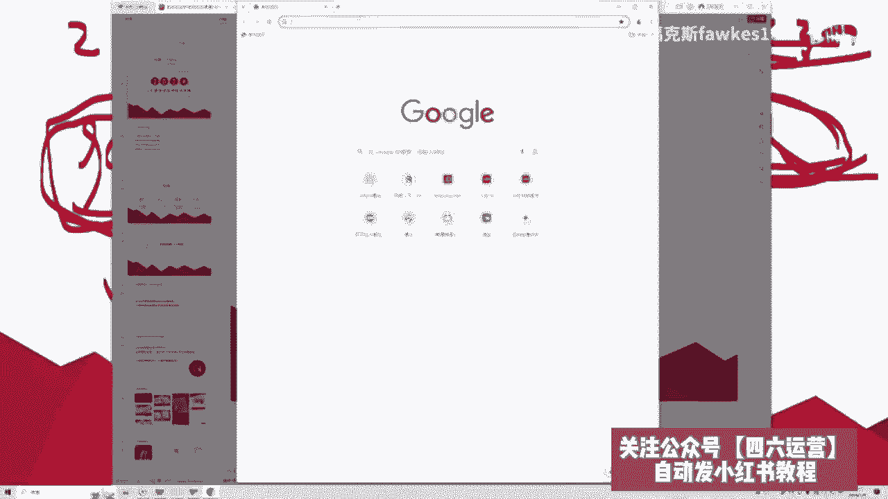

需要我教，对不对？这个就是属于你们自己都能做的，就是直接加盘字。但是像这个是不是你们就有一点难度了。那这个如果我帮你们模板化的话，可能5分钟就出来了。那我再给你们找一个难一点的啊，比如说像这种对不对？

像这种，如果说你要用PS去设计这个模板的话，要多长时间呢？我觉得一个小时是要的。但是我帮你模板化之后，你知道PS的基本原理之后，你有了这些文字之后，你套在导出需要多长呢？10分钟。

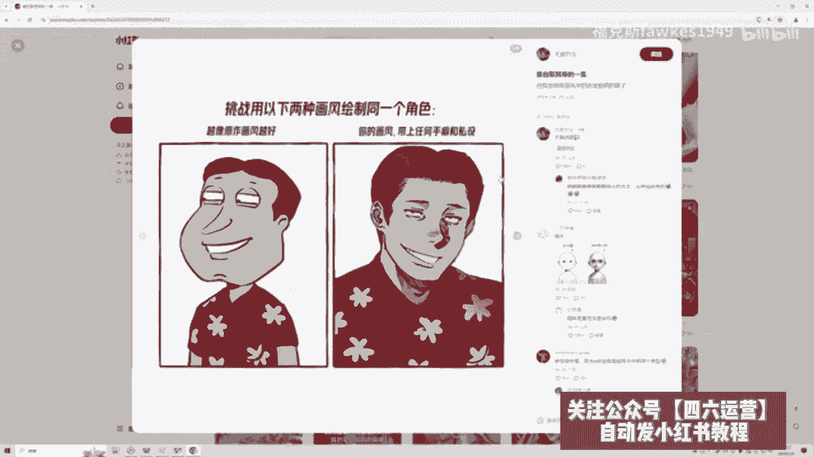

所以就是我是会去帮你们找一些有流量的封面，甚至会针对咱们要做的一个行业，包括像这些封面，是不是它就开始有点难度了。那么我都会基本上就是说你们学会怎么去套它。

基本上就是10到20分钟你们就可以产出这样的封面了啊，像这种封面对吧？可能手机它就没那么好做了。我再给你们看啊，还有什么样的封面，就你们能做的，我肯定不存在去教你们怎么做。

我要做的就是把一些你们做不出来的，简单化，让你们有希望把它做出来。当然了，还有一些配色的原理啊，像这种封面，可能你拿手机它就很难去操作了。但是我们通过简单的PS的使用是可做出来的啊。

像这种封面是不是它其实很吸引用户的。但是你用手机能做出来吗？做不出来。那我们是可以把它模板化的。如果大家就是说确定要来参加这个训练营的，你可以告诉我你做什么行业，我至少会针对你的这个行业。

你可以给我提供三套模板。就如果说你已经在你这个行业找到了三个模板封面，就是模板是很就是数据很OK的，但你做不出来的。我帮你把这个三个模板标准化。在未来的79天这个过程中。

我还会去持续收集一些新增一些封焙模板，给大家去套用整个的这个模板数量。🎼我觉得是会大于等于60套的，就是拥有60套别人做不出来的模板。而且这些模板是有流量数据证明的模板。像这种封面就是属于你用手机去做。

它很难做的。但是其实我如果把你们模板化的话，也是啊20分钟这个封面可以出来，它就看得很清爽。

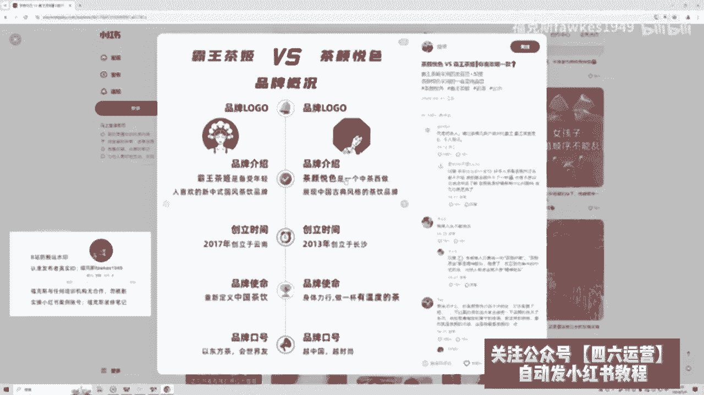

包括还会跟你们讲一些什么东西啊，包括像这种封面也是一样的。也是属于说你们就是手机很难做出来的封面。但是如果你有对应的素材和文字的话，20分钟，这个模板就出来了。所以说我觉得我做的个事情是很有意义的。

就是我不会帮助到那些想躺着就能把流量爆发的人，我会真正帮助到那些想提升的人，而且只要你们真正去稍微把这些基础消化掉。然后我把这些模板给到你们这个数据真的是会见效很快的。你好。

欢迎来到可复制的小红书获克法论的正式课程第一节，接下来我们就开始课程的讲解，这节课我会先从小红书的流量入口开始跟大家讲解，带大家迅速了解小红书平台的推荐机制。

最后再教大家一个快速做出高效引流账号的定位方法，有很多的小红书运营者，在不了解小红书推荐机制以及没有做好账号定位的筹备工作的时候，就开始瞎运营账号，导致账号播放长时间处于坐牢阶段，流量怎么也都起不来。

更别说引流。😊。

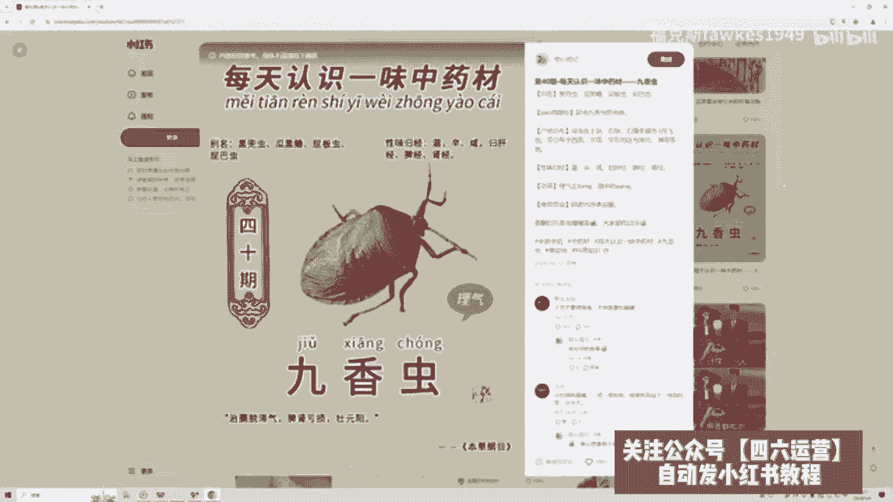

啊账号都起不来。接下来呢我们就从推进机制到账号定位，逐一给你进行讲解，来帮你解决类似的问题。😊，运用这节课所讲的方法，你也可以快速做出一个能够达到高效引流涨粉的账号定位。

同时也能对爆款的影响因素有个深层次的了解。想要通过小红书获取流量。首先我们就得搞清楚小红书的流量入口有哪些哪些流量入口是我们需要重点关注的。进而能够更好的把精力放在能快速见效果的流量入口。

那么在这里的话在左下角我放了一个后台的截图，这是我在7月13号运营的一个账号的笔记爆款数据图。在最下面大家可以看到这批爆款笔记的用户来源分析。从数据上我们可以清晰的看到。

这批笔记有95%的流量来自于首页推荐1%来自于搜索剩下4%来自于其他来源。而这三个流量渠道就是我们在小红书运营中会经常用到的三个渠道。那我们一个一个跟大家讲。首先第一个就是首页推荐。

也是小红书最大的流量入口。首页推荐是有关注页地续页发信页构成。所谓关注页就是用户关注对应的博主之后，博主发送的笔记。😊。

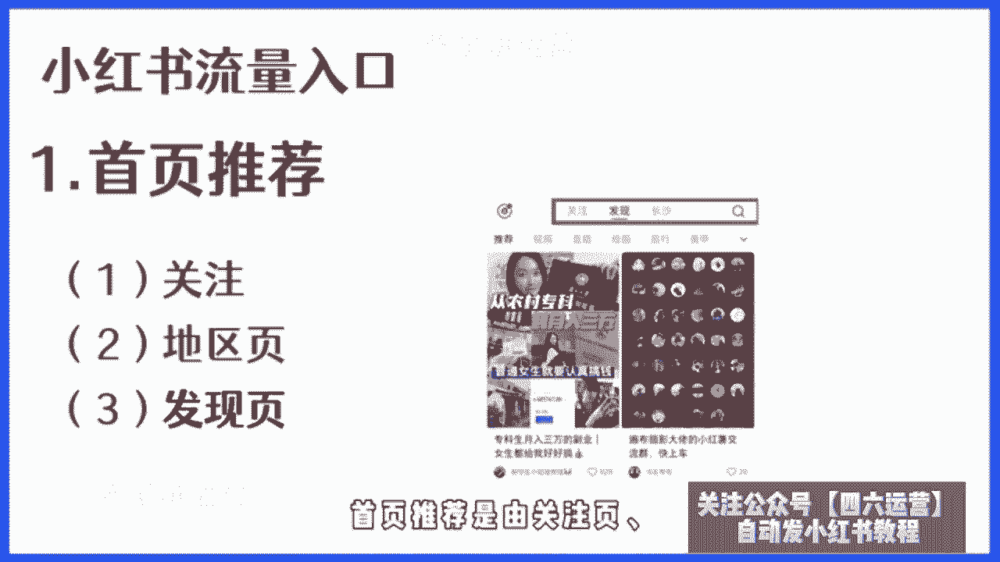

会通过这个入口推荐给用户。而地区页呢顾名思义，就是我们所在的地区系统会根据定位进行同城的推荐。相较于发行页正在引流的角度，其实这两个首页流量入口几乎可以忽略不计。

因为这两个流量入口基本上给我们带来的流量并不多。但是发行页大家一定要重视发行页是所有流量入口里面，占据绝对定位的流量入口。对于一个新号来讲，发行页基本占据百分之百的流量推荐比重。

而小红书的推荐机制也主要针对的是首页的发行页进行的。那比起和抖音不同的是，小红书的页面采用的是双瀑布流，就是大家在这张图上可以看到的，它是左右各一张图的这样一个类似有点像瀑布的这种方式来展现的。

这就意味着当我们的笔记出现在用户的发行页，用户是否会点击消费我们的内容跟我们的标题封面选题有直接的关联。而这一块内容呢在后续的课程里面，我们也会着重的去讲到，除了首页推荐之外，搜索。😊。

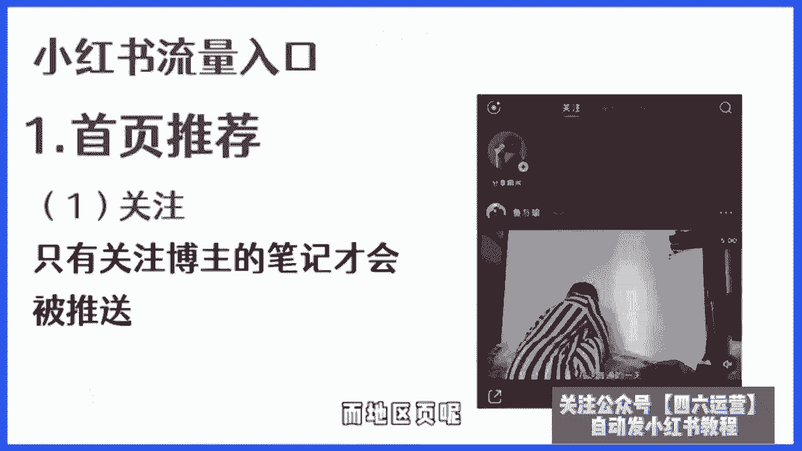

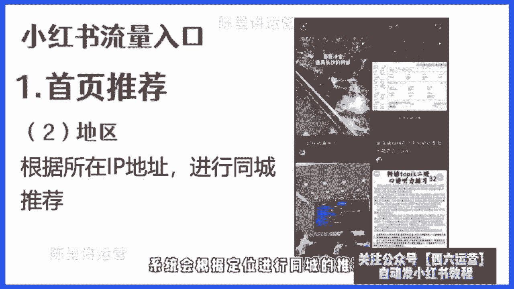

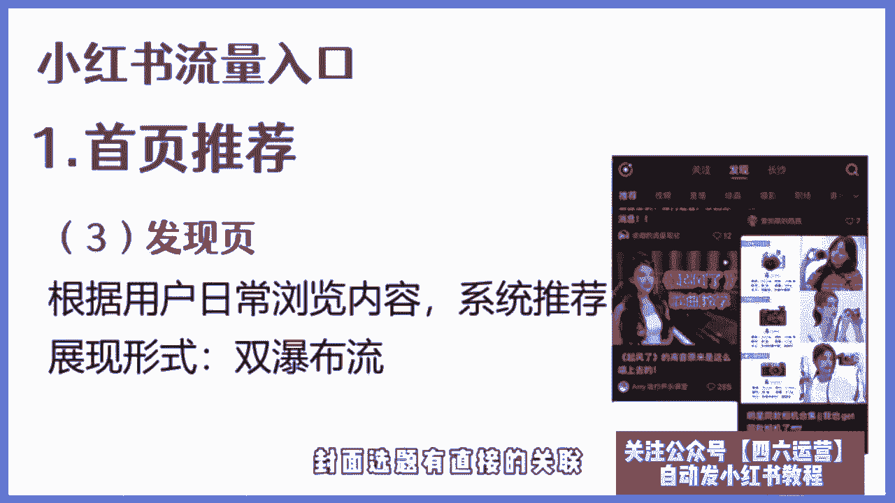

推荐和其他来源占比就比较低了。所谓搜索推荐就是指用户搜索对应的关键词，然后系统会根据内容的匹配和活跃度来进行综合的排序，得出的排名结果。那首页和搜索入口最大的区别是前者主要是系统主动推荐。

而后者是用户主动搜索的结果。除了首页推荐和搜索推荐。那还有一个叫做其他来源。其他来源是指用户分享或者分享链接直接打开的方式，特别是对于一个新号来讲，并不能在短时间让我们获得大量的流量。

所以这块就不重点讲了，后续会针对搜索专门出一个加仓课，教大家如何去优化以及的搜索排名。😊。

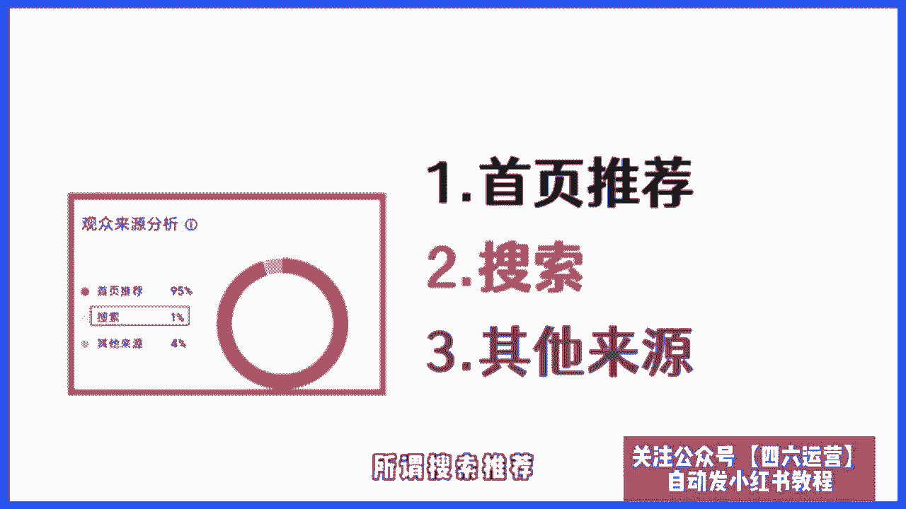

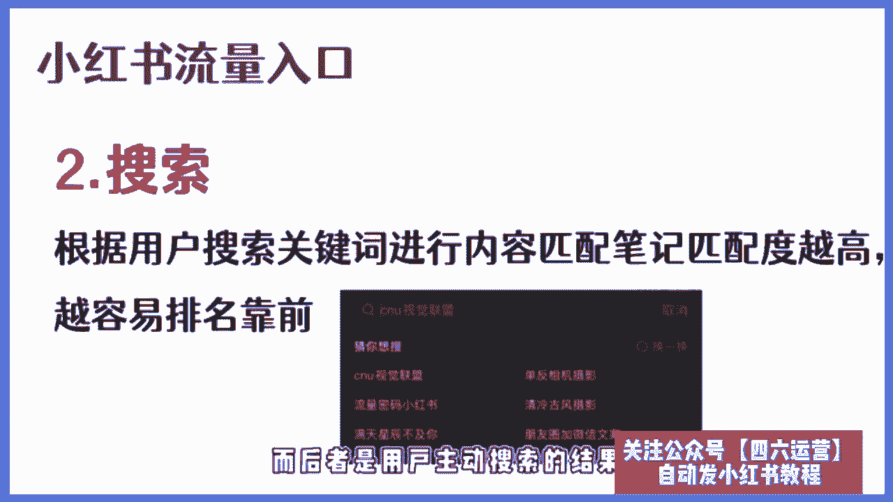

那讲完流量入口之后，接下来我们来讲一下小红书的两大推荐机制，弄清推荐机制，就能清楚的知道E批笔记是如何获得更大曝光的。😊，这两大推荐机制分别是个性化推荐以及关键词搜索推荐。

那我们逐一来给大家详细的去讲一下。所谓个性化推荐，也叫用户喜好推荐，是指用户在正常浏览小红书的过程中产生点击关注评论收藏停留时长搜索的行为，系统会为用户打上对应的喜好标签，会根据用户的喜好标签。

为用户推荐相对应的内容，值得注意的是，每一个人其实身上可能会有多个标签，然后系统会根据大家的行为会为大家自动的去匹配。这也是大家平时在刷小红书的时候，会发现，我你可能单纯的只是为一个笔记点了个赞。

然后呢小红书就会源源不断的推荐相关内容的原因，系统会去评估你喜欢什么，然后会根据你的喜好继续的给你推类似的内容。另外呢大家需要注意，小红书除了用户喜好标签之外，还有一个笔记标签，所谓笔记标签。

是指系统会根据我们发布笔记的标题，封面文案以及内容的匹配，推荐给有对应喜好的标签用户推。😊，推荐给推荐给带有对应喜好标签的用户，通过用户的反馈来评估作品的质量。那我们的推荐机制是如何运转的呢？

在这里的话简单的跟大家去讲一下。

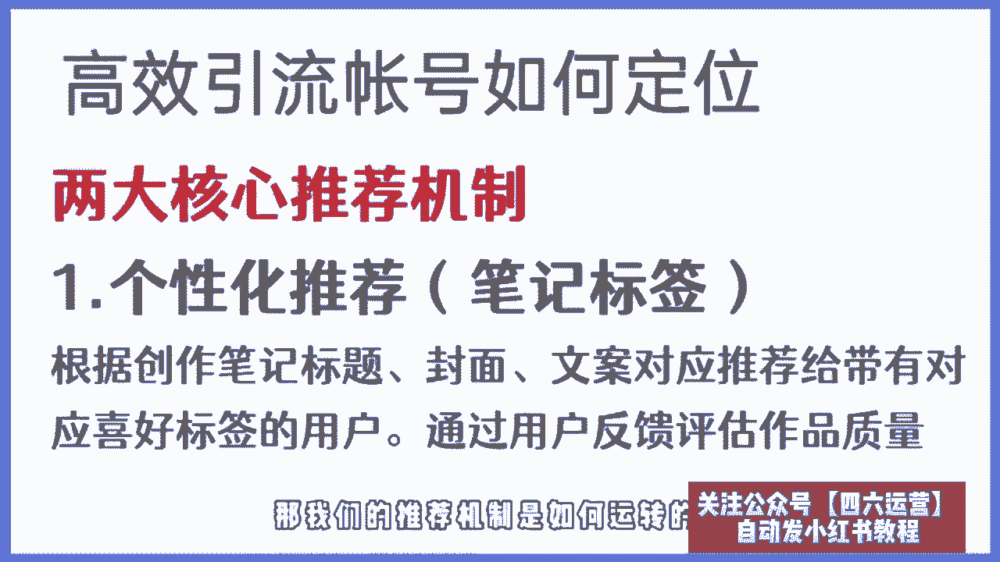

首先当我们发布一批笔记之后，这篇笔记会进入系统审核阶段。笔记审核阶段通过之后呢，系统会在一段时间内会给予100到200的基础播放量。然后根据用户的反馈。

也就是刚才我们提到的用户产色的点击点赞评论搜查提流时长等综合来评估系统会根据用户的反馈评估笔记质量是否O。然后如果说达到了标准就会进入下一个流量时，在这里值得注意的是。

在上面我们提到了当笔记审核通过之后会有个基础推流。那这里的话有一个前提，账号处于正常状态，且发布的笔记没有任何的违规，满足这一条件的账号发布的作品一般会在3到6个小时达到100到200的基础播放量。

当然如果说你的内容质量O内容质量好，可能在20到30分钟就能够很快的突破基础播放量。关于诊断账号是否正常，我会在加仓课里面专门出一节课教大家怎么去通过一些数据情况。

数据展现来评估账号是否会出现限流的情况，互动数据主要的影响因素包括。😊。

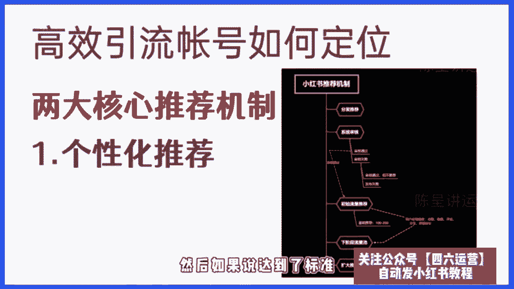

收藏点赞、评论分享。而笔记涨粉的影响因素包括了定位和内容。笔记点击率的影响因素，包括了笔记的标题、选题和封面。当然，上述的几个关键的数据，我们会在后面的课程里面逐步的跟大家讲。

一会呢我们会先讲到定位来跟大家去讲一下如何能够实现高效的笔记涨粉。那我们继续先往下讲。呃，除了刚才这样一个个性化推荐之外，小红说还有一个推荐机制叫做关键词搜索推荐机制。除了个性化推荐之外。

小红说还有一个搜索关键词推荐的机制。所谓搜索关键词指的是根据用户搜索的关键词系统算法，会把对应的内容和相关的笔记进行一个匹配。然后根据然后根据笔记的匹配度账号的自身的权重等等相关的因素。

然后来进行对应的笔记排序。而直接影响笔记排序的主要因素，包括了账号的整体权重，还有单个笔记的权重。因为所涉及的内容，我们会在短期对我们引流获客产生太大的帮。住所以在后续的加车课里面。

我会针对于如何挖掘和优化关键词排名。优化笔记的关键词排名逐一的跟大家去讲。这里的话我们就先简单的讲一下，大家需要了解就可以了。然后另外值得大家注意的是个性化的推荐，它和搜索排名互相独立。

也就意味着可能你的笔记系统推流给你推了非常多的流量。但是呢不代表它就一定会有一个好的排名。因为彼此之间的算法是独立的，讲完流量入口以及流量的推荐机制之后呢，接下来我们就要开始正式的运营一个小数账号了。

那在正式的运营小数账号的第一步呢，我们需要去做一件事情，就是对我们的账号进行定位。账号的定位是什么？简单的来讲就是为我们的账号塑造一个人设，让用户清晰的知道我们是做什么的。那定做定位的好处是什么呢？

做定位有如下三个好处。第一，树立人设体现价值。第二，能够提升用户转粉率。第三个好的定位是自带广告曝光效果的。而这三者都是为我们都是为我们接下来的引流，做铺垫的。那接下来我们就逐一给大家去看一下。

首先好的定位。😊。

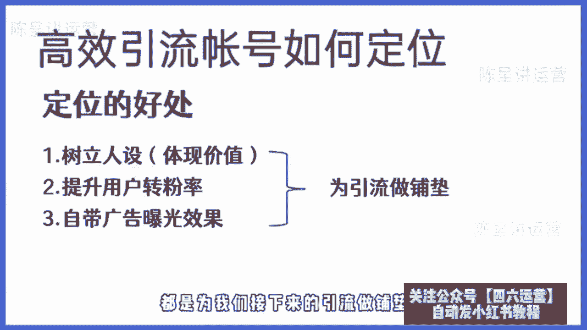

可以塑造人设的。在这里的话，我们准备了三个案例给大家看。通过这三个案例，大家是否能够快速的知道这三个账号分别是做什么的。首先我们根据这三个账号的头像名字和个人简介，是否就能够马上认。

是否马上就能够知道他们三个账号分别是做什么的。第一个账号是做的是女性情感。第二个账号做的是什么？做的是教别人做个人IP的账号。第三个是教别人学插画的。你看当我们把人设设置好之后。

我们就能够让用户在没有完全的了解我们之前就能够快速的知道我们这一个账号是做什么的，能够快速的建定一定的价值。另外呢就是好的定位，它能够提升我们的涨粉率以及自带广告曝光效果。

那在这里我给大家看到的是我上个月也就是7月份的时候，我运营的一个新号。在这里大家会发现我在7日的数据里面，其中主页访客的数据为1031，而我新增粉丝有318，也就意味着我1000个访客就能够有30%以。

😊。

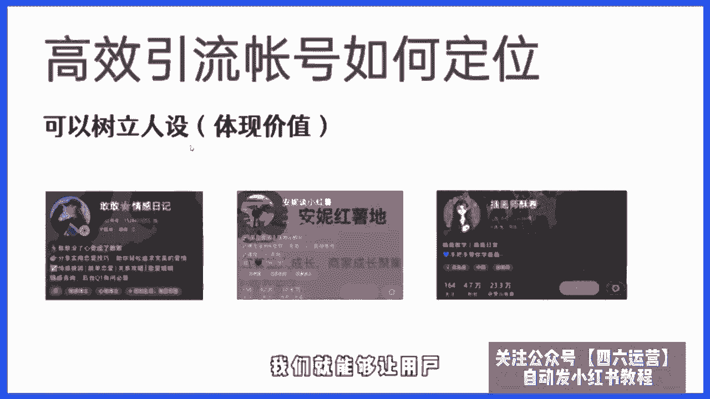

的这样一个涨粉率，而这样一个涨粉率之所以能够有这么宽。而之所以这个涨粉率会这么高，主要也是来自于我的账号内容以及我的定位。另外呢就是当用户点击我们的主页之后。

我们账号的定位也会给我们带来对应的广告曝光效果。😊，那我接下来我们就围绕着定位的三件套来跟大家讲一下如何去进行账号的一如何进行账号的有效定位。那这里的话我们就会从名字、头像、个性签名来针对性的去讲。

首先呢我们先讲名字。这里的话给大家推荐一个爆款的取名格式，简单好记的昵称加戏份领域。这里给大家举三个例子，小齐说车，还有这个英文名字爱摄影。然后呢，还有一个就是赶敢的起个日记。

大家有没有发现我们只是通过这三个名字，我们就能够快速的知道这三个账号到底是做什么的对吧？当我们的账号的名字能够取到一样能够取成能够取到让别人一眼就能够知道我们是做什么的时候。

那你的名字取的就是比较有ok的。你这个名字取的就比较的不错。那另外呢除了名字之外，还有一个就是头像头像的话就是头像也是用户在第一时间看到我们的小红书之后，对我们的一个个人印象。😊。

头像代表了用户眼中的我们的个人形象啊，头像的话给大家的一个建议是以真人头像为主。这样的话可以真实的拉近我们和用户的这样一个距离。当然，如果说你不用真人如果说你不想用真人的头像，只要你的头像是真实加好看。

符合赛一道特性的，也是可以的。第三个呢就是我们的个性签名，个性签名的话，会直接影响到你的账号的涨粉。说这一块的话非常的重要。在这里的话也给大家一个个性签名的公式，这个公式呢也是小红书里面很多的优秀博主。

他们都在用的一套格式，相关于个性签名的几个比较不错的案例，那我们看到第一个光华同学心理咨询。那我是谁他写的是个人独立执行心理咨询师，我是干什么的，我会分享心理学知识以及自己的一些个案经历。

他能够给我们带来什么呢？首先他这个账号会分享心理学的知识。并且呢可以给你提供心理咨询。另外一个英语丽娜老师。那他是谁呢？他是一个英语老师，然后呢有8年的。😊，相关于个性签名的案例的话。

也给大家准备了3个。通过他的个性签名，我们就能够立刻马上的知道他们分别是做什么的了。而他们也而他们的整个个性签名的话采用的也是这样一个爆款公式。所以大家直接去套用就好了，非常的方便。

那讲完这样一个定位的三件套之后呢，我们接下来就要讲到另外一个知识点，就是高效引流人设的分类。那我们作一个那我们想要通过小红书引流。那一般来讲我们有两种人设是比较好用的。首先一种人设是专业型的人设。

也就是我们所谓的专家型人设。另外一种人设呢就是我们的学业型人设，也就是我们站在用户的角度来进行一个内容创作。这两种人设呢分别有他自己的优势和特点，我们逐一的来给大家去进行一个分析。

就拿的情感日记这个账号来分析这个账号呢是我之前做的一个账号。这个账号就是典型的一个专业型人设的账号。之前这个账号我就只了一个差不多就只发了6篇笔记涨了80个粉丝，但是这个在我没又做任何。😊。

引流的情况下，当周就有超过30个用户主动来私信我找我进行情感咨询。那我们来看一下这一个账号是如何设计出来的。首先我这个账号做的是女性情感相关的类幕，所以我就会很清晰的定义我的产品目标。

是有情感需求的女性。另外根据用户的需求，我也对我的账号的更新范围做了一个设定，包括了情感往回脱单和婚姻关系。另外就是人物的设定，我这一个号做的是女性，因为女性人设更容易获得用户的好感。

毕竟女人更懂女人嘛。另外呢就是我这个账号除了我更新，除了我这个账号更新的内容之外，我还给他们提供了一个价值，就是可以给他们给予情感咨询的这样一个服务。那我在我的整个个人签名上面做了一个简单的调整。

就是我也没有直接让他来找我。但是呢我会告诉他，如果你有情感咨询的需求，后台找我后台扣一有问必答。这样的话就是能够拔高我们的一个人设。所以当一个用户他看到的我的内容，觉得我的内容质量O的情况下，他就会。

😊，动的来私信我。所以这就是一个好的专家型人设，设置好之后，他能够起到的一个作用。另外呢就是我们的学习型人设。学习型人设呢就是站在用户的角度触发去更新内容，更新的内容方向跟专家型人设就会有一些区别。

比如说会有一个个人的学习经验的分享，个人的学习经历，还有就是一些软广型的内容还有就是软广型的引流加资料分享型的内容。这里的话给大家看一个学习型人设。他发的一个内容。

大家会发现其实这一篇内容主题讲的就是一个超30多岁的全职妈妈，30多岁的全职妈妈学摄影4个月接单了。然后在他发的这个笔记的评论上面，大家可以看到，有很多的用户在问他他之前学习摄影的时候是怎么接单的。

包括他是怎么学习的，能不能把他学习摄影的那个班介绍给用户。所以说像这种学习型人设呢，可以引起用户和你之间的这样一个共鸣。那像这样一个账号的话，主要是偏向于站在用户的角度去撰写内容去做这样一个合理。😊。

账号定位啊，到这里的话，我们整个账号的定位的一个方法就已经跟大家讲完了。大家可以直接套用我们的定位三件套的格式，直接立刻在较短的时间马上就能够设计出一个能够高效引流的账号定位。

当我们了解了小红书的推流机制，也了解了我们做账号的第一步，我们对账号的定位。那么接下来就会涉及到账号注册了。在这里的话就会有一个注意事项要跟大家讲一下。

所以第一个我们注册的小红书账号尽可能尽可能的是一G一网一号，什么是一G一网一号呢？就是我们对我们一个手机对应一个小红书账号，对一个独立的手机流量。那这样做的目的是什么呢？

就是为了更好的保障我们的账号的安全。当然这也有个前提，比如说你像我们自己团队，我们的话因为我们周围所有的人都在做小红数运营。所以说我们每一个账号都是一G一卡一号。如果在一个wifi下面。

我们同时运营多个账号系统识别到之后，对我们的账号会有对我们账号的推荐会有很。😊，大的影响。另外呢如果说我们在一个wifi下面同时运营多个账号，如果我们有一个账号出现了问题。

那么可能就会直接影响到其他的账号啊。还有一个就是当然对大家来说，如果你的wifi或者说你自己的网络环境从来没有做过任何的小红书。那其实你一个wifi下面同时做两个账号是没什么问题的。但是为了保障安全。

最好还是一机一号一网，这样的话会更安全。另外呢就是关于养号，首先养号它是一个悖论，我们团队做差不多也有400个账号了，我们基本上没有一个账号会养号。以养号呢基本上也是属于一个悖论。

但是在这里的话有一个点大家要注意，就是有几种类型的账号需要养。首先第一个就是异地登录，那异地登录的账号的话，我们差不多会有3天的一个养号期，而我们做养号的动作的目的。

其实主要是为了让我们的在一个小红书账号，它能够它能够变成固定IP比如说之前这一个账号可能是在小红可能是在成都登录过，那我拿到长沙之后，我就会有。😊，这样一个养号期，让它固定的这样一个IP变成长沙。

另外呢就是更换硬件设备。更换硬件设备的时候呢，一般来说我们也会有一天到两天的这样一个养号期。这一个养号主要的就是让系统识别，我们不是恶意的再更换硬件设备，只是做了一个正常的一个更换。

所以我们差不多我们所以我们会养差不多1到2天的时间。还有一个就是如果说你之前你的手机号注册的账号限留过，或者被封禁过，那像这样的账号注销了一个星期之后，我们再注册，我们也需要养仓。像这这种账号呢。

我们需要养7到10天。因为这种账号之前违过规，所以这种账号我们需要养一养，这样的话会更好一点。当然特别是封禁的账号一般来讲，我都不建议大家再用，或者是就算是用也不能直接注册。

后面的加仓客里面我们也会教大家一个方法，怎么能够把这种账号二次利用。然后这个的话就是关于我们整个账号注册的一个注意事项，大家需要注意下一节课我们就会开始正式的讲到想输运营篇，会跟大家讲到。😊。

三个爆款流量的选题结构。然后我们下一节课继续。

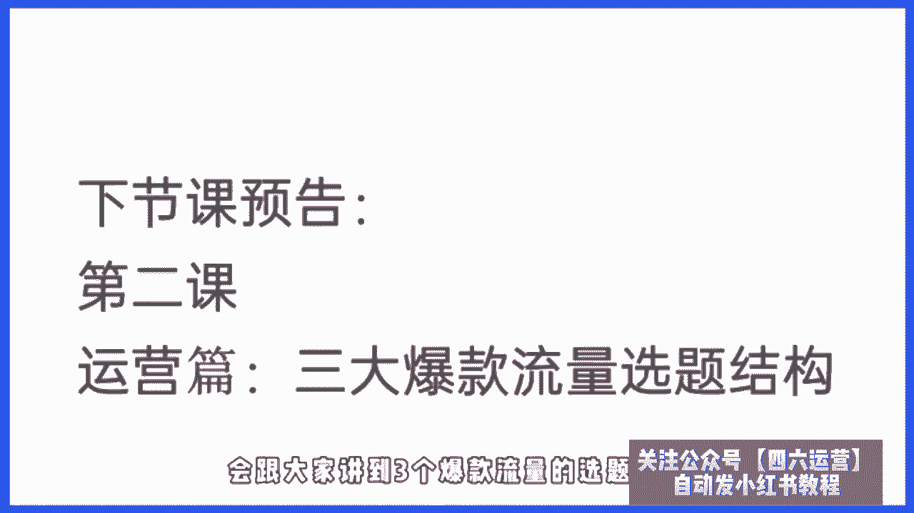

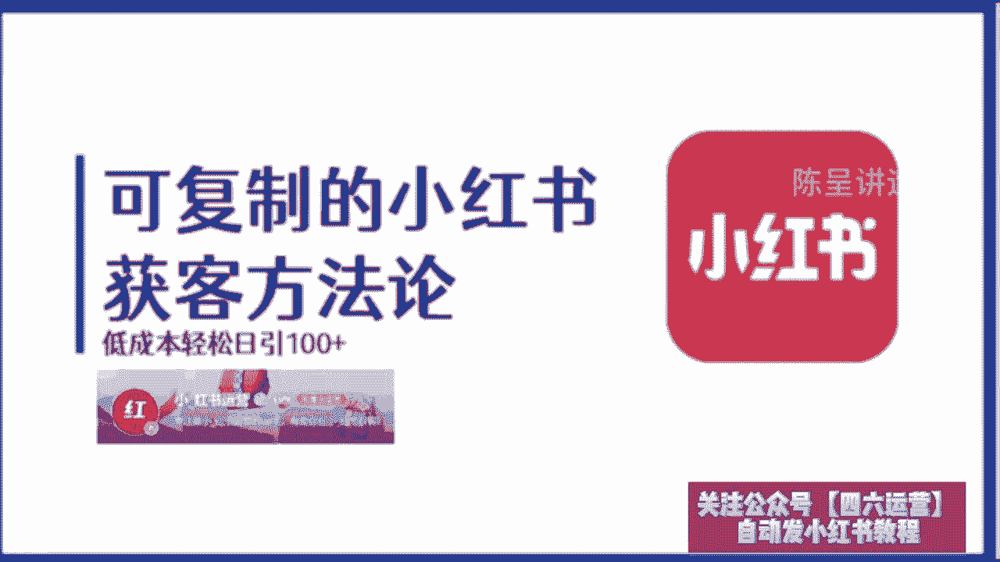

OK大家好，我们进续我们的课程。然后这节课的主题呢是三大爆款流量选题的结构。这节课的内容比较多，所以我会分成两个小节分开来跟大家讲。那我们第一小节主要讲解爆款的底层逻辑和三大选题的分类。

第二小节我们主要来讲一下，通过两个方法可以轻松挖掘爆款选题。那我们先讲第一个小节的第一个知识点，爆款的底层逻辑。为什么我们要讲爆款逻辑呢？很多的人做账号的时候，根本就不懂得爆款的底层逻辑。

所以说很多人为什么做不出爆款来，主要是因为他完全靠自己去想，靠自己的去想，靠自己去想是很难做成爆款账号的。而我运用了非常多账号，基本上每一个账号在较短的时间我都能够做出爆款来，并且能够达到引流的效果。

那主要就是因为我掌握了这套爆款的底层逻辑，那爆款的底层逻辑包括什么呢？这里的话分为两个点来跟大家讲。首先第一个不要自嗨。第二个爆款都是重复的。什么叫不要自嗨。😊。

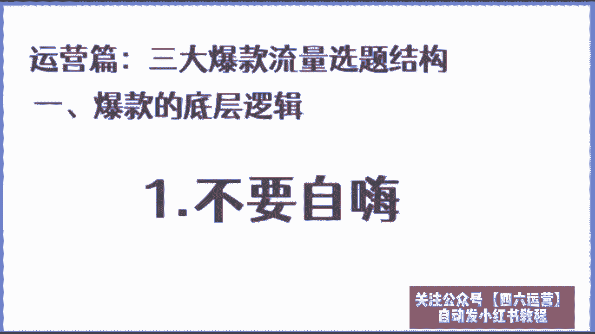

简单的来说就是我们做任何的内容，不能凭自己的想象去做。在这里我们可以看到为什么很多的人经常抱怨自己做不小无书。你看首先第一张图，我也是认真的在整理，没人看，关键全部是干货，一般人我都不愿意告诉他。

我都莫名其妙推荐上了热门，我随意写的被推荐的，认真写的，没有人看，好难啊，不知道为什么要设计这么多的规则，大家把自己的专长做成视频，供大家观赏不就可以了吗？有没有人一直没有流量啊，举个爪。

你看很多的网友都在抱怨，为什么自己做不出爆款的笔记，又或是自己的笔记莫名其妙上了热门，感觉自己随便写的就能上热门，认真写的就没人看。这主要的原因就是压根都不懂的爆款的底层逻辑，完全都是在自嗨。

那我给大家看一下自嗨型的笔记长什么样子。你看在上面给大家举的这两个例子都是属于自嗨的，原因在哪里呢？大家作为一个用户。😊。

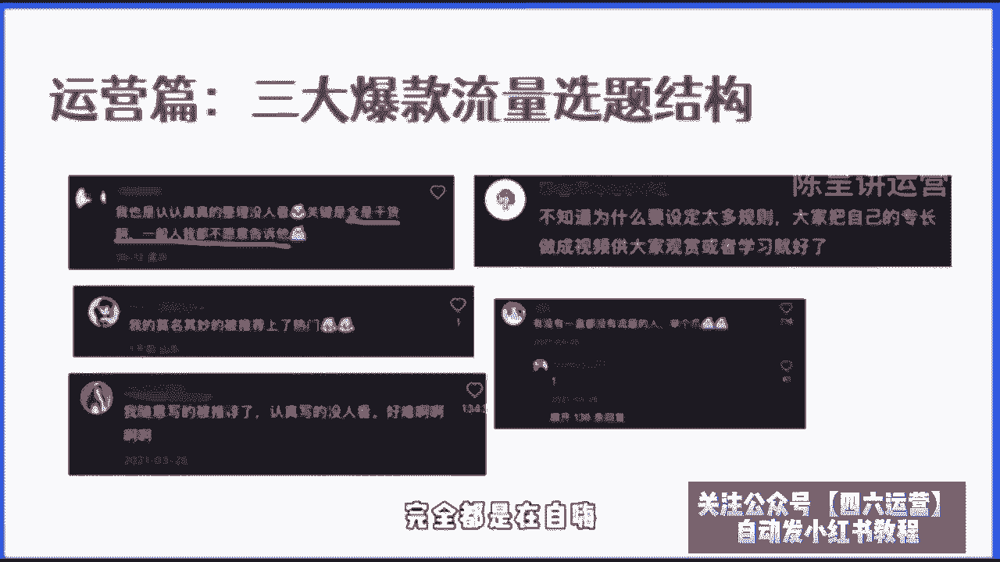

你们能够看得出来这两篇笔记到底在讲什么吗？并且这两篇笔记讲的内容吸引人吗？所以说很多的人之所以做不好笔记，其中第一个就是在于他太会自嗨了，自己嗨自己嗨。😡，太喜欢自己嗨了。

所以说就导致了永远活在自己的世界，压根都不懂的用户，压根都不懂的平台到底想要什么。所以在这里有一个雷区，雷区是什么呢？小红书不是我们表达自己的地方，想要通过小红书引流，最终要实现变现的话。

大家就要清楚的知道我们所做的小红书的每一个动作都是具有商业行为的，所以不要再把小红书当朋友圈发了。你在当朋友圈发，神也救不了你。那如何从自嗨型的逻辑变成爆款型的逻辑呢，就要讲到一个认知的转换。

就是自嗨型思维转变成用户思维，什么叫做用户思维，简单的三句话，你想做什么不重要，重要的是他想要什么。第二个，不要把小红书当朋友圈发。第三个，不要凭感觉。这里特别是后面这两者。

有的同学呢在刚开始做小红书的时候，包括就是很多的人来找我咨询小红书怎么做流量的时候，我。😊。

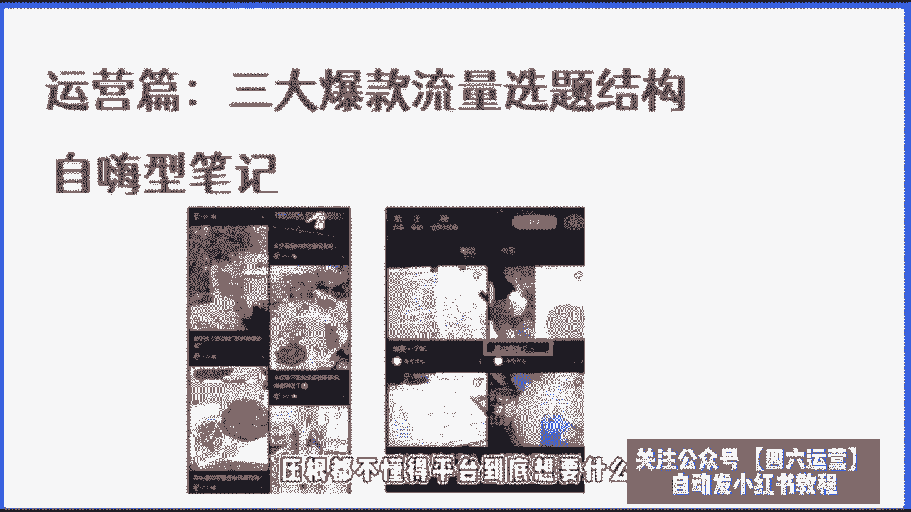

看了一下他们的账号，我简直都懵逼，要不就是把小红书当朋友圈发，要不就是感觉这个内容一定会火。所以他做了这个内容。说以这样的思维是没有办法做好的。所以大家要记住，自嗨，永远做不好内容，这是一个关键认知。

你能不能做好笔记能不能做出爆款，能不能像我这样短期做出爆款来，这一个思想，这一个认知就一定要清楚。第二个很核心的底层逻辑，爆款都是重复的。😡，那如何来理解报告都是重复的呢？在这里给大家举几个例子。

你们就知道了。首先大家看到这一张图，这张图上面一共有4个封面图，大家看大家认真的去看，有没有发现这4张图都有一个规律。不管是第一张第二张，第三张还是第四张，他们用的封面排版。

还有他的整个封面的文案的文案的公式都是一样的。你看小学英语基础知识学不全，拿这8张图，每次都能考100分，小升初数学六年公式就这8页，三天背完，轻松90家，不愧是北大妈妈将六年的语文浓缩成一张纸。

孩子看一天抵十年。你看看到没有？这是什么，这样的封面的文案和这样的封面的样板是不是都是类似的，而他的数据都特别好，所有的基本上都破万了。这是第一个。第二个，我们再来看一下账号的选题，这里举一个例子。

学摄影。😊。

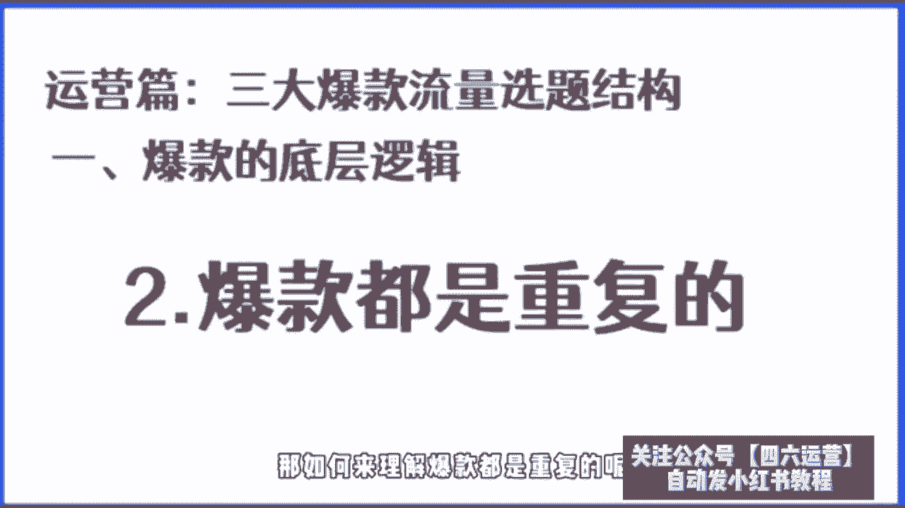

要学习的网站，大家看到没有？这三篇笔记是不是都在讲学摄影要看什么网站啊，而且他们的数据都特别的好，这是选题。所以你看爆款是不是重复的。然后我们再来看一个案例，大家看一下这个案例讲的是什么呢？

这个案例讲的是相机的参数。你看这样一个选题为什么会有这么多的点赞。因为这些选题这些内容都是用户喜欢看的。所以说爆款它都是重复的。那如何练就爆款的思维呢，记住这四个核心，你就能够养成爆款的思维。

首先第一个，不要想着创造爆款，要去提炼爆款。第二个，爆款背后是用户需求，满足需求就是优质内容，很多的人对于优质内容的定义就是优质的内容一定是要做的多么的精美。不是的，满足用户的需求，就是优质内容。

请记住，这是个重点啊。第三个，学会提炼拆解爆款，成为一名。😊。

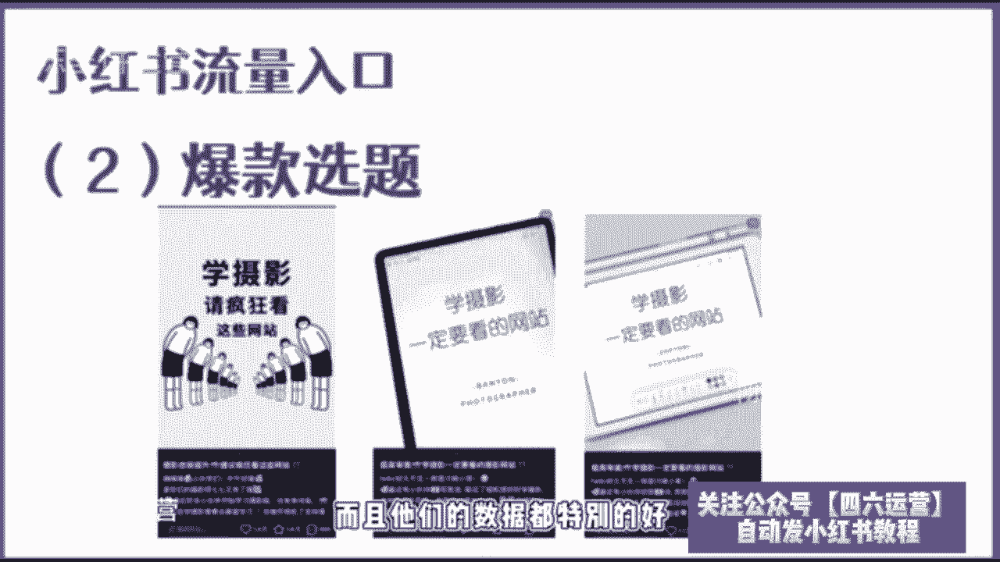

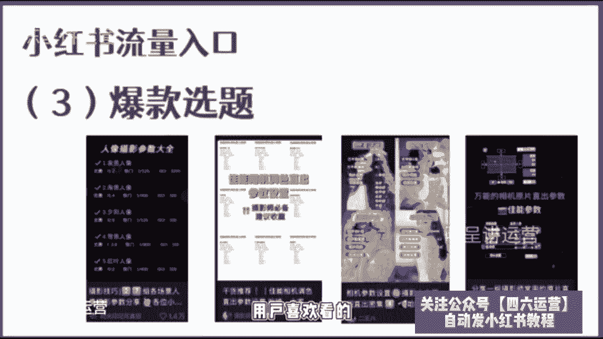

爆款刺客。也就是说，很多的人之所以不会做爆款，是因为不会拆解爆款。那如何来拆解爆款呢？接下来的课程我会逐步的来教大家怎么拆解爆款，并把爆款的优点的东西沦为我们自己的内容放到我们的笔记里面去。

让我们也成为爆款。第四个也是非常核心的思维，就是爆款都是重复的，我们要学会重复做爆款。说以这四个爆款的核心。我希望你看完这节课以后一定要记住。因为接下来我们做内容，想要做出爆款的内容，获取到大量的流量。

这一定是根本的根本的根本。那讲完爆款的底层逻辑之后，我们再来讲一下三大选题分类。那什么叫选题。简单的来讲任何一个笔记都有一个主题，就像我们从小到大我们写作文一样的，都会有个核心思想，而这一个核心思想。

核心主题，它就叫选题。它可能是一个问题。😊，也有可能是一个观点，而这个问题和这个观点，它也是选题。而选题它的重要性在于一个选题会决定笔记70%的流量。也就意味着如果你不重视选题你封面标题文案写的再好。

都不会有流量。所以流量的核心就是来自于选题。如果你的选题不对，你就很难让你的笔记有高流量量。因为你的笔记没有戳中用户的需求和用户的痛点。那如何来设计选题。

这里的话给大家一个90%的爆款博主都在用的笔记法则，叫做6加3加2笔记法则。60%是干货笔记，30%是软广笔记，20%是硬光笔记，这60%的干货笔记，30%软管笔记和20%的硬光笔记应该怎么去做呢？

在这里的话给大家做一个演示。首先第一个我们来讲一下干货笔记。所谓的干货笔记，它的特质就是容易爆，但是呢不容易触发用户的付费内容，占整个账号运营的60%。干货型内容，它的作用是什么，大家要听清楚了。

非常重要的干货重重点来了啊，重点来了。首先第一个引爆流量。干货内容它容易爆，那报的笔记他就能干嘛呢？他就可以帮助我们把其他笔记的数据给带起来。第二个，告诉通过第二个，通过干货笔记的更新，告诉平台。

我们的内容是什么？我们的内容适合谁看应该推给谁，通过内容来建立我们自己的笔记和账号的标签。第三个养号提供价值吸粉。那之前的话，我们在上节课跟他讲了，我们不要客我们没必要我们没必要去养号。

而我说的养号是所谓的这种用户标签的养号，它是没意义的。而我们最应该做的养号，就是通过干货型。的内容发布爆款的容易火的干货型的内容来养号。这样的话我们的账号才能够越养越好。第二个。

当我们去发布一些干货内容的时候，我们就能够提供价值，在提供价值，并且你设计好人设之后，你的小红书账号就会开始涨粉了，而涨粉的目的是什么呢？你会发现当如果说你用过小红书，你经常用它，你就会发现。

如果说你关注了一个博主，你会大概率的经常刷到它。所以我们在细粉的过程，其实就是在养粉，通过内容来养粉，然后通过我们后面的其他的笔记来收割。另外一个就是拉高人设的专业度，在上节课我们讲了人设的定位。

不管你是学习型人设还是专业型人设，我们如何去拉高我们的人设，肯定不是在于只是简单的通过简介告诉别人，你是干嘛的就可以了。所以我们通过干货的内容分享，就能够拉高我们的人设专业度。那这里的话。

我们主要的这样一个干货。😊，笔记的类型一共有这几种。大家可以先看一下。后续呢我会在后面的课程里面教大家不同的选题的不同类型的笔记，封面怎么做标题怎么写内容结构怎么做。所以大家不用担心。

但是呢今天这节课你一定要听完之后就要清楚的知道你接下来如果要做小红书运营，你可以从哪几个方面来。那第一个就是学习的一个过程。你看第一张图讲的是零基础自学摄影，7天速程。

然后根据它的这样一个时间来分享干货，这是一种。第二种呢就是像专业型的内容。比如说像我们所看到的第二张和第三张图，人生第一台单反向机，女生宾看。语文常备的知识总结，你看这两者都是属于不同赛道。

用户关注的内容，这种也叫做干货型内容。第四个呢就是学摄影，一定要看到网站，像这种学习资料，学习网站学习APP像这种东西，它也是属于干货。因为之所以它叫干货，是因为用户有需求，用户有痛点，用户需要它。

用户觉得这个帖子对它有帮助，这就叫做干货帖。那第二，软文笔记。软文题的特点是什么呢？第一个它又容易爆，它又能够直接导向于付费内容。它的核心就是主要围绕着变现的问题，具体的效果。

当然这里大家要注意的是具体的效果不是产品介绍。这个时候可能有的同学就会说软文笔记。既然老师你讲了软文效果就是对吧？讲具体的一个效果，那我是不是就可以直接写我用了我的这样一个产品，它的一个效果，不是的。

具体的效果是我给大家举个例子，大家就理解了。假如说我学习插画，我的目标是什么？如果说我的目标是赚钱，那如果说我直接展现效果，我学了多久的插画，最后接到了单，赚到了钱，这是不是具体的效果？

比如说再给大家举个例子，那我们这个课程是做流量的那如果说我想要给我们的课程引流的话，我要做什么，我不应该告诉他我怎么怎么获取到流量，而是我告诉他，我引到了流量，我把我的效果展现给他，对不对？

这样是不是更吸引人以结果为导向嘛，用户他要的是结果更多的不在于过程，因为过程不重要，结果才重要。这是一句京剧啊，大家记住过程不重要，结果才重要。第三个就是个人经历，那大部分的人都是喜欢看一个人的故事的。

而我们在做人设，不管你是专业型人设还是做用户型人设，个人的经历帖，一般都会有人看，只要你做的足够好，你设计的足够好，就会有人看，而别人看你的个人经历的过程中，其实也是间接性的来提升对你的认可度。

所以说像软文型的笔记的话，一般占我们账号整体内容的30%。那软文的最大的作用是什么？第一个通过人设的故事，让用户。情感共鸣，建立信任度的同时呢，又无形的宣传了自己的业务。比如像我刚才举的例子，个人经历。

这种的话是非常容易引起用户的共鸣的。特别是你在写你的故事的过程中讲到的一些点，用户如果说现在也在经历，他会感同身受。而感同身受，就是情绪共鸣。第二个就是你我们可以通过用户的好评，还有就是用户的使用效果。

还有就是类似于具体结果的展现。像这一类的话，虽然说我们没有在刻意的告诉你我的产品好，我怎么专业我的东西好。但是呢通过结果的展现，就能够让用户有好奇心，甚至有用户会去咨询。还有一个呢。

就是通过自己的案例间接性的去修肌肉。也就是说我们可以通过一些类似于比较装逼的一些图片。也就是说我们可以通过一些具体的案例的结果来间接性的告诉用户，我搞定了这个东西，我能。😊，力比较强，你想要的我会。

那这样的话也会有很多的人去找你会去问你怎么去搞定的。比如你是学插画的那你是如何通过3个月的时间接到单的，绝对会有人问你是怎么学成的，怎么学的，我可不可以像你这样三个月就能够接单。

那在这里呢给大家看几个软文型笔记的分类，这里大家看到的前面的第一张图，这张图就是一个结果展现，对吧？直接就展现给你，我加了很多的微信好友，第二个呢就是精力帖，一个30岁的全职妈妈学了摄影4个月接了单。

然后呢，还有一个就是以目标变现为主的这样一个选题。比如说你像以售后期自学好还是报班好。像这样的选题就是一来用户关注度高，二来呢，他也极具的具有变现能力的。你像这种自学还是报班，对于很多的用户来讲。

他其实都很好奇，他也不知道自学好还是报班好。说通过这种内容一样的，可以吸引针对性的用户。第四个什么时候学插画最好。现在想转行来得及吗？你像这种问题，这种选题就是急剧转化的选题。

但凡是愿意去看这个内容的用户，他都会想要转行或者都想要报班。他都是有这种潜在需求的。像这种用户它的转化率就非常高。它承担的概率就很高。然后最后一个呢就是我学插花30天了，既然接单了。

你看这个和第二个其实有一定的相似，就是通过一个学习的过程告诉你，我得到的一个结果，而大部分用户关心的是你的结果，你的过程只是一个过程而已。所以说像这种类型的封面和这种类型的选题，它就是典型的软文型选题。

软文型选题，它又容易爆。另外呢它的流量质量又高，所以说这是一种非常不错的选题的类型。第三个硬广型。简单来讲，所谓的硬广就是内容简单粗暴，直接通过展现服务或者价值，直接导向于付费内容。那像这种内容呢。

在小红书里面不易发多了。😊，但是这种内容我们也要发，为什么？因为这种内容来的流量高，这种内容占我们整体账号内容的20%。还有呢就是大家要注意像这种内容，它的推荐量一般都不高，而我们也不需要这种内容。

它的推荐量高。我们可以通过其他笔记来带动我们这一篇硬光笔记。所以它的推荐量并不重要，重要的就是只要我的粉丝看到了这篇内容有多少用户会被转化掉。那它的作用呢就是例如通过人设故事产生共鸣，建立信任度。

然后我们讲到的第三个类型笔记，就是我们的硬光笔记。所谓的硬广笔记就是内容简单粗暴，直接展现内容产品以及服务价值，直接写导向于付费的内容。而这种内容呢是小红书里面，大家一定要注意不能发多了。

因为这种内容发多了，容易违规，也有可能在你操作不当的情况下，你这篇笔记就没了。所以说这种内容呢我这种内容呢在我们整个账号整体内容的20%。并且呢大家知道这种内容可能它的整个内容的播放量不会很高。

但是呢不重要。因为它的推荐量不高，我们主要是通过发布这样的内容，让我们的粉丝看到。因为粉丝会经常刷到我们的内容。所硬广笔记的话，他有个特点，就是我们不在意他的流量，而是在于它的转化率。

当然也有极个别的这样一个硬广笔记，它的流量比较高。例如我们看到的这一个案例。首先大家看到的前两个案例，一个是每剧发音课，一个是报班前须知，这两个就是典型的产品介绍。

在这两篇笔记里面都讲了第一个是讲的那个英语的系统课。第二个讲的是插花的系统课，这两篇笔记讲的就是他有一门课程，这个课程的这个课程的价值，以及这个课程对你来说有什么用。而看到这一篇笔记。

大家可以看到这批笔记的评论有很多所有评论的用户基本上都是在问他咨询这个价格，还有就是想要报名。这种笔记它的转化率就非常高，可能来10个流量就能报2到3个，甚至4到5个都很正常。然后呢。

我们看到的后面这三者，后面这三个笔记呢，虽然说它也是属于强广硬广。但是呢这三个笔记的流量相对来说比较大。因为后三者中的前面两个这两个都是典型的资料帖，而资料帖就会有比较大的流量。

但是呢这种帖子有个不好的地方，就是因为他的流量大，大部分的人过来都只是白嫖一个资料，所以它的转化率也会有一定影响。但是呢它的流量基数大，对我们来说也是我们需要发的。然后最后一个就是我们的摄影收图帖。

像这种搜图帖啊，这种专业技能的搜图帖，对于用户来说也是非常致命的。当然你像我们在7月份的时候，我们内部的那个妹子，他发的内容其中主要有一个就是来自于这个摄影的收图。像这种搜图啊，当然不是局限于摄影。

所有的类目都可以做。这种的话其实包装的就是一个专业型人设，就是我的专业。然后呢，你加我好友，你做我的徒弟，我可以。😊，教会什么什么东西啊，当然具体我们刚才讲到这三种类型，比如说像我们的干货型的笔记啊。

我们的软文型笔记，还有就是我们的硬光型笔记。接下来我们后续会教大家封面图，还有我们的标题，还有我们的内容结构怎么写。那么大家你们看到我们上半节课你就知道了这三种笔记类型我们都要发。而且呢建议大家遵循。

😊，632的这样一个法则，也就是10个笔记里面60%占比，建议是干货笔记，30%，建议是软广，20%是强广。这样的话你的账号又健康。同时呢我们又能够达到引流的目的。在下半节课呢。

我会教大家怎么去通过一些工具挖掘爆款选题。那通过爆款选题，结合着我们的选题分类，大家就可以找到非常多容易爆的内容。那在这里的话，我们做个简单的总结。三大选题分类，有一个核心的须知，大家要注意。

首先第一个并不是所有的笔记都要引流。也并不是所有的笔例都需要有好的曝光。而我们要注意的是，我们发这批笔记的目的是什么。大家回顾一下，我们刚才讲的这三类选题它的作用是什么。大家想想。

如果说忘了建议回去再看一遍啊，这是非常重要的。第二个核心的认知点，就是在内容获客的逻辑里面，每一次用户的浏览和触答都是和用户的一次。也就是说我们的内容，用用户每一次的浏览，每一次的点击收藏。

其实就是在跟用户进行一次连接。而每一次的连接，它的目的是什么就特别的重要了。这就是我们上半节的课程主要讲的就是这三大选题的结构，还有爆款的底层逻辑，希望大家一定要认真的去思考。

这个上半节的课可能内容不是很长。但是呢大家一定要认真的去学习和思考。因为接下来我们做内容的过程中，我们都会围绕着爆款以及选题来进行。好吧，那我们上半节的课的话。

就到这这上一小节我们讲了关于爆款的底层逻辑以及三课选题的分类啊。这一小节的话，我们主来讲一下，通过两个方法轻松挖掘大家的包括选题，通过上一小节的课程，我们讲解了笔记的构成类型。

而每一个笔记它都是由选题标题封面内容构成。接下来我们会逐一对这四个步骤进行拆解和分析。今天先从选题入手。教大家如何挖掘爆款的选题。而爆款是什么？所谓的爆款其实就是用户和市场论证的产物，流量背后是需求。

而需求背后它就是选题。一批笔记是否能满足用户的需求，取决于他这批笔记是否满足了用户的需求。而这就是选题的一个核心命脉。所谓打色打7寸爆款的7寸就是选题。所以学会了爆款选题，你能否也可以做出爆款的笔记。

那如何来挖掘爆款的选题呢？这里的话给出两个方法，一个是站内挖掘，一个是站外挖掘。我们先从站内挖掘来讲，所谓站内挖掘，就是通过关键词搜索对标账号的笔记内容，以及用户评论的分析，进行爆款的收集和整理。呃。

这里的话给大家提供几种比较好用的方法。首先第一个就是关键词的搜索相关搜索。在这里的话我给大家举了三个例子。这三个例子分别都是来自于摄影的三个关键词，一个是单反，一个是摄影，一个是相机。

那我们在搜索这样不同的关键词的时候。

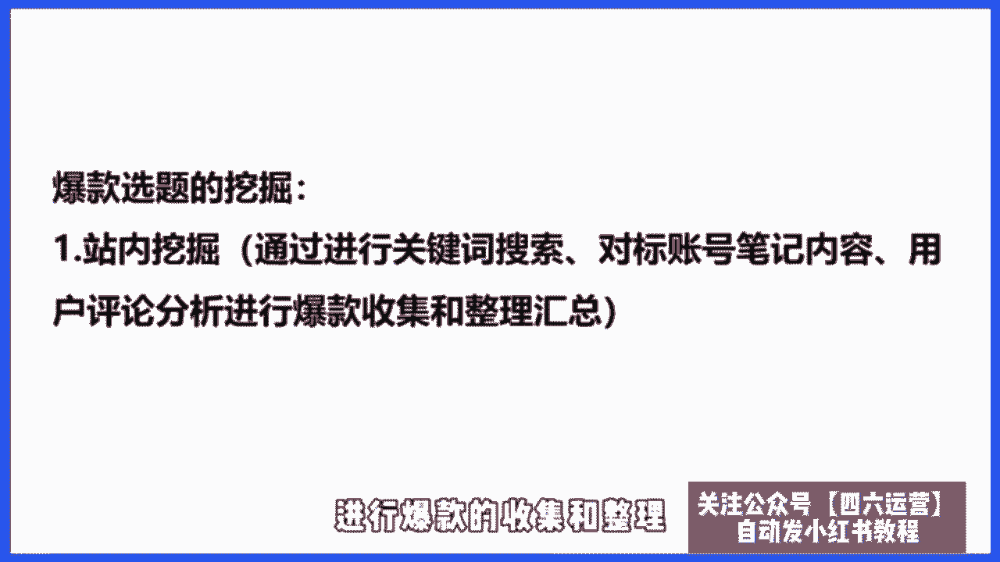

我们就可以找到非常多的笔记，我们按照这样一个最热，或者按照综合排序，把所有就可以找到非常多数据比较好的笔记。另外呢就是当我们的搜索关键词之后，在这样一个排序下面就会有一个相关于摄影人像审美提升。

像这样一个相关推荐相关搜索的话，主要是来自于当一个用户搜索某一个关键词的时候，它有可能系统会根据他们的搜索习惯，会列举出相关的这样一个关键词。而这些关键词的话，也是我们可以拿来做一个搜集和整理的。

因为这一些都是系统通过用户的这样一个搜索习惯和反馈得出的一些相关关键词。那还有一个就是通过关键词的下拉搜索。就当我们搜索一个关键词的时候，它都会有一些下拉框，比如单反单反的话。

下面就会有单反相机推荐单反和微单的区别。单反相机的入门教程。那像这一类的关键词。

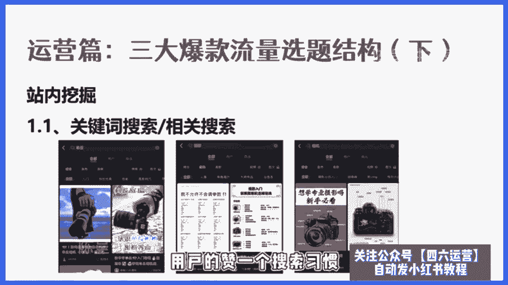

词的话都是搜索单反的人，他相关单反这样一个关键词会有哪些需求。而这一些需求的话，我们按照这样一个排序越往上的，它的热度就越高。那相对于我们自己所做的这样一个课程产品来讲的话。

我们只要找到对我们课程有一定关联的。作为我们后续做其他的这样一个细分挖掘的时候，我们会有一个很大的一个帮助。另外呢就是关于这样一个同行的热门选题，还有评论区的这样一个挖掘。

那所谓的所谓的对标同行的热门选题，就是通过同行的对标账户进行笔记的分析和整理。那我在这里的话，其实就比较容易理解。就是当我们去搜索一些关键词，或者是我们去看一些同行的一些账号。

他们的整个账号里面都会有数据比较好的选题和笔记内容。那我们要做的就是把他们所有热门的这样一些笔记，把它进行一个整理。当我们在整理的过程中，我们就能够去通过分析就能够看到相关的这一些热门选题。其实它。

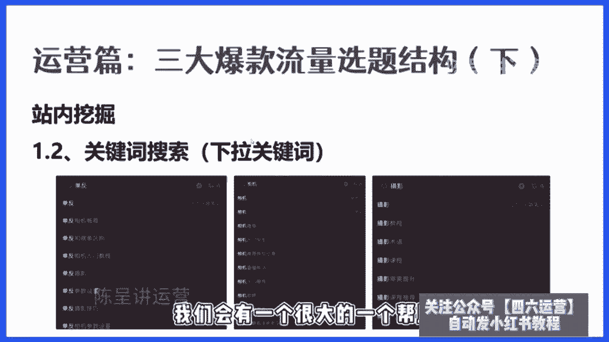

都是有重复的。而我们要做的就是把这一些热门的选题且重复的选题把它找出来，然后做一个逐一的整理，便于我们后续可以直接拿去用。那还有一个就是关于这样一个评论区，那评论区的话，基本上也是一个挖掘选题。

挖掘用户需求很好的一个地方。那这里的话给大家截了一个图。这张图是一个爆款笔记，它下面的一个评论。那我们在这里可以看到其实有很多的用户都在评论区求这样一个新手入门的相机。那像这样的需求单一出现。

可能它不一定是符合需求的。但是如果说它出现的次数比较多，它的频率比较高的话，那是那基本上就说明了那说明了这种需求是非常明显的那像这一类的需求。我们也可以把它针对性的来做一篇笔记。

那像这样一些我们刚才做的这样一些需求分析之后，我们就可以把这一些需求分析，按照我上述给大家这个表格来进行一个整理。比如说我对应的一个精品账号，我都会把它的这样一些爆款的标题。😊。

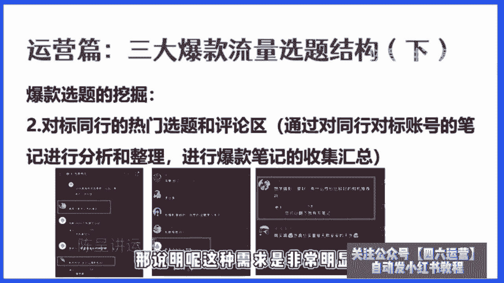

播放量、收藏量和评论量这些数据全都会把它放进去。同时呢我会把它的整个选题进行一个拆解。比如说像我们的第一个摄影光线，学摄影必须要知道的8种光线，那它的核心关键词其实就是摄影光线。

另外呢就是第二个提升审美，学摄影必看到8个网站。那这里的话我就会把它的整个标题里面的核心关键词提炼出来一个学摄影一个网站，一个提升审美。那当我慢慢的当我开始去做在一个爆款的数据的分析的时候。

大家就可以发现所有的爆款它都是重复的。基本上所有的账号里面，它火过的内容，只要他发的内容比较多，它火过的内容基本上都是有重复的。而且这种重复率是非常高的。那像这种内容的话，就是我们优先要做的。

因为这种内容它就是属于典型的符合用户需求的爆款选题的一个。😊，很好的一个体现。那站内的选题的话，我们可以通过这张表格来进行一个收集和分析。那站外站外呢站外的话其实和站内其类似。

那站内站外的话给大家推荐两个核心的渠道，一个是知乎，一个是抖音。这两个渠道相对于其他渠道来讲的话，它的数据量比较大。

而且呢对我们来说搜索的这样一个参考性比较重要的那这里的话给大家讲三个方法来进行一个站外的挖掘。首先第一个就是关键词的搜索下拉框。第二个是按照热度的排序。第三个就评论区。😊。

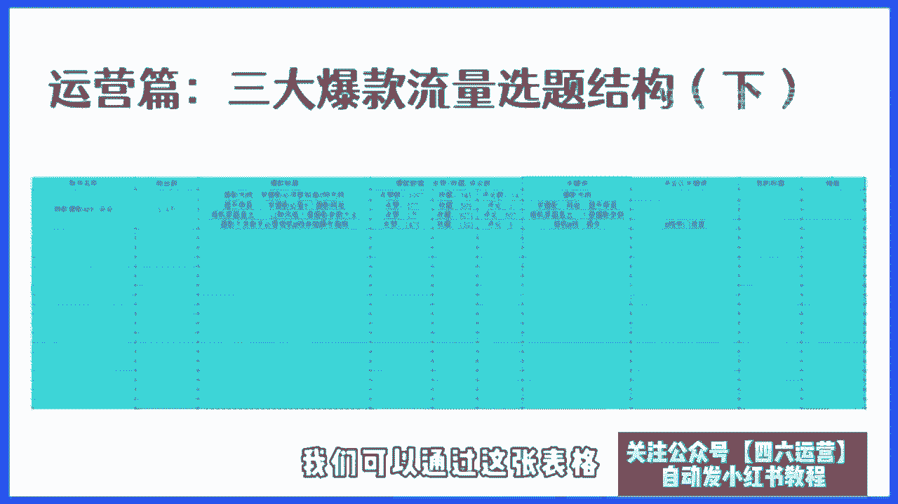

为了更好的让大家理解站外挖掘的一个方法。这里的话我给大家举一个知乎的例子。当我们在知乎搜索摄影相机的关键词的时候，在它的下拉框里面也会出现一些关键词。比如摄影就会出现摄影构图，摄影技巧，摄影入门。

还有摄影入门相机。当我们搜索相机的时候，就会出现相机的推荐，还有就是相关于相机的一些相关的关键词。那这一些关键词，它都是当一个用户搜索对应的一个主关键词的时候。

会根据它的搜索的匹配度来进行一个相关的推荐。那像这些相关推荐的话，都可以整理下来。因为这些相关推荐都是平台的算法进行一个整理，最终得出的一个结果。而这一些词也是具有一定的用户需求的。

也是用户关注的一些比较大的一些关键词。那另外一个就是关于这样一个热度搜索。热度搜索的话，就是不管你是在抖音还是在知乎，我们在搜索任何一个内容的时候，它都会有一个热度的排序。那你像在知乎里面搜索摄影。

我们就可以直接按照综合。😊，去来进行一个直接搜索，按照最多点赞搜索出来的结果就会包括很多一些点赞量比较高的一些问题。而这些问题相对来讲，它也是具有一定的用户需求的那我们要做的就是把这一些相关的一些选题。

直接来作为一个整理，整理之后来进行一个后续的呃整理之后直接在小红书里面去搜索了解，看有没有对应的一些需求。如果有的话，这个选题也是我们可以拿来直接用的。

然后第三个就是关于评论区评论区和我们在小红书进行一个评论区挖掘是一样的。就是当用户会在评论区里面去提问，去问一个问题的时候，说明了用户他的需求是没有被满足的那当我们在评论区里面发现一些高点赞。

或者是说出现频率比较高的一些问题的时候，而这些问题大家都可以进行一个整理。因为这些问题它都有可能是一些用户关注比较多的一些爆款的一些选题。它是具备一定的需求的。而我们收集了之后，要做的还是那样。

就会把这些。😊。

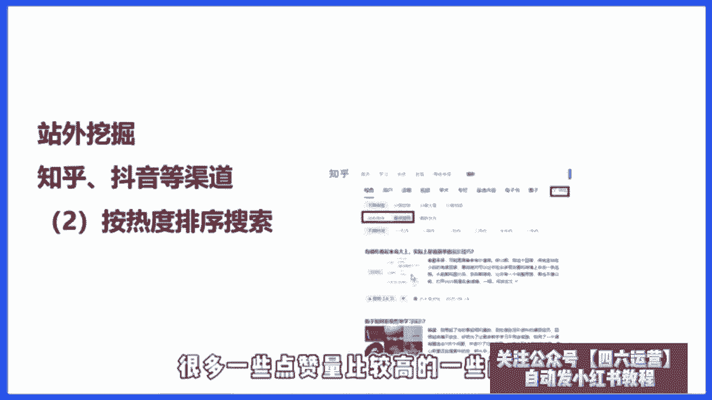

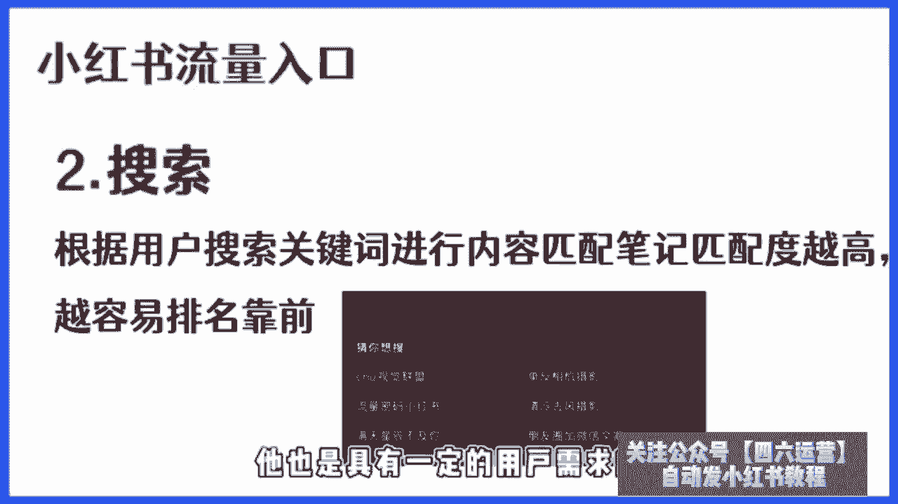

内容拿到小红书的渠道里面去搜索。如果说它具备热度，那我们也可以进行一个整理。然后这里的话也为了大家更好的去使用站位挖掘的这样一个工具。那给大家准备了一张表格。那通过这个表格。

你就可以很好的通过这样一个站位的挖掘，把所有的内容进行一个整理。然后后续的话对我们自己在内容创作的过程中会起到很大的帮助。然后这一节课就讲到这么多。然，最后的话再跟大家讲一个很重要的一个点。

就是为了更好的帮助所有做兼职的项目成员，更好的去做好这样一个项目。我们把所有的我们所做的这样一个产品的爆款的选题封面标题等元素，全部都进行了一个素材化的一个整理。这个素材库的话，如果你想领取。

那你需要做的就是第一个每天的课程都要认真的听完，并且提交对应的作业，根据这样一个课程所讲内容去实操。然后当你把所有的内容课程全部学习完之后，直接找你的助理老师去领取就可以了。😊，好吧。

然后这节课的话就等这么多。OK继续开始我们的课程啊。这节课呢主要讲解爆款的封面，还有标题的这样一个公式。那在讲解之前呢，有一个很重要的点，我要跟大家去讲一下，首先大家看到我们右边的这两张图。

这两张图大家是不是似曾相识。所有的小红书的流量最大的入口，都是来自于双瀑布流，对不对？而在这个地方，我们之前都是讲过双瀑布流最直接的影响因素有哪些，还记得吗？选题标题和封面。

那我们的封面和标题还有选题就会直接决定用户会不会点击。而大家在这里要注意的是用户是被动刷到的内容。因为是平台通过用户的喜好标签，还有用户之前搜索过的关键词来进行被动推荐的。

而用户是否会去点击是取决于第一个能不能满足用户的需求，第二个有没有足够多的吸引力，能够让用户去点击我们的笔记。所以。😊，说我们需要去解决我们爆款的标题应该怎么写？我们的爆款封面怎么做？

那这里呢我教大家一个爆款的封面速成法。相较于市面上大部分的这样一个课程来讲的话，今天这一个速成法，只要你认真的去听，你就可以立刻马上学会它，别的不多说，我们记入正式的内容。

那首先呢关于这样一个爆款的速成方法，我这里会讲到一个方法，以及再跟大家去提一个关于素材库的一个收集的问题。那首先。我把我的方法叫做关键词拆解和结构化表达方法。

那这里的话首先我们要把爆款的标题进行一个分类。也就是说我们最经常会看到和用到的标题有如下的6类时间金钱数量夸张跌透点，还有好奇。那对应的这样一些标题呢也特别的多。

我今天只举其中的这6个例子来给大家讲解这个方法，大家一定要学会去用它。因为这套方法一学就会学了就能够马上用。那我们就先讲的第一个时间那这里的话给大家准备了个案例。

这个案例是6年PPT月入2万零基础自学PPT经验分享。那我们怎么来进行一个拆解呢？首先大家跟着我的思路来啊，我们把这一个标题拆分成6年PPT月入2万零基础经验分享。那我们怎么来改了，举个例子。

如果说我要把它做成摄影的课程，那我可以怎么改，我可不可以改成4年摄影。😊，经验月入2万零基础自学摄影经验分享。那这一个关键词和上面它原来的案例的关键词，我做了一些什么调整呢？首先第一个我的时间年限改了。

第二个，它针对的对象是PPT我针对的是摄影经验，然后呢，它是月入2万，我改成了月入1万零基础经验分享。你看通过这样一个拆解的方法，在利用它的结构进行一个表达。

是不是快速的就能够得出我们想要的这样一个爆款标题啊，当然这里呢我只是给大家举个例子，可以写的更好，对吧？大家可以自己去练习一下，这是关于时间内的，我给大家举一个例子，金钱类的这样一个标题来给大家举例子。

案例是00后靠写作怎么存10万，毫无保留经验分享。那这里面的关键词是什么？00后靠写作怎么存10万毫无保留经验分享。那我怎么改了，我这里给大家举一个例子，95后靠摄影怎么存20万三年经验分享。

你看我把这个标题进行一个拆分之后，我得出了一个新的标题。😊，这个标题的主要关键词考线，95号靠摄影怎么存20万，3点经验分享。你看这种思路大家自己要去体会一下啊，这个方法大家一定要深入的去体会一下。

然后我再带大家走几个例子，大家自己去好好的思考一下。😡，第三个数量。那数量呢我也给大家举了一个例子，这个例子就是6年的电子书网站，让你看书自由。那我们进行一个拆分。大家自己看这个课的时候。

自己也去猜一下啊，看跟我猜出来的是不是一样的。6个免费电子书，让你看书自由。那如果说我要改成我所做的这样一个内目，举个例子，我们拿摄影来举例子啊，改进成6个免费的摄影自学网站，让你轻松学会拍照。

那我这个里面的关键词有哪些我这里面的关键词就是6个免费电子书，让你看书自由。😊，讲完金钱这一个案例了，我再来给大家举个例子啊，我们举一个关于数量的例子。那数量这个例子呢，这里有一个案例。

6个免费的电子书网站让你看书自由。那我们来猜一下它的关键是哪些6个免费电子书网站，让你看书自由，对吧？那我们改进之后的。😊，我按照我的方法改进之后，我们的标题可能会变成什么样子呢？来。

我们来看一下6个免费的摄影自学网站，让你轻松学会拍照啊，这里面的关键词首先6个免费摄影自学网站轻松学会拍照。你看我把关键词拆分了之后，是不是就能够快速的组合出一个新的爆款。

那我们再来看一个夸张类的夸张类的在一个标题写作呢，你案例也有一个举个例子，有了这几种方法，学摄影省下一步单反线。😊，你看这里面的关键词就是有了这几种方法学摄影，省下一部单反钱。那我把这里改了一下。

改成什么呢？掌握这六种方法学摄影，省下一部单反钱。那你看我把这里面的几种改成了具体的6种。你看同样的标题通过这样一个内容的改良，是不是我们的标题也会比较的我们的标题也会比较的不错啊，对吧？啊。

我们再来看一个例子，这个例子是裂通点，那案例呢是十六七岁不会化妆，一分半还原自然原生美貌。这里面的关键就是十六七岁不会化妆一分半还原自然原生美貌，那我们改进之后呢，你看改进成摄影那我们怎么改的啊。

初学不会摄影，时刻这9张图，三天快速入门摄影。你看我就把171六七岁改成了初学不会改成了不会摄影化妆，我就。😊，一分半我就改成了死磕。😡，然后还原之后，我就改成9张图，三天快速入门。

你看我把这些关键词进行了一个调整，把有一些关键词增进行了一个增加。比如说我把一分半改成了一个比较有情绪的比较好的一个词，叫死磕。

你看我的整个标题是不是一下就更加的是不是我这个标题一看就变得会比之前普普通通的标题更加平更加的好一点的呀，对不对啊，这就是列痛点。然后呢，我们再来看一个例子，这是最后一个例子了。

我们再看一下这个案例是考研一站上岸，其实很简单，它里面就会包括了考研一站上。😊，考研驿站上岸其实很简单，那我们改一下，对吧？学会摄影其实很简单，有手就行。你看这么一个标题，简单的改了一改。

当然这只是给大家举个例子，你们自己在课后呢也可以把我上课过程中所录的这一些案例，自己也可以去改一改啊，去练习练习。😊，那这里呢就给大家去总结出了我们的这样一个案例。

那我们把这个案例做一个总结爆款标题的分类和拆解的步骤。记住啊，拿着笔一定要认真记。首先第一个找到同意选题下面1到3篇爆款笔记。第二，提取关键词。第三步，结合提取的关键词形成自己的标题。第四步。

加上一模迹表情。你看就通过我刚才教你们的这种方法，是不是我们就能够很快的做出一个爆款的标题啊？那在这里的话值得注意的是，除了我们要学会干嘛，学会总结爆款的共性。并且把标题和关键词进行拆解。

然后通过结构化的表达之外呢，一定要注意，我们要学会站在用户的需求，用户的角度去设计我们的标题，从而才能够做出一个真正能够吸引人，并且能够吸引更多用户的标题。那当然对于需求这一块呢，大家很多同学都是新手。

都是刚开始做，对于这一块不是很了解。那后续呢我也会专门的做一期用户需求的详细讲解的课程放在加仓课里面来帮大家更深层次的去理解用户的需求。那当然其实我们之前讲的这一个选题，对吧？我们也一直在讲。

我们要去挖掘用户的需求，通过教大家的这样一个方法，我们就能够找到用户的需求。那今天的话，既然我们是正课。那正课的话，我就把一些简单好用的方法直接教给你们，因为我考虑到很多同学没基础，我要一来讲的很复杂。

或者一来把很多东西讲的很专业，对于大部分的同学来说有点听不懂，对吧？因为我们这节课因为我们这一套课讲的本来就是方法论，希望通过这个课程的每一个方法论，能够让大家快速做出效果来。

所以说大家一定要认真的去听，然后当然大家也不用担心关于标题确实还有很多东西要讲，我把它放在了加仓课，好吧，嗯，这是我们关于标题的一个注意事项。😊，啊，这是关于标题的一个点，我要跟大家去提一下。

然后另外一个呢。就是大家要学会自己搭建自己的爆款标题库，你要学会去总结各种各样的小红书的爆款标题，并把它们按照分类来进行划分。第二步，要学会去结构化的拆解它们。因为你只有拆解了。

你才能够找到他们这个结构，并且能够去套路它。第三个呢就是大家一定要学会去进行字金词金句的收集。什么叫金词金句。简单的来讲就是好的句子好的词语。那这些词语和句子大家都要学会去收集它。

因为平时我们在写标题的时候，我会用得到，例如刚才我们的案例里面讲到的死磕，这就是一个非常好的一个词，这个词是有情绪的，这个词绝对会比我认真努力学会它，聊的要好，来得要好，学会和死磕，这两个词。

大家想想是哪个词更好。所以说像这种关键词和这种京剧的类型的东西，一定要学会去整理。当然，对于很多作为我们兼职项目的伙伴来讲的话，我们也为大家。准备了一套大家所做的这个课程产品的标题库和我们的素材库。

那每一节课听完了认真做作业。学完这个课程之后，你就可以拥有它。好吧，这个东西的话是专门为我们所有做兼职的项目的伙伴准备的。当然如果说你不是我们兼职项目的成员，你是我们的付费用户，你也不用担心。

我们后续也会为大家去整理，找你的找你的对接老师就可以了。好吧，这是关于我们的一个京剧金库的这样一个收集，要跟大家简单的讲讲，就是包括了这三个方面。那另外呢就是关于我们的标题的注意事项。

大家在做标题的时候，首先要注意。第一个小红书的标题上线是20个字，也就是你超过了20个字，你就没办法了。所以大家一定要学会在标题里面，不要加废话，尽量的不要把一些啰嗦的语字，啰嗦的句子放进标题里面。

这样的话会让你的标题变得非常的臃肿，甚至可能你的标题都已经放不进去了啊，很坑爹，很尴尬。😊，第二个呢就是大家一定要学会善用一摸迹表情。一摸迹表情的作用，就像下图大家可以看到的这两个图，以摸迹表情的作用。

一方面是可以间隔我们的封面标题。另外一方面呢可以让我们的内容不会看起来密密麻麻。有的人他在写标题的时候不加一墨迹表情，就会感觉整个标题非常的乱。😊，所以说这一块大家一定要注意，好吧。

当然如果说有的同学不会添加一目镜表情，课后找辅导老师去要教程，让他教你就可以了。然后我们标题这一块东西的话就讲完了。接下来我们再来讲一下爆款的封面拆解。😊，接下来我们再来讲一下爆款的封面拆解。

爆款的封面拆解的话也是非常重要的。因为大家知道封面比标题还要重要，因为色彩更加的鲜艳，它比标题还要突出。那这里的话大家一定要注意一个问题啊，就是不管你做任何一个流量渠道。

想要通过任何一个渠道来进行流量的获客都离不开一个非常非常非常重要的底层逻辑。打开率打开率的前提是什么呢？就是要具有吸引力的封面图，为什么是封面图，因为封面因为人眼对色彩更敏感。

而封面也是用户能够第一时间快速助力，注意到你的很核心的这样一个展现的东西，所以说封面就可以说是用户对你的第一印象。那怎么来制作一个吸睛的封面图呢？这里的话给大家提供三个很重要的封面的知点。

然后呢再给大家去提一下关于制作封面的这样一个事情啊，首先我们要先讲一个关于封面。😊。

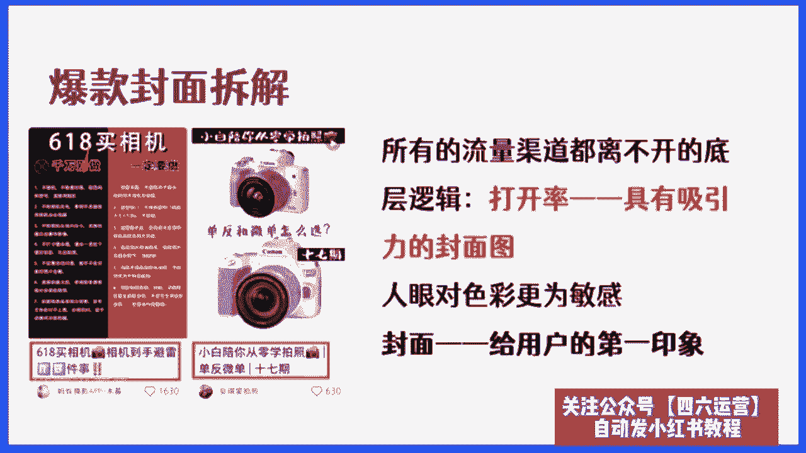

尺寸的问题，很多的同学啊，我发现有很多的同学，包括我之前带的一些徒弟，在刚开始不懂这个封面标题是吧，做标题。😊，做封面都是完全乱做的，就是有的封面做的很大，有的封面那也做的也很小。

结果上传到小红书里面发布笔记之后，整个封面都有点看不下去啊，非常的痛苦。😊，那怎么来做呢？所以说这里的话，首先大家知道封面尺寸在小红书里面到底有什么影响。那我们在这个图上面可以看到这个图上面。

我们会发现有几个我用红色框框标出来的这每一个笔记它的尺寸大小是不一样的那大家会发现长方形的是最长的它的整个曝光度和整个吸引人的这样一个点也是最大的。相反，像这种长方形比较小，对吧？

它就更没这么容易让人被。😊，更没有这么容易让别人快速的看得到。所以说尺寸它的重要性就在于尺寸对我们的曝光会起到很大的一个帮助。那尺寸一般包括什么呢？这里的话给大家讲一下小红书的。

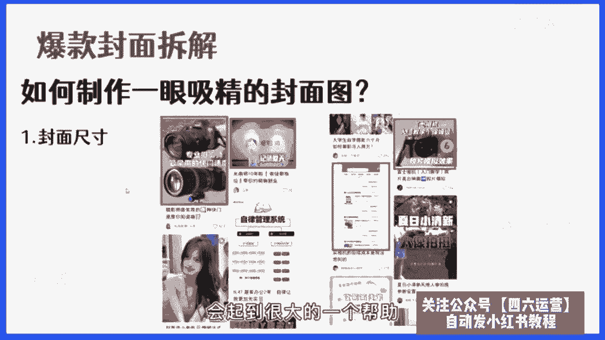

小红书三个核心尺寸。首先第一个尺寸就是它的4比3的尺寸。4比3呢就是我们所谓的横屏横屏的效果图，就在这样一个图上。大家可以看到另外一个是3比4，3比4呢就是属于长方形长方形的话，相对于横屏来讲。

它会更加的长一点。正方形呢相对来讲它就比较小。所以说我们可以看到小红书的尺寸，它一共就只有三个3比4，也就是竖平横屏，还有就是这样一个正方形。那知道这个以后。

我们来看一下这三种尺寸分别在我们的笔记里面会长什么样子，那首先我们可以看到最左边最左边的话它就是一个长方形，这就是4比3的横屏。那这边的话中间这个是1比1，就是个正方形。那相对来讲的话。

3比4的这一个竖屏，它就会比其他两者要更突出更大，对吧？所以说这是尺寸的一个区别。那这里的话我们更加建议大家我们做的所有的图都要选择3比4的尺寸，因为3比4它是长方形比。😊。

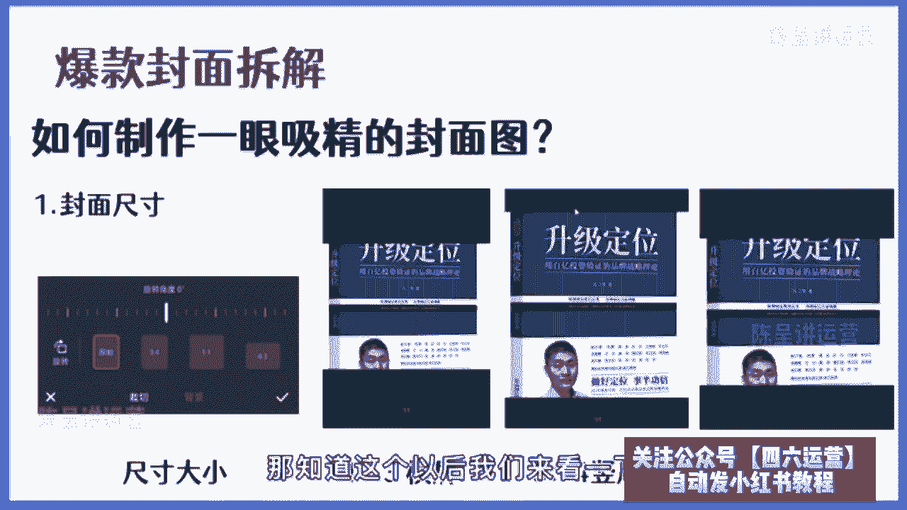

其他两个来讲的话，更大更容易展现我们想要展现出的内容。啊，所以这里的话强烈推荐3比4。尺寸讲完之后呢，我们接下来讲一讲关于封面的一些分类。那封面的话一共会分成两种，一种是聚合型的封面。

我们也把它叫做拼图封面。另外一种呢叫做爆款单图。那我们从第一个聚合封面来讲，聚合封面它的特点是什么呢？从视觉的角度来讲，它会给人的感觉是内容非常的丰富，会增加用户点击的欲望。那像这种所谓的聚合型封面。

一般来讲用的比较多的地方就是合集，还有一个就是对比图。我们来给大家举几个例子，大家看一下啊。😊，上述的这几张图呢，全都是属于聚合类的封面。大家有没有发现这几个封面的特点在哪里？

是不是它是有一个一个的图片拼凑在一起的那这拼凑在一起的图片是不是给我们的感觉，就是内容特别的多啊。各位同学对不对？这其实就是聚合型封面，它最大的优势，因为它从整个视觉的角度。

能够让我们看到能够让我们觉得丰富度非常高，并且呢如果说用户看到我们这一个封面上，其中有一张图，如果吸引到了它，他就会点击啊，所以说它是一个非常好的视觉效果，对我们来说也是一种参考。

那当然我们刚才看的是这种合集类的，我们再来看一下对比类的这一个聚合类封面，它长啥样子。那这个的话应该大家在小红书里面经常都能看得到，对吧？就是两者的对比。那比如说像减肥前减肥后，对吧？像化妆前化妆后。

像这样一些赛道，它都会喜欢用对比图。那在这上面的话，我们举了一个摄影的例子。😊，大家也能看得到，对吧？它的整个区别在哪里，其实就是前后的反差能够在一张图上面快速的能看到，能够看得到，对吧？

所以说它的优点是什么呢？它的优点就是它的前后对比，反差非常的明显，也能够提升用户点击的欲望和想法，对吧？点击率就会因此而增加。那这里的话值得注意的是，不管你是用的拼图还是对比图，一定要注意的是。

你选用的拼图风格一定要一致，不然看起来会非常非常的杂乱，会导致用户会看不清楚，会导致用户眼花缭乱，根本就分不清楚你的内容的重点。第二个呢就是多张图片进行拼图，图片的文字一定要醒目。

因为只有这样才能吸引用户的注意力。因为你的拼图上的色彩和内容特别的多，所以说你的文字如果说不够醒目，那就会出现内容傻傻用户看不清楚，对吧？刚才给大家举的这几个例子，其实就是很好的一个案例。

讲完这个聚合性。😊，的封面之后呢，我们接下来讲一下爆款单图。那爆款单图呢也是小红书里面用的比较多的那比如说我们看一下常见的几种单图的样式，比如说你看它里面就会包括了从左到右全都是属于一张图片。

然后呢在上面加了一些元素加了一些文字。当然爆款单图的话，它的整个核心的点，其实就在于它需要通过需求。需要通过刚需的选题加组合标题来进行突出它的整个单图的优势。那我们来看一下单图它最大的一个优点在哪里。

首先第一个单图它可以通过结合用户群的特点。来进行一个主选题的一个制作。所以你会发现经常有一张图片上面它会有一个很大的一个文字标题。这个标题其实就是迎合用户的需求，把用户最大的痛点，把它放到最显眼的地方。

然后呢再把一些相关热度的一些内容，包括就是对这一个大标题的一个修饰的一些关键词小标题放进去。而这种点击率、点赞率、收藏率都会高于一般的单一选题。就是说你的一个选题，你的一个选题下面。

还有1到2个2到3个相关的高通点的选题的话，就会让你的整个封面变得更加的吸引人一点。这是关于单图的一个优势。那我们来举一个例子给大家看一下。举个例子啊，首先如果说我们要做一张单图。

那我们的产品是摄影的课程，我们的用户群呢都是一群初学初学摄影的新手小白。那他们的痛点需求包括什么？第一个他可能是一个零基础，想要学习摄影，他不知道怎么学。他想要方法。第二个呢。

他对于相机、镜头构图等基础知识的入门，他是很需要的。还有呢就是他可能对于一些学习方法，对于这一些东西也很感兴趣。那当我们在做选题的时候，其实也是在做用户需求和痛点的分析，对吧？在这里的话，我们先提一下。

那我们的主选题可能就会包括什么呢？例如零基础学摄影经验总结，那我们可以组合的选题，就包括了学习网站APP分享，还有电子书。那我们来看一下一些具体的案例。😊，这里的话给了大家三个案例。

这三个案例呢其实都是属于零基础学摄影的主选题。那大家可以看到这一个主选题，它们的背景样式其实都是摄影师或者唯美的一些拍摄的作品。那他们的排版呢也有一个共性，是什么共性，背景图简洁好看。

一眼就能够看到的重点。然后呢他们采取的这样一个标题的方式，内容的这样一个方式，就是7天速成和12天学摄影，都是用的这种系列更新的这种方式来进行主选题的这样一个包装标题的这样一个设计。

那他们里面都会有一些小的标题，例如干货预告适合什么样的人群，还有这篇笔记的特点。那像这一些关键词的话，都是来修饰它的这个封面。能够让这个封面变得更加有吸引力一点。这是关于单图的一第一种单图。

就是刚需选题叫组合性选题。然后再讲另外一种爆款单图的一个形式，就是高密度的信息展现或者纯文字。那像这种呢比较适合用一些，例如像考研啊，像比如说像摄影的一些知识类的分享啊。像这样的内容是比较适合这种。

高密度文字比较多的这样一些爆款单图的那这种笔记大家可以看到上面的这几个案例啊，这几个案例它的特点是什么？大家有没有发现你通过这几个案例，你就能快速知道它的内容主要讲的是什么，都是一些非常专业的内容。

对吧？比如说你像前这几个里面的内容，我们就可以看到，因为它很直观，它就是一张单纯的文字比较多的一张图。那它的特点就包括了如下这几个点。首先第一个我们可以看到用户清晰，就是我们可以通过单图可以看到。😊。

这个笔记的内容方向。第二个呢，我们可以通过他发的内容，能够感觉能够体会到能够体现博主的专业度，还有就是它的信息密度。第三个呢，像这种类似于爆款单图的这种文字型的封面的话。

它一般都用作于一些专业的干货的分享。那相比于单图还有就是加爆款文字的话，它有个很大的一个优点，就是它的信息量更直观。因为它打开的时候，信息就全部展现了，没有打开。在你看到它的时候。

信息量就已经很直观的出现了。那在这里的话，对于爆款单图就会有一个注意事项的点，大家需要注意。首先第一个单图它比起多图来讲的话，它的创作成本比较低。

你只要通过若干个关键词就可以把这样一个笔记的重点内容告诉他了，这就是纯文字的爆款单图，它很大的一个优点。第二个呢就是首页的关键词需要足够的信引任。因为你的内容大部分是文字。

那你的最大的这个主题的文字就必须要尽可能的信人。😊，这样的话才能够去点才能够去激发用户打开这一篇笔记的欲望。但是也要注意的就是因为文字多，但是呢不能因为文字导致它的整个内容过于密密麻麻的。

这样的话不光会影响到美观，也会影响到用户第一眼看到你这个笔记的印象，可能就会导致用户能不能点击你的这样一个很重要的一个原因。那这里的话我们就把爆款的一些两个封面的类型给大家简单的讲了一下。

大家的话自己要去课后稍微吸收一下。那这里呢值得大家注意的是啊，有一个值得大家注意的一个点。首先第一个你做的封面，你的文字和你的封面的元素一定要契合你所做的这个主题，一定要契合。

不要就是你的封面的内容和你的封面的标题和你的图片完全互相独立开，没有任何的关联，这样是非常不好的。另外一个呢就是大家在图片里面不管是单图还是拼图里面添加文字还是元素的时候，一定要注意摆放的位置。

尽可能的保证整体的风格，还有就是这个内容和图片的协调性。封面标题，封面的协调性。第二个呢就是整体内容的封面，尽可能的要一致性。你要保证比如说你的字体，你的字体是你的大字体是比较方的那你的副字体。

你其他的小标题的字体，你一定要用它类似的，不要用不同的字体。这样的话，比如说你上面的主字体是方的，你下面的字体是圆的这样的话就不好。这样的话你的整个封面就会看起来很别扭，会影响到它的美观度的。

然后这里的话给大家看一些。😊，比较好的成功案例啊，这几个成功案例呢就是大家可以学习一下的。当然包括我们自己日常在进行爆款的分析的时候，我们也会看到很多的一些爆款封面图。

而我们要做的就是把这些爆款的封面图进行总结，然后呢拿来吸收它拆解它，把它作为我自己学习或者我自己做账号的时候，我要用起来的一个很重要的一个核心点。那讲完这样一个封面的一个拆解了之后呢。

那我们接下来讲的就是封面文案的一个书写技巧。封面的文案，它有什么作用呢？我们来看一个案例，大家就知道了。啊，这里的话给大家5秒钟的时间，我想问一下大家看了这上面的这两张图，你能不能迅速的反映出来。

第一张图它到底要讲什么。第二张图它到底讲什么？😊，如果说你在5秒钟之内你不能回答出来，那就说明了这就是没有，这就是封面文案写的不好，会导致这一个问题。你看左边那张图什么都没有，对吧？

可能给你10秒钟给你一分钟，你都不一定看得出来。所以说封面文案它的作用是什么？首先第一个封面文案它最主要的第一个作用就是我们要通过具体的文字去迅速吸引用户的注意力。

第二个要迅速的让用户知道我们这篇笔记的主题是什么？放大用户去点击我们的欲望，让用户快速的去点击我们，这是封面文案非常重要点。你的选题选的再好，你是通过什么东西表达出来的，除了标题就一定是封面的文案。

所以说封面的文案，它的文字非常要值得值非常值得大家注意。如果说你没有一个好的这样一个文案，可能你的整个点击率就会受到大幅度下滑。那我们来看一下，像这种文字做的比较好的一些爆款的封面，他们是什么样子的。

你看像这种的话，它就是。😊，属于连载式的对吧？敢不敢用30天把小红书做起来，第一天、第五天、第12天等等等等。像这种它是小红书里面非常火的一种连载型的。像这种呢。

特别是我们做的一些教育类或者知识类的这样一个。😊，产品，比如说不管是做摄影，还是说你做具体的一些教育相关的，你都可以用这种类似于30天、7天、21天、120天等等。像这种方式来进行一个连载。

这样做的好处是什么？这样做的好处就是我们通过这种连载的方式能够增加用户的粘性。因为用户往往的他对我们的单一内容。如果说感兴趣的话，它可能就会持续的去关注我们。它就会持续的对我们的内容进行消费。

他可能看到你的第一篇内容，他可能会点击进去看相关的第二篇内容，或者是当你更新的一篇内容，你后面的内容没更新的时候，他可能就会关注你啊，这是连载式的这样一个标题，它非常重要的那连载式的标题呢。

它的一个模板给大家一个。就首先第一个是时间。第二个是目标导向，也就是你立的flog，你要通过这一个时间解决什么问题。😊，第三个就是具体的内容。比如说丛林学习摄影，这就是属于选题。那不同的类目。

不同的产品，你的主选题也是不一样的。所以这一个地方你直接放你的选题就可以了。然后我们再看下一个。封面文案。下一个封面文案呢，大家可以看到啊，这里的话就会有一种。

比如说自学三个月副业5位数零基础如何自学画花27岁上班族存款68万，靠这5个无通存钱法。37岁存350万无痛存钱，聊聊我的两分收入。大家有没有发现像这样一类的标题，它是属于什么？

它是不是属于场景化的带入具体的结果来引入出它的解决方案呢？建立你对这个内容的期待感啊，那我们来看一下是不是这样。首先自学三个月副业收入5位数，这是不是通过一个场景，一个自学三个月的一个场景。

然后呢告诉你，我通过这三个月自学画画的这自学三个月通过副业赚到了5位数。而这5位数。😡，而通过这样一个结果告诉你，对吧？零基础自学画画也可以达到这样一个效果。包括这个27岁上班族存款68万，对吧？

也是这样的，他为什么能在27岁的时候，在上班的期间能够存款68万，因为它全靠这5种存钱的方法。你看是不是通过场景带入具体的目标或者具体的结果，然后引出解决方案，而他的解决方案就是他的选题。

也就是他今天的主要内容。所以说这就是倒推。那倒推的这种方法，我们怎么来用呢？给大家一个公式。首先倒推的第一段目标人群加场景，就是你想要的目标用户，或者你希望这个目标用户的一个具体的动作，加具体的场景。

比如说你想要你比如比如说你是做绘画相关的内容呢。比如说你是做插画的场品的，那你的目标用户就是想学插画的那你的场景呢可以是自学插画或零基础学插画3个月，像这种是属于场景，具体的结果，比如说。

通过这样一个自学，通过这样一个学习画画拿到一个什么结果，这个结果一定是用户想要的，用户感兴趣的。而这个结果如果说不是用户感兴趣的，不是你目标用户的需求点。😊，他就不会有吸引力。

然后呢再告诉他达到这个结果是因为我掌握了什么，我拥用了什么，我采用了什么方案，而这个东西就是你选题所做的内容。所以说你的痛点的解决方案是放在最下面的。而这一个点其实是从结果倒退出来的啊。

这是我们倒退法的一种核心的用法啊，我们再往下看。😊，这种5个证书拿钱拿到手软，在家自在家自学才艺APP10个暑假特特别优秀45个批发网站空闲赚点零花钱。你看这个是什么？这个是不是有点像推理啊？

就是当你掌握了具体的证书软件能力资料方法，你就能够达到一个预期的结果，你拿到了这5个证书，你你拥有这5个证书，你就可以拿到拿钱手软。😡，你如果说在家里面拿你如果说在家里面自学才艺。

用这10个APP在暑假就可以变得更优秀。如果说你拥有了这45个批发网站，就能让你在空闲的时间赚到零花钱。你看那像这种呢就是属于典型的推理型。😡，典型的推理型的是这样一个封面文案。

那我们来总结一下推理型它的特点是什么？用户关注具体的方法或者能力。然后呢，通过这个能力能够建立一个预期的结果，就是你告诉他你能够达到一个什么结果。那它的一个公式是什么呢？首先掌握某某工具。

这个工具或者技巧，对吧？然后呢就是目标的结果，目标结果就是夸张。我们再来看一个这里的话我们来看一下这三张图，不自信女孩必看的十部电影，从自卑到自信。我做从自卑到自信，我只做了5件事。

表达力很差的女生建议疯狂做这几件事情，这种像什么？这种是不是有点像痛点潜置，比如说我不自信，这是不是一种痛点，我很自卑，那从自卑到自信，我做了这5件事情，我的表达力很差，你看这种是属于什么？

这种你是不是有点像痛点潜置啊，对吧？他把痛点放在最前面，通过这种方法引起我们需要的目标用户的注意，然后呢再告诉他这个痛点的解决方案，就是我给你的这一套方法，或者说这五件事情，或者你看了这几部电影。

你就可以了。所以说像这种的话就是属于典型的痛点潜置，痛点潜置的特点就是通过痛点引发用户的注意力，并且为他。😊，提供解决方案啊，这种的话它是用的比较多的小红书里面很多的大型的这样一个粉丝的博主。

他们都喜欢用这种方法。因为这种方法很容易吸引用户的眼光。所以这种痛点啊，大家一定要学会去把握。而痛点是什么？其痛点它就是我们的需求。所以大家为什么讲到这节课讲到这个地方的时候。

我们回过头还是要讲一下就是需求，还有选题选题背后就是痛点啊，各位你一定要知道选题的重要性，同时一定要试着去理解它的痛点，也就是用户对什么东西很关很关心什么东西是用户一定要解决的问题。用户关注的是什么。

你只有了解这个你才能够把痛点前置这一个玩法，玩到一个很好的一个效果。那痛点前置的一个。😊，那痛点前置的一个呃公式呢，首第一个人群加痛点。那为什么是人群加痛点？因为我们在做这样一个痛点的时候。

肯定是人群要和痛点挂钩，不是谁都有。表达力不强的这样一个需求，或者是说你的目标用户肯定不是谁都是嘛，对不对？说以你的人群一定是你的目标人群，你目标人群的痛点。那这个痛点怎么解决呢？

就是你提供的这样一个方法或者这个技巧啊，这个的话就是我们痛点前置这一个文案的一个书写技巧。然后呢，我们再来看一个这个是什么呢？我们来看一下啊。😊，记忆力暴涨。背书共目不忘，睡觉记忆法。

还有一个就是如果如何背书过目不忘90%的清北学霸清测可用清测有效学生的必看。然后还有一个什么从数学数学从60分提到数学从60分提到130家，靠的就是这个错题本。来，我们来看一下这个是什么？

这个就很有意思了，它跟之前我们讲的内容还不一样，它是什么？它是把预期的结果放到了最前面，然后呢，对此引出了解题方案。比如说记忆力暴涨，记忆力暴涨，那它的前提是什么呢？

那就是掌握了这一套过目不忘的睡觉记忆法，如何能够记如何能够背书共目不忘。因为你这你一定要看，因为这个内容一定的因为这个内容就能解决你背书过目不忘的问题。那你如果说想提分怎么办？很简单。

这个措辞本就能够帮你去提分提到130分，是吧大家看这种的话就是属于典型的效果前质，啊，就是把。😡，你去给用户的这样一个效果，你告诉了他对吧？然后呢，引入这样一个解决方案。啊，这是关于这样一个效果前置。

那效果前置怎么用呢？我们来看一下第一段效果，第二段方法技巧，第三段人群，我们把这三个东西结合在一起，我们就可以把这样一个内容给做出来了。好吧，这个的话就是关于我们整个封面的文案。

在这一块我们所讲到的内容。然后呢，最后就是关于制作封面。那制作封面呢，这里我给大家推荐的软件有这几个，首先我强烈推荐大家使用搞定设计啊。

我们所有的伙伴我们内部的员工基本上都不用PS因为搞定设计能解决PS解决得了，包括PS解决不了的所有的问题。当然如果说你会PS的话，你也可以用PS啊PS的话会用也能解决很多的问题。

还有呢就是黄油相机啊、美图秀秀啊、醒图啊这种APP也可以用啊，也是非常不错的。但是呢如果你对这些东西都不是很熟，那么搞定设计，我建议大家一定要开通这个会员，一个会员一个月才十几块钱啊。

而且搞定设计呢它有海量的这样一个小红书模板，不需要你有任何的设计基础，你都能够轻松设计出爆款的图片。另外呢就是因为这个内容的话，在课程里面讲可能不是很方便。因为这个内容可能比较多。

那我接下来会单独的录制搞定设计的这样。😊，一个视频会教大家制作各种我们现目前会用得到的封面，它是怎么做的？包括内页怎么做？当然除了这样一个录播之外呢，我也会给大家做一些直播，哎。

专门给大家做一些图片的一个辅导，教大家怎么去做出一个爆款的图片。好吧，然后今天内容比较长啊，希望大家能够好好去吸收。如果说有什么问题，一定要在群里面问我，或者是说一定要问一下你的助理老师。好吧。

我也希望就是说接下来的课程，我们能够一起把小红书运营这类事情，能够把它越做越好，能够带着大家具体拿到我们的结果。好吧。今天这节课的话，就讲到。

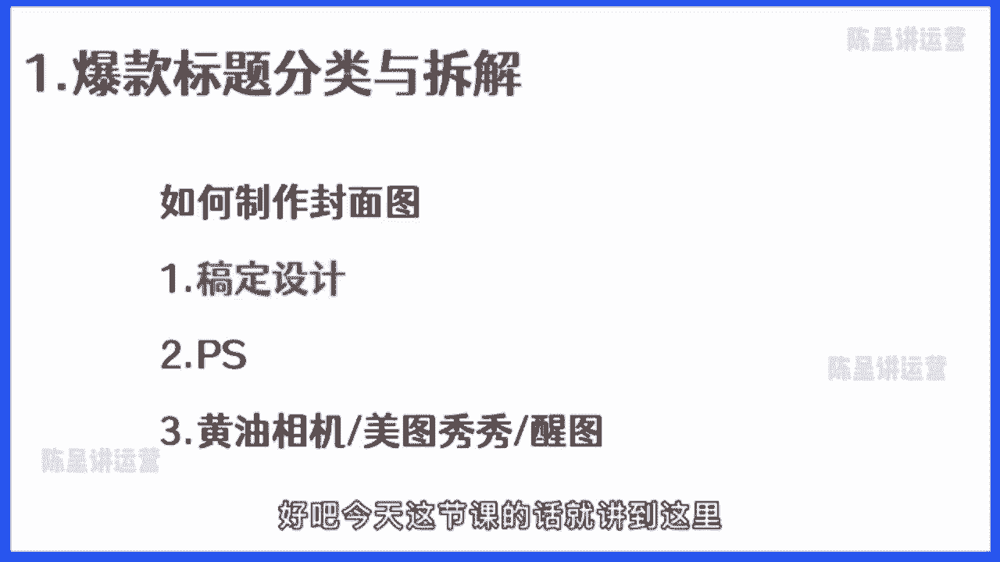