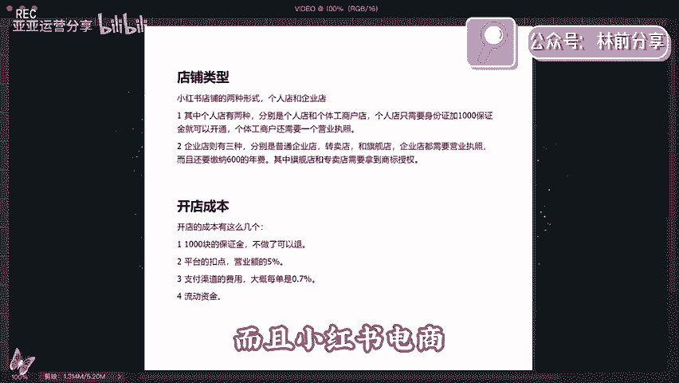

# 【2024版小红书体运营教程】全B站最良心的小红书开店运营高阶教程合集！小红书体开店 起号真的快，赶快点赞收藏起来 - P1 - 亚亚运营分享 - BV1mH4y137GP

🎼也这么了。

🎼要说最近什么项目最火，那必须要提到小红书电商。最近几个月呢，几乎整个互联网都在讨论小红书电商。我关注的几个商业博主啊，包括一些付费社群都在讨论他。我朋友圈月入5位数甚至6位数的比比皆是。

这个项目在年初的时候，我其实就让团队跟进测试，在市面上买了一些课程学习到现单人单店一个月做个一两万块。我就用一个视频详细的给大家拆解一下小红书电商到底怎么。

我会把整个小红书电商的流程包括一些注意怎么开店么选品怎么做流量，一次性给大家讲清楚甚至都不用再去看别的相关视频和培训。

你就跟着我的视频去按图骥就足够你这个上开盈利视频的结尾呢我还会给大家准备一份资料里面有我找的课程啊，对你运营小红书电商呢会有很大的帮助，有需要呢直接去拿就可以了。

言归正传项目的逻辑其实也非常简单就三第一开店第二个选品个流一个讲先说开店开店其实没什么好说的首就是打开小红书，击左上角的菜单图标选择创作中心，点击更多服务这选项择店铺击立即入住就可以了。

你就按他官方要求提交资料入住就行了。😊，居然看到有人把小红书开店包装成一个项目拿出来卖。居然还有不少人买，这也是很奇特。这里跟大家说一下小红书店铺的两种形式。个人店和企业店。

其中个人店有两种分别是个人店和个体工商户店个人店只需要身份证加0证金可以个体工商户要一个营业执照，企业店多一企业店有3种包括普通的企业店专卖店旗舰店企业店都需要营业执，且要缴600费我刚开始运营红商的。

直选择个人店实下企业店和个人店一平台并没有对企业店有什么流量倾斜。唯一的区别是个人店你只能开一家而一份营业执照，你可以开三个店一个店果没好开再多的店都是没有用。

且小红商觉得不适合店形式去做的这是因为小红书的流量机制的商占比非常低再多店再多货有什么用呢？以只要你看到博主跟你讲小红书店我觉得扯淡小红书是要矩阵的话，但不是店铺矩阵。

而是账号矩阵这流量会跟大家细说开店的成本呢有这么几个0钱的保证金不退第二个平台的扣点营业额的个呢是支付渠道的费概每单是0。7。😊。

动资金啊一开始大家做呢可以有无货源的方式去做啊，对资金要求也不高。你刚开始呢准备个2000300块完全够了。开完店以后呢，我们下一步就是选品，我们应该在小红书上卖什么的选品其实也简单。

在其他平台上的爆款大概率在小红书上也能爆目前小红书呢，我是推荐三个渠道进行选品的。第一个是通过某东某宝上面找那种小红书平台调性的爆款产品。

身边有做电商的朋友他自己在某宝的店铺卖的爆款搬到小红书上第一篇笔开出单。第二篇笔单量就已经破百了。第二个呢是通过某音的那个精选联盟，你在某音的精选联盟排行榜，你可以看到现阶段哪些品卖的好。

符合小红书用户调性的产品，直接搬应测试就可以了。第三个就是某多多的这个销量排行榜选择适合小红书的类目排行榜，从中选择相应的爆品搬运到小红书整个选品的逻辑就是我们要利用市场来帮助我们选品。

而不是自己在那瞎想，我们要借助大卖家的选品能力来弥补自己选品上的不足。所以我们只要看到一个东西这些排行榜上的爆品是否跟小红书的人群有匹配的可能。如果有我就搬过来测一下？

相当于借助了别人的能力帮我们自己选品这样反而是最快且是最稳妥的选品方式肯定比你下册成功率要高很多。然后等你这个产品商家以后呢就到。😊，最重要的环节了，我们应该如何获取流量？小红书它是个种草平台。

你店铺九成以上的流量啊，都是来自你发的发的笔记。这就是为什么我之前说小红书不要铺店群而要做账号矩阵，尽可能都得发笔记耗流量。它的通路就是用户通过你的笔记对推产品产生兴趣。

到店购买堆一堆店铺铺一堆不如多笔多发几篇笔果怎在红书发笔红书商是否成功的关键小红直接效果红的用户群认知就比你直接发广告没有办法获得信任更不要提转化了你发笔记的时候。

一定要用一个素人的角度用户的角度去切站用户的角度去种内容官视角真有效这种种草笔记怎么其实也很简单，就是去各大平台的商品评论里比如某一某宝某东的商品买家秀找到好看的素材。

你直接文买家修改这些买家的评价就是商用的使体验天然用种草笔取不尽当你单个的S跑举证引流过批量红批量发布笔记。😊，店铺来引流来放大。那基本上整个小红书的电商的运营啊。

就是我上面分享的这些外面不管多少钱的培训啊，00块也，600块1万块也好，其实就是这些东西。有些培训可能还没有讲清楚啊。根据上面几个点，我给大家准备了一份资料，里面包括了小红书账号的起号运营的方法。

以及一份小红书电商的视频课程。你如果打算经营小红书电商，你也不用看别的东西，就跟着这份资料走，足够你开始盈利了。有需要的点赞加关注，在评论区回复红书电商，我分享给你。😊。

