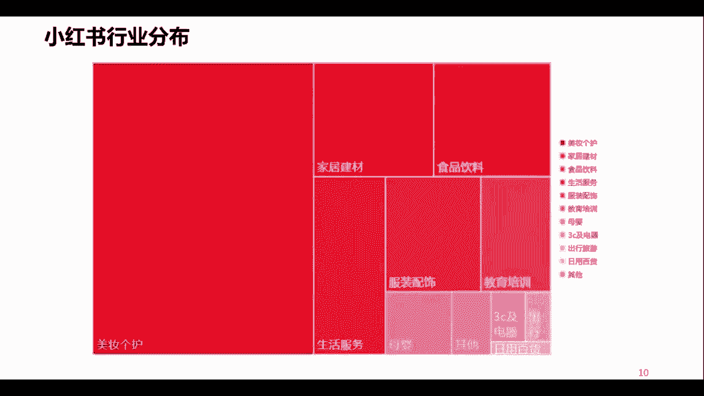

# 【2024版小红书体运营教程】全B站最良心的小红书开店运营高阶教程合集！小红书体开店 起号真的快，赶快点赞收藏起来 - P1 - 向往生活fa - BV1DEgKeHEw7

这世界上不缺梦想，有本事你就去实现它，别天天活的像个废物一样，要说目前什么项目最火，那就必须要提到小红书电商，最近半年时间，几乎整个互联网都在讨论，关于小红书电商的一些话题。

甚至我加过的一些付费社群也都在讨论它，所以我在7月份的时候啊，全程去跟进测试了小红书电商的玩法，到目前为止，数据好的店铺，每天的出单量稳定在50~100单之间，那今天我会用一个视频给大家讲清楚。

小红书电商到底应该怎么去玩，我会把小红书电商整个的操作流程，包括一些需要注意的关键点，一次性给大家说明白，其中包括如何开店，怎么选品，店铺流量怎么做，看完之后，你就会对小红书电商有了一个大概的认知。

那如果你的执行力跟悟性都还不错，只需要跟着我的视频拆解去实操一下，就足够你去运营好一个小红书店铺了，好进入正题，小红书电商整个项目的操作逻辑其实很简单，无非就是三个方面，开店选品，发笔记，获取流量。

我们先说第一个部分，如何开店，这一步其实非常简单，打开小红书，点击左上角三条杠，找到创作者中心，点击更多服务，然后选择开通店铺，点击立即开店，再按照要求填写相关的资料，就可以开通了，关于店铺的选择。

在这里给大家细说一下小红书店铺，它分为个人店和企业店，其中个人店又可以细分为，普通的个人店跟个体工商店，普通个人店只需要身份证，加上1000保证金就可以开通，而个人工商店在普通店的基础上。

需要多准备一个营业执照，企业店同样有两种，一种是普通的企业店，另一种是专卖店或者旗舰店，那开通旗舰店除了提供营业执照之外，还需要额外的缴纳600的年费，其实新手直接申请个人店或者个体工商店，就可以了。

根据我这边的操作经验，个人店和企业店，他的店铺的权重，店铺的流量基本上是没有什么差别的，那么开店的成本有这么几个，第一个就是1000保证金，这个钱当你不做的时候是可以退还的。

第二个就是小红书平台的扣点费，官方会收取你店铺营业额5%的扣点，说实话这个扣点其实还挺高的，第三个啊，你需要准备3000左右的流动资金，因为当你出单之后，你需要去垫资发货的，那我们开通店铺之后。

接下来就是第二步，选品到底应该在小红书上卖什么呢，大部分人肯定觉得啊自己没有货源啊，没有产品可以拿去售卖，其实某多多某宝阿里巴巴都可以设立的货源，关于选品其实也不难，一般来说我们可以根据爆款思维去选品。

只需要记住其他平台的爆款产品，我们拿到小红书平台大概率也会成为爆款，因为这些都是经过市场验证的产品，比起你自己一个人去瞎琢磨，经过市场验证的产品，爆单的几率肯定是大很多的。

在这里我推荐两个渠道去进行选品，第一个就是某多多，某多多每一个类目都会有一个销量的排行榜单，每天可以来这里逛一逛，找到那些符合小红书审美的产品，然后直接搬运测试。

第二个就是去抖音的精选联盟选品，点击这里的爆款版，然后进入联盟榜单，在这里能完美的了解到哪个品最好卖，对于新手来说啊，用爆款思维的方式去选品，反而是一件非常稳妥的选品方式。

好我们有了产品之后就到了第三步，这也是小红书电商最重要的一步，如何获取平台的流量，如何让客户购买你的产品，我们始终要明白一个点，就是小红书是一个种草平台，店铺90%的流量都来自于你的笔记内容。

客户之所以购买，就是因为看了你的小红书笔记，他感兴趣之后才会产生成交，所以如果想快速出单，一定是要去研究如何正确的在小红书上发笔记，这才是我们出摊的关键因素。

关于发笔记，首先我们要排除硬广告，小红书的客户群体啊。

对于广告是比较反感的，根据我们的经验，目前出单最快的方法就是批量去混剪视频，模仿同行的封面啊，批量去发布笔记，那具体的做法就是去其他平台，找到那些同行的产品素材，然后利用剪辑软件打乱素材的顺序。

替换背景音乐，然后做一些抽帧处理，基本上只要找到一个素材，就可以批量去混剪出几十条小红书笔记。

那如何去找爆款素材呢，当你选好产品之后，我们拿抖音举例，在抖音上扫一扫产品图片，就会出来很多的同款产品的视频素材，所以素材这块我们肯定是不缺的，那当你发布的笔记数量到位之后。

基本上一个星期左右就能产生成交，当你把单个账号的sop流程跑通之后，我们就可以开始做矩阵操作了，可以批量删号，批量发视频来放大我们店铺的流量，以上就是小红书电商运营的基本框架。

希望对大家会有一些小小的帮助，最后我也整理了一些关于小红书。

电商运营的文档，我更新到了工具箱里，那今天的分享就结束了，第二种方式呢叫做小红书啊，店铺啊，比如说你自己有啊，自有小红书店铺啊，或者是要去谈一些合作啊，或者要去谈一些合作，那么这个怎么做呢。

首先呢这里头也有三种方式，比如说第一种，第一种，第一种的话呢就是小红书的平台合作，这个呢需要大家呢登录小红书的电脑端，登录小红书的电脑端，在登录小红书电脑端之后呢，啊大家就可以看到啊。

小红书在电脑端里头有一个创作者服务是吧，哎在创作者那个服务那儿呢就能看到啊，有一个小红书的一个什么呢，唉这样一个小红书的一个合作啊，如果你是一个账号，你想要为别人带货进行一个什么引流变啊。

流量变现的话呢，你就可以通过那个渠道去实现一个变现，因为小红书的官方平台呢，它提供了一个很好的平台，这个平台里头呢它既有内容创作者，也有一些专业的一些什么呢，小红书账号的一些运营的机构啊。

比如说像一些MCN机构对吧，当然了，肯定也少不了大量的什么呢，商家在里头，也就是你加入了小红书的这样一个平台的话呢，相当于这个平台里头有专业的MCN机构，就是小红书账号。

专门运营这种账号的一些专业机构啊，还有什么呢，商家啊需要别人来给他带货的，还有就是像你这样的一些什么呢创作者，那么你来到这个平台之后呢，你想想商家可能会跟你合作，哎M3也可能会跟你合作，为什么呢。

他们主要就是什么呢，做这种账号孵化账号运营的，如果你的账号做得好，你很有可能进入到他们的一个什么呢，孵化阵营，那你的账号一定将来，而且或者说很大程度上将来会成为一个什么呢，头部账号。

这个呢大家可以登录小红书电脑端啊，去查看一下，第二种呢叫做自开小店，自己呢可以通过小红书呢开一个小店，哎，无论你是个人还是商家还是企业，无论你是否有营业执照对吧，都可以，大家呢可以在你的手机上哎。

打开小红书的什么呢，那三道杠啊，点进去之后呢，有一个创作者服务中心进去之后呢，你就会发现哎开通啊，或者是叫什么成为专业号啊，成为专业号，在成为专业号，那里头呢有一部就是开通小店是吧，个人也可以开小店。

商家企业也可以开小店啊，大家呢可以打开手机app啊，小红书的app呢去操作一下，那么你开了小店之后呢，你就可以自己上线啊，上架自己的一些商品，企业呢可以上架自己的一些什么呢。

所生产或者所经营的一些什么呢商品啊，那么也可以实现一个什么呢，带货变现好，最后一点呢叫做企业号营销啊，企业号营销啊，企业号营销呢说实话我们都知道，如果你是一个企业，你是一个商家的话呢。

你也可以直接跟小红书的商场进行合作啊，你可以把你的货啊供应给小红书，二成为这个小红书的自营啊，你只需要负责供货就行，然后你通过自己的小红书账号呢，为你的这个商品呢进行引流，那么这个呢就叫做企业号的营销。

企业号为自己商品，为自己的这样一个店铺，或者是为小红书给你的这样一个经营的，这样一个商品去进行一个引流啊，那么这些呢，就是我们如果说自己有了小红书的店铺，或者是跟别人专业性的去合作啊，进行变现啊。

流量变现的一种方式啊，进行流量变现的一种方式，好那么讲到这了，那么肯定有的人就问了，那么我在带货的时候，我应该怎么带货呢是吧，尤其是我自己要有店铺的话，我自己要店铺的话。

我这个店铺里我写小红书笔记的时候，我带我店铺里这些商品有没有什么技巧，有没有什么讲究呢。

啊当然有啊，后面呢会给大家讲到，接下来呢我们看一下小红书这样一个平台，它的整体的一个用户结构，我们根据这个数据呢可以看出来啊，在小红书整体的用户结构当中呢是女多男少，那么这个呢也肯定啊，大家也能看出来。

也能感受到平时呢喜欢逛这些购物平台，或者经常泡在这样一些购物app上的呢，多多是女性为主对吧，那么并且女性呢或者说年轻的女性呢，她是占据了我们整个消费市场，可以说是一个相对来讲。

是一个主导性的这样一个地位，所以呢现在呢我们也经常说一个词叫做他经济，这个她呢是女字旁的那个她啊，她经济时代啊，所以说这个女性呢是小红书的主流用户，所以大家呢就要去考虑一下，将来如果做小红书的时候呢。

就要去考虑一下，我生产的这样一个小红书的内容，我做的这样一个内容是否符合小红书，小红书这样一个主流用户的一个喜欢呢，是吧好，接下来看一下他的年龄结构，小红书的年龄结构呢是19岁到30岁。

或者我们可以这样理解，20岁到30岁的用户为核心，相对来讲呢是偏年轻一些啊，相对来讲呢偏年轻一些，而且呢是以女性为主，那么大家就知道了，如果你公司的目标客群正好匹配啊，小红书的这样一个用户特征。

那么小红书肯定也会成为你的公，司的不二之选啊，或者是一个重要的一个选择，但是如果你公司啊，这个产品针对的目标客群，跟小红书的主要用户大相径庭啊，很不吻合，那你在这上面你就要去考虑一下。

是否要去将小红书作为你的一个主要阵地，所以我们了解这些数据呢，最主要的目的呢，就是能够让我们将来在做小红书运营的时候，不管是是否选择小红书啊，是否将小红书作为一个主要的一个平台，或者阵地。

在小红书上面生产一些内容，应该符合什么样的人的一些阅读习惯，或者是一些内容的一些胃口啊，我们呢就有了一个大概的一个什么呢图谱啊，有了一个大概的一个参照，那么这个呢就是小红书的一个用户结构好。

接下来呢我们说一下，刚才我们也提了，说小红书呢，它事实上它是一个电商平台，那么从本质上来讲呢，小红书呢是属于一个内容电商啊，那么说到电商呢，我们也跟大家讲一下，就是纯粹意义上这个电商啊。

电子商务就是通过一个网络渠道啊，去进行一些什么呢，商品的推广销售，那么呢在这个领域当中呢，啊，业内呢也有的人呢把它归结为了三个发展阶段，第一个发展阶段呢业内的人呢叫做电商一点，零时代也叫做综合电商时代。

综合电商，什么叫综合电商呢，大家想想从零几年啊，就是05年，那个时候05年左右，而那个时候呢就已经有很多电商平台呢，逐渐慢了冒了出来，你比如说那个时候淘宝这个平台啊，我们在上面呢哎各行各业各种商品。

各种类型的东西我们基本呢都能买得到，而且各种各样的卖家是吧，有企业有个人啊，有生产商是吧，还有经销商是吧等等，所以呢它上面的商品类目呢五花八门，那么这个呢就叫做电商1。0时代。

那么综合电商当时候呢我们都知道，很多时候，我们想要把一个店铺的流量做起来是吧，我们都要去靠一些什么呢，哎比如说啊花钱找点人是吧，要么呢就是花钱去做这个钻展，去做直通车是吧，或者是通过一些什么呢。

其他的一些付费推广，来为我们的店铺呢进行引流，那么发展到后来的时候呢，我们发现这个综合类的电商呢，成为了一种什么呢，强者愈强的平台啊，大家呢也可以做一个尝试，比如说在座的各位啊，各位听课的朋友们。

我相信你们都是淘宝的买家，你们呢如果感兴趣呢，可以把我是买家呢变更为我是卖家，当然这中间呢可能会涉及到一些唉，执照方面的一些资质的认证啊，你比如说变成我是卖家了，你做一个新的一个卖家，新的一个什么呢。

商家唉，你可以，比如说把你们公司的商品上货到你的店铺，或者是什么呢，去这个呃一些，比如说像什么1688啊这样一个平台上面呢，去找一些那种一件代发的商品，上架到你的店铺啊。

那么你呢就会发现你的店铺做的好好的是吧，包括店铺也起了个好听的名字，也做了店铺装修啊，商品类目也划分的挺好，然后呢你可以找一个朋友，通过他的账号呢在平台上呢搜索你的店铺。

你会发现很大概率上是搜不到你的店铺的，为什么呢，因为在这里头呢他有一个临界值啊，有一个临界值，就综合类的这种传统电商，他有个临界值，如果你的店铺的各项指标啊，突破不了那个临界值的话。

你的店铺是很难有访客量，或者就是说很难有流量的，所以呢这就需要你的店铺呢，投入大量的这样一个费用啊，人力去进行一个什么呢推广，所以呢他花费了很多的经费啊，所以说很多企业呢也是对这方面呢，也是痛之已久。

那么再到后来呢，电商2。0时代就来了，电商2。0时代呢就是垂直电商时代，我记得之前呢一位互联网大咖呢，说过这样一句话，说互联网加的出现，让360行变成了3600行，各行各业都在垂直细分。

那么电商也会出现是吧，比如说卖药品的，有电药品的电商平台，卖家居的，有家居类的电商平台是吧，哎卖这个母婴用品的，有母婴类的电商平台，卖这个女性类时尚类的这样一些用品的，有这方面的垂直平台，唉卖美妆类的。

有美妆类的垂直的电商平台，他开始走这种垂直化发展，但是呢垂直化发展呢，这又一个问题来了，就是用户的价值最大化很难做到，因为你想啊，比如说一个举举个例子，一个做美妆的一个电商平台，它虽然很垂直。

但是来到这个平台上买美妆的用户，他除了买美妆之外，难道他就没有其他的消费需求吗是吧，所以用户的价值最大化呢很难做到很好，所以呢对于辛辛苦苦做了很多工作，来了一个流量，发现这个流量的价值很难做到最大化。

很难做到理想化，所以呢垂直电商呢也遇到了一些发展中的一些，什么呢问题，尤其是不管是传统的综合电商还是垂直电商，都面临着一个最最最共性的一个关键问题，就是流量的获取问题对吧。

那么很多公司做电商做流量靠什么呢，靠砸钱，所以呢也是时代的产物，就出来了一个什么呢，电商3。0的一个阶段，那么电商3。0呢，就是我们现在所讲的内容电商，那么内容电商呢。

大家可以从中间呢给他分开来理解一下，内容是什么，内容是做流量的，电商是什么，电商是做销量的，所以说内容电商呢它很好地解决了流量怎么来，销量，怎么产生这样一个问题，那么我相信大家呢啊这几年来呢。

尤其是近几年呢，大家也可能发现了，不管是你的淘宝app，京东app啊，还是其他的一些电商型的平台，也发现了有这种类似于种草啦或者是什么呢，分享的这样一些内容的一些频道，或者是板块对吧。

所以说呢像以前一些传统性综合的电商平台呢，也开始逐渐意识到了什么呢，内容的一个必要性和内容的一个价值性，那么比如说像我们平时看的短视频带货，直播带货，严格意义上讲呢。

这些呢也可以理解成是通过内容带来流量，把流量转化为销量，其实呢跟内容电商呢如出一辙，所以说小红书的本质呢就是通过内容啊，通过内容，然后呢我们解决好这个流量，然后呢我们再通过平台上的什么呢。

店铺解决好这个销量，所以说呢小红书呢，其实呢它就是通过这样一个P，帮助企业呢解决了流量的一个困扰，同时呢又能够带来销售增量，或者是销售转化的这样一个平台，所以呢小红书的本质呢其实就是内容电商啊。

或者说呢我们用一个比较新潮一点的词内容，这一方面我们可以理解成是自媒体板块，电商这方面可以理解成是自商业板块，所以呢小红书呢，也可以理解成是自媒体加自电商啊，就是通过小红书这个平台呢。

我们可以实现流量的获取啊，销售量的促进啊，或者是展转化啊，好，那么我们先简单的了解一下，小红书的一个什么呢，导流的一个逻辑，我们看一下我们在小红书上面呢，把一个个人呢我们把它叫做小红薯是吧。

当然呢企业也可以叫小红薯啊，我们做一个个人的一个小红书用户，我们可以去分享一些内容，那么在小红书上面呢这个内容呢它叫做笔记啊，叫做笔记，为什么叫笔记呢，你想想第一个小红书呢。

希望自己的这样一些用户呢能够持续性的啊，去创作一些什么呢，商品或者是一些购物的一些体验，一些分享，所以呢你每一次购买一些东西，或者看到一些好物啊，或者是体验到了一些好的商品，你是不是要记录啊。

是不是要分享呀，所以呢这个呢他就把这个叫成了一个笔记，那么个人小红书啊，个人小红薯呢他可以做，比如说我可以针对于某一个商家的产品，针对于某一个单品，或者是针对于某一系列的产品商品。

我可以去进行一个什么呢分享啊，比如说我买了一件上衣，这件上衣穿上去之后呢，哎显白显瘦，材质也好，面料也舒服，款式呢颜色百搭对吧，那么像这种衣服买回来之后呢，我觉得挺不错的。

哎我就可以通过小红书去进行一个分享，让更多的人看到这个笔记之后呢，可以呢去关注我买的这个商品，诶这个商品真不错哈，唉在哪儿买的呢，我也去看一下是吧，哎就可以起到这样一个作用。

那么这样的流量就很容易来了对吧，他通过这个笔记呢相当于就是在辐射哎，对这方面感兴趣的一个人，然后呢去到什么呢，看到商家的这样一个商品，甚至说什么呢，去到商家的这个店铺或者商城里头，然后呢进而产生销售。

同样如果是一个个人小红书，做这种内容做得非常的优秀啊，做的很好啊，也会呢被一些商家呢主动性的关注到啊，进而呢去做一些合作啊，比如说我是一个做美妆的一个小红薯，我做的内容呢被一些商家呢看到了。

这些商家呢还认为我的小红书这个美妆的笔记，内容呢写的还算是有质量，再加上呢这些商家呢，他本身呢他也是做这种什么呢美妆各户类的，所以呢他可能就会跟我进行一个合作类的沟通，那么这样呢也会产生一种什么呢。

个人创作的一种变现，当然啦在小红书上面呢还有另外一种身份，另外一种性质的一个账号啊，这也是常见的第二种，第一种是个人，第二种就是企业类的小红书啊，企业类，那么企业链类呢。

一般情况下呢是针对于自己的一些商品呢，可以去进行一些推荐介绍啊，或者是我们用个网络词啊，就是安利给你啊，那么这样一些内容呢就是什么呢，企业呢可以通过这样一个平台呢，向我们的用户啊。

向企业的目标消费者去进行，一个商品的一些什么呢利好或者是什么呢，一些优点价值点的一些释放，从而呢让自己的目标用户哎，目标消费者呢哎能够看到这个内容，看到这个内容之后呢，会对自己的产品呢产生一定的什么呢。

兴趣或者欲望，从而呢我们能够把这些目标用户，目标消费者呢，导流到企业自己的店铺或者是商城当中，进而产生销售啊，当然我这儿呢还写了一种有的个人小红书呢，他做这个内容，他不为带货，也不指望着什么合作。

可能他就是纯粹的把小红薯呢啊，把把小红书呢当成了一个什么呢，当成了一个自己记录或者是分享的一个平台啊，每次呢去写一些普通的一些笔记啊，去写一写，分享一下，或者说有的人呢把小红书呢，当成一个自媒体在做啊。

这种情况呢也是有的，我们也是经常能看到，但是从专业的角度呢，我们应该发挥小红书本质的一个最根本的价值，就是通过不管是个人还是企业的账号，去通过内容创造流量，将流量呢进行一个什么呢合理的转化啊。

也就是不管是个人还是企业，通过这个平台呢可以实现变现营收，那么这个呢就是小红书最根本的一个，导流的一个逻辑啊，好那么讲到现在呢，其实呢整体上呢先给大家讲了一下小红书啊，是一个什么样的一个情况。

是一个什么样的一个平台，希望很多人呢要正视这个平台啊，也是一个非常不错的一个平台啊，也是在我们运营当中呢经常会用到的好，接下来呢我们看那么小红书，既然是这样一个平台，那我们应该怎么样去运营它呢。

是我们写点笔记流量就会来吗是吧，这个时候呢我们就要不得不考虑，小红书最根本的一个点，就是小红书的一个什么呢，流量机制，小红书的流量机制，小红书的内容是怎么样让用户看到的呢，他的流量是怎么来的呢。

那么讲到这儿呢，我们呢先跟大家说一下，小红书这个平台呢是一个去中心化的平台，或者说呢也有人把它叫做什么呢，是有一个什么呢，智能算法在里头的，它有一套算法机制在里头啊，我们跟着这个例子往下走啊，比如说。

在座的啊，各位你们是创作者，你们创作发布了一个什么呢，小红书的笔记内容唉，通过小红书发布出来，发出来之后呢，哎小红书的这个算法系统呢先进行一个审核，如果系统审核哎，你没有违反相关的法律法规啊。

没有违反小红书的一个社区公约啊，就是它的内容的一个规范，没有违反这些就会进入到下一步，如果说你的内容做出来之后，系统审核之后发现有问题，有违规问题啊，那么他就不会给你通过，那么因为这是系统审核。

我们都知道系统再智能化，它也智能不过人的大脑对吧，所以呢系统审核不过之后呢，会有一个什么呢人工审核的环节啊，这也是这这这种平台呢对我们每一个创作者呢，可以说是很大的一个尊重。

而不能说系统不过就不过了是吧，它会启动一个人工审核，那么如果人工审核还是不通过，那你这个内容到此为止，你不会再有任何的流量了啊，好接下来如果说人工审核通过了，人工审核通过，人工审核通过了呢。

跟系统审核通过一样，会进入到下一步，那么进入到下一步呢，系统呢还会进来进入下一次，下一轮人的这样一个什么呢，审核什么呢，消重，什么叫消重呢，就是大家想一下，任何一个平台。

都不希望自己的用户看到的是重复或者，高度近似或雷同的内容，对不对，所以说呢这个算法系统呢，会先对我们每一位创作者创作的内容呢，进行一个什么呢，消重就是重复度方面的，相似度方面的雷同度这些方面的一个检查。

看看我们做的这些内容，是不是跟小红书平台上，之前某个用户创作的内容很像，高度近似或者是雷同或者一模一样，那么如果有这种情况，他的系统呢就认为你这个内容呢，触发了这样一个消除的条件。

那么你这个内容呢就会被系统消除，那么被系统消除会怎么样呢，没有流量，你的内容基本也就到此为止啊，除非说你的账号有点粉丝，那也就粉丝能看得到，看一看就可以了，那有的人说，那我的内容要是消重也通过了呢。

我没有被系统消除，我的这个内容是我自己的真情实感，我自己原创的，那下一步会怎么着呢，下一步呢小红书的系统呢会基于你的内容，比如说你写的标题呀，哎你做的图片呀，你拍的视频啊，你写的笔记的那个文字内容啊。

那篇文章啊啊或者那几句话呀，它会通过这个内容来识别你的内容，是属于什么样的定位，属于什么样的分类，当它识别到你的这个内容是属于什么分类，什么类别的时候呢，他就开始什么呢去检索唉。

在我整个小红书的用户当中，有哪些人是对这类内容感兴趣的啊，他呢先找到这样一些人，先找到小部分的这样一些人，先把你的笔记的内容呢展现给这些人看，看这些人啊刷小红书的时候，看到你的内容会不会认真地阅读。

会不会给你点赞，会不会评论，会不会收藏，或者说会不会成为你的粉丝，他要看这样一个用户的行为啊，如果说用户的行为说哎大家刷到了你的内容，好多人在看是吧，而且会有人评论，会有人点赞啊，会有人收藏。

会有人关注你成为你的粉丝，那么他的系统呢，就认为你的内容呢是一篇好内容，既然是好内容，那么它的系统就会给你往下接着推，推给更多的匹配兴趣匹配的用户去看，但是如果说你的这个内容。

小红书这个系统给你小批量的推给了一些人，这些人刷到你的内容呢，并没有去什么呢，并没有去看，或者是进去刷了一下，闪了一眼人就跳出了，没有评论，也没有多少点赞啊，或者是也没有什么人关注你。

那么小红书的系统呢，就会认为你的这个笔记内容呢，质量呢一般或者是质量不好，不不受用户的喜爱，那么像这样不受用户喜爱的内容，那小红书的系统当然也知道，他不可能让你这个内容给更多的人去看，对不对。

哎所以说你的用你的内容，只要用户愿意看，愿意给你评论点赞，愿意跟你互动，愿意关注你，达到了它的一个衡量标准，那么就会进入到下一步，以此类推，那么在这样一个不断的给你叠加推荐，这样一个过程当中呢。

如果有人哎觉得你这个内容有问题，给你举报了，或者是投诉你了是吧，向平台投诉你了啊，或者是什么呢，在评论区里头爆你的一些黑料负面，那你想想任何一个平台的运营方，肯定他要考虑这样的内容被用户举报了。

被用户投诉了，或者是给用户带来了一些不舒服的体验了，那么像这样的内容，平台是不是要再去认真的定夺一下呀对吧，所以平台呢就会再次启动一个人工复审，他要去判断你的内容，是不是真的能给用户带来不舒服的体验。

你的内容是不是真如那些投诉举报里所说的，存在那样的一些问题，如果有你的内容也就到此为止了，不会再有新的流量增长，如果人工复审说哎你不存在是吧，没有他们反映的那些问题啊，没有那些问题，那么你的这个内容呢。

就会根据实际的效果反馈啊，接着往下推荐啊，接着往下推荐，所以说大家听完这样一个流量机制啊，听完这样一个流量机制呢，也就明白了，这就是为什么大家在用小红书的时候，发现你看什么样的内容越多。

你就会收到什么样的内容啊，越来越多的收到什么样的内容，因为它识别到了每一个用户的兴趣兴趣标签，它也能读取到每一篇笔记内容的什么呢，标签定位，甚至是每一个账号的标签定位。

从而呢它的系统呢做了一个匹配性的一个推荐，对吧，做了一个匹配性的推荐。

那么再往下，我们看一下小红书的主要内容的一个分布啊，你比如说占到了半壁江山的啊，占到了半壁江山的还是美妆客户，所以这也就不难看出，为什么小红书的主要用户是年轻的女性了是吧，好第二个是家居建材类的是吧。

包括食品饮料类的，然后还有什么呢，生活服务啊，服装配饰，这也是一个大类啊，这也是常见的哈，包括教育培训啊，像其他的呢也有一些啊这些，所以大家在做小红书的时候呢，也可以积聚啊，基于这样一个内容的分布啊。

内容的比重啊去考虑啊，去考虑一下，是否涵盖了你所在企业的一个什么呢，业务类型或者是商品的一个类比啊，所以说我们知道做小红书，或者我们在任何一个平台上去做运营，必须得考虑这个平台的主流的用户。

都喜欢什么样的内容，因为每个平台都有每个平台的特征，对于每个平台的用户的喜好对吧，嗯这个你是不可更改的啊，不可更改的，所以说呢一定程度上呢，我们要去借着这样一个东西，去做我们自己企业的一些唉电商。

或者做我们个人想做的一些有意思的，或者是优质的内容好，这是小红书行业整体的一个分布，那么再往下，我们看一下小红书的主要内容的一个分布啊，你比如说占到了半壁江山的啊，占到了半壁江山的还是美妆客户。

所以这也就不难看出，为什么小红书的主要用户是年轻的女性了是吧，好第二个是家居建材类的是吧，包括食品饮料类的，然后还有什么呢，生活服务啊，服装配饰，这也是一个大类啊，这也是常见的哈，包括教育培训啊。

像其他的呢也有一些啊这些，所以大家在做小红书的时候呢，也可以积聚啊，基于这样一个内容的分布啊，内容的比重啊去考虑啊，去考虑一下，是否涵盖了你所在企业的一个什么呢，业务类型或者是商品的一个类比啊。

所以说我们知道做小红书，或者我们在任何一个平台上去做运营，必须得考虑这个平台的主流的用户，都喜欢什么样的内容，因为每个平台都有每个平台的特征，对于每个平台的用户的喜好，对吧嗯这个你是不可更改的啊。

不可更改的，所以说呢一定程度上呢，我们要去借着这样一个东西，去做我们自己企业的一些哎电商，或者做我们个人想做的一些有意思的，或者是优质的内容好。

这是小红书行业整体的一个分布，那么了解了这个之后呢，接下来我们就要注册一个账号啊，注册一个账号，那么大家看到这个账号呢，我们知道这是账号的一个主页，小红书账号的一个主页，那么在我们注册的时候呢。

我们往往呢会遇到呃，比如说头像啦啊，昵称啦是吧，还有这个简介，那么像这个地方呢，我们一定程度上呢可以去进行一个什么呢，匹配的一个创作，比如说你分享的是美妆的，那么就可以找公司的一个什么啊代言人啦啊。

或者是公司里有一个什么呢，有颜值啊什么的一个啊员工啦，或者是什么哈，或者是自己的肖像啦，但是一定要记得需要有代表性的啊，是要有代表性的，包括昵称也是要让人一看到你的昵称，就大概能够感觉到你是做什么的啊。

这个账号简介呢，这个账号简介呢一定要记得要说明自己的身份，有些企业或者有些个人呢，在小红书上面呢并没有开通自己的店铺，所以呢他可能需要往其他的平台呢，去进行流量的一个引出啊，把流量引到其他的平台上。

才能实现进一步的转化，那么这个时候呢，你也可以在这个地方呢去做一个标注，但是这个标注呢一定要注意，不要违反小红书平台的一个社区公约啊，在一些呃字上面呢要注意好，那么在我们用账号的。

尤其是第一次用账号的时候呢，也经常会遇到这样一个界面，就是让你选择自己感兴趣的一个类目啊，那么大家呢可以去选择什么呢，四个啊，那么小红书虽然可以去选择四个，但是我要告诉大家。

如果你们是星座小红书账号的话，第一次做账号重点做第一类，其他三类呢辅助去做，而且这四类之间呢要有关联啊，要有关联，你比如说我们在这选搞笑类啊，这是自媒体类的是吧，哎那么还有什么呢，男士搭配。

因为时尚类的男士肯定也喜欢搞笑，还有什么呢，他们也喜欢情感，还有什么呢，他们也喜欢运动对吧，你可能要做一个什么呢，关联啊，做一个关联，你可能有的人会说哎，时尚类的男士也可喜欢科技树吗。

这个呢稍微有一点牵强，因为不是所有的男士或者年轻的男士们，都喜欢科技数码对吧，所以说呢尽量呢能够哎呀自然地衔接在一起啊，比如说搞笑啊啊男的啊喜欢有趣的东西啊，情感类的东西，我们可以进行一个自然的衔接啊。

那么重点呢我们及其中一类，比如说搞笑情感，这个呢，我们刚才看了那个小红书内容的一个分类，它不是主要的一个类目对吧，不是主要的类目好，那么什么是主要的类目呢，我们刚才说了是吧，哎这个服装搭配。

那么就把它作为我们账号的一个一开始啊，或者叫什么叫初始化，或者叫冷启动的时候的一个什么呢，核心的一个账号内容定位，也就是意味着我的账号一开始，我所创作的笔记内容就是围绕着这个方面去做。

当然啦我说的这个呢更侧重于个人账号，如果你是企业账号的话呢，一定要记住基于你企业自身的产品，自身的业务类型去选择啊，那么这个呢就是我们在一开始做账号啊，建设账号初始化的时候呢要考虑的一个东西啊。

要考虑的一个东西好，当我们把账号注册好了之后，我们刚才讲过了小红书的这个系统呢，它是一套智能算法的系统对吧，我们创作的内容呢，它能够识别到我们内容的一个什么呢，内容标签，那么我刚才也讲了。

小红书对我们每一个用户呢也都有兴趣，标签或者是账号定位方面的一个识别，那么说到这个点呢，有一个问题就来了，哎我自己做的这个小红书的账号定位，它的智能算法那个系统是怎么样才能知道呢，他怎么知道的是吧。

难道我得跑到小红书公司哎，趴到服务器旁边跟他服务器说吗，那显然是啊，不可能啊，那怎么办呢，所以这里呢我们呢有一个笨办法啊，就是什么呢，做一个养号，那么了解了这个之后呢，接下来我们就要注册一个账号啊。

注册一个账号，那么大家看到这个账号呢，我们知道这是账号的一个主页，小红书账号的一个主页，那么在我们注册的时候呢，我们往往呢会遇到呃，比如说头像啦啊，昵称啦是吧，还有这个简介，那么像这个地方呢。

我们一定程度上呢可以去进行一个什么呢，匹配的一个创作，比如说你分享的是美妆的，那么就可以找公司的一个什么啊代言人啦啊，或者是公司里有一个什么呢，有颜值啊什么的一个啊员工啦，或者是什么哈。

或者是自己的肖像啦，但是一定要记得需要有代表性的啊，是要有代表性的，包括昵称也是要让人一看到你的昵称，就大概能够感觉到你是做什么的啊，这个账号简介呢，这个账号简介呢一定要记得要说明自己的身份。

有些企业或者有些个人呢，在小红书上面呢并没有开通自己的店铺，所以呢他可能需要往其他的平台呢去进行，流量的一个引出啊，把流量引到其他的平台上，才能实现进一步的转化，那么这个时候呢。

你也可以在这个地方呢去做一个标注，但是这个标注呢一定要注意，不要违反小红书平台的一个社区公约啊，在一些呃字上面呢要注意好，那么在我们用账号的，尤其是第一次用账号的时候呢，也经常会遇到这样一个界面。

就是让你选择自己感兴趣的一个类目啊，那么大家呢可以去选择什么呢，四个啊，那么小红书虽然可以去选择四个，但是我要告诉大家，如果你们是星座小红书账号的话，第一次做账号重点做第一类，其他三类呢辅助去做。

而且这四类之间呢要有关联啊，要有关联，你比如说我们在这选搞笑类啊，这是自媒体类的是吧，哎那么还有什么呢，男士搭配，因为时尚类的男士肯定也喜欢搞笑，还有什么呢，他们也喜欢情感，还有什么呢。

他们也喜欢运动对吧，你可能要做一个什么呢，关联啊，做一个关联，你可能有的人会说哎，时尚类的男士也可喜欢科技树吗，这个呢稍微有一点牵强，因为不是所有的男士或者年轻的男士们，都喜欢科技数码对吧。

所以说呢尽量呢能够哎呀自然地衔接在一起啊，比如说搞笑啊啊男的啊，喜欢有趣的东西啊，情感类的东西，我们可以进行一个自然的衔接，那么重点呢我们及其中一类，比如说搞笑情感，这个呢。

我们刚才看了那个小红书内容的一个分类，它不是主要的一个类目对吧，不是主要的类目好，那么什么是主要的类目呢，我们刚才说了是吧，哎这个服装搭配，那么就把它作为我们账号的一个一开始啊，或者叫什么叫初始化。

或者叫冷启动的时候的一个什么呢，核心的一个账号内容定位，也就是意味着我的账号一开始我所创作的笔记，内容就是围绕着这个方面去做，当然啦我说的这个呢更侧重于个人账号，如果你是企业账号的话呢。

一定要记住基于你企业自身的产品，自身的业务类型去选择啊，那么这个呢就是我们在一开始做账号啊，建设账号初始化的时候呢，要考虑的一个东西啊，要考虑的一个东西好，当我们把账号注册好了之后。

我们刚才讲过了小红书的这个系统呢，它是一套智能算法的系统对吧，我们创作的内容呢，它能够识别到我们内容的一个什么呢，内容标签，那么我刚才也讲了，小红书对我们每一个用户呢也都有兴趣。

标签或者是账号定位方面的一个识别，那么说到这个点呢，有一个问题就来了，哎我自己做的这个小红书的账号定位，它的智能算法，那个系统是怎么样才能知道呢，他怎么知道的是吧，难道我得跑到小红书公司哎。

趴到服务器旁边跟他服务器说吗，那显然是啊，不可能啊，那怎么办呢，所以这里呢我们呢有一个笨办法啊。

就是什么呢，做一个养号，各位朋友大家好，欢迎来到本次课程，这堂课呢我们继续讲小红书的运营，那么接下来呢我们要讲的是小红书，在账号准备好之后呢，接下来我们就要进入到一个小红书，内容的一个创作环节。

那么首先呢我们要再强调一个点，小红书呢本身是一个内容电商平台，它通过笔记内容的创作呢来获取流量，获取更多的兴趣用户，然后呢将这些流量，这些兴趣用户呢去更好的转化成我们企业。

或者是我们产品所需要的一个什么呢，实际的一个销售量，那么小红书的笔记如何创作呢，那么接下来我们看首先第一个点，我们要考虑笔记的选题，笔记选题应该怎么选呢，不管我们做的是个人账号还是企业账号。

我们首先能够明白的是，我们在创作一篇笔记内容的时候，我们需要对什么样的商品，什么样的一个产品去进行一个什么呢，内容的一个分享创作，或者是内容的一个展示或者推荐介绍，那么这个商品本身它都有什么样的优势呢。

比如说这个商品的材质，这个商品的原材料啊，这个商品的什么呢，工艺啊，这个商品的什么呢，呃一些使用的一些方法，或者使用的一些感受，商品的，比如说这个服务啊这些等等的，都属于商品的价值点啊。

那么同样呢我们可以将这些价值点呢去联系，去结合一下，我们所针对的这样一个商品的，目标用户的一些兴趣的关注点，那么我们的目标用户，针对于这些商品消费的时候，都有什么样的一些痛点。

或者有什么样的一些共性的行为特征呢，那么基于这两个点，我们就可以联系出很多具象的一些选题点，那么我们就可以将这些选题点呢，成为我们一篇笔记的一个核心的内容构成，而且呢我们在创作笔记的时候呢。

我们就要去思考我们即将要展现的这个商品，即将要创作的商品，他的体现都需要在哪几个方面，我们是通过视频来体现呢，还是通过图片和文字的方式来体现呢，那么这就涉及到了我们商品。

不管是图片还是视频方面的一个实拍，一个创作，当然如果你是个人账号啊，帮助一些商家去实现流量，实现一些带货的话呢，你也可以要求商家来给你提供一些素材啊，那么当我们有了这样一些内容的时候呢。

我们就要开始梳理我们这篇笔记的一个，整体的脉络，我们就要去想用户在购买这些商品的时候，最核心最主要的关注点在什么位置，那么这个关注点呢，就可以成为我们这篇笔记的一个什么呢，首要的一个什么呢。

内容诉求或者是一个切入点，甚至我们这篇笔记的标题，也可以围绕着这个点去进行展开好，那么这个呢是关于一个笔记内容的一个选题，那我们找好了选题，捋好了这个创作的思路，接下来呢我们就要去看一下。

笔记内容应该如何去创作，有什么样的技巧进步，各位朋友大家好，欢迎来到本次课程，这堂课呢我们继续讲小红书的运营，那么接下来呢我们要讲的是小红书，在账号准备好之后呢，接下来我们就要进入到一个小红书。

内容的一个创作环节，那么首先呢我们要再强调一个点，小红书呢本身是一个内容电商平台，它通过笔记内容的创作呢来获取流量，获取更多的兴趣用户，然后呢将这些流量，这些兴趣用户呢去更好的转化成我们企业。

或者是我们产品所需要的一个什么呢，实际的一个销售量，那么小红书的笔记如何创作呢，那么接下来我们看首先第一个点，我们要考虑笔记的选题，笔记选题应该怎么选呢，不管我们做的是个人账号还是企业账号。

我们首先能够明白的是，我们在创作一篇笔记内容的时候，我们需要对什么样的商品，什么样的一个产品去进行一个什么呢，内容的一个分享创作，或者是内容的一个展示或者推荐介绍，那么这个商品本身它都有什么样的优势呢。

比如说这个商品的材质，这个商品的原材料啊，这个商品的什么呢，工艺啊，这个商品的什么呢，呃一些使用的一些方法，或者使用的一些感受，商品的，比如说这个服务啊这些等等的，都属于商品的价值点啊。

那么同样呢我们可以将这些价值点呢去联系，去结合一下，我们所针对的这样一个商品的，目标用户的一些兴趣的关注点，那么我们的目标用户，针对于这些商品消费的时候，都有什么样的一些痛点。

或者有什么样的一些共性的行为特征呢，那么基于这两个点，我们就可以联系出很多具象的一些选题点，那么我们就可以将这些选题点呢，成为我们一篇笔记的一个核心的内容构成，而且呢我们在创作笔记的时候呢。

我们就要去思考我们即将要展现的这个商品，即将要创作的商品，他的体现都需要在哪几个方面，我们是通过视频来体现呢，还是通过图片和文字的方式来体现呢，那么这就涉及到了我们商品。

不管是图片还是视频方面的一个实拍，一个创作，当然如果你是个人账号啊，帮助一些商家去实现流量，实现一些带货的话呢，你也可以要求商家来给你提供一些素材啊，那么当我们有了这样一些内容的时候呢。

我们就要开始梳理我们这篇笔记的一个，整体的脉络，我们就要去想用户在购买这些商品的时候，最核心最主要的关注点在什么位置，那么这个关注点呢，就可以成为我们这篇笔记的一个什么呢，首要的一个什么呢。

内容诉求或者是一个切入点，甚至我们这篇笔记的标题，也可以围绕着这个点去进行展开好，那么这个呢是关于一个笔记内容的一个选题，那我们找好了选题，捋好了这个创作的思路，接下来呢我们就要去看一下。

笔记内容应该如何去创作，有什么样的技巧及好，那么再往下看呢，我们在发布小红书的时候，我们不是创作内容了吗，创作内容在发布小红书的时候呢，往往呢在这个地方呢有一个叫做参加话题是吧。

你看上面这个灰色的部分呢，它是要么就是上传你的视频，要么就是上传你的这什么呢，图片哎，多张图片哪一张做封面是吧，图片上面是不是还要做一些图片当中的一些，我们叫做画中标题，来在图片当中做一些标注啊是吧。

做一些标签儿啊，唉写一句话啦，是吧，要通过一些软件把它设计得特别漂亮，特别好看，色彩搭配要很唯美，是不是啊，这是在视觉部分好，那么下面这儿呢是写标题啊，这儿呢是写我们的正文，那么这个地方呢就很关键了。

参与话题，我们在创作小红书笔记的时候，我们要去思考一个点，如果我们能借上一些话题的力度，一定程度上是很容易把我们的小红书的流量呢，往上推一推的，那么这个话题呢虽然说借上它有利有好处，但是呢不能乱借是吧。

你比如说你明明做的是口红，我非要用一下这个话题舞蹈教学视频，那这肯定就有问题是吧，所以说你在参与话题的时候，你可以去搜索一下，或者通过这些板块去查一下，看看有没有匹配自己这个内容的一个话题，如果有。

那你就可以用过了，如果没有，那宁可不用啊，宁可不用好，再往下是什么呢，添加地点，这个地点要不要添加呢，我告诉各位，当然要啊，当然要添加这个地点，那个地点，那必须是你小红书登录的这部手机。

真真正正所处的一个地理位置，这是最好的啊，比如说你现在在北京啊，在北京哪呢，在北京的这样一个朝阳区是吧，那么你的地理位置就可以添加北京市朝阳区，相关的一个位置啊，你不能说你在北京市朝阳区。

你非要把自己的位置定位在什么呢，定位在这个其他的省份啊，或者是其他城市省份的一些城市，那么这个呢也是会影响你最终的一个效果的啊，为什么呢，因为小红书内容的推流呢有一个叫做什么呢，同城推流同城啊。

他会将你的内容呢进行同城用户的一个展现，那么我们知道同一个城市啊，同一个城市呢，对于我们内容的效果呢肯定是有帮助的，因为每个人城市都有每个城市的一个什么呢，一些什么呢文化啦，习俗啦啊，或者是一些什么呢。

呃城市的一些精神啊等等之类的哈，所以说呢我们尽量呢要考虑同城，而且同城的这样一些分享呢也有利于，比如说有一些做线下实体店的，也有利于你线下的一些导流啊，线下的一些道法，所以呢我们在发布的时候呢。

一定要注意这样一个技巧啊，要注意这样一个技巧，当然呢有的人说我可不可以通过电脑去发布呢，当然也可以，电脑发布有什么好处呢，啊这个呢就要说一说，我们在做小红书笔记的时候，如果说你做的是一个视频啊。

你做的是一个视频，那么这个视频呢，我们知道往往通过手机进行上传发布的话呢，有的时候呢会丢失一些什么呢，丢失一些像素或者是影响视频的一些高清质量，所以这个时候呢有些时候啊就是做视频的时候。

我们就需要通过PC端来确保，我们视频的一个高清的这样一个质量，那么PC端在哪里登录呢，大家可以呢去通过小红书平台啊，有一个创作者服务啊，在那里头呃，扫码就可以登录了啊，登录进去之后呢。

你就能看到有一个笔记发布的这样一个菜单，点进去之后啊，就可以进行发布了啊，在我们的PC就是电脑端啊，这是小红书发布的一些技巧啊，啊那么再往下看呢，我们在发布小红书的时候，我们不是创作内容了吗。

创作内容在发布小红书的时候呢，往往呢在这个地方呢有一个叫做参加话题是吧，你看上面这个灰色的部分呢，它是要么就是上传你的视频，要么就是上传你的这什么呢图片哎，多张图片哪一张做封面是吧。

图片上面是不是还要做一些图片当中的一些，我们叫做画中标题，来在图片当中做一些标注啊是吧，做一些标签儿啊，唉写一句话啦是吧，要通过一些软件把它设计得特别漂亮，特别好看，色彩搭配要很唯美，是不是啊。

这是在视觉部分好，那么下面这儿呢是写标题啊，这儿呢是写我们的正文，那么这个地方呢就很关键了，参与话题，我们在创作小红书笔记的时候，我们要去思考一个点，如果我们能借上一些话题的力度。

一定程度上是很容易把我们的小红书的流量呢，往上推一推的，那么这个话题呢虽然说借上它有利有好处，但是呢不能乱借是吧，你比如说你明明做的是口红，我非要用一下这个话题舞蹈教学视频，那这肯定就有问题是吧。

所以说你在参与话题的时候，你可以去搜索一下，或者通过这些板块去查一下，看看有没有匹配自己这个内容的一个话题，如果有，那你就可以用过了，如果没有，那宁可不用啊，宁可不用好，再往下是什么呢，添加地点。

这个地点要不要添加呢，我告诉各位，当然要啊，当然要添加这个地点，那个地点，那必须是你小红书登录的这部手机，真真正正所处的一个地理位置，这是最好的啊，比如说你现在在北京啊，在北京哪呢。

在北京的这样一个朝阳区是吧，那么你的地理位置呢，就可以添加北京市朝阳区相关的一个位置啊，你不能说你在北京市朝阳区，你非要把自己的位置定位在什么呢，定位在这个其他的省份啊，或者是其他城市省份的一些城市。

那么这个呢也是会影响你最终的一个效果的啊，为什么呢，因为小红书内容的推流呢有一个叫做什么呢，同城推流同城啊，他会将你的内容呢进行同城用户的一个展现，那么我们知道同一个城市啊。

同一个城市呢对于我们内容的效果呢，肯定是有帮助的，因为每个人城市都有每个城市的一个什么呢，一些什么呢文化啦，习俗啦啊，或者是一些什么呢，呃城市的一些精神啊等等之类的哈，所以说呢我们尽量呢要考虑同城。

而且同城的这样一些分享呢也有利于，比如说有一些做线下实体店的，也有利于你线下的一些导流啊，线下的一些道法，所以呢我们在发布的时候呢，一定要注意这样一个技巧啊，要注意这样一个技巧。

当然呢有的人说我可不可以通过电脑去发布呢，当然也可以电脑发布有什么好处呢，啊这个呢就要说一说，我们在做小红书笔记的时候，如果说你做的是一个视频啊，你做的是一个视频，那么这个视频呢。

我们知道往往通过手机进行上传发布的话呢，有的时候呢会丢失一些什么呢，丢失一些像素或者是影响视频的一些高清质量，所以这个时候呢有些时候啊就是做视频的时候，我们就需要通过PC端来确保。

我们视频的一个高清的这样一个质量，那么PC端在哪里登录呢，大家可以呢去通过小红书平台啊，有一个创作者服务啊，在那里头呃，扫码就可以登录了啊，登录进去之后呢，你就能看到有一个笔记发布的这样一个菜单。

点进去之后啊，就可以进行发布了啊，在我们的PC就是电脑端啊，这是小红书发布的一些技巧啊，嗯往下看，那么说到底影响小红书笔记内容的一个流量，关键点在哪呢，啊或者说提升流量还有什么样的一些技巧呢。

啊就是这三个点，第一个关键词，我们在写小红书内容笔记标题的时候，或者是笔记内容的时候，或者是做图片，做视频的时候，是否清晰，清晰匹配的体现了我们账号的垂直定位，清晰地体现了相关的一些关键词。

这个非常重要，第二个是权重嗯，虽然呢有些人说这些账号不存在权重这一说，但是呢我告诉大家，权重指的是什么呢，指的是你账号的一个活跃度，你要记住我刚才说的一句话，任何一个平台都喜欢活跃用户。

所以你经常活跃啊，有规律地去进行内容的更新发布，一定程度上是有利于你这个效果的一个什么呢，提升的第三个点是投放啊，大家都知道小红书呢，笔记呢有一个投放的一个渠道呢叫做薯条，它呢是可以通过付费啊。

通过付费，一定程度上呢可以提高你一个笔记的效果的，对吧，这个功能叫薯条，大家呢打开小红书啊，笔记啊，在笔记浏览那个界面右上角有三个点，点开之后呢就可以看到啊，下面底部呢有一个薯条功能，它呢是可以付费啊。

进行把笔记流量或者是点赞评论这些啊，做到一个更好的一个提升的啊，那么这三个点呢，也可以为我们小红书的笔记内容带来一个比较，哎来说比较是更好的一个效果啊，获得更好的一些流量啊，更多的一些流量啊。

所以这三个点呢大家呢也可以去使用一下啊，我往下看，那么说到底影响小红书笔记内容的一个流量，关键点在哪呢，啊或者说提升流量还有什么样的一些技巧呢，啊就是这三个点，第一个关键词。

我们在写小红书内容笔记标题的时候，或者是笔记内容的时候，或者是做图片，做视频的时候，是否清晰，清晰匹配的体现了我们账号的垂直定位，清晰地体现了相关的一些关键词，这个非常重要，第二个是权重嗯。

虽然呢有些人说这些账号不存在权重这一说，但是呢我告诉大家，权重指的是什么呢，指的是你账号的一个活跃度，你要记住我刚才说的一句话，任何一个平台都喜欢活跃用户，所以你经常活跃啊。

有规律地去进行内容的更新发布，一定程度上是有利于你这个效果的一个什么呢，提升的第三个点是投放啊，大家都知道小红书呢，笔记呢有一个投放的一个渠道呢叫做薯条，它呢是可以通过付费啊，通过付费。

一定程度上呢可以提高你一个笔记的效果的，对吧，这个功能叫薯条，大家呢打开小红书啊，笔记啊，在笔记浏览那个界面右上角有三个点，点开之后呢就可以看到啊，下面底部呢有一个薯条功能，它呢是可以付费啊。

进行把笔记流量或者是点赞评论这些啊，做到一个更好的一个提升的啊，那么这三个点呢，也可以为我们小红书的笔记内容带来一个比较，唉来说比较是更好的一个效果啊，获得更好的一些流量啊，更多的一些流量啊。

所以这三个点呢大家呢也可以去使用一下啊，第二种方式呢叫做小红书啊，店铺啊，比如说你自己有啊，自有小红书店铺啊，或者是要去谈一些合作啊，或者要去谈一些合作，那么这个怎么做呢，首先呢这里头也有三种方式。

比如说第一种，第一种，第一种的话呢就是小红书的平台合作，这个呢需要大家呢登录小红书的电脑端，登录小红书的电脑端，在登录小红书电脑端之后呢，啊大家就可以看到啊，小红书在电脑端里头有一个创作者服务是吧。

哎在创作者那个服务那儿呢就能看到啊，有一个小红书的一个什么呢，哎这样一个小红书的一个合作啊，如果你是一个账号，你想要为别人带货进行一个什么引流变啊，流量变现的话呢，你就可以通过那个渠道去实现一个变现。

因为小红书的官方平台呢，它提供了一个很好的平台，这个平台里头呢它既有内容创作者，也有一些专业的一些什么呢，小红书账号的一些运营的机构啊，比如说像一些MCN机构对吧，当然了，肯定也少不了大量的什么呢。

商家在里头，也就是你加入了小红书的这样一个平台的话呢，相当于这个平台里头有专业的MCN机构，就是小红书账号，专门运营这种账号的一些专业机构啊，还有什么呢，商家啊需要别人来给他带货的。

还有就是像你这样的一些什么呢创作者，那么你来到这个平台之后呢，你想想商家可能会跟你合作，哎M3也可能会跟你合作，为什么呢，他们主要就是什么呢，做这种账号孵化，账号运营的，如果你的账号做得好。

你很有可能进入到他们的一个什么呢，孵化阵营，那你的账号一定将来，而且或者说很大程度上将来会成为一个什么呢，头部账号，这个呢大家可以登录小红书电脑端啊，去查看一下，第二种呢叫做自开小店。

自己呢可以通过小红书呢开一个小店，哎，无论你是个人还是商家还是企业，无论你是否有营业执照对吧，都可以，大家呢可以在你的手机上哎，打开小红书的什么呢，那三道杠啊，点进去之后呢。

有一个创作者服务中心进去之后呢，你就会发现哎开通啊，或者是叫什么成为专业号啊，成为专业号，在成为专业号，那里头呢有一部就是开通小店是吧，个人也可以开小店，商家企业也可以开小店啊。

大家呢可以打开手机app啊，小红书的app呢去操作一下，那么你开了小店之后呢，你就可以自己上线啊，上架自己的一些商品，企业呢可以上架自己的一些什么呢，所生产或者所经营的一些什么呢商品啊。

那么也可以实现一个什么呢，带货变现好，最后一点呢叫做企业号营销啊，企业号营销啊，企业号营销呢说实话我们都知道，如果你是一个企业，你是一个商家的话呢，你也可以直接跟小红书的商城进行合作啊。

你可以把你的货啊供应给小红书，二成为这个小红书的自营啊，你只需要负责供货就行，然后你通过自己的小红书账号呢，为你的这个商品呢进行引流，那么这个呢就叫做企业号的营销，企业号为自己商品。

为自己的这样一个店铺，或者是为小红书给你的这样一个啊经营的，这样一个商品去进行一个引流啊，那么这些呢，就是我们如果说自己有了小红书的店铺，或者是跟别人专业性的去合作啊，进行变现啊，流量变现的一种方式啊。

进行流量变现的一种方式好，那么讲到这了，那么肯定有的人就问了，那么我在带货的时候，我应该怎么带货呢是吧，尤其是我自己要有店铺的话，我自己要店铺的话，我这个店铺里我写小红书笔记的时候。

我带我店铺里这些商品有没有什么技巧，有没有什么讲究呢，啊当然有啊，后面呢会给大家讲到好，那么接下来我们就看一下，我们都知道在任何一个电商平台，或者说在任何一个专业会做电商的店铺里头。

我们都知道会有一个爆款，什么叫爆款呢，爆款肯定是热销款，很多人需要的，你不能说大伙都不需要，哎你你你还要拿这个东西打爆款，那肯定是成不了爆款的对吧，拨款呢不一定赚钱，甚至有可能会赔钱。

就像我们经常在一些电商平台上看到，九块九还包邮，而且这个商品还倍儿好，倍儿实用对吧，所以呢这个一定程度上的就是爆款，你不要觉得爆款赔钱了，但事实上爆款给你的店铺带来了多少流量，带来了多少好评。

带来了多少成就，那么你的访客量，成交量，评价量将直接影响你店铺店铺啊，店铺整体的一个什么呢，权重啊，或者是在综合电商里头的一个店铺排名啊，都会受到这些影响，所以呢我们就要想我们店铺里头。

我们的小红书店铺里头，我们所经营的这些商品，哪些商品是用户特别喜欢去买的，那么哪些商品我可以先拿来做爆款，先为我的店铺引流，先为我的成交起到一个什么呢，破冰的作用好第二个呢叫做引流款。

引流款呢看字面意思就知道，主要是为店铺引流的，引流款呢跟爆款呢，其实很多人呢觉得他们也是一样的，但是呢严格意义上呢他俩还是有区别的，爆款呢是热销，热销是一个基本的前提，引流款呢它不是热销。

是热需啊或者是热搜啊，准确的是热搜啊，热搜啊，比如说，之前有一些化妆品是吧，火了，很多人呢都会通过网络上呢去搜这支化妆品，搜这支口红，但是一定会买吗，那倒不一定，所以大家呢会热搜。

那么当你搜这支口红的时候呢，流量不就来了吗对吧，所以引流款的一定程度上不一定要卖的多好，但是一定是用户愿意去高频次大批量去检索，去关注，去了解的一个东西啊，所以呢像这种的一般情况下可以做引流款。

但是一般呢店铺呢主要是爆款加利润款，利润款不用说大家都知道是什么意思对吧，利润款肯定是要赚钱的嘛是吧，通过爆款把流量引进来了，那么利润款肯定是要什么呢所变现盈利的，所以说呢很多时候呢。

我们在做店铺带货的时候呢，一定要注意这个点是吧，先带什么样的货，先做怎样的一个销售方面的，一个流量的一个什么呢转化，然后呢，再为自己的店铺呢进行一个利润的一个什么呢，提升是吧，或者是同步为自己的店铺呢。

进行一个利润的提升，所以这个呢就是我们在带货方面，在商品的规划方面呢，要给大家分享的一个技巧啊，在商品的规划方面有给大家分享的技巧，所以说呢啊不是说有一个小红书账号啊，放在那儿就可以变现了啊。

不管是做流量还是做销量，这里头呢其实有很多的这样一个技巧和讲究啊，所以说呢我们在做小红书的时候呢，一定要记住啊，先要把流量做起来，只有有了流量才有可能会有销量，你千万不要急着说流量还没有什么呢。

就急着要销量，这种情况我们也很经常听说啊，一个小红书的创作者，或者是一个公司做了一个小红书账号，今天刚把账号弄下来啊，过两天就要问你要卖多少钱，这种呢基本上是不太现实的对吧。

所以呢做流量呢需要一个过程啊，那有的人说啊，那难道我做流量的时候我就不挣钱了，事实上应该是这样的，因为你没有流量，你拿什么变现呢，所以做流量他肯定需要时间，本身这种通过网络平台这种运营。

这种软性类的东西啊，这种工作哈他一定是需要一个什么呢周期的啊，不可能说像那种啊广告投放啊，立竿见影啊，这一一播广告马上就有一定的什么呢，知名度马上就有人知道对吧，所以说呢这个需要一定的一个时间啊。

所以说呢有了账号之后，一定要认认真真的先把流量做好，流量是前提，流量是根本，先把这个做好，我们才可能会有销量，那么同时呢在做销量的时候呢，一定要构思好自己的商品怎么去规划，什么是爆款，什么是利润款。

甚至有些节点上面，比如说618双11，双12年年底是吧，哎什么是活动款，有的时候还可以打造一些哎促销啊，或者优惠，或者是一些什么呢活动款对吧，做一些活动的这样一些商品啊，都是可以的。

那么这个呢就共同构成了小红书的运营和促销，也叫做营销一体化，所以呢由此也看出来，小红书呢本身呢就是一个内容电商的一个平台，而且这个内容呢一定程度上呢，解决了我们传统做电商流量很难获取。

或者是高成本获取流量的这样一个痛点，所以呢很多企业呢也愿意通过小红书呢来优化，或者是提升自身企业商品的一个营销啊，好我们这节课呢就讲到这里。

