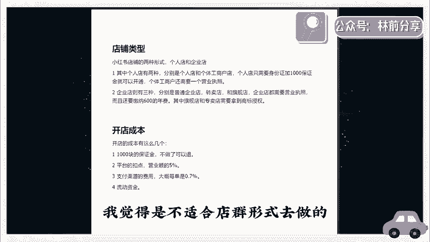

# 【2024版小红书体运营教程】全B站最良心的小红书开店运营高阶教程合集！小红书体开店 起号真的快，赶快点赞收藏起来 - P1 - 得道终生 - BV1GM4m1d7Sf

。🎼真为。🎼终弟。🎼要说最近什么项目最火，那必须要提到小红书电商。最近几个月呢，几乎整个互联网都在讨论小红书电商。我关注的几个商业博主啊，包括一些付费社群都在讨论他。

我朋友圈月入5位数甚至6位数5的比拟解是。这个项目在年初的时候，我其实就让团队跟进测试。我还在市面上买了一些课程学习。到现在单人单店一个月能做个一两万块吧。今天我就用一个视频详细的给大家拆解一下。

就是小红书电商到底怎么玩，我会把整个小红书电商的流程，包括一些注意点，比如怎么开店怎么选品，怎么做流量，一次性给大家讲清楚，你甚至都不用再去看别的相关视频和培训了啊。

你就跟着我的视频去按住骥就足够你在这个视频上开始盈利了。视频的结尾呢还会给大家准备一份资料，里面有我找的课程啊，对你运营小红书电商呢会有很大的帮助，有需要呢直接去拿就可以了。理归正传啊。

整个项目的逻辑啊，其实也非常简单。它就三件事。第一个呢开店，第二个选品第三个流量。我们一个一个来讲，先说开店，开店其实没什么好说的首先就是打开小红书，然后点击左上角的菜单图标再选择创作中心。

然后点击更多服务这个选项，选择店铺点击立即入住就可以了。你就按他官方要求的提交资料入住就行了。😊，居然看到有人把小红书开店包装成一个项目拿出来卖，居然还有不少人买，这也是很奇特。

这里跟大家说一下小红书店铺的两种形式。个人店和企业店，其中个人店有两种分别是个人店和个体工商户店个人店只需要身份证加10金可以开个工商户要多一个营业执照。企业店多一。

企业店3种包括那个普通的企业店有专卖店旗舰店企业店都需要营业执照，且还要缴纳600费，我刚开运营小红书店的候，你直接选个人店以。实下企业店和个人店一样，平台并没有对企业店有什流量倾斜。

唯一的区别个人店你只能开一家。一份营业执照可以开三个店你一个店如果都没做好，你开再多的店都是没有用的。而且小红书电商啊我觉得是不适合店群形式去做的。这是因为小红书的流量机制，它的电商自然流占比非常低。

那你出再多的店再多货有什么用呢？只要你看到有博主你讲什么红书店觉得是扯淡小红书是要做矩证的，但不是店铺矩阵，而是账号矩阵。这后面在流量户举里会跟大家说开店的成本呢有这么几个第10块钱保证金不做可退。

二个呢是平台的扣点营业额的5。第三个呢是支付渠道的费用大概每单是0。7%第。😊。

流动资金啊一开始大家做呢可以无货源的方式去做啊，对资金要求也不高。你刚开始呢准备个2000000块完全够了。呃，开完店以后呢，我们下一步就是选品。我们应该在小红书上卖什么的？选品其实也简单。

在其他平台上的爆款，大概率在小红书上也能报。目前小红书呢我是推荐三个渠道进行选品的。第一个是通过某东某宝上面找那种小红书平台调性的爆款产品。身边有做电商的朋友，他自己在某宝的店铺卖的爆款搬到小红书上。

第一篇笔就开始出单。第二篇笔记单量就已经破百了。第二个呢是通过某音的那个精选联盟，你在某音的精选联盟排行榜，你可以看到现阶段哪些品牌的好，要符合小红书用户调性的产品，直搬运测试就可以了。

第三个就是某多多的这个销量排行榜，选择适合小红书的类目排行从中选择相应的爆品搬运到小红书整个选品的逻辑，就是我们要利用市场来帮助我们选品，而不是自己在那瞎想。

我们要借助大卖家的选品能力来弥补自己选品上的不足。所以我们要判断一个东西啊，就是这些排行榜上的爆品是否跟小红书的人群有匹配的可能。如果有我就搬过来测一下？当于是借助了别人的能力来帮我选品。

这样反而是最快，而且是最稳妥的选品方式，肯定比你下册成功率要高很多。然后等你这个产品上架以后呢。😊，了最重要的环节了，我们应该如何获取流量？小红书它是个种草平台。你店铺九成以上的流量啊。

都是来自你发的发的笔记。这就是为什么我之前说小红书不要铺店群，而要做账号矩阵，尽可能都得发笔记好流量。它的通路就是用户通过你的笔记对你推产品产生兴趣。

到店铺购买堆一堆店铺铺堆店不如多发笔记多发几篇笔记的效果好，以怎么在小红书笔记你小红书电商是否成功的关键小红书这平台你直接发广得效果非常差来小红书的用户群体认知就比较高。

你直接发广告没有办法获得信更不要提转化你发笔记候，一定要用一个素人的角用户的角度去切入站在用户的角度去做种草内容而是官方视角才是真有这种种草笔记其也简单就是去各大平台的商品评论里某某某东的商品买家秀到好看的素材py文在买家评上修改这买家的评商用的使体验天然用种草笔记可以取之不尽当你单个账号的SOP跑通了？

们举证引流过批量上红批量发布笔记。😊，我们的店铺来引流来放大。那基本上整个小红书的电商的运营啊，就是我上面分享的这些。外面不管多少钱的培训啊，30也好，000块1万块也好，其实就是些东西。

有些培训可能还没有讲清楚啊。根据上面几个点，我给大家准备了一份资料，里面包括了小红书账号的起号运营的方法，以及一份小红书电商的视频课程。你如果打算经营小红书电商，你也不用看别的东西，就跟着这份资料走。

足够你开始盈利了，有需要的点赞加关注，在评论区回复红书电商，我分享给你。😊。

