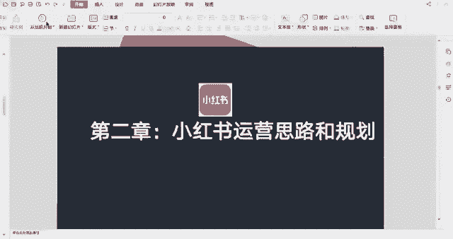
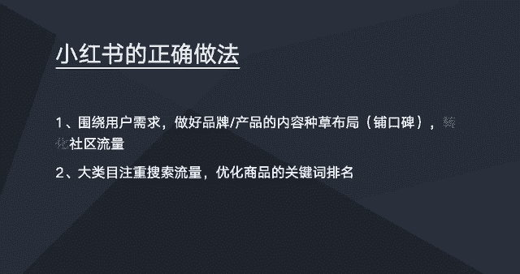
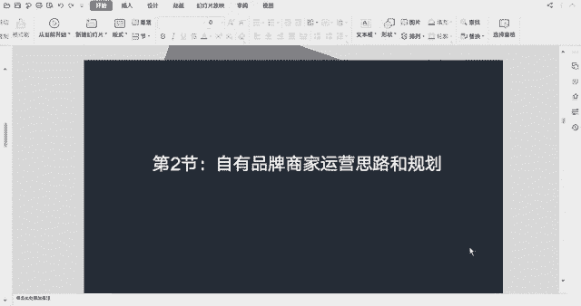

# 【2024版小红书体运营教程】全B站最良心的小红书开店运营高阶教程合集！小红书体开店 起号真的快，赶快点赞收藏起来 - P10：小红书的正确做法 - 上海小姑凉 - BV1U7hFeJErj

这节课开始，我们一起来学习一下小红书的一个运营思路，以及小红书的一个一些规划，第一节的话我们先来学习一下，就是做小红书的一个正确做法是什么，那么就是想了解小红书的一个正确做法的话。

首先我们需要先了解一下小红书的用户，他的需求是什么，然后的话就是我了解到小红书用户的一个需求，第一点是小红书他用户他想买一样东西钱，他会去小红书去搜索这个笔记，然后查看这个产品的一个口碑。

这是小红书的一个用户需求之一，第二个需求的话，就是用户在会会在小红书去搜索一些，相关的攻略，以及美妆客户的一些使用心得，时尚穿搭等等，比如小红书去搜索一些旅游攻略，或者是什么什么什么攻略。

第三个的话就是呃用户会在小红书上去搜索，一些，就是他们感兴趣的一些产品，或一些一些好东西吧，会在上面去找一些好东西，就找一些达人分享一些好东西，或是网红明星分享一些好东西。

然后这次的话就是我总结到都是三点，就是小红书的一个用户需求，然后的话就是总结的话，就是小红书用户第一需求是看笔记，并且的话笔记的内容，会影响到用户的一个购买决策，比如说小红书的用户。

他使用小红书这个app，他跟用户使用淘宝啊，使用其他的一些app不太一样，比如我们使用淘宝，可能第一需求就是哎我想买一些东西，我就去淘宝上去直接买，那么使使用小红书，用小红书的话就是他们第一需求的话。

最主要还是想去小红书上面去，看一些笔记的内容，然后这些笔记内容会影响到用户去呃，做一些购买一些角色，所以的话这里的话就是啊，体现小红书笔记的一个重要性，那么的话就是我们了解了用户的需求之后。

我们就需要做的就是围绕围绕这些用户需求，我们做好我们品牌以及我们产品的一个内容，种草的一个布局，也就是说就相当于是做我们产品的一个，口碑的一个铺设，然后目的是转化社区的流量，也就是说来看我们笔记。

看我们这个内容的人，我们需要把这个人转化为我们的一个客户，另外的话就是一些大的类目的话，搜索流量也是比较大的，一些大的类目，或者一些比较标品的，一些大众化的一些一些商品，这些商品的话是会有很多用户。

他是直接通过搜索去找产品的，而这一类产品可以考虑去优化，我们的产品的一个关键词排名，然后的话这些的话就是做小红书的一些正确，做做法，其实最主要还是内容，然后内容这一块最关键还是一个写作的能力。

也就是说这个笔记写的好不好。

