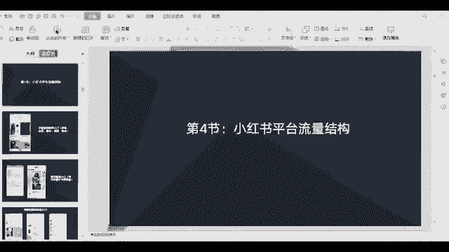
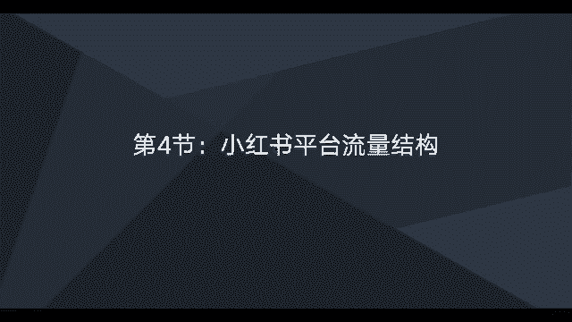
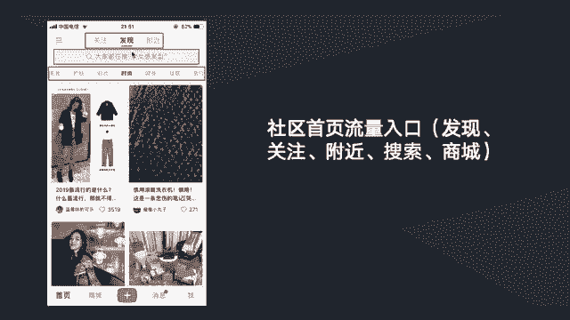
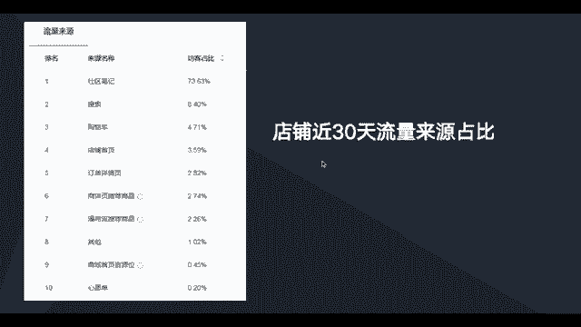

# 【2024版小红书体运营教程】全B站最良心的小红书开店运营高阶教程合集！小红书体开店 起号真的快，赶快点赞收藏起来 - P11：小红书平台流量结构 - 石板滩小方 - BV1BohkeXEK7

这节课我们一起来学习一下。

小红书平台的一些流量结构，而这张图片一个截图的话，他是一个就是小红书的一个首页的一个，展示的一个情况，而这里的话会有一些流量入口，主要流量入口的话是这五个发现关注，比如发现关注附近还有这个搜索框。

以及这里商城，也就这五个地方是有一些流量入口，然后这一个板块现在已经更新了，已经现估计很多人更新了，就看不到这个板块，没有这个板块入口，而这五个流量入口的话，发现他的流量这个入口是最大。

也就是我们一打开小红书，然后默认的就是发现这个入口，然后的话就是呃其次就到搜索框。

就搜索框这里的一个流量入口是第二大的，其他的话流量相对会少一点，那这两个的话是一个笔记的一个截图，然后在笔记里面的话，主要是有呃两个入口，一个流量，两个流量入口吧，分别是在笔记的内容中跟图片中去啊。

插入我们的一个商品链接，这就是在图片内容中插入商品链接的一个形式，然后的话呃我们也可以在图片里面啊，插入那个标签，然后标签的话也可以是啊链接的形式，比如说我们我们在内容跟图片上插入了标签。

那么在主图的在图片的一个下方，我们就能看到一个商品的一个展示，也就说点击这个商品或者是点击这些啊，标签是可以直接进到我们小红书店铺的，能够为我们小红书店铺做一个导流，然后这里是搜索框的一些流量入口介绍。

主要是有三个入口，就是我们在搜索框搜索一些关键词的时候，比如我们搜索减肥，那么首先出来的是全部，全部的话，这里主要是展示啊笔记的一个内容，比如说我们搜索一些关键词的时候，它会啊根据这个啊笔记的一个情。

一个跟这个关键词一些相关性等等因素，推荐一些相关性笔记给我们看，比如说我们以后要做的话，我们也可以去考虑做一些关键词的一个，笔记排名，这这个流量也是不错的，第二个的话就是啊搜索减肥的时候。

也能够看到一些商品，比如说我们后面做的时候就点击这个商品的话，是直接可以进到我们小红书店铺的，比如说后面我们也可以啊，把我们小红书店铺的一些商品，就做一些关键词的一个优化。

在后面的环节会有有介绍到这一块，这个关键词的一个啊商品优化，而这里的话的话就是能够通过搜索关键词，找到一些小红书里面的一些用户，主要还是一些达人号，一些KOL的号，然后的话我们再找一些答案，合作的时候。

我们可以直接叫你去搜索，去找，然后添加关注，然后去联系他们，去洽谈一些合作，而这个是一个店铺的一个近30天的一个，流量来源的一个截图啊，这里可以看到就是这个店铺呃，它来源访客来源最多的就是一个社区笔记。

占到73%，其次是搜索，搜索端占到了8%，也就是说社区笔记加搜索流量，已经占到这个店铺，80%的一个流量占比了，所以说在小红书呃，要做流量最关键还是做社区笔记，比如在社区里面去发笔记。

当然了一些就是比较大的类目，它的搜索流量也是相对，肯定会比这个大的类目不一样，它搜索的量的占比也会不一样，那以上的话就是小红书这个平台。

