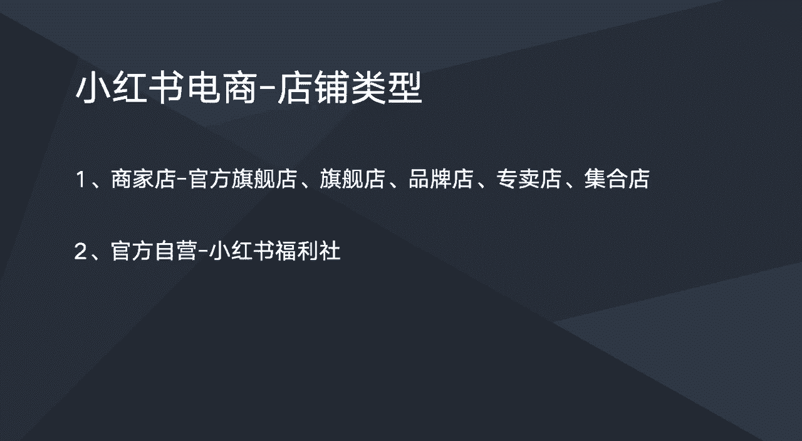

# 【2024版小红书体运营教程】全B站最良心的小红书开店运营高阶教程合集！小红书体开店 起号真的快，赶快点赞收藏起来 - P11：小红书店铺类型 - 恋上你的房fa - BV1uDhzecEFi

这节课我们一起来学习一下，小红书电商的一个店铺的类型，小红书里面的一个店铺类型的话，主要分为以下几种，第一个是商家店，就是我我们商家自己去入驻开的一个店铺，主要分为这五种啊，主要分为官方旗舰店，旗舰店。

品牌店，专卖店，集合店啊，先说这个集合店吧，集合店的话它是可以啊，集合很多个品牌在店里面啊，就有点类似天猫的一个专营店吧，就他一个店铺可以卖多个品牌的一个产品，然后这个几何店，在小红书里面也是可以经营。

多品牌的一个产品的，但是目前的话，小红书已经暂停这个集合店的一个入驻了，也就是说现在已经不能在开集合店了，以后小红书会不会再开放，就不知道了，看以后小红书的一个政策。

然后的话就是品牌店跟专卖店这两个店的话啊，也是就是比较常见，比较普遍的吧，就是说作为一个普通商家，去去小红书上面去开店，默认给的都是品牌店，所以就是我们很多商家，他开的店铺都是啊某某某品牌店。

然后就是旗舰店跟官方旗舰店这两个店铺的话，是目前的话就是呃需要有一定品牌知名度的店，才能够申请申请到旗舰店跟官方旗舰店，然后这个品牌知知名度的话，现在也没有一个标准，这个是小红书内部他们认定的一个。

只他只要他们认定你是知名品牌，那么你就可以申请开通啊，这官方旗舰店以及旗舰店，然后的话就是呃如果我们是品牌店的话，其实是可以升级为旗舰店跟官方旗舰店的，然后升级的条件的话。

其实主要还是看你这个店铺的一个营业额，比如说你店铺的营业额达到一定程度之后，那么你就可以申请开通，直接升级到旗舰店，但这个营业额的标准可能是，每个类目是不一样的，可能大类目它会对营业额标准会会更高一点。

小类目可能一个月卖个几10万就可以申请呃，到旗舰店了，那大类目的话可能会要求会更高，然后这些店铺他是有群众之分的，也就是说群众从左到右，官方旗舰店他的权重会高于旗舰店，旗舰店的权重会高于品牌店。

比如说这些群众的话，就是在嗯在一些笔记跟商品的排名上，它能够起到一定的一个呃作用，但是这个作用不是绝对性的，然后第二类店铺的话就是官方自营的，就是小红书官方自营的，小红书官方自营就叫小红书福利社。

就像京东自营一样，这个是呃小红书的一个官方字眼，然后就是商家的产品是可以啊，通过自营的方式入驻到小红书福利社，然后入住的标准也是啊，销售额就是说你你的品牌下面的一些产品，它的销售额比较高。

或者说你的这个产品在小红书卖的比较好，其实小红书他小红书自营这个部门，会有一些专门的人，他去会去找这类产品，就是在小红书卖的比较火爆的产品，他们会去跟这些商家谈呃，要求商家把产品入住他。

他们入住到他们的一个福利社，那么优住的条件就是相当于是商家是啊，一个供货商，那么小红书自营店他就是一个一个呃经销商，当小红书自营，他会要求额商家这边给的一个价格是比较低的，应该价格会在六折左右吧。

所以的话就是这是小红书自营的一个呃。

