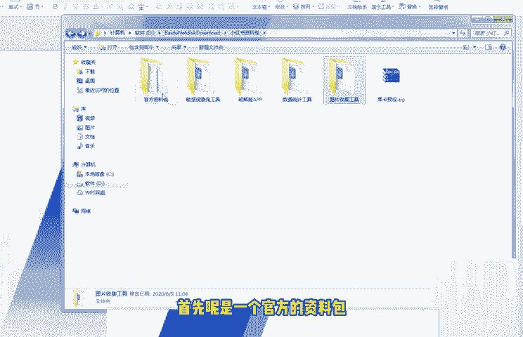
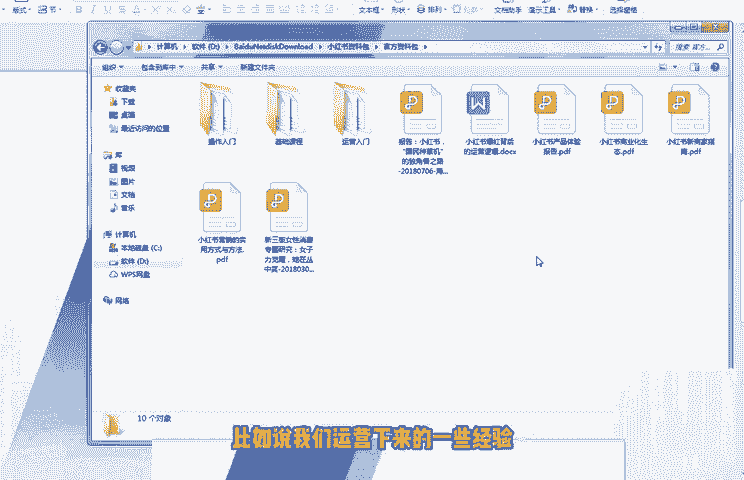
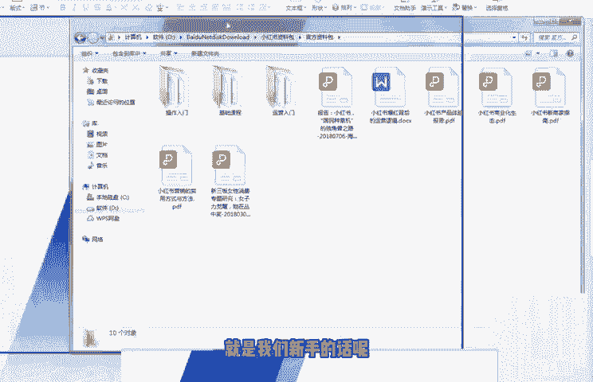
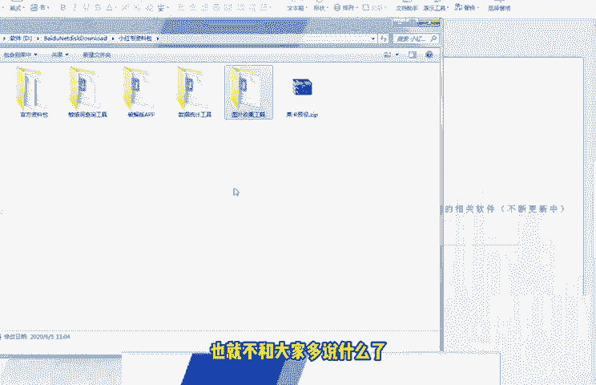

# 【2024版小红书体运营教程】全B站最良心的小红书开店运营高阶教程合集！小红书体开店 起号真的快，赶快点赞收藏起来 - P11：第10节：小红书运营最全套的相关软件分享 - 杰瑞勇闯浪浪山 - BV1dLMRegEFi

今天这节课呢我们来和大家说一下这个小红书相关配套的一个软件啊，这个软件的这个介绍。然后呢还有一些这个工具一起来来给大家介绍一下。啊，我们直接就是把这个图给大家看一下吧。

这里呢就是我们平时整理的一些这个素材包和资料包啊，有一些这个工具呢也是我免费啊也呃不是免费啊，付费的渠道从别人那边购买过来的。然后呢，我去筛选了之后呢，觉得还不错啊，留了几个比较不错的。

然后小红书运营的时候呢，我们有时候也比较会用到的一些软件给到大家。首先呢是一个官方的资料包。

呃，官方的一些这个运营技巧啊。当然官方的说的呢，他有一些不会告诉你，他有一些呃实操的一些东西的。就是说比如说我们运营下来的一些经验，他是不会告诉你的。

他他只能说从最简单的一些最基本的一些这个方面给你说到。但是呢呃这个小白呢也可以去看看。就是我们新手的话呢。

也可以可去看一下这些资料包。😊，然后呢，就是敏感词的一个查询工具。查询工具的话呢呃这里面有个地址了，就不给大家看了。然后呢，有一些相关的APP数据统计工具，还有图片收集工具。

包括莱卡的这个照片的一个工具。这些工具呢呃我说了，我们一直会更新。这个大家呃也放心了，一直会更新。我在上面的课程也和大家说到了啊。就是说现在我录制课程的时间是现在是5呃6月份，可能大家比如说看这个课程。

你再来找我有没有这些工具，我可以回答你啊，有这些工具，因为这些工具都是我这边一直负责维护或者更新的。所以说这些软件呢，这些工具呢一直都是可以用的。后期有一些可以用的软件可以用的这些工具呢，比较不错的。

我也会加进来。因为这个视频它不是那个实时更新的，所以说我加进来的时候呢，有可能你不太知道。😊，你可以多找我聊一下啊，对吧？最近有没有更新小红书的工具啊，对吧？最好一个月可以问我一下，你不要天天问我。

天天问我，我也我也受不了，对不对啊，这些工具呢都是免费提供给呃我们的这些课程的学员啊，然后这里面的这个其实也没有什么好说的，那个方法都在里面了，包括。😊，这个图片收集其实比较有用的。

就是你看到小红书或者是微博，包括绿洲上面有一些比较好的文字和图案啊，你不知道去哪找这些素材的话，或者说找到这些素材有水印的话，都可以用这个方法已经写在这里面了。这个工具还是非常实用的。啊。

然后你就可以找我过来拿，我们这节课呢也就不和大家多说什么了。然后呃所有的工具包呢都在这里。

