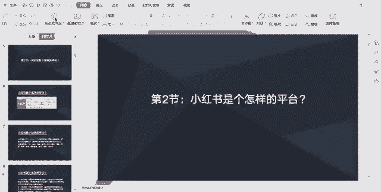
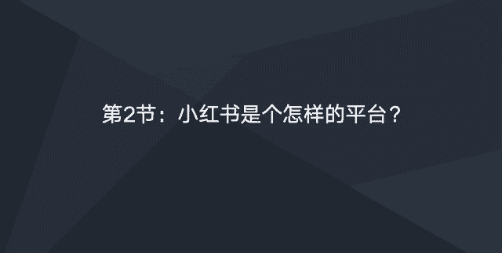
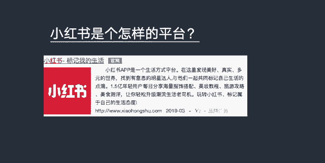
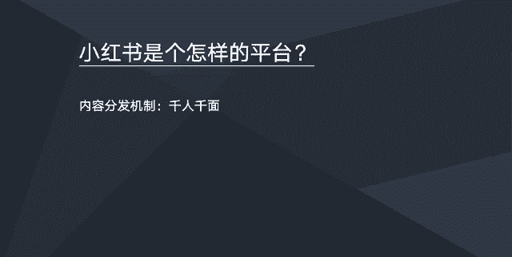
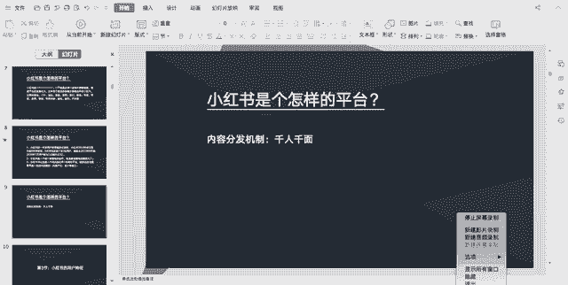

# 【2024版小红书体运营教程】全B站最良心的小红书开店运营高阶教程合集！小红书体开店 起号真的快，赶快点赞收藏起来 - P12：小红书是个怎么的样的平台 - 石板滩小方 - BV1BohkeXEK7

好同学们好，这节课我们一起来认识一下，小红书是一个怎样的平台。

我们来先看一下小红书的一个官方的一个介绍，官方在介绍，这里有说小红书app是一个生活方式平台，然后这里的话可以发现一些美好，真实多元的世界，而这里的话有很多年轻的用户，每天分享海量的服饰搭配，美妆教程。

旅游攻略，美食测评等等内容。

品牌介绍大概是这样子，然后其实小红书呢它是一个分享型的一个社区，小红书，一开始他是分享一些海外的一些购物经验，然后随着平台的一个发展壮大，后来各行各业的信息分享都出现在了小红书，主要包括美妆客户。

运动美食，家居旅行健身，母婴明星，家居宠物等等等等，这些行业的一些内容，然后目前小红书的话，就是他的一个用户是呈一个爆发式的，一个增长的，小红书他是从2013年开始成立的，到现在5年半的一个时间。

就是他前面5年的一个发展，大概发展了9000多万到一个亿的一个用户，但是呢从去年也是2018年6月到啊，今年1月份的时候，他的用户数直接飙升到2亿，也就是说最近的一个半年时间，它的一个用户增长量。

跟他前面5年发展的用户增长量是一样的，所以说现在是小红书的一个红红利期，他的用户数是呈一个爆发式增长的，所以的话现在大家要赶紧进入小红书，然后小红书呢它是一个做口碑营销的一个社区，也就是说小红书。

它本身就是一个巨大的一个产品，口碑的一个呃口碑库，然后是消费者他购物决策的一个入口，也就是现在很多的年轻人，他需要买一些东西的时候，他会来小红书去搜索一些产品的口碑，然后对他要买一些东西进行啊一些参考。

像这就是消费者的一个购物决策了，然后小红书的话，它可以说是一个纯内容社区加电商的平台，所以说做好小红书，它是需要具备一定的内容策划，内容产出以及设计的能力，所以这里的话大家要来做小红书。

要看看自己的团队有没有这方面的一些能力，自己的团队基因有没有就是做内容策划，内容产出的一些基因，如果有，最好没有的话，建议是啊要去搭建这样的一些团队，或者是跟有这方面有经验的一些人去做合作。

然后小红书这个平台的内容，它分发机制是千人千面的，也就是说你关注什么样的内容，后面他会给你推送更多这样的相关的内容，这样子的话就会啊，现在很多平台都是千人千面这种啊推荐机制了。

