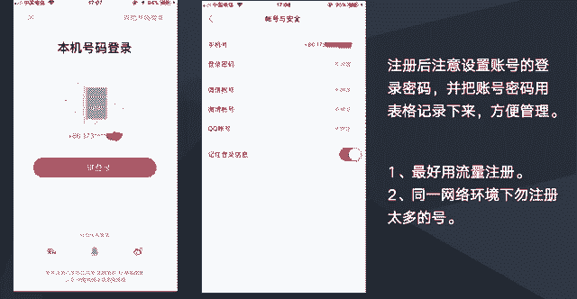

# 【2024版小红书体运营教程】全B站最良心的小红书开店运营高阶教程合集！小红书体开店 起号真的快，赶快点赞收藏起来 - P13：小红书账号注册的条件、环境 - 石板滩小方 - BV1BohkeXEK7

前面两章的话我们是学习了啊小红书这个平台，然后也学习了做小红书社区运营的一些思路，跟一些规划，那么从这一章开始的话，我们就会一起来学习一下，做小红书社区运营就是如何去落地。

然后的话我们先来看就是要做小红书社区运营，第一步呢首先是要在小红书有账号，就是我们啊第一节的话，我们先一起来学习一下，小红书账号注册的一些相关的一些啊，知识点跟操作，然后主要看三个方面。

第一个是啊我们小书账号注册的一些条件，第二个是啊注册账号之后，账号绑定的一些注册事项，还有在注册小红书账号的一些，网络环境的一些注意事项。

然后啊这两个截图的话，就是我们啊注册小红书的一个页面，然后正常情况下的话，我们都是用手机手机，手机号码去注册的小红书账号，然后我们看左边这张图的话，这里的话可以用我们本机的一个手机号码，一键登录。

就用手机验证码呃，登录小红书账号，这样子的话，相当于是用手机号注册了一个小红书的账号，那这里的话还有社交账号登录，比如微信号，QQ号，还有新浪微博号，也就是说用这些社交账号去登录的，一个小红书账号。

他也是也可以单独注册一个小数账号，也就也就是说手机号码，微信号，QQ号啊，新浪微博号，这四种号的话分别都可以注册小红书的账号，然后是一种号可以注册一个小红书的账号，那么的话就是我们在啊做小红书。

一个社区运营的时候，会要求我们啊要需要多多备一些小红书账号，所以的话我们可以多注册一些小红书的账号，像正常情况下，像目前我们的团队一个一个人的话呃，一个人手上至少有几十个小红书的账号。

因为大概是在20~50个之间吧，所以的话就大家在做小红书社区运营时候，在准备账号这个环节，在这里的话可以多备一些这些手机号啊，这些微信QQ这微博号都被一些这些账号资源，然后用来注册小红书的账号。

然后注册之后呢，有有一些需要注意的，就是呃第一个是我们注册了账号之后，我们需要到账号的一个设置里面，然后账号安全，然后在这里把这一个账号的一个密，码给设置一下，因为我们一开始的话都是用快捷登录啊。

登录了一个小红书，那么它是没有没有密码的，所以我们快捷登录注册小说账号之后，还要额外设置一下这个登录密码，这样子下下一次的话，我们就可以直接用啊账号密码去登录了，这样子的话也额更方便我们的一些管理。

就任何人有这个账号密码的话，都可以去登录，然后的话我们所有的账号，最好能够用一个表格记录下来，因为到时候手手上的账号多，如果大家不记录的话，可能的话有一些账号会忘记，所以的话就把账号密码用表格记录下来。

这样就方便管理，然后我们注册之后，这里有我们看这张图，这里有写未显示未绑定，未绑定未绑定，这里的话就是大家千万就是我个人建议是，不要去绑定，绑定的话，有可能就是我们两个账号就变成一个账号了。

因为我们本身做小红书设计运营，要求就是越账号越多越好，那么所以就是建议大家不不去绑定这里，因为绑定的话呃，可能是两个账号变一个账号呃，因为我们没绑定过，也不知道，但是如果绑定的话。

有可能两个账号它会关联在一起，关联在一起的话，对我们来说来说也是没有什么好处的，比如说我们一个账号如果违规了，如果是关联的话，那可能另一个账号也会被牵连，所以这里的话建议大家不要去绑定。

就设置个密码就可以了，然后注册环境的话，建议大家就是不要不要登录WIFI去注册，就用手机的一个流量去注册就可以了，然后在同一个网络环境下，就不要去注册太多的号呃，比如说我们一台手机。

我们不要用一台手机去做个注册个几十个号，这样子的话这些号肯定都是会被，如果是一个号出问题，那可能其他号也会受到牵连，所以的话建议在同一环境下，不要去注册太多的号，统一统一网络环境下注册个呃。

两三个号就可以了，或两三个三四个不要太多了，然然后也要注意一下，就是同一环境下，不要啊短时短时间内注册大量的哈，这样子也是非常危险的，比如我们今天啊，比如今天中午12点钟，我们注册了一个号。

那么的话我们可以呃，间隔一段时间再去注册一个号，不要一一下子就232分钟，你注册个四五个号，这种相对来说也是比较危险的，所以在账号注册这一块的话。

