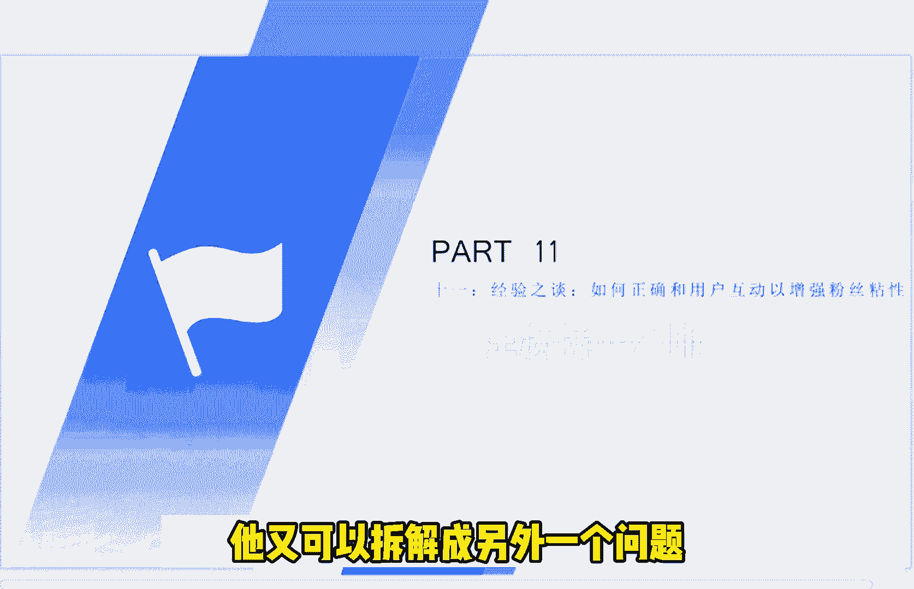
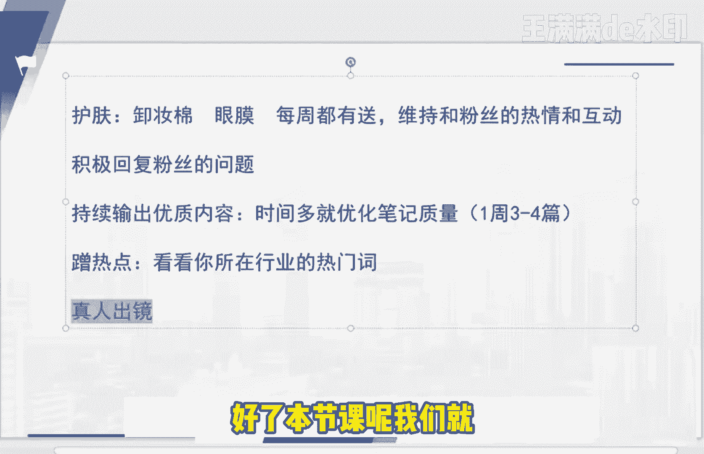

# 【2024版小红书体运营教程】全B站最良心的小红书开店运营高阶教程合集！小红书体开店 起号真的快，赶快点赞收藏起来 - P15：第14节：小红书如何正确和用户互动以增强粉丝粘性？经验之谈！ - 一直在意米 - BV1FD421V7TC

今天这节课呢我们来和大家说一下，如何和用户正确的互动，然后呢呃来增加我们粉丝的一个粘性啊，其实说到和用户的这个联系啊，这个互动呢很多人说啊，我发了一篇这个笔记下去，或者说我的账号运营了这么长时间下去。

为什么没有人和我互动呢，我们应该从这个角度先去看待这个问题对吧，你一篇笔记发下去，为什么没有人跟你互动啊，对不对，我们应该首先是讨论这个问题好，那么我们在纠结于这个问题之之是之后呢。

后来我啊发现这个问题，他又可以拆解成另外一个问题。

就是说你发的笔记是否有价值，我们来看待这个问题的话呢，那就从这一点出发，是比较适合我们现在大部分人所能接受的，一个程度的，就说我们的啊你的笔记是否有价值，是否能够解决用户的痛点，我们今天这节课呢。

主要是从这个角度来和大家这个讲一下啊，我们为什么发的文章没有别呃，没有引起别人的一个互动，为什么我们发下去后，发下去之后呢，没有什么动静，对吧啊，我们然后再把这个问题再详细化一点呢。

就是就是怎么说呢对吧，什么是痛点呢，啊这里呢我来我，我给这个痛点呢下了一个定义啊，就是用户一直不好阻碍它变好的一个问题，就是他明明很有对吧，其实我们身边的都会遇，一直遇到这样的一些人。

就比如说我举了一些简单的例子啊对吧，祛湿，比如说很多人脸上他有那个湿气比较重啊对吧，我我身边的一些朋友或者家里面人也有呢对吧，他们呢啊有的去看中医，或者说有的去这个美容院买了各种仪器。

或者吃了很多这个其他的代购的一些产品，都不见好对吧，或者说效果都不太明显，所以说体内的人家，人家就说体内的湿气比较重嘛，还有一个就是美白嘛对吧，瘦身那就咱们就不用说了，反反复复减了减了又弹。

减了又弹反弹对不对，还有去螨虫啊，驱螨虫最直接的一个这个呃问题，那就是螨虫去不好的话，脸上啊包括身上有很多红红点对吧，特别特别是对于我们女生来说，是一个很大的一个一个一个问题，那针对于以上的这种东西呢。

我们就叫它啊，就叫它痛点，就是用户一直一直以来不好，他自己又知道阻碍它变好的这么一个问题，我们就叫痛点，那么我们回回过头来再看一下这句话，你发的笔记是否有价值，能否解决用户的痛点啊。

如果你写的笔记是从这些，是从是从这个角度去出发的话，我觉得是没有什么太大问题的对吧，就比如说啊这些问题让他们啊听，想起来就很扎心的一个问题，对不对，如果你的产品呢啊这里面这里面，那我们就接着往下说。

那如何去增加和互啊和粉丝的一个粘性呢，互动的一个粘性呢，这里我给大家提了个意见是什么呢，呃建议是什么呢，就是说，如果你的产品的价值在100块钱之内的话，你可以经常的去做一些这个抽奖活动啊。

你用这个这个随机抽奖也好啊，或者说利用一些这个小程序抽奖也好啊，这样都可以啊，就比如说我们可以用一些，你是做这个护肤行业的对吧，我们可以送一些这个卸妆棉啊，眼膜啊，这些小东西很便宜的。

阿里巴巴上都能批发的到，对不对，如果说你是做的一些客单价比较高的一些东西，比如说你的这个一个商品的价值，可能150块钱到200块钱以上了，那你觉得抽奖送这个是比较贵的对吧。

那你就可以送一些这种卸妆棉或者眼膜对吧，总之呢我们的目的是什么呢，我们的目的不在于说是送什么东西了，我们的目的是在于，这个是你最起码保证你每周都要有送东西，然后呢维持和粉丝的一个热情和互动啊。

积极的去回复这些粉丝的问题，这样子的话呢就是很容易啊，能和这些粉丝打成打成打成一片的对吧，我们一有活动他就过来，我们一有活动他就过来，是不是啊，另外一个呢就是就是我想说的啊，你的是否有一个能力。

能够能够持续输出优质内容的这么一个能力，这个东西呢我说了，只要是我们做内容的话呢，做自媒体这一块呢，一定要是有一个这么样的一个，基本的一个功能啊，你能否啊长时间多收啊，多多出持续的输出这种优质的内容。

优化的笔记质量对吧，有如果有的人比较有的人他就跟我说，他说我时间比较多对吧，时间比较多的话呢，我建议大家发这个笔记的，发这种带货，或者说宣传咱们自自身产品的这种笔记的啊，这种频率呢又少一点。

可能一周3~4天就够了，然后我们时间如果多的话，比如说有的人说啊，我老师说我一天写十篇笔记都没有问题，我有的是时间，那对于这部分人这部分朋友来说呢，我我给你们的建议是什么呢。

就是说你如果说时间是很多的话呢，啊你可以用来去优化这个比例的质量，因为我们做小红书，他的它的核心点在不是在于数量，不是说你发1万篇文章，就就比你发一篇文章来的好，你发一你发1万篇文章。

可能1万篇文章都是垃圾文章，但是你写一篇好的文章，那可能那个文章爆了，带来的带来的阅读量就可能不止对吧，不止一啊，10万可能会达到100万，是不是啊，我们要用这样的思维去思考，我们小红书的运营。

不要去用以量去取胜，而且我们做的也不是一件，咱们用蛮力才能解决的一些一些问题，我们做很多这这些这些事情呢，是有一些呃巧力去可以去用的，就比如说我这两点提出提出来的呢，对吧啊，去蹭热点。

看看你所在行业的这些的一个热门词，比如说我啊我们是做这个护肤的，我们就在护肤的这个里面去搜一下对吧，护肤里面到底是有哪些比较热的，这种行业的词啊，我们可以根据这些行业词呢写的时候呢，去量身打造一下。

打造一下对吧，比如说我们写的时候可以把这些词带上啊，对不对，可以想一下这些词衍生出哪些，和你相关的一些东西啊，你都可以用来去写这种比较热门的一些文章，对吧，另外一个呢就是啊，我推荐大家如果去做这个视频。

视频小红书的话呢，最好还是有这个真人出镜了，因为真人出镜的话，现在普遍的来说也是慢慢的被大家所接受了，然后的话呢对于处于心理学角度来说的话呢，你真人出境，你一个真实的人在用这个东西。

或者说在宣传这个东西，会给心理上一个暗示，从心理学上来说会给一个暗示，什么暗示呢，就是说他用了这个东西会和你感觉是一样的，我们不是很很多次看到那个买家秀嘛，对不对。

就淘宝上有很多很多那个宣传的那个图片啊，那个女的穿的这个衣服多么好看啊，其实不是的，其实是人家模特的身材好看，她不管穿什么衣服都好看对吧，结果这个女的把衣服一买回来，一穿很丑，对不对，又发了一个买家秀。

说你这个衣服是是是不是有问题啊对吧，为什么我穿就不好看呢，那其实其实其实这个道理呢，用在我们的这个小红书视频的这个啊，笔记里面呢，它的它的原理是一样的，也就是说我们去用真人出镜的这个啊。

这个说法呢是会给别人一种感染力，给别人一种美好的一种向往对吧，就是说哇我很很阳光，很气质，很美丽，很大方，对不对，我在用这个产品啊，也会给他一种暗示，就是他用了这款产品会变成你一样的气质，对不对啊。

其实这个也是一个心理学上的一个营销啊，大家可以多借鉴一下这样的一个方法，好了。

