# 【2024版小红书体运营教程】全B站最良心的小红书开店运营高阶教程合集！小红书体开店 起号真的快，赶快点赞收藏起来 - P21：第20节：小红书笔记排名优化的步骤有哪些？如何写出排名靠前的笔记内容 - 一直在意米 - BV1FD421V7TC

我们今天这节课呢来和大家讲解的是。

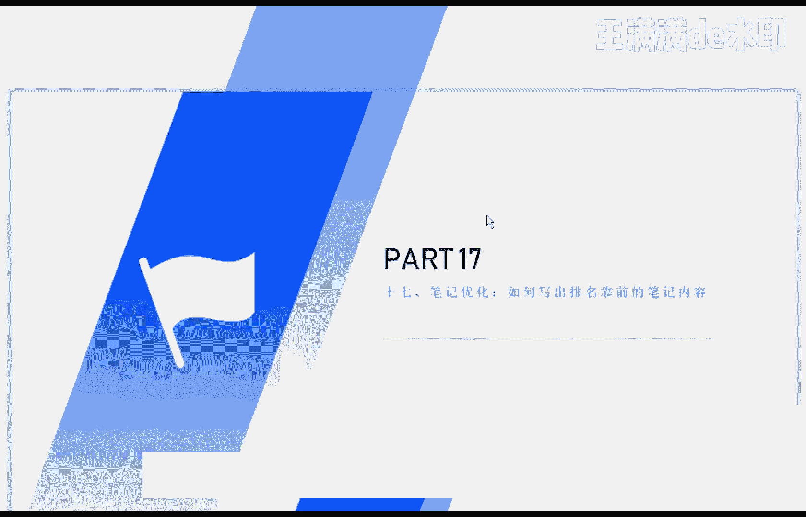

小红书笔记的第17课，笔记优化的一个问题，如何写出能够排名靠前的笔记内容，呃，其实如果在讲这节课之前呢，很多人还是不知道怎么去科学的，或者说规范的去写我们的一些笔记，除了我们之前课程讲到的。

比如说配图啊，或者说这个呃比如说标题啊，一些一些比较重要的逻辑之外呢，我建议大家呢在写这个小红书的时候呢，内容里面其实也是有一些些呃，相关注意的一些地方，再结合了我们上一节课。

就是教大家去挖掘这个关键词的一个工作，之后呢，我们就可以去对等的去写出，这个相应的关键词的一个笔记，呃，这里呢我给大家去提出来的这个建议呢，是我们采用这个关键词的一个布局方法。

题目中呢就带有相应的这个关键词，好我先这个直接给大家演示一下吧，啊，首先呢我们的这个小红书的标题要怎么去写呢，比如说我们刚才上一节课讲到的这个祛斑对吧，我们来和大家看一下这个祛斑的一些关键词啊。

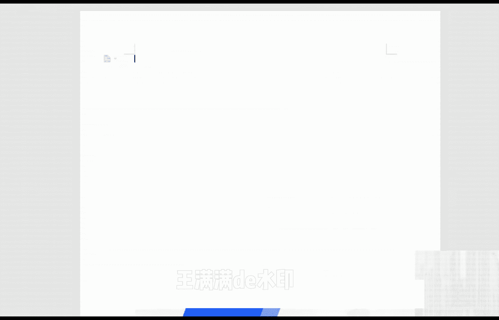

大家可以看到我现在搜索的人呢，是这个祛斑对吧。

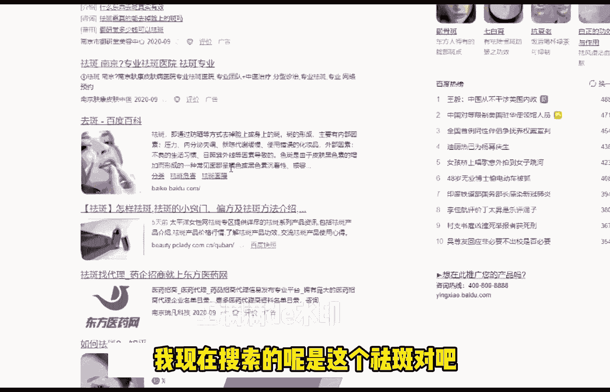

祛斑的话呢，我们就选一个比较呃常见的一个标题吧，比如说怎样去斑，简最简单最有效对吧。

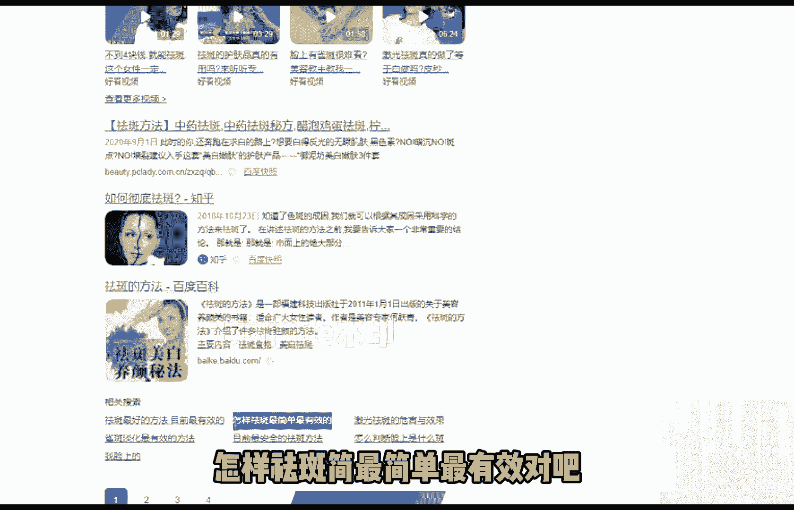

比如说我们要写的是这个标题，好那怎样去斑最简单最有效，这个时候呢我们可以在后面加上一个副标题，对吧，这些知识你知道吗对吧好，我们比如说做的就是祛斑这个这个词。

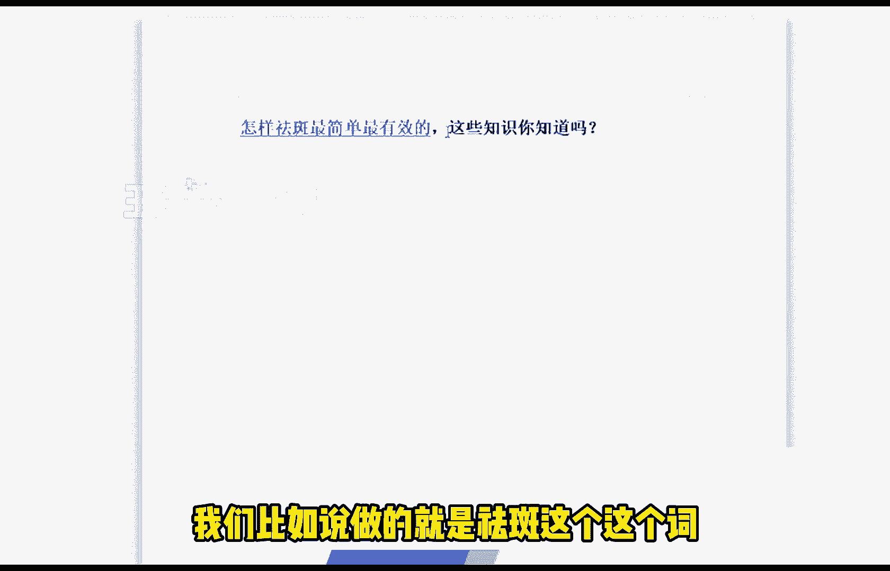

那我们现在去发掘出来怎样怎样祛斑，最简单最有效，这个词呢在百度里面搜索的人是比较多的，那同样的在小红书里面，搜索量呢也是肯定是很多的，因为人嘛总要是有一些这个相应的，这些搜索需求，对不对，好。

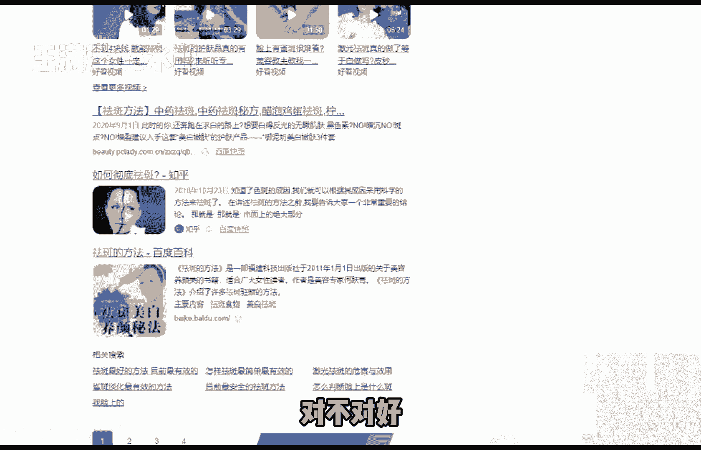

我们写出来这篇文章之后，标题首先就定了，肯定是要包含这个关键词的，怎样去斑或者说祛斑对吧，最起码是包含这个关键词的，对不对，好那我们这个标题定下来之后呢，好我们这个标题定下来之后呢。

我们开始写写正文的内容啊，好这个正文的内容我们到底是怎么去写的呢，文章呢我给大家建议的是什么呢，文章呢我们这个主题内容呢，主要就围绕着这个关键词去写了，包括文章的正文开头啊。

中间结尾都要带一下这个关键词，比如说我们现在写的是怎样去拍，最简单最有效对吧。

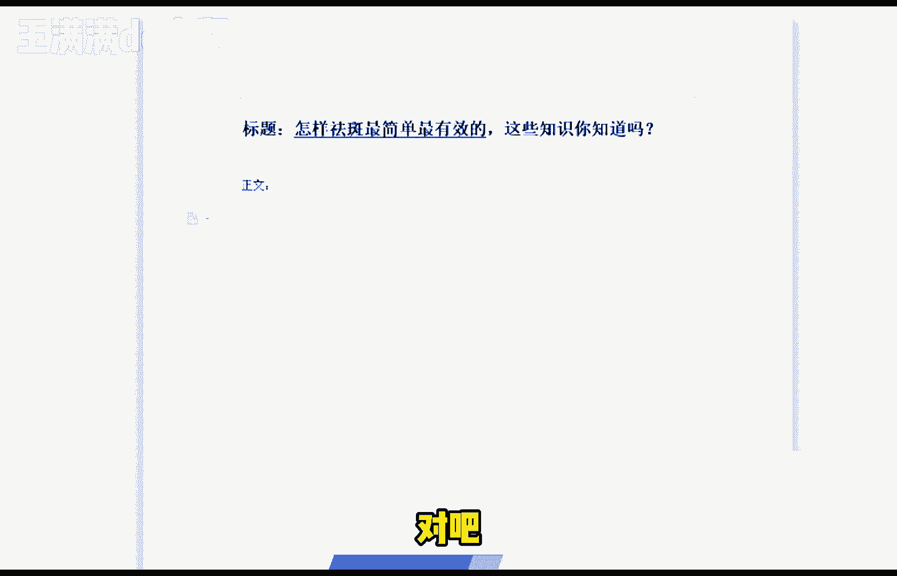

我们再看一下这个搜索引擎里面的，百度里面搜索出来的这个这个词，那前面的教大家一个方法，前面那几个呢都是广告，我们就不要看了，这这些都是医院里面，或者说一些机构里面的那个广告，你看这是医院的广告。

医院的广告，医院的广告，美容中心的广告，这几个前面那几个的我们都不要看了啊，看进去的话呢都是那个应用广告，对我们来说没有什么太大用处的，我们可以看一下这个百度经验呀。

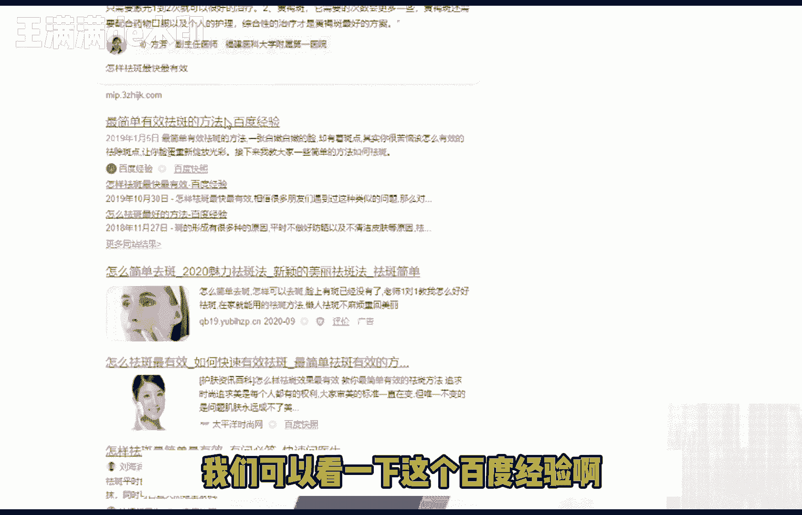

或者说像这个优势广告我们可以不看啊，比如说这个网站里面啊。

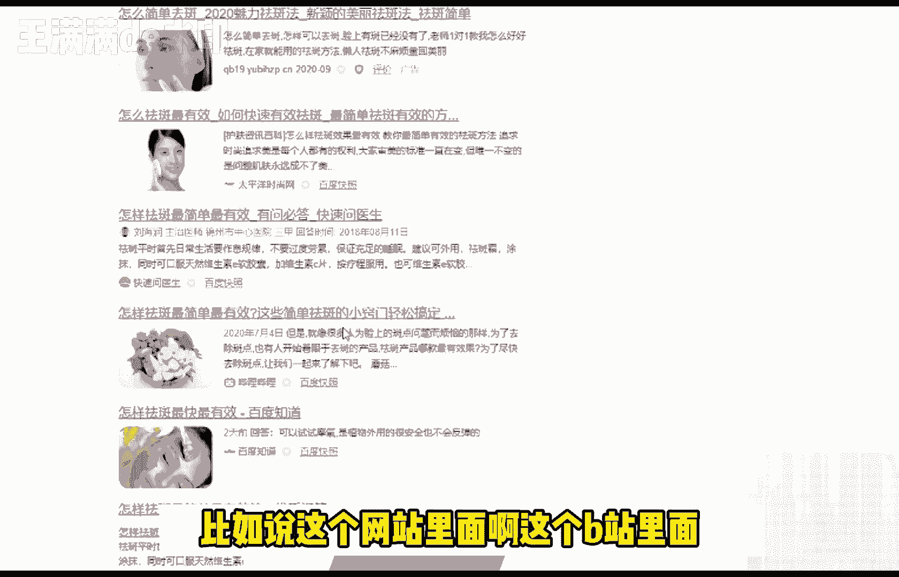

这个B站里面这个知道里面对吧，我们去搜索一下这里面到底是有哪些东西对吧，怎样去呃祛斑最最有效，最简单，对不对，好我们这样子去做了之后呢，下面一步该怎么做呢，下面一步的话就是开始布局我们的关键词。

那我们正文的话呢，我刚才说了，主要是分为开头中间结尾对吧，这个开头中间和结尾呢不管你怎么去写，不管你怎么去写，怎么去优化，或者说怎么去额，写的很浮夸也好，或者说很很很好也好，或者说很平庸也好。

这个都无所谓，这个真的是无所谓，但是开头中间和结尾一定要带上这个关键词，一定要带上这个关键词啊，一定要带上带上带上，然后你的整篇文章呢，不要写一些其他的一些这个内容，相关的一些那个内容了。

只只能围绕着怎样祛斑最有效这个点去写啊，然后在开头里面呢记得一定要带上这句话，开头中间或者结尾一定要带上这句话，不要很生硬的去带上啊，不要去刻意的去带上。

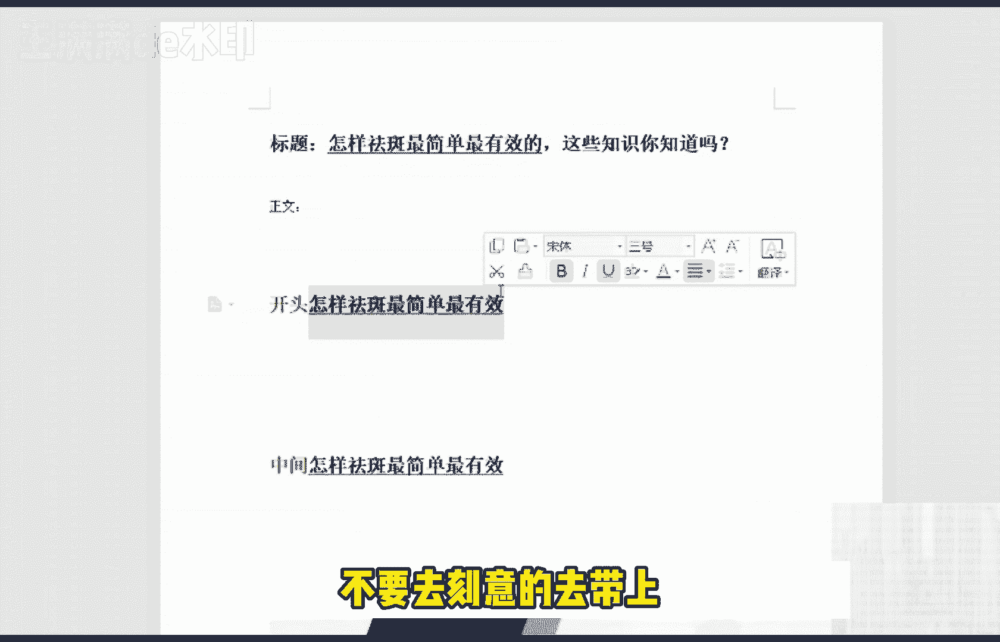

就稍微提一下对吧，为什么要这样做呢，因为这样做的话呢，这样做的话呢，就会非常符合我们这个搜索引擎的，抓取的一个算法，那么可能很肯定，很多人在写这个小红书文章的时候，就写的比较随心所欲对吧。

我想怎么写就怎么写对吧，我甚至说一句话或者说两段话都可以去写完，那么其实小红书文章，他写作的一个写作的一个规律呢，或者说写作的一个方法呢，它都是有一定的科学科学依据去做的。

我们大家可以看看一下这个百度里面的文章，大家都知道了，第一页里面的百度文章，为什么他会排在第一页啊，你看人家标题是喊的，这个我们去搜一下，最简单吧，去干这个词，我们来看一下它出现了多少个啊。

祛斑祛斑祛斑祛斑。

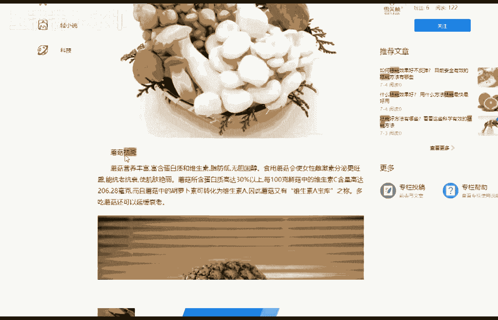

看到了吗，你看它特别是这个尾巴的话，你看有效的祛斑啊，他的这篇文章呢，他的布局呢你可以看到这个黄颜色的这个字啊，对吧，他在开头标题开头中间结尾都有带上这些词，所以说他才能够被搜索引擎去爬取到第一页。

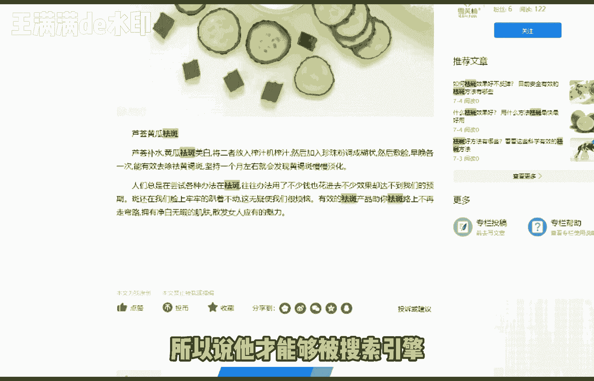

比如说我们可以看到哔哩哔哩刚才那篇文章啊。

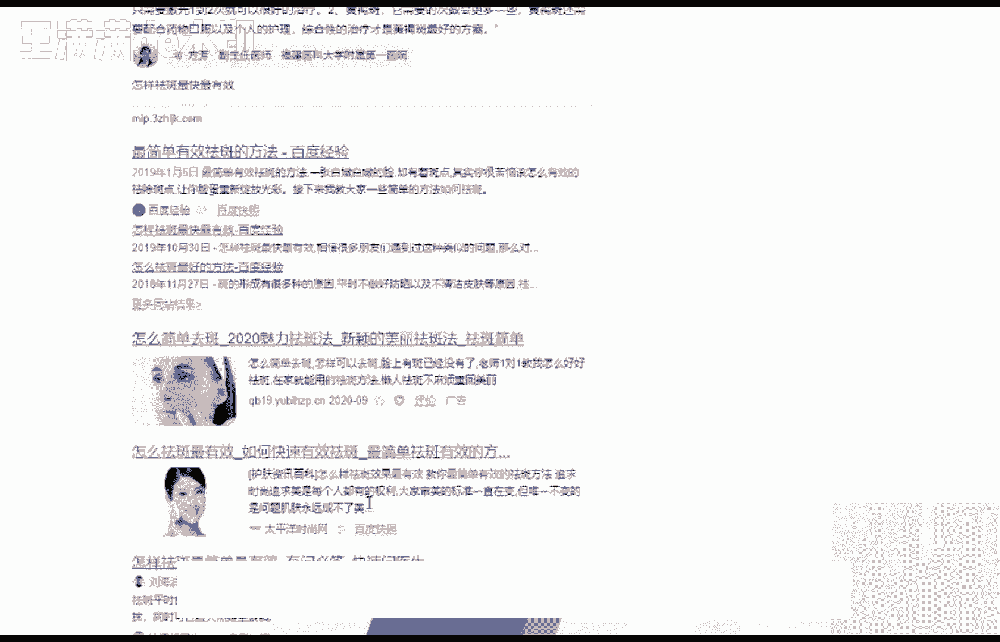

应该是。

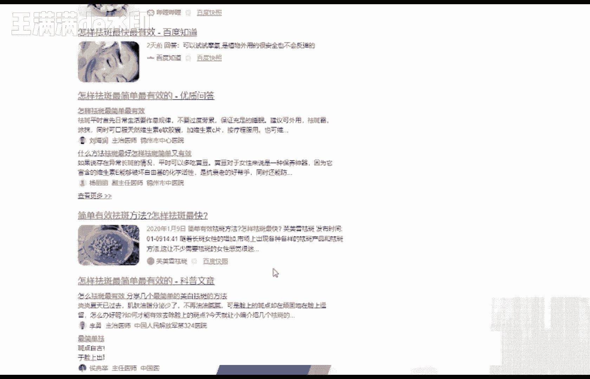

啊应该是这个你看这篇文章，他还是他还是排名比较靠前的对吧，我们同样写小红书文章的话呢，如果说你每篇文章结构都很松散，没有这么科学的去写这个去写这个词，或者说没有结合这个词去写这篇文章。

那他的排名是十分糟糕的，甚至说不是十分理想的啊，所以说我们在在写文章的时候呢，一定要注意一下这个问题，另外呢图片中加上这个关键词的一些标签，包括结尾处呢加上一些这个关键词，相关的一些话题，这样子的话呢。

更有助于说我们这篇文章呃比较精准，或者说比较直接对吧，唉呃那么还有一个需要给大家注意的是，给大家说的注意的是什么呢，就是不能出现太多的这个相关的一些关键词，因为太多的话搜索引擎就觉得你十分太刻意了。

对不对，你不能说说两句话，说一句话，非要带上这个词也不行对吧，那我们再把这个文章这篇笔记发布完了之后呢，我们可以做一些什么呢，就比如说可以做一些这个基础的提高啊，比如说用自己小号去搜索给这个笔记啊。

去点赞即可，但是这里呢给用自己的小号去搜索，给笔记去点赞了，又有很多人做，不会有很多人做的是错的啊，直接我直接他拿起手机打开小红书，搜这个关键词，搜到之后打开自己文章，点个赞好了，手机关掉下一个号。

其实不是这样做的，真的不是这样做的，我们要模拟正常人的一个用户，去读取到我们小红书文章的一个感觉，一个步骤对吧，就是说第一个要慢慢的去阅读，第二个呢不要一下子去拉到最底下面就去点赞，或者说就去评论啊。

一定要是看完慢慢慢慢的阅，读完之后图片点开来看一下文字，慢慢的看完之后，然后你再去点赞，如果说你刚点开这个文章一秒钟或者五秒钟，你就去点赞了，或者说你就去干嘛了，那小红书就会判断你这个人肯定是个机器号。

或者说你肯定是个小号对吧，那么对于一些这个小红书，文章的一些关键词的排名呢，大家也可以看一下，比如说我们的关键，我们的笔记排名上不上上不上去啊，有一些什么样的优化的方法呢。

这里呢给大家建议的呢是我给大家建议的是，重新选择相关的关键词，包括我们重新去写一些笔记，直到你把这个关键词优化优化好为准，如果说你不太知道自己怎么去选择，这个相关的关键词呢，你可以去看一下这个上面一课。

也就是第16课，好好的看一下这个第16课里面的一些内容啊，还有一些这个那朋友会问了，这个排名老是会掉，怎么办啊，其实这个是很正常的，我们只要继续创作优质的笔记就可以了。

甚至说我们可以去多个账号共同去创作，这个也是可以的，因为大家可以看到那么多个相关的这个词呢，几百个几万个都有对吧，你每个行业都有一些这个相关的词，都可以去做啊，还有一个问题。

就是说大家非常关心的就是人工排名的这个，到底靠谱不靠谱啊，其实人工排名呢它的风险是比较高的，而且呢排名的时间是比较短的，大家可以根据你们自身的需要来进行选择，比如说你只要能够去排名排到前面。

或者说只要维持这一段时间就可以了，那也可以，这个也可以，但是呢我不建议大家去做这个人工排名啊，如果说你是个人的话，我不建议你这样去做，这样子呢第一个成本比较高，第二个是没有什么太大的一个效果好的。

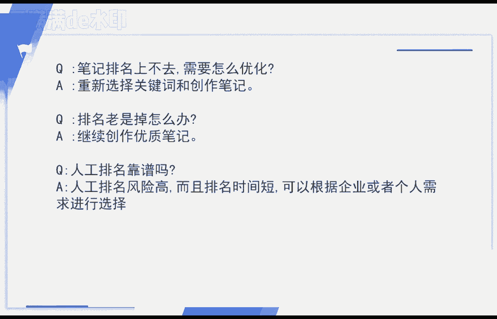

那我们今天关于这个小红书的笔记，发布的内容呢。