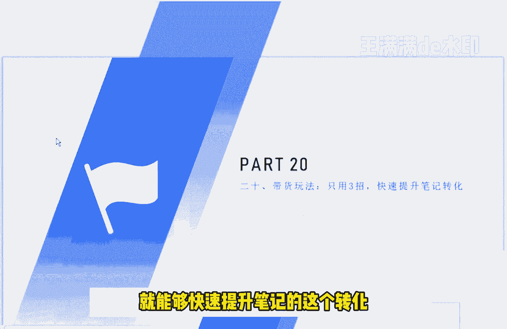
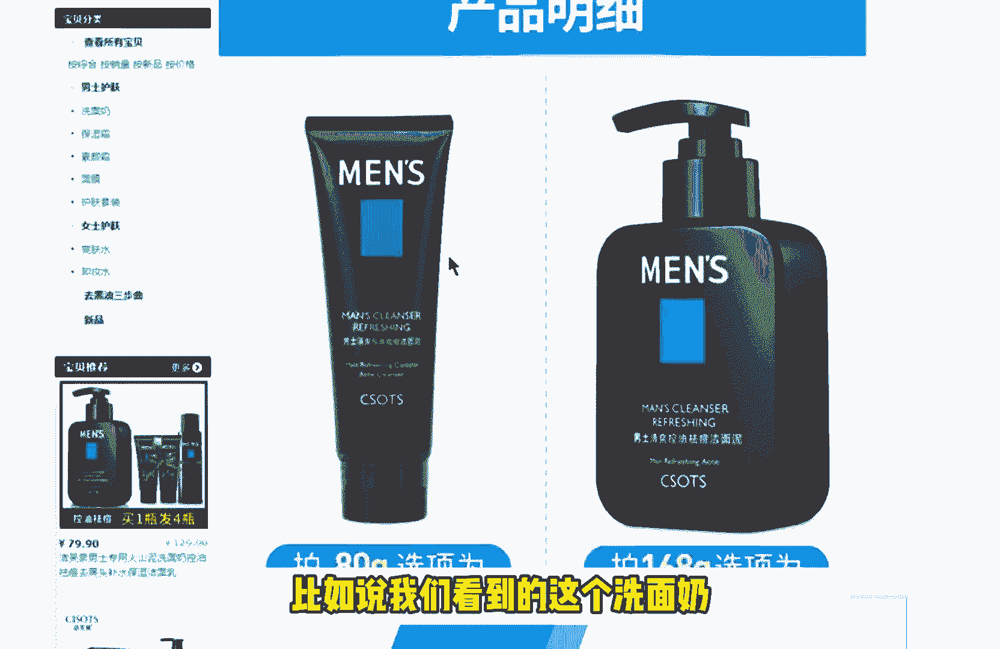
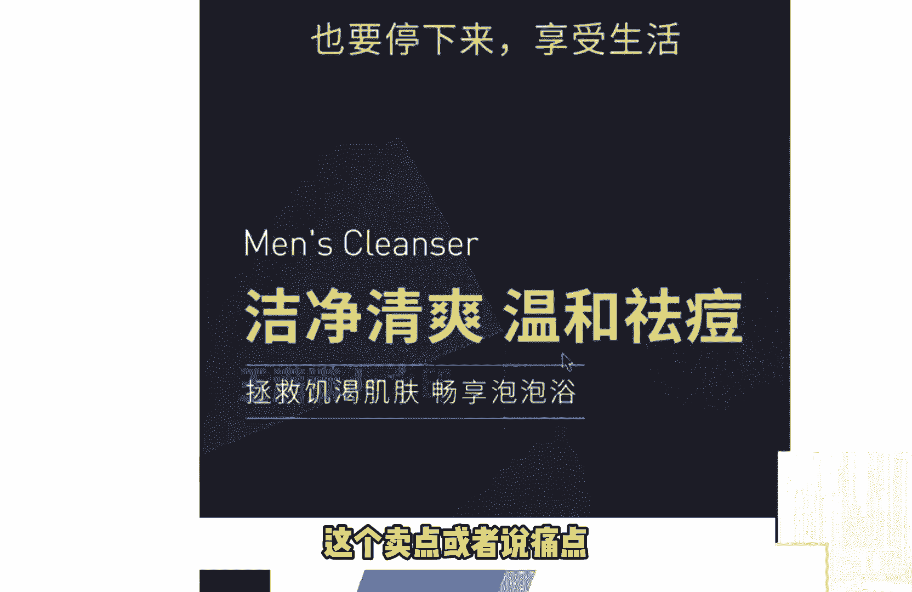
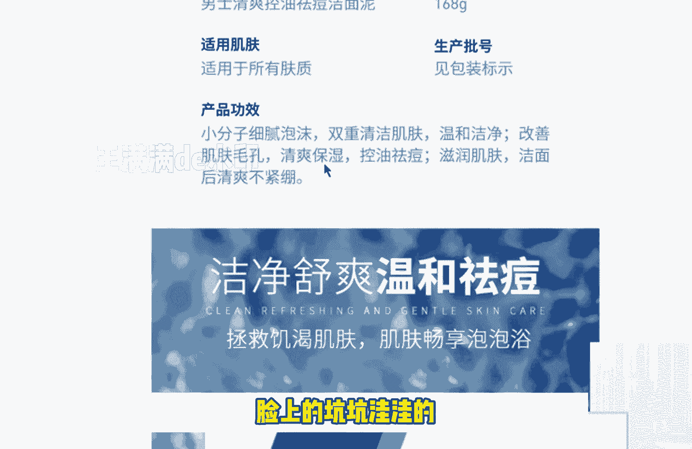
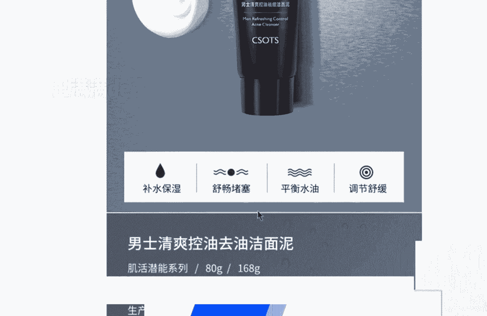
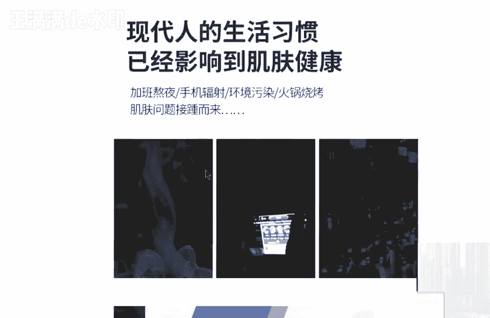
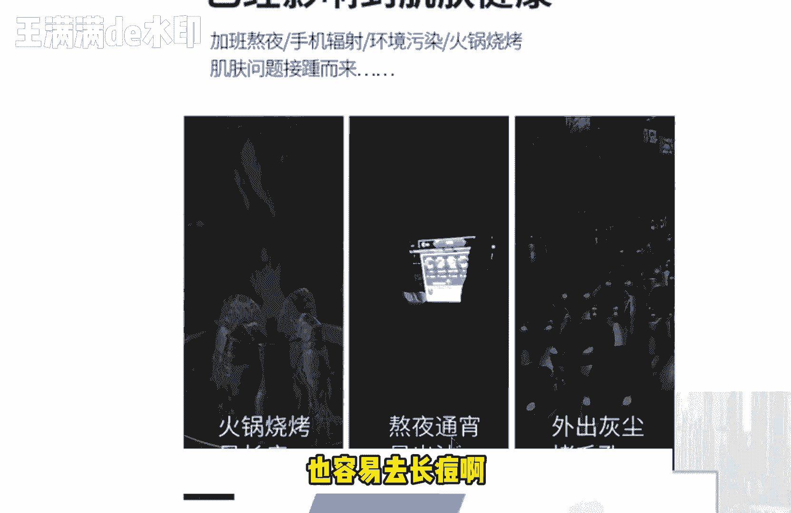
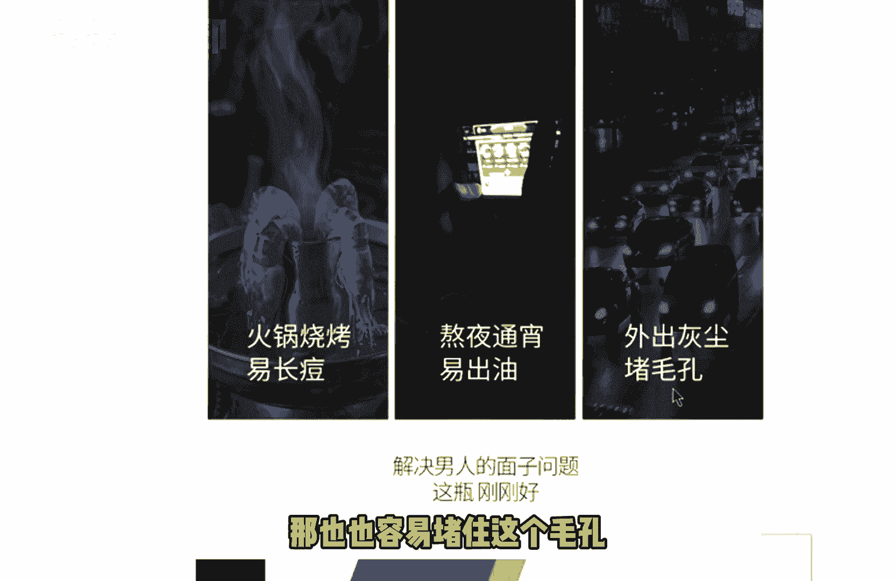
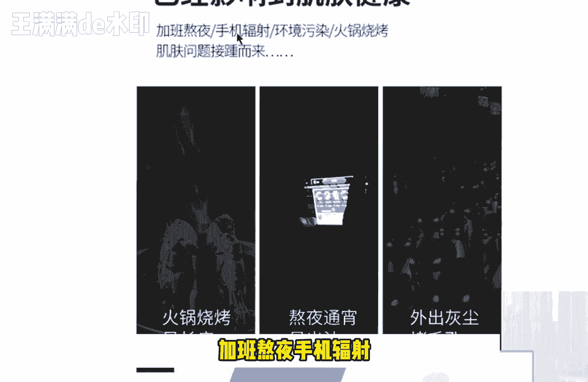

# 【2024版小红书体运营教程】全B站最良心的小红书开店运营高阶教程合集！小红书体开店 起号真的快，赶快点赞收藏起来 - P24：第23节：小红书电商带货玩法，只需3招，快速提高笔记转化！ - 色温呃谔谔 - BV1Ww4m1i7nQ

大家好，我们今天的这个第20课呢，给大家讲解的是带货的玩法，只要用三招呢就能够快速提升笔记的这个转化。

那提升笔记的转化的话呢，首先啊我要和大家说的是什么呢，就是说我们应该做到哪些这个呃，哪些点呢，才能够精确的做到，让这个产品呢，植入到我们的这个小红书笔记里面，然后呢引导别人去下单。

那首先第一个呢就是要有一些使用，一些有痛有恐惧或者说痛点的，这个呢去刺激一些用户，比如说没有这个产品的，生活将要变得有多么糟糕对吧，比如说我就见过一个最简单的一个案例，比如说一个祛痘的一个产品。

那如果说你的脸上一直在长痘的话，可能啊比如说一直找不到男朋友啊，或者说一直找不到女朋友啊，啊生活上一直遮遮掩掩的呀，本身就不自信啊，对不对，那因为有了这些痛点的话，所以说咱们才需要去卖这样的一个产品。

那如果说没有这样的一个产品的话呢，本身我们的生活呢就要变得很糟糕对吧，这种痛点我们到底该如何去寻找呢，其实呢我们主要是看这个同行的一些，看我们同行的这些商家就可以了，同行的商家是怎么去找呢。

比如说我这里能简单的跟大家介绍一下，我们看一下这个淘宝里面，淘宝里面，比如说我们看到的这个洗面奶呃。

他的这个洗面奶到底是有哪些这个卖点，或者说痛点。

看到了吗，呃拯救肌和肌肤，皮肤干的时候可以用到控油的呃，控油祛痘，保持清爽的，那比如说你的脸上一直在出油啊对吧，出油的这个痛点是什么啊，比如说这个脸上呢就导致这个毛孔闭塞是吧，脸上的坑坑洼洼的。

或者说皮肤一直很干燥。

那皮肤一直在掉皮，对不对，这些呢他都是这个商品的一些卖点。

那有了卖点之后呢，反过来来说，就是我们这个平时的一些人呢，所遇到的一些这个痛点，比如说水油不平衡对吧，比如说毛孔经常堵塞啊，或者说皮肤很干，没有水分对吧。

这些呢大家都可以去看的，那这些额下面的这些卖点呢，就是我们等一下等一下去说的，那有了这种痛点之后呢，我们就可以去找到相应的这个对应的痛点，去写作，第二个呢就是我们的这个场景的一些代入，比如说熬夜啊。

或者说一些差的生活习惯从啊所导致的，比如说我们可以看到像这种场景，那场景的这种代入，比如说这个场景对吧，他经常呢在外面吃这个烧烤或者说吃火锅啊，比如说在外面经常熬夜对吧，也容易去长痘啊。

比如说外出的时候呢，这个灰尘比较大，那也能也容易堵住这个毛孔。

那这些的话呢就是使我们的一个使用场景了，有了这样的一个使用场景的话，我们才能够正式的推出我们的产品，对不对啊，包括这里面可以看到加班熬夜，手机辐射环境污染。

火锅烧烤，皮肤问题，肌肤问题也就接踵而来了，那有了这样的一个不好的一个习惯，导致的这种情况呢，从而我们就会让比如说让这个啊，一些这个粉丝呢感到自卑，对吧啊，没比如说有因为这样的情况导致。

导导致了自己呢没有这个太多的一个嗯自信，从而呢缺少这个社交等等，那这个也是我们现在一些青年男女们，所遇到的一些问题，那么第三种呢，就是我们可以去制造一些美好的，这个美好的一个感觉啊。

比如说没有这个产品的话。