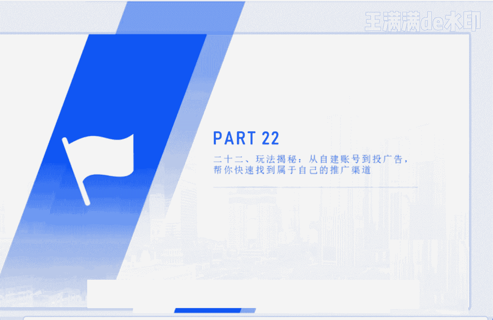
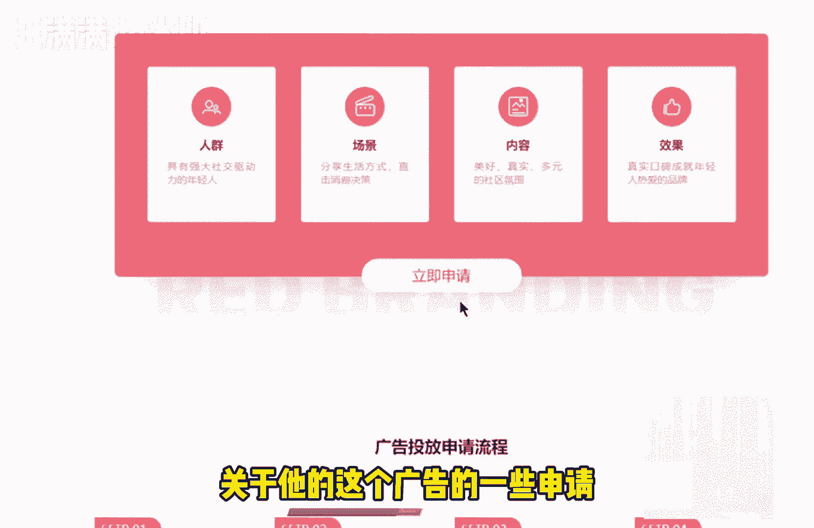
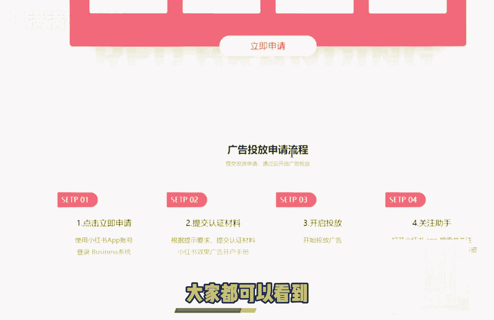
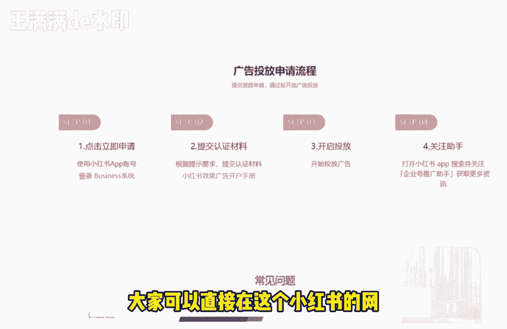
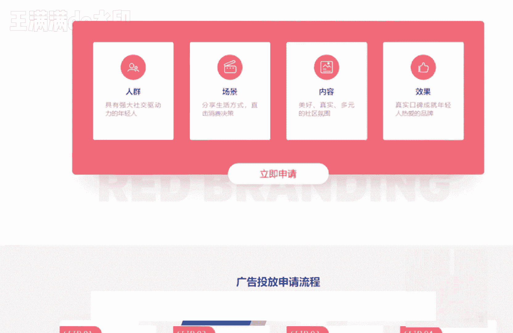
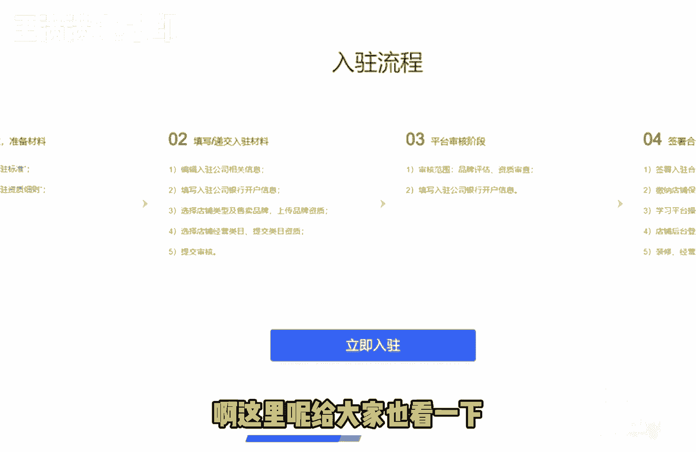
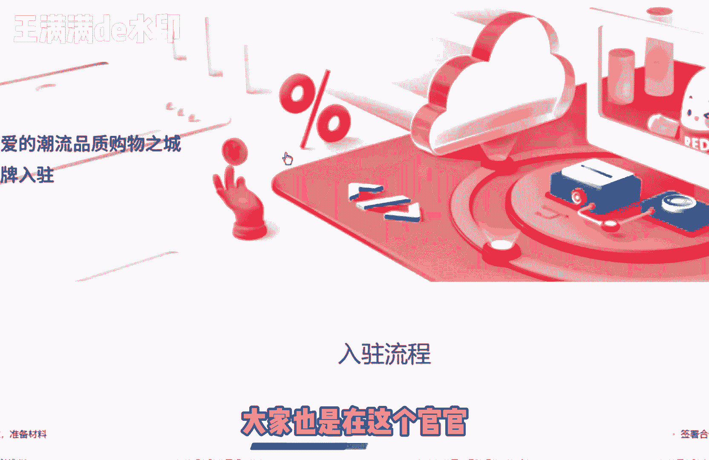
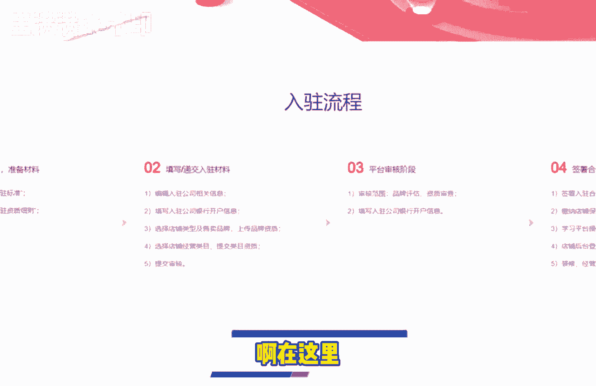
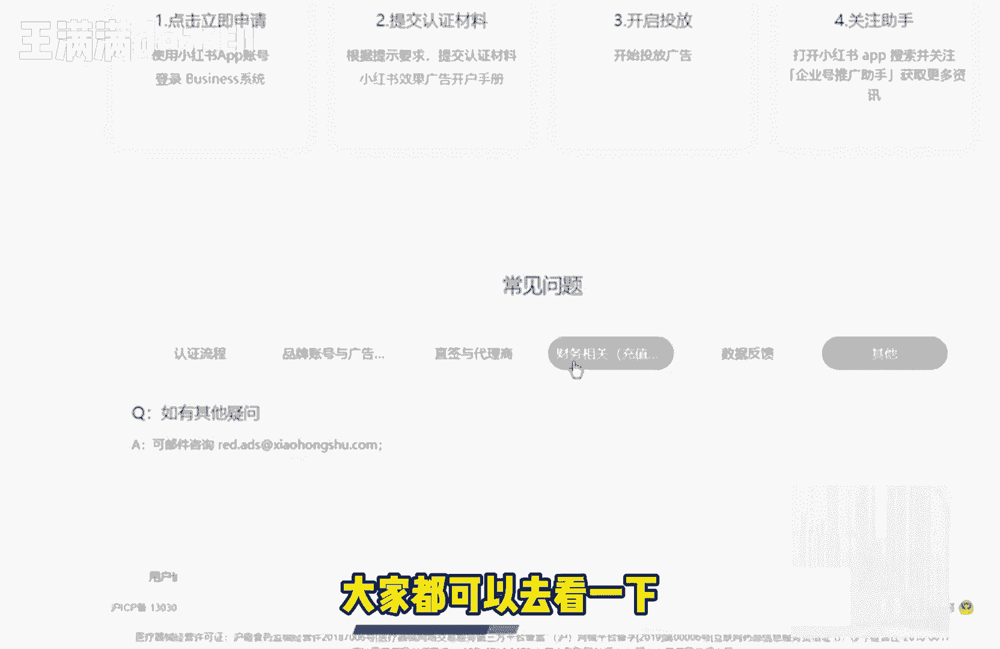
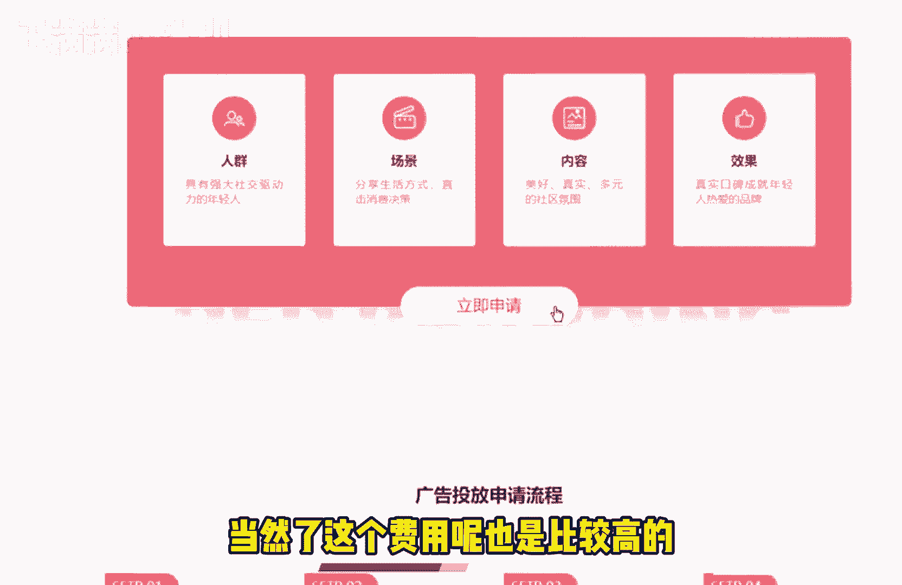

# 【2024版小红书体运营教程】全B站最良心的小红书开店运营高阶教程合集！小红书体开店 起号真的快，赶快点赞收藏起来 - P26：第25节：小红书暴力玩法揭秘！吸粉推广篇 - 天边云-彩 - BV11b421q7uD

今天这节课呢，我们和大家讲解的是这个小红书的一个玩法，揭秘啊，很多人比较关心的是，到底是自建账号去投放广告比较好呢，还是说自己去和官方去投放广告比较好呢，那么我们今天呢就和大家去理清楚。

这两者的一个关系，那首先呢我们和大家介绍一下，就是小红书的这个账号啊，它到底是可以分成哪哪三类，那第一类呢就是我们经常见到的这种企业号，企业号的这个大部分的作用呢，是可以树立我们官方的一个品牌形象啊。

比如说我们可以拥有一些官方认证的标志，开展一些官方拥有的一些特权，比如说呃可以去展示我们品牌的名字，品牌的一些这个地址等等，更方便的我们去开展相关的业务，那第二个呢就是我们的这个个人号。

现在呢大部分的朋友呢都是做的，这种小红书的个人号，那个人号呢有一个啊比较大，比较大的一个特点是什么呢，就是说它比较灵活，他可以是这个品牌底下的员工对吧，可以是这个品牌底下的呃，一个使用的一个消费者等等。

那这样子的话呢，同时也拥有了更多品个人品牌的相关的特色，那品牌相关的人物和员工出镜的话呢，也是理所当然的，这是个人号的一个使用情况，那么第三种呢，就是我们之前课程里面讲过的这个引流号。

引流号的话呢可以是多个，也可以是嗯很也可以是比如说几个，对吧啊，这个引流号的作用大部分是什么呢，就是我们之前的课程里面也和大家讲过，就俗称是炮灰号，可以用完之后就扔掉的。

或者说这种号呢本来就不是太重要的啊，我们随便去打理一下就可以了，遇到紧急情况的时候呢，可以拿出来当小号去使用，一般呢像这种引流号呢，是没有太多的这种个性的规划的，那所以说一般的像我们看到的这种呃。

品牌的推广啊，或者说推广的这种渠道呢，基本上都是以我们的这种企业号，个人号，或者说引流号去自己去发这种笔记去进行引流，那么我们给大家今天这节课的建议是什么呢，就是打造这个企业号的矩阵里有一些建议啊。

首先呢就是我们的品牌号的有一些活动呢，个人一定要去积极的参与啊，比如说我们相关的这种婚纱的这种企业号，或者说我们做这种服装美妆的这种企业号对吧，有一些试用，或者说有一些团购的这种活动。

我们可以拿一些小号去逐个的去参与他的活动，那么第二个呢就是个人号的一个展示，品牌的相关属性啊，比如说我们的这个品牌属性，到底是定位是年轻人的，是城市的年轻人还是职场的年轻人对吧。

这种呢我们可以在个人号的这个笔记里面，多多的去暗示别人，那么第三个呢就是我们的个人号，要经常去发布某些品牌的一些产品，那当然这个发布的频率呢，我在之前的课程里面也和大家讲过了。

发布的这个频率呢不一不不啊，不要去发的太多，一般的话呢最好是三七分对吧，就30%我们是用来做这个营销，那70%呢我们可以用来做啊，这种种草或者说科普类的这种文章啊，这样子来说呢，这个比例是比较不错的。

那最后呢如果说企业号想要去做引流的话呢，最好是用这种引流的小号在这个底下，在底下去用这个评论的这个方法，来去做我们相关的一种引流，那么跟大家讲了，这个企业号的一个矩阵的一个呃提议之外呢。

之后呢我们大家还知道有哪些跟这个矩阵号呃，之外有还有哪些这个推广的方式吗，我们今天呢就和大家介绍的是这个，另外一种就是小红书官方的一个广告，啊小红书官方的一个广告呢，它其实就是小红书CBC的一个广告。

也就是我们经常可以看见的，这种竞价的这种广告，那它它到底是什么样子呢，我们一起来看一下，这个呢就是我们小红书的这个主页，关于他的这个广告的一些呃申请申请流程呢。

包括使用的一些场景啊，大家都可以看到，这里面呢是官方的一个申请的一个流程。

大家可以直接在这个小红书的网站里面啊。

小红书的网站里面，然后呢在这个业务合作啊，在这个业务合作里面就能够快速的去找到，这里边有一个推广合作，推广合作，然后呢但是这个推广合作呢有一个前提呀，就是必须让我们有先拥有一个企业号。

那我们这个企业号的话呢。

该用什么样的方法去注册呢，啊这里呢给大家也看一下。

有个企业号的一个入驻流程啊，这里呢大家也是在这个官网。

官网里面去按照这些的这个额啊。

在这里按照这个官方的这个过程呢就可以了，很简单，提交我们相关的这个资质，然后呢有一个审核费用，审核费用去认证之后呢，啊那我们就是普通的账号，就会变成我们的这种小红书的，这种官方的这种账号。

那有了这种官方账号呢，我们就可以去投放我们相关的这个相关的这种，信息流的广告，那我们信息流的广告的话呢，主要也是分为两大类啊，第一大类呢是我们相应的这个信息流的广告，信息流的广告呢啊。

我相信大家也应该接触的很多了，信息流的广告呢，就是说呃，我们在浏览小红书首页的一些信息的时候对吧，它会不定期的在这个信息的这个里面呢，会出现会出现我们的相关的一些广告，还有一种搜索的一个广告呢。

啊还有一种搜索的广告呢，就是我们看到的这个用户搜索的这个广告，那用户搜索的这个广告是代表什么意思呢，就比如说啊一个用户在搜索这个帽子的时候，对吧，我们可以给他跳出来一个呃，相关的匹配的一个搜索。

比如说他他是呃搜帽子的一些东西的时候，我们可以给他推荐一些大衣，或者说推荐一些外套和这个东西搭配对吧，比如说他选择的是这个最近的啊，最近的，比如说是一个啊考研的一个情况对吧。

或者说他需要这个考研资料对吧，那我们给他们给他很可能是推荐的一些这个，比如说呃补充身体能量的一些这个商品，那总之呢这个是和小红书的一些官方算法呢，是有关系的，这里呢给大家介绍的是什么呢。

就是我们投的这个搜索竞价类的广告呢，就是关键词搜索的这个广告，最具有代表性的那就是百度了，其实这些小红用的都是跟这个百度去学习的，针对于某些关键词的一些竞价呢，实现排位的不同。

也就是说我们在这个关键词里面去出的这些竞，价呢出的这个价格不一样啊，那我们为出来的这个广告位呢也不一样的，基本上现在信息流的这个广告位呢，可以分成这以下的三类，第一类呢就是我们的第三位，然后呢第13位。

然后呢第23位啊，这个呢关于其他的一些这个嗯，信息流广告的一个投放的常见问题呢，大家都可以在这里面啊，在官方的这个里面呢都有一些相关的问答，大家都可以去看一下。

都可以看一下，如果说呃大家觉得就是自己的这个品牌，或者说自己的这个嗯相关的一些这个企业呢，有资有这个资质的话呢，可以去认证和申请，当然了，这个费用呢也是比较高的啊。

也是比较高的，所以说呢我可以建议大家，就是在资金允许的情况下呢，建议我建议去和官方去合作，投这种搜索的竞这种竞价广告，因为它毕竟是直接由我们官方来推荐，相应的这个流量的，好了。

