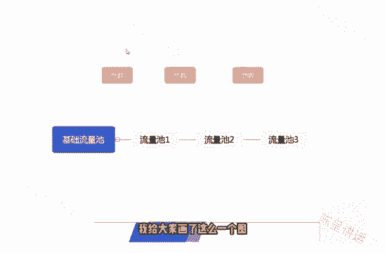
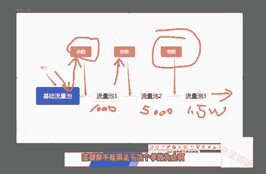
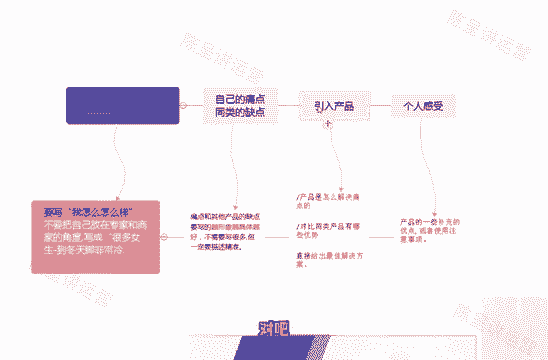
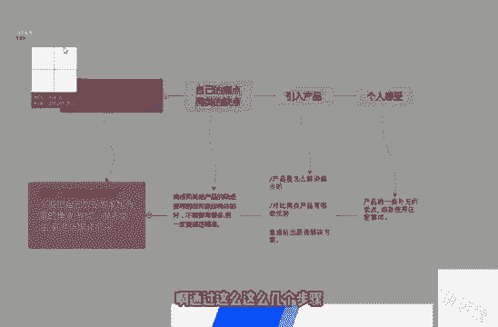
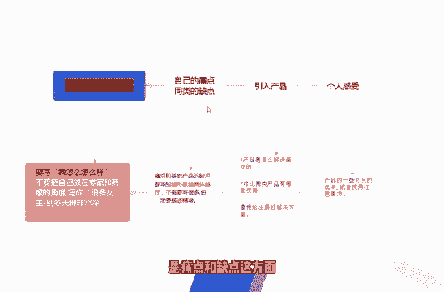
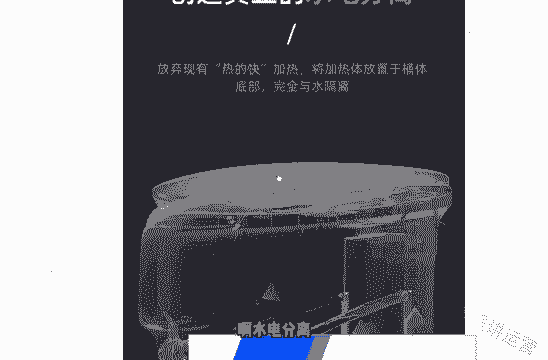
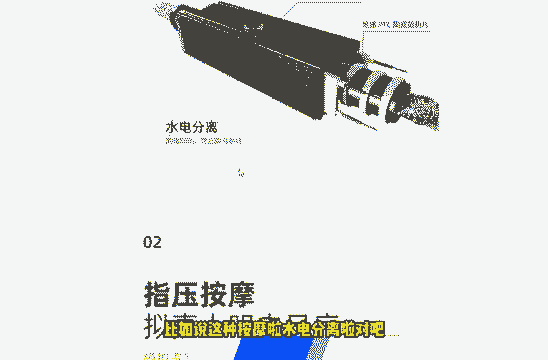
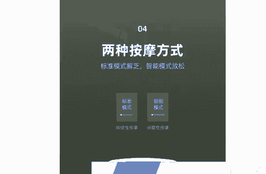
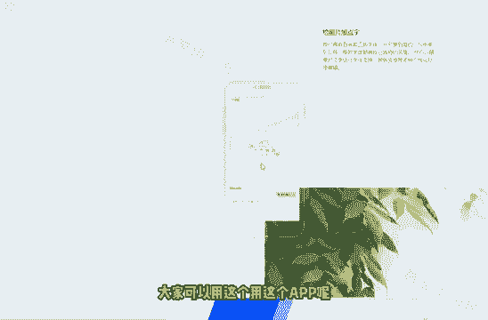
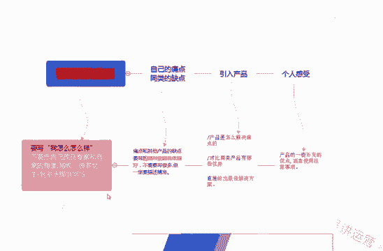

# 【2024版小红书体运营教程】全B站最良心的小红书开店运营高阶教程合集！小红书体开店 起号真的快，赶快点赞收藏起来 - P2：小红书运营教程一 - 上海小姑凉 - BV1U7hFeJErj

我们这节公开课呢给大家带来的是小红书这个，app相关的一些运营技巧，还有一些引流的一些小技巧，那在这个第一项第一大节课里面呢，给大家讲的是一个小红书的基础知识，相关的一些注意事项。

包括小红书的一些最新规则呃，熟悉我的人也应该知道了，我做一个项目之前，或者说做一个平台之前呢，首先是要和大家讲清楚这个平台的一些规则的，我比较喜欢一句话，知己知彼方能百战不殆。

所以说我在每次讲到相关的这个项目的时候呢，都会和大家提前说到，这个平台的相关规则和这个注意事项，好的，那我们先来看一下第一小节课，首先呢，我们来带带大家去认识一下这个小红书app。

小红书app到底是什么样子的，然后呢它的这个流量板块呢到底是哪些地方啊，哪些地方呢，它的这个流量板块流量呢是比较多的，这里面呢我用的是这个手机模拟器，给大家看一下，啊首先我们来看到的这个发现页。

我们打开小红书app这个界面呢，它有一个发现页，这个发现页呢是主要的流量的一个来源，基本上呢是会做到一个特征匹配的，就是说平台会根据你的相关的用户资料，来给你去匹配一些这个相对应的一些栏目。

里面的一些这个啊笔记视频也好，可以看到这个上面呢是根据我的这个账号信息，所匹配匹配出来的一些这个视频，啊会根据我的这个用户的一个画像，因为我这个号呢是一个女号，然后在注册这个账号之前呢。

选择了一些这个上面的一些，就比如说宠物啊，美食啊，VLOG啊，我是选的这些标签，所以说他会根据这些标签，根据这些算法呢，来跟跟我推荐一些其他的一些笔记，那第二个这个流量板块呢，就是我们的这个呃位置页。

也就是说比如说我这个手机定位的是上海，那他给我推荐的呢是上海的一些这啊，一些个这些小红书的一些笔记，大家可以看一下，有这个景点啊啊，啊那这里有景点啊，景点拍照地，餐厅玩乐逛街周边游，展馆。

基本上是和这个当地的一个地点有相关的啊，也有一些这个相关的一些笔记，第三个位置呢是我们的这个关注点，也就是说我关注了一些谁，像我这个是新号的话，就是没有去关注别人，他这里面会和啊。

会根据我的一些算法呢去推荐一些这个关注，我们以后做号的时候呢，如果说我们这个账号做的也还不错的话呢，也会被系统推荐到这个关注页里面啊，关注页里面通过信息流的这种方式呢，展现在别人的这个账号面前。

啊说完了这三个流量比较大的这块呢，那剩下来的剩下来的比较大的这块呢，就其实就其实就是这个搜索框了，这个搜索框呢，通常呢有一些这个热门的一些搜索词啊，这里面有一些热门的搜索词，通过这些热门搜索词呢。

我们也可以去蹭到这些一部分的流量，然后呢，让更多的这个人呢，去关注到我们的这个小红书的账号流啊，这个搜索框的话呢也是大家的一个必争之地，因为搜索而来的用户呢，它的质量往往是非常高的，整个小红书的话呢。

流量的这个板块比较大的呢，也就是这四个板块啊，一个是关注发现，还有这个位置，也包括这个搜索框都是比较大的，那我们这节课呢和大家聊一下，这个小红书的相关检测的一个规则，关于这个小红书检测的规则呢。

我从这以下四点来和大家详细的讲一下，第一点呢就是小红书它会检测我们的检测，我们的这个个人资料，笔记内容，私信以及评论这几个地方，在这几个地方呢它就不得含有一些微信号码啊，微信号，微信二维码，代购啊。

水印啊，包括这个推广淘宝店铺的一些营销词汇呃，但是小红书管的比较松一点的是什么地方呢，他官方啊个人资料官方是允许邮箱存在的，也可以呢用这个微博去替代这个谐音啊，去进行引流。

然后呢再用话术引导到我们的微信上面啊，当然了，这个课程的话呢是在后面会和大家详细的去说，到第二个检测的内容呢，是小红书会检测我们的这个手机设备，最好呢同一同一台这个设备呢，额最多只能登录三个账号。

这这边呢大家一定要注意一下，然后呢关于笔记内容的话呢，大家要注意的就是不得去诱导用户，比如说去关注领奖啊，点赞抽奖啊，这些呢都是小红书明令禁止的，这个呢就是诱导用户的一个行为。

那第四个呢就是内容的原创度，原创度，保护程度呢在小红书的这个平台上，它是比较高的，在推广的时候呢，我们也不要说啊，你写了一篇文章，然后呢去多个账号在小红书上面去发布，这样子呢这样子的话呢是不可以的。

一篇文章一个账号去发也就可以了，不要去多发，还有一个关于这个小红书检测的一个规则呢，实际上是一个敏感词的一个检测啊，敏感词的一个检测，就是我们在呃，接下来也会大家会遇到的关于敏感词。

关于敏感词的一个检测呢，这里面我给大家介绍了两个网啊，两个网址，两个网站，一般的话呢，就比如说我们小红书上，就比如说啊手机卡啊，金融啊，电子烟啊啊，电子烟代购医疗用品等等这些东西呢，大家尽量不要去碰。

那有的人可能会说了，我在写这个小红书文章的时候，万一我不小心把这些词呢，还有一些没遇到的一些词呢给加进去了，那怎么办呢，对吧，那就会用到我们这个敏感词的一个检测的，这么一个啊网站这里面呢。

我来我来用电脑给大家演示一下，我们首先打开这么一个第一个网站，就比如说我们现在写了一句话，对吧啊，写了一句话，很长很长，但是呢里面有代购这个词，这里面呢我已经去，我已经刚才，好我们现在刷新一下。

我们把这篇文章假设去粘贴进去，然后呢点击立即检测，他这个时候就会就会给你显示出来啊，代购这两个字是敏感词，大家可以看到了吗，是敏感词，是小红书相关的一个敏感词，所以说你这个时候就可以去看到了啊。

包括我们用这个，啊这个是需要注册的，这个注册的话呢，大家到时候注册一下也就行了，然后我这边就不跟大家去演示了，他的使用这个规则也是一样的，然后呢这里面会跳出来一个过滤的一个结果。

实际上呢我们基本上用这个网站呢，它去检测的话呢，也就基本上够用了，也就是说我们平时在写文章，通过我们把这个文章啊发到这个网站里面去，让这个网站呢去检测它，就会检测出来，我们我们的这篇文章里面，好了。

这里面呢我还正在给大家整理当中，呃不过呢也很快在这节课录完之后呢，这些词就会整理出来，我们这一小节课呢，来和大家简单的讲一下，小红书的推荐的一些机制和规则，其实小红书的推荐机制和规则呢和这个抖音。

包括头条这些平台的逻辑都是差不多的，用户呢以及内容都会被打上相应的标签，就比如说我们在发送这个笔记的时候呢，都会被系统打上这个标签，然后呢每篇笔记都进都会进行机器审核，额。

看一下这个检测出来的这个内容是否有违规，如果没有的话呢，就会进行一个大数据的一个算法匹配分发，就像我上一节课和大家说到的，检测的一些词汇，包括检测的一些词语，都是会在这个里面进行进行到一个呃一个作用。

如果如果这时候系统检测到，检测到你是由相关违规的话呢，如果这个机器啊，也就是这个程序这个算法，它不能确定它会进行相应的一个调整，就是说会把这个有疑问的东西，过给这个人工去审核，如果人工再去审核的话呢。

确定是没有问题的话啊，然后才是进才是能进行分发匹配的，如果你的这篇文章啊，这篇笔记又被机器判定为这个违规，然后又被人工判定为违规的话，那基本上就会去被关到一个小黑屋里面啊。

就会被限制账号发言啊等等这些操这些操作，另外的话呢我们这个在推荐的时候呢，系统会提取这个笔记中相关的一些关键词，图片的标签啊，话题啊等等来分到对应的这些类目里面啊，其实大家在一开始注册这个小红书的时候。

也就发也就会发现了呃，小红书呢会要求每个用户去选择，自己的这个地理位置，包括喜欢的一些领域，他为什么要选择这些领域呢，也就是为了让大家去啊，给自己的这个兴趣打上一个标签，然后呢他就会根据这些兴趣。

然后匹配我们相关的一些笔记，然后呢进行内容的一个分发啊，下面呢最后呢要和大家说的呢是推荐后呢，不代表用户就可以搜到这个笔记，因为这个笔记呢必须要被小红书去收录才可以，这里面呢给大家提个醒啊。

就是我现在在外面也也看到很多的这个，一些机构啊，或者说一些这个呃做项目的人啊，他会说百分百分百包这个小红书去收录，这里面大家一定要注意一下，就是目前来说的话，几乎是不可能有百分之百包收入的。

包这个小红书收录的，这里面大家一定要注意一下，如果说有的话，那基本上95%吧，可能是骗子啊，这个大家一定要注意一下，如果对方说有包收录的方法的话，最好呢是去验证一下，而不要说直接就去给对方转账。

或者说要对方帮忙去收录，最好是去验证一下，如果对方确实有这个实力的话，再进行转账，再进行合作也不迟，因为根据我们现在这个操作，小红书的这个难度来看的话呢，这一块去要小红书去收录的话还是比较难的啊。

然后呢，我这里再给大家说一下，这个小红书的一个推荐机制吧，很多人都会说这个小红书的推荐机制呃，会很奇怪，他的一篇笔记呢，呃比如说20分钟之前看，可能是1万个阅读对吧啊，可能是个是这么一回事。

然后呢过了一会又变多了，然后又过了半个小时呢又变多了，那为什么会产生这样的一个情况呢，这里面呢也很简单，我给大家画了这么一个图。

啊我给大家画了这么一个图，用这个图呢来去理解的话，就比较很容易比较去理解了，那我们最开始的时候发了一篇笔记呢，啊发了一篇笔记呢，发了一篇笔记之后呢，系统会对应的分配到一个，基础的一个流量池里面。

基础的一个流量池里面，啊这个基础的流量值呢可能不会太高，然后呢因为只是一个基础量，可能只有两三百，或者说一两百的人去啊，会被系统推荐到这个推荐到去看你的这个笔记，但是为什么会有更多的这个流量池呢。

就是因为在你的这个笔记，在被别人看的过程中呢，如果说你的笔记被别人点赞转发以及收藏，也就是我上面所写出来的参数啊，这个参数就是说点赞点赞转发收藏额，我们的笔记发给这些基础流量的时候呢。

然后通过这个参数来判断出来，我这边画给大家画一下，而当我们的笔记，当我们的笔记发到这个流量池里面之后呢，啊如果这个流量池里面的这些用户，他的反他的反馈都是比较好的话呢，它进行了一些转发。

收收藏以及点赞以及点赞对吧，那对应的这个参数呢就会产生一些变化，产生变化，如果这个参参数产生变化之后呢，达到了一额，达到了往下一级推进的这么一个机制之后呢，这个笔这篇笔记呢就会推荐到下一个流量池。

那下一个流量池呢可能是1000起步，1000个人，如果说这1000个人看了你的这个笔记之后呢，点赞转发以及收收藏，这些指数呢依然是比较高，依然是达到了某一个阀值对吧，那他就会推荐给下一个流量池。

下一个流量池呢可能是5000，可能是5000，啊可能是5000，然后这5000个流量值之后呢，再根据这些这些参数的这些占比，如果还是比较不错的，那就可能推到1万或者是1万5啊，这个大家要注意一下啊。

这个后面呢我就不去画了，然后呢他就是这么一个推荐机制，如果说你的这个笔记它的反响是比较好的话呢，它是逐步逐步去被炒热的，不是说不存在说你一个笔记发下去，立马就会有1万个人看到，或者说有5000个人看到。

这个是不可能的，他都是逐步的去推荐的，推荐的这个流量池呢是也是越来越大的，直到你不能满足于这个参数为止啊。

直到你不能满足于这个参数的话，那就只只能是停止在这个参数前面的，一个流量池里面，所以说这个是相关小红书的一个推荐机制，希望大家了解一下小红书的推荐机制呢，并不是说一蹴而就的。

而是我这边这张图呢和大家讲的这么多啊，它是一步一步一步一步去慢慢积累出来的，好了，那关于小红书的这个推荐机制呢，就和大家说到这里了，我们来讲一下这个简单的小红书的，小红书的一个搜索规则。

我们想要写的这个笔记呢，它的内容分发啊，我们大家注意了，笔记的这个内容分发，和这个搜索呢是相互独立的，在小红书的这个平台上面，被推荐的笔记呢也不一定是能被搜索到的，所以说他这他的这个平台的一个逻辑呢。

跟我们平时所接触到的一些搜索引擎的逻辑，它是不一样的，就比如说我们之前在做的那些百度的一些项目，对吧，这个词它一旦被百度去收录了之后呢，那一定是可以去搜索得到的，但是在小红书这个平台里面呢。

它是啊他这两块呢是独立的，也就是说在前面的一节课，我和大家说到了对吧，你的你的笔记可能会推荐给一些人，但是这些人想反而看完了之后，想去搜这些词的话，不一定是能搜得到你的笔记的啊，也就是这么一个原因。

那换而言之的话，也就是说我们想要做下一步这个动作的话，也就是说我们想操作这个，小红书的一个搜索排名，那它的一个前提一定是，笔记是被小红书平台去收录，这样子的话呢，才能去我们进行下一步的一个操作。

这也就是为什么上一节课我说到了，我说呃这个如果有的团队，他说这个小红书的，小红书的这个收入是百分之百的，那一定是有问题的，也就是出在这里，那影响这个搜索排名的因素主要是有哪些呢，一般的是有这个关键词。

包括你的这个权重，点赞以及收藏的这么一个行为，包括其他的一个用户的一个正常行为，就比如说你是不是一个正常用户行为，对吧，嗯正常用户行为呢，就比如说我正常的会去看一下，我第一节课讲的那些个东西啊。

点一点他们看一看他们对不对，那不正常的用户呢，那可能是不会用到这些东西的，同时呢搜索排名的话也将会去延迟，如果你以上的这些这些条件的都是啊，有或多或少的影响的话呢，或多或少的影响的话呢。

同时呢这个排名搜索的这个排名呢也将会延迟，就拿我们这个关键词来说吧，关键词呢是所有搜索引擎的一个核心啊，关键词呢可以分为三三种类型的这个关键词，就像我说的对吧，核心关键词额这个相关关键词以及长尾关键词。

核心关键词呢就是我们的文章，产品，或者是网站主题里面一个最简单的一个词语，同时呢也是搜索量比较高的一个思域，相关关键词呢，它就是核心关键词的一个扩展，就比如说我写了一篇文章对吧，我讲的可能是祛痘对吧。

那你通过什么方法去祛痘呢，那就是啊，比如说我是通过这个呃食疗的方法去祛痘对吧，我吃了一些这个什么什么东西，去达到祛痘的一个效果对吧，这个就是核心关键词和相关关键词的一个区别，那什么是长尾关键词呢。

相对于这个相关关键词呢又是进行了一个扩展，可以是两三个词语啊组成的，也可以是一个短语，短语组短语呢去组成的，比如说有什么办法啊，有什么办法可以快速祛痘，这样子呢他就是一个长尾关键词。

就是包含了之前的一个相关关键词，和核心关键词，这个大家呢要了解一下呃，下面呢说到的这个关于权重的这块呢，就是啊权重呢它是一个比较复杂的一个体系啊，就比如说包括我们发布账号的一个权重。

点赞评论用户账号的一个权重等等等等，这些都是比较重要的，总体来说的话呢，你的这些权重越高的话呢，那么你的笔记呢他的排名也是越高的额，那下面跟大家说一下的，是这个点赞收藏的这个评论呃。

这个因素呢是你的这个排名越靠前呢，肯定是因为你的点赞或者说评论，要么是呃收藏它的这个数量很多，就像我之前前一节课的那个推荐规则，和大家说的一样对吧，同时呢可以增加相关领域啊。

以及这这篇小红书笔记的一个权重，那最后一点呢就是这个用户行为，就是你的这个账号呢，到底是不是一个正常用户的一个行为，这里面呢我就不写了，平时呢我们去就像模拟真人一样，去活跃这个账号对吧。

比如说你可以趁着你啊上下班在路上坐地铁，坐公交对吧，等车吃饭睡觉之前对吧，吃饭了之前对吧，这些时间包括休息的时间，时不时的把小红书掏出来去活跃活跃对吧，啊这个就是我们正常的一个用户行为。

如果你的用户行为，那是正常的话呢，那就是没有太多的一个影响啊，比如说你很异常，什么叫异常的用户行为呢，就比如说你一天什么事都不都不干，天天就在那给别人点赞，那是不是一个一个异常行为对吧。

他就是一个异常的行为，所以说呢这个呢大家也要注意一下好了，本节课呢关于小红书的这个搜索规则呢，也就和大家说到这里了，这一小节课呢和大家简单讲一下，这个小红书文章它不被收录的一个原因。

很多人发了小红书的相关的这个笔记，可能发了半天呢，平台不会去收录它，这里呢我给大家总结了大概是五点的原因啊，来和大家说一下，为什么他不会收录我们的笔记，首先第一点呢我们要考虑一下。

是不是我们进行了一个违规的推广呃，因为有的人在推广这个相关的一些笔记，相关的一些商品的时候呢，就会有了一些这个相关的一些硬广，就比如说包括呃包含了一些品牌的名字啊，这些大家要注意一下，那第二点呢。

就是我们一开始会给大家提到的，就是一个敏感词的一个检测对吧，你的笔记或者说你的账号有没有这个违规，有收入，就算是有收录的话呢，他也会去把你踢出来，就说它收录了之后，发现你的文章里面有违规的这些词。

他也会把你这个文啊，把你这个笔记呢给提出来，有没有这些敏感词，这里要这里要注意一下，然后呢就是一个内容的违规，内容的违规呢，就是包括图片和文字的这两部分的违规额，可能是直接违规呢是没有被收录。

也有可能是收录了之后呢被举报，然后呢去限流，这里面大家注意一下，其中呢是图片的话，我建议大家最好不要去带有，其他平台的一个水印，包括其他平台的一个二维码，因为这种办法的引流呢。

已经不适合在小红书上面去进行操作了，包括这个文字的话呢，一定不要有这个违规词，敏感词等等等等啊，包括有一些不文明的词汇啊，诱导啊等等，对了这里跟大家顺便再提一下，有的这个敏感词呢。

呃就包括有一些这个政治类的敏感词啊，包括我们很多平台都有的一些通用的一些规则，就比如说破坏民族团结呀啊谈论政治呀，额就是什么颠覆国家呀，就这种东西我们是原则上的东西，东西是千万不要有的啊，如果有的话呢。

也尽量的不要在不要在这上面出现，因为大家我们都知道对吧，我们做的是网络项目，我们只想通过网络项目，通过这种合法的手段，合法的营销去赚取一个合理的一个收入啊，千万不要违背这个一些相关法律法规去谈论。

不需要我们谈论的这些东西，包括一些这个明令禁止的一些词汇对吧，包括一些谐音的一些词汇，大家对吧，千万不要碰这一块，然后呢还有一个原因呢，可能是我们发送文章的这个频率呢，有可能是过高，发送的频率过快啊。

然后这个也会导致我们账号的一个异常，导致账号异常的话呢，他就会认为我们是机器人在line发布这个文章，所以说也会导致一个不收录的这么一个情况，那最后一点呢不收录的一个原因呢。

就是很可能是我们这个设备已经被拉黑了，那有的人就习惯了这个小红书这些平台，他是怎么知道我用的是这台手机的呢，那我这台手机上面之前封过号，我又换了一个账号啊，他是他是怎么知道的呢。

这里面呢就要和大家去说一下，因为我们每一台设备的，每一台手机设备的话都是由一些硬件去组成的，就比如说我们的手机对吧，它是有主板啊，电池啊，这个里面的一个硬盘啊对吧，有一个磁盘啊。

包括有这个上网的这个基带啊，信号啊，基带信号天线啊，这些硬件去组成的，当我们接入到手机呢去接入了这个app的时候呢，它会它会读取我们手机上的这些硬件设备，的一些这个参数，就比如说串号呀，IMEI码呀。

包括手机号呀等等，他都会记录下来，如果他发现你的这台设备呢啊，产生了一个违规的行为，哪怕你去这个就是说把这个app卸载了，重新重重新再装之后呢，你登录了这个账号。

他还是会发现你的这个手机设备呢是违规过的，所以说这就是我总结的五点原因啊，有一些不被收录的一些原因呢，大家以后有如果有这个笔记不被收录的话呢，可以对照着这五点去看一下。

我们这节课呢来讲解一下小红书系列的第二课，笔记速成，小红书种草笔记四大步骤啊，所有产品都适用的一个方法，在讲解，在讲解本次这个本小节课之前呢，首先要和大家达成一个共识。

那就是很多人在做小红书这个平台的时候呢，绝大多数的用户还是喜欢，在这个小红书的平台上面呢，去发现和分享一些好物，所以所以说在呃，我分析小红书这个平台这么长时间呢，我认为小红书的话是主要的一个主旋律呢。

是种草笔记啊，也就也就是说大家不要去写一些无关的一些，那种主题，那种话题，而且呢小红书这个平台呢，他本身也是去推荐大家去写这种种草笔记的，所以说我认为种草笔记的话是小红书的一个主，一个主旋律。

只要你去掌握小红书的种草笔记的玩法，那后面做的一些事情呢都是水到渠成的，比如说你去引流啊，比如说你去变现，比如说你去做推广等等，都是非常方便的，为什么很多人说做到做到最后发现啊，我咳我这个引流比较难。

或者说我变现比较难，其实问题就是出现在了你笔记的一个呃，一个风格上面，一个内容的一个方向的上面啊，这里再跟大家达成一个共识，就是说我们最好是在小红书上面写的笔记，是种草类型的，好的说到种草类型的话呢。

那很多人就会理解，很多人呢就通常写着写着就变成硬广了，因为我们之前在这个抖音上，也发现一些这个好物的推荐的视频，大家可能会发现啊，这个文章或者这个视频做出来之后，就感觉非常像硬广。

你说的每一句话都像是为在这个，都像是在为这个商品去做宣传，去做推广，好像每一句话都离不开这个东西似的，那我们该如何规避成这样的一个问题呢，今天的这节课呢来啊，来和大家主要的就是说一下这个问题。

也就是我们如何规避掉这个问题，把我们小红书写出来的这个笔记，尽量的不要像这个硬广一样，这节课呢主要是分成四个小步骤，来和大家去讲解这个种草笔记的一个啊，一个一个书写，那么首先第一点呢。

就是建议大家去做的一个步骤呢，就是去找到一个相关的一个素材，我这边给大家分呃，分门别类的四种类型的素材图片，这种素材图片呢我主要是分成一个产品图，效果图，细节图和使用图，产品图呢主要是一啊两到三张。

效果图的话呢是一到两张，细节图的话呢是一到两张，使用图的话呢是1~4张，通过这通过这些图片啊，从不同的角度去展示这个商品，这个产品它的一些卖点，你就可以根据这些商品，这些产品去把每一个卖点啊。

每一个亲身的感受都可以去写出来，首先就是一个产品图对吧，这个东西长什么样子是吧，然后是效果图，这个东西用起来到底是什么样子啊，细节图就是就是从各个各个角度，各个方位，各个不同的使用场景。

我们来看一下这张图片的一个样子对吧，那最后一张最后一种图片啊，图片的这个素材图片的样式呢，我把它叫做使用啊，使用图就是说我们亲身亲身经历的过程中，在用这个商品，用这个产品的同时的一些的这个照片。

那为了给大家做一个详细的分类呢，因为有的有的人，有的大家可能做的是不同种类的一个行业，就比如说呃可能有的人是卖的口红啊，可能有的人卖的是这个衣服啊，他就像比如说这个卖的衣服的话，他就没有使用图对吧。

它就是一个产品图或者说一个效果图啊，没有说使用这个这一点呢对吧，那所以说我下面给大家列了一张表格呢，就是有些，如果说你是做的这个大类的类目的话呢，那里面的一些图片是可以不用到的。

就比如说如果你做的是服装的话，那细节图和使用图都可以不用去发，只要留着这个产品图和效果图也就可以了，那如果说你是做母婴的话呢，最好还是把这四种图片全部都带上啊，如果你是做电器类的呢。

还是的把这四类全部都带上，但是如果是你是做食品或者是做美妆的话呢，那后面的两种两种图片就可以不用去带了，使用图和效果图啊，基本上可以就可以不用去带了，因为额，这个产品图和细节图。

都已经把后面这两个呢都包含进去了，这个呢大家一定要注意一下，我在这里面已经标了这个横线的啊，这里面是不需要找，这就找到这种图的，那么如何去找到对应的这种这些图片呢，其实也很简单，这里给大家推荐一个渠道。

那就是我们的，那就是我们的这个淘宝啊，比如说我们现在想卖一款这个泡脚桶对吧，打个比方，那我们就可以在这些天猫店或者淘宝店里面，去找到这些产品图啊，产品图肯定都是有的对吧。

那那些使用图和那个呃效果图到哪里去找呢，都是有在这种呃好评里面啊，就是这个评价里面都有一些带图的，大家可以看一下，这些都是使用的图片啊，实实际上就是一些买家秀了对吧，大家可以整合一下。

整合一下这些图片呢啊做一个分类，然后呢我们去写作的时候呢，就可以根据这些图片去写啊，这里面都是有一些买家秀的对吧，这个是相当于就是细节图嘛对吧，有一些追平了，大家可以看一下，有一些追平了。

追平的话呢就是使用效果图了，好第一步呢如何去找素材，那我们这个呢也就和大家说到这里了，下面和大家说的是如何去写这个文案，写文案的话呢也自然是包含了两部分，其中一部分呢是如何去正确的写这个标题。

另外一部分呢是如何正确的写好我们的正文啊，里面的内容内容到底是如何正确的去书写，呃这里呢我给大家举了个案例啊，我们首先来看一下如何正确的写标题，或者说标题应该怎么样去写的更好一些。

左边这个部分呢是原来的一些标题，右边这个部分呢是优化了一些标题，大家可以看一下，那原标题我给大家念一下，男朋友挑选的圣诞礼物，蒸气足浴盆对吧，那我们可以把这个标题优化成什么样子的呢。

无需倒水的蒸汽足浴盆，男朋友挑选的对吧啊，包括这个护肤精油也是的，秒杀卡诗的护肤精油对吧，原标题是终于拥有了这个樱花粉蒸汽锅，那优化过了的标题呢，我们加上了这个词。

终于拥有了这个少女心爆棚的樱花粉蒸汽锅，实际上大家应该可以发现，我们加的这个红色的这个字呢，应该是这款商品的一个卖点的一个词对吧，就比如说樱花粉的这个蒸汽锅对吧，他大部分应该是一个是一个女孩子使用的。

一个商品对吧，那我们可以加上少女心爆棚嘛是吧，呃一般呢我们来看呢这个蒸汽足浴盆的话，比如说嗯他现在突出的一些卖点可能是先进的，不需要倒水对吧啊，或者说多少小时恒温，打个比方对吧。

我们就可以把这个卖点突出在这个标题里面啊，这点呢大家一定要注意一下，标题的话呢，可以优化成这样子去写啊，那下面我们再来和大家说一下这个里面的正文，里面的内容到底是怎么样去写呢。

如果说文章的里面到处都是卖点的话，那看起来就非常像硬广了对吧，也不会也就不会得到小红书的推荐和收录，就像我们之前看到这个标题一样，如果你的文章里面到处都是这个卖点的话呢，那可能对你的文章正文来说。

内容来说的话呢，就会出现呃不太好的一个事情，就是你写着写着就感觉啊，你是你是硬是来推广这个商品的对吧，所以说那我们怎么样去啊，怎么样去来来写这个文章的一个步骤呢，我这里给大家画了一个图，大家可以看一下。

这里呢，就是我建议大家去按照这个步骤去写的啊，首先呢我们最好是要从自己的一个经历去切入，去切入来写这个东西，然后呢去找到这个商品的这个产品的一个缺，一个痛点，自己的一个痛点，同类商品的一个缺点。

再根据这些痛点和这些缺点，我们来引入自己所推广的这个商品对吧。

然后呢最后加上个人的一个感受，这样子的话呢啊通过这么这么几个步骤。

通过这么几个步骤去写这篇文章的话呢，那文章的层次感也好啊，逻辑也好啊，都是非常不错的，那对应的每这四个步骤，每一个步骤该如何去书写呢，这里面和大家说一下，也很简单，就比如说如何从自己的经历去切入。

来写这个文章的一个开头，对吧啊，要写要写成，我建议大家呢要写成啊，我这应该是我怎么样怎么样对吧，不要把自己放在一个专家和一个商家，的角度去写对吧，就比如说我们哦，我们还是拿那个足浴盆来和大家举例吧对吧。

一般的人写这种文章应该啊会说什么，很多女生到了冬天脚都非常的冷，对吧啊，其实最好的一个角度是什么呢，应该说应该以第一人称去写，或者说写一下自己自己的一个经历对吧，比如说啊我是一个女生。

我到了冬天脚就非常的冷，从来没有暖和过对吧，这样子的话呢，他就有一种代入感，很亲切的，很生动的一个代入感，如果你一开始就把自己的这个定位，赞成了一个专家，或者是赞成了一个商家的话。

那别人就觉得你这个是来推销的对吧，没有站在一个第三第三方，一个客观的角度去看待这个问题好，那我们下面要讲的呢是痛点和缺点。

这方面痛点和缺点这方面呢写的越详细，越具体越好，但是呢不需要去写多，不需要去很多，但是呢一定要是去描写清楚，就比如说我们啊，这还是拿这个泡脚桶来作为例子的话，比如说我们一般可以在这上面会发现。

这个泡脚桶，他啊他的一些这个呃对比，你看到了吗，为什么去选，我们实际上就是这个是产品的一个对比嘛，啊本店的这个商品和别人家的这个商品嗯，别人家的这个商品是有安全隐患，残留尾货或者说是老款O型的熏蒸口。

容易这个刮伤小腿对吧，但是我们家的这个新款，专门是为亚洲人的这个腿型设计的，伸缩，伸缩自如对吧，这种就是痛点的一个比较，还比如说我们来看一下这个足浴盆，啊一键启动，就比如说别家的这个商品。

别家的产品没有一键启动，还需要不停的调调，调了很多按钮对吧，我才能去用得上，啊水电分离。

别家的没有水电分离对吧，还有这个啊循环式加温和固定式加温，那别人的别人的这个产品可能是一个固热固固，固定式的一个加温，导致水温不均匀，但是我们家最新的这个产品是K式循环加温，水温均匀啊等等。

这样子的话呢，我们按照这种啊，我们按照这种痛点或者是缺点去写的话呢，尽量的把别人的这个描，别人的这个缺点呢，或者是痛点呢去描述清楚就可以了，好，然后有了这个痛点和缺点，也就是说有了这个有了需要改善的。

这些缺点之后呢，我们就可以对入对应的去引入，我们自己的一个产品，对吧，我们自己的这个产品，那可以从哪些地方来写这个啊，写这些点呢，那很简单，我给大家列出了这个三点，第一点呢。

就是我们这个产品是怎么样解决这个痛点的，第二点呢是对比同类的产品啊，我们又比别人多哪些优势对吧，第三点呢直接是给出一个绝啊，一个最佳的解决方案，大家再可以看一下，我们再找一个，啊再找一个对吧。

比如说这种按摩啦。

水电分离啦对吧，爆破式冲淋啦。

啊水很深很节能，一键启动记忆，智能记忆，防电磁干扰，国家标准对吧，啊，这里面还有一些其他的一些这个呃这些理由啊，这些这个大家都可以去看一下，好针对于这些东西来说的话，我们就可以引入自己的产品。

然后呢把自己产品的一些优点去写出来，直接给出这种最佳的解决方案对吧好了，那这个额正文的最后一步是写的什么呢，是写的一个个人感受，就是我们在最后补充性的来写一下，这个产品的一些啊补充性的优点啊。

包括使用的一些注意事项啊，就比如说你可以去问一下这些卖家啊，我们要卖这种商品的时候，那最后对吧，最后有一些什么样的这个注意事项啊，比如说怎么去保养它呀，对吧啊，比如说我长时间不用该怎么办呀，对不对等等。

这些小的注意事项呢，你可以去稍微的去问一下，那这样子的话呢，我们的一篇文章，正文里面的这个文章架构呢也就很完善了啊，从这个逻辑顺序去看的话呢，也是非常不错的，好了这个就是正文的书写的一个流程。

那这个下面呢我再和大家去讲一下，我们去如何去找产品的一个核心卖点，包括呢如何去寻找一个呃一些痛点，如何发现其他商品的一些缺点，这里面呢其实在刚才演示的时候呢，我就和大家说的比较详细了。

我们可以通过天猫店，淘宝店等等等等这些店家，因为他们这些店家呃，是直接直接的去推这些商品的，所以说他们对于他们自己商品的一个呃，一个就是自信的一个程度，或者说对于市场的一个考量，是比我们要成熟的多的。

我们直接可以参考他们的一些个这些个建议啊，大家可以多看啊，多看一些，甚至说你可以去问一下这个淘宝的这个客服，对吧，你家的这个商品凭什么要比别人家的好，对不对，那他这些客服呢都是很啊。

就是很容易告诉你的这些答案的啊，包括一些这个呃一个这个这个商品，这个行业里面普遍存在的一个缺点，就比如说我们还是以这个泡脚桶为例，足浴足浴盆为例的话，它比如说普遍之前存在的一个问题是什么对吧。

比如说没有那个刚才那个是怎么说来着啊，没有一个就是那个叫什么不适合亚洲人的腿型，大家还记得吗，就经常容易刮伤，那这个是不是一个普遍性的问题，对吧啊，所以说我们就可以针对于这些缺点，这些痛点啊。

包括我们自己商品的一个核心卖点，去写这样的一些文章好了，这个呢是关于写这个文案，就是文案标题和正文的一个内容，我们下面来看一下做图片的一个要求啊，其实做图片的话呢主要是分为两种图片啊。

小红书里面的这个笔记呢，主要是分为两种两种图片，一个是封面图片，还有一个呢是文章的一个配图，配图的话呢啊封面图的话呢那就很简单了对吧，是一张图片，一张图片的话呢，这个里面呢最好是出现啊产品的一个图片。

然后呢加上一些文字啊，加上一些特效啊等等等等，这里面我给大家推荐的呢是使用这个黄油相机，或者是美图秀秀来处理这个我们的这个兽图，大家可以看一下，美图秀秀可能大家都应该知道，但是黄油相机是什么不知道啊。

黄油相机的话，黄油相机的话也是一个非常不错的一个相机啊，它的滤镜都很漂亮的，包括他这里面能给文字去加上一个，正版的一些字体，包括一些这个其他的一些呃模板啊等等啊，反正呢是很现在很流行的一个照片的一个。

处理的一个软件，大家可以用这个，用这个app呢去去处理一些这个照片。

虽然呢有些功能是付费的，但是基本上免费的这些功能呢，足够我们去使用了美图秀秀，那我们就更不用说了，对吧啊，然后说到这个配图的话呢，就尽量是5~8张啊，5~8张的一个配图就可以了，好了。

当我们这个配图做完了之后呢，最后一步呢其实就是检查工作了，检查工作呢啊再和大家说一下，也就是检查一些这个文字的一些错别字啊，一些敏感词，我们在第一课也已经说的很详细了，对吧啊，去检查这些东西。

适当的去换行文字呢不要去太密集，然后呢适当的话呢这个表情符号要多一些，这样子的话就显就显得我们的这个呃，文字呢会更加生动一些，然后再检查一下我们的图片，有没有去带一些水印和二维码。

那这里面呢我就暂停一下，给大家看一篇这个示范性的一篇文章，好这里呢给大家看一下我找到的一篇文章，也就是一篇这个笔记了，这个笔记呢写的还是还是非常不错的，首先呢他的图片大家可以看一下首图对吧啊。

加的这些标签啊，包括这个顺序啊都是很不错的，后面的这个配图呢你看有详细的一些个介绍啊，有详细的一些介绍，关键的呢是我想借用他的这个文字的这个部分，第一呢是文字对吧，适当的去换行，大家可以看一下干性。

干性肌肤，油性肌肤，混合性肌肤，它这里面是有用的，换行的，不是那种眉毛连着胡子的那种感觉，对吧啊，首先人家这样看起来不是很累，看起来很有条理，对不对，好第二个呢适当的可以去多用一些表情。

比如说这个星星啊打的勾呀，后面的这些表情符号，小猴子呀对吧啊，这里面有个什么问号呀对吧，这些都是非常不错的啊，非常不错的，这样的话呢可以显得这篇文章比较生动对吧嗯，基本上按照这种要求写出来的。

这种笔记呢都是非常不错的，所以说大家可以去看一下我找出来的这篇啊，这个笔记的一个一个样子，好了我们再和大家回顾一下，本节课呢也讲了这么长时间了，和大家讲的呢是笔记速成速成的一个一个写法，对吧。

首先第一点呢我们最少要做一张这个封面，首图和一张配图，手头呢需要加上一些文字，配图的话呢可以加上文字或者是打上标签，这两张图的话呢最好是包含产品图和效果图，如果有细节图和使用图的话，会使你的笔记加分。

也会增加你笔记的一个权重好，第二点呢，那就是标题的这个创作呢，要写明产品的一个特点，或者是商品的一个卖点，这里面一定要去加进去，这样子的话就会凸显你商品的一个与众不同。

那第三点呢也就是我们文章的一个正文部分，如果按照以下的这个格式来写的话呢，啊也就是我之前投屏的这个对吧，从自己的经历，然后到自己的痛点啊，然后再引入这个产品，再写最后的个人感受，按照这个步骤去写的话呢。

也是非常不错的，这样子这种格式来写的话呢，啊他就是显得你的文章呢非常有条理，非常有层次感，也非常有逻辑对吧，一层一层意思下来了好，然后做完这些东西之后呢，最后呢去检查一下你的这个文啊。

这篇文章的一个敏感词，敏感图案或者是二维码，那我们这样子的话呢，经过四个步骤，就可以去完美的写出一篇属于我们自己的，这个小红书的笔记了。

