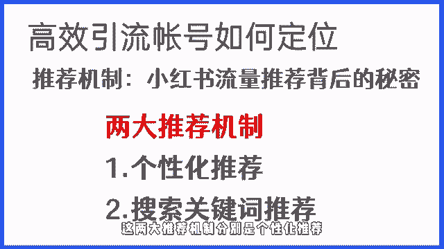
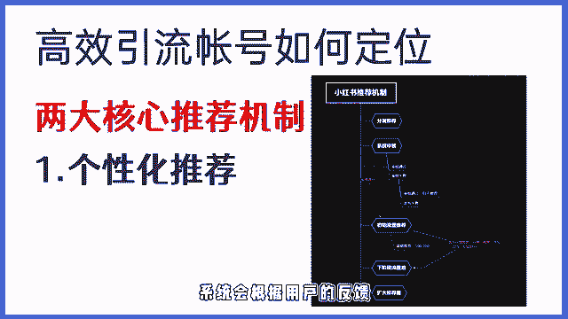
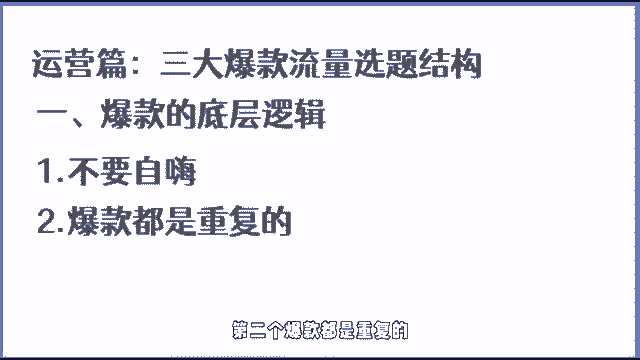
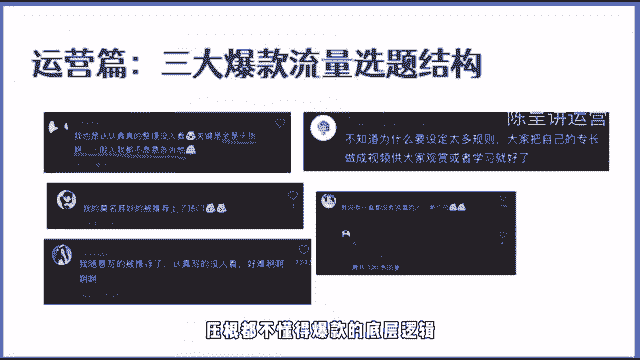
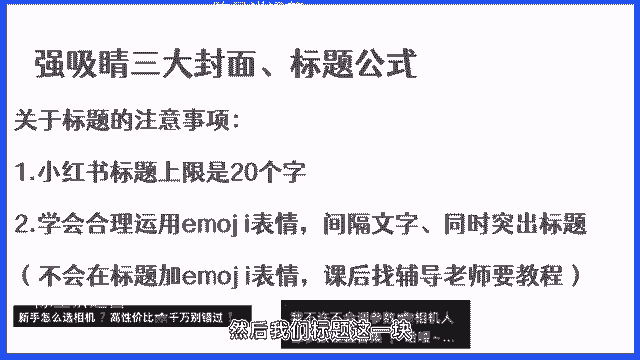
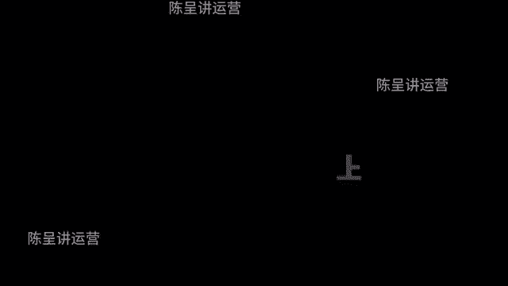
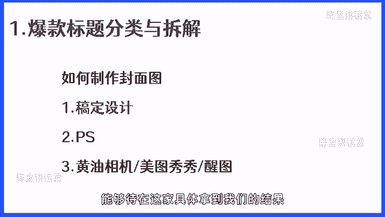

# 【2024版小红书体运营教程】全B站最良心的小红书开店运营高阶教程合集！小红书体开店 起号真的快，赶快点赞收藏起来 - P2：小红书运营教程合集 - 连闪五连鞭1 - BV1L9i5eSE4x

你好，欢迎来到可复制的小红书获客方法论，的正式课程第一节，接下来我们就开始课程的讲解，这节课我会先从小红书的流量入口开始，跟大家讲解，带大家迅速了解小红书平台的推荐机制。

最后再教大家一个快速做出高效引流，账号的定位方法，有很多的小红书运营者，在不了解小红书推荐机制，以及没有做好账号定位的筹备工作的时候，就开始瞎运营账号，导致账号播放长时间处于坐牢阶段。

流量怎么也都起不来，更别说引流了，账号都起不来，接下来呢我们就从推进机制到账号定位，逐一给你进行讲解，来帮你解决类似的问题，运用这节课所讲的方法，你也可以快速做出一个能够达到高效引流，涨粉的账号定位。

同时也能对爆款的影响因素有更深层次的了解，想要通过小红书获取流量，首先我们就得搞清楚小红书的流量入口有哪些，哪些流量入口是我们需要重点关注的，进而能够更好的把精力放在，能快速见效果的流量入口。

那么在这里的话，在左下角我放了一个后台的截图，这是我在7月13号运营的一个账号的笔记，爆款数据图，在最下面，大家可以看到这篇爆款笔记的用户来源分析，从数据上我们可以清晰地看到，这篇笔记。

有95%的流量来自于首页推荐，1%来自于搜索，剩下4%来自于其他来源，而这三个流量渠道，就是我们在小红书运营中，会经常用到的三个渠道，那我们一个一个跟大家讲，首先第一个就是首页推荐。

也是小红书最大的流量入口，首页推荐是由关注页，地区页，发现页构成，所谓关注页就是用户关注对应的博主之后，博主发送的笔记会通过这个入口推荐给用户，而地区业呢，顾名思义，就是我们所在的地区。

系统会根据定位进行同城的推荐，相较于发行业，站在引流的角度，其实这两个首页流量入口几乎可以忽略不计，因为这两个流量入口，基本上给我们带来的流量并不多，但是发行业大家一定要重视，发行页。

是所有流量入口里面占据绝对地位的流量入口，对于一个新号来讲，发行业基本占据百分之百的流量推荐比重，而小红书的推荐机制，也主要针对的是首页的发行页进行的，那必须投一和抖音不同的是。

小红书的页面采用的是双瀑布流，就是大家在这张图上可以看到的，它是左右各一张图的这样一个类似，有点像瀑布的这种方式来展现的，这就意味着当我们的笔记出现在用户的发现页，用户是否会点击消费。

我们的内容跟我们的标题，封面选题有直接的关联，而这一块内容呢在后续的课程里面，我们也会着重的去讲到，除了首页推荐之外，搜索推荐和其他来源占比就比较低了，所谓搜索推荐就是指用户搜索对应的关键词。

然后系统会根据内容的匹配和活跃度，来进行综合的排序得出的排名结果，首页和搜索入口最大的区别是，前者主要是系统主动推荐，而后者是用户主动搜索的结果，除了首页推荐和搜索推荐，那还有一个叫做其他来源。

其他来源是指用户分享或者分享链接，直接打开的方式，特别是对于一个新号来讲，并不能在短时间让我们获得大量的流量，所以这块就不重点讲了，后续会针对于搜索专门出一个加仓课，教大家如何去优化以及的搜索排名。

那讲完流量入口之后，接下来我们来讲一下小红书的两大推荐机制，弄清推荐机制，就能清楚的知道，一篇笔记是如何获得更大曝光的，这两大推荐机制分别是个性化推荐。

以及关键词搜索推荐，那我们逐一来给大家详细的去讲一下，所谓个性化推荐，也叫用户小号推荐，是指用户在正常浏览小红书的过程中，产生点击关注，评论，收藏停留时长，搜索的行为，系统会为用户打上对应的喜好标签。

会根据用户的喜好，标签为用户推荐相对应的内容，值得注意的是，每一个人其实身上可能会有多个标签，然后系统会根据大家的行为，会为大家自动的去匹配，这也是大家平时在刷小红书的时候，会发现我。

你可能单纯的只是为一个笔记点了个赞，然后那小红书就会源源不断的推荐，相关内容的原因，系统会去评估你喜欢什么，然后会根据你的喜好继续的给你推类似的内容，另外呢大家需要注意小数，除了用户喜好标签之外。

还有一个笔记标签，所谓笔记标签是指，系统会根据我们发布笔记的标题，封面文案以及内容的匹配，推荐给有对应喜好的标签，用户推荐给推荐给带有对应喜好标签的用户，通过用户的反馈来评估作品的质量。

那我们的推荐机制是如何运转的呢，在这里的话简单的跟大家去讲一下，首先当我们发布一篇笔记之后，这篇笔记会进入系统审核阶段，笔记审核阶段通过之后呢，系统会在一段时间内，会给予100到200的基础播放量。

然后根据用户的反馈，也就是刚才我们提到的用户产生的点击，点赞评论，收藏停留时长等综合来评估，系统会根据用户的反馈评估笔记质量是否OK。

然后如果说达到了标准，就会进入下一个流量池，在这里值得注意的是，这上面我们提到了，当笔记审核通过之后，会有个基础推流，那这里的话有一个前提，账号处于正常状态，且发布的笔记没有任何的违规。

满足这一条件的账号，发布的作品一般会在3~6个小时，达到100到200的基础播放量，当然如果说你的内容质量OK，内容质量好，可能在20到30分钟就能够很快的突破，基础播放量，关于诊断账号是否正常。

我会在加餐课里面专门出一节课，教大家怎么去通过一些数据情况，数据展现来评估账号是否会出现限流的情况，互动数据主要的影响因素包括收藏点赞，评论分享，而笔记涨粉的影响因素包括了定位和内容。

笔记点击率的影响因素包括了笔记的标题，选题和封面，当然上述的几个关键的数据，我们会在后面的课程里面逐步的跟大家讲，一会呢，我们会先讲到定位来跟大家去讲一下，如何能够实现高效的笔记涨粉。

那我们继续先往下讲呃，除了刚才这样一个个性化推荐之外，小红书还有一个推荐机制叫做关键词搜索，推荐机制，除了个性化推荐之外，小红书还有一个搜索关键词推荐的机制，所谓搜索关键词指的是根据用户搜索的关键词。

系统算法，会把对应的内容和相关的笔记进行一个匹配，然后根据张，然后根据笔记的匹配度，账号的自身的权重等等相关的因素，然后来进行对应的比例排序，而直接影响笔记排序的主要因素，包括了账号的整体权重。

还有单个比例的权重，因为所涉及的内容，不会在短期对我们引流获客产生太大的帮助，所以在后续的加车课里面，我会针对于如何挖掘和优化关键词排名，优化笔记的关键词排名，逐一的跟大家去讲。

这里的话我们就先简单的讲一下，大家需要了解就可以了，然后另外值得大家注意的是，个性化的推荐，它和搜索排名互相独立，也就意味着可能你的笔记系统推流，给你推了非常多的流量。

但是呢不代表它就一定会有一个好的排名，因为彼此之间的算法是独立的，讲完流量入口以及流量的推进机制之后呢，接下来我们就要开始，正式的运营一个小红书账号了，那在正式的运营小红书账号的第一步呢。

我们需要去做一件事情，就是对我们的账号进行定位，账号的定位是什么，简单来讲就是为我们的账号塑造一个人设，让用户清晰的知道我们是做什么的，那第做定位的好处是什么呢，做定位有如下三个好处。

第一树立人设体现价值，第二能够提升用户转粉率，第三个好的定位是自带广告曝光效果的，而这三者都是为我们，都是为我们接下来的引流做铺垫的，那接下来我们就逐一给大家去看一下，首先好的定位是可以塑造人设的。

在这里的话，我们准备了三个案例给大家看，通过这三个案例，大家是否能够快速的知道，这三个账号分别是做什么的，首先我们根据这三个账号的头像，名字和个人简介，是否就能够马上认出，是否马上就能够知道。

他们三个账号分别是做什么的，第一个账号是做的是女性情感，第二个账号做的是什么，做的是教别人做个人IP的账号，第三个是教别人学插画的，你看当我们把人设设置好之后，我们就能够让用户在没有完全的了解我们之前。

就能够快速的知道我们这一个账号是做什么的，能够快速的建立一定的价值，另外呢就是好的定位，它能够提升我们的涨粉率，以及自带广告曝光效果，那在这里我给大家看到的是，我上个月也就是7月份的时候。

我运营的一个新号，在这里大家会发现我在7日的数据里面，其中主页访客的数据为1031，而我新增粉丝有318，也就意味着我1000的访客，就能够有30%以上的这样一个涨粉率。

而这样一个涨粉率之所以能够有这么宽，而之所以这个涨幅率会这么高，主要也是来自于我的账号内容以及我的定位，另外呢就是当用户点击我们的主页之后，我们账号的定位也会给我们带来，对应的广告曝光效果。

那我接下来我们就围绕着定位的三件套，来跟大家讲一下如何去进行账号的一，如何进行账号的有效定位，那这里的话我们就会从名字头像，个性签名来针对性的去讲，首先呢我们先讲名字。

这里的话给大家推荐一个爆款的取名格式，简单好记的昵称加细分领域，这里给大家举三个例子，小齐说车还有这个英文名字，爱摄影，然后呢还有一个就是杠杠的情感日记，大家有没有发现我们只是通过这三个名字。

我们就能够快速的知道，这三个账号到底是做什么的，对吧，当我们的账号的名字能够取到一页，能够取成，能够取到，让别人一眼就能够知道我们是做什么的时候，那你的名字取的就是比较有OK的。

你这名字取得就比较的不错，那另外呢除了名字之外，还有一个就是头像，头像的话，就是头像也是用户在第一时间，看到我们的小红书之后，对我们的一个个人印象咳，头像代表了用户眼中的我们的个人形象啊。

头像的话给大家一个建议是以真人头像为主，这样的话可以真实的，拉近我们和用户的这样一个距离，当然如果说你不用证人，只如果说你不想用真人的头像，只要你的头像是真实加好看，符合赛道特性的也是可以的。

第三个呢就是我们的个性签名，个性签名的话会直接影响到你的账号的涨粉，所以这一块的话非常的重要，在这里的话也给大家一个个性签名的公式，这个公式呢也是小红书里面很多的优秀博主，他们都在用的一套格式。

相关于个性签名的几个比较不错的案例，让我们看到第一个光华同学心理咨询，那我是谁，他写的是个人独立执行心理咨询师，我是干什么的，我会分享心理学知识以及自己的一些个案经历，他能够给我们带来什么呢。

首先他这个账号会分享心理学的知识，并且呢可以给你提供心理咨询，另外一个英语丽娜老师，那他是谁呢，他是一个英语老师，然后呢有8年的教龄，相关于个性签名的案例的话，也给大家准备了三个，通过他的个性签名。

我们就能够立刻马上的知道，他们分别是做什么的了，而他们也而他们的整个个性签名的话，采用的也是这样一个爆款公式，所以大家直接去套用就好了，非常的方便，那讲完这样一个定位的三件套之后呢。

我们接下来就要讲到另外一个知识点，就是高效引流人设的分类，那我们作为一个，那我们想要通过小红书引流，那一般来讲我们有两种人设是比较好用的，首先一种人设是专业型的人设，也就是我们所谓的专家型人设。

另外一种人设呢就是我们的学习人设，也就是我们站在用户的角度来进行一个，内容的创作啊，这两种人设呢分别有它自己的优势和特点，我们逐一的来给大家去进行一个分析，就拿杠杆的情感日记这个账号来分析。

这个账号呢是我之前做的一个账号，这个账号就是典型的一个专业型人设的账号，之前这个账号我就只运了一个周，差不多就只发了六篇笔记，涨了80个粉丝，但是这个号在我没有做任何引流的情况下。

当周就有超过30个用户主动来私信我，找我进行情感咨询，那我们来看一下这一个账号是如何设计出来的，首先我这个账号做的是女性情感相关的内幕，所以我就会很清晰地定义我的产品，目标是有情感需求的女性。

另外根据用户的需求，我也对我的账号的更新范围做了一个设定，包括了情感挽回，脱单和婚姻关系，另外就是人物的设定，我这一个号做的是女性，因为女性人设更容易获得用户的好感，毕竟女人更懂女人嘛。

另外呢就是我这个账号除了我更新，除了我这个账号更新的内容之外，我还给他们提供了一个价值，就是可以给他们给予情感咨询的这样一个服务，那我在我的整个个人签名上面，做了一个简单的调整。

就是我也没有直接让他来找我，但是呢我会告诉他，如果你有情感咨询的需求，后台找我，后台扣一，有问必答，这样的话就是能够拔高我们的一个人设，所以当一个用户他看到了我的内容，觉得我的内容质量OK的情况下。

他就会主动的来私信我，所以这就是一个好的专家型人设，设置好之后，它能够起到的一个作用，另外呢就是我们的学习型人设，学习型人设呢就是站在用户的角度出发，去更新内容。

更新的内容方向跟专家型人设就会有一些区别，比如说会有一个个人的学习经验的分享，个人的学习经历，还有就是一些软广型的内容引，还有就是软广型的引流加资料分享型的内容，这里的话给大家看一个学习型人士。

他发的一个内容，大家会发现，其实这一篇内容，主题讲的就是一个超30多岁的全职妈妈，30多岁的全职妈妈学摄影四个月接单了，然后在他发的这个笔记的评论上面，大家可以看到有很多的用户在问他。

他之前学习摄影的时候是怎么接单的，包括他是怎么学习的，能不能把他学习摄影的那个班介绍给用户，所以说像这种学习型人设呢，可以引起用户和你之间的这样一个共鸣，那像这样一个账号的话。

主要是偏向于站在用户的角度去撰写内容，去做这样一个合理的账号定位啊，到这里的话，我们整个账号的定位的一个方法，就已经跟大家讲完了，大家可以直接套用我们的定位，三件套的格式，直接立刻在较短的时间。

马上就能够设计出一个，能够高效引流的账号定位，当我们了解了小红书的推流机制，也了解了我们做账号的第一步，我们对账号的定位，那么接下来就会涉及到账号注册了，在这里的话就会有一个注意事项，要跟大家讲一下。

首先第一个我们注册的小红书账号，尽可能保尽可能的是一机一网一耗，什么是一机一网一耗呢，就是我们对于我们一个手机，对应一个小红书账号，对应一个独立的手机流量，那这样做的目的是什么呢。

就是为了更好的保障我们的账号的安全，当然这也有个前提，比如说你像我们自己团队，我们的话，因为我们周围所有的人都在做小红书运营，所以说我们每一个账号都是一机一卡一号，如果在一个WIFI下面。

我们同时运营多个账号，系统识别到之后，对我们的账号会有，对我们账号的推荐会有很大的影响，另外呢，如果说我们在一个WIFI下面同时运营多个账号，如果我们有一个账号出现了问题。

那么可能就会直接影响到其他的账号啊，还有一个就是当然对大家来说，如果你的WIFI或者说你自己的网络环境，从来没有做过任何小红书，那其实你一个WIFI下面同时做两个账号，是没什么问题的，但是为了保证安全。

最好还是一机一号一网，这样的话会更安全，另外呢就是关于养号，首先养号它是一个悖论，我们团队做差不多也有400个账号了，我们基本上没有一个账号会养号，所以养号呢基本上也是属于一个悖论。

但是在这里的话有一个点大家要注意，就是有几种类型的账号需要养，首先第一个就是异地登录，那异地登录的账号的话，我们差不多会有三天的一个养号期，而我们做养号的动作的目的。

其实主要是为了让我们的在一个小红书账号，它能够稳，它能够变成固定IP，比如说之前这一个账号可能是在小红，可能是在成都登录过，那我拿到长沙之后，我就会有三天的这样一个养号期。

让它固定的这样一个IP变成长沙，另外呢就是更换硬件设备，更换硬件设备的时候呢，一般来说我们也会有一天到两天的这样，一个养号期，这一个养号主要的就是让系统识别，我们不是恶意的在更换硬件设备。

只是做了一个正常的一个更换，所以我们差不多，我们所以我们会养差不多一到两天的时间，还有一个就是如果说你之前你的手机号，注册的账号限流过或者被封禁过，那像这样的账号注销了一个星期之后，我们再注册。

我们也需要养它，那像这种这种账号呢，我们需要养7~10天，因为这种账号之前违过规，所以这种账号我们需要养一养，这样的话会更好一点，当然特别是封禁的账号，一般来讲我都不建议大家在用，或者是就算是用。

也不能直接注册，后面的加仓课里面，我们也会教大家一个方法，怎么能够把这种账号二次利用，然后这个的话就是关于我们整个账号注册的，一个注意事项，大家需要注意，下一节课我们就会开始正式的讲到小红书，运营篇。

会跟大家讲到三个爆款流量的选题结构，然后我们下一节课继续，OK大家好，我们继续我们的课程，然后这节课的主题呢是三大爆款流量，选题的结构，这节课的内容比较多，所以会分成两个小节分开来跟大家讲。

那我们第一小节主要讲解爆款的底层逻辑，和三大选题的分类，第二小节我们主要来讲一下，通过两个方法可以轻松挖掘爆款选题，那我们先讲第一个小节的第一个知识点，爆款的底层逻辑，为什么我们要讲爆款逻辑呢。

很多的人做账号的时候，根本就不懂得爆款的底层逻辑，所以说很多人为什么做不出爆款来，主要是因为他完全靠自己去想，靠自己的去想，靠自己去想，是很难做成爆款账号的，而我运用了非常多的账号。

基本上每一个账号在较短的时间，我都能够做出爆款来，并且能够达到引流的效果，那主要就是因为我掌握了这套爆款的底层逻辑，那爆款的底层逻辑包括什么呢，这里的话分为两个点来给大家讲，首先第一个不要自嗨。

第二个爆款都是重复的。

什么叫不要自嗨，简单的来说就是我们做任何的内容，不能凭自己的想象去做，在这里我们可以看到，为什么很多的人经常抱怨自己做不好小红书，你看首先第一张图我也是认真的在整理，没人看，关键全部是干货。

一般人我都不愿意告诉他，我都莫名其妙推荐上了热门，我随意写的，被推荐的认真写的，没有人看，好难啊，不知道为什么要设计这么多的规则，大家把自己的专长做成视频，供大家观赏不就可以了吗。

有没有人一直没有流量啊，举个爪，你看很多的网友都在抱怨，为什么自己做不出爆款的笔记，又或是自己的笔记莫名其妙上了热门，感觉自己随便写的就能上热门，认真写的就没人看，这主要的原因就是压根都不懂得。

爆款的底层逻辑，完全都是在自嗨，那我给大家看一下自嗨型的笔记长什么样子，你看在上面给大家举的这两个例子，都是属于自嗨的，原因在哪里呢，大家作为一个用户，你们能够看得出来这两篇笔记到底在讲什么吗。

并且这两篇笔记讲的内容吸引人吗，所以说很多的人之所以做不好笔记，其中第一个就是在于他太会自嗨了，自己嗨自己嗨，太喜欢自己嗨了，所以说就导致了永远活在自己的世界，压根都不懂的用户。

压根都不懂的平台到底想要什么，所以在这里有个雷区，雷区是什么呢，小红书不是我们表达自己的地方，想要通过小红书引流，最终要实现变现的话，大家就要清楚地知道，我们所做的小红书的每一个动作。

都是具有商业行为的，所以不要再把小红书当朋友圈发了，你再当朋友圈发神也救不了你，那如何从自嗨型的逻辑变成爆款型的逻辑呢，就要讲到一个认知的转换，就是自嗨型思维转变成用户思维，什么叫做用户思维。

简单的三句话，你想做什么不重要，重要的是他想要什么，第二个不要把小红书当朋友圈发，第三个不要凭感觉，这里特别是后面这两者，有的同学呢在刚开始做小红书的时候，包括就是很多的人来找我。

咨询小红书怎么做流量的时候，我看了一下他们的账号，我简直都懵逼，要不就是把小红书当朋友圈发，要不就是感觉这个内容一定会火，所以他做了这个内容，说这样的思维是没有办法做好的，所以大家要记住。

自嗨永远做不好内容，这是一个关键认知，你能不能做好笔记，能不能做出爆款，能不能像我这样短期做出爆款来这一个思想，这一个认知就一定要清楚，第二个很核心的底层逻辑，爆款都是重复的。

那如何来理解曝光都是重复的呢，在这里给大家举几个例子，你们就知道了，首先大家看到这一张图，这张图上面一共有四个封面图，大家看大家认真的去看，有没有发现这十张图都有一个规律，不管是第一章，第二章。

第三章还是第四章，他们用的封面排版，还有它的整个封面的文案的，文案的公式都是一样的，你看小学英语基础知识学不全，拿这八张图每次都能考100分，小升初数学六年公式就这八页，三天背完轻松90加。

不愧是北大妈妈，将6年的语文浓缩成一张纸，孩子看一天抵10年，你看看到没有，这是什么，这样的封面的文案和这样的封面的样板，是不是都是类似的，而它的数据都特别好，所有的基本上都破万了，这是第一个。

第二个我们再来看一下账号的选题，这里举一个例子，学摄影要学习的网站，大家看到没有，这三篇笔记是不是都在讲，学摄影要看什么网站啊，而且他们的数据都特别的好，这是选题，所以你看爆款是不是重复的。

然后我们再来看一个案例，大家看一下这个案例讲的是什么呢，这个案例讲的是相机的参数，你看这样一个选题，为什么会有这么多的点赞，因为这些选题，这些内容都是用户喜欢看的，所以说爆款它都是重复的。

那如何练就爆款的思维呢，记住这四个核心，你就能够养成爆款的思维，首先第一个不要想着创造爆款，要去提炼爆款，第二个爆款背后是用户需求，满足需求就是优质内容，很多的人对于优质内容的定义就是优质的内容。

一定是要做得多么的精美，不是的，满足用户的需求，就是优质内容，请记住，这是个重点啊，第三个学会提炼拆解爆款，成为一名爆款刺客，也就是说很多的人之所以不会做爆款，是因为不会拆解爆款，那如何来拆解爆款呢。

接下来的课程我会逐步的来教大家，怎么拆解爆款，并把爆款的优点的东西融为我们自己的内容，放到我们的笔记里面去，让我们也成为爆款，第四个也是非常核心的思维，就是爆款都是重复的，我们要学会重复做爆款。

说这四个爆款的核心，我希望你看完这节课以后一定要记住，因为接下来我们做内容，想要做出爆款的内容，获取到大量的流量，这一定是根本的根本的根本，那讲完爆款的底层逻辑之后，我们再来讲一下三大选题分类。

那什么叫选题，简单的来讲，任何一个笔记都有一个主题，就像我们从小到大，我们写作文一样的，都会有一个核心思想，而这一个核心思想核心主题它就叫选题，它可能是一个问题，也有可能是一个观点。

而这个问题和这个观点他也是选题，而选题它的重要性在于，一个选题会决定笔记70%的流量，也就意味着，如果你不重视选题，你封面标题文案写的再好都不会有流量，所以流量的核心就是来自于选题，如果你的选题不对。

你就很难让你的笔记有高流览量，因为你的笔记没有戳中用户的需求，和用户的痛点，那如何来设计选题，这里的话给大家一个，90%的爆款博主都在用的笔记法则，叫做6+3加二笔记法则，60%是干货笔记。

30%是软广笔记，20%是硬光笔记，这60%的干货笔记，30%的软广笔记和，20%的硬广笔记应该怎么去做呢，在这里的话给大家做一个演示，首先第一个我们来讲一下干货笔记，所谓的干货笔记。

它的特质就是容易爆，但是呢不容易触发用户的付费内容，占整个账号运营的60%，干货型内容它的作用是什么，大家一定要听清楚了，非常重要的干货重重点来了啊，重点来了，首先第一个引爆流量，干货内容它容易爆。

那爆的笔记它就能干嘛呢，它就可以帮助我们把其他笔记的数据给带起来，第二个告诉通过第二个通过干货笔记的更新，告诉平台我们的内容是什么，我们的内容适合谁，看应该推给谁。

通过内容来建立我们自己的笔记和账号的标签，第三个，养号提供价值吸粉，那之前的话我们在上一节课跟他讲了，我们不要课，我们没必要，我们没必要去养号，而我说的养号是所谓的这种用户标签的养号，它是没意义的。

而我们最应该做的养号，就是通过干货型的内容发布爆款的，容易火的干货型的内容来养号，这样的话我们的账号才能够越养越好，第二个当我们去发布一些干货内容的时候，我们就能够提供价值，在提供价值。

并且你设计好人设之后，你的小红书账号就会开始涨粉了，而涨粉的目的是什么呢，你会发现，但如果说你用过小红书，你经常用它，你就会发现，如果说你关注了一个博主，你会大概率的经常刷到他。

所以我们在吸粉的过程其实就是在养粉，通过内容来养粉，然后通过我们后面的其他的笔记来收割，另外一个就是拉高人设的专业度，在上节课我们讲了人设的定位，不管你是学习型人设还是专业型人设，我们如何去拉钩。

我们的人设，肯定不是在于只是简单的通过简介告诉别人，你是干嘛的就可以了，所以我们通过干货的内容分享，就能够拉高我们的人设专业度，那这里的话我们主要得在一个干货笔记的类型，一共有这几种，大家可以先看一下。

后续呢我会在后面的课程里面，教大家不同的选题的，不同类型的笔记，封面怎么做，标题怎么写，内容结构怎么做，所以大家不用担心，但是呢今天这节课你一定要听完之后，就要清楚地知道你接下来如果要做小红书运营。

你可以从哪几个方面来，那第一个就是学习的一个过程，你看第一张图讲的是零基础自学摄影七天速成，然后根据他的这样一个时间来分享干货，这是一种，第二种呢就是像专业型的内容。

比如说像我们所看到的第二张和第三张图，人生第一台单反相机，女神宾看语文常备的知识总结，你看这两者都是属于不同赛道用户关注的内容，这种也叫做干货型内容，第四个呢就是学摄影一定要看到网站，像这种学习资料。

学习网站，学习app，像这种东西，它也是属于干货，因为之所以它叫干货，是因为用户有需求，用户有痛点，用户需要它，用户觉得这个帖子对他有帮助，这就叫做干货帖，那第二软文笔记软问题的特点是什么呢。

第一个它又容易爆，它又能够直接导向与付费内容，它的核心就是主要围绕着变现的问题，具体的效果，当然这里大家要注意的是具体的效果，不是产品介绍，这个时候可能有的同学就会说软文笔记。

既然老师你讲了软文效果就是对吧，讲具体的一个效果，那我是不是就可以直接写，我用了我的这样一个产品，它的一个效果不是的，具体的效果是我给大家举个例子，大家就理解了，假如说我学习插画，我的目标是什么。

如果说我的目标是赚钱，那如果说我直接展现效果，我学了多久的插画，最后接到了单，赚到了钱，这是不是具体的效果，比如说再给大家举个例子，那我们这个课程是做流量的，那如果说我想要给我们的课程引流的话。

我要做什么，我不应该告诉他我怎么怎么获取到流量，而是我告诉他，我引到了流量，我把我的效果展现给他，对不对，这样是不是更吸引人，以结果为导向嘛，用户他要的是结果，更多的不在于过程，因为过程不重要。

结果才重要，这是一句金句啊，大家记住过程不重要，结果才重要，第三个就是个人经历，那大部分的人都是喜欢看一个人的故事的，而我们在做人设，不管你是专业型人设还是做用户型人设，个人的经历帖一般都会有人看。

只要你做的足够好，你设计的足够好，就会有人看，而别人看你的个人经历的过程中，其实也是间接性的来提升对你的认可度，所以说像软文型的笔记的话，一般占我们账号整体内容的30%，那软文的最大的作用是什么。

第一个通过人设的故事让用户产生情感共鸣，建立信任度的同时呢，又无形的宣传了自己的业务，比如像我刚才举的例子，个人经历，这种的话是非常容易引起用户的共鸣的，特别是你在写你的故事的过程中讲到的一些点。

用户如果说现在也在经历，他会感同身受，而感同身受就是情绪共鸣，第二个就是你我们可以通过用户的好评，还有就是用户的使用效果，还有就是类似于具体结果的展现，像这一类的话，虽然说我们没有在刻意的告诉你。

我的产品好，我怎么专业，我的东西好，但是呢通过结果的展现，就能够让用户有好奇心，甚至有用户会去咨询，还有一个呢就是通过自己的案例，间接性的去秀肌肉，也就是说我们可以通过一些类似于比较装逼的，一些图片。

也就是说我们可以通过一些具体的案例的结果，来间接性的告诉用户，我搞定了这个东西，我能力比较强，你想要的我会，那这样的话也会有很多的人去找你，会去问你怎么去搞定的，比如你是学插画的。

那你是如何通过三个月的时间接到单的，绝对会有人问你是怎么学成的，学怎么学的，我可不可以像你这样三个月就能够接单，那在这里呢给大家看几个软文型笔记的分类，这里大家看到的前面的第一张图。

这张图就是一个结果展现对吧，直接就展现给你，我加了很多的微信好友，第二个呢就是金地铁，一个30岁的全职妈妈学了摄影，四个月接了单，然后呢，还有一个就是以目标变现为主的这样一个选题。

比如说你像影视后期自学好还是报班，好像这样的选题就是一来用户关注度高，二来了它也极具的具有变现能力的，你像这种自学还是报班，对于很多的用户来讲，他其实都很好奇，他也不知道咨询好还是报班好。

主要通过这种内容一样的，可以吸引针对性的用户，第四个什么时候学插画最好，现在想转行来得及吗，你像这种问题，这种选题就是急一句转化的选题，但凡是愿意去看这个内容的用户，他都会想要转行，或者都想要报班。

他都是有这种潜在需求的，像这种用户，他的转化率就非常高，他承担的概率就很高，然后最后一个了就是我学插画三四天了，既然接单了，你看这个和第二个其实有一定的相似，就是通过一个学习的过程告诉你。

我得到了一个结果，而大部分用户关心的是你的结果，你的过程只是一个过程而已，所以说像这种类型的封面和这种类型的选题，他就是典型的软文型选题，软文型选题它又容易爆，另外呢它的流量质量又高。

所以说这是一种非常不错的选题的类型，第三个硬广型，简单来讲，所谓的硬广就是内容简单粗暴，直接通过展现服务或者价值，直接导向于付费内容，那像这种内容呢在小红书里面不易发多了，但是这种内容我们也要发。

为什么，因为这种内容来的流量高，还有呢就是大家注意像这种内容，它的推荐量一般都不高，而我们也不需要这种内容，它的推荐量高，我们可以通过其他笔记来带动，我们这一篇硬广笔记，所以它的推荐量并不重要。

重要的就是只要我的粉丝看到了这篇内容，有多少用户会被转化掉，那它的作用呢就是例如通过人设故事产生共鸣，建立信任度，然后我们讲到的第三个类型笔记，就是我们的硬光笔记，所谓的硬广笔记就是内容简单粗暴。

直接展现内容产品以及服务价值，直接写导向与付费的内容，而这种内容呢在小红书里面大家一定要注意，不能发多了，因为这种内容发多了容易违规，也有可能在你操作不当的情况下，你这篇笔记就没了，所以说这种内容呢。

我这种内容呢，占我们整个账号整体内容的20%，并且呢大家知道这种内容，可能它的整个内容的播放量不会很高，但是呢不重要，因为它的推荐量不高，我们主要是通过发布这样的内容，让我们的粉丝看到。

因为粉丝会经常刷到我们的内容，说印光笔记的话，它有个特点，就是我们不在意它的流量，而是在于它的转化率，当然也有极个别的这样一个硬广笔记，它的流量比较高，例如我们看到的这一个案例。

首先大家看到的前两个案例，一个是美剧发音课，一个是报班前须知，这两个就是典型的产品介绍，在这两篇笔记里面都讲了，第一个是讲的那个英语的系统课，第二个讲的是插画的系统课，这两篇笔记讲的就是他有一门课程。

这个课程的这个课程的价值，以及这个课程对你来说有什么用，而看到这一篇笔记，大家可以看到这篇笔记的评论有很多，所有评论的用户基本上都是在问他，咨询这个价格，还有就是想要报名这种笔记，它的转化率就非常高。

可能来十个流量就能报两到三个，甚至4~5个都很正常，然后呢我们看到的后面这三者，后面这三个笔记呢，虽然说他也是属于强广硬广，但是呢这三个笔记的流量相对来说比较大，因为后三者中的前面两个。

这两个都是典型的资料帖，而资料帖就会有比较大的流量，但是呢这种帖子有个不好的地方，就是因为它的流量大，大部分的人过来都只是白嫖一个资料，所以它的转化率也会有一定的影响，但是呢它的流量基数大。

对我们来说也是我们需要发的，然后最后一个就是我们的摄影搜图帖，像这种搜图帖啊，这种专业技能的搜图帖，对于用户来说也是非常致命的，当你像我们在7月份的时候，我们内部的那个妹子，她发的内容。

其中主要有一个就是来自于这个摄影的搜图像，这种搜图啊，当然不是局限于摄影，所有的类目都可以做，这种的话其实包装的就是一个专业型人设，就是我的专业，然后呢你加我好友，你做我的徒弟。

我可以教会你什么什么东西啊，当然具体我们刚才讲到这三种类型，比如说像我们的干货型的笔记呀，我们的软问型笔记，还有就是我们的硬广型笔记，接下来我们后续会教大家封面图，还有我们的标题。

还有我们的内容结构怎么写，那么大家你们看到我们上半节课你就知道了，这三种笔记类型我们都要发，而且呢建议大家遵循632的这样一个法则，也就是十个笔记里面60%占比，建议是干货笔记，30%，建议是软广。

20%是强广，这样的话你的账号又健康，同时呢我们又能够达到引流的目的，在下半节课呢，我会教大家怎么去通过一些工具挖掘爆款选题，那通过爆款选题，结合着我们的选题分类，大家就可以找到非常多容易爆的内容。

那在这里的话我们做个简单的总结，三大选题分类有一个核心的须知，大家要注意，首先第一个并不是所有的笔记都要引流，也并不是所有的笔记都需要有好的曝光，而我们要注意的是，我们发这篇笔记的目的是什么。

大家回顾一下我们刚才讲的这三类选题，它的作用是什么，大家想一想，如果说忘了，建议回去再看一遍啊，这是非常重要的，第二个核心的认知点，就是在内容获客的逻辑里面，每一次用户的浏览和触达。

都是和用户的一次链接，也就是说我们的内容由用户每一次的浏览，每一次的点击收藏，其实就是在跟用户进行一次连接，而每一次的连接它的目的是什么，就特别的重要了，这就是我们上半截的课程。

主要讲的就是这三大选题的结构，还有爆款的底层逻辑，希望大家一定要认真的去思考，这个上半节的课可能内容不是很长，但是呢大家一定要认真的去学习和思考，因为接下来我们做内容的过程中。

我们都会围绕着爆款以及选题来进行好吧，那我们上半节的课的话就到这，在上一小节我们讲了关于爆款的底层逻辑，以及三个选题的分类啊，这一小节的话我们主要来讲一下，通过两个方法轻松挖掘大量的包括选题。

通过上一小节的课程，我们讲解了笔记的构成类型，而每一个笔记它都是由选题，标题，封面内容构成，接下来我们会逐一对这四个步骤进行，拆解和分析，今天先从选题入手，教大家如何挖掘报考的选题，而爆款是什么。

所谓的爆款其实就是用户和市场论证的产，物，流量背后是需求，而需求背后他就是选题，一篇笔记是否能满足用户的需求，取决于他这篇笔记是否满足了用户的需求，而这就是选题的一个核心命脉，所谓打蛇打七寸。

爆款的七寸就是选题，所以学会了爆款选题，你离婚也可以做出爆款的笔记，那如何来挖掘爆款的选题呢，这里的话给出两个方法，一个是站内挖掘，一个是站外挖掘，我们先从战略挖掘来讲，所谓战略挖掘就是通过关键词搜索。

对标账号的笔记内容以及用户评论的分析，进行包括的收集和整理呃，这里的话给大家提供几种比较好用的方法，首先第一个就是关键词的搜索，相关搜索在这里的话我给大家举了三个例子。

这三个例子分别都是来自于摄影的三个关键词，一个是单反，一个是摄影，一个是相机，那我们在搜索这样不同的关键词的时候，我们就可以找到非常多的笔记，我们按照这样一个最热或者按照综合排序。

把所有就可以找到非常多数据比较好的笔记，另外呢就是当我们在搜索关键词之后，在在一个排序下面，就会有一个相关于摄影人像审美提升，像这样一个相关推荐，相关搜索的话，主要是来自于。

当一个用户搜索某一个关键词的时候，它有可能系统会根据他们的生活习惯，会列举出相关的这样一个关键词，而这些关键词的话，也是我们可以拿来做一个收集和整理的，因为这一切都是系统通过用户的这样一个。

搜索习惯和反馈得出的一些相关关键词，那还有一个就是通过关键词的下拉搜索，就当我们搜索一个关键词的时候，它都会有一些下拉框，比如单反，单反的话下面就会有单反相机推荐，单反和微单的区别，单反相机的入门教程。

那像这一类的关键词的话，都是搜索单反的人，它相关单反这样一个关键词会有哪些需求，而这一些需求的话，我们按照这样一个排序，越往上的，它的热度就越高，那相对于我们自己所做的这样一个课程，产品来讲的话。

我们只要找到对我们课程有一定关联的作为，我们后续做其他的这样一个细分挖掘的时候，我们会有一个很大的一个帮助，另外呢就是关于这样一个同行的热门选题，还有评论区的这样一个挖掘。

那所谓的所谓的对标同行的热门选题，就是通过同行的对标账户，进行笔记的分析和整理，那我在这里的话其实就比较容易理解，就是当我们去搜索一些关键词，或者是我们去看一些同行的一些账号。

他们的整个账号里面都会有数据，比较好的选题和笔记内容，那我们要做的就是，把他们所有热门的这样一些笔记，把它进行一个整理，当我们在整理的过程中，我们就能够去通过分析，就能够看到相关的这一些热门选题。

其实它都是有重复的，而我们要做的就是把这一些热门的选题，且重复的选题把它找出来，然后做一个逐一的整理，便于我们后续可以直接拿去用，那还有一个就是关于这样一个评论区，那评论区的话基本上也是一个挖掘选题。

挖掘用户需求很好的一个地方，那这里的话给大家截了一张图，这张图是一个爆款笔记，它下面的一个评论，那我们在这里可以看到，其实有很多的用户都在评论区，求这样一个新手入门的相机，那像这样的需求单一出现。

可能他不一定是符合需求的，但是如果说它出现的次数比较多，它的频率比较高的话，那次那基本上就说明了，那说明了这种需求是非常明显的，那像这一类的需求，我们也可以把它针对性的来做一篇笔记，那像这样一些。

我们刚才做的这样一些需求分析之后，我们就可以把这些需求分析，按照我上述给大家这个表格来进行一个整理，比如说我对应的一个精品账号，我都会把他的这样一些爆款的标题，播放量，收藏量和评论量。

这些数据全都会把它放进去，同时呢我会把它的整个选题进行一个拆解，比如说像我们的第一个摄影光线，学摄影必须要知道的八种光线，那它的核心关键词其实就是摄影光线，另外呢就是第二个提升审美。

学摄影必看的八个网站，那这里的话我就会把它的整个标题里面的，核心关键词提炼出来，一个学摄影，一个网站，一个提升审美，那当我慢慢的，当，我开始去做这样一个爆款的数据的分析的时候。

大家就可以发现所有的爆款它都是重复的，基本上所有的账号里面他火过的内容，只要他发的内容比较多，他火过的内容基本上都是有重复的，而且这种重复率是非常高的，那像这种内容的话，就是我们优先要做的。

因为这种内容它就是属于典型的，符合用户需求的爆款选题，的一个很好的一个体现，那站内的选题的话，我们可以通过这张表格来进行一个收集和分析，那站外站外呢站位的话其实和站内其类似。

那站内站外的话给大家推荐两个核心的渠道，一个是知乎，一个是抖音，这两个渠道相对于其他渠道来讲的话，它的数据量比较大，而且呢对我们来说，搜索的这样一个参考性比较重要的，那这里的话给大家讲三个方法。

来进行一个站位的挖掘，首先第一个就是关键词的搜索下拉框，第二个是按照热度的排序，第三个就是评论区，为了更好的让大家理解站位挖掘的一个方法，这里的话我给大家举一个知乎的例子。

当我们在知乎搜摄影相机的关键词的时候，在它的下拉框里面也会出现一些关键词，比如摄影就会出现摄影构图，摄影技巧，摄影入门，还有摄影入门相机，当我们收相机的时候，就会出现相机的推荐。

还有就是相关于相机的一些相关的关键词，那这一些关键词，它都是当一个用户搜索对应的一个，主关键词的时候，会根据它的搜索的匹配度，来进行一个相关的推荐，那像这些相关推荐的话都可以整理下来。

因为这些相关推荐都是平台的算法，进行一个整理，最终得出的一个结果，而这一些词也是具有一定的用户需求的，也是用户关注的一些比较大的一些关键词，那另外一个就是关于这样一个热度搜索。

热度搜索的话就是不管你是在抖音还是在知乎，我们在搜索任何一个内容的时候，它都会有一个热度的排序，那你像在知乎里面搜索摄影，我们就可以直接按照综合排序，来进行一个直接搜索，按照最多点赞搜索出来的结果。

就会包括很多一些点赞量比较高的一些问题，而这些问题相对来讲，它也是具有一定的用户需求的，那我们要做的就是把这一些相关的一些选题，直接来作为一个整理，整理之后来进行一个后续的啊。

整理之后直接在小红书里面去搜索了解，看有没有对应的一些需求，如果有的话，这个选题也是我们可以拿来直接用的，然后第三个就是关于评论区，评论区和我们在小红书进行一个评论区挖掘，是一样的。

就是当用户会在评论区里面去提问，去问一个问题的时候，说明了用户他的需求是没有被满足的，那当我们在评论区里面发现一些高点站，或者是说出现频率比较高的一些问题的时候，而这些问题大家都可以进行一个整理。

因为这些问题，它都有可能是一些用户关注比较多的，一些爆款的一些选题，它是具备一定的需求的，而我们收集了之后，要做的还是那样，就会把这些内容拿到小红书的渠道里面去搜索，如果说它具备热度。

那我们也可以进行一个整理，然后这里的话也为了大家更好的去使用，站位挖掘的这样一个工具，那给大家准备了一张表格，那通过这个表格，你就可以很好的通过这样一个站位的挖掘，把所有的内容进行一个整理。

然后后续的话对我们自己在内容创作的过程中，会起到很大的帮助，然后这一节课就讲了这么多啊，最后的话再跟大家讲一个很重要的一个点，就是为了更好的帮助所有做兼职的项目成员，更好的去做好这样一个项目。

我们把所有的我们所做的这样一个产品的，爆款的选题，封面，标题等元素，全部都进行了一个素材化的一个整理，这个素材库的话，如果你想领取，那你需要做的就是第一个，每天的课程都要认真的听完，并且提交对应的作业。

根据这样一个课程所讲的内容去实操，然后当你把所有的内容课程全部学习完之后，直接找你的助理老师去领取就可以了好吧，然后这节课的话就等这么多，OK继续开始我们的课程啊，这节课主要讲解爆款的封面。

还有标题的这样一个公式，那在讲解之前呢，有一个很重要的点，我要跟大家去讲一下，首先大家看到我们右边的这两张图，这两张图大家是不是似曾相识，所有的小红书的流量，最大的入口都是来自于双瀑布流，对不对。

而在这个地方，我们之前都是讲过，双瀑布流最直接的影响因素有哪些，还记得吗，选题标题和封面，那我们的封面和标题，还有选题就会直接决定用户会不会点击，而大家在这里要注意的是，用户是被动刷到的内容。

因为是平台通过用户的喜好标签，还有用户之前搜索过的关键词，来进行被动推送的，而用户是否会去点击，是取决于第一个能不能满足用户的需求，第二个有没有足够多的吸引力，能够让用户去点击我们的笔记。

所以说我们需要去解决，我们爆款的标题应该怎么写，我们的爆款封面怎么做，那这里呢我教大家一个爆款的封面速成法，相较于市面上大部分的这样一个课程来讲的话，今天这一个速成法只要你认真的去听。

你就可以立刻马上学会它，别的不多说，我们进入正式的内容，那首先呢关于这样一个爆款的速成方法，我这里会讲到一个方法，以及再跟大家去提一个关于素材库的一个，收集的问题，那首先我把我的方法叫做。

关键词拆解和结构化表达方法，那这里的话，首先我们要把爆款的标题进行一个分类，也就是说我们最经常会看到和用到的标题，有如下的六类时间，金钱数量夸张，跌痛点，还有好奇，那对应的这样一些标题呢也特别的多。

我今天只举其中的这六个例子来给大家讲解，这个方法，大家一定要学会去用它，因为这套方法一学就会学了，就能够马上用，然后我们就先讲的第一个时间，那这里的话给大家准备了一个案例，这个案例是6年PPT。

月入2万，零基础自学PPT经验分享，那我们怎么来进行一个拆解呢，首先大家跟着我的思路来啊，我们把这一个标题拆分成6年PPT，月入2万，零基础经验分享，那我们怎么来改呢，举个例子。

如果说我要把它做成摄影的课程，那我可以怎么改，我可不可以改成4年摄影经验，月入2万，零基础自学摄影经验分享，那这一个关键词和上面它原来的案例的关键词，我做了一些什么调整呢，首先第一个我的时间年限改了。

第二个它针对的对象是PPT，我针对的是摄影经验，然后呢他是月入2万，我改成了月入1万，零基础进行分享，你看通过这样一个拆解的方法，再利用它的结构进行一个表达，是不是快速的就能够得出我们想要的。

这样一个爆款标题啊，当然这里呢我只是给大家举了个例子，可以写的更好对吧，大家可以自己去练习一下，这是关于时间类的，我给大家举一个例子，金钱类的这样一个标题来给大家举个例子。

案例是零零后靠写作怎么存10万，毫无保留经验分享，那这里面的关键词是什么，零零后靠写作怎么存10万，毫无保留经验分享，那我怎么改呢，我这里给大家举个例子，九五后靠摄影怎么存20万，3年经验分享。

你看我把这个标题进行一个拆分之后，我得出了一个新的标题，这个标题的主要关键词有哪些，九五后靠摄影怎么存20万，三点经验分享，你看这种思路大家自己要去体会一下啊，这个方法大家一定要深入的去体会一下。

然后我再大家举几个例子，大家自己去好好的思考一下第三个数量，那数量呢我也给大家举了个例子，这个例子就是6年的电子书网站，让你看书自由，让我们进行一个拆分，大家自己看这个课的时候，自己也去猜一下啊。

看跟我猜出来的是不是一样的，六个免费电子书让你看书自由，那如果说我要改成我所做的这样一个内部，举个例子，我们拿摄影来举例子啊，改进成六个免费的摄影自学网站，让你轻松学会拍照，那我这个里面的关键词有哪些。

我这里面的关键词就是六个免费电子书，让你看书自由，讲完金钱这一个案例了，我再来给大家举个例子啊，我们举一个关于数量的例子，那数量这个例子呢，这里有一个案例，六个免费的电子书网站让你看书自由。

那我们来猜一下它的关键词有哪些，六个免费电子书网站让你看书自由对吧，那我们改进之后的，我按照我的方法改进之后，我们的标题可能会变成什么样子呢，来我们来看一下六个免费的摄影自学网站，让你轻松学会拍照。

那这里面的关键词划线六个免费摄影自学网站，轻松学会拍照，你看我把关键词拆分了之后，是不是就能够快速的组合出一个新的爆款，那我们再来看一个夸张类的，夸张类的，在一个标题写作呢，你案例也有一个举个例子。

有了这几种方法学摄影省下一部单反钱，你看这里面的关键词就是有了这几种方法，学摄影省下一部单反钱，那我把这里改了一下，改成什么了，掌握这六种方法学摄影省下一部单反钱。

那你看我把这里面的几种改成了具体的六种，你看同样的标题，通过这样一个内容的改良，是不是我们的标题也会比较的，我们的标题也会比较的不错啊，对吧啊，我们再来看一个例子，这个例子是裂痛点。

那案例呢是十六七岁不会化妆，一分半还原自然原生美貌，这笔的关键其实是十六七岁不会化妆，一分半还原自然原生美貌，那我们改进之后呢，你看改进成摄影呢，我们怎么改的啊，初学不会摄影死磕。

这九张图三天快速入门摄影，你看我就把十七十六七岁改成了初学，不会改成了不会摄影化妆，我就一分半我就改成了死磕，然后还原之后我就改成九张图，三天快速入门，你看我把这些关键词进行了一个调整。

把有一些关键词真进行了一个增加，比如说我把一分半改成了一个比较有情绪的，比较好的一个词叫死磕，你看我的整个标题是不是一下就更加的，是不是我这个标题一看，就变得会比之前普普通通的标题更加平。

更加的好一点的呀，对不对啊，这就是列痛点，然后呢我们再来看一个例子，这是最后一个例子了，我们再看一下这个案例是考研一战上岸，其实很简单，它里面就会包括了考研一站上，考研一战上岸其实很简单。

那我们改一下对吧，学会摄影其实很简单，有手就行，你看这么一个标题，简单的改了改，当然这只是给大家举个例子，你们自己在课后呢，也可以把我上课过程中所录的这一些案例，自己也可以去改一改啊，去练习练习。

那这里呢就给大家去总结出了，我们的这样一个案例，让我们把这个案例做一个总结，爆款标题的分类和拆解的步骤，记住啊，拿着笔一定要认真记啊，首先第一个找到同一选题，下面1~3篇爆款笔记，第二提取关键词。

第三步结合提取的关键词形成自己的标题，第四步加上emoji表情，你看就通过我刚才教你们的这种方法，是不是我们就能够很快的做出一个，爆款的标题呀，那在这里的话值得注意的是，除了我们要学会干嘛。

学会总结爆款的共性，并且把标题和关键词进行拆解，然后通过结构化的表达之外呢，一定要注意我们要学会站在用户的需求，用户的角度去设计我们的标题，从而才能够做出一个真正能够吸引人，并且能够吸引更多用户的标题。

那当然对于需求这一块呢，大家很多同学都是新手，就是刚开始做，对于这一块不是很了解，那后续呢我也会专门的做一期，用户需求的详细讲解的课程，放在加仓课里面，来帮大家去更深层次的去理解用户的需求。

那当然其实我们之前讲的这一个选题对吧，我们也一直在讲，我们要去挖掘用户的需求，通过教大家的这样一个方法，我们就能够找到用户的需求，那今天的话既然我们是正课，那正课的话。

我就把一些简单好用的方法直接教给你们，因为我考虑到很多同学没基础，我要一来讲得很复杂，或者说一来把很多东西讲的很专业，对于大部分的同学来说有点听不懂对吧，因为我们这节课。

因为我们这一套课讲的本来就是方法论，希望通过这个课程的每一个方法论，能够让大家快速做出效果来，所以说大家一定要认真的去听，然后当然大家也不用担心，关于标题确实还有很多东西要讲，我把它放在了加上课，好吧。

嗯这是我们关于标题的一个注意事项啊，这是关于标题的一个点，我要跟大家去提一下，然后另外一个呢，就是大家要学会自己搭建自己的爆款标题库，你要学会去总结各种各样的小红书的爆款标题。

并把它们按照分类来进行划分，第二步要学会去结构化的拆解它们，因为你只有拆解了，你才能够找到他们这个结构，并且能够去套路它，第三个呢就是大家一定要学会去进行资金词，金句的收集，什么叫金词金句。

简单的来讲就是好的句子，好的词语，那这些词语和句子大家都要学会去收集它，因为平时我们在写标题的时候，我们会用得到，例如刚才我们的案例里面讲到的死磕，这就是一个非常好的一个词，这个词是有情绪的。

这个词绝对会比我认真努力学会它，你摇的要好来得要好，学会和死磕这两个词，大家想想是哪个词更好，所以说像这种关键词和这种京剧的类型的东西，一定要学会去整理，当然对于很多，作为我们兼职项目的伙伴来讲的话。

我们也为大家准备了一套大家所做的这个课程，产品的标题库和我们的素材库，那每一节课听完了，认真做作业，学完这个课程之后，你就可以拥有它，好吧，这个东西的话是专门为我们所有做兼职的，项目的伙伴准备的。

当然如果说你不是我们兼职项目的成员，你是我们的付费用户，你也不用担心，我们后续也会为大家去整理，找你的，找你的推荐老师就可以了，好吧，这是关于我们的一个京剧金库的这样一个收集，要跟大家简单的讲讲。

就是包括了这三个方面，那另外呢就是关于我们的标题的注意事项，大家在做标题的时候，首先要注意，第一个小红书的标题上限是20个字，也就是你超过了20个字，你就没办法了。

所以大家一定要学会在标题里面不要加废话，尽量的不要把一些啰嗦的语字，啰嗦的句子放进标题里面，这样的话会让你的标题变得非常的臃肿，甚至可能你的标题都已经放不进去了啊，很坑爹很尴尬。

第二个呢就是大家一定要学会善用emoji表情，emoji表情的作用就像下图，大家可以看到的这两个图以墨迹表情的作用，一方面是可以间隔我们的封面标题，另外一方面呢，可以让我们的内容不会看起来密密麻麻。

有的人他在写标题的时候不加emoji表情，就会感觉整个标题非常的乱，所以说这一块大家一定要注意好吧，当然如果说有的同学不会添加emoji表情，课后找辅导老师去要教程，让他教你就可以了。

然后我们标题这一块东西的话就讲完了。

接下来我们再来讲一下爆款的封面拆解。

接下来我们再来讲一下爆款的封面拆解，爆款的封面拆解的话也是非常重要的，因为大家知道封面比标题还要重要，因为色彩更加的鲜艳，它比标题还要突出，那这里的话大家一定要注意一个问题啊。

就是不管你做任何一个流量渠道，想要通过任何一个渠道来进行流量的获客，都离不开一个非常非常非常重要的底层逻辑，打开率，打开率的前提是什么呢，就是要具有吸引力的封面图，为什么是封面图。

因为封面因为人眼对色彩更敏感，而封面也是用户能够第一时间快速助力，注意到你的很核心的这样一个展现的东西，所以说封面就可以说是用户对你的第一印象，那怎么来制作一个戏精的封面图呢。

这里的话给大家提供三个很重要的，封面的知识点，然后呢再给大家去提一下，关于制作封面的这样一个事情，那首先我们要先讲一个关于封面尺寸的问题，很多的同学啊，我发现有很多的同学，包括我之前带的一些徒弟。

在刚开始不懂这个封面标题是吧，做标题，做封面都是完全乱做的，就是有的封面做的很大，有的封面呢做的也很小，结果上传到小红书里面，发布笔记之后，整个封面都有点看不下去啊，非常的痛苦，那怎么来做呢。

所以说这里的话，首先大家知道封面尺寸，在小红书里面到底有什么影响，那我们在这个图上面可以看到，这个图上面我们会发现有几个，我用红色框框标出来的，这每一个笔记它的尺寸大小是不一样的。

那大家会发现长方形的是最长的，它的整个曝光度和整个吸引人的，这样一个点也是最大的，相反像这种长方形比较小对吧，他就更没这么容易让人被，更没有这么容易让别人快速的看得到，所以说尺寸它的重要性就在于。

尺寸对于我们的曝光会起到很大的一个帮助，那尺寸一般包括什么呢，这里的话给大家讲一下，小红书的小红书三个核心尺寸，首先第一个尺寸就是它的四比三的尺寸，四比三呢就是我们所谓的横屏横屏的效果图。

就在这样一个图上，大家可以看到另外一个是三比四，三比四呢就是属于长方形，长方形的话相对于横屏来讲，它会更加的长一点，正方形呢相对来讲它就比较小，所以说我们可以看到小红书的尺寸，它一共就只有三个三比四。

也就是竖屏横屏，还有就是这样一个正方形，那知道这个以后，我们来看一下这三种尺寸，分别在我们的笔记里面会长什么样子，那首先我们可以看到最左边，最左边的话它就是一个长方形，这就是四比三的横屏。

那这边的话中间这个是一比一，就是个正方形，那相对来讲的话，三比四的这一个竖屏，它就会比其他两者要更突出更大对吧，所以说这是尺寸的一个区别，那这里的话我们更加建议大家。

我们做的所有的图都要选择三比四的尺寸，因为三比四它是长方形，比起其他两个来讲的话更大，更容易展现我们想要展现出的内容啊，所以这里的话强烈推荐三比四尺寸，讲完之后呢，我们接下来讲一讲关于封面的一些分类。

那封面的话一共会分成两种，一种是聚合型的封面，我们也把它叫做拼图封面，另外一种呢叫做爆款单图，那我们从第一个聚合封面来讲，聚合封面它的特点是什么呢，从视觉的角度来讲，它会给人的感觉是内容非常的丰富。

会增加用户点击的欲望，那像这种所谓的聚合型封面，一般来讲用的比较多的地方就是合集，还有一个就是对比图，我们来给大家举几个例子，大家看一下啊，上述的这几张图呢全都是属于聚合类的封面。

大家有没有发现这几个封面的特点在哪里，是不是它是由一个一个的图片拼凑在一起的，那这拼凑在一起的图片，是不是给我们的感觉就是内容特别的多啊，各位同学对不对，这其实就是聚合型封面，它最大的优势。

因为它从整个视觉的角度能够让我们看到，能够让我们觉得丰富度非常高，并且呢如果说用户看到我们这一个封面上，其中有一张图，如果吸引到了他，他就会点击啊，所以说它是一个非常好的视觉效果。

对我们来说也是一种参考，那当然我们刚才看的是这种合集类的，我们再来看一下对比类的这样一个聚合类封面，它长啥样子啊，这个的话应该大家在小红书里面，经常都能看得到对吧，就是两者的对比，那比如说像减肥前。

减肥后对吧，像化妆前化妆后，像这样一些赛道，他都会喜欢用对比图，那在这上面的话，我们举了一个摄影的例子，大家也能看得到对吧，它的整个区别在哪里，其实就是前后的反差，能够在一张图上面快速的能看到。

能够看得到对吧，所以说它的优点是什么呢，它的优点就是它的前后对比反差非常的明显，也能够提升用户点击的欲望和想法对吧，点击率就会因此而增加，那这里的话值得注意的是，不管你是用的拼图还是对比图。

一定要注意的是，你选用的拼图风格一定要一致，不然看起来会非常非常的杂乱，会导致用户会看不清楚，会导致用户眼花缭乱，根本就分不清楚你的内容的重点，第二个呢就是多张图片进行拼图，图片的文字一定要醒目。

因为只有这样才能吸引用户的注意力，因为你的拼图上的色彩和内容特别的多，所以说你的文字如果说不够醒目，那就会出现内容，傻傻用户看不清楚对吧，刚才给大家举的这几个例子，其实就是很好的一个案例。

讲完这个聚合型的封面之后呢，我们接下来讲一下爆款单图，那爆款单图呢也是小红书里面用的比较多的，那比如说我们看一下常见的几种单图的样式，比如说你看它里面就会包括了从左到右，全都是属于一张图片。

然后呢在上面加了一些元素，加了一些文字，当然爆款单图的话，它的整个核心的点其实就在于它需要通过需求，需要通过刚需的选题加组合标题来进行，突出它的整个单图的优势，那我们来看一下单图它最大的一个优点在哪里。

首先第一个单图，它可以通过结合用户群的特点，来进行一个主选题的一个制作，所以你会发现经常有一张图片上面，它会有一个很大的一个文字标题，这个标题其实就是迎合用户的需求。

把用户最大的痛点把它放到最显眼的地方，然后呢再把一些相关热度的一些内容，包括就是对这一个大标题的一个修，饰的一些关键词小标题放进去，而这种点击率，点赞率，收藏率都会高于一般的单一选题。

就是说你的一个选题，你的一个选题下面还有一到两个，两到三个相关的高通点的选题的话，就会让你的整个封面变得更加的吸引人一点，这是关于单图的一个优势，那我们来举一个例子给大家看一下，举个例子啊。

首先如果说我们要做一张单图，那我们的产品是摄影的课程，我们的用户群呢都是一群初学，初学摄影的新手小白，那他们的痛点需求包括什么，第一个他可能是一个零基础，想要学习摄影，他不知道怎么学，他想要方法。

第二个呢，他对于相机镜头构图等基础知识的入门，它是很需要的，还有呢就是他可能对于一些学习方法，对于这一些东西也很感兴趣，那当我们在做选题的时候，其实也是在做用户需求和痛点的分析对吧。

在这里的话我们先提一下，那我们的主选题可能就会包括什么呢，例如零基础学摄影经验总结，那我们可以组合的选题就包括了学习网站，app分享，还有电子书，那我们来看一下一些具体的案例，这里的话给了大家三个案例。

这三个案例呢，其实都是属于零基础学摄影的主选题，那大家可以看到这一个主选题，他们的背景样式，其实都是摄影师或者唯美的一些拍摄的作品，那他们的排版呢也有一个共性是什么，共性背景图简洁好看。

一眼就能够看得到重点，然后呢他们采取的这样一个标题的方式，内容的这样一个方式，就是七天速成和12天学摄影，都是用的这种系列更新的这种方式，来进行主选题的这样一个包装，标题的这样一个设计。

那它们里面都会有一些小的标题，例如干货预告适合什么样的人群，还有这篇笔记的特点，那像这一些关键词的话，都是来修饰它的这个封面，能够让这个封面变得更加有吸引力一点，这是关于单图的一第一种单图就是刚需选题。

叫组合型选题，然后再讲另外一种爆款，单纯的一个形式，就是高密度的信息展现或者纯文字，那像这种呢比较适合用一些例如像考研啊，像比如说像摄影的一些知识类的分享啊，像这样的内容是比较适合这种高密度。

文字比较多的这样一些爆款单图的，那这种笔记大家可以看到上面的这几个案例啊，这几个案例它的特点是什么，大家有没有发现你通过这几个案例，你就能快速知道它的内容主要讲的是什么，都是一些非常专业的内容对吧。

比如说你像前这几个里面的内容，我们就可以看到，因为它很直观，它就是一张单纯的文字比较多的一张图，那它的特点就包括了如下这几个点，首先第一个我们可以看到用户清晰，就是我们可以通过单图。

可以看到这个笔记的内容方向，第二个呢我们可以通过他发的内容，能够感觉能够体会到能够体现博主的专业度，还有就是它的信息密度，第三个呢，像这种类似于爆款单图的这种，文字型的封面的话。

它一般都用作于一些专业的干货的分享，那相比于单图，还有就是加包括文字的话，它有个很大的一个优点，就是它的信息量更直观，因为它打开的时候信息就全部展现了，没有打开，在你看到它的时候。

信息量就已经很直观的出现了，那在这里的话，对于爆款单图就会有一个注意事项的点，大家需要注意，首先第一个单图它比起多图来讲的话，他的创作成本比较低，你只要通过若干个关键词。

就可以把这样一个笔记的重点内容告诉他了，这就是纯文字的爆款单图，它很大的一个优点，第二个呢就是首页的关键词需要足够的吸引人，因为你的内容大部分都是文字，那你的最大的这个主题的文字，就必须要尽可能的信任。

这样的话才能够去点，才能够去激发用户打开这一篇笔记的欲望，但是也要注意的就是因为文字多，但是呢不能因为文字，导致它的整个内容过于密密麻麻的，这样的话不光会影响到美观。

也会影响到用户第一眼看到你这个笔记的印象，可能就会导致用户能不能点击你的，这样一个很重要的一个原因，那这里的话我们就把爆款的一些，两个封面的类型给大家简单的讲了一下，大家的话自己要去课后稍微吸收一下。

那这里呢值得大家注意的是啊，有一个值得大家注意的一个点，首先第一个你做的封面，你的文字和你的封面的元素一定要契合，你所做的这一个主题一定要契合，不要就是你的封面的内容。

和你的封面的标题和你的图片完全互相独立开，没有任何的关联，这样是非常不好的，另外一个呢就是大家在图片里面，不管是单图还是拼图里面，添加文字还是元素的时候，一定要注意摆放的位置，尽可能的保证整体的风格。

还有就是这个内容和图片的协调性，封面标题封面的协调性，第二个呢就是整体内容的封面，尽可能的要一致性，你要保证比如说你的字体，你的字体是你的大字体是比较方的，那你的复字体，你其他的小标题的字体。

你一定要用它类似的，不要用不同的字体，这样的话比如说你上面的主字体是方的，你下面的字体是圆的，这样的话就不好，这样的话你的整个封面就会看起来很别扭，会影响到它的美观度的，然后这里的话给大家看一些。

比较好的成功案例啊，这几个成功案例呢就是大家可以学习一下的，当然包括我们自己，日常在进行爆款的分析的时候，我们也会看到很多的一些爆款封面图，而我们要做的就是，把这些爆款的封面图进行总结。

然后呢拿来吸收它，拆解它，把它作为我自己学习或者我自己做账号的时候，我要用起来的一个很重要的一个核心点，那讲完这样一个封面的一个拆解了之后呢，那我们接下来要讲的就是，封面文案的一个书写技巧。

封面的文案它有什么作用呢，我们来看一个案例，大家就知道了啊，这里的话给大家五秒钟的时间，我想问一下大家看到这上面的这两张图，你能不能迅速地反映出来，第一张图它到底要讲什么，第二张图它到底讲什么。

如果说你在五秒钟之内你不能回答出来，那就说明了这就是没有，这就是封面文案写的不好会导致的一个问题，你看左边那张图，我什么都没有对吧，可能给你十秒钟，给你一分钟，你都不一定看得出来。

所以说封面文案它的作用是什么，首先第一个封面文案，它最主要的第一个作用就是，我们要通过具体的文字，去迅速吸引用户的注意力，第二个要迅速的让用户知道，我们这篇笔记的主题是什么，放大用户去点击我们的欲望。

让用户快速的去点击我们，这是封面文案非常重要的点，你的选题选得再好，你是通过什么东西表达出来的，除了标题就一定是封面的文案，所以说封面的文案它的文字非常要值得值，非常值得大家注意。

如果说你没有一个好的这样一个文案，可能你的整个点击率就会受到大幅度下滑，那我们来看一下，像这种文字做的比较好的一些爆款的封面，他们是什么样子的，你看像这种的话，它就是属于连载式的对吧。

敢不敢用30天把小红书做起来，第一天，第五天，第12天等等等等，像这种他是小红书里面非常火的一种连载型的，像这种呢，特别适合我们做的一些教育类或知识类的，这样一个产品，比如说不管是做摄影。

还是说你做具体的一些教育相关的，你都可以用这种类似于30天，七天，21天，120天等等，像这种方式来进行一个连载，这样做的好处是什么，这样做的好处就是我们通过这种连载的方式，能够增加用户的粘性。

因为用户往往的他对我们的单一内容，如果说感兴趣的话，他可能就会持续的去关注我们，他就会持续的对我们的内容进行消费，他可能看到你的第一篇内容，他可能会点击进去看相关的第二篇内容，或者是当你更新了一篇内容。

你后面的内容没更新的时候，他可能就会关注你啊，这是连载式的这样一个标题，它非常重要的，那连载式的标题呢，它的一个模板给大家一个，就首先第一个是时间，第二个是目标导向，也就是你立的flag。

你要通过这一个时间解决什么问题，第三个就是具体的内容，比如说从零学习摄影，这就是属于选题，那不同的类目，不同的产品，你的主选题也是不一样的，所以这一个地方你直接放你的选题就可以了。

然后我们再看下一个封面文案，下一个封面文案呢大家可以看到啊，这里的话就会有一种，比如说自学三个月，副业五位数，零基础如何自学画画，27岁上班族，存款68万，靠这五个无痛存钱法，37岁存350万。

无痛存钱，聊聊我的两份收入，大家有没有发现像这样一类的标题，他是属于什么，它是不是属于场景化的代入，具体的结果来引入出他的解决方案的建立，你对这个内容的期待感啊，那我们来看一下是不是这样。

首先自学三个月，副业收入五位数，这是不是通过一个场景，一个自学三个月的一个场景，然后呢告诉你，我通过这三个月自学画画的，这自学三个月通过副业赚到了五位数，而这五位数而通过这样一个结果告诉你对吧。

零基础自学画画也可以达到这样一个效果，包括这个27岁上班族存款68万对吧，也是一样的，他为什么能在27岁的时候，在上班的期间能够存款68万，因为他全靠这五种存钱的方法，你看是不是通过场景带入具体的目标。

或者具体的结果，然后引出解决方案，而它的解决方案就是它的选题，也就是它今天的主要内容，所以说这就是倒推，那倒推的这种方法我们怎么来用呢，给大家一个公式，首先倒推的第一段目标人群加场景。

就是你想要的目标用户，或者你希望这个目标用户的一个具体的动作，加具体的场景，比如说你想要你，比如比如说你是做绘画相关的内容的，比如说你是做插画的产品的，那你的目标用户就是想学插画的。

那你的场景呢可以是自学插画，或零基础学插画三个月，像这种是属于场景具体的结果，比如说通过这样一个自学，通过这样一个学习画画，拿到一个什么结果，这个结果一定是用户想要的，用户感兴趣的。

而这个结果如果说不是用户感兴趣的，不是你目标用户的需求点，它就不会有吸引力，然后呢再告诉他达到这个结果，是因为我掌握了什么，我运用了什么，我采用了什么方案，而这个东西就是你选题所做的内容。

所以说你的痛点的解决方案是放在最下面的，而这一个点其实是从结果倒推出来的啊，这是我们倒推法的一种核心的用法，那我们再往下看这种五个证书，拿钱拿到手软，再加自在家自学才艺app，十个暑假特托宾优秀。

45个批发网站空闲赚点零花钱，你看这个是什么，这个是不是有点像推理啊，就是当你掌握了具体的证书软件能力，资料方法，你就能够达到一个预期的结果，你拿到了这五个证书，你你拥有这五个证书。

你就可以拿到拿钱手软，你如果说在家里面在拿，你如果说在家里面自学才艺，用这十个app在暑假就可以变得更优秀，如果说你拥有了这45个批发网站，就能让你在空闲的时间赚到零花钱。

你看那像这种呢就是属于典型的推理型，典型的推理型的是这样一个封面文案，那我们来总结一下推理型它的特点是什么，用户关注具体的方法或者能力，然后呢通过这个能力能够建立一个预期的结果。

就是你告诉他你能够达到一个什么结果，那他的一个公式是什么呢，首先掌握某某工具，这个工具或者技巧对吧，然后呢就是目标的结果，目标结果就是夸张，我们再来看一个，这里的话我们来看一下这三张图。

不自信女孩必看的十部电影，从自卑到自信，我做从自卑到自信，我只做了五件事，表达力很差的女生，建议疯狂做这几件事情，这种像什么这种是不是有点像痛点潜质，比如说我不自信，这是不是一种痛点，我很自卑。

那从自卑到自信，我做了这五件事情，我的表达力很差，你看这种是属于什么这种，你是不是有点像痛点前置啊对吧，他把痛点放在最前面，通过这种方法引起我们需要的目标用户的注意，然后呢再告诉他这个痛点的解决方案。

就是我给你的这一套方法，或者说这五件事情，或者你看了这几部电影你就可以了，所以说像这种的话就是属于典型的痛点前置，痛点前置的特点，就是通过痛点引发用户的注意力，并且为他提供解决方案啊。

这种的话他是用的比较多的，小红书里面很多的大型的这样一个粉丝的博主，他们都喜欢用这种方法，因为这种方法很容易吸引用户的眼光，所以这种痛点啊大家一定要学会去把握，而痛点是什么，其痛点它就是我们的需求。

所以大家为什么讲到这节课，讲到这个地方的时候，我们回过头还是要讲一下，就是需求，还有选题，选题背后就是痛点啊，各位你一定要知道选题的重要性，同时一定要试着去理解他的痛点，也就是用户对什么东西很关。

很关心，什么东西是用户一定要解决的问题，用户关注的是什么，你只有了解这个，你才能够把痛点前置这一个玩法，玩到一个很好的一个效果，那痛点前置的一个那痛点前置的一个啊公式呢，首先第一个人群加痛点。

那为什么是人群加痛点，因为我们在做这样一个痛点的时候，肯定是人群要和兔联挂钩，不是谁都有表达力不强的这样一个需求，或者是说你的目标用户肯定不是谁都是嘛，对不对，所以你的人群一定是你的目标人群。

你目标人群的痛点，那这个痛点怎么解决呢，就是你提供的这样一个方法或者这个技巧啊，这个的话就是我们痛点前置这一个，文案的一个书写技巧，然后呢我们再来看一个这个是什么呢，我们来看一下啊，记忆力暴涨。

背书过目不忘睡觉记忆法，还有一个就是如果如何背书过目不忘，90%的清北学霸亲测可用，亲测有效学生党必看，然后还有一个什么，从数学，数学从60分提到数学，从60分提到130家，靠的就是这个错题。

本来我们来看一下这个是什么，这个就很有意思了，它跟之前我们讲的内容还不一样，它是什么，它是把预期的结果放到了最前面，然后呢对此引出了解决方案，比如说GD暴涨，记忆力暴涨，那它的前提是什么呢。

那就是掌握了这一套过目不忘的睡觉记忆法，如何能够记，如何能够背书过目不忘，因为你这你一定要看，因为这个内容一定能，因为这个内容就能解决你背书过目不忘的问题，那你如果说想提分怎么办，很简单。

这个措辞本就能够帮你去提分，提到130分，所以大家看这种的话，就是属于典型的效果签字啊，就是把你去给用户的这样一个效果，你告诉了他对吧，然后呢引入这样一个解决方案啊，这是关于这样一个效果前置。

那效果前置怎么用呢，我们来看一下第一段效果，第二段方法技巧，第三段人群，我们把这三个东西结合在一起，我们就可以把这样一个内容给做出来了，好吧，这个的话就是关于我们整个封面的文案。

在这一块我们所讲到的内容，然后呢最后就是关于制作封面，那制作封面呢，这里我给大家推荐的软件有这几个，首先我强烈推荐大家使用稿定设计嗯，我们所有的伙伴，我们内部的员工基本上都不用PS。

因为搞定设计能解决PS，解决得了，包括PS解决不了的所有的问题，当然如果说你会PS的话，你也可以用PS啊，PS的话会用也能解决很多问题，还有呢就是黄油相机啊，美图秀秀啊，醒图啊，这种APP也可以用啊。

也是非常不错的，但是呢如果你对这些东西都不是很熟，那么搞定设计，我建议大家一定要开通这个会员，一个会员一个月才十几块钱啊，而且搞定设计呢，它有海量的这样一个小红书模板，不需要你有任何的设计基础。

你都能够轻松设计出爆款的图片，另外呢就是因为这个内容的话，在课程里面讲可能不是很方便，因为这个内容可能比较多，那我接下来会单独的录制，搞定设计的这样一个视频，会教大家制作各种我们现目前会用得到的封面。

他是怎么做的，包括内页怎么做，当然除了这样一个录播之外呢，我也会给大家做一些直播，来专门给大家做一些图片的一个辅导，教大家怎么去做出一个爆款的图片好吧，然后今天内容比较长啊，希望大家能够好好去吸收。

如果说有什么问题一定要在群里面问我，或者说一定要问一下你的助理老师好吧，我也希望就是说接下来的课程，我们能够一起把小红书运营这件事情，能够把它越做越好，能够带着大家具体拿到我们的结果好吧。

