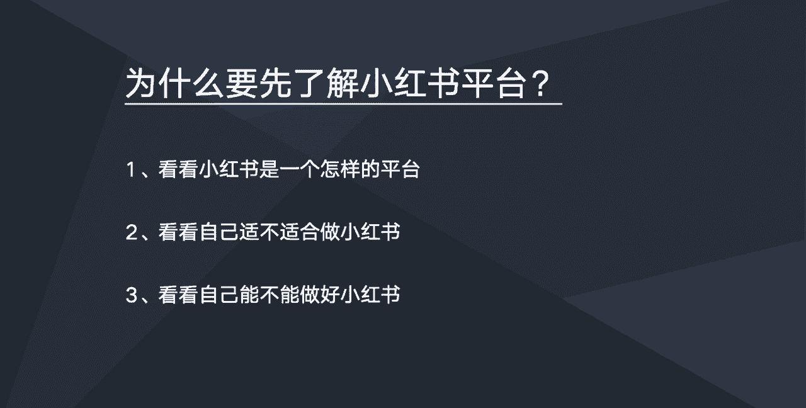
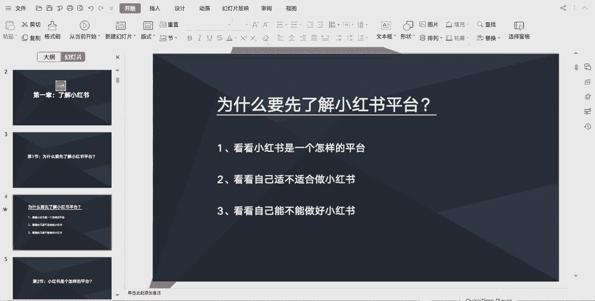

# 【2024版小红书体运营教程】全B站最良心的小红书开店运营高阶教程合集！小红书体开店 起号真的快，赶快点赞收藏起来 - P3：1-为什么要先了解小红书平台 - 恋上你的房fa - BV1uDhzecEFi

好同学们好，接下来将由我给大家分享一些，小红书的一些玩法，那么在分享小红书的玩法之前的话，我们需要一起来了解一下小红书这个平台，那么为什么要先了解小红书这个平台呢，主要从三个方面去考虑吧。

第一个是看看小红书，他是一个怎样的平台，第二个是看看自己适不适合做小红书，第三个是看看自己能不能做好小红书，也就是说我们在尝试做一个新的平台的时候，我们需要对这个新的平台做一些了解。

比如说了解这个平台的一些成长史，了解这个平台的一些特点，了解这个平台的一些用户人群，了解这个平台的一些规则，了解下做好这个平台需要具备什么样的条件，只有是我们了解清楚这些东西，然后我们在做的过程中。

才能够确保我们能够多一些正确性。

