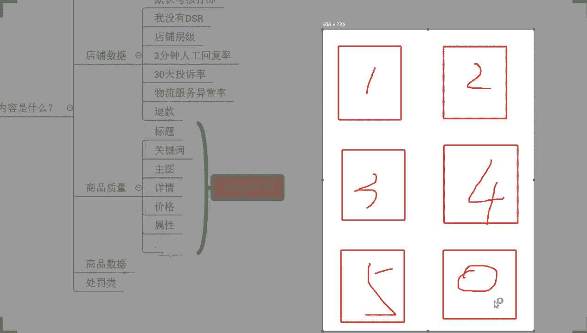

# 【2024版小红书体运营教程】全B站最良心的小红书开店运营高阶教程合集！小红书体开店 起号真的快，赶快点赞收藏起来 - P3：推荐排名获取_新店新品操作核心技巧 - 暴汗糯米糍 - BV1e7aWehEjY

哈喽哈喽哈喽呃，测下麦啊，OK啊果果跟凤七都来了啊，可以的啊，呃这边所有的在直播间的小伙伴们，能够清楚的听到我的声音，能够看到我这边电脑桌面的话啊，声音各方面如果没问题呢，公屏上来扣一个一好不好。

工作快啊，呃如果说是有这种听不到声音的，或者是看不到画面的退出重进啊，好吧，抓紧时间啊，呃正式的分享呢在我们的两点钟开始啊，还有几分钟时间，那么大家可以先一起来等一等，那些还在路上的小伙伴们啊。

那么啊分享今天的这个内容的话，是关于我们这个产品的推荐，排名获取，以及新品操作的一个一个一个一个玩法啊，那整个的内容呢嗯可以这样说吧，那有可能有的小伙伴呢，自己呢是有一定的运营经验。

但是呢可能会有的一些认识，但是呢在操作方面呢还是会存在一些短板的，那今天的话我希望能通过今天的这个分享呢，能够补齐大家的短板，好吧啊，当然了，也有小伙伴可能说还没有开店的。

只是想要去了解拼多多怎么去操作，怎么去开店，没关系，那么今天这个内容的话，我觉得刚好合适，可以帮你们很好的去呃，完成店铺操作的一个提升，好吧O呃今天看到很多很多这个熟悉的面孔啊，还不错啊，还不错。

我觉得很开心啊，那么今天的话一会儿呃还是老规矩啊，那么一定要积极互动好不好，那如果说是我分享的某一个知识点，你没有听明白，没有听懂的话，记得到时候第一时间跟我讲啊，如果说能够听明白，能够听懂的话。

OK那么也记得把你的情况告诉我啊，那么只有这样呢，我能够充分掌握你们的一个状态对吧，知道你们的一个情况才能够更好的去分享啊，所以说这个也是我们直播间的，第一个注意事项啊，一定要积极互动，当然还有一点呢。

就是西楼呢做直播分享的，跟别的那些其他地方可能不太一样对吧，那么呃西楼讲这些知识点的时候呢，喜欢啊问一些问题哈，那么这些问题呢我也不是说问的好玩无聊，闲的没事干对吧，那一定是有原因的。

之所以我会通过提问的方式来进行分享呢，是因为你们其实很多人都会有到，各种各样的一些问题对吧，包括说也有很多小伙伴呢，可能这个思维呢会非常活跃啧，是不是，所以这个时候呢，呃你如果说带着问题去思考的话。

带着问题去听我分享的话，OK那么你的相对来说啊，思维会更加集中一点，那么对你的理解，对你的吸收也会更有帮助一点，所以这一点的话，希望大家能够去呃积极的配合一下，当我提问的时候呢。

大家能够去啊积极的去认真思考，并且呢把你认为正确的答案呢发在公屏上啊，我们可以进行一个探讨啊，那呃除了这个地方之外呢，还有点什么呢，就是说我知道啊，各位老板，各位商家啊，可能在店铺的操作过程中呢。

在整个运营过程中呢，会面临非常非常多的一些问题啊，啊包括说你们平时也有很多小伙伴会跟我交流，沟通对吧，会问我一些问题啊，各种问题都有啊，这个确实那么在直播间的话啊。

我也知道大家可能也需要说有到这么一个机会，能够去更好的交流沟通，所以想要去提些问题，这个没有关系啊，这里我先说一下，在直播间的话，大家可以提问的啊，可以提问，但是呢这个问题啊。

我这里要重点说明一下什么呢，就是直播间提问的话，问题仅限当前内容相关的好吧，比如说我现在讲的某一个知识点，那么在这一个知识点的范围内，对不对，或者是跟他相关的一些问题，哎你觉得哪个地方你觉得有疑问。

有不清楚的，对不对，比如说我讲这个产品排名的一个优化，那那这个排名考核的过程中，哪些数据你不懂，哪些考核的一些这个呃，这个权重考核点你不清楚对吧，或者具体某一个权重他是怎么考核的，你不清楚。

OK这些我们都可以展开去探讨，但是问题仅限这一个内容相关的问题，那这个呢也是有原因的，因为我们直播间其实人说多不多，说少绝对不少了对吧，大家也看到的对吧，也有那么小几百人了。

现在啊那如果是你们每个人问一个问题的话啊，可能就会导致一个非常痛苦的事情，对不对，那我每个人如果都去解答的话，那可能整个的分享就没有办法正常进行，对不对，再加上一个点呢，就是说也有很多小伙伴呢。

他们的基础会相对来说比较薄弱一点对吧，可能是刚开始了解拼多多，刚开始了解电商，刚开始想去做电的对吧，所以这种情况的话，那这一部分小伙伴呢，可能他们啊各种问题东一个西一个的话，就会比较迷茫对吧，听不懂啊。

所以为了更好的帮到大家，为了更好的去分享到一个完整的内容，那么大家在提问的时候呢，就啊把这个问题呢，尽可能集中在当前内容里面去啊，当然如果说你真的是有什么特别重要的问题，一定要问，OK那么先忍住啊。

等我正式内容分享完，你单独提问，或者是等我下播之后，你单独跟我讲啊，确实这个问题很重要的话，说不定我下一次专门拿这个话题，来做一期的一个直播分享都有可能啊，所以这方面大家不用担心的。

然后另外呢还有一个最最重要的点啊，是我们所有的小伙伴都必须去注意的一个事情，如果说你今天是想要去把店铺做好，那么今天听清楚了，当我分享完内容之后，确实这个东西呢是你没有做的，啊是你没有做的，啊。

是你没有做的，然后呢也确实是符合你店铺情况的，一定要去实操好吧，一定要去实操，因为再好的方法，再好的玩法，你如果不去做，等于零对吧，包括像这些小伙伴一样的，他们跟着我一起实操做店，对不对。

你们可以看到啊，这些店铺来有看到的啊，能够看到的公屏打个六好，不像这些小伙伴对不对，像这个店铺啊，原本的话访客只有2000左右的样子，就一直维持着很长一段时间，那后面呢跟着实操对不对。

整个店铺能够得到一个提升，那么这个提升不是说看视频看出来的，也不是说听课听出来的对吧，更不是说自己在那里躺着睡大觉，睡出来的而是干嘛，而是去做出来的，所以这个是很关键的一个点啊，像这些小伙伴。

那很多像这个店铺零访客的新店一样的啊，所有的店铺数据提升一定是要去做对吧，但是有一个前提条件是什么呢，就是你一定是要符合店铺实际情况，并且来讲的话是你确实没有做到位的地方。

不然的话OK你可能去做了之后也是无用功，这点我先强强调一下啊，就有很多人啊啊，包括说看我视频的也好，包括说看我直播的也好，对不对啊，有很多小伙伴呢也都会愿意去呃操作店铺，去落地操作店铺啊。

但是有的小伙伴就会反馈说哎呃细佬，我做了你说的这个东西，感觉怎么对我店铺没有太大帮助啊，啊有这种情况啊，但是这里我要强调一下啊，我绝对没有藏一手，我绝对没有留一手，那有可能是你操作的不到位。

也有可能是你这个店铺的一个情况呢，和你需要操作的内容不符合啊，然后校园说这个是做付费的吗，自然流店铺啊，自然流店铺我带实操都做自然流的啊，我在12都做自然流的，对我来讲啊，店铺操作啊。

这里我顺便提一嘴吧，好不好，这个消炎包括说其他小伙伴来，所有人听清楚了，你们有很多人做店铺呢，可能会选择说去做付费对吧，付费可不可以做，这里我先说一下，可以啊，我先跟他，我先告诉大家啊，可以做。

但是啊但是要分情况，哎呦小小白啊，小白菜啊，这个还能玩这个免费流吗，我听你这么一说，我就知道啊，你可能对于这一个拼多多不是很了解，那有很多人包括一些所谓的博主都会说，哎拼多多现在没有自然流，对不对。

一定要去做付费流，其实说白了不是因为没有付费流，而是因为他做不出来，做不出哎，没有，这个免费流，而是因为他做不出来免费流量，知道吧，所以他选择去做付费流量，那之所以会去做付费流量是为什么呢。

这里我也跟他提一下，对不对，因为付费流量它最简单对吧，他最简单，那为什么最简单呢，哎我今天只要去开了一个推广对吧，我只需要把钱花出去啊，我只要把钱花出去，哎那么这个时候自然而然就有访客进来对吧。

那我店铺就算是完成这个正常运营了对吧，你看啊像柠檬说的付费亏钱啊，不付费啊，没流量，这个就是一个现状啊，你们很多人之所以是呃做店铺觉得难，其实有的时候就是这样子的啊，那为什么说我讲可以做付费流。

但是一定要分情况分阶段呢，尤其是前期各位不要做付费流啊，前期不要做付费流，那么为什么这样说呢，因为付费流量它是整体的去拔高，我们的产品的展示基数，知道吧，那这个提高之后呢，就就举个例子吧哈就举个例子啊。

本来我正常我我我我1米8啊，我1米8啊，我18180的身高对吧，我180的身高啊，我正常站着的时候呢，我是能够去这个啊地练角，我是能够努努力啊，摸到这个呃篮篮筐篮板的对吧，打个比方啊对吧呃。

我正常来说是可以摸得到的啊，我垫垫脚努努力啊，能够摸得到啊，但是今天呢干嘛呢，哎有人给我来了一个这个小小的这个凳子啊，来了个凳子啊，放在我的脚下啊，放在我的脚下，那么这个凳子放在我脚下之后呢。

我不用努力，不用去垫脚，我都能轻松的去够到这个篮板篮筐，对吧啊，卡吗，呃其他小伙伴卡吗，其他小伙伴卡吗，来呃不卡的，公屏上打个不卡好吧，如果你觉得啊这个画面呢或者声音有卡顿的，公屏上也跟我讲一下啊。

如果说你们遇到任何的这种呃问题呀，或者是遇到这种呃观看上的一些问题啊，也都记得第一时间跟我讲啊，这样子才方便我跟大家进行沟通交流啊，OK啊这个杨琪杨奇隆，你这名字啊啊有点东西啊啊。

其他小伙伴说是不卡的啊，其他小伙伴说不卡的啊，啊你可以看看是不是你自己设备问题，或者你自己网络问题啊，好不好，你可以看一看啊，那我们继续回继续回过头来说啊，刚刚我讲到说这个身高1米8，对不对。

我可以摸到这个篮筐篮板，但现在呢我脚底下垫了一个凳子，我不用努力，不用去这个垫脚尖，我都能够轻松的去摸到这个篮筐，摸到篮板好，OK各位我想问你一下啊，那么这个时候是不是会存在一个状态。

就是原本我需要非常努力够到的这个位置呢，现在我不需要不需要努力了，原本我需要呃，原本我可以碰到的部分呢，现在是我通过垫凳子就可以直接碰到了，甚至我碰到的范围会更大，各位这个逻辑如果没有问题。

现在公屏打个一啊，我们现在假如说啊，我们现在假如说我们在一个这个篮球场上，在一个篮筐底下，对不对，我原本呢是要垫脚去努力去够，才能够到这个篮板的啊，现在呢别人给我脚底下塞了一个凳子。

我可以踩在凳子上去摸，那么这个时候我摸的时候呢，我非常轻松的就能摸到这个篮板，而且我摸到的范围更大，摸得更高，摸得更更广的一个范围对吧，这个逻辑应该是能够理解的啊，那么这个时候我们来我们来讲一下啊。

换句话说呢，这个凳子这个凳子啊，在我们店铺推广中，就是我们做付费推广这个行为，原本我是可以有曝光的，原本我是可以有访客的，我有推荐权重的，对不对，但是呢因为我加了一个凳子，我做了付费推广。

那么这个时候呢原本能够去得到的推荐曝光呢，就会被我做付费推广这个行为覆盖掉，是不是，那么覆盖掉之后呢，原本的推荐曝光，推荐群众带来的这些所有的访客，所有的点击绿啊，然后收藏啊，所有的转化啊。

所哎转化所有的这一个成交额啊，等等各种各样的数据，这个时候因为我去做了付费被覆盖掉了，所以他就会全部跑到什么复位里面去，对不对，原本这一部分呢就没有掉了就没了，没有之后呢好因为平台给了我推荐曝光。

我又没有拿到数据，那么相当于呢推荐曝光就没有数据反馈对吧，当他没有数据反馈的时候，这些曝光能被放大吗，这个权重能够放大吗，各位觉得可以的，打一个可以觉得不可以的，打一个不可以好不好，来所有人动起来啊。

动作快啊，所有人动起来动作快啊，可以还是不可以，你都没有数据，对不对，你都没有数据，你这个时候还能可以吗，还可以吗，这个肯定不可以啊对吧，平台给你曝光，一定是你有数据反馈，兄弟们，李佳露露啊。

你们还说可以啊，露露我就不提了啊，露露是一个非常基础的小白啊，李家已经很久了，对不对，本身自己在做，而且呢听我直播也不是一次两次，你跟我说可以，你绝对是没有认真听啊，你绝对是没有认真听啊。

像你这个就明显让我很失望啊，好吧，那这种情况下肯定是不可以的对吧，那我的曝光没有办法放大，那换句话说你的自然流量能放大吗，一定是干嘛不能的，对不对，一定是不能的，所以说这种时候我们去做付费推广的话。

会限制我们自然流的获取，就会导致一个问题，就是后期你的店铺只能去做付费流，如果说你付费停掉去，OK你发现你的访客马上就没有了，这就很痛苦的一个事情，那么什么时候可以做付费呢，好我告诉大家。

比如说现在啊我店铺数据达到了瓶颈对吧，我现在呢店铺呢各项数据指标都很好，哎我的这个转化率啊很稳定很高了啊，我的访客也都已经形成一个，非常固定的一个状态了，没有太大的突破，也没有明显的波动啊。

我的这个呃转换啊，UV价值啊，UV价值啊也很高，很稳定，我的成交额啊也已经很高了啊，但是呢我的访客一直在这个位置卡着，比如说我现在访客到了1000啊，或者是1万对吧啊，我一直到这个位置卡着，它不动了。

那怎么办呢，这个时候才是我们去做付费流的时候，我们通过付费呢去放大流量入口，去开拓更多的人群，让这个数据变得更大，当这一个数据变得更大的时候，那么我们才有机会去得到提高，各位这个逻辑现在能够明白。

能够清楚的话，公屏上打个一好不好，不要说不懂装懂啊，确实懂的话，打一啊，没有听明白，没有理解的话，打问号，所有人动起来啊，这个很关键啊，这个很关键，OK柠檬是打了一个问号，还有其他不懂的吗。

还有其他小伙伴不明白吗，呃我问一下啊，雪海雪海，你能听明白吗，学喊你能听明白吗，可以是吧，OK啊那你看啊这个有运营基础的就是不一样啊，OK啊这个洪小贝啊也没有听明白是吧，也没听懂。

OK啊啊只有你们两个的话，那这样子露露说有一个问题，前期开始没有流量怎么办呢，先不要着急问问题了，好不好，先不要着急问问题了，刚刚讲的这个能够听明白，先如果能够拼明白的话，没关系，你刚刚讲的这个问题。

那么在我正式内容里面会给你们讲的啊，这个问题不着急啊，露露啊，OK啊，果果说刚来你绝对不是刚来啊，果果啊，你那会儿刚开播的时候在的呀，你个头刚来啊，你逗我呢，你是不是出去了，中途咳啊，刚出去了是吧。

好好好好，原谅你了，原谅你了，行了行了行了啊，然后这个红小贝还有我们的这个柠檬啊，那刚刚这个点的话没有听明白，没关系啊，你们可以下播再多多问我都可以的啊，这个东西其实也是一个常识问题，小问题来的啊。

不是特别的重要啊，不是特别重要，但是我们要清楚这个逻辑啊，那么你下面你们下播之后再单独问我吧，因为已经到了我们正式分享的时间，我们就不耽搁了啊，我们就不耽搁了啊，OK我们就不耽搁了啊。

那现在呢我们就来讲解，关于我们新品操作的一个核心逻辑，对不对，刚刚你们也提到过了对吧，像这个露露啊，像乾隆啊，都说哎那前期没流量怎么办，那新店没流量怎么办，OK这个就是我们今天要分享的内容啊。

所以大家不用那么着急啊，那我们就直接开始啊，刚刚你们也问了哎，新店啊，新品啊，新平前期没有访客怎么办，啊我就说看了很多串，说了很多罚款的啊，哎这个这个这个这个问题我先问一下吧，我先问一下吧。

虽然说跟我当前分享的这个内容不相关啊，虽然说跟我当年分享的内容不相关，但是我还是想问一下各位，你们有没有人跟这个YU一样啊，有看到过说拼多多很多罚款，然后呢处于刚开始做还没开始做啊，怕不好做，怕亏钱的。

有没有有没有，有是吧，有多少呢，来一起公屏上动起来哈，好啊啊有有那么几个啊，不是很多，但是也值得我去讲一讲啊，对于我们拼多多而言的话，其实它有很多的规则会导致我们罚款，但是你要搞清楚一件事情。

国家有国家的法律，平台，肯定有平台的规则，对不对，你如果说在平台上去经营，想要去在平台上赚钱，该守的规矩一定要守的，这个在所有平台上其实都有自己的规则，那么拼多多平台上之所以会觉得很多罚款。

是因为早期的时候，只有拼多多会注重到一个事情，就是物流问题，像物流板块的话，我们如果说是发货超时啦，揽件超时啦，中转异常啊，对不对，或者缺货啊等等，这种各种各样的情况都会进行赔付。

这个在别的平台以前是没有的对吧，最早是没有的啊，所以就会觉得拼多多平台哟，好坑啊，好多罚款了对吧，而其他的一些啊，所谓的这个店铺违规的一些规则的话，其实都很正常，每个平台都有啊，每个平台都有。

那我们想要去做好店铺，一定是在规则允许范围内去操作，并且能够让我的产品能够卖的更好，对不对，而一些我们本身自己造成的一些违规罚款，这个是活该，我只能这样说啊，而且现在来讲的话。

其实各个平台都在效仿拼多多对吧，一开始呢是鄙视拼多多，后来是理解拼多多，最后是成为拼多多对吧，所以说你想要去做好这个事情，那没办法，打不赢就加入，你只能接受是不是，关键是我们接受的同时怎么去规避它。

怎么去盈利，这个才是重点，各位你们觉得呢，你们觉得对的话，公屏扣个一好不好，所以所谓的这个规则多，所谓的这个罚款多，所谓的这个亏钱，我觉得都不是事儿，因为这个对所有的商家都是公平的。

每个人都会面临一样的规则对吧，只要你违背规则就会受到处罚，而你自己违背的规则受到处罚也是合情合理的，因为对所有人都是一样的规则对吧，好了啊，这个点我们就不提了啊，那回过头来说一说我们正式要分享的内容啊。

现在注意力集中好不好，各位各位老板啊，现在注意力要集中啊，因为这一趴的话啊，呃我不会说是去讲的那么的拖沓，我的节奏会可能会快一点，因为内容比较多啊，所以大家如果说哪里不清楚的呢，一定要第一时间给我讲啊。

我要跟我说清楚，不然的话我不清楚，不确定的话，那么可能后面的话我们就没法弄啊，啊打不过就加入，现在京东也被罚麻了是吧，很正常啊，很正常啊，各个平台其实现在都是这样子的啊，那么呃现在啊问大家一个问题。

我们讲前期这个没有访客怎么办，我们讲新店没有访客怎么办，那么各位平台针对到新店，针对到新品，针对到前期有没有曝光啊，有没有给我们曝光，我先问大家这个问题，这个问题你们要想先搞清楚啊，各位你们觉得有打一。

觉得没有的，打个二好吧，我看看你们的一个一个一个认知，或者你们对于这个拼多多的了解，情况到底怎么样子的，觉得有打一，觉得没有打二，OK有打一的啊，有个别打二的啊，OK啊打二的开始多起来了啊。

打二来开始多起来了啊，有那么几个啊，大部分都是打一的对吧，那么这里呢我要告诉大家啊，刚刚打二的小伙伴们，拼多多针对到我们的新品也好，针对到我们新店也好，针对我们所谓的前期经营的一个产品也好。

它是有曝光的啊，他是有曝光的呃新店不仅有曝光，还会有扶持，OK王琦说的这个点的话，呃，我要纠正一下啊，我要纠正一下啊，王琦拼多多平台呢对于我们新店，对于我们新品，对于我们所有商品都会有曝光。

那所谓的新电有扶持呢，其实没有我们想象的那么好啊，这里我要纠正一下啊，这里我要纠正一下啊，什么意思呢，这里我就完全的把你们展开来把好不好，各位呃，既然说我们要讲到新品操作，讲到我们前期的产品操作。

那么我现在问大家一个问题，平台针对到我们商品排名考核，考核的内容是什么，嗯来这个问题啊，因为有很多小伙伴，我看应该是基础比较比较弱一点啊，所以说这个问题呢，呃如果说有知道答案的小伙伴呢，发在公屏上啊。

如果是不知道答案的小伙伴呢，可以打个问号，然后顺便的话看一看我们的这些小伙伴们，他们怎么说的，然后我再给你们解释一下好吧，然后小说哎有这个这个这个转化率啊，转化率，啊还有吗。

OK王琦说有这个GMVUV跟转化率啊，哎呦不错啊，王琪还是有点东西的啊啊，然后小说还有客单价啊，客单价，好还有吗，有没有要补充的，如果说没有的话啊，没有要补充的小伙伴的话。

那么一起公屏上扣个一或者打个问号吧，啊让我知道你们的状态啊，我不知道你们现在目前是有在认真思考呢，还是说只只是在在等待答案啊，所以这个很恐怖啊，所以这个很恐怖，那如果说你们是有答案的，发不出来。

如果说不清楚的，打问号啊，OK这个加说有这个销量啊，然后小孩说了一个叫DSR，还有不还有没有别的要补充的啊，除了这些，还有没有别的要补充的，小周说哎有这一个好评好，OK应该差不多了啊。

应该已经把你们榨干了，估计啊这么久了啊，这个问题也不算特别复杂，特别难特别麻烦的啊，这么久了，这些答案应该是已经榨干你们了啊，行吧行吧行吧，来所有人现在有在认真听的啊，公屏上小一组起来，既然说这个答案。

你们没有给到我一个非常完美的答案的话，我相信你们可能对于这方面的一个基础认知，还是有欠缺的，现在的话可以认真听一下啊，先做一个扫盲，那么针对到我们平台啊，他的一个商品排名考核的话。

其实呢你们所说的这些内容呢，都是考核范围内的东西，但是呢平台是有明文规定的啊，平台在我们的排名规则里面是有明确指出的啊，那么商品的排名呢是按照一段时间啊，按照一段时间啊。

商家商品的上新时间以及我们的销量评价，啊还有我们的这个质量，售后，还有我们的价格等等啊，这些东西来进行考核的，当然这个顺序可能跟这个呃，平台规则写的不太一样啊，可能跟这个平台规则写的顺序不太一样。

但是就是这些内容，而这些内容展开来具体细分的话啊，是分为四个考核内容的哪四个呢，店铺权重啊，这个店铺数据啊，店铺数据啊，然后商品质量，商品数据还有处罚类，那我为什么要讲这个呢。

先跟大家普及一下这个东西啊，你们刚刚不是有人说吗，新店不仅有曝光，还会有扶持，所谓的扶持是什么呢，我跟大家讲清楚，平台所谓的扶持并不是说给你更多的曝光，而是干嘛呢，而是在我们新品的前期。

在我们新店前期会针对到我们的店铺数据平台，默认考核达标，这个考核达标时间呢30天30天啊，那么这个30天的一个考核的话啊，那我们自己平台，我们在平台上进行经营，我没有所谓的DSR对吧。

我也没有所谓的其他的一些这个店铺层级啊，包括说我们所谓的3分钟人工回复率，啊包括我们什么其他的一些什么30天投诉率，包括我们的这个什么物流服务异常率，啊包括我们的什么品质退款啊，纠纷退款啊，各种退款啊。

啊那么这些东西我们其实都没有的，那都没有的话，按照正常来说，你没有，即使不合格，对不对，但是如果你是新店的话，平台会默认这一些东西是考核达标的，所以你可以正常进行产品曝光。

而平台针对到我们商品进行推荐排名的时候呢，第一个考核逻辑是考核我们商品的质量，所谓的商品质量呢就是我们产品的标题，我们产品的这个呃关键词，我们产品的主图，我们产品的详情，我们产品的价格。

我们产品的属性啊等等这些东西，那么针对到这些东西进行考核之后呢，会给到我们一个所谓的基础权重，那么这个基础权重呢给我们之后进行商品推荐，对不对，总会有产品排名在更前面。

有产品排名在更后面，各位没错吧，那这个时候呢我们的商品在进行展示的时候，哎有的商品可能在这个位置，有的商品可能在这个位置对吧，他都会有到不同的展示位置，那么如果说我们的商品进行商品群众考核。

本身我们是新品，我们是刚上架的产品，所以这个时候呢就会在某一个新品推荐位，比如说这一个位置啊，他是我们的新品推荐位，这个位置是我们的付费推广位，广告位啊，这个位置呢是我们平台的一个历史的推荐位啊。

后面呢是什么高销量高评价啊，销量高的对吧啊，评价好的，对不对，哎综合权重高的啊，打个比方啊，打个比方，那这个时候呢剩下这个位置呢会空出来，进行一些新品的随机推荐。

各位这个没问题吧，啊这个我只是做一个示意啊，排序可能不是这么排的，但是这个逻辑是这个样子的啊，但这个逻辑是这个样子的，能理解吧，各位没问题，能理解公屏打一没问题，能够理解公民打一。

那现在就有一个非常重要的问题了，进行新品推荐的时候好，那么我们的商品权重会有差异，对不对，我们的产品的基础权重会有差异，那对应到不同人群进行产品的推荐的时候呢，OK那么这个时候呢也会进行后续的考核。

考核到我们的商品数据，考虑到我们的处罚类，考核到我们的店铺数据，但是就像我刚刚讲的，如果说我是一个新店，那么你是一个老店啊，那我是新店的时候，我上传新品是新品，你是老店的时候，你上传新品也是新品。

对不对，没错吧，那么谁会在这个位置展示呢，谁展示的更多呢，OK这个东西没有说一定的，而是根据数据来的，根据我们产品来的，如果我们的产品的基础权重高，那我的曝光机会一定会更多的，但是在这个基础之上。

还会去考核我们的店铺权重，那我是老店，那我的老店呢，我的所有的这个什么DSR啦，我的层级呀对吧，哎DSR啦啊，包括说其他的乱七八糟东西呢，我可能考核并不是那么的优秀，于是乎呢我在排名的时候就会比较靠后。

而你作为新店平台，默认你是达标的，你合格的，所以你的展示会比我更靠前，各位这是所谓的新品的扶持，能看懂啊，这是所谓的新店的扶持，能看懂，能理解的话，公屏打个六好不好，所以说啊所谓的扶持。

不过是一个考核的一个数据啊，给到你一个合理的，或者是给到你一个正常的曝光机会而已啊，那为什么会给到我们正常曝光机会呢，因为我们本身是新店，我们不可能有这些，但是如果说你考核的时候，我因为我是新店。

就考核这些，就我不达标的话，我没有曝光的话，那所有的新店都不可能有机会，平台为了扶持新店呢，所以就把前期这一趴的考核给你砍掉去了，让你是合格的，但是最终你是否能拿到曝光，还是属于说你的商品质量的问题。

你的商品数据的问题，所以这些东西才是一个最重要的点，好吧，各位现在的话，整个的一个逻辑呢应该能够搞清楚，应该能够搞明白，对不对，那么现在啊我继续再问大家一个问题啊，那作为我们的产品，我现在上架之后。

我的前妻没有流量，我的前期没有访客，而不是我的前妻啊，是我商品的前期啊，这个怎么感觉怪怪的是吧啊，我商品的前提本身，我这个普通话又不是很标准，对不对，到时候搞得哎啊原来C罗对吧，还有前妻啊。

这个这个这个话就传出去了啊，有点扯啊有点扯啊好吧，回过头来看一下啊，啊我商品前期呢是没有这个曝光的，那各位我想问大家是什么出了问题，我商品我商品前期呢是没有什么曝光的，没有访客的是什么出了问题。

来大家一起思考一下啊，大家一起思考一下，OK啊OK小说商品质量有没有有没有不同意的，来同意的，小伙伴的话，公屏上打个一，不同意的，打个二好不好，同意的打一个一不同意的打一个二，啊乾隆说哎质量也没问题啊。

哎呀啊，首先啊这里呢我要我要说一下啊，这个这个质量啊，它不是指的我商品的使用寿命怎么样，我的材质怎么样，我的工艺怎么样啊，当然呢，呃这个是我们自己商品本身发布的一些，基础信息而已啊。

当然你如果说觉得哎这个东西确实没问题，那也是我们主观认知的一个点啊，当然不排除他真的没问题，对不对，但是呢啊大部分小伙伴呢目前呢也是同意的，哎就是商品质量出了问题啊，好那现在呢我们把它展开来说一说，咳。

各位啊各位，那首先我们要搞清楚一件事情，我们商品呢得到了基础权重对吧，这个基础权重呢得到之后呢，平台给我们的是什么，还记得吗，我刚刚其实反复提提了很多次啊，那我们得到这个基础权重之后。

平台给我们的东西是什么，流量除了流量呢，还有没有别的，有没有更OK啊，露露说了一个词，曝光啊，好兄弟们，平台给到我们的基础权重，实际上给的我们是曝光，他不会直接给我流量啊，那我们呃在某种意义上来讲。

流量它是等于访客的啊，流量是等于访客的啊，那所以说这个时候平台给我们的不是流量，而是曝光，OK曝光跟展现也不同，小记住了啊，曝光不等于啊，不等于展现来这个这个这个点的话，如果说有不清楚的。

现在公屏上快速打一个问号好不好，曝光不等于展现这个点，如果说有不清楚的不理解的，公屏上快速打个问号，动作快咳，OK啊OK啊，那那我顺便先说一下这个东西啊，因为你们刚刚你们提到这个事情。

你们把这个额流量和曝光混为一谈，把曝光和展现混为一谈，这个东西是不对的，为什么这样说呢，来我打开拼多多啊，稍等一下啊，薛微的等我那么一小下下啊，我现在打开拼多多好，各位现在呢我去搜索关键词。

比如说这里有到一个叫单人单人凉席啊，不管他啊，不管它，我们先搜索吧，啊我们先搜索好各位，那么当我搜索之后，我想问大家一个问题，这个时候平台是不是会根据这一个，我搜索的关键词来进行商品的抓取。

所有符合这个关键词的产品都会得到抓取对吧，是不是符合常，符合我搜索关键词的产品都会被抓取啊，抓取完成之后呢，会根据我们所谓的权重考核来进行排序对吧，就会有到不同的商品排名，有的商品可能被抓取到了。

有的商品可能没有被抓取到，那么这个展示排名呢，它也会有到数据的限制，数量的限制对吧，有的商品被抓取到了，但是因为排名靠后，他不展示，没有权重啊，也会被抓取到，你要知道这个展示呢是有数量限制的。

他不可能无限的往下去展示出来，对不对，到了一定程度之后呢，后面的产品是不会被展示的，或者到了一定的这一个呃，或者你完全没有被抓取到的话，你没有被这个产品关键词这个抓取到的话，你也是不会被展示的好吧。

那么在这里有道一个很重要的问题是什么呢，各位来，现在呃，我们现在假设啊我的画面，我的页面就固定在这个位置了啊，我的页面就固定在这个位置了啊，现在假设那么这些产品啊，这个五块九块八，六块18块六毛一。

这四个产品呢对于我们对于我们的商品来说，这些商品是什么，是展现对吧，是展现，各位能理解吧，这个是展现啊，这个是展现啊，那么同样的在这个过程中，我的页面如果说就停留在这个位置。

在这个页面往下还有很多的商品，他们是曝光，各位能理解吗，曝光是我的产品被进行了商品的页面推荐，展现是我能够在这个最前端的端口上看到它，各位能明白这个差差别，没有可能平台给我的推荐曝光，但是我的推荐曝光。

因为我的产品排名比较靠后，或者因为其他的原因，用户可能就根本就没有看到我商品，它也有曝光，各位能懂吗，那我现在如果往下滑啊，我现在往下滑，这个位置原本的曝光就成为展现了。

额这个不是说主动搜索跟这个被动曝光，这个这个不一样啊，这个不一样，这不是这个逻辑啊，逻辑是我能够在这个端口上看到的，我已经看见了哈斯闪现，他已经在这个整个页面，可能在后续的位置产生了。

或者在这个整个页面上，都能够去被系统收录到这个页面来，它就是曝光，对于这前面这四个商品来说，它既是曝光，也是展现，但是对于后面我没有看到的商品来说，它就仅仅只是曝光而已，各位能明白，现在能明白的话。

公屏打个一，那我在滑动这个页面的时候呢，而下面这个产品原本的曝光就成了展现，如果我没有往下面滑动的话，他是被这个系统收录到这个界面来，OK他就只是在这个界面有曝光，啊是这么个逻辑来的啊。

所以说这个地方我们平台针对到商品，给我们记录权重考核的时候呢，会给我们曝光，但是这个曝光是访客吗，不是这个曝光是展现吗，不是曝光有多少呢，我也不知道，啊曝光多少不知道对不对，那后边的不是白曝光了吗。

OK可以这么理解啊，可以这么理解，所以说如果我们想要去啊，所以说我们想要去啊，让我的商品有到更多的机会获取到访客，有一个点就是需要让我的曝光，啊成为展现，这是第一个条件。

第二个条件呢是让我们的展现形成点击，这个时候我才有访客，被搜过没有看到叫曝光呃，你把你的问号拿掉去，你的逻辑还是纠结在搜索这个层面上来讲啊，这个不仅仅只是搜索知道吧，这个不仅仅只是局限于搜索板块。

我只是拿这个搜索来给大家举个例子而已，那我去到首页里面是一样的道理啊，好吧，我去到首页里面是一样的道理，在这个界面上，我现在打开了拼多多，我现在打开拼多多，对不对，在这个界面上，这个商品是曝光啊。

这个商品是展现啊，这个商品是展现，对不对，这两个一个一个IPHONE啊，一个这个茅台啊，那我往下翻动的时候，原本这个1000个什么垃圾袋，它是有曝光的，现在成了展现，能理解吗。

它能够被系统收录在这个界面来，就已经是曝光了，这个不是说搜索跟搜不搜索没关系，所有的渠道所有的界面都一样，所以这个时候我想要让我的产品我说了，我要让他有访客，对不对，那怎么办，我要让我的曝光成为展现。

我要让我的展现形成点击，这个时候我才能够有什么有访客，那怎么办，那怎么做，是不是这个也是你们比较关心的一个话题诶，那怎么做，OK的好展现，各位是我们曝光获取的曝光呢，之所以能够形成展现。

是因为被用户看到啊，感觉像在上高数课啊，我的天这个应该也不至于这么难吧，兄弟们啊，我我问一下啊，觉得刚刚这个很难接受，很难理解的，公屏上呃，打个一好不好，我我看一下吧，我看一下吧。

啊当然这个东西呢只是一个逻辑问题啊，对我们店铺操作来讲的话，你们能懂它，最好你们没有办法理解它，没有关系，其实也不也不是那么的特别重要，只不过是因为你们今天有的很多的一些一些，这个错误的认知啊。

所以我要纠正一下，你知道吧，来觉得男的动起来，我看一看，我看一看，如果觉得能接受的话，公屏上打个一好不好，唉放肆啊，可能真的就是你啊，可能真的就只有你啊，是吧，可能每个人会有每个人擅长的领域啊。

这个东西其实也还好啊，不重要啊，因为这一趴的话，他只是一个逻辑问题啊，你能够理解最好的，理解不了，不影响操作啊，所以不用担心啊，当然了，如果说后面你确实还有很多东西不清楚不懂，你说我自己做店铺做不好。

没关系啊，你也可以跟着我来实操的好不好，那所有的操作细节我都会给你讲的很清楚，让你知道这个东西应该怎么做，为什么做这样呢，你整个的一个呃能力的提升也好，你的店铺数据提升也好，也会帮助比较大一点好吧。

那么这个东西呢我们就就就就先到这里，然后我们先认真的把这一趴往后延伸哈对吧，那我现在想要去让我的曝光成为展现，是要去做什么，各位我要让我的曝光成为展现，我需要做什么，来我要让我的曝光成为展现。

我需要做什么，我们回到这个界面来吧对吧，我们回到这个界面来，大家可以认真思考一下，现在呢我的产品可能在下面啊，在更更更靠下的位置，我的产品可能在更靠下的位置，那我现在我希望让我的产品呢。

它的展现形成曝光，我需要做什么，OK小说做活动啊，做排行榜啊，做这个铺链接，做铺垫铺的行为啊，把标题做好，还有吗啊，抢排名诶，王琦提到这个词非常棒啊，王琦提到这个词非常棒，抢排名，啊抢排名啊。

其实就这个东西，其实就这个东西，那我要是让我的曝光成为展现的话，我不管我们通过什么方式去做，对不对，我不管我们去呃做活动也好，做排行榜也好，做这个铺链接，铺垫铺也好，去做标题也好，去做机会商品也好。

去报活动也好，去做榜单也好，做什么都不重要，重要的是我去抢排名，我要让我的商品在对应的这些位置上，排名更靠前，各位理解吧，那么这个时候我在我的展示的这个页面上，排名更靠前的话。

那我的曝光形成展示的机会也就更多，那对于新品来说，我们想要去获取到更多曝光机会，是通过什么方式来的呢，就是新品推荐，刚刚我给你们画的这个图还记得吧对吧，在我们的展示界面来讲的话，不管是首页也好。

还是我们搜索结果也好，它的展示逻辑都是这样子的，它会有到一个位置留在这个界面上，是给我们新品作为推荐的，互联网所有的产品品，这个呃底层逻辑其实都差不多，就是排名就是算法，知道吧，王琪是这样子的啊。

没错来的啊，那我现在要去做我的产品的曝光，做我产品的展现好，我就要去抢这个新品推荐位，那么新品推荐位怎么做的呢，来我问大家新品推荐怎么做的呀，寄回商品对吧，这个会考核，然后会考核什么呢。

会考核我们的新品标啊，哪怕没有新品标的店铺，没有新品标的品类啊，他也会有新品权重，那么如果说你在这个同时呢，能够有到机位上面标的话，那作为新品作为新店来讲的话，你的商品的权重又会更高，是不是。

那你得到展现的机会也会更多，但是有道一个非常重要的点，那么我们很多人做店铺，我们很多人去啊做排名，有的人可能做出排名了，自己不知道，有的人可能做出访客做出曝光了，我们不知道为什么，因为这个曝光多少。

展现多少，我们是看不见的，这个没有数据平台不会告诉我们，最终就会导致一个问题，就是你有曝光，你有访客啊，有这个排名，但是因为你没有办法形成点击，所以导致你没有访客，那么我现在再问一个问题。

那是什么影响我们的展现形成点击的，大家大家认真思考一下啊，来动作快，组图还有吗，还有不同答案吗，有没有要补充的，标题啊标题，然后还有价格啊，详情啊，我的详情都出来了啊，呃还有这个标题价格都说了啊。

标题价格都说了，好OK啊，S k u s sku，还有吗，还有销量啊，还有销量，营销文案，啊评价，销量啊，销量已经说过了啊，这个地方就不说了啊，啊品牌啊，黑标对吧，马鼻炎啊，OK好还有吗，哎等等等。

这这这是啥来着，这是啥，我刚打错字了，我都我都没注意啊，呃价格是吧，价格啊，价格OK，还有要补充的吗，好OK啊，来所以说啊我一直以来我就说，其实你们很多人远比你自己认为的要强，知道吧。

你们很多人觉得哎呦，我天感觉这个电商太难做了，感觉这个坐垫好麻烦，感觉自己这个脑袋里面一盘一盘这个呃，这个浆糊是吧，感觉好迷糊好迷茫，其实店铺操作有的时候是很难，但是没有你们想象的那么难对吧。

就像我今天各位我问的你们很多问题，你们很多人呢也都会去认真思考，并且给到我答案，我觉得这个是很好的，而与此同时呢对吧，大家也证明了自己，你们是有一定的运营能力跟基础的。

只不过可能在你们的整体运营的思路上，有所欠缺，刚开始你们很多人问我哎这个新店怎么做，这个新品怎么做，其实你们可以看到对吧，到我问你们这些问题，你们解答完之后，你们发现原来是这样子的，思路是不是很清晰啊。

现在来现在思路有变清晰的，公民打个一，现在思路有变清晰了，比之前稍微清晰的啊，公屏打个一，我看一下啊，OK啊还不错啊，还不错啊，大家都很棒啊，大家都很棒，所以说整个店铺操作来说的话啊。

对于我们来讲方法很重要对吧，整体的运营思维很重要，如果说你的知识只是存在说某一个碎片的话，肯定会比较麻烦额，google说一个人肯定想不到这么多啊，想不到啊，肯定有很多想不到的地方啊，这个我承认啊。

这个我承认，但是有一点，那我们有到一个完整的逻辑思维之后，当我们去不断的把这个问题进行拆分的时候，其实你就会发现你的思路会很清晰，这个你承认吗，果果你们一开始的时候觉得哎，这个这个访客怎么做。

这个新店怎么做，完全不知道是吧，搞不清楚，那现在当我们拆分完这个问题之后对吧，我们一层一层的去拆分，去剥离这些问题，去把这些数据把它打开打散，OK那我们是不是就很清晰的，所以你们一定要养成这种习惯。

培养自己这个发现问题，解决问题，并且一个完整的链路去思考的一个过程，这个很重要，像跟我实操的小伙伴们这种，都是说呃常态来的了，知道吧，所以他们就会很快速的去有到，一个非常好的吸收和理解。

而且呢自己在后期遇到问题的时候，你可以得到一个提高，你们我希望也能够具备这种能力，好吧，OK那么刚刚呢我们提到了这个呃，影响我展现形成点击的一些因素啊，你们说了很多啊，你们说了很多。

那这里呢我来进行这个尽可能详细的，把这些你们说到的东西呢给它进行一个啊分析，然后给你们纠正一些错误，好不好，注意听啊，注意听，首先第一点标题重要吗，重要啊重要啊，这个真的很重要啊。

那么它直接影响到我们的搜索关键词，那么搜索关键词，直接影响到我们产品的展示的人群，以及我们商品的匹配度对吧，所以它很重要，那么商品价格各位你们觉得重要吗，来这个地方认为它重要的在这一趴啊，在这一趴里面。

大家觉得重要的公屏上打个一，觉得不重要的，打个二，OK都认为很重要，是不是，那我告诉大家啊，在这一趴里面啊，它既重要又不重要啊，它既重要又不重要，他重要的是什么呢，重要的是价格定位，啊重要的是价格定位。

能够有到一个更加符合市场需求的价格，那么这个时候呢我们覆盖到的人群会更多，推荐的人群会更多，所以它重要，但是对于我们展现形成点击这一趴来说，它并不重要，为什么呢。

因为只有符合这个产品价格人群的才会被推荐，因为我们本身没有什么太多权重，它是系统推荐，曝光推荐这个曝光是一个相对精准的曝光，那么如果是对这个价格没有兴趣的人，他实际上大概率是看不到的。

所以当用户看到这个产品的时候，他大概率来讲对这个价格是有需求的，是满足他的需要的，所以他是有机会进入的，各位能够理解吧，所以在这个阶段来讲的话啊，在前期系统推荐曝光的时候，这个价格很重要。

而在影影响我们点击这个情况下，它并不重要，这就是我刚才讲的，它既重要啊，它既重要，啊怎么怎么哎啊，这是啊既重要又不重要，各位能够理解吗，如果说没问题，能够明白我表达的意思的话，公屏打个一。

如果说没有听明白，没有听懂的话，公屏打个二好吧，其他人呢，OK能听懂是吧，好那就行啊，那就行啊，那么我们再来看看详情，详情对我们形成点击有有帮助或者有影响吗，这个地方其实没有的啊，它没有意义的详情。

在我们后期转化的时候会有一定影响，但在前期形成点击这个板块的话，它是没有任何帮助，没有任何影响的啊，那么SKU呢一样的一样的啊，销量有没有影响，有一定影响，但是呃影响不是特别大啊，有一定影响。

但是影响不是特别大，为什么呢，因为展示位置的原因，这些位置各位这些位置是我们的新品推荐位，那我想问大家一个问题，我们是不是所有人都能看到这些新品，我们是不是所有人都能看到新品。

嗯我们是不是所有人都能看到新品，这个问题，大家思考一下，啊有人说是有人说不是，我告诉大家不是不是啊，不是啊，那么平台会把新品推荐给那些对新的商品，更感兴趣的人，知道吧，所以说这一趴的话啊。

那么这个销量对于我们在锁定到新品，展示位置的情况之下进行考核的话，它其实影响并没有那么的大了，所以它有一定影响，但不多，各位这一趴能够明白，公民打一，好那再往下以下文案有影响吗，肯定有啊。

这个肯定有对吧，评价有影响吗，和销量一样啊，有但是不多啊，有但是不多，而且这个地方在前端是没有露出的啊，在前端是没有露出的，所以这一趴的话对于点击来讲的话，他其实没有什么太大太大作用啊。

那么呃品牌黑标啊，这个东西呢有没有影响有影响啊，它可以增加信任度啊，它可以增加信任度，然后呢，麻点其实跟我们这个营销文案一个逻辑的啊，他有有肯定有帮助的啊，肯定有帮助的，咳咳。

OK那么现在我们就回过头来看一看，那我想要让我的商品能够去拿到更多的曝光，能够拿到更好的点击的话，在哪个地方要重点下功夫啊，黑标跟标题没关系啊，黑标是我们这个产品，它是品牌的，然后呢。

呃店铺的营业额达到一定的这个啊体量之后，可以去申请的一个标签啊，这个标签呢就是前面有个品牌黑标，这么一个字样啊，Ok，那刚刚这个google都说了哎，那真正意义上对我们影响来说最多的是吧。

可能给到我们更多的一些影响的主图，啊组图，各位主图你们怎么做的，嗯来你们怎么做的组图，可以说可以说说一下啊，把你们组图的来源发在公屏上，自己拍摄，自己设计的吗，还是说是呃用的供应商的。

还是说是用的厂家的，还是说到的同行的，还是怎么来的，可以说一说好吧，把你们的来源发在公屏上，OK呃柠檬说自己设计，然后这个google说百里图自己加文案自己做的啊，OK露露是上家的啊。

然后这个乾隆说前同行前三都是我的素材库啊，然后余说同行的王琦说工厂的，然后改一改，然后奋斗说主图关键吗哈主图不关键啊，主图不关键，然后这个nu说是同行的小说自己做的，然后是找流量大的产品啊。

然后去模仿是吧，好好OK啊行吧，那我大概知道了啊，直接复制啊，我天这么暴力啊，这么这么这么简单直接的，Ok，那么现在呢我们再回过头来继续说这个问题啊，那主图卡了吗，卡了吗，各位卡吗，没有是吧，呃学海啊。

应该是你自己设备问题啊，其他人卡不卡，来所有人动起来啊，其他人卡不卡，啊不卡是吧，好OK啊，那回过头来我们再来看一看，刚刚呢我们讲到说是这个能够去做好，我们产品的排名呢，对于我们新品推荐的位置来说。

就两个点，一个是基本商品，一个是精品标，对不对，包括说没有新品标的内幕呢也会有到新品权重，而这个新品权重里面重点考核的是图片和标题，其中图片是重点啊，按照我们刚刚来看到的，对不对。

那既然说展现有能够去影响到我们，点击板块的话，核心的东西呢是图片的话，那么图片就是说我们的重点，这是第一方面啊，我们要重视它，另外一方面在进行产品的推荐的时候，在进行新品考核的时候，图片也是一个核心啊。

图片也是个核心啊，那为什么说图片会成为一个核心呢，道理很简单，如果说有很多人用到的都是一个产品，一个图片，那么这一个产品平台会认为它有很多的相似款，有很多的同款，那么它的新品推荐是会受到影响的。

你们有没有这种情况，就是哎我去发布了一个产品，刚开始呢是有新品标的，但是没过几天呢就没有了，然后有的商品呢新品标可以持续很久啊，28天30天对吧，是不是有没有遇到过这种情况或者有见过的。

有没有遇到过或者见过的，来有没有遇到过的或者见过的，都没见过，都没遇到过吗，OK你家是有遇到过有见过对吧，露露是没有，那其他人呢，新品期没注意就过去了啊，新品级才是关键啊，你居然没注意就过去了啊。

呃然后这个呃这个哥哥说呃有遇到过新品标啊，然后有一个新名标啊，那乾隆说是没遇到啊，然后凤七说有OK啊行，那么这里啊这里啊我说一下，在这个过程中，大概率呢就是我们的图片考核。

因为同款或者相似款太多导致的啊，那怎么办呢，各位我想要让我的产品有到更高的新品权重，那一定是我的图片是原创的，这一点记住了，这一点记住了啊，我的图片是原创的啊，另外一点呢我的产品也要是一个新款啊。

这个是最好的，但是这一个板块的话可能很难，甚至说对于在座的各位来讲不太可能，因为这个需要有到商品的开发能力，一般对于一些大型的工厂啊，企业啊可以做得到对吧，但对于一些像我们这种中小商家来说，可能比较难。

甚至说不太可能，所以我们能做到的东西呢是什么呢，图片原创啊，图片原创让我们平台识别的时候呢，识别出我的图片是一个原创图片，让它在识别的时候呢，减少一些同款或者相似款的识别。

来保证我商品的这个吸引推荐群众，嗯在某种意义上来讲，你可以这么理解吧，小啊，然后有的品类呢他虽然说没有新品标，但是也有新品权重啊，这个地方大家注意一下，那怎么办，那怎么去做对吧，这个原创就要求我们自己。

有到这个拍摄的能力啊，有到这个作图的能力啊对吧，是不是这么做，ok google说那图片都要原创吗，啊尽可能都要全部啊是吧，这个可能大家很多人说做不了，OK那你们想不想知道我是怎么做的。

想不想知道跟我实操的小伙伴我们怎么做的，来嗯想想知道，从原本的2000访客，到后期店铺访客突破到1万2对吧，从原本的一个纯新店访客直接干到了1万多，一天1800单对吧，18。八十十七。

88的转化率对不对，包括像这种店铺2000多访客干到1万8，访客3000多单，一天17。21的转化率，想不想知道，想知道是吧，OK想知道就行啊，那来我说一下啊，那在我这里你们能够了解到的干货很多。

包括说有很多东西，你们可能在别的地方你花钱都听不到，所以说一定要认真听，而这一趴的话直接是实操啊，这是实操，我就不去给你们打那么多没用的字了啊，你们认真看，认真记，哪里没懂，马上问，如果说我讲完之后。

我演示完之后，你还没明白，马上问都可以的，但是你如果不问，等我下播之后问我哎，这个东西怎么做的，那个东西怎么做的，不要来找我面吗，一定要认真，一定要仔细啊，这一趴很重要啊，OK那怎么玩的好。

我们可以直接去把我们自己的图片啊，我们自己的图片找到啊，这个图片呢可以是供应商给的，啊也可以是什么呢，同行的都可以啊，都可以，因为我们大多数人可能没有自己去拍摄的能力，对吧。

当然有条件自己拍摄的最好的了，如果说你没有这种拍摄能力，OK那么你可以用到供应商的，也可以用到同行的，都无所谓，自己拍摄的图片也要去做这个事情，为什么这样说呢，因为自己拍摄图片的话啊。

啊不排除有跟你一样的款式，拍的差不多的一个东西，不排除，而且很多标品来说的话，可能拍出来的东西其实一模一样的，各位能理解吧，像我们做一些五金配件呢，做一些数码产品啊，包括说做一些家居用品啊。

很多东西同质化非常严重，啊我记得奋斗，你是做这个地毯的，对不对，没错吧，没错吧，我没记错吧，一样的，你的产品也是会有到同质化很严重的情况，所以说这种东西也要去做到位，怎么做呢，OK看清楚了啊。

我先去找到我要去发布的图片，我把这个图片找出来啊，比如说今天我们去额这个百度里面，随便搜一个产品吧，好吧，来来来，你们你们其他小伙伴来，可以说一说你们做的什么产品的，我来我来这个百度里面搜一搜啊。

我来百度里面搜一搜啊，我来百度里面搜一搜，OK啊，真空机啊，真空机好，啊厨房背景不一样好OK行行行，没事啊，等一会我会告诉你的，为什么说啊，他有问题啊，为什么说它会有问题啊，一会我告诉你来啊。

我现在来搜一搜啊，真空机啊，额大的小的呀，我随便随便找一个吧，随便找一个吧，我们也不去纠结大的小的了，反正随便拿一个产品来用就好了咯，好不好呃，呃假如说这个吧，这个我感觉还还不错啊，小巧方便一点的啊。

然后呢整个的呃颜色也还可以的，复制一下啊，好OK我现在呢先把这个图片复制出来啊，我去网页里面找到的啊，你们可能刚刚没有看到，我找的这个过程不重要啊，不重要啊，啊反正这个图片呢是不是你们产品，对不对。

我们更多的呢就是拿来做这个啊，方法的一个实操，大家能够把它搞懂就可以了，好吧，来一起看一看。

认真看一下啊，现在我去打开PS对不对，然后呢我把我们找到的这个图片啊，我把我们找到的这个图片呢放到PS里面来啊，这个是一个抽真空的一个真空机啊，当然是一个小小型的啊，小型的啊，OK各位。

假如说今天我们做的产品就是这一款好吧，假如说今天我们做的产品就是这一款，假如说这个图片就是同行的或者就是供应商的，好不好，我们现在先做一个假设啊，我们现在先做一个假设，当然我们也可以做一个另外一个假设。

什么假设呢，哎这个图片呢是我自己拍的啊，这个图片是我自己拍的，但是有一个问题，各位这个图片是我自己拍摄的，同时呢所有的图像都可以通过这种方式来拍摄，各位没问题，公屏扣一，我的同行可不可以这样拍，可以吧。

如果可以的话，公公屏扣个一啊，如果可以的话，公屏扣个一好可以，对不对，现在我问大家一个东西啊，叫做以图收款，这个东西你们有没有用过，以图收款有没有用过，有用过的话，打一个有用过啊，没有用过。

打一个没用过啊，以图收款有没有用过，用过是吧好，那么用过就行啊，那如果说你用过已毒收款的话，它是不是这个样子的，就是当你去用已毒收款的时候，它就会在我们的摄像头里面，在我们这个手机屏幕里面。

呈现出一个一个界面来，对不对，把中间这个商品部分呢给你框出来，再到上面搜索框里面有一个对应的呃，这个类似商品的关键词让你去选，或者确定搜索是不是这样子的，这一趴是不是这样子的，是不是这样子的。

或者让你直接在这个搜索结果里面去选，没错吧，是这样子的，至少来说他会有一个搜索框来确定商品，让你去确定一下，没错吧，如果说你没有用过的小伙伴，现在可以拿出你的手机先来试一下，以图收款。

你看一看拍的这个图片是不是这样子的，他会锁定这个图片之后，然后再把这个产品主体部分再次锁定好，OK那如果说今天我们是把图做成白底图抠出来，去加文字，或者是我自己拍摄这么一个图片，我想问一下。

那么产品的主体会改变吗，会产品的主体会改变吗，产品的主体大家觉得会改变的，公屏扣一，觉得不会改变的公屏扣二啊，我现在我假如说啊我们去用抠图的方式，我把这个图抠出来，把这个产品抠出来，我把它放到一边去啊。

那么他有没有发生改变，产品主体有没有发生改变，各位有没有，OK没有对吧没有，那既然说产品主体没有发生改变的话，系统识别的时候，他是不是同款，是不是相似款，是的啊，仍然是的。

所以这个时候你还是没有办法去杜绝掉，这一个产品被同款被比价，或者是被这个识别为相似款的，一个一个一个问题，对不对，那怎么办呢，好各位OK啊，我给大家说一个啊我自己原创的方法，这个方法的话。

你们在别的地方听不到的什么方法呢，颜色叠加法啊，那假如今天我们做的就这个产品，对不对，好，我现在呢去找到一个颜色特别复杂的图片啊，把它放到我们这一个画面里面来啊，把它放到我们这个画布里面来啊。

来比如说这一个好这个啊放进来之后呢，我再把这一个图片呢给他拖动变形，让他把整个的画面全部覆盖掉啊，让他把整个画面全部覆盖掉，点击确定啊，点击确定，然后把不透明度调低啊，比如说调到2%。

各位产品有没有问题，还是不是原来的产品，还是不是原来的产品，还是不是原来的产品，是不是哇高手我明白了，你明白啥了，你明白了，是不是原来找你是吧是吧，但是我告诉大家啊，系统在进行识别的时候。

实际上识别的是我们整个图片的像素的，色彩信息和分布情况能懂吗，而在这个过程中呢，我通过这一层的覆盖的话，既没有去影响产品的识别，又能够去做好杜绝我们同款的一个问题，而且在这个东西的话，我跟大家讲一下。

好处很多啊，好处很多，它相似款其实还是有权重的啊，只不过它可以杜绝我们图片原创性的一个问题，那么它的好处有很多，第一个好处，最重要的好处，各位来，我做出来的这个图片一定是原创的，除非有人去复制我的图片。

各位能懂吗，但是别人复制我的图片的话，那么一样的，因为我是第一个发布的，所以在这一个图片来说，在这一个产品来说，那么我的权重仍然是不可替代的，各位能懂吗，那么为什么说我可以做到我是原创呢。

来因为在这个地方这个图片是我自己去找的，我把它放进去的，所以说别人可能用的是别的图片，或者别人没有用图片，那么我是不会被替代的，而你们今天在我直播间的小伙伴们可能说，哎那万一听过你的直播分享。

也学会了这一招怎么办，没有关系，因为这一张图片是你自己找的，别人找的这个图片可能不一样，即使说找的这个图片是一模一样的，因为每次拖动变形的时候是我随机拖动的，当我每一次随机拖动的时候。

它生成的图片其实也都是不一样的，各位怎么样，觉得这个方法六不六怎么样。

干不干，觉得这个方法好不好，那么这个时候我们就能够去做到，我们的新品推荐权重，啊就能做到这个事情，当我们把姓名推理系统做出来的时候，来各位你还担心你没有曝光吗，OK曝光有了对不对，曝光有了的时候。

我再去把我们的营销的文案，通过我们的用户的痛点，通过我们产品的特性做好挖掘，重新去设计出来，结合产品的营销，做好卖点输出，OK那么你的点击率就不会差，这个才是运营从根本上解决问题。

而不是说去做所谓的刷单刷评价，各位能懂吗，如果说你们做店铺只想着去刷单，刷评价，刷销量的话，OK那么你做店铺绝对做不好，知道吧，那么类似这种东西，我讲真的啊，在我这里大把的从来都不缺的。

如果说你真的目前对于店铺操作，是想要长期做店的啊，你是想要长期做电的啊，你想要长期坐垫的啊，然后呢确实自己呢也想要去提高的，自己操作的时候会比较迷茫啊，然后呢缺少运营技巧，啊想要找个人带的话。

OK可以跟着来实操好吧，可以跟着来实操，奋斗啊，我刚讲的时候，每一步讲的时候你没明白，你就问呐，你现在问我真的是啊，你让我怎么说啊，哪里不清楚，我也不知道啊，是不是，所以这个东西我没办法帮到你啊。

那如果说OK了，今天想要跟实操小伙伴啊，有兴趣的小伙伴呢公屏上可以打个一好吧，来所有人动起来啊，有兴趣的确实是这种想要长期坐垫，好好坐垫的，但是呢自己确实能力上有所欠缺，想要提升的啊。

想要找人具带着去实操的，OK跟着来，可以公屏打个一好吧，我确认一下啊，确认一下，那如果说有兴趣的话，OK了，我把这个呃实操的方式啊，包括说一些要求呢说一说啊，我把这些方式啊要求说一说。

然后呢确实符合的话，那么就可以直接来就好了对吧，咱们就不去浪费时间啊，然后王琦说多少钱啊，OK那我这边我说一下啊，O呃首先啊各位跟我实操坐垫的话，这个费用方面的话不是很便宜啊，在所有的市面上来讲。

绝对不是最便宜的啊，我这个我知道，但是一定不是最贵的，一定不是贵的啊，一定是合理的一个范围啊，那跟我实操坐垫的话，目前限时价格是288，那么这个费用的话听清楚了，跟你们所谓的那些了解到的那些培训什么的。

不一样的，那我呢是带实操，什么是实操呢，听清楚了，OK的，就是说你跟着我去坐店的话，我直接针对到你的个人情况，针对到你的店铺情况进行单独指导啊，进行单独指导，我是直接带着你去做店铺的分析。

告诉你你的店铺问题是那针遇到这种问题，我们需要去做什么，我们怎么去做，我们为什么去做好吧，然后小说这是一年吗，我说一下啊，时间方面的话，因为每个人的吸收情况不一样，因为每个人的这个效率不一样。

所以说没有做特别的大大的一个限制，而跟着我做这个实操的话啊，是带到独立运为止的，就是说你可以脱离我的帮助，完成店铺操作的运营，能够自己做爆款理解吧，小能够明白公屏扣一啊，能够明白公屏扣一啊。

那么这个过程的话啊，不是让你去看视频看资料啊，你不需要去看视频，你不需要去看资料啊，而是干嘛呢，而是每一个操作细节，我直接针对进行单独指导啊，我直接针对上单独指导好不好，这个很重要啊，这个很重要。

那么整个的内容呢是完整的爆款操作体系，是系统可落地的一个实操内容，从入门到进阶都有的，如果说你是纯新手，你是小白，OK的，可以看一下啊，那从最开始最基础的部分开始啊，那么呃针对到我们的人群分析。

针对到我们的一个啊数据分析，我们怎么去找到我们的这个市场，我们怎么去找到我们的竞争对手做分析，做市场评估，然后确定可不可以做，再到后面呢我们怎么去找到一个优质的货源，怎么去对接货源。

到我们后期产品的上架，到我们后面的所有的细节是吧，心理全能的操作，营销活动的一个打造啊，付费推广的一个操作等等，所有内容一步一步展开，那么这个是新手小白的，如果说你是老店铺，你是有经验的。

OK我直接针对店铺带着你去分析，告诉你，现在店铺的问题是什么，至于到这个店铺我们要做什么，怎么去做，各位方式方面能够明白没问题，公屏打一好不好，方式方面清楚的话，公屏上可以打个一好吧，方式方面清楚的话。

公屏上可以打个一，然后这个呃DN啊DN呃，这个你你你有微信吗，你有微信吗，你用微信吗，我我怎么好像没没没见过你啊，帝恩，DN还在吗，我怎么没见过你啊，啊如果说啊这里我也顺便说一嘴啊。

如果说呃没有我微信的啊，包括像这个其他小伙伴啊，没有我微信的啊，然后呢可以直接加到我的实操微信啊，KD39880好不好，如果说有兴趣跟着实操，想要跟着实操的话，可以直接加我的这个实操微信啊。

Kd36880，我把他发公屏上啊，OK啊我发公屏上啊，没有微信的可以加一下啊，没有微信的可以加一下啊，好不好，像这一个DN呐，还有这个小啊，对不对，好像我都都之前没见过你们啊。

真的见没见过你们是是这个换名字了吗，还是怎么回事啊，可以直接加一下啊，然后对于我们整个店铺的操作来讲的话，对不对啊，还有小伙伴可能会说，哎那呃西楼呃跟着你实操的话呃，有没有什么保障啊，OK我说一下啊。

那么听清楚了，那首先我不是培训机构，不是代运营，所以不割韭菜好不好，那跟着我实操做点，如果说我是让你去看视频，看资料这种的，对你爱答不理，敷衍了事的，没有带定时操，全额退款好吧。

这个是我给大家的一个承诺啊，包括说这个程度，我可以通过聊天记录发给你们的啊，聊天记录也都是有法律效力的，这一点的话做不了假的，各位如果是呃方式方面没问题啊，包括说费用方面没问题呢，可以有我微信的。

直接微信找我就可以了，或者是直接加了我的这个实操微信跟我讲，确定跟着实操好不好，当然同样的也可以在公屏上扣个一好不好，有兴趣确定个人实操的小伙伴呢，可以公屏上扣个一，或者直接微信找我啊。

可以直接微信找我，都是可以的，那么另外还有一点呢，就是有很多小伙伴呢对于定目稍微讲，可能说哎七楼我也想要去这个做呃，我但是呢我听你讲，听你这个分享之后呢，我发现哎好像店铺操作呢也并不难啊。

你讲的这个我都能听懂，我好像可以自己先去操作，去去试一试，对不对，各位没错吧，有没有这样想的小伙伴，有没有有没有这样想的小伙伴，有的话啊，有的话可以公屏扣个一啊，有的话可以公屏扣个一。

啊办公用品你玩过吗，我的天王琦，你说这话真的是啊，太让我伤心了啊，太让我伤心了啊，来来来来来，王琦啊，你也不是看我直播一天两天的了对吧，我们也认识蛮久了呀对吧，你说你说这个办公用品啊。

能不能能不能跟着10号我又没玩过啊，来我给你看一个啊好吧，我给你看一个啊，呃这个店铺来等一下啊，我找找啊找找啊，是这个前一段时间的了啊，前一段时间的了啊，呃有看到公屏打一，有看到公屏打一。

90多客单价啊，90多个人价，但当然他这个额销量并不太多啊，销量并不太多，这个是4月份的一个一个一个哥们啊，另另外一个店铺啊，另外一个店铺我给你看一下啊，来有看到公屏打一啊，16块多的客单价。

这个价稍微低一点啊，一天3700多单啊，京东亏了20个是吧，OK的，那我觉得完全可以来做拼多多啊，拼多多来说的话，其实目前来讲最大的优势跟其他平台来讲，最大的优势是什么呢，就是他的一个出单快单量大啊。

那么你们可能觉得拼多多的价格没有京东高啊，没有这个淘宝高啊，但是你要知道一个事情什么呢，拼多多平台和其他的这个啊京东也好，和淘宝也好，运营成本来说要低很多，市场体量要大很多，当你市场体量增加之后。

当你降低运营成本之后，当你能够具有到更优化的产品成本之后，OK那么你的利润空间其实会放大的，所以有很多人选择做拼多多，尤其是厂家选择做拼多多，一开始的时候呢都是奔着去提量来的啊。

啊顶峰之后也差不多才300单左右，我的天啊，那那那我觉得你完全可以跟着实操的啊，王琦啊，完全可以跟着实操的啊对吧，那本身的话呃品类的话我也是对这个产品来说，就是对这个平台来说已经算是轻车熟路了。

那你目前的一个情况来讲的话，想要去尝试做到更多的一个突破，包括说能够去扭扭这个扭亏为盈对吧，拼多多平台，我觉得是完全是一个适合你的一个选择，包括你也去，我相信你也了解到过对吧。

更多的一些关于这个平台这个类型，产品的一个一个一个情况对吧，这个不用我说你应该很清楚的，拼多多平台最大的好处出量大啊，能够具有到更好的体量，能够得到更多的数据，哎呦哎而且啊你说这话我只能这样讲。

你可能以前做这个京东啊，呃自己把自己给做的有点封闭了，没有去了解到更多的一些操作跟玩法，来新店来的有看到吗，新店来的有看到吗，有看到公屏打一，有看到公屏打一，最早领访客的新店来的，有看到吗。

有看到公屏打一自然流店铺好吧，访客干到1万多啊，访客干到1万多，一天1800单，对不对啊，这是近期的啊，还有像这个店铺，我给你多看几个这个新店板对吧，只能说是你自己对于这个操作方法方面呢，没有吃透它。

没有去了解到它，对不对，不然的话没有那么难的啊，呃等一下我找找啊，这个，好像这一个吧，好像是OK这个不是这个不是纯心电啊，我来来来，这个也纯新电啊，额17块多的一个客单价，一天2700单，对不对，15。

31的转化率，一天1万4的访客，从最早零访客进店来的，好吧，所以说这方面OK的好吧，你目前的情况呢只能说是你不太会玩啊，仅此而已，好不好，像这个DN啊，包括说像奋斗啊，对不对。

包括像很多其他小伙伴呢也OK的，那如果说想要更实操的话，公屏上或者是在这个微信上可以回复我一下啊，那王琦这边的话，OK确定跟着实操的话，那我直接把这个额付款方式发给你咯，好不好，王琪确定这是13吗。

确定的话再打个一啊，我把付款方式发给你好吧，直接可以跟着来啊，本身你们在很大程度上来讲，很多小伙伴的话，就目前来说，想要去做拼多多，但是可能自己的运营能力有所欠缺，对不对。

无非就是想要找到一个额靠谱一点的，有能力的人带着你去做这个事情，那么我靠不靠谱，靠嘴说没有用，对不对，数据说话对吧，数据说话，这么多小伙伴跟着我实操坐垫，对不对，如果说但凡是我是不负责任的话。

我相信我们不可能在这里聊这么多啊，对吧，没错吧，另外一点的话就是说我有没有货，大家看我视频也好，听我直播也好，应该分的很清楚的，OK的啊，那王琦我直接把这个付款方式发给你啊，搞定之后呢，截图给我。

我发信息登记表给你搞定，我们下播直接开干，好吧啊，就不废话了啊，反正我这个人也比较干脆直接的啊，然后其他小伙伴对于整个的实操，还有什么不清楚的地方可以直接讲啊，好吧，还有什么不清楚的可以直接讲。

像这个DN啊，包括说我们的小对吧，阿波罗对不对啊，都可以说一下你们目前的一个情况，对不对，还有像我们的柠檬之类的对吧，那如果说跟着实操的话，OK的可以确认一下对吧，呃对于店铺操作来讲的话，其实自己做垫。

自己操作店铺往往就是啊不可避免的会走弯路，会浪费一些时间对吧，其实说的直白一点，你们目前的话呃，跟着实操无非就是说能够具有到一个额啊，通过花钱的方式对吧，拿到一个更加好的经验。

拿到更好更加好的一个运营方法，快速提升你的运营能力，快速提升我们店铺数据，让我们少走弯路，少去浪费钱，浪费时间，对不对，所以这样的话我觉得OK的啊，本身我们整个的一个呃这个目的是一致的对吧。

多了我就不去多废话了啊，如果说有不确定啊，这个产品能不能跟着做的，如果说有这个店铺操作方面问题的，可以直接呃微信找我好吧，这个是我的实操微信好吧，K d c6880，包括说你们也有我微信的，可以直接问。

都没关系的啊，啊如果说有什么其他地方方面问题一样的，可以问我啊，那么今天呢我们的直播就先到这里好不好，然后王琦这边搞定之后呢，截图给我就可以了好吧。

OK那我们今天先下播。