# 【2024版小红书体运营教程】全B站最良心的小红书开店运营高阶教程合集！小红书体开店 起号真的快，赶快点赞收藏起来 - P44：40、新手小红书运营-小红书主体定位（3） - 暴汗糯米糍 - BV1e7aWehEjY

大家好，今天给大家讲解的是小红书全集系列分享，第七大课时小红书三大主体的一个内容。

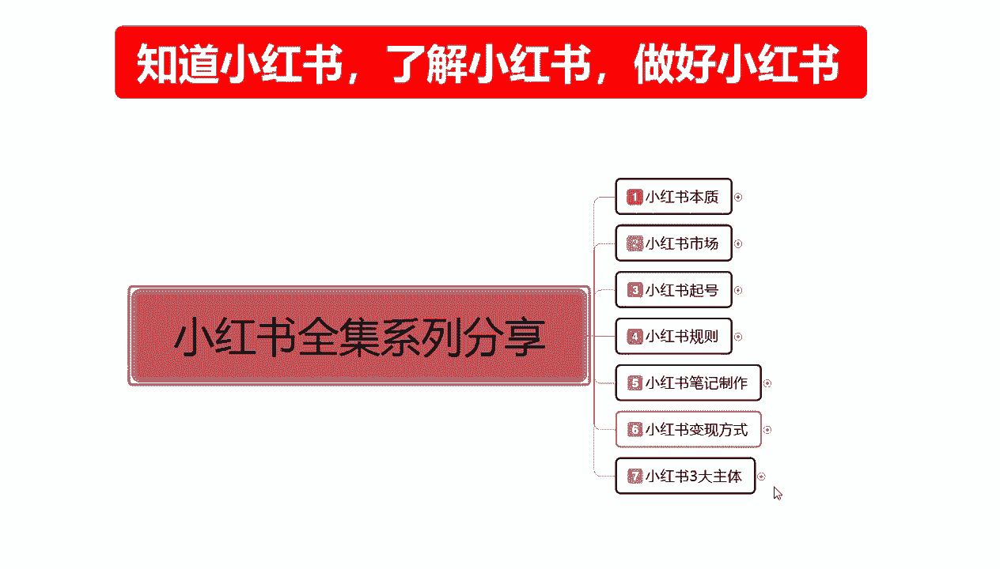

嗯这一节呢给大家讲解一下，店铺运营里面主体定位的第三节课啊，价格的一个定位。

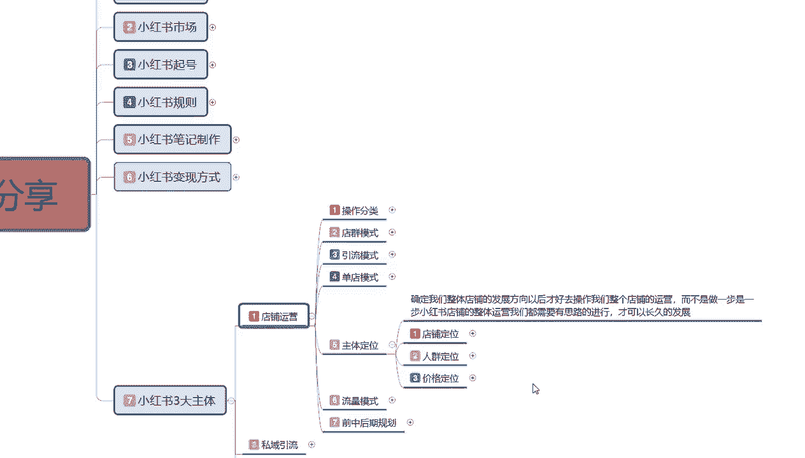

之前呢也给大家讲课的时候也给大家说过了啊，价格定位的话，他其实就是定位我们人群定位的后三个内容额。

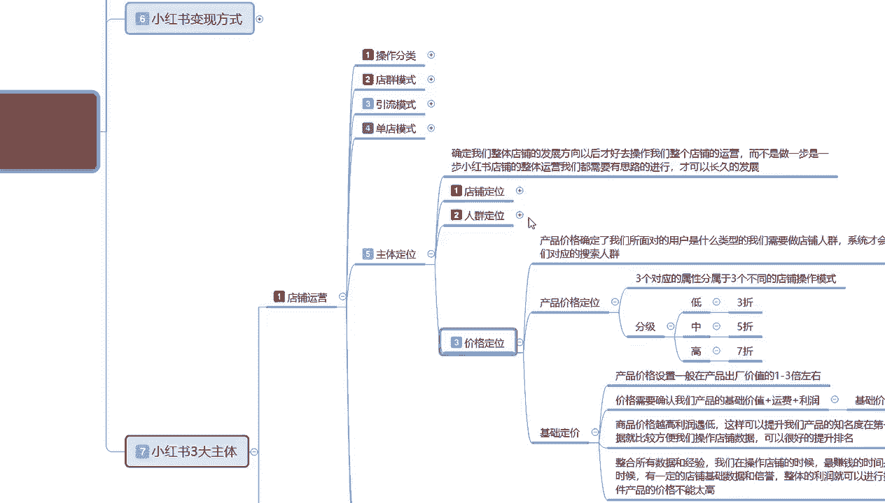

购买类型，购买地域和购买的一个习惯，他确认这三个类型的。

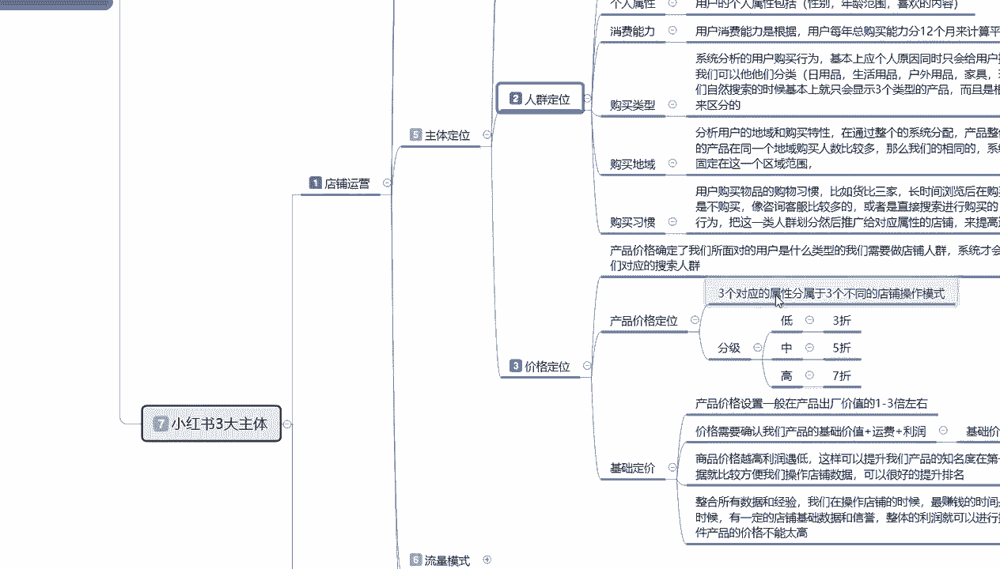

那我们来了解一下什么是价格的一个定位，产品的价格定位的话，是确认了我们所面对用户是什么类型的，我们需要确定做店铺人群系统，才会给我们对匹配对应的一个搜索人群，如果说我们不做这个的话。

就是不做价格系统的定位，我们该怎么做就怎么做的话，那么我们就没有购买类型，购买地域和购买习惯的一个啊内容进行分享，那么我们的基础流量曝光的话就会变多，但是我们特定的店铺整体人群的话就会偏移。

额你前期如果说做这个东西的话，你的前期可能会困难一点，但是后期会好操作一点，但你不做这个的话，你前期会简单一点，后期就会难一点，因为你后期的话要把这个购买类型的一个价格，人群拉回来的话。

你需要长时间的一个累积啊，它不是短时间内内拉过来的，就看我们自己怎么选择啊，你的你的推广度数的话，推广度数推广方式的话，看我们自己大家你到底往哪个方面去靠啊，因为本来就是主体定位，你定位好了以后。

你才能去做，你定位不好的话，你不好做，那我们首先来了解一下产品价格。

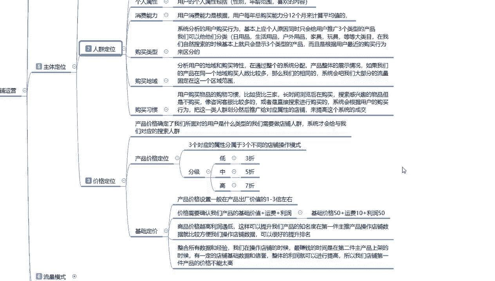

确定了我们所面对用户是什么类型的，我们在这里面的话就先来了解产品价格定位，他三个对应的一个分类，三个对应属性分类，属于三个不同的一个店铺操作模式啊，它首先是分级，低级。

中级和高级分别对应的是产品的一个折扣价格，就我们在小红书上面你打产产品，你的一个卖价折扣初始价格，他就确定了我们三个阶段的一个嗯，怎么说呢，就是对应的用户人群低质中高三个阶段，低的话是三折以下啊。

中的话是五三折以上到七折之间，就是456啊，他都在终端产品的这个范围之内，高的话是七折以上，789十什么意思呢，789十的话，系统就会认为你的产品质量还是可以的，他会把你分到高端产品这个范围内。

在这个产品范围内的话，我们做价格的话还是比较好做的，终端的话就是456这三个阶段，这三个阶段的话我们去做产品的话，他就会把你的产品列举列为中端，我们之前说过了啊，你在小红书上面定位的话，你选人群的时候。

他有消费习惯，有购买类型，购买地域对吧，他是通过购买的一个价格对人群进行划分，你比方说额我是一个小红书用户，我经常在小红书上面购买三折以下的产品，什么特价呀，特惠呀，一折呀，两折呀，限时折扣啊。

那么我就是低端用户，同等的在456左右，这个范围之内，我购买的基本上都是这一类的产品，那我就是终端用户，但是小红书上面的话，我们做高端的其实是比较多偏多的，因为7189折的话，对于小红书的女性来说啊。

因为整体女性18~35这个范围以内的话，他们的一个消费能力是非常强悍的啊，不要小瞧他们，所以说你只要保证产品的质量不出问题，我们做高端的一个折扣价也是非常好做的，这个就看我们自己怎么去选择。

我们购买类型和定位人群了啊，分别对应的三者五折七折，低中高三个三个阶段啊，看我们自己怎么给自己主体一个定位，基础的一个定价，就是说产品的一个加个设置啊，他的话就是利润是在1~3倍之间。

你不管放到其他平台啊，放到其他任何地方，你的一个你如果说你的基础低价设置不好啊，稍等，刚刚鼻子有点不舒服，就说我们基础定价产品的一个基础定价的话，我们在前面选择好了一个额店铺定位里面。

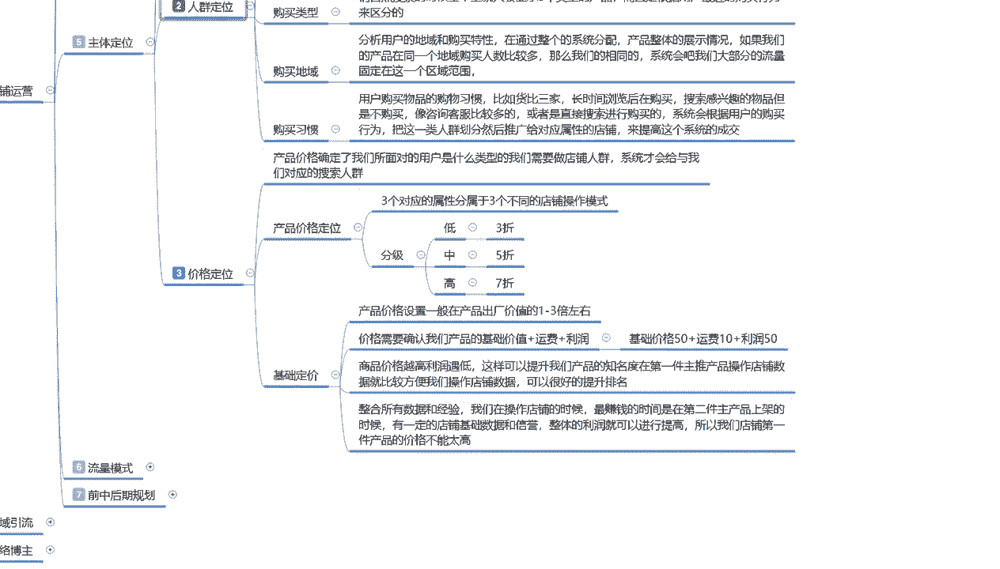

选择好了类目，选择好了一个产品。

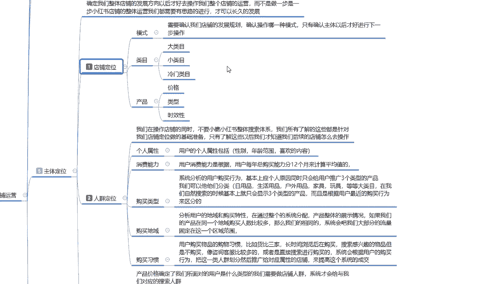

个人属性，消费能力，这三个点你们选不选是你们自己的事啊。

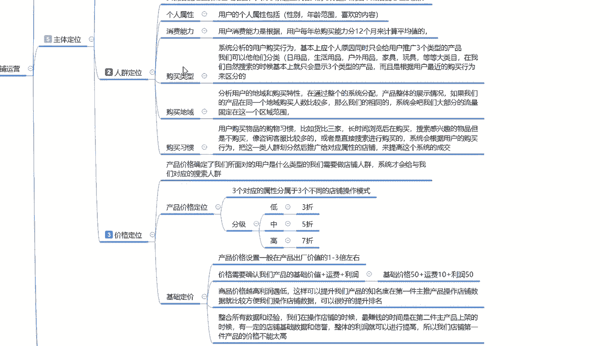

弄完以后的话，我是不是得给我们自己产品的，要设置一个技术定价，那它的一个价格是怎么设置的，其实这个的话还是比较简单的就行，我们自己怎么去分配啊，产品的一个价格设置的话，一般的话就是说在产品出厂价值。

在1~3倍左右，什么意思呢，嗯产品到你手上的话，可能是拿低一点的做比方吧，产品到你手上的话可能是十块钱，那么你去卖的话，最少要卖20~50之间，你不要觉得贵啊，这个是正常的，我们做网络营销的。

你的产品价值的话就是在1~3倍之间，给自己留下一定的空间，第一个这个1~3倍的一个价值的话，说实话他们是把运费啊，保险包括退货，退换货的一个概率全包括进去了，你后续把这个价格如果说定出来以后的话。

你基本上就不能再做修改了，价格需要确认的是我们产品的一个基础价格，简单点来说，它的一个定价的话就是基础价值加运费加利润，基础价值如果说是50的话，加运费十块，利润加利润50就是110。

那么基础定价是110，110的情况下，我们是打七折，五折三折，这个范围内1~10折，你自己去打对吧，那么就确定了我们下一步店铺所走的一个形式，那么我们这么想啊，技术价值是50，利润是50，运费是十块钱。

是110，对不对，我们打789折里面，我们做高端产品，那么就要代表你的产品质量要好，那你的基础定价的话可能就不在这个范围以内，你本来就是卖质量的，对不对，那你的一个一个基础价格的话。

我可能给你翻到220，220，打个八九折，那么你在里面的话，说实话我们前期去赚的话，你的成本价就是100块钱，你赚一件的话也就赚个几十块钱，其实是不高的，对不对，因为你还有里面的人工，你自己的一个投入。

你自己的一个宣传，包括你后续的一个售后服务，还有退货等等，那么你现在再看这个基础的1~3倍，大家觉得这个位置这个价格高吗，这么想的话，其实他就不搞了啊，心狠一点就是两倍，心黑一点就是三倍。

就看他自己怎么选，基本上的话都是在一倍往上一点点啊，不会多太多，这个还要看我们自己产品的一个呃，技术定价去选的啊，当然你要打五折呢，你要打三折呢，那你的基础定价定到三倍过分吗，50块钱十块钱。

运费利润150，那么就是210，210，打三折下来还剩下多少钱，对不对，你是210的三折，相当于是100块钱，30还剩下60，70块钱，70块钱一一单产品你只赚几块钱，十来块钱，你觉得这个价格还高吗。

就不高了，你要看算法运用，包括我们自己所结合的一些东西，你自己我们要把会计算啊，首先你也是要会计算自己的一个利润点，在什么地方，你要自己看怎么去做啊，低中高三个三个品牌的一个档次阶段。

然后在这个里面的话，就是说商品的价格越高，利润的话它是越低的啊，这样的话可以提升我们产品的一个知名度，在第一件主推产品操作店铺数据以后啊，就比较方便我们操作整体的一个店铺数据，可以得到很好的一个排名。

就是我们第一件产品他是不怎么赚钱的，它主要是提升我们账户的权重，提升我们店铺的一个权重，提升我自己的一个内在美，什么意思，什么意思呢，就是说我第一件我保证不亏钱的前前提下，保证我的生活能过得去啊。

可以小赚，但是不能赚太多，第二件产品，如果说我们是做多单点多爆款的话，你在第二件产品，第三件产品，第四件产品开始，你开始赚钱，那时候为什么，你第一件产品已经给你累积了人气信誉，人气度。

信誉度和一定的老顾客，你做第二件产品的时候，爆发的话就会非常容易，当然了，你做单店单品的话就不需要考虑这个方面了啊，单店单品的话你就是能赚多少是多少，看我们自己的一个主体定位，但是不能太过太过的话。

你后续你去开其他店铺的话，你会觉得这个投入和付出有点不成正比，因为你的数据量做不大啊，这个大家一定要考虑清楚，比如说整合所有的数据和经验的话，我在操作店铺的时候，最缺最赚钱的时候其实就是第二件产品。

第二件，第三件，第四件啊，第二件是最安全的，第三件，第四件啊，说实话的都有点信誉下降了啊，看我们自己大家怎么去分配，第二件主产品上架的时候，有一定的话，就是说嗯，前期因为我前期已经把店铺基础做完了。

在第一件主产品上面，整体的信用和力度就已经提升了啊，整体的利润我就可以把它稍微高一点，我可能之前的话我在做第一件主产品的时候，因为我要提升我自己本身的一个能力和速度，我把第一件产品的一个价格的话。

可能控制在一倍左右，就是刚好保本赚个人工钱，第二件我就可能会提升到1。5或者是两倍，那我卖一件就相当于是赚一件的钱，通过这种方式去赚钱的啊，第三件的话你就不能过分了，你就不可能直接翻到三倍了。

你还是按照第二种，第二件产品的一个定价去操作的，而且这个定价的话，你说实话，第三件产品的话，你再去操作的话，用户会有一点歧视感，只是说你的这个产品也能卖啊，赚的和你第二的第一差不多，只是是吧。

时间长了以后的话，没有什么太大的一个新用户进来以后，你就要想办法提升自己了，有新用户进来，那你还是可以和第二件产主产品一样越赚越多，你如果说没有新用户进来，那你可能就会越做越少啊，这个就是一个怎么说呢。

店铺的一个分水岭，看你后续的一个整体运营规划，是往哪个方面去靠啊，啊有点偏题了啊，这个呢就是技术定价所起到的一个作用。

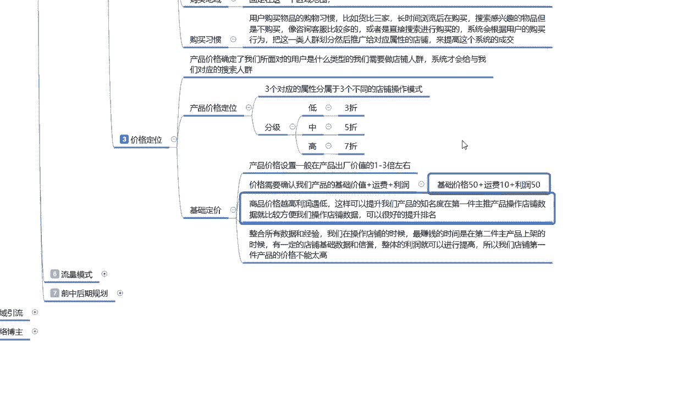

价格的一个定位，我们这这几这几节课啊，给大家讲了一个店铺定位也好，人群定位也好，价格定位也好，就说我们前期在操作的时候，你就已经把自己的后续的路选好了。

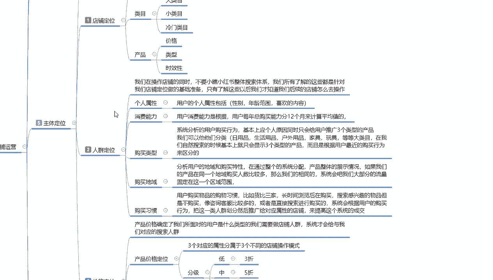

你才好去操作，你路不选好的话，你像这我们这里面有分歧的啊。

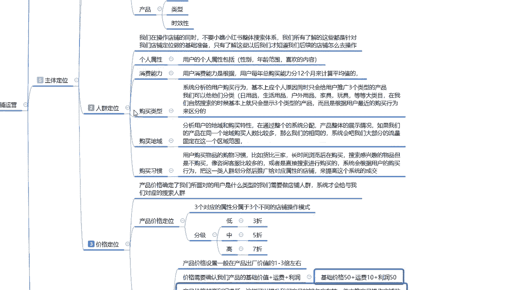

你这个东西做还是不做啊，你的价格你到底是三折五折七折，你要去怎么选，你都要有自己的思路和思维去操作才可以。

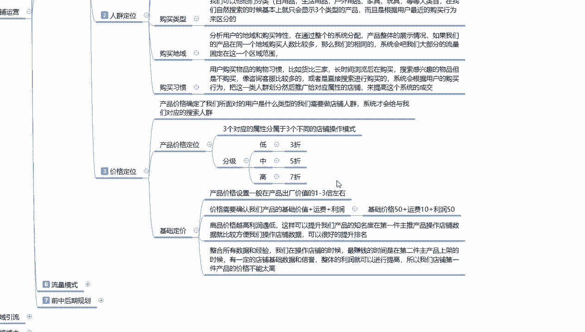

你没有的话，你后期的话，我们你就只能做个简简单单的普通店铺混混。

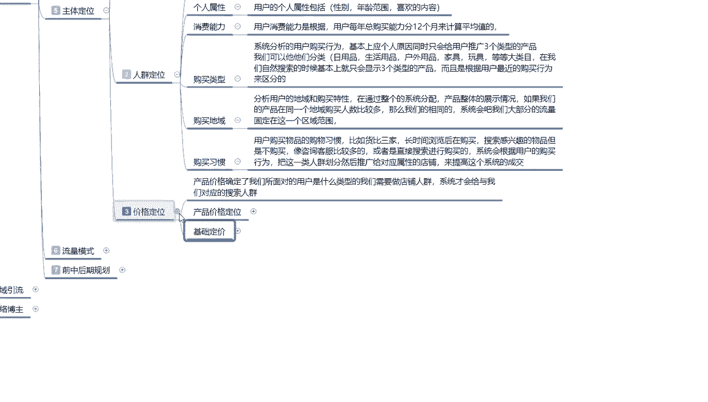

时间打打点的那种，你就不好做了好吧，这个呢就是给大家讲解的一个价格定位啊，包括这一期的一个主体定位，就给大家分享完了。

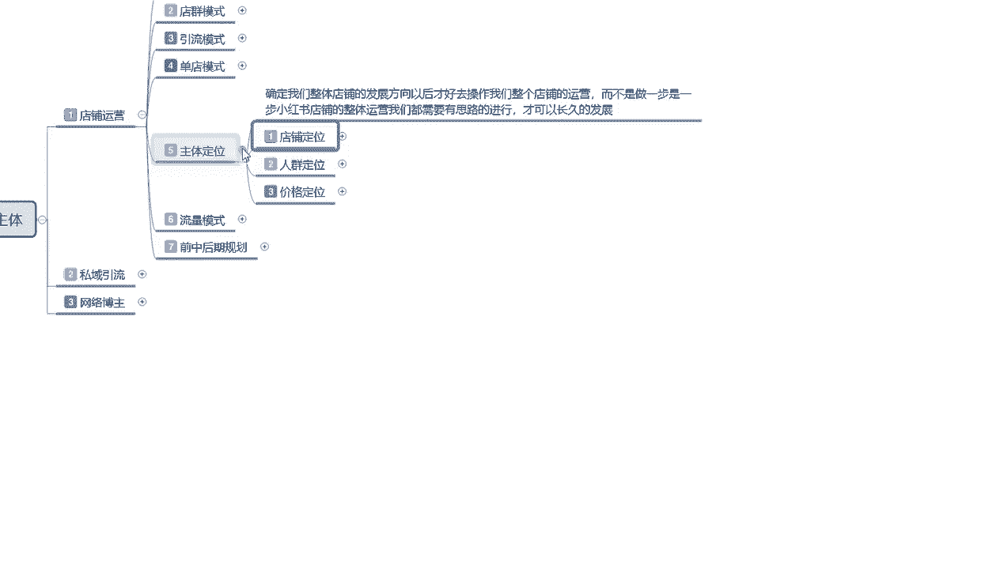

下一节的话是给大家分享一下一个流量模式。

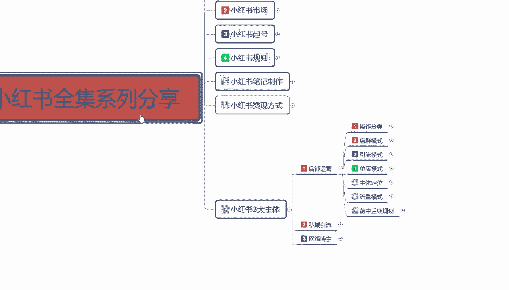

呃店铺运营的一个流量模式啊，我们要去争抢的是什么样的一个流量。

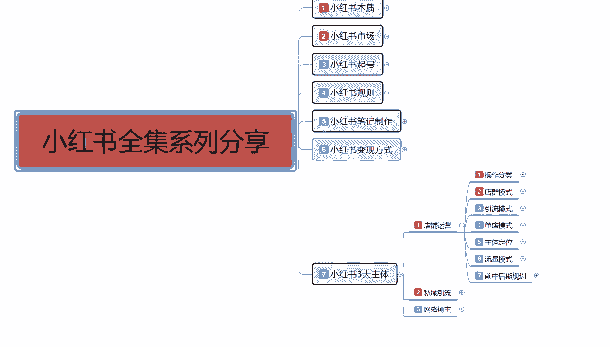