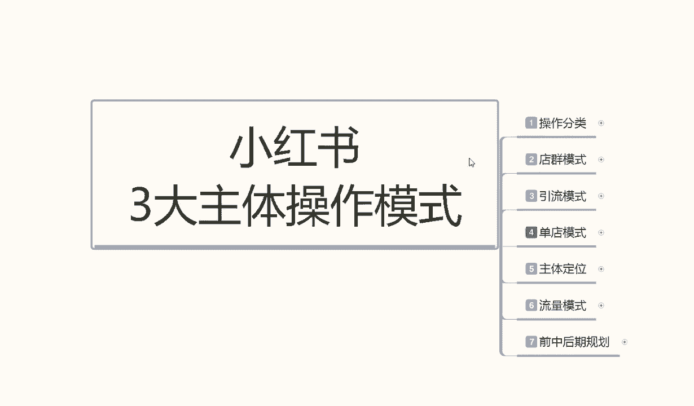
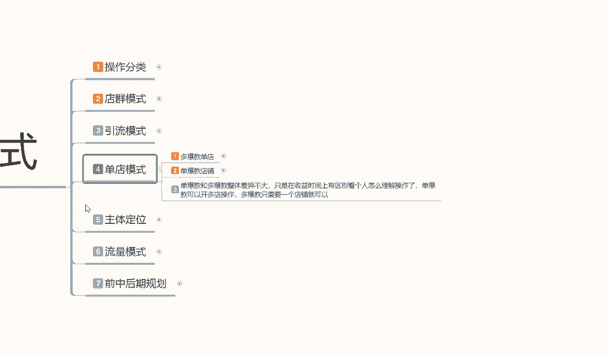
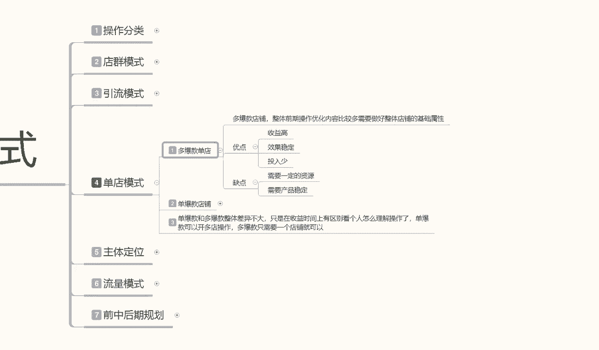
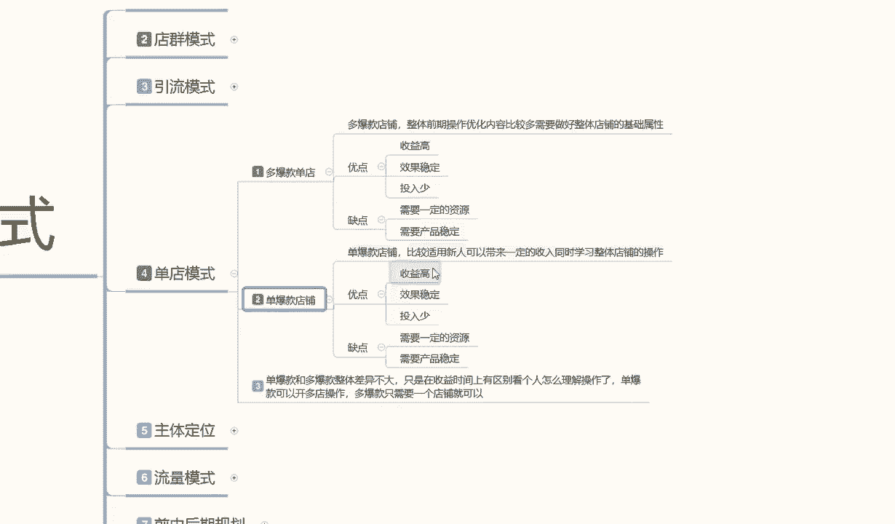
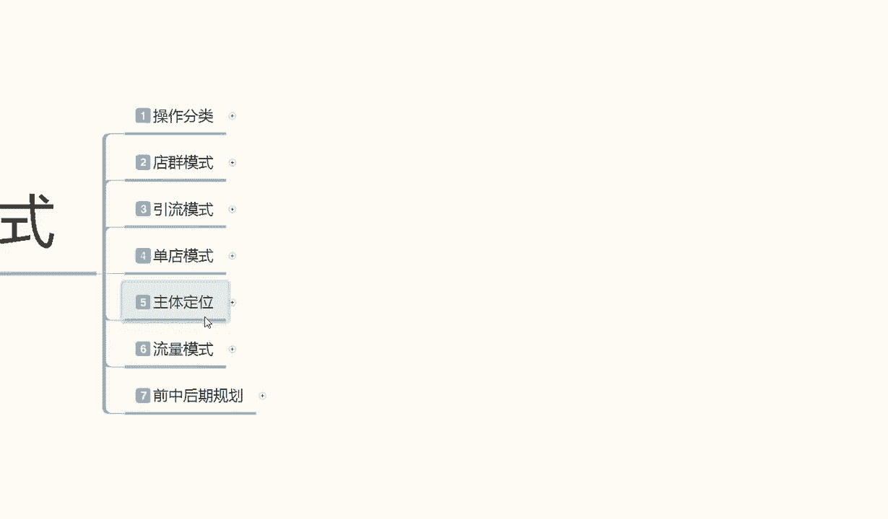
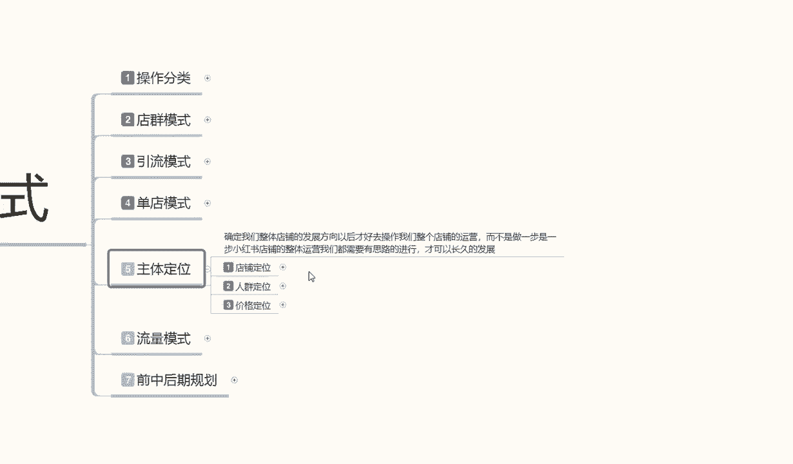
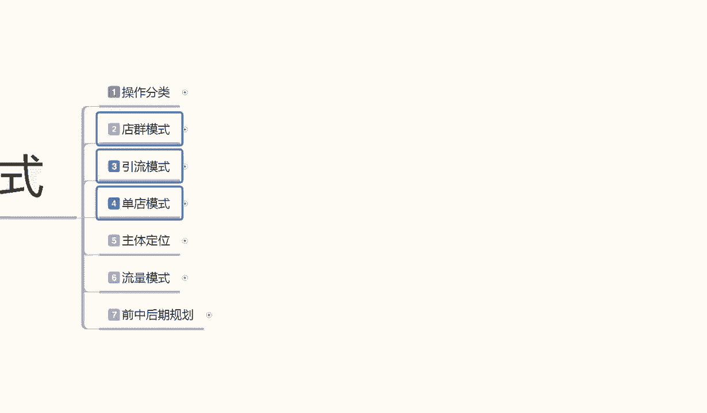

# 【2024版小红书体运营教程】全B站最良心的小红书开店运营高阶教程合集！小红书体开店 起号真的快，赶快点赞收藏起来 - P4：小红书开店-单店模式：单爆款，多爆款不同玩法 - 暴汗糯米糍 - BV1e7aWehEjY

大家好，今天给大家分享的呢是小红书，三大主体模式里面的最后一个模式啊，单店模式，它和电池模式和引流模式的话是不一样的，这个是我们需要实体开店的啊，不是线下实践，而是线上实体开店的。

电竞模式的话可能就是铺货啊，小红书的话引流模式的话，只是说把小红书里面的精准用户引流量，引流到自己的一个群里面，但是单店模式的话，他就说我们去操作的时候是操作，我想在小红书上面长久发展。

做一个精品店铺出来啊，这上面获得收益，这个呢就是单电模式，单点模式的话啊。

在这个里面的话，我是给大家分了两个点啊，第一个呢是多爆款单点，第二个是单泵单爆款单点，最后呢就是说呃给大家总结了一下，说实话单爆款和多爆款的话，整体差异它是不大的啊，只是在收益和时间上面有区别。

看我们个人怎么理解去操作了，单爆款的话，我们可以开多点操作，你比方说你这个单品店铺就小红书，我这个店铺爆了，但是我又不想让它流量有太大变化，我就可以开第二个店铺，继续做单爆款就可以了。

把之前我们说的单爆款的模式复制过来就行，多爆款的话，它相对于单爆款的话，它的呃优势就是什么呢，只需要一个店铺，然后的话，他持续发展时间会比单爆款时间长一点，为什么单爆款店铺你不管再怎么做。

他的一个持续时间的话也就一个季度左右，最多也就一个季度了嗯，超过一个季度的话，它的一个稳定性在这个地方，但是他的一个爆发性没那么高了啊，就是发展前景没那么高，多爆款的话就说你一年四季都可以操作。

就看我们自己怎么去理解了啊，一年四季你卖服装，四种不同的服装啊，你卖家具，各种家具都基本上可以，但是到单爆款店的话，最多也就三个月，三个月，后续的话数据会掉一部分，掉一部分的话，那就保持稳定。

但是你每天也要更新它的一个数据量啊，就是单爆款和多爆款的一个区别，那首先呢给大家讲解一下。

单爆款电我们怎么去操作，咱们多爆款电的话，就是说整个店铺前期操作，优化内容的话是比较繁琐的，整个店铺你基础属性你如果说做不好，你报到后期的话，我们再去操作整个店铺的话，它不好操作了，他优点在什么地方呢。

第一个收益高，第二个效果稳定，第三个投入少多爆款店为什么说是投入少呢，他只是说放大了一个投入的比例，但是他整体投入的话，说实话是持续性的嗯，你包括后续后续的一些付费推广。

说实话小红书上面做付费推广有点浪费啊，基本上我们都是做笔记引流和那个关键词引流，只说这两个点，如果说做付费推广的话，效果不会太好，因为你把握不住节奏，你正常要做付费推广的话。

也是在中后期去做突破瓶颈的时候，所以说他优点的话还是比较明显的啊，收益高，整体的话你做小红书，做网店的话，其实收益是非常高的，然后他的一个效果稳定，多报个天，因为他为什么说效果稳定，它持续时间是长的。

他可以做一年两年3年四年，你整个店铺的话，只要是没有太大的一个违规的话，基本上都可以做下去，投入还比较少，缺点就是什么呢，需要一定的资源量，为什么，因为他的多报管电和单爆管电的话。

他的操作数据是不一样的，前面的你就相当于是半买半送了啊，保持店铺不亏本就行，你赚钱的时候是在第二个店铺的时候，也就是说你前面基本上要花两个月左右啊，把第一件爆款做起来以后，花两个多月左右进第二款。

上第二款爆款才是赚最赚钱的时候，所以说他是你个人的话需要一定的资源量，这资源量的话不是说自信，资源量和货源资源量是你的人员资源量，因为你在这个上面的话，你要做对应的一个账号啊，做对应的一个权重。

做对应的一个文案，所以说你的资源一定要丰富，资源不丰富的话，说实话做单报点好一点啊，多报电的话只是说看你的选项，你如果说前面觉得自己资源不是太充足的话，我建议大家去做单爆点就可以了，资源充足一点的话。

做单多报点会比较好啊，第二个缺点就是产品的一个稳定性，为什么说是产品稳定性，因为多多爆款的一个店铺的话，有很可能涉及到你的产品需要去囤货的啊，你不能像其他的一个产品，你做店群啊，或者是单店模式这种的话。

全用代发多爆款店的话，你肯定是要有自己的产品的，那你有自己的产品，你就要囤货，那这里面的话就是涉及到一个点是什么，你存多货，爆款爆了一段时间没卖完，剩下的货怎么办，不好处理，说实你这像这种店。

如果说你去其他地方拿货，你卖完了以后断货了又该怎么办，就是说需要产品的一个稳定性，你产品稳定性不好的话，你做多爆款店还不如做单爆款店，你做完了产品货卖完了没没东西了，电池我再换一个电就行。

但是多破块钱的话，你肯定不行，你一定要维持住他，你不维持住他，你的数值就掉啊，所以说他有优点也有缺点。

看我们自己大家怎么理解，然后呢是单爆款的一个店铺啊，单爆款店铺的话比较适合的话，就说新手去操作一点多，爆款的话说实话比较适合资金雄厚的啊，商人或者说是厂家去做，你自己有电也可以去报，单。

爆款电的话就说他比较适合于用新人来概括吧，额可以用来带带来一定的收入，同时的话去了解一下我们这个网络运营营销啊，包括这种网商店铺怎么去操作，把整个模式了解以后的话，你慢慢累积一定的资金了以后。

再想办法去做大啊，因为对于新人来说的话，说实话你前期投入太高的话，第一个你本身资本就不是很好啊，第二个你不对，不了解的东西，你一次性投入太多的资金进去，说实话你吃不消的啊，吃不消的。

所以说一定要有基础了以后再去做多爆款店铺，新人的话，建议大家做单爆款的一个店铺就可以了啊，他的优点是什么呢，也是单品爆发期的收益非常高，只是说他的稳定持续时间不长而已啊，效果稳定，为什么说效果稳定。

它爆发了以后的话，你最少可以吃3~4个月的一个利润流量，就是说你前面做出来的话，可能需要一到两个月，然后他的产品的话，你可以卖三个月，也就是半年啊，然后他投入非常少，人体单铺网店铺的话，你的投入的话。

其实和引流模式里面的一个资金相差不大啊，1万块钱左右就基本上可以把店铺做起来，你如果说资金稍微充裕，注意一点的话，你可以把它加到1万5，那个效果就做的非常好，说实话你要是觉得你没资金不充足的话。

你拿5000块钱，7000块钱单独坐垫也能做啊，只是稍微节奏慢一点，这就是说他的一个优点，这个地方缺点的话就是说也和多报管田一样，整体的话资源量一定要有啊，产品的一个稳定性，要有它的一个缺点。

唯一一对比多爆款电镀不怕，就说你没有经验，你的操作稍微复杂一点啊，因为他单爆做的话，你是做第一件爆款产品，你本来就是拿第一件产品去做做数据的，你的竞争对手就会强大一点，因为你的话你是拿第一件产品去赚钱。

你没有做引流啊对吧，你直接拿第一线主产品去跟别人竞争，有一定的风险，那多报告年为什么第一件产品本来就是引流的，不赚什么钱的，说实话保证自己不亏本，就是赚了，他是在第二件产品上架以后。

保证自己的店铺有人气，通过第二件产品的一个价格差异，吸引这帮人对你店铺的一个信任，然后去赚这笔钱的，这就是单包点或多半点，唯一的一个最大的差异化啊，所以说我们大家在做店铺的时候。

你一定要清楚自己的优点在什么地方，缺点在什么地方，你才会去操作店铺，如果说你连这些东西基本的一个数据把控，你都做不到的话，说实话啊，小红书上面做电影你还真不好做起来啊，他虽然说对比呃，其他两大平。

三大平台的一个销售总渠道来说的话，他的人群是非常固定和稳定的，就看你自己怎么去操作了，而且他的整体系统的话是还有漏洞，让我们钻的啊，你像其他平台的数据量的话，说实话你拼多多就是低价拼量去了啊。

11厂家出的价低就在谁，那但是小红书上面的话，现在他没有这么完善的一个系统，包括它里面的人群，他对于网络运营与营销的话，他不是那么清楚啊，不是那么了解，他只是觉得这个东西我看着不错，他就会去买。

说说对于新手用户来说的话，小红书上面还是有非常大的一个空间，留给我们去操作的，好吧，今天呢就给大家分享到这啊，这是一个单田模式的一个整体操作。

下一节课呢给大家分享一下，我们一个整体的一个主体定位啊。

这个主体定位的话是店定位，我们要操作模式里面的一个店铺定位。

一个人群定位和一个价格定位，我们刚之前呢给大家说的这三个模式，只是说玩法啊，小红书的一个玩法，你去想做做到什么样的一个产品，玩到什么样的一个目的啊，下一节课给大家就是讲主体的一个定位。

就是玩法里面进一步的一个数据量啊，到底什么产品怎么定。

