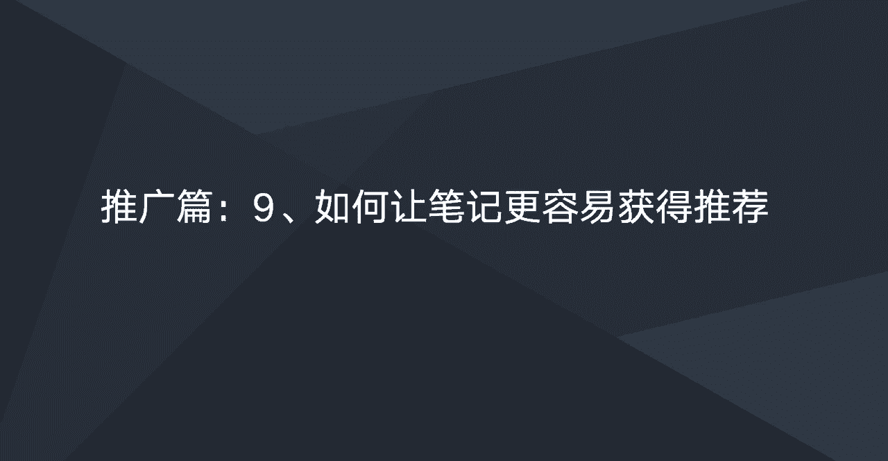
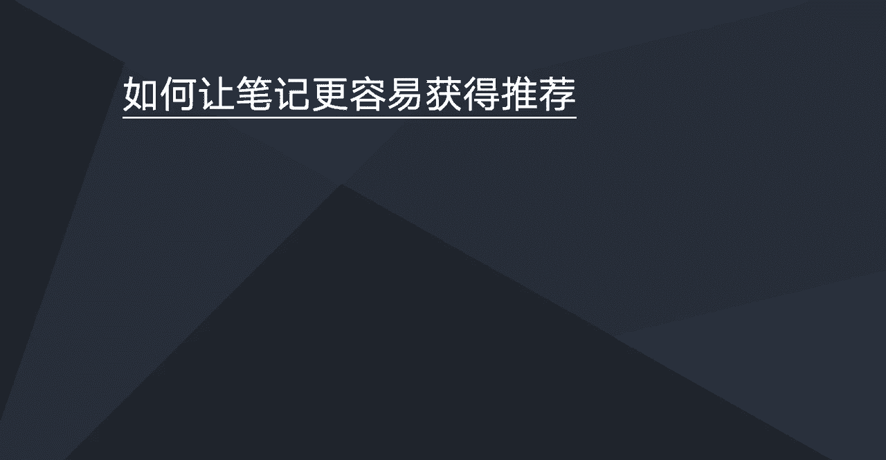
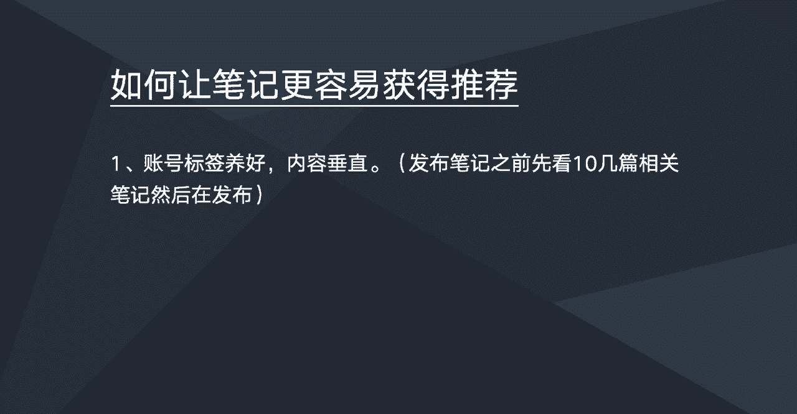
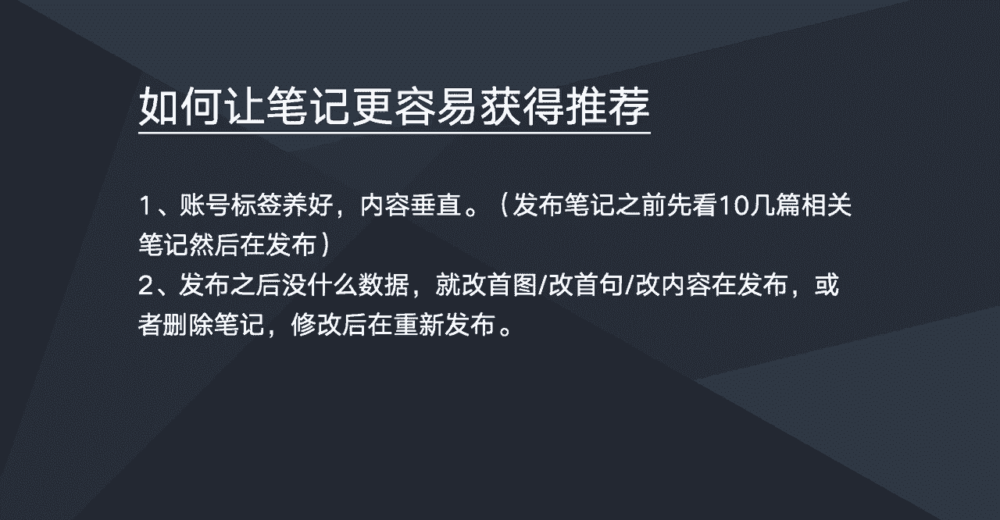
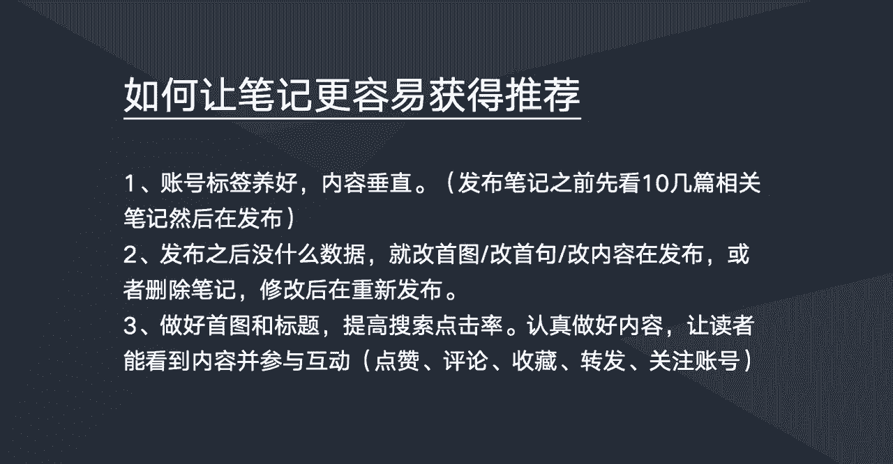
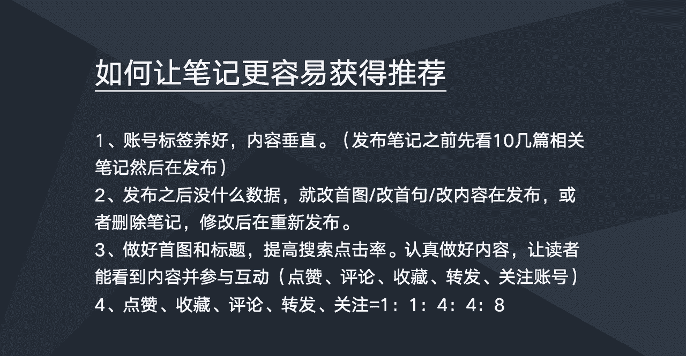

# 【2024版小红书体运营教程】全B站最良心的小红书开店运营高阶教程合集！小红书体开店 起号真的快，赶快点赞收藏起来 - P6：如何让笔记更容易获得推荐 - 上海小姑凉 - BV1U7hFeJErj

这一节我们来学习一下，如何让让笔记更容易获得推荐。

笔记获得推荐的话，就是呃，这个推荐是官方给你推荐一些真实的读者，来看你的笔记，别说官方给你推荐的越多，那么你笔记的一个阅读量也会越多，那你笔记的数据也会越好，那么如何如何做到这点呢。

那他也是有一些技巧的，这里分享几点，第一点的话就是注重一个账号的一个标签，比如说我账号的标签要养好，然后内容要垂直，就账号的标签呃，也需要垂直，就是养号这一个前面有说过，就是这里就不多说了。

因为我们账号的标签养好，然后保持内容的一个垂直度，然后我们在发布笔记之前，我们最好是能够先去阅读呃，该领域，比如我们要写一篇减肥的一个笔记，那我们在发布这篇减肥笔记之前。

我们先看看个十几篇减肥减肥的一些相关笔记，然后在这些笔记下面我们去做一些互动，比如说去点赞，评论啊，收藏啊，这些笔记要做完这个动作之后，我们再把自己的笔记发布出去，这样子的话是啊。

能够获得更多推荐的几率会更大。

然后第二个的话，就是我们的笔记发布出去之后呃，我们发现诶好像没什么数据，那这个时候的话，也不是说我们笔记发发布出去之后没数据，那就结束了的，那在小红书它是可以去修改修改笔记的，然后修改笔记。

然后再重新发布它，他可以重新去计算，也就是说如果你修改的好，你重新发布之后，他会再给你推荐一些流量过来，所以说我们当我们笔记发布之后，发现没什么数据，大家可以尝试去修改一下主首图。

修改修改一下我们的标题，或者是我们的一些内容修改之后再发布，当呃怎么改呢，大家可以就是根据这篇文章的一个，受重人群的一些关注点，关注点或者是一些细节的东西，我们去做一些微调，然后改了之后我们再发布看看。

有可能他会有数据，如果没有的话，可以尝试再继续改，或者是把这篇笔记，就是你觉得这篇笔记你自己写的比较满意的，你觉得应该是一篇好的笔记，那么你可以那如果是好的笔记发布出去，又没有推荐，没有数据。

那你可以把这笔记复制一下，然后你要把云笔记给删了，然后你再重新再啊在写一篇笔记，就就重新再额在进入那个发布笔记的环节，然后把这篇笔记再复制进去，然后也是稍微做一些改动，然后再重新发布。

以这样的一个操作手法来重新获得一个推荐。

第三一点的话，就是需要我们把我们的首图跟标题优化好，也就是说，我们我们的笔记也要注重一个搜索点击率，比如说我们笔记的一个点击率越高，那么官方会给我们的推荐流量也会越大，所以大家呃要多放点心思。

在啊笔记的首图跟标题上优化好，我们一个搜索点击率，其次的话就是认真做好内容，就是让我们的内容嗯价值度更大，比如说要读者是发自内心看完我们的笔记之后，他是自愿参与一些互动，比如说看完我们的笔记之后。

他自愿去点赞，诶觉得这文章好，觉得这文章有价值，他自愿来点赞收藏，或者是来做一些评论或者转发，或者是觉得诶你写的文章很有价值，我关注你的账号，想看看你下次再想，想看看你下次写的文章。

然后这几个互动的一些维度，比如点赞评论收藏转发关注账号，他是有权重的说法的。

然后他的权重比例是这样子的，点赞收藏权重是一，评论转发权重是四，关注关注的权重是八，这个群众怎么理解呢，嗯你可以把它看成一个群众，看成是一分，比如说你发了一篇笔记，你的笔记有100个赞。

然后你这篇笔记就可以加100分，那你的笔记有有50个评论，那么你这比你你这边笔记就可以加个50，乘以四，就是200，就加个200分，那么你这篇笔记为你带来了十个关注，那么你这篇笔记又可以加80分。

那这样子的话，你这篇笔记的话就是380分，也就是说你一篇笔记啊，按照这个算法，你的分数越高，那么官方给你的一个推荐流量就越大，这个群众可以这么理解，但这个呃这几个维度嗯，官方它有自己的一个算法。

就是说我们去刷有可能是无效的，但官方怎么怎么去算，那肯定是不知道的，那么我们在呃写笔记的时候，我们可以去用内容去引导啊，引导大家去做一些互动，或者做一些啊，比如点赞收藏，转发关注等等。

比如说呃我们可以在文章的末尾，觉得大家觉得笔记啊有价值的，可以收藏一下之类的话，或者是用一些嗯，比如说点赞的，点赞的小姐姐都是漂亮美丽的小姐姐，类似，这样的话，就是它一定程度上是可以提高一个笔记的。

一个啊这些数据的，然后这里的话就注意不要去嗯，出现一些诱导性的一些一些东西，如果诱导性比较明显的话，呃，官方发现的话，他也会也会给这篇笔记，或者给你的账号进行一个限流的一个处罚的。

