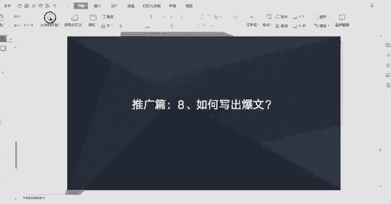
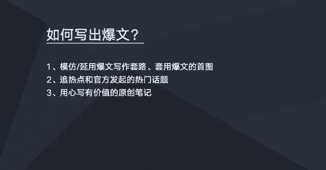

# 【2024版小红书体运营教程】全B站最良心的小红书开店运营高阶教程合集！小红书体开店 起号真的快，赶快点赞收藏起来 - P8：如何写出爆文 - 连闪五连鞭1 - BV1L9i5eSE4x

这节课我们来学习一下如何写出报文，我们做小红书的一个笔记推广的话，其实追求就是豹纹，报文就是数据非常好的一个笔记，那么写出报文的话，它是有一些技巧的，所以这里就分享几个，就是哦可以写出报文的一些方法。

第一点就是模仿跟沿用报文的一个写作套路嗯，大家可以去搜索自己类目的一些笔记啊，比如说大家做的是一个美妆类的一个类目，然后做的是化妆水这一个产品，那么大家就可以去搜索，化妆水相关的一些关键词。

那么找到一些额数据比较好的一些笔记，大家可以去看一下这篇笔记，他的一个写作套路是怎样的，然后啊，我们可以去模仿这类笔记的一个写作套路，或者是自己在写的过程中的话，呃，发现诶这自己这篇笔记爆了啊。

数据爆了，那么也可以继续沿用这篇笔记的一个，写作的一个套路，因为我们可以去模仿跟沿用沿用，然后的话，第二个的话是，可以直接套用一些报文的一些首图，比如说一些笔记他的一个呃文，他的一个笔记数据之所以好。

肯定是有原因的，比如说然后很可能是他一张他一张手图，非常的吸引点击，那么我们也可以去找到这样的一个笔记，然后我们去套用它的一个首图，不是说完全搬过来，比如说我们比如他首图里面主要宣传的一些点。

那我们也可以找一个相似的图去也一样，宣传那个点就是套用豹纹的一个首图，不是完全搬过来啊，完全搬过来是不行的，我们可以稍微做一些啊改动优化调整，或者是模仿你图片的一个创意，图片的一个宣传点。

第二个的话就是我们可以去追一些热点，和官方发起的热门话题，也就是说用一些热点话题，以及官方发起的一些热门话题来写我们的笔记，这样子的话我们的笔记的话也是比较容易爆，第三个的话就是用心去写了。

用心去写有价值的一个原创笔记，因为写笔记它是一个做内容的过程，内容它讲的是一个价值度，如果我们不不去用心去写的话，那么去哪去模仿这么多好的一些报文呢，好的豹纹他迟早有一天会被写烂，那么的话。

还是最终还是需要我们自己用心去创作，当然小红书的话适当模仿，是在短期内是效果是比较好，但是模仿一段时间，这个东西肯定会被写烂，那写烂了用户他会看腻了，看腻了就不感兴趣了，他就他就很难再去抱起来。

那么最重要一点还是用心去创作，关于追热点跟官方发起的一个热门话题的话，怎么去找呢，嗯这里简单介绍一下。

比如在我们小红书有个搜索框，我们点击搜索搜索框之后就跳到这一个页面，而这个页面这里的话就是，这里有一个热门的搜索，热门搜索，下面的话有一些关键词，大家注意看，有些关键词前面有一个火，有一个火的符号。

就带火的符号，这些话题是嗯官方发起的一个热门的话题，比如说大家可以结合自己的类目跟产品，看看是否跟这些话题有相关性，如果有相关性的话，可以用这些话题去去写笔记，也是比较容易爆的。

那么想了解更多的一个热门的一个话题，我们可以点这里热门的榜单，然后会跳到这里，热门榜单，这里有热搜热搜热门的话题，我们可以在这里去啊，挑选一些适合我们类目，适合我们产品的一些话题。

