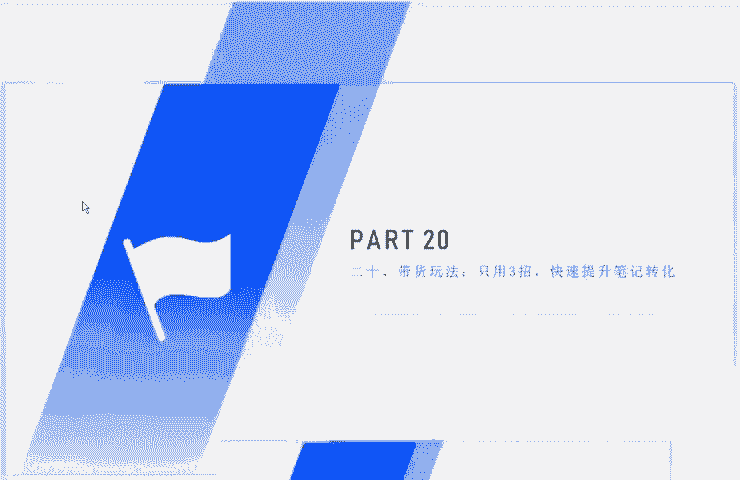
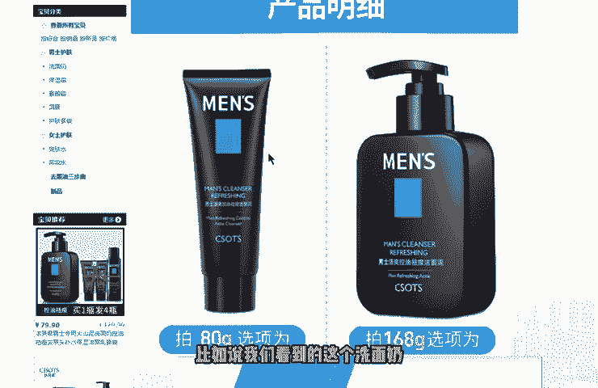
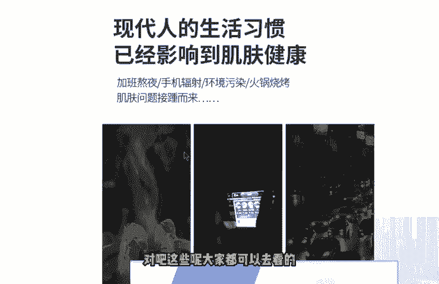

# 【2024版小红书体运营教程】全B站最良心的小红书开店运营高阶教程合集！小红书体开店 起号真的快，赶快点赞收藏起来 - P9：第8节：小红书电商带货玩法，只需3招，快速提高笔记转化！ - 杰瑞勇闯浪浪山 - BV1dLMRegEFi

大家好，我们今天的这个第二0课呢给大家讲解的是带货的玩法，只要用三招呢就能够快速提升笔记的这个转化。那提升笔记的转化的话呢，首先啊我要和大家说的是什么呢？

就是说我们应该做到哪些这个呃哪些点呢才能够精确的做到让这个产品呢植入到我们的这个小红书笔记里面，然后呢引导别人去下单。啊，首先第一个呢就是要有一些使用一些有有恐惧，或者说痛点的这个呢去刺激的一些用户。

比如说没有这个产品呢生活将上变得有多么糟糕，对吧？😊。

比如说我就见过一个最简单的一个案例，比如说一个祛痘的一个产品。那如果说你的脸上一直在长痘的话，可能啊比如说一直找不到男朋友啊，或者说一直找不到女朋友啊啊，生活上一直遮遮掩掩的呀，本身就不自信啊，对不对？

那因为有了这些痛点的话，所以说咱们才需要去卖这样的一个产品。那如果说没有这样的一个产品的话呢，本身我们的生活呢就要变得很糟糕。😊，对吧这种痛点我们到底该如何去寻找呢？其实呢我们主要是看这个同行的一些。

看我们同行的这些商家就可以了。同行的商家是怎么去找呢？比如说我这里能简单的跟大家介绍一下，我们看一下这个淘宝里面，淘宝里面，比如说我们看到的这个洗面奶。😊。

呃，它的这个洗面奶到底是有哪些这个卖点，或者说痛点，看到了吗？呃，拯救机构肌肤皮肤干的时候可以用到控油的。😊，呃，控油祛痘保持清爽的那比如说你的脸上一直在出油啊，对吧？出油的这个痛点是什么啊。

比如说这个脸上呢就导致这个毛孔闭塞是吧？脸上呢坑坑洼洼的，或者说皮肤一直很干燥，那皮肤一直在掉皮，对不对？这些呢它都是。😊，这个商品的一些卖点。那有了卖点之后呢，反过来来说。

就是我们这个平时的一些人呢所遇到的一些这个痛点。比如说水油不平衡，对吧？比如说毛孔经常堵塞啊，或者说皮肤很干，没有水分。对吧这些呢大家都可以去看到那这些呃下面的这些卖点呢，就是我们等一下等一下去说的啊。

😊。

那有了这种痛点之后呢，我们就可以去找到相应的这个对应的痛点呢去写作。第二个呢就是我们的这个场景的一些带入。比如说熬夜啊，或者说一些差的生活习惯从啊所导致的。比如说我们可以看到像这种场景啊场景的这种带入。

比如说这个场景对吧？它经常呢在外面吃这个烧烤，或者说吃火锅，啊，比如说在外面经常熬夜，对吧？也容易去长痘啊，比如说外出的时候呢，这个灰尘比较大，那也能也容易堵住这个毛孔。

那这些的话呢就是使我们的一个使用场景呢，有了这样的一个使用场景的话，我们才能够正式的推出我们的产品，对不对？😊，啊，包括这里面可以看到加班熬夜、手机辐射、环境污染、火锅、烧烤、皮肤问题。

肌肤问题也就接踵而来了。那有了这样的一个不好的一个习惯导致的这种情况呢，从而我们就会让比如说让这个啊一些这个粉丝呢感到自卑，对吧？啊，没比如说有因为这样的情况导致导导致了自己呢没有这个太多的一个呃自信。

从而呢缺少这个社交等等那这个也是我们现在一些青年男女呢所遇到的一些问题。😊，那么第三种呢就是我们可以去制造一些美好的这个美好的一个感觉啊。比如说没有这个产品的话，生活。😊。

