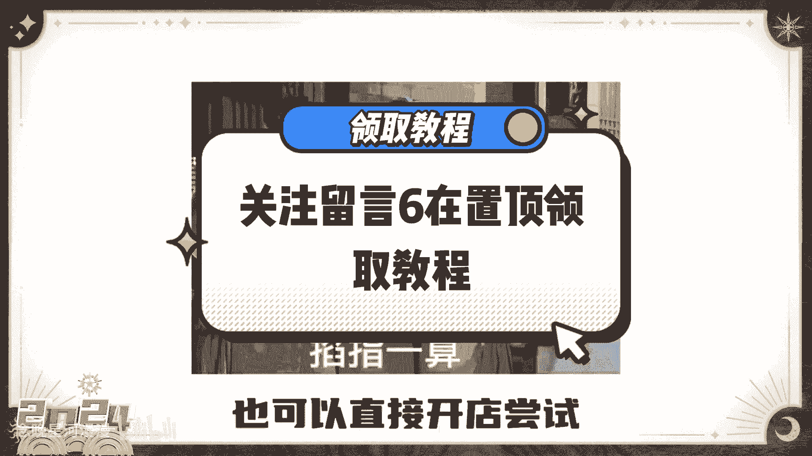
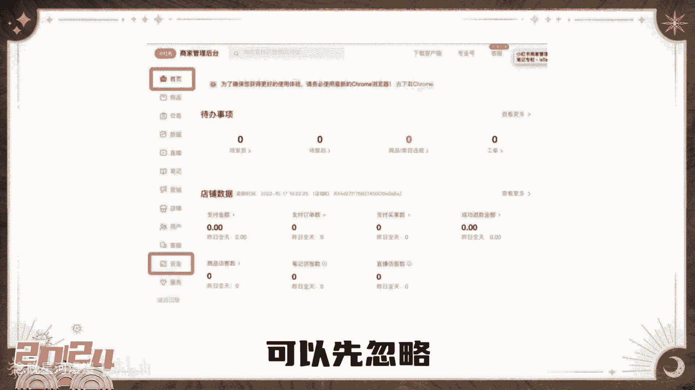
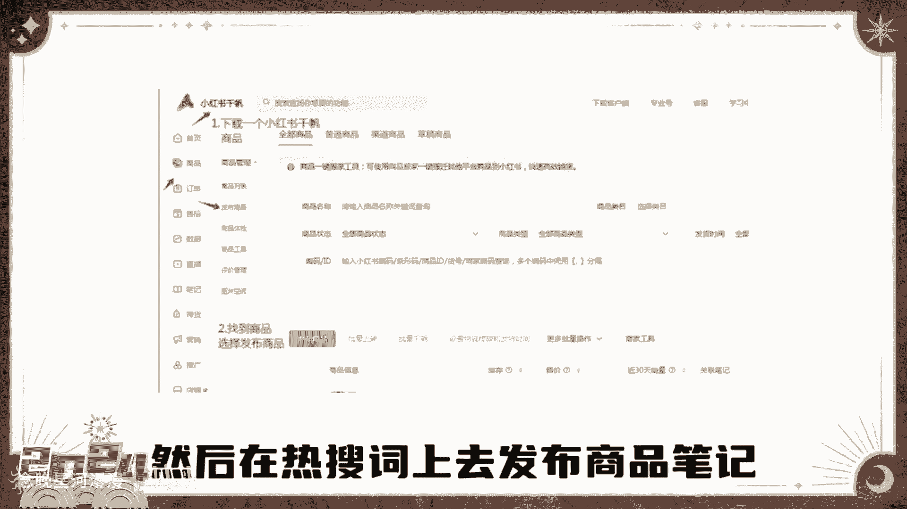
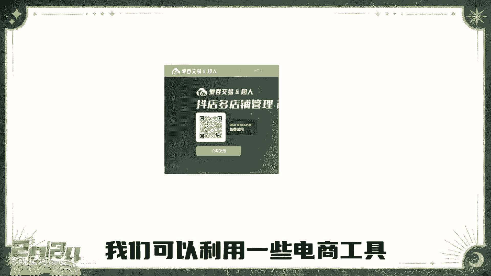
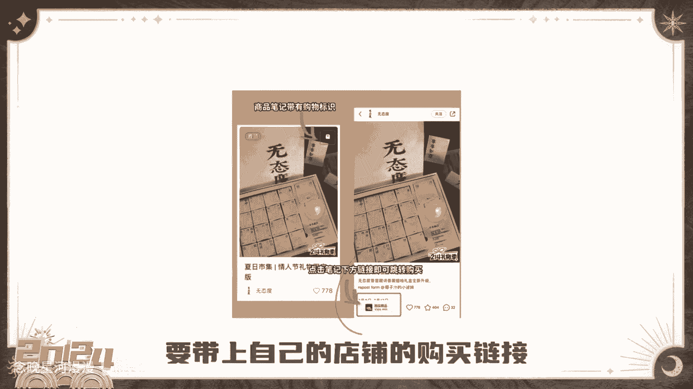

# 【2024版小红书体运营教程】全B站最良心的小红书开店运营高阶教程合集，从0开始做小红书体开店 ,起号真的快!!! - P1 - 念晚星河漫漫 - BV1wT421Y7FM

你为什么学习成绩这么差呀，对不起，我今天拒绝采访，恭喜你，刷了这条视频，你将获得一份全网最全并且能落地的小红书。

开店实操流程，只要照着做，不仅能少走弯路。

还能快速开店，即使你在小红书上领粉丝，也可以直接开店尝试，第一步。

开通书店，只需要一张身份证，不需要营业执照，打开创作中心，更多服务，点击开通店铺，按提示操作一分钟就能把店开起来，第二步登录商家后台，后台会让你提示先交1000保证金，可以先忽略。

等到店铺盈利以后再交，而且保证金是可以退的，第三步，学会选品。

打开商家后台，在商品后台里可以看到热搜词，然后在热搜词上去发布商品。

笔记能得到额外的流量扶持，第四步上架商品，我们可以利用一些电商工具。

把选好的商品一键复制到自己的店铺，第五步模仿爆款。

爆款都是重复的，去模仿别人的表现形式，发布笔记时要带上自己的店铺的购买链接。

做好这几步，你店也就能开起来了，记得持续复盘优化。

店铺会越来越稳定，更多起店细节放在视频左下角，需要的可以自己去拿，我不是儿童了，我已经擦干鼻涕。