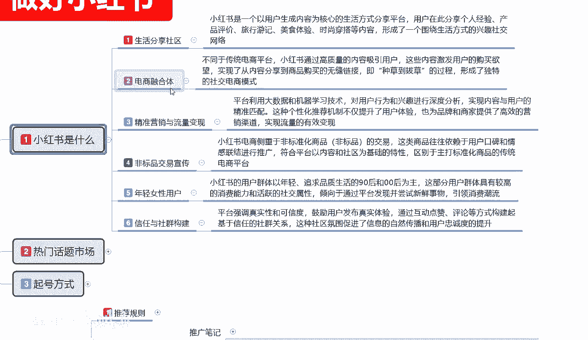

# 【2024版小红书体运营教程】全B站最良心的小红书开店运营高阶教程合集，从0开始做小红书体开店 ,起号真的快!!! - P10：p4.2推流规则 - 念晚星河漫漫 - BV1wT421Y7FM

大家好，今天给大家分享的是小红书全集系列的。

第四大节规则逻辑，第二课时。

上一节课给大家讲解的是推荐的一个规则啊，这节课是被推的一个整体核心逻辑，因为他这个小红书的话，他的一个推荐规则和被推的一个核心逻辑，他是不一样的啊，推荐的你做了他才会给你小红书，才会给你流量啊。

被推的核心是什么，我做到了某些要求，他会不会给我额外的一个流量，首先这个里面的话，我们其实可以把它分为两个点，推广笔记。

一个内容，推广规则，一个内容啊，首先了解一下推广笔记，小红书存在利益相关性的一个笔记啊，品牌或者相关方赠送，就是你和小红书有合作关系，或者说是我是品牌入驻，或者说是我付费进行推广，小红书。

他对你的一个笔记推荐流量，就会有大力的一个副词，但是这个的话说实话前期我们是做不了的，它这个里面的话，一个品牌或者说相关方的一个赠送，就是你完成我们小红书账号创建以后，你在里面呢啧发笔记。

他有一个笔记任务，就是账号，他有一个任务，你创建店铺以后，他还有一个店铺任务，他那个里面会给你送3000的曝光，5000的曝光，1万的曝光，5万的曝光等等啊，就是每天每周每月他都有任务送给你。

送给你以后的话，你把这些任务做完以后的话，他就会给你推荐啊，直接把你推出去，就是给你额外的一个曝光量，你本来账号权重只有2000的，要曝光，你把任务完成以后，可能就是5000，再完成一个可能就是1万。

它是通过这种方式啊，来完成小红书和用户的一个粘稠度，这就是小红书存在利益相关性的一个比，第二个是付费，付费的话，小红书付费目前的话不建议大家去做啊，因为小红书小红书付费的话，他收费比较贵。

而且的话人体对于新手来说的话，他账号的话权重不高啊，流量是很大，但是你账号没做起来，或者说是你的一个整体运行模式没做好的话，你去做付费推广的话，没必要啊，第三个就是机型适用，也属于任务的一个类型啊。

然后第四个就是赛单抽奖，这里面内容有点乱码啊，这个乱乱码的话，其实他整个内容的话其实就四个字，晒单抽奖啊，也是参与活动的一个方式，他不允许我们自己去做，懂我意思吧，我们自己要做的那个呃晒单抽奖。

点击对吧，点击有奖啊，点击发红包等等，我我们自己账号是不能做的，但是他的系统有这个活动，你可以去参与以后，他会给你推广整个笔记的一个流量上限，这个就是被推的一个核心运动器，它的一个比例数量。

往后续呢就是推广规则，推广规则的话里面就是发布虚资，注意事项和违规处罚这几个点我们了解一下啊，发布虚资要符合社区行为的一个规范。

就是我们小红书是什么，它里面的话就说整个小红书社区里面的话啊。

内容不能偏移，就是我们发布的这些内容的话不能偏移，你只能说你选定的范围内去发，你如果说偏移的话，他没有额外的流量奖励，懂我意思吧，就是说我们前期你可能是发旅行，后面你改美食，再后面你改时尚穿搭。

那他只有你账号的基础展示，他没有后续，如果说你的点击率跟不上来，发布的笔记点确实跟不上来，那么他给你2000就2000，给你3000就3000。

你后续就没有曝光了啊，大家一定要把这个了解清楚啊，避开长期试用，才能体现你的一个功效类的一个产品啊，就是说你不能发什么保健品哎，吃几天做什么这种啊这种内容啊，第二个注意事项。

禁止对笔记进行数据人工干预或造假，就是你自己不能去刷单啊，在小红书上面你刷这种数据也没什么鸟用，你做淘宝的话，你可能会对刷单这个比较了解，做拼多多也比较了解，但是你做抖音的话，就是抖音也是差不多。

抖音的话他也有刷数据，刷点赞，刷收藏，小红书也可以做啊，但是不要去做，没有用，懂意思吧，你前期点点击数据上来以后，你实际数据跟不上来的话，那你后续的都没有用的，第三个就是违规处罚管家的一个警告。

就说你账号如果说出现一些违规，你自己不清楚的啊，笔就会被限制曝光，每个月占比的话，超过20%就会触发处罚，就是你的一个整体笔记偏离中心，然后有其他违规行为啊，超过你的动作，你比方说你发十篇笔记。

有两篇违规，这是10%，那么他有可能不会触发触发，如果说你有四篇笔记哦，十篇两篇就已经出，就已经触发了一篇笔记违规，没事懂我意思吧，他通通过这种方式啊，可以避免违规，有可能是你自己出错了，自己不知道。

那么他就会警告你，会限制你的曝光，如果说你超过两篇超过20%，那他就会直接给你的账号禁封啊，这个也要了解一下，这个就是整体小红书被推的一个核心逻辑，第三个大点啊，推流的一个规则，小红书推流规则。

它整体的话说实话看内容的话其实很多啊，其实你真正去了解的话，这里面的内容更多啊，他不是多，它是更多，首先推荐规则里面，两点推荐规则被推的一个核心逻辑，这和上面的推荐规则不一样啊。

发现流量平台根据账号的标签，笔记的标签，设置的话题和重复的一个关键词进行判断，第二个打标签推送给同领域的小部分人观看，转发收藏评论，点赞越多，推荐给的人就更多啊，他这个是推牛的一个规则，上面是推荐规则。

这个是推流，就是你做到了这几项，那么他就会给你更多的一个流量啊，平台是根据账号的标签，笔记的标签设置话题，重复的关键词，打标签的话，就是说你推荐给同行领域的一个小部分人观看，就是我们前期做账号的时候。

你把账号起号方式做好了以后的话，就是打标签，标签打完以后的话，你通过转发给同领域的小部分他，你发笔记的时候，他就会推送给同领域小部分人观看，就是和你同同类的啊，观看过他产品的人，他会把你的产品推荐给他。

如果说你在这个里面做到了转发评论，收藏点赞偏多，数据量非常好，他就会给你推更多的人，你数据量做的不好的话，那你就限制在这个范围以内了，第三个点就是账号标签设置的一个方法。

就是说如何给账号和笔记打上精准标签，让平台获得精准的一个推荐，这个里面的话其实很简单，多看和自己同领域的一个内容，增加用户标签，入驻新账号感兴趣的一个内容选项，同时领域选项就是我之前给大家讲过的。

我们后账号后台设置和我们初始账号建设的，创建的时候设置的兴趣爱好选项，第三个就是日常浏览及时间及及时点赞，同领域笔记或者视频，然后进行互动，把标签调整过来就行，这个就是我之前给大家讲的旗号里面的啊。

账号设置的方式，他只是说这往后续的话它扩大的内容更多而已，然后笔记标签设置的方法，就是说发笔记或内容选相同的一个话题啊，标题和文字，从就说要重复和标题相关的一个关键词，你的标题和你的内容一定要相关。

你的标题和你的内容不相关，那么你就属于那种，怎么说呢，比如说打擦边球啊，标题是标题，文案是文案，你通过我文案，通过通过图片展示给用户以后，用户通过观察你的图片进入你的店铺去观看。

但是你实际内容和你的图片不相符，这种的话你做了以后，整体他都没有权重的，权重非常低，知道吧，你只能把吸引点击率装上去，点击日撞上去可能会获得更多的一个曝光，但是你整个账号选中的话就会偏移了啊。

尽量就不要去做这种方式，最后一个就是标题，文字等要和定位相关啊，就是你的标题也好，文字也好，要和你自己账号创建之初，你想做什么内容选项要有关系，没有关系的话，你去发布这种笔记的话。

基本上就不会的获得流量推荐，他就只有第一波推流，没有第二波，第三波，第四波，第五波才有一个推流设置，好吧啊，时间的关系，那这节课呢就给大家讲解到这啊，目前的话是讲到了一个推流规则里面的。

一个发现流量讲完了，下节课开始给大家讲搜索流量，包括后续的一个内容好吧。

