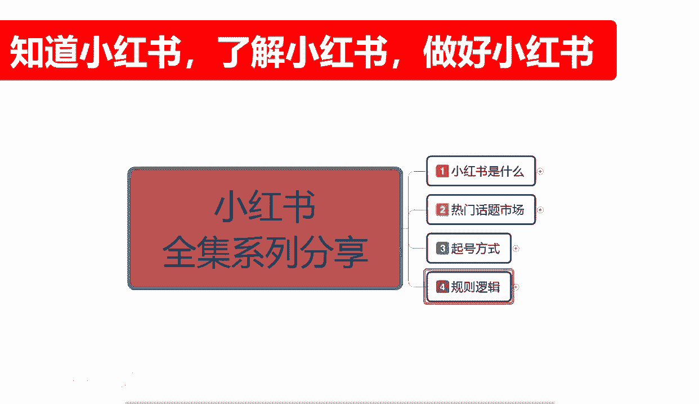
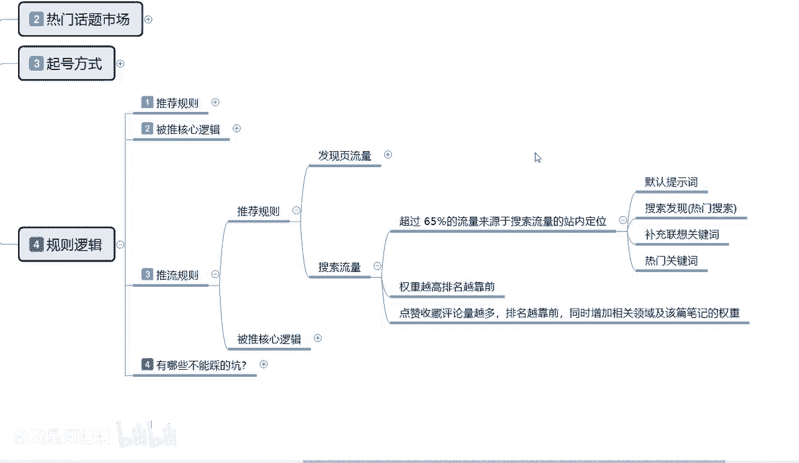
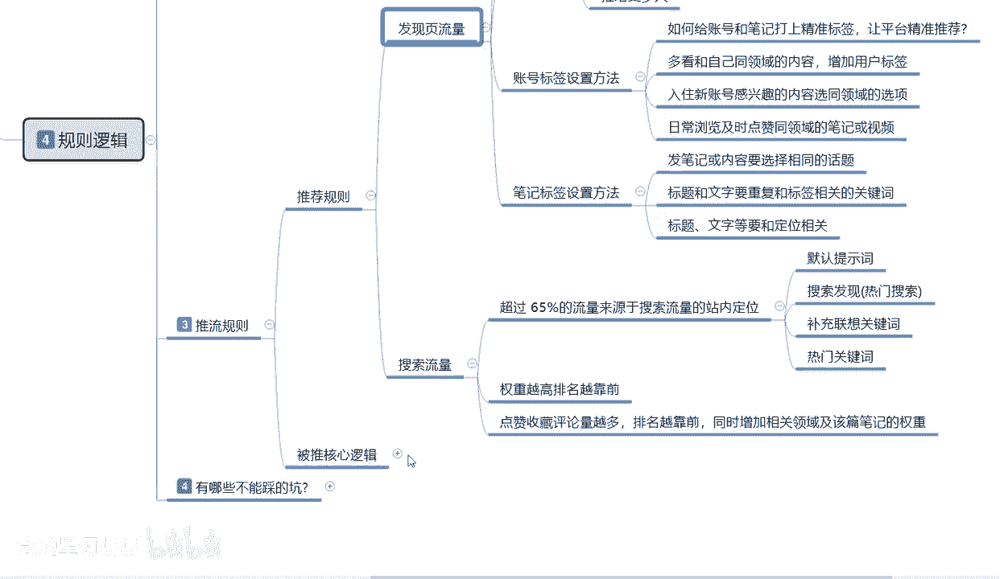
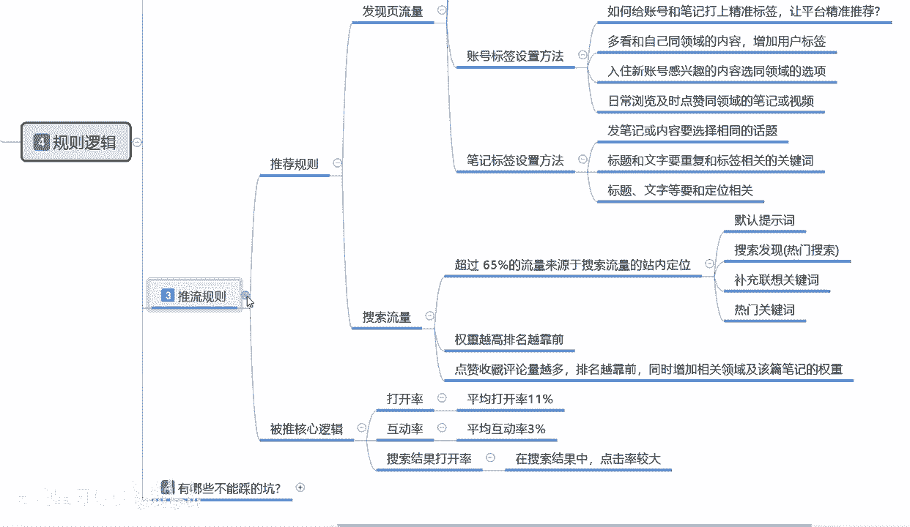
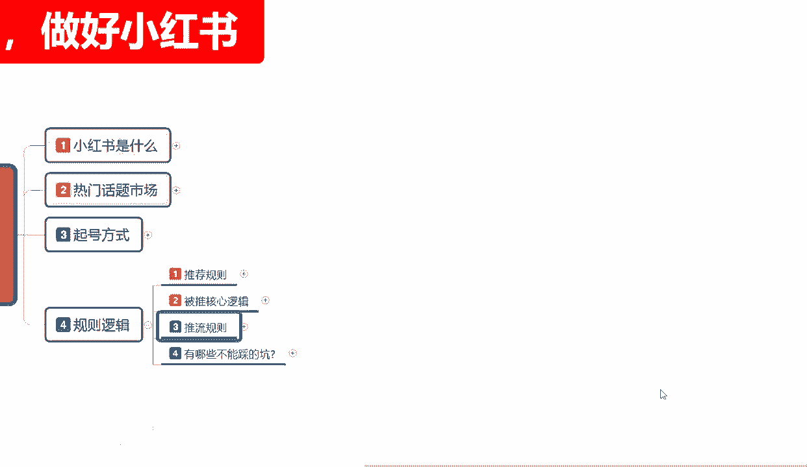

# 【2024版小红书体运营教程】全B站最良心的小红书开店运营高阶教程合集，从0开始做小红书体开店 ,起号真的快!!! - P11：p4.3推流规则 - 念晚星河漫漫 - BV1wT421Y7FM

大家好，今天给大家分享的是小红书全集系列的，第四大课时规则的逻辑。

这节课接受我们上一节的一个内容讲了，上一节的话，已经给大家把那个发现一页的一个流量，给讲完了，这一节课的话我们从搜索流量开始嗯，搜索流量的话，就是说小红书它里面的整个规则啊。

我们从发现页页流量里面看的话，它发现页的一个整体流量，是小红书推荐给我们的，就是随机性的，搜索流量的话是我们使用关键词进行搜索以后，系统通过我们关键词排序，然后推荐给我们的。

但是他这个里面有个关键词排序的一个权重，还有一个排名，他整个搜索流量的话，就是说超过65%的搜索流量来源的话，都是搜索流量的一个站内定位，就是他的整个排名系统，剩下35%的话。

就是说给新的一些小红书笔记，发放的一些固定流量，所以说我们在操作小红书整个流量系统的时候，我们了解他整个系统的时候，就说你要明白它的流量来源的话，不不一定只有啊站内的排名流量。

他还有小红书新上的一个小红书标签啊，只要有相关性的一个标关键词，他都会给你35%的流量，35%的流量，那么你在里面的话，就说占整体35%的流量，你去里面增啊，你的点击率，转换额，完播率等等，它整个系统。

然后录入了给你的展示曝光量以后的话，你就会进入这65%的一个搜索流量，站内排名啊，你排名在什么地方，他就会给你固定的一个流量推荐，就是说小红书他整个搜索流量系统里面的话，它的默认系统里面啊。

就是小红书平台默认题词，只有65%的流量是排名流量，35%的是系统推荐流量啊，就是搜索里面它也有系统推荐流量，我们小红书如果说什么都不做，但是你有匹配的一个关键词，对应他搜索的一个内容的话。

那么你就有35%的机会去展示，但是大字的排名的话，65%都是在他的账号排名和，关键词权重的一个排名，就是点击靠前的，他会优先展示，剩下的才是你默认提词的一个排名，第二个就是搜索发现热门搜索。

如果说你在热门搜索里面去搜的话，那基本上就是和你没有关系了啊，就是和我们新的一个小红书笔记没有关系了，他基本上都是全部都是站内定位的一个排名，他排名过高，怎么说呢，就是排名非常高的人，他才会优先展示。

你的排名越高，展示的几率也越大，你的排名越低，那么你就基本上没有展示，所以说我们小红书用户在发送笔记的呃，新篇章的时候，你不要觉得搜索流量跟你没有关系，其实是有关系的，只是关系不大。

他有35%的一个概率啊，你的产品，你发布的小红书他会出现在搜索流量里面，但整体来说65%，基本上都是搜索排名的一个定位，我们正常的小红书笔记发放发放以后的话，他的流量主体的话。

基本上都是来发现页的一个流量，就是小红书推荐的一个流量，但是搜索流量的话有65%的排名属性，让你去抢啊，你能抢到多少，就看你自己整体的一个小红书笔记做的怎么样，点击率的达不达标，完播率达不达标啊。

点赞互动达不达标，整体的话就说我们做小红书搜索流量的话，你补充它的一个联想关键词，一定要准知道吧，或者说是你在小红书上面我们去操作的时候，你找一些那个大词汇去弄，你也有35%的概率啊。

他给你展示数据的话，你就有额外的一个流量获得搜索流量，另一个呢就是热门关键词，就是你光搜大词还不行，你还要搜他的一个最近小红书比较火的啊，定位词和你处产品属性相关的啊。

或者说你和你发的所有小红书笔记内容相关的，你不能说是啊哪个关键词活，我做哪个关键词，我只管引流，我不管其他的，那肯定是不行的，你和你的属性不相关的话，那你关键词做上去也是没有没有任何作用的啊。

然后往后的话就是说权重越高，你的排名也就越靠前，你的权重越低，那么你的排名也就越靠后，他整个65%的流量的话，你的排名怎么说呢，就是基于了你在这65个65%，流量里面展示的机会啊。

他可能展示完第一组是50%的展示机会，第二组的话30%，第三组10%，第四组5%，第五组1%，你就去里面搏搏那个机会，看给你多少展示就是最火的，排名最靠前的，他的展示机会的话，可以占到流量比例的50%。

如果说你没达到，你只能达到百分1%，5%，10%，或者是20%这种等等的一个比例，那么你的展示机会就你可以想象一下，第一名和第最后一名，他们差距就是多少了，对不对，所以说他整个排名系统的话。

它主要的一个排名是靠什么呢，就是点赞收藏评论啊，它整体的量越多，排名越靠前，同时增加相关领域及该篇笔记的一个权重，就是你的点赞收藏评论量越多，你的排名越靠前，越你的增加的完播率啊，转发率这样的越高。

那么你该篇笔记的权重也就越高，你下篇笔记也会相应的默认给你加权，他是这种流动性的，它不是单一的啊，它是整体综合的，你有一个产品包起来，那也会给你其他后续所发的产品增加权重，如果说你一个产品都没包起来。

那么你的所有属性的话，基本上都是额正常来看，根据你的账号权重来定的话，基本上就是50到200之间好一点的话，就是200到500之间不会再多懂吗，如果说你有一个爆一个爆款笔记。

或两个爆款笔记数据多起来以后的话，那么你后续的一个技术基础的啊，就是你基础的笔记发出去以后不算爆款的，就是日常发的那种笔记发出去以后的话，它整体的流量都会比你平时要多，上接近1/3，那你爆款笔记越多。

那么你后续的一个展示，曝光量和小眼睛观看的数量也就越来越大，这是一个循环式的啊，你如果说做不到，做做不到位的话，就是你小红书笔记里的一个更新数据，你更新不上去啊，笔记内容更新不上去，笔记核心更新不上去。

点击啊，属性都上不去的话，那你就只能在你的100个小眼睛左右，到200个小眼睛左右晃荡啊，你再想把这个账号完全做好的话，那你今年累月做个一两年，你看能不能啊，有点成效。

不然的话你这个小红书确实是也没那么容易啊，往后续呢就是一个被推的一个核心逻辑。

被推的一个核心逻辑的话，说实话就是说小红书我们把数据做好以后，你达到什么样的一个标准啊，小红书平台它的一个平台运行系统，会把你的笔记推送给更多的人啊，首先第一个是打开率。

打开率的话平均打开率要在11%以上，什么叫打开率呢，就是我们小红书搜索以后的话，他不是四个产品吗，四个产品里面你在里面如果说显示了，就是给了你2000个基础报告，那么你最少要达到220的一个小眼睛数量。

他才会给你推广更到更多的人，如果说你只有1000，那么你最少达到110的小额，已经他才会帮你额外的去推流，推流里面的话就是你的小小红书笔记里面，他还有一个互动率，互动率平均达到3%啊。

互动率平均达到3%，就是100个人里面有三个人评论，或者是超过三个人评论，他才是有效的一个B级，如果说低于三个人啊，你这两个，你比方说你平均打开率超过了11%，但是没有超过太多，达到了十二十三%。

但是你的整体互动率的话只有3%以下，也就100个人，虽然说看了你的，看了你的笔记，但是没有人进去互动，你的平均互动率低于3%，100个，相信你，你连33%个人的评价都没有，那么你的还是达不到帮你进。

继续进行推广的啊目的，所以说你不光要有小眼睛，你还要有互动率啊，这是整体的，它整体的话就是说搜索结果打开率啊，在搜索结果中，点击率的话就是非常大的一个属性点，你如果说第一个基础属性都没有。

你的互动率再高也没用，你比方说你来了50个，那个49个人评价没有用的，知道吧，你的点击率不达标，所以说它两项属性你要综合达标，你才会被推啊，就是小红书平台的这个系统运行下来以后。

才会把你的皮笔记推给更多的人，不然你做再多的都是无用功的一个操作，这个呢就是小红书整体推流的一个规则。

那这节课呢就给大家讲到这，下一节课的话就是给大家介绍一下啊，小红书有哪些的一些坑不能踩啊。

