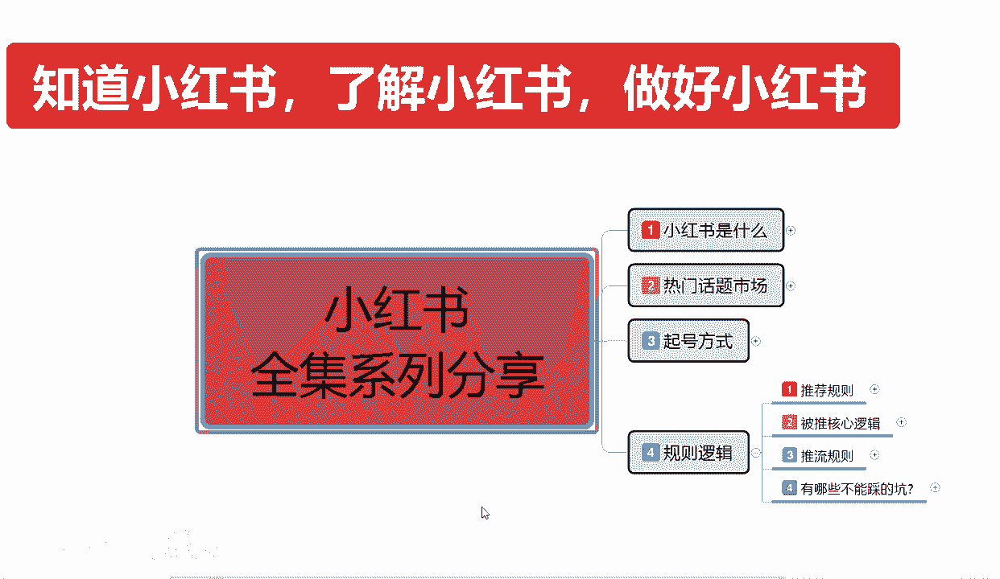
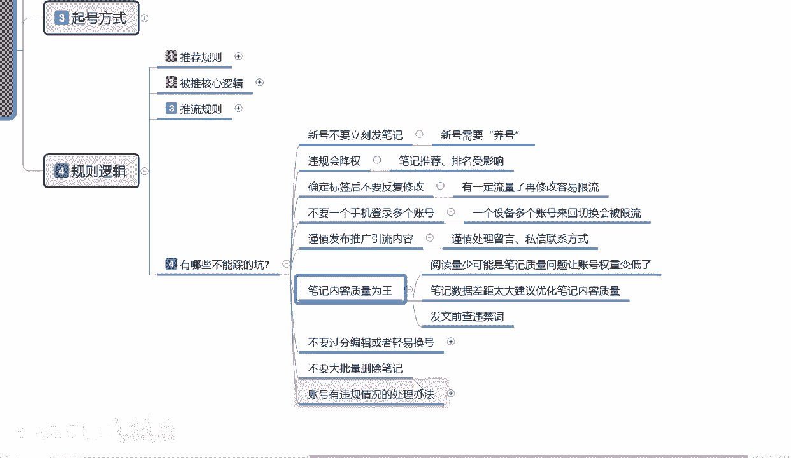
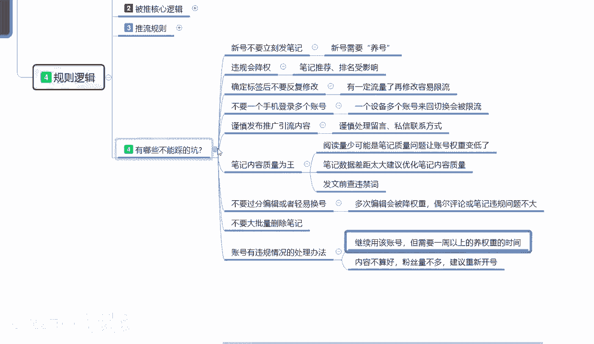
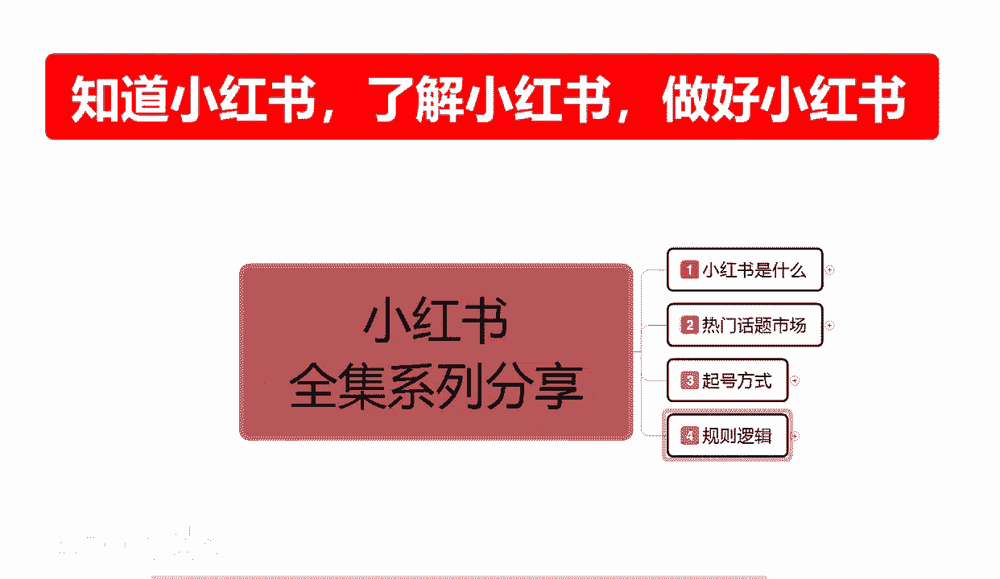

# 【2024版小红书体运营教程】全B站最良心的小红书开店运营高阶教程合集，从0开始做小红书体开店 ,起号真的快!!! - P12：p4.4推流规则 - 念晚星河漫漫 - BV1wT421Y7FM

大家好，今天给大家分享的是小红书全系列，第四大课时的第三节内容啊，主要的话是给大家讲解一下，我们这个第四大节规则逻辑里面，小红书他有哪些坑不能踩，就是我们不能去操作的一些内容呃。

主要的话就是避免新手入坑以后的话。

就是说你不知道小红书的一些具体细节啊，导致我们整个账号的话你做不起来嗯，小红书一类先坑不能踩呢，第一个就是说新号不要立刻发笔记，你新号不养号，你的笔记发出去了，你只有小红书给你固定推荐的一个内容。

你用完以后就没有了，知道吧，你新号的话，你账号全账号的一个属性没定，你账号的一个后台没设置，你账号没有基础权重，然后的话你也没有对标人群，你直接新号不养号，你直接去发笔记的话，你这个号就基本上废了。

新号需要养号再去发笔记啊，你第一篇测试笔记无所谓，但是后续的笔记你都要把自己的数据，数据做好以后再去发，知道吧，第二个啊就是违规降权，违规降权比基推荐排名，它整体受影响的话，他的属性点是降90%。

就说你如果说有小红书，他通过他的一个规则知道吧，你如果说违规了，那么你整个账号的一个权重就会降权，90%，相当于你就要重新起号，重新做啊，也不能说完全完全的你的这种的话，他有一个概率之前给大家啊。

上课的时候也讲过，你不要超过20%，超过20%的话，那基本上就好久没用了，如果说你没超过20%，你只是当偏的一个笔记，受损量达到了90%，其他的话可能会有一定的影响，但是影响的话不会太大。

你只是你当这一篇的笔记啊，基本上就像没用了啊，你酸也不是不酸，也不是你留在里面的话，只能说是留在里面稍微好一点吧，然后就是确认标签以后，不要反复的进行修改，什么标签呢，我们账号的一个人群标签。

你对应账号的一个属性标签，有一定流量了以后，我们如果说去修改的话，它容易限流，就是你改标签以后，你本来有3000粉丝，你改了标签，然后发内容发出去以后的话，你的实际账号属性和你发布的内容它不符，知道吧。

你严重的可能会违规，但是基本上的话很少出现这种状况，基本上的话就是给你限流之前给你5000展示，现在可能只给你500，或者说是1000啊，肯定不会给你一个完整的一个流量属性，如果说你修改一次。

可能是降10%到20%，修改两次就是降四次，就是说确定标签以后的，你就不要去反复修改，你在标签确定完成以后，除非你是要转行转业啊，那样的话你去修改你保留原有的数据，还有一定的作用，你如果说多次修改以后。

你修改第一次去修改，第二次修改，第三次以后，你这个账号就没用了，然后后面的就是基础的一些属性啊，不要一个手机登录多个账号，一个设备的话，多个账号来回切换被会被限流啊，这都是经过测试的，就是你主账号在这。

然后你想看一下另外一个账号的数据，拿这个手机的话呃，再继续登录，你两个账号都会被限流，不是一个啊，是你的，只要是在这个手机上面登录过的账号，都会被限流，恢复平静时间是半个月，就是半个月以后恢复正常啊。

你们考虑一下划不划算嘛对吧，谨慎发布推广引流的一个内容，就说谨慎处理留言私信的联系方式，这种方式的话，如果说你处理的多了，你在私信的话，一天超过三篇，就是你跟陌生人在小红书上面进行私信互动，超过三条啊。

第四条开始，小红书就会给你警告，连续超过两到三天的话，小红书就会判定你引流私域，直接给你封号的，那你好不容易做起来的账号，你这么疯了是吧，比如说谨慎留言处理啊，你有些东西的话在私信里面。

你可可以跟别人互动，但是你跟别人互动的时候，你留下的一些关于于文字啊，或者是数字的话，他会重点提取你里面有没有涉嫌违规，所以一定要注意啦，私信的话每天最好不要超过三条，超过三条基本上就要封号了。

然后啊笔记内容的话，说实话在这个里面笔小红书笔记内容不会啊，你内容做不好，你的虽然说是额图片的首页，就是我们图片展示的第一页和标题，它是最重要的一个属性点，但是你后续的内容你做的不到位的话。

你的点击率再高，你后续后续的话你缺乏爆发力，别人也不会关注你的啊，所以说比剧我们去制作的时候，内容一定要自做好，你内容做不好的话，那你这个笔记还不如不发对吧，你不能因为完成任务而去做笔记。

你可以把之前的笔记发的效果不错的笔记，你再重进稍微修改一下，进行进行二次发放都可以，但是说你不能说因为字赶时间问问题，把质量提不上去，那你这个笔记的话会导致你整个账号降权，懂吗，也不能说是很严重。

但是你这种笔记多了以后的话，别人会认为你的整个账号的话就是废话连篇，偶尔有那么一两篇精品的，你再去操作的话，你这个账号想起来的话不好不好做，知道吧，然后阅读少量可能是笔记质量问题，让账号权重变低啊。

就是说我刚刚说的这一点，就说你的一个质量本来不是很高的笔记，你就不要去发了，要发就发高质量的笔记，你这种低端笔记发了以后的话，他整个账号权重会变低的，多了以后的话就是垃圾账号啊，笔记数据的一个差距太大。

鉴于优化笔记的一个内容质量，什么意思呢，就是说你平常的话是100到200对吧，然后偶尔有一个笔记报了个5000，那你后续的数据的话，你基本上都要保证在150以上，就是基础笔记要有30%的涨幅。

你才能对得起你这个爆款，如果说你基础比例，连30%的涨幅都没有的话，那你后续这些笔记的话自然会下去，那你的这个爆款笔记给你的引流数据，它不会太好的，如果说你能保证保证住你自己基础笔记。

30%的一个流量增长，那你后续的笔记再爆起来的话就非常容易了，懂我意思吧，就是小红书给你机会了，你能不能抓住，你抓不住的话，那你整个账号的话权重也就那样了，知道吧，他不会再给你额外进行推流了。

你后续想再继续做的话，就要再加大力度了啊，最后一点就是发文前，后面三个点。

不要过分编辑或者说是轻易的一个换号，多次编辑会被降权处理，偶尔评论或笔记违规，问题不大，懂我意思吧，这个意思应该很明确了吧，就说多次编辑以后，你自己在你的那个属性里面进行编辑。

或者说是你发布的一个呃用户评论，你然后再进行修改之类的啊，重点筛选会被降权，偶尔评论或者说是笔记违规的话，问题是不是太大的，你不要超过20%的一个比例，你超过20%的比例就直接封号。

不超过20%的比例的话，他问题不大，是什么意思呢，就是给你降点权，你发其他的话，过个几天就恢复了，然后就是不要不要大批量的删除笔记，你比方说我现我之前的话就是无聊，在抖音，在小红书上面自己怎么说呢。

发了几篇关于我行业内容，有个两三千粉丝，然后的话我现在的话想做其他的，想在抖小红书上面啊有一定的起色，然后的话想推广一下我的产品，但是和我之前发的笔记内容不相关，我能不能把笔记删除，就不说。

尽量不要去酸放在里面，对你没什么太大影响啊，你重新去发，然后把自己的文案，把自己的账号信息改掉，他们保留在你的账号里面也是一个啊属性加权，对你有好处，就说不要尽量的话不要轻易的去算笔记。

除非你的笔记违规啊，有重大的失误，你才去酸，不然的话不要酸出笔记放里面，对你没什么影响的啊，账号有违规情况的一个处理方式啊，继续用该账号在一周以上的一个啧，怎么说呢，就是说你账号违规了。

基本上的话就是我刚刚给大家说的啊，偶尔笔记评论的话违规他问题是不大的，只要不超过20%个点，那么你的账号是可以继续使用的，但是你基本上要去养一段时间的号，就是一周以上的一个时间。

基本上都是七天到15天左右，但是正常的话，如果说你账号权重高，可能就是七天，如果说你账号权重低的话，基本上都是四五天啊，然后内存内容不算好，粉丝不算多的话，就是说建议你直接换号了，你新起个号的话。

做个三四天四五天都好，你的属性基本上就比前前面那个号要好得多，建议的话就是你把账号注销，然后重新注册一个，这样去操作的话会好很多，这个就是说小红书整个里面呃逻辑规则。

包括他整个运营系统里面我们不能踩的一些坑，你踩进去了，那你就无法自拔了啊，所以一定要注意了，我们操作的时候，有些东西能做，有些东西不能做，你要把基础的规则给了解清楚，你小红书，你真想把小红书做好的话。

那你踩坑了啊，你整个权重降低也要浪浪费多少天时间对吧，严重的给你封号，那你前期所做的一切基本上就都白费了。

你就算资料再做，你发同类的一个视频上去，就是我这个账号被封了，我大不了再重新起一个号，我再发同样的一个内容也能起来，答案是不行，因为小红书已经录入过你的一个笔记内容，和你的一个账号信息内容。

你发同样的信息上去的话，你算抄袭，你就算是原创，你也算算算是抄袭啊，你整体后续的话他数据就不好了，这个呢就是今天给大家讲的啊，规则逻辑里面的最后一课，下一节课的话给大家讲解一下，小红书的一个重点啊。

小红书笔记怎么去做啊，笔记的核心重点在什么地方。

