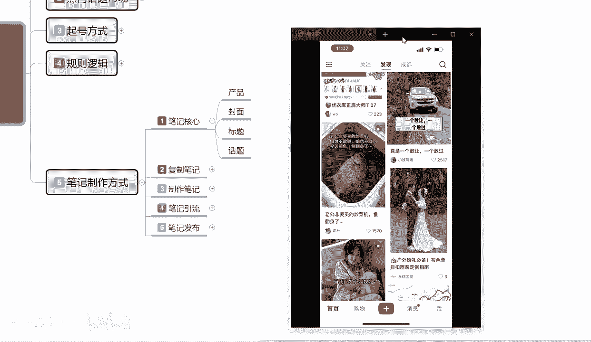

# 【2024版小红书体运营教程】全B站最良心的小红书开店运营高阶教程合集，从0开始做小红书体开店 ,起号真的快!!! - P13：p5.1笔记核心 - 念晚星河漫漫 - BV1wT421Y7FM

大家好，今天给大家分享的是小红书全系列，分享的第五大课时，也就是正式步入我们大课时的一个节奏了啊，这一节课的话主要是给大家讲解一下，我们笔记制作的一个方式，用小红书笔记制作的一个方式吧。

在小红书里面他是最重要的一个点，你小红书笔记做得好，你的账号才有用，你的小红书笔记不做的不好，你其他做什么在小红书上面你都火不起来啊，所以说小红书笔记制作方式的话，在这个里面是最重要的一个节点，当然了。

对于新手和老玩家来说的话，笔记制作方式的话，它有两种不同的一个属性划分啊，老玩老玩家的话，他可能就是全部做原创，新手的话，我们对前期小红书他整个规则不了解的话，他基本上都是去复制别人的一个东西。

然后拿过来自己用，然后再去做，那这个里面它都有一个什么样的区别，在这一次的笔记制作方式里面，我会一一给大家进行一个详细的讲解和划分，那首先我们来了解一下，了解一下啊，小红书整他整个的一个笔记制作方式。

小红书笔记制作方式，我在这里呢给大家把它分为了五个点啊，第一个就是笔记的核心是什么，第二个是复制笔记，第三个是制作笔记，第四个是笔记引流，第五个是笔记发布的一些技巧，那么首先呢我们来了解一下。

什么是小红书的一个笔记核心，其实笔记核心其实分为四个点在这里的啊，产品封面，标题和话题，我们通常的话就是说在产品里面标题也好，封面也好，话题也好，这四个点里面啊，去寻找小红书的一个整体核心，但说实话。

小红书的整体核心，如果说我们了解的时间足够长的话，其实它和我们的产品没有没关系没关系，和我们的话题有没关系没关系，小红书笔记的核心在哪里呢，就在封面和标题里面啊，这个呢这个点呢。

我是准备跟大家详细解释一下的啊，但是内容我呢因为没打出来啊，你们大家听一听就好，小红书笔记的一个整体核心的话，就是说我们打开手机的话，小红书上面会显示很多内容，不管我们怎么去搜。

他第一个展示的永远都是图片啊，就是我们不管怎么去做他，小红书打开以后展示的永远都是图片，他整个图片效果的话，就是说第一个搜索展示图片效果啊，后续通过图片或者说是它封面的一个影响啊，图片就是封面。

通过封面的影响，然后去观看你的标题才会进入你的账号，如果说是抖音的话，它每次只会显示一个产品，但是小红书的话它是显示四个产品啊。

我们在这里呢，大家可以直接自己打开自己的一个。

小红书也好，抖音也好。

我们先看抖音啊，我们抖音展示的话，就说我们去看的时候，我们先不管它的内容是什么。

我们无论他怎么去刷，怎么去看，他每次展示的都是一个产品。

就是一个内容，你不管你怎么去做，他都只有一个内容。

他不会有抢流量这种事情，他就是根据你账号所发送，发送的和我们自己所观察的一个内容去观察的，知道吧，他每次只给你推一个，你愿意看就看。

你不愿意看的话，他就没办法去看，这个就是抖音，小红书不一样啊。

小红书我们进来以后的话，它所展示的永远都是四个界面，懂我意思吧，那我们观察小红书笔记的核心，首先四个界面，第一个点是什么，他整个图片的一个效果，对不对，你四个效果如果说不好，那我不会去看。

如果说他要效果好，我才会去看，所以说小红书第一要有封面，我们基本上都是先观察后面啊，跟女朋友吵架了啊，但他要我送她回家，封面加标题也行，或者是纯封面形式也可以，这种纯封面形式图片不错。

然后第二个就是宽标题啊，标题是什么，婆婆喜欢一对象喜欢二，可能我更喜欢三，就是通过这种方式，你的图片整个效果的话，看他能不能爆懂我意思吧，就是有标题，有封面，你才是一个完整的和小红书笔记的一个核心。

如果说这两个点你做不到位，我们随便找一找啊，找个数据量不高的看这个，你觉得这种如果说我不是对这这张图片啊，就是这张图片感兴趣的话，我不会去点它进去的，知道吧，就算他效果图片拍摄的不错。

看一下他小眼镜三个，这是刚发布的没多久，他只有一个技术权重进行发布的，而且这个里面的话他还是开店的，他在小红书上面开店的，他这里面有一个赞助，他进行了一个推流，不然我连看都看不见他，它不会显示在我这。

它也属于服装一类的一个产品。

看见没有，他在小红书笔上面开店。

但是他这个笔记的话，他是花钱了，他不花钱的话。

他他这个他这个笔记我都看不见，花完钱以后的话，他的整体关注都只有3000多，粉丝只有4000多点赞，一收藏都只有2万多。

说实话这个店做的真不怎么样啊，个人评价啊，大家不要不要在意。

真实做的不怎么样，他整体数据他也不高啊，我们不管怎么去看，我们第一印象永远都是封面和标题，你像这种标题，说实话对比刚刚那个好，而且要好得多啊，而且他这个标题使用的话也是引导性非常强的。

现实版的云南虫谷啊，到底有多可怕，就是给了你满足的好奇心，然后给一些恐怖或者说是比较虚幻的图片给你，他的效果都比刚刚的刚刚这个要好得多吧，对不对，我又不结婚，我又不干啥，我不会去观察阵容，懂吧，当然了。

这种的话他对特定人群吸引力比较大，对我这种就基本上没什么吸引力了，因为我的重点不在他这，好吧，这个呢就是小红书和抖音的一个区别。

那小红书核心笔记的话就是封面和标题，我们只要做到把封面做好了，标题做好了，那你就有基础的一个点击和曝光，你这两个点做不好，那你后续的话也没有用，就像刚刚我们看的那个有产品又怎么样，对不对。

有话题又怎么样，对不对，我连你封面和标题都不过关，我对你的这个东西内容不感兴趣，我为什么要进去看你啊，他抱不起来，他想做好都不行，而且他那个还是花钱的啊，进行了一波推流的。

要么就是他把那个每日任务任务完成了以后，系统给他推荐的，但我个人感觉啊他是花了钱进行了一个推广，那个有些东西我没办法去查啊，但是我只能根据他整个账号的一个数据或权重，去进行分析。

也就是说我们笔记的核心是什么，就是封面加标题，封面加标题，它等于展示和点击，就是产品爆款的一个必备提交，你如果说没有这两个点的话，那产品你想把它做爆的话，你都做不报，那第二个点是什么呢。

话题才加产品引导，它等于用户购买，才是你的产品价值的一个展示啊，产品和话题它是有作用的，只是它的作用的话，不在于我们笔记核心的最重要的一个点，笔记核心封面占80%，标题占20%，然后是产品和话题。

产品和话题，它主要的话就是产生你的产品价值点，你想在小红书上面赚钱，你就需要靠产品和话题去做引导，懂我意思吧，就是说我们需要整体结合，才可以做到我们的一个分享或者店铺，你如果说想把小红书账号做好啊。

你把封面和标题做好，把内容稍微啊做的差不多就行，如果说你想在小红书上赚钱，那你的封面标题话题和产品一个不能少，你想做网红，做三这三个点就行，你想做引流，做这两个点就行啊，就看我们自己怎么去选懂吧。

你想卖产品，又想做网红，又想做商品，那你四个点都要做，缺一不可，这个就是小红书笔记，它整体的一个核心，你核心做好了啊，你后续才好，你核心做不好，那你后续做什么都是白费，他的整个核心笔记的话，我们说实话。

你可以把它划分为一个流量计算公式，流量计算公式是等于什么呢，等于看到加点击，先看见再点击点击是等于什么呢，等于封面加标题，你的封面好了，对标题好了，我才会去点击，那看到他是什么呢。

第一波推流之后就是小红书系统，整体给我们推流之后，你才会有展示，有展示以后才会看到你的封面和标题，看见你的封面标题点击进去以后，他就是你的整体流量计算公式，额爆款的基础，第一要义的话，其实就是封面图。

平台给予你账号的一个基础权重，我们拿1000个基础曝光啊，1000个基础曝光为基础流量的话，1000个基础展示的话，你点击几率大于13%，就是1300个小眼睛互动率超过3%，他就可能会给你推1200。

1500或者是2000，他看你整体点击和互动的一个效率，来进行二次推广，如果说你都没有达到，那他就一次性推流1000个展示，用完了就用完了就没有了啊，这个就是小红书整个系统。

那这个里面最重要的点就是封面和标题，你有这两个点，你才能往后续发展，你没有这两个点，你后续发展做不了了好吧，这个呢就是小红书整体的一个笔记核心，那这一课呢分享就给大家分享到这。

下一节开始呢先教大家啊做父子笔记，父子笔记他比较适用于新人啊，对于小红书不太熟悉的人，我们嗯这些朋友，我们去操作小红书上面的一些复制笔记，内容会简单一点啊，如果说你做过一段时间的话。

你到时候直接可以去啊，跳过复制笔记内容去观察，制作笔记需求是我们自己怎么把笔记做好好吧。

