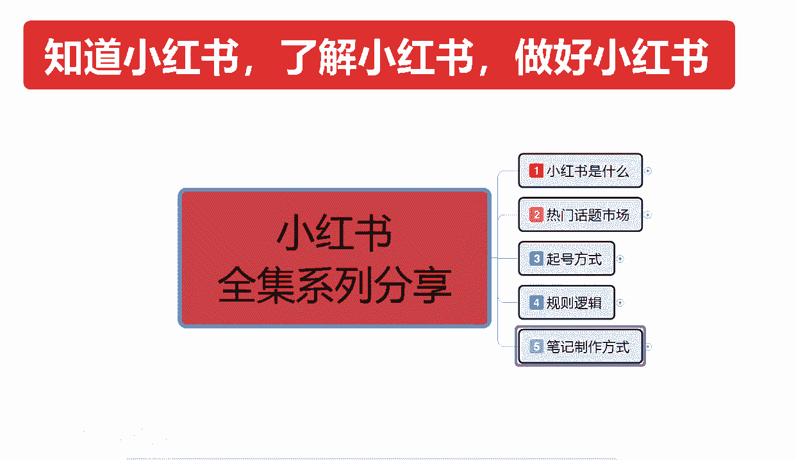
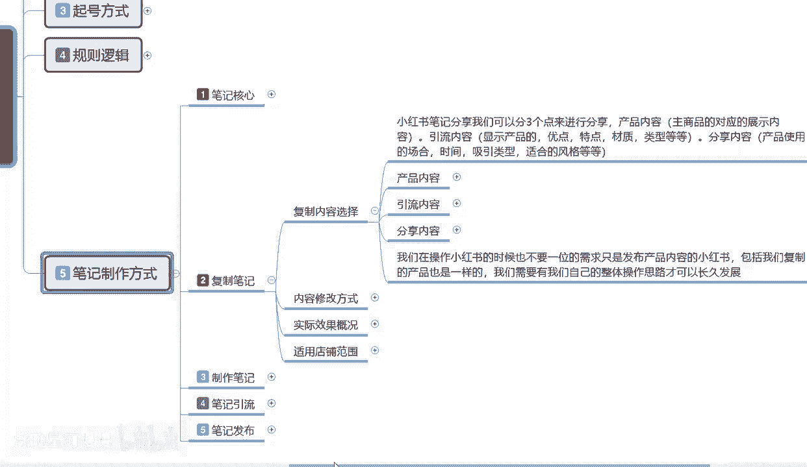
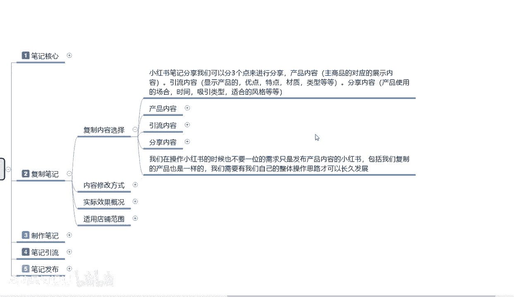
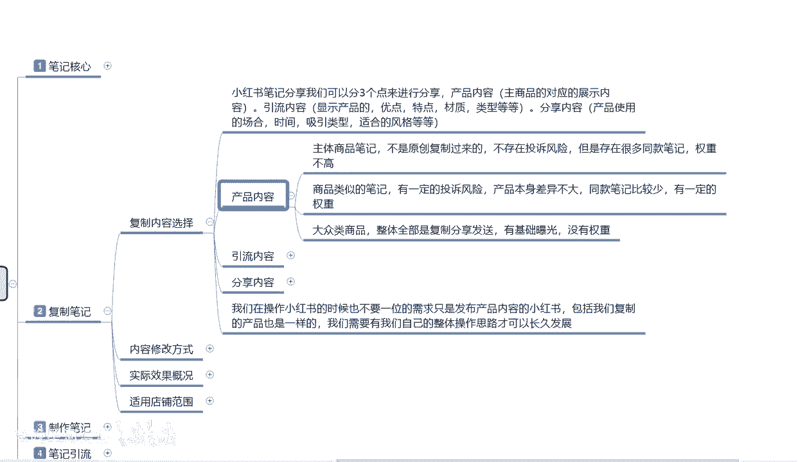

# 【2024版小红书体运营教程】全B站最良心的小红书开店运营高阶教程合集，从0开始做小红书体开店 ,起号真的快!!! - P14：p6.1复制笔记 - 念晚星河漫漫 - BV1wT421Y7FM

大家好，今天给大家分享的是小红书全集系列，第五大课时笔记制作结构方式，这节课的话开始呢，主要先给大家把那个父子笔记的内容，给大家进行一下讲解。

废话不多说啊，直接进入我们的一个课程正题，小红书笔记里面父子笔记它是什么呢，啊，我们首先来了解一下父子笔记的话，其实把它分为四个点，方面的话解释会更详细一点，首先第一个就是复制内容的一个选项。

就是我复制别人的笔记，我应该选选择什么样的一个内容，第二个是内容修改的一个方式啊，选择以后我把这个笔记要不要做修改，修改以后对我有什么样的一个帮助，如果说不修改它又是什么样子。

第三个就是说啊他整体复制笔记以后，我们得到的一个实际效果概况，最后一个就是复制笔记，它适用于的一个店铺范围啊，你做做店也好，做网红也好，做博主也好，他都有一个范围的啊，就是你复制过来的笔记。

它到底适不适用于我，好吧，首先我们来了解一下复制笔记选项的一个内容。

首先呢我们了解复制选项内容，小红书笔记的话，分享我们可以把它分为三个点位额观看啊，就是说三个这三个点是哪三个点呢，第一个是产品内容，产品内容，它主要针对的是商品对应的展示内容啊，第二个是引流内容。

显示产品的优点特点，材质类型等等，分享内容啊，产品使用的场合，时间，吸引类型风格等等啊，我把它分为了三个板块，就说你在小红书上面，你做电也可以啊，你不做电影也行，你想当网红也行，你做引流也可以。

他都可以分为三个内容去进行划分，如果说你做引流也好啊，你做博主也好，那你没有固定的小红书店店铺啊，小红书店铺如果说你要做嗯，这里给提醒大家一点，你要做网红也好，做博主也好，你最好是开一个小红书店。

他给你加权重，你不开的话，我们正常发的话也行，只是说权重会稍微低那么一点啊，这点权重看你自己要不要，基本上有10%到20%左右的一个啊，曝光权重加成好吧，你觉得你自己有个2万粉，5万粉，10万粉啊。

不差那20%，那就不用做是吧，你开个店以后和不开店，他基本上就有接近20%了，因为你在小红书上面开店以后，你是需要给小红书交钱的对吧，你对小红书信任，小红书还不信任你，你不信任他，他都不信任你。

他怎么给你加权是吧，这是基础最终基础点啊，那我这节课的话，就从额完全体的一个账号信息来操作啊，我就说我做网红也好，做博主也好，我基本上我在小红书上面我都要开个店，为什么给我加权，我也花不了多少钱对吧。

无非就是一个保证金，然后的话偶尔发一篇笔记就行啊，20%的权重属性不低了，那首先我们来了解一下产品内容的一个。

三个选项啊，先了解一下产品内容，产品内容就是说主体上面的一个笔记，就是我在小红书上面，我不管是开店也好，做网红也好，做博主也好，我先开了一个店啊，开店以后它里面的主体笔记啊，不是原创，就是复制过来的。

它不存在投诉风险，但是存在很多同款笔记权重不高，就说因为这个这节课主要是给大家讲解，父子笔记的一个内容，就是我把别人店铺里面，就我自己开了个店啊，我把别人的产品拿过来复制，复制发到我自己的产品里面去。

就是说额这种的话，主体笔记他不是原创的，复制过来不存在投诉风险，什么意思呢，就是嗯这个笔记你在拿过来的时候，你不管是有产品也好，没产品也好，你拿过来的时候，他基本上就是通用的，懂不懂什么叫通用。

他的产品除非是他自己原创的，他才可以投诉你，他不是原创的，他也是从别人那里拿的，然后网上有很多这种同类型的一个产品，比方说1688拼多多对吧，抖音啊，唯品会等等这些平台做一件代发的，我把他的产品拿过来。

他会给我提供图片，提供资料，我拿这些图片的话，做图片，做文案，去小红书上发，然后这个小这个小红书的整体产品的话，就说因为我发的比较早，你可我，然后我们现在来的发的比较迟，我去把他的小红书笔记复制过来。

发放到我的店铺进行发推广，我不会遭到投诉，因为他自己也不是原创，他也没投诉资格，所以说他不存在投诉风险，但是呢它这个里面有一个权重分流，存在很多同款笔记，权重的话，它整体就不高，别人可能有5000到。

你这可能只有两百一百五十或者更低啊，就是主体商品的一个笔记，你直接去把人家的复制过来的话，就是这种效果，如果说你有一定的修改的话，那么数据量可能会增长个30%，到40%。

商品类似的一个笔记有一定的投投诉风险啊，就是说我自己找了一个产品，然后的话我去找这个产品的类似的一个内容啊，因为网上同类的一个产品数量的话，在这个地方摆着和我产品差不多，但是我自己呢又做不好笔记。

我去把别人的一个笔记复制过来以后啊，进行了小范围的一个修改，或者说是不修改，直接答确，直接在这个里面，我把它内容稍微改一下，然后改成我的一个笔记内容，我就去发发送推广，那他的话是存在一定投诉风险的。

你没做火，还好，只要一爆已被投诉，那你的这篇笔记就被下架了，同类的，如果说你发的是商品笔记，那你这个产品都有可能会被下架啊，就是说产品本身差异不大的情况下，同款笔记比较少，他是有权重的，整体来说的话。

你可以达到对方50%，到60%的一个权重量，就你比方说他的笔记报了2万，你把它复制过来，没遭到投诉的话，那么你可能就会有1万11万2的一个浏览量，懂我意思吧，就是大众类的商品啊。

整体基本上全部都是复制类，分享发送与技术曝光，没有权重的那种，你就不去考虑了，我们要做的话，就是找类似的一个比喻去操作比较好啊，这是产品内容，当然他是发商品笔记啊，他不是发引流和分享内容的引流和分享。

他是单独的一个额方式，它这个里面的话产品内容只是针对产品啊，你不要拿产品内容去做引流笔记和分享笔记啊，你要是拿产品内容做引流笔记和分享内容，笔记的话，你这整个整个账号数据链就崩了，知道吧，很容易被投诉。

因为他的一个引流内容也好，分享内容也好，他都是在系统推荐里面，系统推荐里面别人只要一看见你的相同的嗯，那些闲的蛋疼，没事的就给你投诉了，如果说你是在产品内容里面发的一个笔记的话，小红书系统默认的。

它不会把你两个相同的产品放到一个界面里面，让他去投诉，懂我意思吧，你就可以很大在很大的一个程度上面，避免啊被别人投诉抄袭模仿，懂我意思吧，你就说不要拿产品内容去发，引流笔记和分享笔记的内容啊。

你那么做就是无意和自杀没有什么区别，这个呢就是产品内容的一个主体，好吧，那这一节分享呢就给大家分享到这，下一节的话给大家分享一下啊，引流内容我们怎么去操作，这个笔记的话，说实话小红书笔记的话。

我们把它分为分为三个点啊，做商品的啊，做小红书引流的啊，想做博主的，你可以这么分，或者说是第二种分法啊，我三个都想做，我店铺里面有产品，我又想做引流，引到别处的地方，我又想做网红，他们其实，怎么说呢。

就是他们不冲突啊，你做店铺也好，做店铺，你发产品内容也好，你在里面也要发引流内容和分享内容，你做网红也好啊，你也要附带少量的产品内容，你做分享内容，就是想做网红，做博主也好。

你在里面也要附带引流内容和产品内容，它们它们是一个整体，你不要把他们完全分开了啊，这个点的话啊，是提醒你们小红书的整个发放形式，它是三个点，它不是一个点啊，渠道不一样，来的流量的一个方式他也是不一样的。

好吧。

