# 【2024版小红书体运营教程】全B站最良心的小红书开店运营高阶教程合集，从0开始做小红书体开店 ,起号真的快!!! - P15：p6.2复制笔记 - 念晚星河漫漫 - BV1wT421Y7FM

大家好，今天给大家分享的是小红书系列全集，的一个分享，第五大课时笔记制作的一个方式，这节课啊接着呃接着讲，我们上节课没有讲完的一个内容啊。

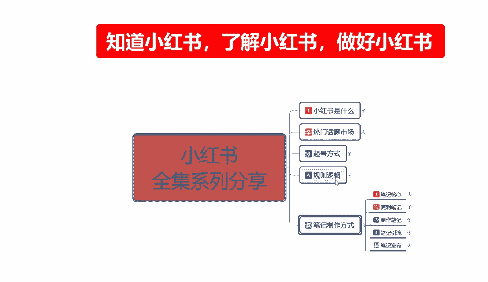

父子笔记的一个内容复制笔记啊，上节课给大家把产品的内容选项，给大家讲解了一下，这个呢是专门做怎么说呢，就是我们做店铺的时候，你商品的一个产品内容怎么去发布啊。

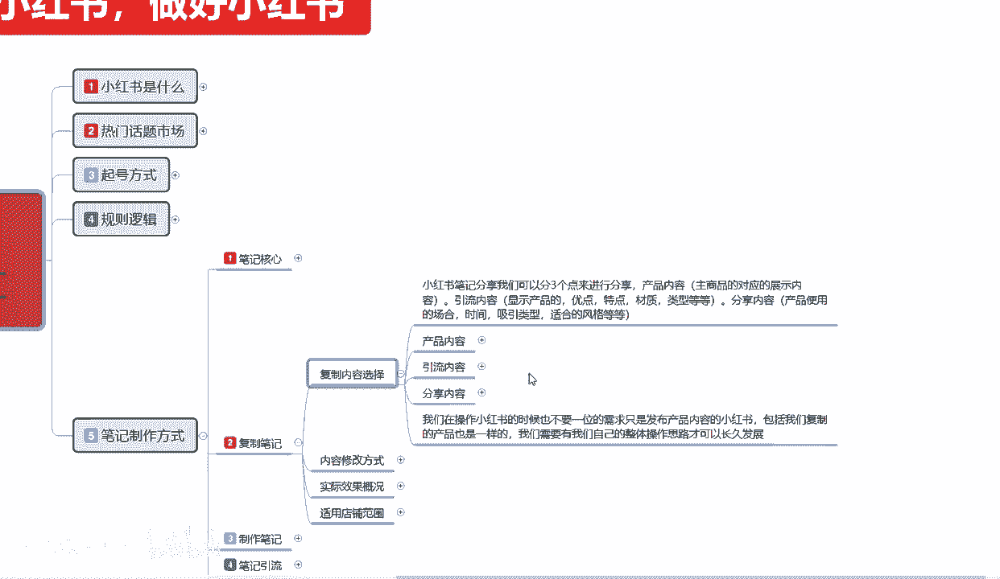

都有一些什么选项额，引流内容的话，他其实和也是用来适合做店铺啊，你做商品也可以做引流，也可以做内容分享也可以，他都是要用到的嗯，整体的话就是说它三个模式，产品内容也好，引流内容也好，分享内容也好。

它是对应的三个渠道，我们要把这三个渠道弄清楚，你才能去正常的发布我们小红书的一个笔记，如果说你在没有弄清楚，请三个渠道啊所对应的一个流量的话，我们去操作这个笔记复制啊，你不管是去复制的别人笔记也好。

制作的笔记也好，他都不好操作的啊，引流内容这方面的话，其实父子笔记所选的内容他不一定需要整体啊，就是说必须包括我们所卖的一个产品，小红书，它整个平台系统呢它是一个种草平台，我们在有产品的时候。

也需要发布相关的产品引流啊，就是我有产品，我们的一个推荐的一个引流内容，也是要进行发布的，它不一定只需要你发布产品的一个笔记，你发布产品笔记它只在搜索里面有作用，它在推荐流量里面是没有作用的。

你比方说我上传产品以后的话，我然后没有做引流内容，我的一个整体权重的话，基本上就相当于是没有，他在那个搜索渠道里面，有65%的一个关键词排名，还有35%是推荐排名，那我们如果说不做引流内容。

直接做产品内容的话，那你只有35%的搜索引擎里面的，一个推荐流量，那这个里面的推荐流量，你想一想它的一个基数是多少啊，也就是说我们不管你是做产品也好，不做产品也好，这个引流内容你是必须要去做的。

所以说引流内容对产品进行整体的一个介绍，包括这些产品的一个优点，对其无限放大，只是说做引流内容和产品内容不一样，产品内容的话，你是针对商品进行发布的一个产品，你比方说我的店铺啊。

上新了一些新的一个呃服装的产品，饰品的一个产品，食品的一个产品等等啊，他这个是只属于产品内容，引流内容的话，只说我们把他的方向调整一下啊，吸引大量的访客进入我们的一个账号。

通过了解我们账号整体是做什么的，然后再引流到我们的一个产品内容里面去，然后他看产品内容的笔记，然后才会进我们店进行购买啊，他是通过这种方式去操作的，如果说你直接去做产品内容，那是没有效果的。

所以说必须得先做引流内容才可以啊，当然了，产品内容也不能缺少引流内容的话啊，他从分享从特点开始，一直到材质结束啊，这个是什么意思呢。

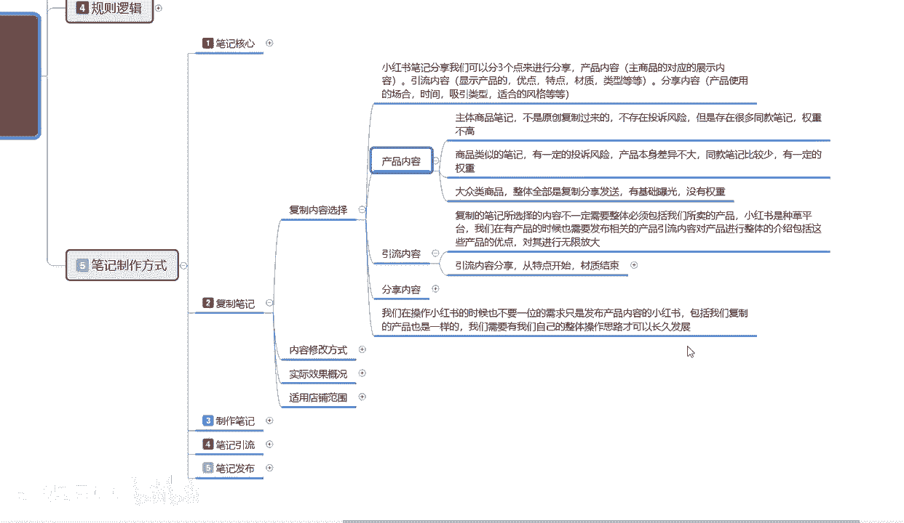

啊我给大家看一下啊，就说引流内容我们需要操作的几个重点，第一个是特点，第二个是优点，第三个是缺点，第四个是类型，第五个是才子，就是整体介绍我商品的一个属性，也可以说是对商品的一个宣传啊。

你的优点在什么地方，缺点在什么地方啊，特点是是突出了哪个方面的一个重点。

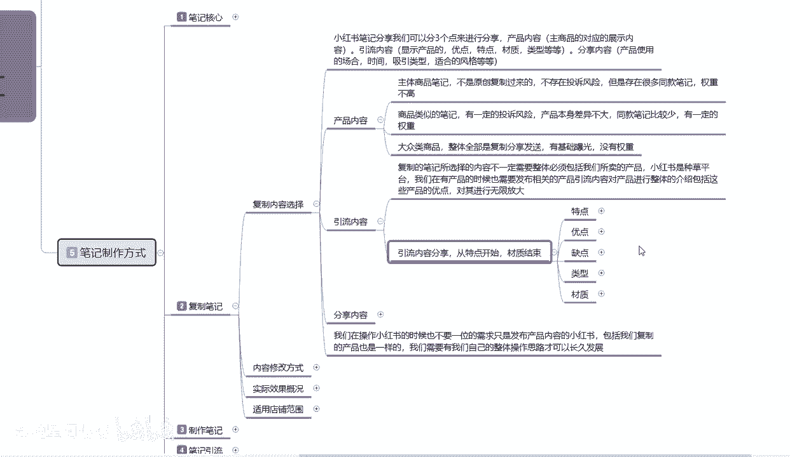

进行了一个讲解，这个呢就是我们上啊复制产品。

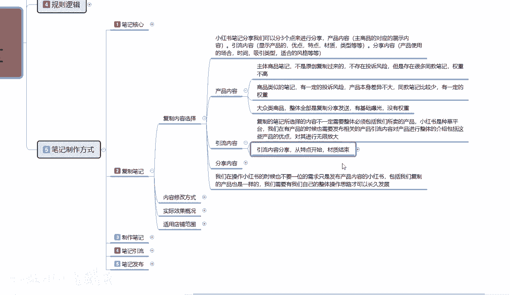

你也要去选择他的一个引流内容的一个方式啊。

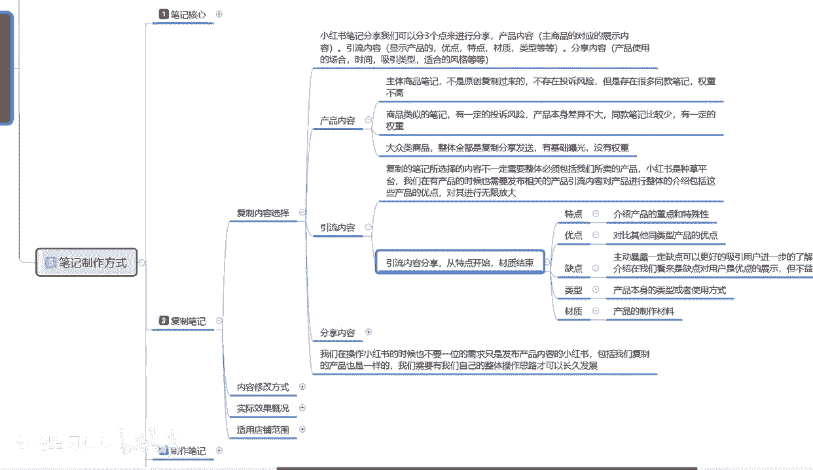

你不不能说是我，我这个本来就是冲别人的复制来的，我只需要做我的商品内容就行了，肯定是不行的，你去复制的一个内容，你也要保证这几个特点，当然你制作的时候，你更不能缺少这几个特点啊。

特点介绍产品的一个重点和特殊性优点，对比其他同类产品的一个优点啊，缺点呢就是主动暴露一定缺点，可以更好的吸引供用户，进行进一步了解产品本身，同时呢提高我们和用户之间的一个相互信任感。

你做引流模式也是一样的，你做网红也是一样的，懂吗，就是说你自身的缺点，你不能说是你把他屏蔽掉，你要正视认可自己的一个缺点，然后把自己的优点放大就行，把缺点呢尽量往小小的个方面去减少啊。

或者说你也可以反向操作啊，介绍怎么说呢，在我们看来，缺点对用户的话是优点，进行这个方面的一个展示，就是说我觉得我的缺点是我产品的缺点，但是其实这个缺点对产品本身来说它是优点啊。

就是反方向的一个介绍模式啊，啧怎么说呢，但是他这个整整个里面的话，就是说不利于过度夸大啊，你如果说做的太夸张了以后的话，你会起到反面的一个整体效果，所以说我们在介绍缺点的时候。

你还是实事求是一点比较好啊，第四个呢就是类型产品本身的类型，或者说是产品本身的一个使用方式，也就是额因为我给大家上课进行分享的时候，我不介意，不介于是讲某一个产品，所以说你产品本身你说服装谁都会穿对吧。

但是你有时候有时候你来个玩具，来个拼拼图，来个积木，你不行的话，你来个家具类的那个哎嗯收收纳架，对不对，鞋柜鞋架组装啊，文章怎么组装等等，他这在这个里面的话，他是不限的啊，所以说我们在介绍的时候。

你要把产品的本身类型和使用方式介绍给用户，当然了，这些都是从别人那复制过来的，你自己没有，自己也不会做，你就去找同类的去搜索就行了啊，它都是有的，因为小红书整个系统的话。

你不要小看它的那个后台系统还是非常强大的，如果说你实在是在小红书上，找不到你同类产品的一个介绍，那你就去淘宝去拼多多，去你的货源产地去找他也是有的，最后就是介绍产品的一个材质。

因为产品材质你介绍完完整的话啊，对你是有好处的，因为有些人他对某些东西他过敏啊，一定要介绍清楚，你真的别人买了你的东西，对你比较信任了，来个过敏过敏性反应，把你告，你还不好说什么对吧。

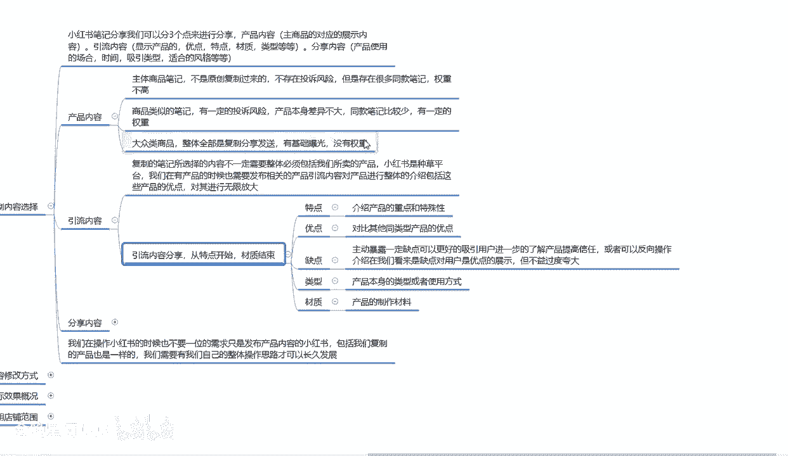

所以说材质的一个选项属性还是比较重要的，我们大家需要考虑一下，第三个点呢就是分享内容。

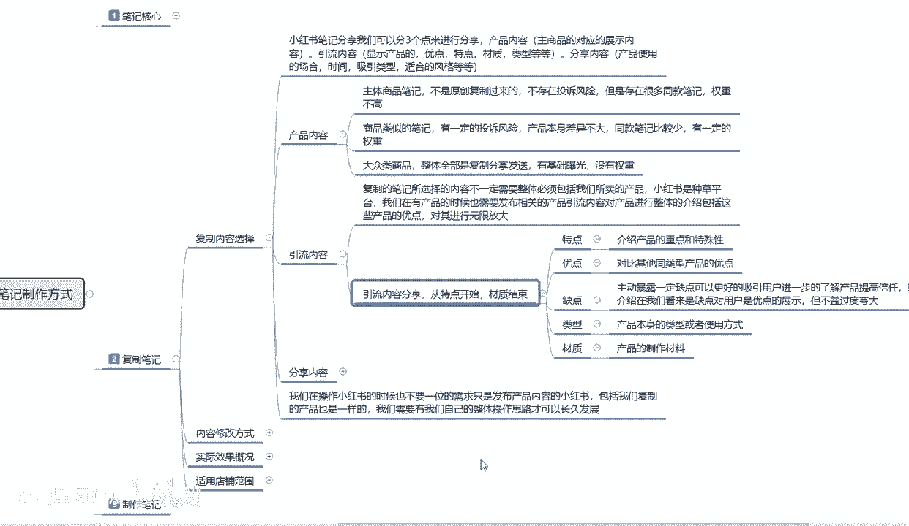

分享内容的话，说实话啊，他是和引流内容差不多，只是说他着重点不一样啊，我们引流内容你要做的就是特点，优点，缺点类型和材质的一个介绍，那分享内容就不一样了啊，分享内容它对应的我们是对应商品的使用的。

整体时间，第一个场合时间和吸引类型，包括我们产品的一个风格和模式，这个就是整个的复制内容选项，我们选的时候啊，你要分三步去找。

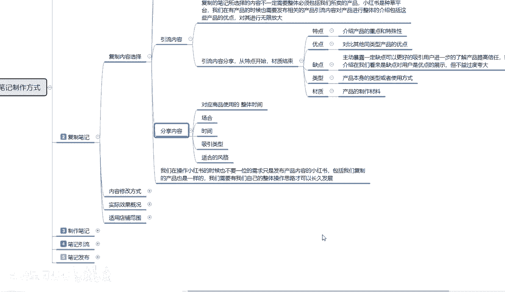

你不能说我光复制产品不行，我光自复制引流内容也不行，我还要复制分享内容，这三个合起来啊，你才能做到一个小红书完整的店铺，你包括复制的也是一样，你包括制作的也是一样啊，你都要把三个点，就是三个流量渠道。

你要把它占满，你不占满的话，那你动不动就相当于给自己来一刀，你的流量曝光，你做不起来，你就想做个网红，你也做不了，你想做引流，你也做不了，那你就更别提做产品了，懂吗，在小红书上面我们要操作的时候。

第一个是先把账号的权重提起来，第二个是把流量粉丝引进来，第三个才是做产品顺序，不能弄反了啊，所以说我们在操作小红书的时候，也不要一味的需求，只是说发布产品内容的一个小红书笔记。

包括我们复制的产品也是一样的啊，我们需要有自己的整体操作思路，才可以长久的发展，你如果说没有整体的操作思路的话，你就算是复制你新手入门，进入了我们这个小红书的这个行业啊，想去在里面做宣传，做推广啊。

但是我不知道怎么做，你去把别人的东西复制过来了以后，你也不能抛开这三个点，产品内容，引流内容和分享内容，他们三个点的介绍是不一样的，你一定要做到十全十美，你才能把你的店铺做起来，好吧。

那这一节的一个复制内容选项给大家讲完了。

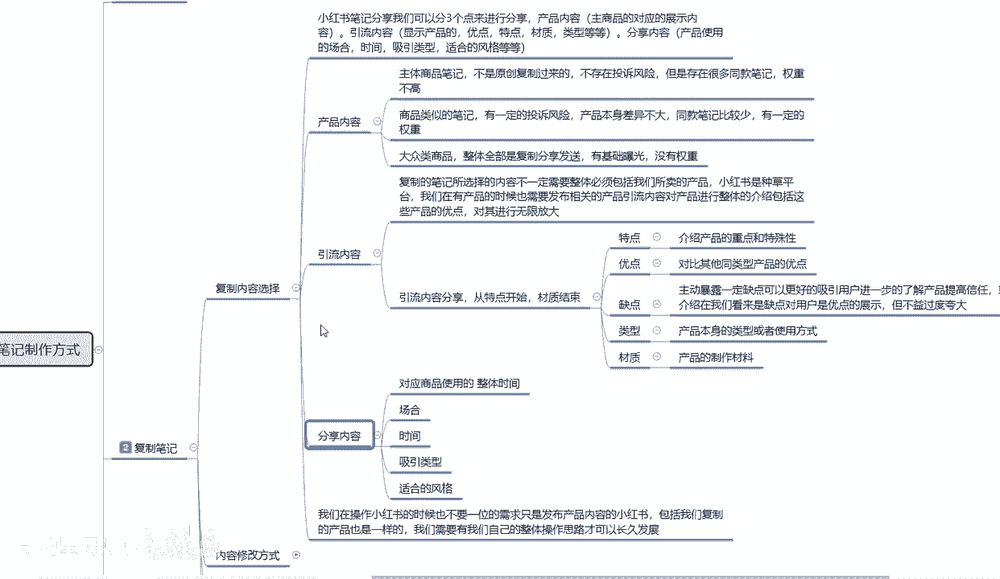

下一节课的话，给大家讲解一下复制内容修改方式，为什么，因为你把别人的产品复制过来以后的话，你完全上新的话，之前给大家说过没有太大的权重，所以说我们在这个里面的话，要进行一定的修改啊。

他的修改方式也是比较简单的。

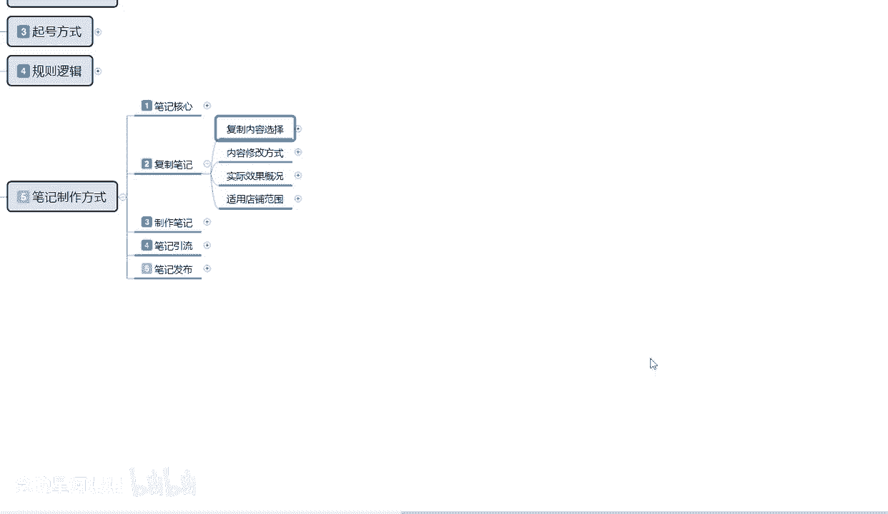