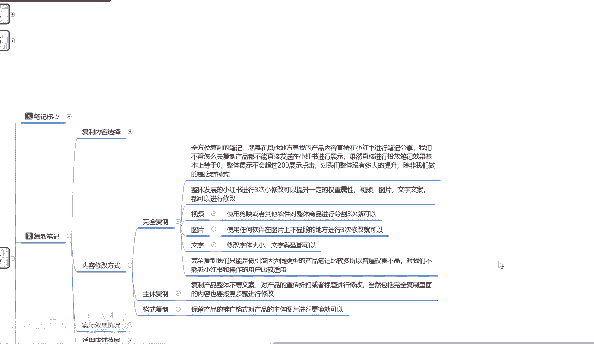

# 【2024版小红书体运营教程】全B站最良心的小红书开店运营高阶教程合集，从0开始做小红书体开店 ,起号真的快!!! - P16：p6.3复制笔记 - 念晚星河漫漫 - BV1wT421Y7FM

大家好，这一节呢，我给大家分享的是小红书全系列，的第五大课时啊，父子笔记的内容修改方式。

我们首先上节课呢是给大家讲解了，我们整个父子笔记，他所选的一个三个内容，我们所需要复制的三个内容选项啊，你一件商品也好，两件商品也好，他都是三件商，三个笔记起铺字，你就是要把它对应的内容全部复制下来。

才可以的啊，选一个是不行的，那我们内容选好以后的话，他有一个修改方式啊，在这修改方式之前呢，我先给大家先介绍一下啊，复制模式，他这个里面分为三个步骤，第一个是完全体复制。

就是把别人的东西原抄原的直接拿过来，我使用就行了，第二个是主体父子，就是他的方式格式和他的整个规划哎，对我启发比较大，我把它复制过来，然后把我的产品放上去，复制它的主体啊，包括介绍方式啊等等。

但是产品是我自己的，第三个就是把他的格式啊，怎么介绍的，怎么推文的啊，图片背景等等这些格式复制复制过来啊，但是其他东西都是我自己编辑的，这三种模式就是一个完全体，一个主体和一个格式。

父子完全体复制就百分之百复制了，主体复制的话，你相当于复制了别人70%的内容格式，复制的话，你说实话你只复制了别人30%的内容，就看你们自己怎么去选啊。

他们所对应的内容的话比例也是不一样的。

我们先来了解一下什么是完全体父子啊，完全体全方位复制笔记，就是在其他地方寻找的一个产品内容，直接在小红书上面进行笔记分享，我们不管怎么去复制产品，都不能直接去在小红书进行展示和发送，懂我意思吧。

就是说你把别人的全部弄过来以后，你怎么都要修改一下，你只是修改的幅度不大，不然的话你直接进行投放的话，小红书笔记它会把你小红书整个系统，它会把你的笔记给屏蔽掉啊，屏蔽掉的话，你那你这个笔记放出去的话。

基本上就等于零，你如果说按照这种模式去做的话，他整体就基本上不会展示超过，就是一个商品的话，展示量不会超过1000，然后展示的一个数据，点击量的话不会超过200啊。

就是小眼睛你不会获得200以上的小眼睛，对我们整体的话，说实说实话没有多大的一个提升啊，除非你是做店群模式的，你做店群的话，按照这种模式可以每天无限发布产品，无限发布笔记啊，引进来一个不懂的。

要引进来一个不懂的做成交，按这种模式的话，你可以做完全体复制，不然的话你怎么都要去修改一下的，它整体修改的话是怎么怎么个修改改方式呢，就说整体发展的小红书，进行三次小修改就可以了。

小修改的话它可以提升你的额，就是你把别人的产品弄过来以后，你用视频，你把它随便分三个阶段啊，剪辑把它剪三个阶段，然后再把它合成再发上去，它就是一个完整的新的视频啊，只是说他的重复率比较高。

同类型的产品比较多啊，有一定的权重，但权重属性没那么高而已，有一个好处就是它不会直接被系统屏蔽啊，就这一个点，然后的话他这个里面的视频是这么做，图片也是一样的，图片你在上面你拿个呃修修改器。

把图片修改器放大以后，你随便拿个白色的笔或者是黑色的笔，你按照他的背景，你在上面随便找三个地方，点三个不起眼的小点，他也是修改图片啊，这样的做的方式的话，就是避免小红书平台直接把你的笔记给屏蔽掉。

让你获得一部分的流量，就是你做电权，或者说其他的一种大范围的引流模式的话，按照这种方式你去操作，他会给你留，会给你基础展基础的1000展示，包括接近50到200个之间的一个小眼睛，如果说你不做的话。

那你一个小眼睛都没有啊，文字文案也是一样的，你把字体啊，把颜色啊之类的改一改就可以了，方式都是很简单的啊，嗯这边呢就不跟大家多说了啊，就说这方式呢我已经给大家列了啊，视频图片文字三个啊。

随便修改一下就行，就是说完全完全体复制的话，我们只能做引流，因为它整个同类型的一个产品笔记的话比较多，所以普遍的话他整体权重是不高的，对我们不熟悉小红书和呃小红书超重，对电商不了解的人啊。

你去做这个的话，或多或少会给你店铺增加权重，当你把整个流程熟悉了以后的话，你再慢慢的把你的账号信进行修改和排版，排版以后，然后自自己做笔记去发布，效果也是不错的，你前期你不懂，你就只能去复制。

当你复制的多了，你慢慢的也懂得自己该怎么去做笔记了啊，这个方式技巧还是比较简单的。

这里面一个主体负责的话，就说嗯负责产品整体啊，不要他的一个文案，把自己的产品对上去，或者说是你要他的文案，不要他的产品一样的道理啊，把他你要他的文案，你就把他产品扣掉，你不要你不要他的文案。

你就把他的文案扣掉，懂我意思吧，然后自己编文案也是一种选项，当然了，包括完全体复制里面的一个内容，也要按照步骤进行修改啊，你不能说是怎么说呢，你弄过来的以后杂七杂八乱编乱编的话。

说实话你第一个图片效果显展示不好，第二个就是说整体的话它也没什么效果，你主体复制我们去操作它的一个属性，权重还是非常高的，格式复制就更简单了啊，保留它产品推广的一个格式。

对产品主体图片进行修改更换就行啊，这是内内容修改的一个方式。

整体来说内容修改还方面的话还是比较简单的，但是修改完成以后，他还有一个整体的实际效果概况啊，就是我们按照这三个模式修改以后啊。

他产品给我们的一个实际效果概况的图啊，它是完全不一样的，额这个下面一个内容的话，我会在后一节课给大家讲解一下啊，复制笔记，你按照这三个方式复制了以后，小红书平台它给我们的一个曝光属性好吧。

