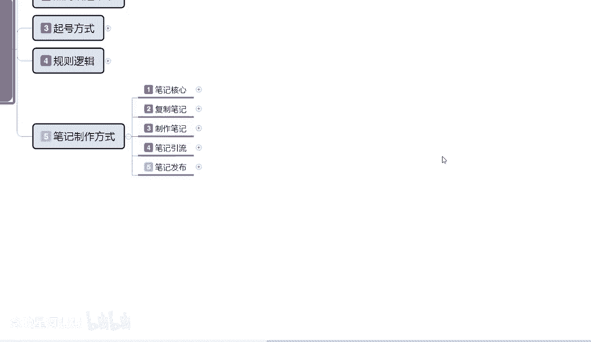

# 【2024版小红书体运营教程】全B站最良心的小红书开店运营高阶教程合集，从0开始做小红书体开店 ,起号真的快!!! - P17：p6.4复制笔记 - 念晚星河漫漫 - BV1wT421Y7FM

大家好，这一节给大家分享的是小红书全集系列，第五大课时的一个复制笔记内容啊。

实际效果的一个概况，接着我们上节课的一个内容，接着往下面进行分享。

实际效果概况是什么意思呢，就是说我们在内容分类和复制分类里面的话，我们把它的整体产品复制过来以后，他会给我们呃，怎么说呢，就是曝光的属性不一样啊，我们先看内容的内容分类。

内容分类里面的话是三个点，第一个是产品内容，第二个是引流内容，第三个是分享内容啊，就是对应我们复制内容选择的三个选项呃，小红书复制产品内容实际效果的话只有冷，他就说你复制别人的笔记，或者复制别人的商品。

如果说你是在小红书上面找的，那他整体的话只有原商品，5%到20%的一个作率引流效果，那我们再去找复制的一个内容的时候，你的复制目标啊，不要找完全爆款，你要找5000到2万左右的一个。

小眼镜的产品进行复制，太低了，没有效果，太高了，你把握不住，懂我意思吧，太高了的话，你那个发布出去以后的话，根本就没有你曝光的机会，所以说我们最好找的话，就是找5000到2万之间的一个。

小眼睛数量的一个爆款笔记去做啊，太高了也不行，太低了也不行啊，它整体的话就是有原理，有产品，你产品内容复制，这个是产品，就是你笔记内容复制，别人比啊产品的一个笔记内容过来的话，他只有原商品。

5%到20%的一个左右效果，如果说你复制的对方是1万，那么在你这的话，它整体的一个曝光量的话，可能是在嗯2000到3000，但是这个2000到3000的一个整体曝光量，还是要根据你账号权重来的。

你账号如果说没有权重的话，那就是50到200之间，如果说你在第二层级的一个数据量的话，那它的一个属性就是500到2000之间了，懂吧，500到2000之间，你在第二层级就能完全吃下。

就5%到20%的一个流量属性，同时呢它产品内幕不同啊，复制效果展示的话就说嗯也不相同，最多的复制效果也就是20%左右啊，这里呢我是给大家把它列出来了啊，大类目服装饰品食品，包括其他的他的一个整体比例。

在这个地方就说服装的话，他整体复制效果会比较差一点，因为他的产品类型太多，整体的话比例可能只只能付得到复制效果的，5%到7%，饰品的话他就是10%接近到15%，因为他是小众类商品。

它的搜索人群虽然说比较广广泛，但是他的花样是非常多的，说说他整体复制过来的笔记，他的引流效果也是非常不错的啊，因为有些人他看得到，有些人他看不到嗯，这个里面的话就涉及到，我们是产品上架的一个时间。

搜索的一个时间，就看我们自己怎么排序了，好吧，食品的话就基本上在10%以上啊，他不会低于10%以下，你因为他的内幕大众内，但是搜索人群比较小，其他的话怎么说呢，就说你按照产品产品的大小来划分啊。

产品个头比较大的，他销量就比较小，因为它的价值比较高，复制效果的话就会超过15%，同样的啊，你产品小销量大的，那你的效果的话基本上就占5%左右啊，不会超过这个概，你概率整体概念如果说是小众类目的话啊。

整体的一个复制笔记内容，引流的效果可以达到10%左右，就看我们自己复制内容的时候，你自己怎么去选啊，当然了，你复制别人笔记的时候，你也不能逮着一只羊薅毛啊，多选几个，多观察一下，你逮着一只羊薅毛的话。

别人别人会把你认为是他的那个子账号啊，别人开店，你的子账号会把你进行封号处理的啊，稍微注意一下，然后他整体的话就说引流内容，引流内容的话相对于产品内容的话，他引流效果会好一点。

因为它不属于直接和店铺有关联的，引流效果，一般的话就是说在20%左右啊，当然了，这个还是要看账号权重的，你账号权重有了，你才能做到20%，你前期你一个新店，你想把别人这个2万左右的一块报。

爆款笔记完全复制过来，然后自己去发，获得2000的一个小眼睛数量，那不可能你最多也就200吧，知道吧，因为那是你账号权重不够，不是你的笔记有问题啊，不是你负责别人笔记有问题，是你账号权重不够。

这个大家要弄清楚了啊，同样的分享内容也是啊，分享内容如果说是完全复制的话，展示概率的话只有5%以下，基本上分享内容的话怎么说呢，这一方面的内容建议大家自己去做啊，因为他这个的话说实话它比较不入正点。

比较步入正题啊，因为你分享的就是你所属产品，或者说你复制别人的内容啊，你自己不是很了解的啊，尽量不要去，你稍微了解一点，你可以复制过来以后修改，然后进行分享就可以了啊，这个就是内容分类的一个整体。

那下面呢就是给大家讲解一下啊，父子分类复制分类的话其实比较简单了啊，完全复制主体复制和格式复制这三个点，这三个类型就是说实际商品引流效果的话，他只有百分之完全体复制，就是你复制别人的属性过来的话。

他只有1%到5%，基本上不会有什么观看，不做修改的商品，复制的话只能做店选啊，提高整体展示而已，它基本上就没有什么其他效果了，要不就被屏蔽，要不就没有展示主体复制主体复制的话，商品也是有一定权重的啊。

只是他展示的权重不是自己制作的，只能有30%的一个整体权重，就是你把他的数据属性修改了以后，你可以获得他原有笔记，30%左右的一个曝光量啊，当然了，别人看过的或者说同类型的做的太多的话。

你整体获得的效果可能不到30%，你能获得10%到15%就不错了，但是他整体曝光的话，基本上都是给你30%，只是很多人重复观看以后，他就对你这个不感兴趣了啊，他知道你是模仿别人的格式复制也是一样。

但是格式复制的话，它效果会更好啊，他的整体效果的话，效果比例基本上接近60%到80%，接近原创啊，接近于原创，但是你不能完全就是说嗯去模仿，也不能说一直去模仿，懂吗，你也要自己想办法自己制作一点。

这个呢就是整个父子笔记的一个实际效果，概况啊，嗯后面还有一个内容是试用店铺范围，因为这个内容不多的话，我就在这一节里面给大家直接进行讲解了啊。

因为试用店铺范围的话，其实我在上面给大家做这个复制分类，包括复制内容选项的时候，还有那个修改内容的时候。

其实他就是一个总结而已啊，它适用的一个店铺范围啊，就是完全体复制的话，它只适用于店群，你如果说做店群的话，你们完全可复制，可以通过每天上传的一个笔记进行引流，每天每单的话。

就是每个单品产品不超过两篇笔记就没关系，店铺不超过五篇笔记就可以啊，这是属性上限啊，你发第六篇笔记的基本上没作用的，就说你一个店铺应该说是一个账号，一个店铺里面每天最多发五个笔记啊。

每一个商品每天最多发两篇笔记，不能超过这个数量啊，超过这个数量的话，基本上就被屏蔽了，没有没有什么实际效果的好吧，然后主体负责啊，适用于新人，整体小红书操作起来的话。

相对于其他平台整体来说的话还是比较简单的，所以我们在操作小红书的时候，用这个方式可以先熟悉整体的一个操作模式啊，然后再去做属于我们自己的一个产品风格，就可以了，如果说你把这几个点把握不住的话啊。

做主体复制去学习一下别人的方式，还是非常不错的，格式数字你就要有一点那个怎么说呢，有要有一点经验啊，它适用于他能整体适用于有一定经验，但是没有固定产品固定来源的人，降低整体需求和投入啊。

就说他整体的话投入是不大，因为你顶多就是把别人的东西复制过来，然后自己做一做一做修改，做一做美工，做一做修图啊，然后把自己选综艺的产品，然后放上去赚，赚取一个差价而已啊。

他使用一件代发的话是有一定的市场前景的啊，有一定的操作空间，就说你要有经验和店铺的一个构思，就可以按照这个方式去操作，简单也有一定的整体操作空间，如果说你没有思路的话，建议你们还是做主体复制就可以了。

这个主体复制你学一段时间的话，基本上半个月左右，你就能把这个账号弄得明明白白，然后就可以开始做下一步制作笔记了啊，那这一节啊父子笔记的内容，最后一节也给大家讲完了，下一节开课开始呢。

就教大家怎么制作笔记啊，小红书的一个整体笔记制作，他其实和父子笔记差不多，只是说他的一个模式和方式不一样啊，需要我们自己动手。

