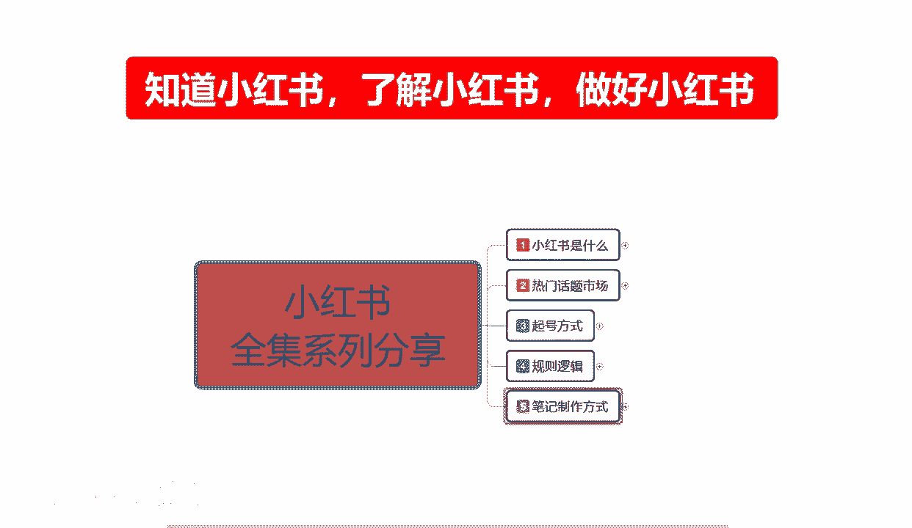
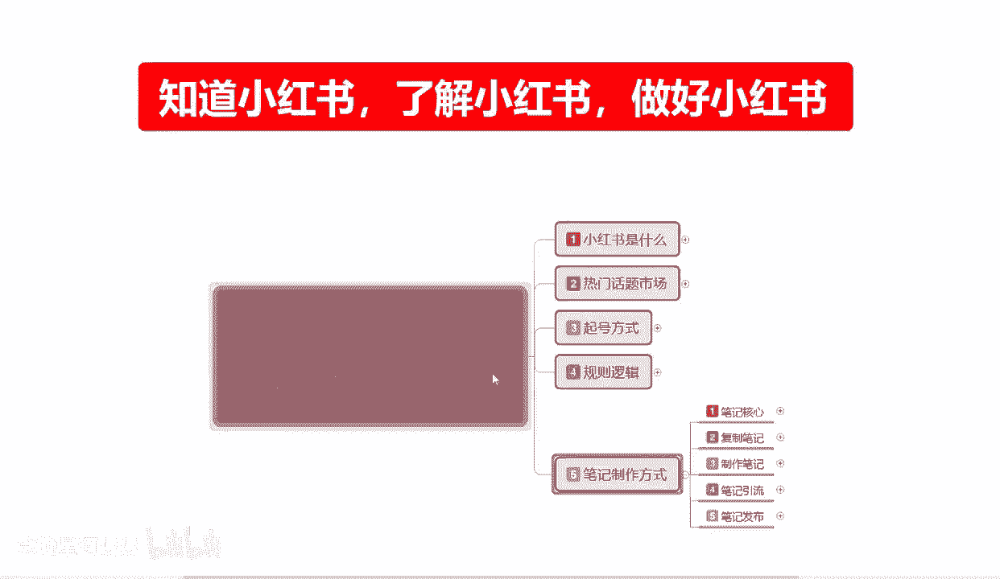
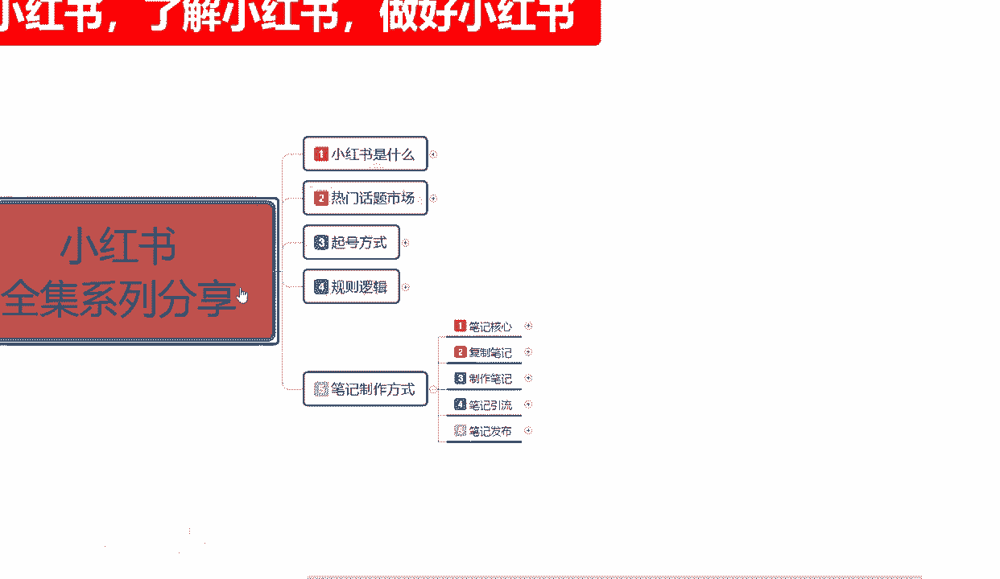
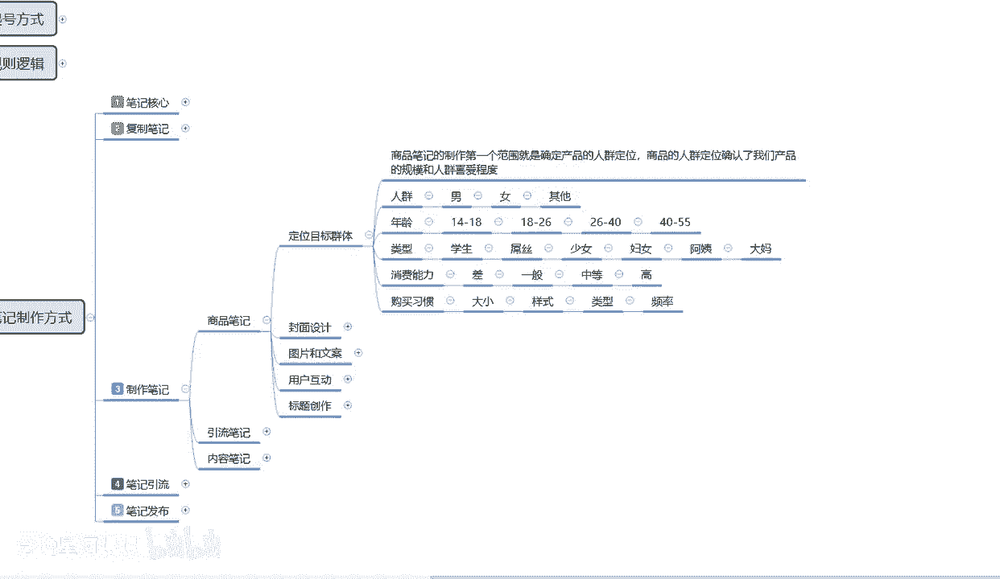

# 【2024版小红书体运营教程】全B站最良心的小红书开店运营高阶教程合集，从0开始做小红书体开店 ,起号真的快!!! - P18：p7.1笔记制作 - 念晚星河漫漫 - BV1wT421Y7FM

大家好，今天给大家分享的是小红书全集系列的第五大，课时笔记制作方式的第三个内容啊。

制作笔记，这个制作笔记的话。

需要我们对小红书有一定的了解，你才可以去制作，如果说你对小红书不是太了解的话。

你建议你们去先把父子笔记学一下啊，那我们来了解一下制作笔记它都有哪个点，制作笔记的话，其实我在这里呢是给大家把它分为了三个点啊，第一个是商品笔记，第二个是引流笔记，第三个是内容笔记。

这三个点它是一个整体，但是我们需要把它给分开啊，我希望大家明白这个意思啊，商品笔记也好，引流笔记也好，内容笔记也好，他们其实是一个整体，但是我们要把它分开，因为小红书整个系统，它所对应的一个曝光和展示。

他都在这三个点里面，如果说你不把它分开，我们去操作的话，那你只你比方说你做了商品笔记，那你没有引流笔记和内容笔记的话，那你可能只有5%左右的一个流量曝光，你做了引流，不做内容和商品。

那你获得了80%的曝光量，也没有用，懂我意思吧，他们三个是一个整体，但是你必须分开来制作啊，首先我们来了解一下商品笔记，小红书上面笔记制作的话，其实还是比较简单的，在这个里面的话。

他有一个嗯我们从定位目标群体开始啊，第二个是封面设计，第三个是图片和文案，我们怎么去排版，第四个是用户互动啊，商品笔记你做完发布以后，他有一个用户互动，你要去操作的，当然了，这种用户互动的话。

你也可以用多篇笔记进行联动去互动啊，第五个点呢就教大家啊，怎么去排版我们商品笔记的一个标题创作啊，怎么去操作，首先我们了解一下啊，定位目标群体是什么意思，大家如果说接触电商时间长了以后的话。

对于那个目标群体的一个定位的话，其实还是非常明确的啊，这里我只是说给大家列了一个，大概的一个范围啊，当然我这个范围的话不是准确的，准确的话，他其实还要细分的啊，但是我这边因为是直接做的课件。

我就没有给大家区分的太具体，我也只给大家做了，随便做了几个分类啊，它整体细分的话，其实你们可以在店铺人群里面去看啊，自己选择一个范围内去操作就行，商品笔记制作的第一个范围，就是说确认我们产品的一个人群。

定位商品的一个人群，确定我们产品的规模和人群的一个喜爱程度，什么意思呢，就是说你的产品你选好产品以后啊，你产品对应的人群其实就已经固定出来了，如果说你没有固定出来，那我劝你把它做固定出来。

因为商品笔记他要的就是精准，因为精准了以后，他才会有访客进来，你的图片做的好看了以后，他才会有转化率，转化率提升了，你才能提升排名，获得更多的曝光，如果说你的一个准确率不足。

你本来是卖给18~26岁的这个范围，他应该属于两个阶段范围，四岁4年一个范围啊，他如果说你卖到18~26，这个范围的一个产品，结果你的商品属性也好，不应该说是你的店铺属性也好，和你的账号属性也好。

你的属性做的偏移了，做到24，26~40了，那你觉得你这个商品笔记发数据有多少人，看对吧，本来流量曝光就不高，你再这么一弄，那你的属性就更低了，你点击跟不上来啊，曝光给你了，点击跟不上来，转化跟不上来。

那你这个后续的话他就做不起来，懂我意思吧，所以说一定要先把自己的一个定位，目标人群给做好，小红书这个里面啊，人群可以把它分为三类啊，不能分两类，虽然说人群种类是两类男女，但第三类的话。

他是同性之间相互购买的一个产品，因为我们做的是商品，所以说他有同性，对不对啊，我给我的同学代买，他喜欢什么样的一个类型，你要把这个考虑进去，或者说你有些东西就是卖给同性的对吧，但是他比较少啊。

只是说我把它放在这个地方给大家，让大家了解一下，不要把那个局限性在小红书上面，你做做电啊，局限性不要太大啊，懂意思吧，懂意思的就懂，不懂意思的话啊是吧，第二个就是年龄选项，年龄选项的话。

14~18这个选项的话，你只能做什么样的一个产品，卖给学生和那种未成年人的一个产品，怎么说呢，14~18国家法定年龄的话，其实他连判刑都不够的，那在这个范围以内，他们其实在小红书上面，女性女性也好啊。

男性也好，男性偏少，基本上没有，基本上都是14岁到18的一个小小女孩啊，嗯在社会上读书读不进去，然后的话辍学啊，不听家里忙话辍学，或者说是有一定的社会经验啊，比较自由的接应高中生啊，初高一高二高三的。

或者说是初三调皮的，他们有手机的可能会逛一逛小红书，但是他们整体购买的欲望不是太大啊，而且有一个重点在这个里面，他们要么没钱，要么很有钱啊，其中的构想你们自己去想。

这一帮女这一帮小朋友在这个里面挤聚集的话，说实话对我来说就是小朋友啊，在这里面聚集的话，他们的一个消费整体水平，如果说你把目标群体定位在这，那你就要好好考虑一下，你的产品是否够精致和吸引你。

只要做这两点非常好做，你要做不到这两点的话，说实话这一组人群的话，你可以直接跳过了好吧，就是人群14到十八十八，26，26，四十四十到55之间，这四个人四个年龄阶段，你选一个去操作就够了啊。

类型的话就是学生屌丝少女妇女阿姨和大妈，大家要注意一点，我在上面是没有列男性的哦，你如果说在小红书上面做男性产品可以做，但是很难啊，很难，除非说是你有比较浓厚的基础可以做，没有太好的一个基础的话。

建议不要做男性产品，做男性产品你也只能做大众的，大众什么的也行，呃，服装类的衣服，鞋子帽子车类的车上的一个摆件，挂件饰品，这就是偏男性用户的一个产品选项啊，其他的产品基本上都不好做的嗯。

还有一种就是茶几之类的，就是长年龄偏大的，因为小红书男性的话，说实话他基本上都是在35~45之间啊，35~45之间的人，男性逛小红书的比较多，30~35之间的，他们目的目标是很明确的。

那个那帮人你就不用管他们了啊，你把他们当屌丝就行，不用管他们，你如果说想卖男性产品，那你的男性产品定位的话，基本上就是在35~45啊，接近50啊，中年老板爱喝茶啊，你可以卖卖家具之类的。

或者说是卖卖手把剑之类的也可以啊，然后消费能力啊，你要你要弄清楚啊，他这个里面的消费能力的话分为差，一般中等和高等，他都是有对应选项的，小红书连女性里面18~35之间啊，这个里面的话我把它划分到40了。

其实48~35之间，这一帮女性她们都属于什么范围呢，中等和高，有钱任性，那就看你自己能不能把别人的钱给弄出来了啊，购买习惯的话就是大小样式类型和频率，这个是根据用户账号来确认的。

你如果说我们前期去做自己数据的话，你也要按照这种啊，找几个对应的一个人群去自己的产品啊，操作一下，把属性弄一下就可以了，这个就是整体的小红书定位目标群体，好吧，那这节课呢就给大家讲到这。

