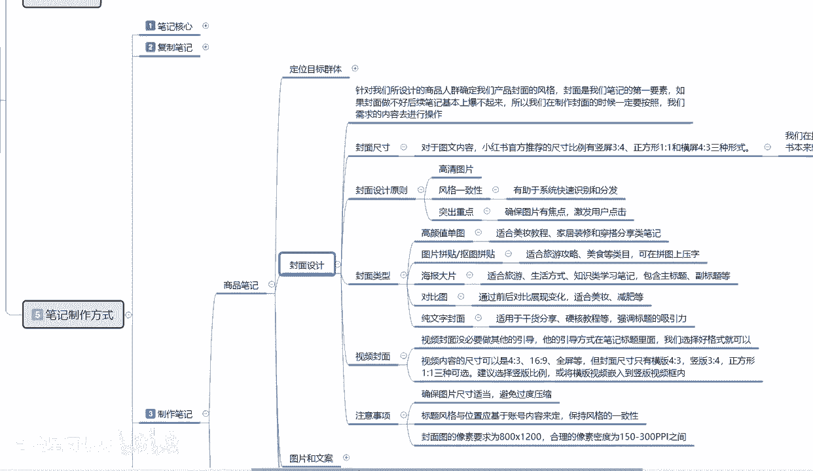

# 【2024版小红书体运营教程】全B站最良心的小红书开店运营高阶教程合集，从0开始做小红书体开店 ,起号真的快!!! - P19：p7.2笔记制作 - 念晚星河漫漫 - BV1wT421Y7FM

大家好，这一节给大家分享的是小红书全集系列的第，五大课时啊，里面的一个制作笔记内容。

这节课的话结合，接着我们上节课给大家的一个内容往下面讲。

上节课的话是给大家讲解了一下，我们定位目标群体啊，就是我们商品选择对应的一个人群，你人群如果说选择不准的话，那你后期做的一个封面设计啊，做其他的其实用处不大啊，接着步入我们的小红书笔记核心。

第一个大重点封面设计，封面设计，这个是说实话，因为我不选择固定产品给大家去进行分解，分类讲解，那我们在做封面设计的时候，它针对我们所设计的一个商品人群，确确定以后啊，我们产品的一个封面的一个风格啊。

是比较重要的一个环节，封面是我们笔记第一要素啊，如果说我们封面做的不好，你后续的笔记基本上报不起来，所以说我们在制作封面的时候，一定要按照我们的需求和内容进行操作，我在这里呢我就不给大家做示范了啊。

就说我们整体选封面的时候。

他这个封面里面封面的尺寸。

封面的设计，封面的原则，封面的类型啊，视频封面和注意事项，我们大家都了解一下啊，首先是封面的尺寸，对于图文类的一个内容啊，小红书官方推荐的尺寸的话，它比例是竖屏三比四，正方形。

一比一和横屏四比三三种方式，但是啊这里面有一个。

但是啊我们在操作的时候，商品笔记一定要选择三比四的比例，小红书你不管怎么去做，你就算是视频也好，图片也好，文字文案也好，你记住了啊，所有的比例只要是你做笔记的，所有的比例一定要按照三比四的比例去发放。

你四比三的那种比例的话，你去做了以后，它类似于横屏，知道吧，你现在觉得你刷抖音或者是玩其他的，你看见横屏爽了吗，除非你是去在在拿手机去打游戏，不然谁看见横屏它都不舒服啊，本来这个姿势躺的好好的。

你让我换个屏幕，换个方向，我怎么都不舒服，知道吧，就说没人喜欢像看电影一样的方式，去看你的一个小红书作品啊，所以说三比例的比例是最好的，你不管去做其他的什么方式，他都是三比四的比例是最好的，视频也好。

图片也好，文字文案也好啊，这个等负面的尺寸，大家一定要把它弄清楚啊，第二个点就是说封面的设计。

封面设计的话，他其实是保证几个原则点就可以了啊，第一个图片一定要高清，你是视频的话就无所谓了啊，你视频拍摄的尽量要拍高清的，你不能拍模糊的，但是你拍出来什么效果的话，那就跟你手机有关系了。

但是高清图片的话，我们自己可以去调的懂吧，你可以经过后期的一个加工，把他的整体数据把它优化掉，把它做成高清图片就可以了，第二个是风格一致，第三个是突出重点，风格一致是什么呢。

就是说我们在小红书发笔记的时候，你的所有笔记内容风格要一样的，懂我意思吧，你不能说今天我发个春天的，明天我发个夏天的啊，我今天发个秋天的背景，明天发个雪，冬天的背景，今天发个摩托车，后天发个游艇。

这不行，知道吗，小红书它的系统读取没有那么强大，它会根据你的风格系统，你比方说我一直发的是秋天的T恤，然后背景是白色的，然后我后续发的红色T恤，蓝色T恤，紫色T恤，我的背景他也要是白色的，懂意思吧。

你的风格保持一致了以后，他可以给我们在小红书系统里发笔记的时候，审核会很简单，如果说你的发的比较复杂，小红书系统后台审核的时间就会非常长，有的笔记如果说你内容虽然说是原创的。

但是你的整体内容内容素材非常多，而且和你以往的风格形式不同，他就会去查系统，查系统，那快走5分钟，慢则一天到两天，那你觉得你这篇笔记本来是嗯星期一发的，或者是星期天早高峰期时的时候发的。

想抢占前5分钟的一个市场，结果他一审核给你审核，来到两天以后了，那你觉得你这篇笔记发出去还有多大的效果，流量大打折扣，所以说保持它整体的风格，能提升小红书笔记过审的几率，第三个点就是突出重点。

确保图片与焦点啊，激发用户的一个点击，就看这个这个就靠我们美工了啊，你美工做的好，图片点击率越高，你美工做的不好，你图片点击你就上不去，当然了，图片里上面加文案，加文字也是一种方式和技巧啊。

整体整体规划的就看我们自己的脑回路和思路，够不够清晰明确，这个就是封封面设计的一个原则啊，原则性问题你不能变，你一变的话，你到时候出什么问题了。

别说我没教啊，第三个点封面类型，封面类型的话其实就比较简单了，我就不过多讲解了，在这里大家可以自己看一下，第一个是高颜值单图，你觉得自己长得好看，自己把自己拍上去都行，你不行的话，你去百度啊，去谷歌啊。

或者说去国外的其他什么网站啊，搜一些美女图片，然后把他P上去也是一样的啊，高颜值单图它的点击率会偏偏高一点，如果说你想做点类似于擦边的话，效果会更好啊，但是他的人群不准，你如果说做类似插片的话。

人群不准，你最好的话，小红书上面你要做女性用户的一个产品的话，你要做引流的话，做擦边可以对吧，你做内容分享，做擦边可以，但是做商品的话尽量不要往这个方面靠啊，少靠靠了靠多了不好啊，然后图片拼贴啊。

抠图海报大片对比图，纯文字封面啊，这里面呢它适合什么样的类型，适合什么样的商品，我也给大家啊，呃把它列出来了，你们如果说感兴趣就仔细看一看，多的我就不过多多讲了，我们讲下面一个内容，视频那个封面啊。

视封视频封面的话，其实没必要做任何的其他引导，你视频封面，你把第一张图片的话做的好看一点，就是初步接待啊，能不能给人惊艳的一个感觉，别人点进去小红书里面看视频的也不少啊，现在越来越多了。

你能不能在第一眼给别人一个感觉，就是你后续的一个点击率的一个啧，嗯属性点好吧，比例也是一样的啊，视频内容的尺寸的话它是四比三，16比九全平等，但封面的尺寸的话只有四比三的一个横版啊。

竖版正方形一比一三种选项，建议的话就是说竖版的四比三比例啊，你做其他的，那就是你自己相机也好，手机也好，其他设置的一个问题好吧，最后一点是注意思想注意事项啊，确保图片尺寸大小。

适当避免的话就说过度压缩了，因为你的图片过度压缩以后，你上传到小红书以后的话，他那个是真的懂我意思吧，你图片失真的这个图片就没办法看了啊，第二个就是标题的风格与位置啊，基于账号内容来定。

就说保持风格它是一样的，就你设标题的时候，一定要和你的封面匹配，你的封面一定要和你的产品匹配，这三个点啊一定要保持一致，它的通过率才高，小红书笔记，现在的话它不像以前你发什么都给你推。

你现在他是有筛选的，而且筛选时间的话比较长啊，这句话我们去发表一篇笔记的话，嗯你是保持你之前发过的同类的一个文案的话，两秒钟就上去了，你要是之前没发过一个全新的，然后内容的话又杂七杂八的，那上去5分钟。

10分钟，半个小时都有可能好吧，封面图的一个像素要求的话，就是说呃800×1下，合理的像素密度为100~300pp之间，这个就看大家如果说对美国之类的知道的话，基本上都了解，这个不知道的话。

你就拿他的原图，你把他的那个图片大小放到800，到乘1200就行了，基本上都是这个比例。

这个就是整体的一个封面设计好吧，那这一节分享呢就给大家讲到这，下一节呢给大家分享的是图片和文案。

